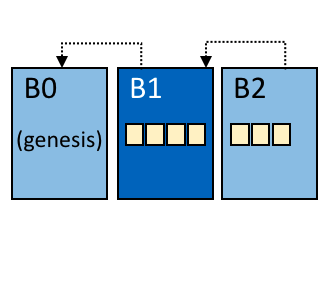
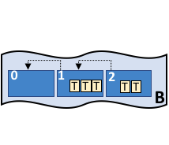
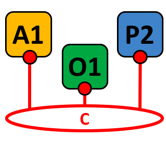
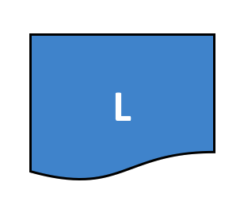
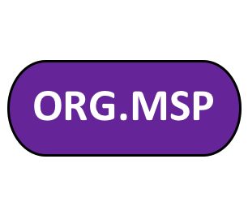
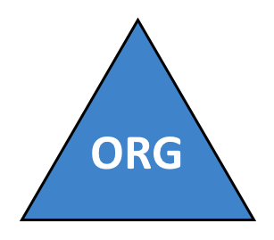
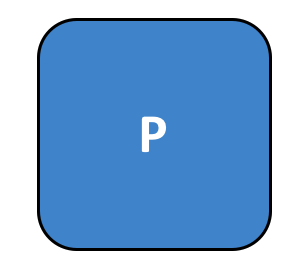
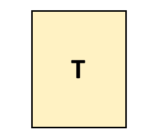
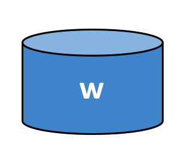

مسرد المصطلحات (Glossary)
===========================

المصطلحات (Terminology) مهمة جدًا، علشان كل مستخدمي ومطوّري Hyperledger Fabric يكونوا على نفس الصفحة ويفهموا كل مصطلح بدقة.
مثال: إيه المقصود بـ smart contract.

الدوكس هتشير للـ glossary لما تحتاج، لكن لو حابب، ممكن تقرأه كله مرة واحدة — وصدقني، هتلاقيه مفيد جدًا ويوضح الصورة كاملة!

.. _Anchor-Peer:

Anchor Peer (نقطة التواصل الرئيسية)
-----------

بيستخدمه gossip علشان يضمن إن الـ peers في منظمات مختلفة يعرفوا عن بعضهم البعض.

لما يتم commit لكتلة configuration block فيها تحديث للـ anchor peers، الـ peers بيتواصلوا مع الـ anchor peers ويتعلموا منهم عن كل الـ peers اللي معروفين للـ anchor peer(s).
بمجرد ما على الأقل peer واحد من كل منظمة يتواصل مع anchor peer، الـ anchor peer نفسه بيعرف عن كل peer موجود في القناة (channel).
وبما إن gossip communication مستمرة، والـ peers دايمًا بيطلبوا يتم إعلامهم عن أي peer جديد مش معروف ليهم، ده بيخلق common view of membership للقناة.

مثال عملي:
افترض إن عندنا ثلاث منظمات — `A`, `B`, `C` — في القناة، وفي anchor peer واحد فقط — `peer0.orgC` — معرف للمنظمة `C`.

* لما `peer1.orgA` (من المنظمة `A`) يتواصل مع `peer0.orgC`، هيخبره عن `peer0.orgA`.
* وبعد فترة، لما `peer1.orgB` يتواصل مع `peer0.orgC`، الأخير هيبلغه عن `peer0.orgA` كمان.

من النقطة دي فصاعدًا، المنظمات `A` و`B` هتبدأ تتبادل معلومات العضوية (membership information) مباشرة من غير الحاجة لأي مساعدة من `peer0.orgC`.

علشان التواصل بين المنظمات يعتمد على gossip، لازم يكون فيه at least one anchor peer معرف في إعدادات القناة (channel configuration).
ويُوصى بشدة إن كل منظمة توفر anchor peers خاصة بها لضمان high availability وredundancy.


.. _glossary_ACL:

ACL (قائمة التحكم في الوصول)
--------------------------

الـ ACL (Access Control List) بتربط الوصول لموارد معينة في الـ peer (زي system chaincode APIs أو event services) بسياسة (Policy) معينة تحدد عدد وأنواع المنظمات أو الأدوار المطلوبة للوصول.

الـ ACL جزء من إعدادات القناة (channel configuration)، وبالتالي بتتخزن في configuration blocks الخاصة بالقناة، وممكن تحديثها باستخدام standard configuration update mechanism.

الـ ACL بيكون على شكل key-value pairs:

* الـ key بيحدّد المورد (resource) اللي عايزين نتحكّم في الوصول ليه،
* الـ value بيحدّد الـ channel policy (group) المسموح لها الوصول للمورد ده.

مثال:
```
lscc/GetDeploymentSpec: /Channel/Application/Readers
```
المثال ده معناه إن الوصول للـ life cycle chaincode API الخاص بـ `GetDeploymentSpec` متاح فقط للـ identities اللي بتستوفي شروط سياسة `/Channel/Application/Readers`.

.. _glossary_Block:

الكتلة (Block)
------------

الكتلة (Block) هي سجل يحتوي على مجموعة من المعاملات (transactions) المصدّقة والمرتبة. كل كتلة تحتوي على:

* Header: فيه معلومات تعريفية عن الكتلة نفسها.
* Data: فيه قائمة بالمعاملات.
* Metadata: فيه معلومات إضافية زمنية وتوقيعات رقمية.

الكتل بتكون مرتبطة ببعضها بشكل تسلسلي (سلسلة - chain) عن طريق hash الكتلة السابقة، وده اللي بيخلّيها blockchain آمنة.

.. _glossary_Chaincode:

العقود الذكية (Chaincode)
----------------------

الـ chaincode (المعروف برضه باسم smart contract) هو برنامج بيكتبه المطورين بلغة برمجة معينة (زي Go أو JavaScript) ويتم نشره على الشبكة. وظيفته:

* إدارة الحالة (state) بتاعة الـ ledger.
* تنفيذ business logic.
* التعامل مع المعاملات (transactions).

الـ chaincode يعمل في حاوية معزولة (sandbox) في peers، وبيتم استدعاؤه بناءً على الطلبات المقدمة من التطبيقات.

.. _glossary_Consensus:

الإجماع (Consensus)
-----------------

الـ consensus هو العملية اللي بتضمن إن كل nodes في الشبكة متوافقين على state الـ ledger. في Hyperledger Fabric، عملية الإجماع بتتضمن:

1. Proposal: العميل يبعت طلب معاملة.
2. Endorsement: الـ endorsing peers بتحقق من صحة المعاملة وتوقع عليها.
3. Ordering: الـ orderer بيدير ترتيب المعاملات ويحولها لكتل.
4. Validation and Commit: كل peer بيحقق من صحة الكتلة ويضيفها للـ ledger.

.. _glossary_Endorsement:

التأييد (Endorsement)
------------------

الـ endorsement هو عملية توقيع معاملة من قبل endorsing peers بناءً على endorsement policy محددة. كل chaincode عنده endorsement policy بتحدد:

* عدد peers اللي لازم يوافقوا على المعاملة.
* أي organizations المفروض تشارك في عملية التأييد.

المعاملة مش بتتسجل في الـ ledger إلا لما تتحقق وتتأكد صحتها من العدد المطلوب من endorsing peers.

.. _glossary_Ledger:

سجل المعاملات (Ledger)
-------------------

الـ ledger هو سجل غير قابل للتغيير (immutable) فيه كل المعاملات اللي حصلت في الشبكة. بيتكون من:

* Blockchain: فيه السجل الزمني لكل المعاملات.
* World State: فيه آخر حالة لكل key-value pairs.

كل peer عنده نسخة من الـ ledger بتاعته، وبيتم تحديثها باستمرار عن طريق gossip protocol.

.. _glossary_Orderer:

منظم المعاملات (Orderer)
----------------------

الـ orderer هو المكون المسؤول عن:

* استقبال المعاملات من العملاء.
* تنظيمها في كتل (blocks).
* توزيع الـ blocks على peers.

ده بيساعد في تحقيق consensus في الشبكة.

.. _glossary_Peer:

العقدة (Peer)
-----------

الـ peer هو عقدة في الشبكة بتشغل Fabric وبتساهم في الحفاظ على الـ ledger.

في كل peer فيه:
* Ledger: نسخة من سجل المعاملات.
* Chaincode: العقود الذكية.
* Membership Services Provider (MSP): للتحقق من هوية المستخدمين.

.. _glossary_Private_Data:

البيانات الخاصة (Private Data)
---------------------------

الـ private data هو نوع من البيانات اللي بتكون متاحة فقط لمجموعة معينة من organizations في القناة، حتى لو إن باقي الـ organizations في نفس القناة مش شايفينها.

الـ private data بيتخزن في private database خاص بكل organization، وبيتم مشاركته فقط مع المنظمات المصرح لها.

.. _glossary_Smart_Contract:

العقود الذكية (Smart Contracts)
----------------------------

الـ smart contract (المعروف برضه باسم chaincode) هو برنامج بيتم تنفيذه على الـ blockchain. وظيفته:

* إدارة الحالة (state).
* تنفيذ business logic.
* التعامل مع المعاملات (transactions).

الـ smart contracts في Fabric بيكتبوها المطورين بلغات برمجة تقليدية (زي Go أو JavaScript) بدل لغات خاصة.

.. _glossary_Transaction:

المعاملة (Transaction)
-------------------

الـ transaction هي عملية تغيير في حالة الـ ledger. كل معاملة بتمر بمراحل:

1. Proposal: العميل بيبعت طلب تنفيذ chaincode.
2. Endorsement: الـ endorsing peers بيحققوا من صحة الطلب.
3. Ordering: الـ orderer بيجمع المعاملات في كتل.
4. Validation and Commit: كل peer بيحقق من صحة الكتلة ويضيفها للـ ledger.

.. _glossary_World_State:

حالة العالم (World State)
---------------------

الـ world state هو قاعدة بيانات key-value فيها أحدث حالة للـ ledger. بتحتوي على:

* Key: معرف فريد لكل عنصر (مثل: `asset1`).
* Value: البيانات الحالية للعنصر.
* Version: رقم الإصدار الحالي.

الـ world state بيتم تحديثه تلقائيًا مع كل معاملة ناجحة، وبيوفر وصول سريع للبيانات بدل البحث في سلسلة الكتل الكاملة.
`/Channel/Application/Readers`.

كمان، فيه مجموعة default ACLs موجودة في ملف `configtx.yaml` اللي بيستخدمه configtxgen لبناء إعدادات القنوات (channel configurations).
الـ defaults ممكن تتحط في قسم Application على مستوى أعلى في الملف، أو ممكن تتغيّر لكل profile في قسم Profiles.


.. _Block:

Block (وحدة المعاملة في السلسلة)
-----



   Block B1 is linked to block B0. Block B2 is linked to block B1.

=======

الـ Block بيحتوي على مجموعة ordered transactions.
كل Block مرتبط تشفيرياً (cryptographically linked) بالـ Block اللي قبله، وكمان مرتبط بالـ Blocks اللي بعدها في السلسلة.

أول Block في أي سلسلة بيُسمّى genesis block.
الـ Blocks بيتم إنشاؤها بواسطة ordering service، وبعد كده بيتم validate وcommit ليها بواسطة الـ peers.

.. _Chain:


Chain (سلسلة)
-----



   Blockchain B contains blocks 0, 1, 2.

=======

سلسلة الـ ledger هي transaction log منظمة على شكل hash-linked Blocks من المعاملات (transactions).
الـ peers بيستقبلوا Blocks من ordering service، وبعدين بيحددوا كل transaction داخل الـ Block إذا كانت valid أو invalid بناءً على endorsement policies أو أي concurrency violations.
بعد كده، الـ Block بيتضاف للـ hash chain على نظام الملفات (file system) الخاص بالـ peer.

.. _chaincode:

Chaincode (كود التطبيق الذكي على الـ Blockchain)
---------
الـ Chaincode هو الكود اللي بيحدد business logic للـ smart contract على شبكة Fabric.
الـ Chaincode بيتنفذ في بيئة معزولة (زي Docker container) وبيتعامل مع الـ ledger من غير الوصول المباشر للحالة الداخلية بتاعته.
ممكن يتكتب باستخدام standard programming languages زي Go, Java, Node.js، وده بيسمح للمطورين اللي عندهم خبرة باللغات دي ينفذوا smart contracts من غير ما يتعلموا DSL جديد.

See Smart-Contract_.

.. _Channel:

Channel (قناة)
-------



   Channel C connects application A1, peer P2 and ordering service O1.

=======

الـ channel هي private blockchain overlay بتسمح بـ data isolation وconfidentiality.
كل channel ليه ledger خاص بيها، بيتشارك بين كل الـ peers اللي جوه القناة.
كمان، أي طرف عايز يتعامل مع القناة لازم يكون authenticated عشان يقدر يتفاعل معاها.
Configuration-Block_.


.. _Commit:

Commit (إضافة أو كتابة)
------

كل Peer موجود في قناة بيقوم بـ validate للـ ordered blocks of transactions، وبعدين بيعمل commit (يعني يكتب أو يضيف) الـ Blocks على نسخة replica الخاصة بيه من channel Ledger.
كمان، الـ Peers بيحددوا لكل transaction داخل كل Block إذا كانت valid أو invalid.

.. _Concurrency-Control-Version-Check:

Concurrency Control Version Check (آلية مراقبة تزامن الحالة)
---------------------------------

دي طريقة لضمان إن ledger state تفضل in sync بين كل الـ peers في القناة (channel).

الـ peers بينفّذوا transactions بشكل parallel، وقبل ما يعملوا commit على الـ ledger، بيشيكوا إذا كانت البيانات (state) اللي اتقرأت وقت تنفيذ الـ transaction اتغيرت ولا لأ.

لو البيانات اتغيرت بين وقت التنفيذ (execution time) ووقت الحفظ (commit time)، ده بيعتبر Concurrency Control Version Check violation.

في الحالة دي، الـ transaction بيتعلّم عليها إنها invalid على الـ ledger، والقيم ما بتتحدثش في state database.

.. _Configuration-Block:

Configuration Block (كتلة الإعدادات)
-------------------

الـ Configuration Block بيحتوي على configuration data اللي بتحدد الأعضاء (members) والسياسات (policies) الخاصة بـ system chain (بتاع ordering service) أو القناة (channel).

أي تغييرات في الإعدادات سواء على القناة أو الشبكة ككل (زي دخول أو خروج عضو) هتؤدي لإنشاء configuration block جديد يضاف على chain المناسبة.
الـ block ده هيحتوي على محتويات genesis block بالإضافة للتغييرات الجديدة (delta).

.. _Consensus:

Consensus (اليقين أو التوافق)
---------

ده مصطلح أوسع بيغطي entire transactional flow، وهدفه إنه يولّد agreement على ترتيب المعاملات (order) وكمان يضمن صحة (correctness) مجموعة المعاملات اللي بتكوّن Block.
.. _Consenter-Set:

Consenter set (مجموعة المشاركين في التوافق)
-------------

في Raft ordering service، الـ consenters هم ordering nodes اللي بيشاركوا بشكل فعّال في consensus mechanism على القناة (channel).
لو فيه ordering nodes تانية موجودة على system channel لكن مش جزء من القناة دي، فهي مش محسوبة ضمن consenter set الخاصة بالقناة دي.

.. _Consortium:

Consortium (اتحاد منظمات)
----------

الـ consortium هو مجموعة من organizations اللي شغّالة على blockchain network لكن مش ordering organizations.
المنظمات دي هي اللي بتكوّن channels، بتنضم ليها، وبتملك peers اللي بتنّفذ الشغل فعليًا على الشبكة.

ممكن يكون في الشبكة أكتر من consortium، بس في الواقع أغلب شبكات البلوكتشين بتشتغل بـ consortium واحد بس.

وقت إنشاء أي channel جديد، لازم كل organizations اللي هتتحط فيه تكون أصلًا جزء من consortium.
لكن بعد ما القناة تبقى موجودة، ينفع تضيف organization جديدة حتى لو ما كانتش معرفة مسبقًا داخل أي consortium.

.. _Chaincode-definition:

Chaincode definition
--------------------

الـ chaincode definition هي الآلية اللي بتستخدمها الـ organizations علشان يتفقوا مع بعض على إعدادات وتشغيل الـ chaincode قبل ما يبقى متاح للاستخدام على channel معيّن.

أي organization جوه الـ channel وعايزة تستخدم الـ chaincode — سواء في endorsement للـ transactions أو في query على الـ ledger — لازم تعمل approve للـ chaincode definition الخاصة بيها.

لما عدد كافي من أعضاء الـ channel يوافقوا على التعريف ده بحيث يحققوا Lifecycle Endorsement Policy
(واللي بتكون افتراضيًا majority of organizations في الـ channel)، ساعتها نقدر نعمل commit للـ chaincode definition على الـ channel.

بعد ما التعريف يتعمله commit:

* أول invoke للـ chaincode
  أو
* تشغيل Init function (لو كانت مطلوبة)

هو اللي فعليًا بيبدأ تشغيل الـ chaincode على الـ channel ويخليه نشط وجاهز للتعامل مع الـ transactions.

.. _Dynamic-Membership:

Dynamic Membership (العضوية الديناميكية)
------------------

من مميزات Hyperledger Fabric إنه بيدعم إضافة أو إزالة members، و peers، و ordering service nodes من الشبكة
من غير ما ده يوقف الشبكة أو يأثر على استقرارها وتشغيلها الطبيعي.

الـ dynamic membership مهمة جدًا في البيئات العملية، لأن العلاقات التجارية مش ثابتة:

* شركات ممكن تدخل أو تخرج
* جهات جديدة ممكن تنضم
* أطراف قديمة ممكن يتلغى دورها

Fabric مصمم إنه يتعامل مع التغييرات دي بسلاسة، بحيث تقدر تعدّل تركيب الشبكة حسب احتياجات الـ business من غير ما تعيد بناء النظام أو تعطل الـ network.

.. _Endorsement:

Endorsement (اعتماد المعاملة)
-----------

ده المصطلح اللي بيشير لمرحلة إن peer nodes معينة تقوم بتنفيذ chaincode transaction
وترجع proposal response للـ client application.

الـ proposal response بيبقى فيها:

* نتيجة تنفيذ الـ chaincode
* البيانات اللي اتقرت واتغيرت (read set و write set)
* أي events طلعت من التنفيذ
* signature من الـ peer، ودي بمثابة دليل إن التنفيذ حصل فعلًا على الـ peer ده

كل chaincode application ليها endorsement policy خاصة بيها،
والـ policy دي بتحدد بالضبط:

* مين الـ endorsing peers
* أو كام peer مطلوبين علشان المعاملة تعتبر معتمدة وجاهزة تكمل باقي مراحل الـ transaction flow.


.. _Endorsement-policy:

Endorsement policy (سياسة الاعتماد)
------------------

الـ Endorsement Policy هي اللي بتحدد:

* أنهي peer nodes على الـ channel
* لازم تنفذ الـ transactions المرتبطة بـ chaincode application معيّنة
* وإيه هو الشكل المقبول من endorsements اللي لازم تتجمع علشان المعاملة تعدّي

السياسة دي ممكن تطلب مثلًا:

* حد أدنى من الـ endorsing peers
* نسبة معيّنة من الـ peers
* أو موافقة كل الـ endorsing peers المرتبطين بالـ chaincode ده

اختيار الـ policy بيعتمد على طبيعة التطبيق نفسه
وعلى مستوى resilience المطلوب ضد أي تصرّف خاطئ من الـ peers
سواء كان متعمّد أو حصل بالغلط.

أي transaction بتتبع للـ chaincode لازم تحقق شروط
Endorsement Policy بالكامل
قبل ما الـ committing peers تعتبرها valid وتكتبها في الـ ledger.

.. _Follower:

Follower (عقدة تابعة)
--------

في بروتوكولات leader-based consensus زي Raft،
الـ followers هي الـ nodes اللي دورها الأساسي إنها:

* تكرّر log entries اللي بيولّدها الـ leader
* وتفضل متزامنة معاه طول الوقت

الـ followers كمان بيستقبلوا رسائل دورية اسمها heartbeat من الـ leader
الرسائل دي معناها إن الـ leader ما زال شغال ومسيطر على الـ consensus.

لو الـ followers ملاحظوش وصول رسائل الـ heartbeat
لمدة زمنية معيّنة (قابلة للإعداد)،
ساعتها بيفترضوا إن الـ leader فشل أو اختفى،
ويبدأوا تلقائيًا عملية leader election.

خلال العملية دي، واحد من الـ followers
بيتم اختياره ويشتغل كـ leader جديد للقناة.


.. _Genesis-Block:

Genesis Block
-------------

هو أول سجل بيبدأ بيه أي chain في شبكة Fabric.
البلوك ده بيحتوي على إعدادات التأسيس الخاصة بـ ordering service
وبيحدد من البداية مين الأعضاء، والسياسات، وطريقة تشغيل الشبكة.

بمعنى أبسط:
ده نقطة البداية الرسمية للـ blockchain،
واللي بعد كده أي تغييرات أو معاملات بتتبني فوقه خطوة بخطوة.

.. _Gossip-Protocol:

Gossip Protocol 
---------------


Gossip Protocol (بروتوكول Gossip)

هو الآلية اللي Fabric بتستخدمها عشان الـ peers يتواصلوا مع بعض بشكل تلقائي ولامركزي داخل الـ channel.
البروتوكول ده ليه 3 أدوار أساسية:

1. Peer discovery & channel membership
   يعني بيعرف الـ peers على بعض، ومين موجود في الـ channel ومين انضم أو خرج.

2. Ledger data dissemination
   مسؤول عن نشر بيانات الـ ledger بين كل الـ peers اللي مشتركين في نفس الـ channel،
   بحيث الكل يوصل له نفس المعلومات.

3. Ledger state synchronization
   بيضمن إن حالة الـ ledger (state) تبقى متزامنة بين كل الـ peers،
   ولو peer كان متأخر أو فاته بيانات، Gossip يساعده يلحق الباقي.

لمزيد من التفاصيل، راجع موضوع
:doc:`Gossip <gossip>`


.. _Fabric-ca:

Hyperledger Fabric CA
---------------------

هو المكون المسؤول عن إدارة الهويات الرقمية (digital identities) في شبكة Hyperledger Fabric. بيوفر:

* تسجيل هويات جديدة.
* تسجيل دخول المستخدمين.
* إصدار شهادات رقمية.
* إدارة دورة حياة الشهادات.

الـ Fabric CA يعمل كـ Certificate Authority (CA) آمن ويمكن توزيعه.

.. _Init:

تهيئة (Init)
------------

دالة خاصة في chaincode بتستخدم لتهيئة التطبيق. كل chaincode لازم يكون فيه دالة `Init`.

* بشكل افتراضي، الدالة دي مش بتتنفذ تلقائيًا.
* ممكن تطلب تنفيذها من خلال chaincode definition.
* بتستخدم عشان تحط القيم الافتراضية للـ state.

.. _Install:

تثبيت (Install)
---------------

عملية وضع ملفات chaincode على نظام الملفات الخاص بالـ peer.

* الخطوة الأولى قبل تشغيل الـ chaincode.
* بيتم التثبيت على كل peer عايز يشغل الـ chaincode.
* مش بيفعل الـ chaincode على القناة، بس بتحمله على الـ peer.

.. _Instantiate:

التنفيذ (Instantiate)
-------------------

عملية تشغيل chaincode على قناة معينة. بعد ما يتم التنفيذ:

* الـ peers اللي عندها الـ chaincode مثبت هتقدر تستقبل استدعاءاته.
* بيتم تنفيذ دالة `Init` لو كانت موجودة.
* بيتم إنشاء container خاص بالـ chaincode.

.. note::
   عملية Instantiate دي كانت بتستخدم في إصدارات 1.4.x والأقدم من دورة حياة الـ chaincode.
   
   للإجراءات الجديدة اللي بتستخدم chaincode lifecycle الجديد في Fabric 2.0 فما فوق،
   شوف `Chaincode-definition`_.

.. _Invoke:

استدعاء (Invoke)
---------------

هي العملية اللي بتبعت فيها طلب تنفيذ دالة معينة في الـ chaincode.

كيفية عملها:

1. العميل ببعت transaction proposal للـ peer.
2. الـ peer بيشغل الـ chaincode ويرجع استجابة موقعة.
3. العميل بيجمع استجابات كفاية من peers مختلفة عشان يرضي endorsement policy.
4. بعد كده بيبعت النتيجة النهائية عشان يتم ordering وvalidation وcommit.

ملاحظات مهمة:
* ممكن العميل مايبعتهاش للشبكة لو كانت مجرد query.
* الـ invoke بيشمل:
  * معرف القناة (channel ID)
  * اسم الدالة اللي عايز ينفذها
  * الـ arguments بتاعة الدالة

.. _Leader:

القائد (Leader)
--------------

في بروتوكولات الإجماع القائمة على القائد (مثل Raft)، الـ leader هو المسؤول عن:

* استقبال إدخالات السجل (log entries) الجديدة.
* تكرارها على عُقد الترتيب التابعة (follower ordering nodes).
* تحديد متى يتم اعتبار الإدخال مُلتزمًا به (committed).

ملاحظة مهمة:
* الـ leader مش نوع خاص من الـ orderer، ده مجرد دور (role) بيقوم به orderer في أوقات معينة.
* الدور ده بيتغير حسب الظروف، مش ثابت دايماً لنفس العقدة.

.. _Leading-Peer:

النظير القائد (Leading Peer)
--------------------------

كل منظمة ممكن يكون عندها أكثر من peer في كل قناة مشتركة فيها.

* واحد أو أكثر من الـ peers دول بيكون leading peer.
* بيكلم خدمة الترتيب (ordering service) بالنيابة عن المنظمة.
* خدمة الترتيب بتوصل الـ blocks للـ leading peer(s) في القناة.
* الـ leading peer هو اللي بيوزع الـ blocks على باقي الـ peers التابعين لنفس المنظمة.

.. _Ledger:

سجل المعاملات (Ledger)
---------------------



   سجل المعاملات 'L'

الـ ledger (سجل المعاملات) بيتكون من جزءين أساسيين:

1. Blockchain (سلسلة الكتل)
   * سجل غير قابل للتغيير (immutable).
   * أي كتلة بتتضاف للسلسلة مش ممكن تتعدل أو تتشال.
   * فيها تاريخ كل المعاملات بالترتيب.

2. State Database (قاعدة بيانات الحالة)
   * معروفة كمان باسم "world state".
   * قاعدة بيانات بتخزن أحدث قيمة لكل زوج من المفاتيح والقيم (key-value pairs).
   * بتتحديث مع كل معاملة جديدة بتتأكد وتنفذ على الشبكة.

ملاحظات مهمة:
* كل قناة في الشبكة ليها ledger منطقي (logical) خاص بيها.
* كل peer في القناة عنده نسخة من الـ ledger.
* النسخ دي كلها متزامنة مع بعض من خلال عملية consensus.
* ده هو اللي بيخلينا نسميها Distributed Ledger Technology (DLT) - تقنية السجلات الموزعة.

.. _Log-entry:

إدخال السجل (Log Entry)
---------------------

هي الوحدة الأساسية للعمل في خدمة الترتيب (ordering service) من نوع Raft.

* الـ leader orderer هو اللي بيوزع إدخالات السجل (log entries) على العقد التابعة (followers).
* مجموعة الإدخالات دي كلها مع بعض بتتسمى "log".
* السجل (log) بيتعتبر متسق (consistent) لما كل الأعضاء يتفقوا على
الإدخالات وترتيبها.

.. _Member:

العضو (Member)
-------------

شاهد `Organization`_.

.. _MSP:

مزود خدمة العضوية (Membership Service Provider)
--------------------------------------------



   MSP، 'ORG.MSP'

الـ MSP (Membership Service Provider) هو مكون مجرد (abstract component) في النظام:

* بيدير الهويات والأذونات في شبكة Hyperledger Fabric.
* بيوفر شهادات رقمية للعملاء (clients) والعُقد (peers).

استخداماته:
* العملاء بيسحبوا منه شهادات عشان يثبتوا هويتهم لما يعملوا معاملات.
* الـ peers بيسحبوا شهادات عشان يوقعوا على نتائج المعاملات (endorsements).

مميزاته:
* تصميمه مرن يسمح باستبدال طريقة تنفيذه من غير ما نحتاج نغير في نواة النظام.
* بيعتمد على تقنية PKI (Public Key Infrastructure).
* كل منظمة عندها MSP خاص بيها.

.. _Membership-Services:

خدمات العضوية (Membership Services)
----------------------------------

خدمات العضوية مسؤولة عن:

1. المصادقة (Authentication): التأكد من هوية المستخدمين والعُقد.
2. الترخيص (Authorization): تحديد الصلاحيات لكل مستخدم.
3. إدارة الهويات: إنشاء وتحديث وحذف الهويات.

كيفية العمل:
* الكود بتاع الخدمات دي شغال في كل من:
  * الـ peers
  * الـ orderers
* بتحقق من صحة العمليات اللي بتحصل على الشبكة.
* بتنفذ فكرة MSP باستخدام تقنيات تشفير قوية.

.. _Ordering-Service:

خدمة الترتيب (Ordering Service)
-----------------------------

معروفة كمان باسم orderer (المنظم).

هي مجموعة من العُقد (nodes) المخصصة لـ:

1. ترتيب المعاملات (transactions) في كتل (blocks).
2. توزيع الكتل على الـ peers المتصلة عشان يتم التحقق منها (validation) وتسجيلها (commit).

مميزاتها:
* شغالة بشكل منفصل عن عمليات الـ peers.
* بترتب المعاملات حسب أولوية الوصول (first-come-first-serve).
* بتدير كل القنوات (channels) الموجودة على الشبكة.
* تصميمها مرن بيسمح باستبدال طريقة التنفيذ (pluggable implementations) حسب احتياجات الشبكة.
وتحتوي على المواد المشفرة المرتبطة بكل `عضو <Member_>`_.

.. _Organization:

المنظمة (Organization)
---------------------



   منظمة، 'ORG'

المعروفة كمان باسم "أعضاء"، المنظمات دي بتبقى مدعوة للانضمام لشبكة البلوكشين عن طريق مزود الشبكة.

كيفية الانضمام للشبكة:
* بتم إضافة MSP (Membership Service Provider) الخاص بالمنظمة للشبكة.
* الـ MSP ده بيحدد إزاي الأعضاء التانيين في الشبكة يقدر يتحققوا من صحة التوقيعات الرقمية اللي بتبعت.

معلومات إضافية:
* كل هوية (identity) في الـ MSP ليها صلاحيات محددة مبنية على الـ policies المتفق عليها.
* المنظمة ممكن تكون كبيرة زي شركة متعددة الجنسيات، أو صغيرة جدًا لحد الفرد العادي.
* كل منظمة عندها peer (عقدة) بتعتبر نقطة النهاية للمعاملات.
* مجموعة من المنظمات مع بعض بتكون كونسورتيوم (Consortium).
* كل المنظمات في الشبكة تعتبر أعضاء، لكن مش كلهم بالضرورة يكونوا جزء من الكونسورتيوم.

.. _Peer:

العقدة (Peer)
------------



   عقدة، 'P'

الـ peer هو كيان في الشبكة:

* بيحتفظ بنسخة من سجل المعاملات (ledger).
* بيشغل حاويات (containers) خاصة بالعقود الذكية (chaincode).
* بيدير عمليات القراءة والكتابة على الـ ledger.
* مملوكة وبتدار من قبل الأعضاء (المنظمات) في الشبكة.

.. _Policy:

السياسة (Policy)
--------------

السياسات هي تعبيرات مبنية على خصائص الهويات الرقمية، زي:

```
OR('Org1.peer', 'Org2.peer')
```

استخداماتها:
* تحديد من له صلاحية الوصول للموارد في شبكة البلوكشين.
* تحديد من يستطيع القراءة من أو الكتابة على قناة معينة.
* التحكم في من يمكنه استخدام واجهة برمجة تطبيق (API) معينة في الـ chaincode من خلال ACL_.

أماكن تعريفها:
* في ملف ``configtx.yaml`` قبل تشغيل خدمة الترتيب (ordering service) أو إنشاء قناة.
* عند تنفيذ chaincode على قناة.

ملاحظة: فيه مجموعة افتراضية من السياسات متوفرة في ملف ``configtx.yaml`` اللي موجود في الأمثلة، وهي مناسبة لمعظم الشبكات.

.. _glossary-Private-Data:

البيانات الخاصة (Private Data)
----------------------------

هي بيانات سرية بتتخزن في قاعدة بيانات خاصة في كل عقدة (peer) مصرح لها.

مميزاتها:
* منفصلة منطقيًا عن بيانات سجل القناة (channel ledger).
* الوصول ليها مقصور على منظمات معينة في القناة.
* المنظمات غير المصرح ليها هتكون عندها فقط هاش (hash) من البيانات في سجل القناة كدليل على وجود المعاملة.
* عشان الخصوصية، الـ hashes بتاعة البيانات الخاصة هي اللي بتمر من خلال Ordering-Service_، مش البيانات نفسها.

.. _glossary-Private-Data-Collection:

مجموعة البيانات الخاصة (Private Data Collection)
----------------------------------------------

بتستخدم لإدارة البيانات السرية اللي عايزين نخليها خاصة بين منظمتين أو أكتر في نفس القناة.

كيفية العمل:
* تعريف المجموعة بيحدد أي المنظمات اللي ليها حق تخزين البيانات الخاصة.
* التضمين هنا أن المنظمات دي بس هي اللي تقدر تتعامل مع البيانات.
* كل مجموعة ليها سياساتها الخاصة في التحكم في الوصول.

.. _Proposal:

عرض (Proposal)
-------------

هو طلب تأييد (endorsement) بيتوجه لعُقد (peers) معينة في القناة.

أنواعه:
1. Init: طلب تهيئة.
2. Invoke: طلب تنفيذ (قراءة/كتابة).

كل proposal بيمثل خطوة أولى في تنفيذ المعاملة قبل ما تترتب وتتنفذ على الشبكة.

.. _Query:

استعلام (Query)
--------------

هو استدعاء لـ chaincode بيعمل قراءة من الـ ledger الحالي بس مايعدلش فيه. 

كيفية عمله:
* ممكن يستعلم عن مفاتيح (keys) معينة في الـ ledger.
* أو يعمل بحث عن مجموعة من المفاتيح.

ملاحظات مهمة:
* عادةً ما بتبقى الاستعلامات للقراءة فقط (read-only) وما بتنفعش في تغيير حالة الـ ledger.
* التطبيق العميل (client application) عادةً ما بيبعت الاستعلامات دي من غير ما يبعت transaction للشبكة.
* لكن في حالات معينة، العميل ممكن يختار يبعت الاستعلام كـ transaction عشان يبقي مسجل في الـ ledger كدليل قابل للتدقيق.

.. _Quorum:

الأغلبية (Quorum)
----------------

هو أقل عدد مطلوب من أعضاء الكلستر (cluster) عشان يوافقوا على proposal عشان المعاملات تترتب.

تفاصيل:
* في كل مجموعة موافقين (consenter set)، الأغلبية المطلوبة هي أكثر من النصف.
* مثال: لو عندنا 5 عُقد، يبقى لازم 3 عُقد على الأقل تكون متاحة عشان نعمل quorum.
* لو عدد العُقد المتاحة قل عن الـ quorum لأي سبب، الكلستر هيبطل شغال تمامًا (للقراءة والكتابة).
* مفيش سجلات جديدة (logs) ممكن تتنفذ من غير ما نوصل للـ quorum.

.. _Raft:

بروتوكول Raft
------------

جديد في الإصدار 1.4.1، Raft هو تنفيذ لخدمة الترتيب (ordering service) بيدعم تحمل الأعطال (Crash Fault Tolerant - CFT).

مميزاته:
* مبني على مكتبة `etcd <https://coreos.com/etcd/>`_ اللي بتنفذ `بروتوكول Raft <https://raft.github.io/raft.pdf>`_.
* بيعتمد على موديل "القائد والتابعين" (leader and follower).
* لكل قناة (channel) بيتم اختيار عقدة قائدة (leader) واحدة.
* القرارات بتاعة القائد بتتكرر على التابعين (followers).

مقارنة بـ Kafka:
* أسهل في الإعداد والإدارة.
* التصميم بتاعه يسمح للمنظمات المختلفة تشارك بعُقد في خدمة الترتيب الموزعة.

.. _SDK:

حزمة تطوير البرمجيات (SDK)
------------------------

الـ SDK بتاع Hyperledger Fabric بيوفر بيئة منظمة من المكتبات للمطورين عشان يكتبوا ويختبروا تطبيقات chaincode.

مميزاته:
* قابل للتخصيص والتوسع من خلال واجهة قياسية.
* المكونات زي:
  * خوارزميات التشفير للتوقيعات.
  * أُطر العمل الخاصة بتسجيل الأحداث (logging).
  * مخازن البيانات (state stores).
* كل المكونات دي ممكن تستبدل بسهولة.

الوظائف الأساسية:
* معالجة المعاملات (Transaction processing).
* خدمات العضوية (Membership services).
* اجتياز العُقد (Node traversal).
* التعامل مع الأحداث (Event handling).

الإصدارات المتوفرة رسميًا:
1. Node.js SDK
2. Java SDK
3. Go SDK

ومتاح كمان إصدار تجريبي لـ Python SDK.

.. _Smart-Contract:

العقد الذكي (Smart Contract)
--------------------------

الـ smart contract هو كود بيتم استدعاؤه من تطبيق خارجي (client application) وبيتحكم في الوصول والتعديل على البيانات المخزنة في :ref:`حالة العالم <World-State>` من خلال :ref:`المعاملات <Transaction>`.

في Hyperledger Fabric:
* العقود الذكية متجمعة في حزم تسمى chaincode.
* الـ chaincode بيتثبت على الـ peers.
* بعد التثبيت، بيتم تعريفه واستخدامه في قناة أو أكتر.

.. _State-DB:

قاعدة بيانات الحالة (State Database)
---------------------------------

بيانات حالة العالم (World State) بتتخزن في قاعدة بيانات خاصة عشان تكون سريعة في القراءة والاستعلام من خلال chaincode.

قواعد البيانات المدعومة:
* LevelDB: قاعدة بيانات بسيطة وسريعة (مضمنة).
* CouchDB: قاعدة بيانات توفر إمكانيات استعلام متقدمة.

.. _System-Chain:

سلسلة النظام (System Chain)
-------------------------

هي سلسلة تحتوي على كتلة إعدادات (configuration block) بتعرف الشبكة على مستوى النظام.

مميزاتها:
* موجودة داخل خدمة الترتيب (ordering service).
* عندها إعدادات أولية بتشمل:
  * معلومات MSP
  * السياسات (Policies)
  * تفاصيل الإعدادات
* أي تغيير في الشبكة (زي إضافة منظمة جديدة أو عقدة ترتيب) بيتم تسجيله في كتلة إعدادات جديدة في system chain.

وظيفتها:
* بتعتبر الرابط المشترك بين قنوات متعددة.
* مثال: مجموعة من البنوك ممكن تعمل كونسورتيوم (ممثل في system chain) وبعدين تعمل قنوات فرعية لكل نوع معاملات.

.. _Transaction:

المعاملة (Transaction)
---------------------



   معاملة، 'T'

المعاملات (Transactions) بتيجي نتيجة استدعاء chaincode من تطبيق خارجي (client application) عشان يقرأ أو يكتب بيانات من الـ ledger.

كيفية عمله:
* بيتم إرسال مقترحات المعاملات (transaction proposals) للـ peers المصرح لهم للتنفيذ والتأييد.
* بعد التأييد، بتتم إضافة التوقيعات (signatures) للـ proposal.
* المعاملة بتتم إضافتها للكتلة (block) وتوزيعها على الـ peers عشان التحقق منها وتسجيلها في الـ ledger.

.. _World-State:

حالة العالم (World State)
-----------------------



   حالة العالم، 'W'

المعروفة كمان باسم "الحالة الحالية" (Current State)، وهي مكون أساسي من مكونات :ref:`سجل المعاملات <Ledger>` في Hyperledger Fabric.

مميزاتها:
* بتمثل أحدث قيمة لكل مفتاح (key) موجود في سجل المعاملات.
* بتوفر وصول مباشر لأحدث قيمة لكل مفتاح من غير الحاجة لفحص سجل المعاملات بالكامل.
* بتتغير كل ما اتحركت قيمة مفتاح (مثل نقل ملكية سيارة) أو تمت إضافة مفتاح جديد.

أهميتها:
* أساسية لسير عمل المعاملات (transaction flow) لأنها بتحتوي على أحدث حالة لكل زوج من المفاتيح والقيم.
* الـ chaincode بيشتغل على البيانات الموجودة في world state.
* الـ peers بتسجل أحدث القيم في world state لكل معاملة صالحة موجودة في الكتلة (block) اللي اتعملت معالجتها.

.. Licensed under Creative Commons Attribution 4.0 International License
   https://creativecommons.org/licenses/by/4.0/
