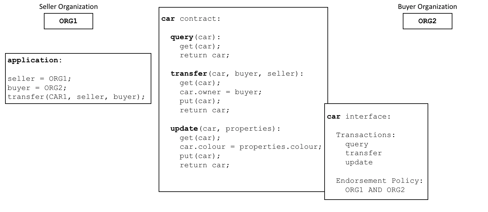
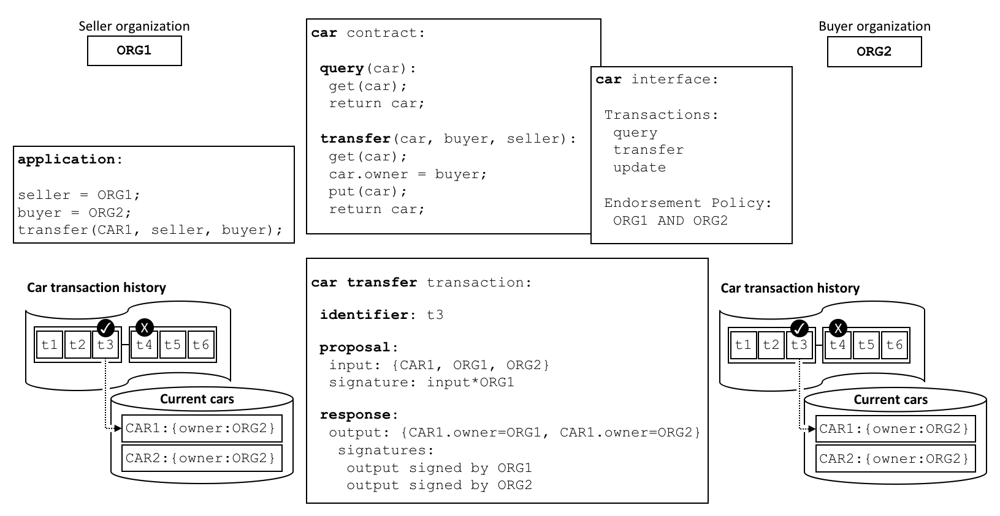

# Contratos Inteligentes e Chaincode

**Audiência:** Arquitetos, desenvolvedores de aplicações e smart contracts, administradores

Da perspectiva de um desenvolvedor de aplicativos, um **contrato inteligente**, junto com o [livro-razão](../ledger/ledger.html), forma o 
coração de um sistema blockchain da Hyperledger Fabric. Enquanto um ledger contém fatos sobre o estado atual e histórico de um conjunto de 
objetos de negócios, um **contrato inteligente** define a lógica executável que gera novos fatos que são adicionados ao livro-razão. Um 
**chaincode** normalmente é usado pelos administradores para agrupar contratos inteligentes relacionados à confirmação, mas também pode ser 
usado para a programação de sistema de baixo nível da Fabric. Neste tópico, abordaremos por que existem **contratos inteligentes** ,
**código de chamada**, e como e quando usá-los.

Neste tópico, abordaremos:

* [O que é um contrato inteligente](#smart-contract)
* [Uma nota sobre terminologia](#terminology)
* [Contratos inteligentes e livro-razão](#ledger)
* [Como desenvolver um contrato inteligente](#development)
* [A importância das políticas de endosso](#endorsement)
* [Transações válidas](#valid-transactions)
* [Canais e definições de chaincode](#channels)
* [Comunicação entre contratos inteligentes](#intercommunication)
* [O que é chaincode de sistema?](#system-chaincode)

<a name="smartcontract"></a>

## Contrato inteligente

Antes que as empresas possam negociar entre si, elas devem definir um conjunto comum de contratos que abranja termos, dados, regras, 
definições de conceitos e processos comuns. Tomados em conjunto, esses contratos estabelecem o **modelo de negócios** que governa todas as 
interações entre as partes envolvidas na transação.

 *Um contrato inteligente define as regras entre diferentes organizações no código 
executável. Os aplicativos invocam um contrato inteligente para gerar transações registradas no livro-razão.*

Usando uma rede blockchain, podemos transformar esses contratos em programas executáveis ​​--- conhecidos na indústria como 
**contratos inteligentes** --- para abrir uma ampla variedade de novas possibilidades. Isso ocorre porque um contrato inteligente pode 
implementar as regras de governança para **qualquer** tipo de objeto de negócios, para que possam ser aplicadas automaticamente quando o 
contrato inteligente for executado. Por exemplo, um contrato inteligente pode garantir que uma nova entrega de carro seja feita dentro de um 
prazo especificado ou que os fundos sejam liberados de acordo com termos previamente combinados, melhorando o fluxo de mercadorias ou 
capital, respectivamente. Mais importante, no entanto, a execução de um contrato inteligente é muito mais eficiente do que um processo de 
negócios humano manual.

No [diagrama acima](#contrato-inteligente), podemos ver como duas organizações, `ORG1` e` ORG2` definiram um contrato inteligente de `car` 
para `query`, `transfer` and `update` carros. Os aplicativos dessas organizações invocam esse contrato inteligente para executar uma 
etapa acordada em um processo comercial, por exemplo, para transferir a propriedade de um carro específico de `ORG1` para` ORG2`.

<a name="terminology"></a>

## Terminologia

Os usuários da Hyperledger Fabric geralmente usam os termos **contrato inteligente** e **chaincode** de forma intercambiável. Em geral, um 
contrato inteligente define a **lógica da transação** que controla o ciclo de vida de um objeto de negócios contido no estado global. Em 
seguida, é empacotado em um chaincode que é implantado em uma rede blockchain. Pense nos contratos inteligentes como transações
controladoras, enquanto o chaincode governa como os contratos inteligentes são compactados para implantação.

 *Um contrato inteligente é definido dentro de um chaincode. Vários contratos inteligentes 
podem ser definidos no mesmo código. Quando um chaincode é implantado, todos os contratos inteligentes nele são disponibilizados para os
aplicativos.*

No diagrama, podemos ver um chaincode `vehicle` que contém três contratos inteligentes: `cars`, `boats` e `trucks`. Também podemos ver 
um chaincode `insurance` que contém quatro contratos inteligentes: `policy`, `liability`, `syndication` e `securitization`. Nos dois casos, 
esses contratos cobrem aspectos-chave do processo de negócios relacionados a veículos e seguros. Neste tópico, usaremos o contrato `car` 
como exemplo. Podemos ver que um contrato inteligente é um programa específico de domínio relacionado a processos de negócios específicos, 
enquanto um chaincode é um contêiner técnico de um grupo de contratos inteligentes relacionados.

<a name="ledger"></a>

## Livro-Razão

No nível mais simples, uma blockchain registra as transações imutáveis que atualizam estados em um livro-razão. Um contrato inteligente 
acessa programaticamente duas partes distintas do livro-razão --- uma **blockchain**, que registra o histórico imutável de todas as 
transações e um **estado global**, que armazena um cache do valor atual desses estados, geralmente o que se busca saber é o valor atual de 
um objeto.

Contratos inteligentes primariamente executam operações de **put**, **get** e **delete** no estado global e também podem consultar os 
registros imutáveis de transações na blockchain.

* **get** normalmente representa uma consulta para recuperar informações sobre o estado atual de um objeto de negócios.
* **put** normalmente cria um novo objeto de negócios ou modifica um existente no estado global do livro-razão.
* **delete** normalmente representa a remoção de um objeto de negócios do estado atual do razão, mas não seu histórico.

Os contratos inteligentes têm muitas [APIs](../developapps/transactioncontext.html#structure) disponíveis para eles. Em todos os casos, se 
as transações criam, leem, atualizam ou excluem objetos de negócios no estado global, a blockchain manterá um 
[registro imutável](../ledger/ledger.html) dessas alterações.

<a name="development"></a>

## Desenvolvimento

Contratos inteligentes são o foco do desenvolvimento de aplicativos e, como vimos, um ou mais contratos inteligentes podem ser definidos em 
um único chaincode. A implantação de um chaincode em uma rede disponibiliza todos os seus contratos inteligentes para as organizações nessa 
rede. Isso significa que apenas os administradores precisam se preocupar com o chaincode, todo mundo pode pensar em termos de contratos 
inteligentes.

No coração de um contrato inteligente, há um conjunto de definições de `transação`. Por exemplo, veja 
[`fabcar.js`](https://github.com/hyperledger/fabric-samples/blob/{BRANCH}/chaincode/fabcar/javascript/lib/fabcar.js#L93), onde você pode ver 
uma transação de um contrato inteligente que cria um carro novo:

```javascript
async createCar(ctx, carNumber, make, model, color, owner) {

    const car = {
        color,
        docType: 'car',
        make,
        model,
        owner,
    };

    await ctx.stub.putState(carNumber, Buffer.from(JSON.stringify(car)));
}
```

Você pode aprender mais sobre o contrato inteligente **Fabcar** no tutorial [Escrevendo seu primeiro aplicativo](../write_first_app.html).

Um contrato inteligente pode descrever uma matriz quase infinita de casos de uso de negócios relacionados à imutabilidade de dados na tomada 
de decisão multi-organizacional. O trabalho de um desenvolvedor de contrato inteligente é assumir um processo de negócios existente que 
possa governar valores financeiros ou condições de entrega e expressá-lo como um contrato inteligente em uma linguagem de programação como 
JavaScript, Go ou Java. As habilidades legais e técnicas necessárias para converter séculos de linguagem jurídica em linguagem de 
programação são cada vez mais praticadas por **auditores de contratos inteligentes**. Você pode aprender sobre como projetar e desenvolver 
um contrato inteligente no [tópico Desenvolvendo aplicativos](../developapps/developing_applications.html).

<a name="endorsement"></a>

## Endosso

Associada a todos os chaincodes, há uma política de endosso que se aplica a todos os contratos inteligentes definidos nele. Uma política de 
endosso é muito importante, indica quais organizações em uma rede blockchain devem assinar uma transação gerada por um determinado contrato 
inteligente para que essa transação seja declarada **válida**.

 *Todo contrato inteligente possui uma política de endosso associada. Esta política de 
endosso identifica quais organizações devem aprovar transações geradas pelo contrato inteligente antes que essas transações possam ser 
identificadas como válidas.*

Um exemplo de política de endosso pode definir que três das quatro organizações que participam de uma rede blockchain devem assinar uma 
transação antes de serem consideradas **válidas**. Todas as transações, sejam **válidas** ou **inválidas**, são adicionadas a um livro-razão 
distribuído, mas apenas as transações **válidas** atualizam o estado global.

Se uma política de endosso especificar que mais de uma organização deve assinar uma transação, o contrato inteligente deve ser executado por 
um conjunto suficiente de organizações para que uma transação válida seja gerada. No exemplo [acima](#endosso), uma transação de contrato 
inteligente para `transferir` um carro precisaria ser executada e assinada por `ORG1` e `ORG2` para que ele fosse válido.

Políticas de endosso são o que torna a Hyperledger Fabric diferente de outras blockchains como Ethereum ou Bitcoin. Nesses sistemas, 
transações válidas podem ser geradas por qualquer nó da rede. O Hyperledger Fabric modela mais realisticamente o mundo real, as transações 
devem ser validadas por organizações confiáveis ​​em uma rede. Por exemplo, uma organização governamental deve assinar uma transação válida de 
`issueIdentity` ou o comprador e o vendedor de um carro devem assinar uma transação de transferência de carro. As políticas de endosso são 
projetadas para permitir que o Hyperledger Fabric modele melhor esses tipos de interações no mundo real.

Por fim, as políticas de endosso são apenas um exemplo de [política](../access_control.html#policies) no Hyperledger Fabric. Outras 
políticas podem ser definidas para identificar quem pode consultar ou atualizar o livro-razão, ou adicionar ou remover participantes da rede. 
Em geral, as políticas devem ser previamente acordadas pelo consórcio de organizações em uma rede blockchain, embora não sejam imutáveis. De 
fato, as próprias políticas podem definir as regras pelas quais elas podem ser alteradas. E, embora seja um tópico avançado, também é 
possível definir [política de endosso personalizada](../pluggable_endorsement_and_validation.html) que governa além daquelas fornecidas pelo 
Fabric.

<a name="valid-transactions"></a>

## Transações válidas

Quando um contrato inteligente é executado, ele é executado em um nó de propriedade de uma organização na rede blockchain. O contrato 
utiliza um conjunto de parâmetros de entrada chamado **proposta de transação** e os utiliza em combinação com a lógica do programa para ler 
e gravar o livro-razão. As alterações no estado global são capturadas como uma **resposta da proposta de transação** (ou apenas 
**resposta da transação**) que contém um **conjunto de leitura e escrita** com os estados que foram lidos e os novos estados que devem ser 
gravados se a transação for válida. Observe que o estado global **não é atualizado quando o contrato inteligente é executado**!

 *Todas as transações possuem um identificador, uma proposta e uma resposta assinadas por 
um conjunto de organizações. Todas as transações são registradas na blockchain, válidas ou inválidas, mas apenas transações válidas 
contribuem para o estado global.*

Examine a transação de transferência de um carro. Você pode ver uma transação `t3` para uma transferência de carro entre `ORG1` e `ORG2`. 
Veja como a transação inseriu `{CAR1, ORG1, ORG2}` e produz `{CAR1.owner = ORG1, CAR1.owner = ORG2}`, representando a mudança de 
proprietário de` ORG1` para `ORG2`. Observe como a entrada é assinada pela organização do aplicativo `ORG1` e a saída é assinada por *ambas 
as organizações identificadas pela política de endosso, `ORG1` e `ORG2`. Essas assinaturas foram geradas usando a chave privada de cada ator 
e significam que qualquer pessoa na rede pode verificar se todos os atores da rede estão de acordo sobre os detalhes da transação.

Uma transação que é distribuída a todos os nós pares na rede é **validada** em duas fases por cada ponto. Em primeiro lugar, a transação é 
verificada para garantir que foi assinada por organizações suficientes de acordo com a política de endosso. Em segundo lugar, é verificado 
para garantir que o valor atual do estado global corresponda ao conjunto de leitura da transação quando ela foi assinada pelos nós pares 
endossantes e que não houve atualização intermediária. Se uma transação passar nesses dois testes, será marcada como **válida**. Todas as 
transações são adicionadas ao histórico da blockchain, sejam **válidas** ou **inválidas**, mas apenas transações **válidas** resultam em uma 
atualização para o estado global.

No nosso exemplo, `t3` é uma transação válida, portanto, o proprietário do `CAR1` foi atualizado na `ORG2`. No entanto, `t4` (não mostrado) 
é uma transação inválida, portanto, enquanto foi registrada no razão, o estado global não foi atualizado e o `CAR2` permanece de propriedade 
do `ORG2`.

Por fim, para entender como usar um contrato inteligente ou um chaincode com o estado global, leia o 
[tópico namespace do chaincode](../developapps/chaincodenamespace.html).

<a name="channels"></a>

## Canais

O Hyperledger Fabric permite que uma organização participe simultaneamente de várias redes blockchain separadas por **canais**. Ao ingressar 
em vários canais, uma organização pode participar da chamada **rede de redes**. Os canais fornecem um compartilhamento eficiente da 
infraestrutura, mantendo a privacidade dos dados e das comunicações. Eles são independentes o suficiente para ajudar as organizações a 
separar seu tráfego de trabalho com contrapartes diferentes, mas integrados o suficiente para permitir que coordenem atividades 
independentes quando necessário.

 *Um canal fornece um mecanismo de comunicação completamente separado entre um conjunto de 
organizações. Quando uma definição de chaincode é confirmada em um canal, todos os contratos inteligentes dentro do chaincode são 
disponibilizados para os aplicativos nesse canal.*

Enquanto o código do contrato inteligente é instalado dentro de um pacote de chaincode nos nós pares das organizações, os membros do canal 
só podem executar um contrato inteligente depois que o chaincode tiver sido definido em um canal. Uma **definição de chaincode** é, uma 
estrutura que contém os parâmetros que governam como um chaincode opera. Esses parâmetros incluem o nome do código, versão e a política de 
endosso. Cada membro do canal concorda com os parâmetros de um chaincode aprovando uma definição de chaincode para sua organização. Quando 
um número suficiente de organizações (maioria por padrão) aprovou a mesma definição de chaincode, a definição pode ser confirmada no canal.
Os contratos inteligentes dentro do chaincode podem então ser executados pelos membros do canal, sujeitos à política de endosso especificada 
na definição do chaincode. A política de endosso aplica-se igualmente a todos os contratos inteligentes definidos no mesmo código.

No exemplo [acima](#canais), um contrato `car` é definido no canal `VEHICLE`, e um contrato `insurance` é definido no canal `INSURANCE`. A 
definição de chaincode de `car` especifica uma política de endosso que exige que `ORG1` e `ORG2` assinem transações antes que possam ser 
consideradas válidas. A definição do chaincode do contrato `insurance` especifica que apenas o `ORG3` é necessário para endossar uma 
transação. A `ORG1` participa de duas redes, o canal` VEHICLE` e a rede `INSURANCE`, e pode coordenar a atividade com o `ORG2` e o `ORG3`
nessas duas redes.

A definição de chaincode fornece uma maneira para os membros do canal concordarem com o controle de um chaincode antes de começarem a usar o 
contrato inteligente para realizar transações no canal. Com base no exemplo acima, o `ORG1` e o `ORG2` desejam endossar transações que 
invocam o contrato `car`. Como a política padrão exige que a maioria das organizações aprove uma definição de chaincode, ambas as 
organizações precisam aprovar uma política de endosso de `AND {ORG1, ORG2}`. Caso contrário, `ORG1` e `ORG2` aprovariam diferentes 
definições de chaincode e, como resultado, seriam incapazes de confirmar a definição de chaincode no canal. Esse processo garante que uma 
transação do contrato inteligente `car` necessite ser aprovada pelas duas organizações.

<a name="intercommunication"></a>

## Intercomunicação

Um contrato inteligente pode chamar outros contratos inteligentes no mesmo canal e em diferentes canais. Dessa forma, eles podem ler e 
gravar dados do estado global aos quais, de outra forma, não teriam acesso devido aos namespaces de contrato inteligentes.

Existem limitações para essa comunicação entre contratos, que são descritas completamente no tópico 
[namespace do chaincode](../developapps/chaincodenamespace.html#cross-chaincode-access).

<a name="system-chaincode"></a>

## Chaincode de sistema

Os contratos inteligentes definidos em um chaincode codificam as regras dependentes do domínio para um processo de negócios acordado entre 
um conjunto de organizações da blockchain. No entanto, um chaincode também pode definir código de programa de baixo nível que corresponde a
interações do *sistema* independentes do domínio, não relacionadas a esses contratos inteligentes para processos de negócios.

A seguir, são apresentados os diferentes tipos de códigos de sistema e suas abreviações associadas:

* `_lifecycle` é executado em todos os pares e gerencia a instalação do chaincode nos pares, a aprovação de definições de chaincode para sua 
  organização e o comprometimento das definições de código do canal nos canais. Você pode ler mais sobre como `_lifecycle` implementa o 
  [processo](../chaincode_lifecycle.html) do ciclo de vida do chaincode da Fabric.

* LSCC (ciclo de vida do chaincode de sistema) gerencia o ciclo de vida do chaincode das versões 1.x da Fabric. Essa versão do ciclo de vida 
  exigia que o código fosse instanciado ou atualizado nos canais. Você ainda pode usar o LSCC para gerenciar seu código se tiver o recurso 
  de aplicativo de canal definido como V1_4_x ou abaixo.

* **O sistema de configuração chaincode (CSCC)** é executado em todos os pares para lidar com as alterações na configuração de um canal, 
  como uma atualização de política. Você pode ler mais sobre esse processo no seguinte [tópico](../configtx.html#configuration-updates).

* **O sistema de consulta Chaincode (QSCC)** é executado em todos os pares para fornecer APIs do livro-razão, que incluem consulta de bloco,
  consulta de transação, etc. Você pode ler mais sobre essas APIs do livro-razão no contexto da transação 
  [tópico](../developapps/transactioncontext.html).

* **Chaincode do sistema de endosso (ESCC)** é executado no endosso dos pares para assinar criptograficamente uma resposta de transação. 
  Aqui você pode ler mais sobre como o ESCC implementa esse [processo](../peers/peers.html#fase-1-proposta).

* **Chaincode do sistema de validação (VSCC)** valida uma transação, incluindo a verificação da política de endosso e o controle de versão 
  do conjunto de leitura e gravação. Você pode ler mais sobre como o VSCC implementa o 
  [processo](../peers/peers.html#fase-3-validacao-e-confirmacao).

É possível que desenvolvedores e administradores de baixo nível da Fabric modifiquem esses códigos de sistema para seus próprios usos. No 
entanto, o desenvolvimento e gerenciamento de códigos de sistema é uma atividade especializada, bastante separada do desenvolvimento de 
contratos inteligentes, e normalmente não é necessária. As alterações nos chaincode do sistema devem ser tratadas com extremo cuidado, pois 
são fundamentais para o correto funcionamento de uma rede Hyperledger Fabric. Por exemplo, se um código de sistema não for desenvolvido 
corretamente, um nó par poderá atualizar sua cópia do estado global ou da blockchain de forma diferente em comparação com outros nós de 
pares. Essa falta de consenso é uma forma de **divisão de contabilidade**, uma situação muito indesejável.

<!--- Licensed under Creative Commons Attribution 4.0 International License
https://creativecommons.org/licenses/by/4.0/ -->
