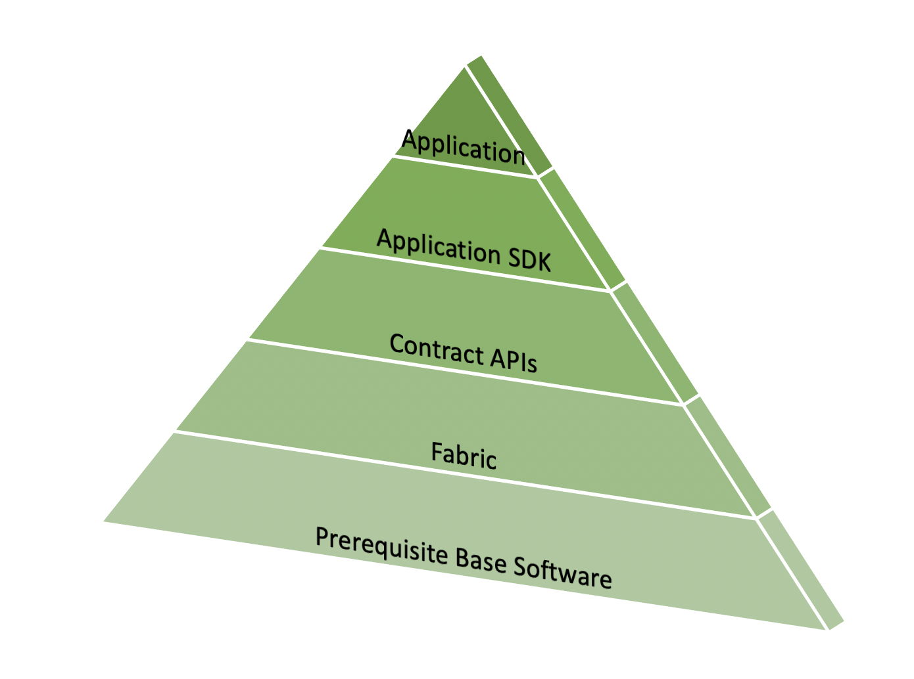

Memulai - Instal
=========================

.. toctree::
   :maxdepth: 1
   :hidden:

   prereqs
   install
   sdk_chaincode

Stack aplikasi Fabric memiliki lima lapisan:

* :doc:`Prerequisite software <prereqs>`: lapisan dasar yang diperlukan untuk menjalankan perangkat lunak, misalnya Docker.
* :doc:`Fabric and Fabric samples <install>`: Fabric dapat dieksekusi untuk menjalankan jaringan Fabric bersama dengan kode contoh.
* :doc:`Contract APIs <sdk_chaincode>`: untuk mengembangkan kontrak pintar yang dijalankan di Fabric Network.
* :doc:`Application APIs <sdk_chaincode>`: untuk mengembangkan aplikasi blockchain Anda.
* Aplikasi: aplikasi blockchain Anda akan menggunakan SDK Aplikasi untuk memanggil kontrak pintar yang berjalan di jaringan Fabric.

.. Licensed under Creative Commons Attribution 4.0 International License
   https://creativecommons.org/licenses/by/4.0/
