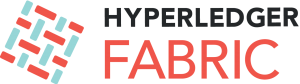

.. note:: Per favore assicurati di leggere la documentazione che corrisponde alla versione del software che stai utilizzando. Guarda l'etichetta della versione nella parte superiore del pannello di navigazione a sinistra. Puoi cambiarla usando il selettore nella parte inferiore di quel pannello di navigazione.

Una piattaforma Blockchain per le Aziende
=========================================

Piattaforma di registro distribuito permissioned (partecipanti noti e con gestione delle autorizzazioni di accesso) di livello enterprise che offre modularità e versatilità per un'ampia gamma di casi d'uso.

.. toctree::
   :maxdepth: 1

   whatis
   whatsnew
   key_concepts
   getting_started
   developapps/developing_applications
   tutorials
   deployment_guide_overview
   ops_guide
   upgrade
   command_ref
   architecture
   Fabric-FAQ
   CONTRIBUTING
   glossary
   releases
   questions
   status

.. note:: Se hai domande non affrontate da questa documentazione o se riscontri problemi con uno qualsiasi dei tutorial, visita la pagina  :doc:`questions` per alcuni suggerimenti su dove trovare ulteriore aiuto.

.. Licensed under Creative Commons Attribution 4.0 International License
   https://creativecommons.org/licenses/by/4.0/
