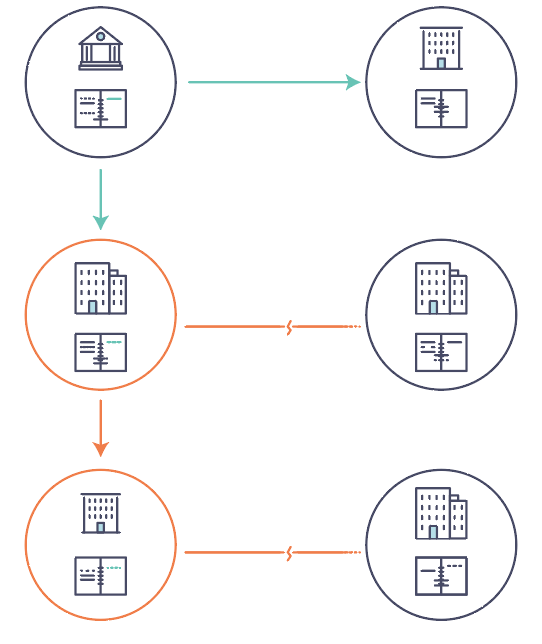
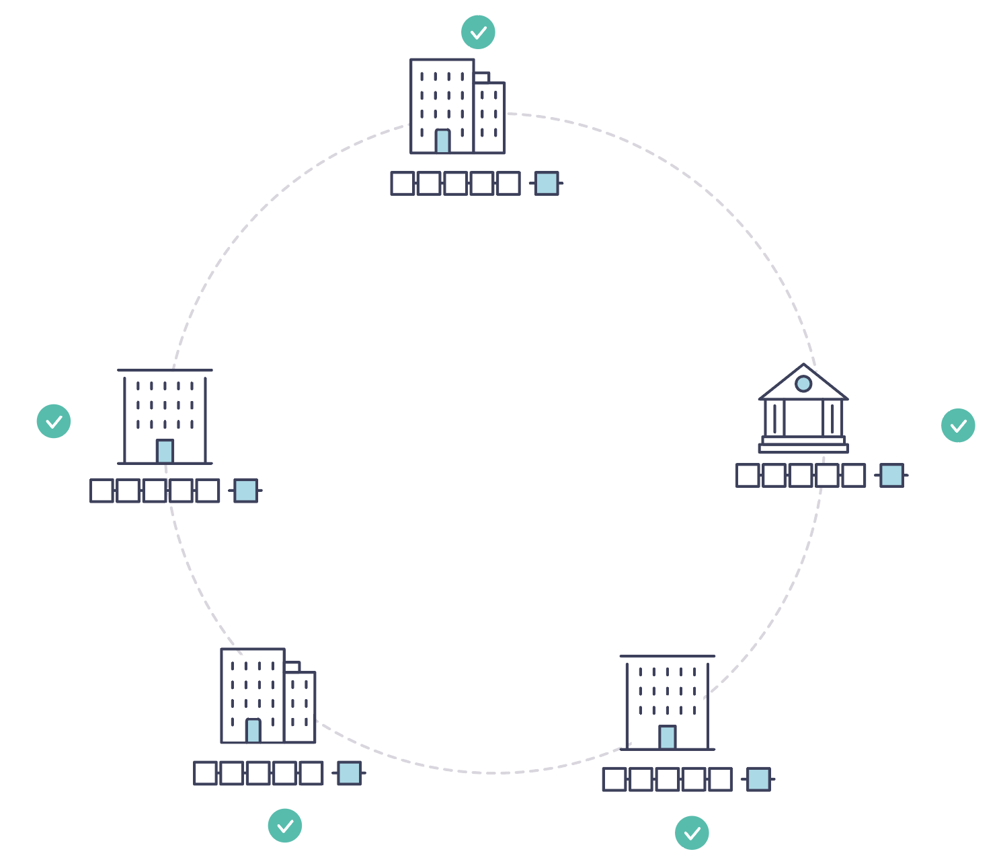

はじめに
============
Hyperledger Fabricは、高度な機密性、耐障害性、柔軟性、および拡張性を提供する
モジュラー型アーキテクチャによって支えられた、分散台帳ソリューション用のプラットフォームです。
異なるコンポーネントがプラグイン可能な実装となっており、経済的なエコシステム全体に存在する
複雑で入り組んだ課題に対応するように設計されています。

ブロックチェーンの仕組みや、Hyperledger Fabricの特定の機能やコンポーネントについての
知識を得るために、初心者のユーザーには、以下の導入から読み進めることをお勧めします。

いったん目を通したら --- もしくはブロックチェーンやHyperledger Fabricに既に慣れ親しんでいる人は --- :doc:`getting_started` へ読み進めて、デモや技術仕様、APIなどに触れてみてください。

ブロックチェーンとは?
---------------------
**分散台帳**

ブロックチェーンネットワークの中核には、ネットワーク上で行われるすべてのトランザクションを
記録する分散台帳があります。

ブロックチェーン上の台帳は、ネットワーク参加者の多くに複製され、各参加者が
**協力して** データを保持することから、多くの場合、 **分散型** と呼ばれます。
このデータの分散化と参加者の協力関係が、企業が現実世界で商品やサービスをやりとりする方法を
反映した強力な特性であることがわかります。

.. image:: images/basic_network.png

分散化と協調関係に加えて、ブロックチェーンに記録される情報は追記されるのみであり、
一度トランザクションが台帳に追加されると変更できないことを暗号技術を利用して保証しています。
"不変性" というこの特性により、参加者は情報が事後に変更されていないことを確認できるため、
情報の出所を簡単に判断できます。そのため、ブロックチェーンは **証明システム** と
呼ばれることがあります。

**スマートコントラクト**

情報の一貫した更新をサポートするために --- そして台帳機能(トランザクション、クエリーなど)をホスト全体で
有効にするために --- ブロックチェーンネットワークは **スマートコントラクト** を使用して、
台帳への制御されたアクセスを提供します。

.. image:: images/Smart_Contract.png

スマートコントラクトは、情報をカプセル化してネットワーク全体でシンプルに保つための
重要なメカニズムであるだけでなく、参加者がトランザクションに関して特定の処理を
自動的に実行するためにも利用することが可能です。

両当事者間で合意され、台帳に書き込まれた条件により、適切な報酬が品目の受入と同時に
然るべき当事者の元に自動的で渡されます。例えば、商品がどれだけ早く到着するかによって
送料が変動するような、商品配送コストの規定にスマートコントラクトを利用することができます。

**合意形成**

適切な参加者によってトランザクションが承認された場合にのみ台帳が更新され、台帳の更新時に同じトランザクションが同じ順序で更新されるように、ネットワーク全体で台帳取引を同期化するプロセスのことを **合意形成** と呼びます。

.. image:: images/consensus.png

台帳、スマートコントラクト、合意形成については後で詳しく学んでいきます。現時点では、ブロックチェーンは共有され、複製されたトランザクションシステムであり、スマートコントラクトを通じて更新され、合意形成と呼ばれる共同プロセスを通じて一貫して同期されていると考えるだけで十分です。

ブロックチェーンが有用な理由とは?
---------------------------------

**今日の記録システム**

今日のトランザクションネットワークは、ビジネス記録が保存されるようになった頃から
存在していたネットワークをわずかに更新しただけのものです。
**ビジネスネットワーク** のメンバーは互いにトランザクションを行いますが、
トランザクションのレコードは別々に保持します。16世紀のフランダース地方の織物であろうと、今日の証券であろうと、
彼らが取引するものは、販売されるたびにその出所が確立されていなければなりません。
それは商品を販売する事業者が現在その所有権を持っていることを所有権の変遷の情報によって
保証するためです。

あなたが考える必要があるのは、次のようなビジネスネットワークです。

現代の技術では、このプロセスを石板や紙のフォルダからハードドライブや
クラウドプラットフォームにまで拡張していますが、基本的な構造は同じです。
ネットワーク参加者の身元を管理するための統一されたシステムは存在せず、
出所を確認するのは非常に骨の折れる作業であり、証券取引(数兆ドル規模の世界の取引量)を
決済するのに数日を要し、契約は手動で署名され、実行されなければならず、システム内の
すべてのデータベースには固有の情報が含まれているため、単一障害点を表します。

情報やプロセスの共有に関して分断されている今日のアプローチでは、
たとえ可視性と信頼性のニーズが明確であっても、ビジネスネットワークにまたがる
記録システムを構築することは不可能です。

**ブロックチェーンの違い**

"現代的な"トランザクションシステムに代表される非効率かつ複雑なシステムの代わりに、
ビジネスネットワークにネットワーク上での身元確認、トランザクションの実行、
データの保存のための標準的な方法があったとしたらどうでしょうか? 一度書き込まれたら
書き換えることができない、信頼できるトランザクションのリストを調べることで、
資産の出所を確認できるとしたらどうでしょうか?

このビジネスネットワークは、次のようになります:

これがブロックチェーンネットワークであり、すべての参加者が独自の複製された
台帳のコピーを持ちます。台帳情報の共有に加えて、台帳を更新するプロセスも共有されます。
参加者の **プライベート** プログラムを使用して **プライベート** な台帳を更新する
現在のシステムとは異なり、ブロックチェーンシステムでは **共有** する台帳を更新する
**共有** プログラムが存在します。

共有台帳を通じてビジネスネットワークを統合する機能により、
ブロックチェーンネットワークは、信頼性と可視性を向上させながら、プライベートな情報とプロセスに
関連する時間、コスト、リスクを削減できます。

これで、ブロックチェーンとは何か、なぜブロックチェーンが便利なのか、が分かったかと思います。
他にも重要なことはたくさんありますが、それらはすべて、情報とプロセスの共有という、
ここで説明した基本的な考え方に関係しています。

Hyperledger Fabricとは?
---------------------------

Linux Foundationは、業界横断的なブロックチェーン技術を発展させるために、
2015年にHyperledgerプロジェクトを設立しました。単一のブロックチェーン標準を
推進するのではなく、コミュニティプロセスを通じてブロックチェーン技術を開発するための
協調的なアプローチを奨励しており、知的財産権によって、オープンな開発と長期にわたる
主要な標準の採用を促進しています。

Hyperledger Fabricは、Hyperledger内のブロックチェーンプロジェクトの1つです。
他のブロックチェーン技術と同様に、台帳があり、スマートコントラクトを使用し、
参加者自身がトランザクションを管理するシステムです。

Hyperledger Fabricが他のブロックチェーンシステムと異なる点は、 **プライベート** であり、
**許可型** であることです。Hyperledger Fabricネットワークのメンバーは、匿名の参加者が
ネットワークに参加できるようにするオープンな参加許可の必要ないシステム(トランザクションを
検証し、ネットワークを保護するために\"Proof of Work\"などのプロトコルが必要)ではなく、
信頼できる **メンバーシップサービスプロバイダ (MSP)** を通じて登録します。

Hyperledger Fabricは、いくつかのプラグイン可能なオプションも提供します。
台帳データは複数のフォーマットで保存でき、合意形成メカニズムは変更が可能であり、
異なるMSPがサポートされます。

Hyperledger Fabricには、 **チャネル** を作成する機能もあり、参加者のグループが
トランザクションの個別の台帳を作成できます。これは、ネットワークにとって特に重要なオプションです。
参加者の中には競合他社もいるかもしれません。そのため、自分たちが行うすべてのトランザクション --- たとえば、
他の参加者ではなく一部の参加者に提供する特別な価格 --- をすべての参加者に知らせたくないと
考える参加者もいます。2人の参加者が1つのチャネルを形成する場合、そのチャネルへの参加者である
2人だけがそのチャネルの台帳のコピーを保持します。

**共有台帳**

Hyperledger Fabricには、 **ワールドステート** と **トランザクションログ** という
2つのコンポーネントで構成される台帳サブシステムがあります。各参加者は、
所属するすべてのHyperledger Fabricネットワークに台帳のコピーを持っています。

ワールドステートコンポーネントは、特定の時点における台帳の状態を記述します。
これは台帳のデータベースです。トランザクションログコンポーネントには、
ワールドステートが現在の値となるまでのすべてのトランザクションが記録されます。
ワールドステートの更新履歴です。したがって、台帳は、ワールドステートデータベースと
トランザクションログ履歴の組合せというわけです。

台帳には、ワールドステートに対する変更可能なデータストアがあります。既定では、
ワールドステートのデータストアはLevelDBキーバリューストアデータベースです。
トランザクションログをプラグイン可能にする必要はありません。
ブロックチェーンネットワークで使用されている台帳データベースの変更前の値と
変更後の値を記録するだけです。

**スマートコントラクト**

Hyperledger Fabricスマートコントラクトは、 **チェーンコード** で記述され、
ブロックチェーン外部のアプリケーションが台帳とデータのやり取りをする必要がある場合に、
そのアプリケーションによって起動されます。ほとんどの場合、チェーンコードは、
台帳のデータベースコンポーネント、ワールドステート(クエリなど)とのみ
データのやり取りをし、トランザクションログにはアクセスしません。

チェーンコードは、いくつかのプログラミング言語で実装できます。
現在、GoとNodeをサポートしています。

**プライバシー**

ネットワークのニーズに応じて、Business-to-Business(B2B)ネットワークの参加者は、
共有する情報の量について非常に慎重になる場合があります。
他のブロックチェーンネットワークでは、プライバシーは最大の関心事ではないでしょう。

Hyperledger Fabricは、プライバシー(チャネルを使用)が重要な運用要件であるネットワークと、
比較的オープンなネットワークをサポートします。

**合意形成**

トランザクションは、ネットワークにおいて参加者の異なるセットの間で発生したものであっても、
発生した順序で台帳に書き込まれる必要があります。これを実現するには、
トランザクションの順序を確立し、誤って(または悪意を持って)台帳に挿入された
不良トランザクションを拒否する方法を確立する必要があります。

この課題はコンピューター科学において徹底的に研究された分野であり、
それを達成する方法はたくさんあり、それぞれに異なるトレードオフがあります。
たとえば、PBFT(実用的ビザンチン障害耐性)は、故障が発生した場合でも
各コピーの整合性を維持するために、ファイルの複製が相互に通信するメカニズムを提供します。
一方、Bitcoinでは、マイニングと呼ばれるプロセスを通じて順序付けが行われ、
競合するコンピューターが、ブロックの順序を定義する暗号パズルを解く競争をし、
その定義された順序に基づいて、その後の全てのプロセスが進められます。

Hyperledger Fabricは、ネットワークの発起人が参加者間に存在する関係を
最もよく表す合意形成メカニズムを選択できるように設計されています。
プライバシーの場合と同様に、さまざまなニーズがあります。高度に構造化されたネットワークから、
ピアツーピアのネットワークまで、さまざまなニーズがあります。

.. Licensed under Creative Commons Attribution 4.0 International License
   https://creativecommons.org/licenses/by/4.0/
