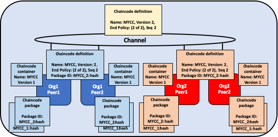

# Fabric chaincode lifecycle

## What is Chaincode?

チェーンコードは、[Go](https://golang.org)、[Node.js](https://nodejs.org)、または[Java](https://java.com/en/)
で書かれたプログラムで、所定のインタフェースを実装したものです。
チェーンコードは、エンドーシングピアのプロセスから分離された安全なDockerコンテナ内で動作します。
チェーンコードは、アプリケーションから送信されたトランザクションを通じて、台帳のステートの初期化と管理をします。

チェーンコードは通常、ネットワークのメンバーが合意したビジネスロジックを処理するため、
「スマートコントラクト」と見なすことができます。あるチェーンコードによって作成された台帳の更新は、
そのチェーンコードのみに排他的にスコープされ、他のチェーンコードから直接アクセスすることはできません。
ただし、同じネットワーク内では、適切な権限が与えられている場合、
チェーンコードは別のチェーンコードを呼び出してそのステートにアクセスできます。

このコンセプトトピックでは、アプリケーション開発者ではなく、
ブロックチェーンネットワークの運用者の視点でチェーンコードを探索します。
チェーンコードの運用者は、このトピックを、Fabricのチェーンコードライフサイクルを用いて、
ネットワーク上にチェーンコードをデプロイして管理する方法のガイドとして使用することができます。

## Deploying a chaincode

Fabricのチェーンコードライフサイクルは、チャネル上で使用される前に、
複数の組織がチェーンコードをどのように運用するかについて合意できるようにするプロセスです。
ネットワーク運用者は、Fabricライフサイクルを使用して以下のタスクを実行します。

- [Install and define a chaincode](#install-and-define-a-chaincode)
- [Upgrade a chaincode](#upgrade-a-chaincode)
- [Deployment Scenarios](#deployment-scenarios)
- [Migrate to the new Fabric lifecycle](#migrate-to-the-new-fabric-lifecycle)

新しいチャネルを作成してチャネルのケーパビリティをV2_0に設定することで、
Fabricのv2.0からの新しいチェーンコードライフサイクルを使用することができます。
V2_0ケーパビリティが有効になっているチャネルでは、v1.4.x以前の古いライフサイクルを使用して、
チェーンコードをインストール、インスタンス化、または更新することはできません。
ネットワークをv1.4.xからアップグレードし、新しいライフサイクルを有効にするためにチャネル設定を編集する必要がある場合は、
[Enabling the new chaincode lifecycle]( ./enable_cc_lifecycle.html)をチェックしてください。

## Install and define a chaincode

Fabricのチェーンコードライフサイクルでは、
名前、バージョン、チェーンコードエンドースメントポリシーなど、
チェーンコードを定義するパラメータに組織が同意する必要があります。
チャネルメンバーは、次の4つのステップを使用して合意に達します。
チャネル上のすべての組織が各ステップを完了する必要があるわけではありません。

1. **チェーンコードをパッケージ化する:** このステップは、1つの組織または各組織で実行できます。
2. **自組織のピアにチェーンコードをインストールする:** チェーンコードを使用してトランザクションのエンドースや台帳へのクエリをするすべての組織は、このステップを完了する必要があります。
3. **自組織のチェーンコード定義を承認する:** チェーンコードを使用するすべての組織は、このステップを完了する必要があります。チェーンコード定義は、チャネルでチェーンコードを開始する前に、チャネルのLifecycleEndorsementポリシー (デフォルトでは過半数) を満たすのに十分な数の組織によって承認される必要があります。
4. **チェーンコード定義をチャネルにコミットする:** チャネル上の必要な数の組織が承認したら、コミットトランザクションを1つの組織が送信する必要があります。送信者はまず、承認した組織の十分な数のピアからエンドースメントを集め、次にトランザクションを送信して、チェーンコード定義をコミットします。

本トピックでは、詳しいコマンドではなく、Fabricのチェーンコードライフサイクル運用の詳細な概要を示します。
ピアCLIを使用してFabricライフサイクルを使用する方法の詳細については、
[Deploying a smart contract to a channel tutorial](deploy_chaincode.html)
または[peer lifecycle command reference](commands/peerlifecycle.html)を参照してください。

### Step One: Packaging the smart contract

チェーンコードは、ピアにインストールする前に tar ファイルにパッケージ化する必要があります。
チェーンコードをパッケージ化するには、Fabricのピアバイナリ、Node Fabric SDK (訳注: v2.2.0リリース時点ではNode.js版SDKでは未サポートと思われます)、
または GNU tar のようなサードパーティのツールを使用します。
チェーンコードパッケージを作成する際には、そのパッケージの簡潔でヒューマンリーダブルな説明を作成するためにチェーンコードパッケージラベルを指定する必要があります。

サードパーティのツールを使用してチェーンコードをパッケージ化する場合、結果として得られるファイルは以下の形式である必要があります。
FabricのピアバイナリとFabric SDKは、この形式のファイルを自動的に作成します。
- チェーンコードは、`.tar.gz`ファイル拡張子で終わるtarファイルにパッケージ化する必要があります。
- tarファイルには2つのファイル (ディレクトリなし) が含まれている必要があります。それはメタデータファイル「metadata.json」とチェーンコードファイルを含むtarファイル「code.tar.gz」です。
- 「metadata.json」には、チェーンコードの記述言語、コードへのパス、パッケージラベルを指定するJSONが含まれています。以下にメタデータファイルの例を示します:
  ```
  {"Path":"fabric-samples/chaincode/fabcar/go","Type":"golang","Label":"fabcarv1"}
  ```


*チェーンコードは、Org1とOrg2によって別々にパッケージ化されています。どちらの組織も、名前とバージョンを使用してパッケージを識別するために、パッケージラベルとしてMYCC_1を使用しています。組織が同じパッケージラベルを使用する必要はありません。*

### Step Two: Install the chaincode on your peers

トランザクションを実行およびエンドースするすべてのピアにチェーンコードパッケージをインストールする必要があります。
CLIとSDKのどちらを使用する場合でも、**ピア管理者**を使用してこの手順を完了する必要があります。
ピアは、チェーンコードがインストールされた後にチェーンコードをビルドします。そして、もしチェーンコードに問題があったらビルドエラーを返します。
組織はチェーンコードを1回だけパッケージ化し、組織に属するすべてのピアに同じパッケージをインストールすることをお勧めします。
チャネルが各組織が同じチェーンコードを実行していることを確認したい場合、1つの組織がチェーンコードをパッケージ化し、
それをFabricネットワークの外側で他のチャネルメンバーに送信します。

インストールコマンドが成功すると、チェーンコードのパッケージ識別子 (パッケージID) が返されます。
これは、パッケージラベルとパッケージのハッシュと組み合わせたものです。
このパッケージIDは、ピアにインストールされているチェーンコードパッケージを、
組織によって承認されたチェーンコード定義に関連付けるために使用されます。
**パッケージIDを保存**して次のステップに進みます。
ピアCLIを使用してピアにインストールされているパッケージをクエリすることによって、
パッケージIDを見つけることもできます。

  

*Org1およびOrg2のピア管理者は、チャネルに参加しているピアにチェーンコードパッケージMYCC_1をインストールします。 チェーンコードパッケージをインストールすると、チェーンコードが作成され、MYCC_1:hashというパッケージIDが作成されます。*

### Step Three: Approve a chaincode definition for your organization

チェーンコードは、**チェーンコード定義 (chaincode definition)** によって管理されます。
チャネルメンバーがチェーンコード定義を承認すると、その承認は、組織が受け入れるチェーンコードパラメータに対する組織の投票として機能します。
これらの承認された組織定義により、チャネルメンバーは、チャネルで使用する前にチェーンコードについて合意することができます。
チェーンコード定義には、組織間で一貫している必要がある次のパラメータが含まれます:

- **名前 (Name):** チェーンコードを呼び出すときにアプリケーションが使用する名前。
- **バージョン (Version):** 特定のチェーンコードパッケージに関連付けられたバージョン番号または値。チェーンコードのバイナリをアップグレードする場合は、チェーンコードのバージョンも変更する必要があります。
- **シーケンス (Sequence):** チェーンコードが定義された回数。この値は整数であり、チェーンコードのアップグレードを追跡するために使用されます。たとえば、最初にチェーンコード定義をインストールして承認すると、シーケンス番号は1になります。次にチェーンコードをアップグレードすると、シーケンス番号が2に増えます。
- **エンドースメントポリシー (Endorsement Policy):** どの組織がトランザクション出力を実行および検証する必要があるかを示したもの。エンドースメントポリシーは、CLIに渡される文字列として表現することも、チャネル設定内のポリシーを参照することもできます。
  デフォルトでは、エンドースメントポリシーは `Channel/Application/Endorsement`に設定されています。デフォルトでは、チャネル内の過半数の組織がトランザクションをエンドースする必要があります。
- **コレクション設定 (Collection Configuration):** チェーンコードに関連付けられたプライベートデータコレクション定義ファイルへのパス。
  プライベートデータコレクションの詳細については、[Private Data architecture reference](private-data-arch.html)を参照ください。
- **ESCC/VSCCプラグイン (ESCC/VSCC Plugins):** このチェーンコードで使用されるカスタムエンドースメントまたはバリデーション (検証) プラグインの名前。
- **初期化 (Initialization):** Fabric Chaincode Shim APIによって提供される低レベルAPIを使用する場合、チェーンコードには、チェーンコードの初期化に使用される`Init`関数を含める必要があります。この関数はチェーンコードインターフェイスで必要ですが、必ずしもアプリケーションで呼び出す必要はありません。
  チェーンコード定義を承認するときに、呼び出しの前に`Init`を呼び出す必要があるかどうかを指定できます。`Init`が必要であると指定した場合、Fabricはチェーンコード内の他の関数の前に`Init`関数が1回だけ呼び出されることを保証します。
  `Init`関数の実行を要求することで、チェーンコードが初期化されたときに実行されるロジックを実装できます (たとえば、初期状態を設定するため)。バージョンをインクリメントするチェーンコード定義が`Init`が必要であることを示していると仮定すると、
  チェーンコードのバージョンをインクリメントするたびに毎回`Init`を呼び出してチェーンコードを初期化する必要があります。

  FabricのピアCLIを使用している場合、チェーンコード定義を承認およびコミットするときに`--init-required`フラグを使用して、新しいチェーンコードバージョンを初期化するために`Init`関数を呼び出す必要があることを示すことができます。
  FabricのピアCLIを使用して`Init`を呼び出すには、`peer chaincode invoke`コマンドを使用して`--isInit`フラグを渡します。

  Fabric Contract APIを使用している場合、チェーンコードに`Init`メソッドを含める必要はありません。ただし、`--init-required`フラグを使用して、アプリケーションからの呼び出しによってチェーンコードを初期化するように要求できます。
  `--init-required`フラグを使用する場合、チェーンコードバージョンをインクリメントするたびにチェーンコードを初期化するために、`--isInit`フラグまたはパラメーターをチェーンコード呼び出しに渡す必要があります。
  チェーンコード内の任意の関数を使用して、`--isInit`を渡し、チェーンコードを初期化できます。

チェーンコードの定義には、**パッケージID (Package Identifier, Package ID)**も含まれています。
これは、チェーンコードを使用する各組織に必要なパラメータです。 パッケージIDは、すべての組織で同じである必要はありません。
組織は、チェーンコードパッケージをインストールしたり、パッケージIDを定義に含めたりせずに、チェーンコード定義を承認できます。

チェーンコードを使用する各チャネルメンバーは、組織のチェーンコード定義を承認する必要があります。
この承認はオーダリングサービスに送信する必要があり、その後、すべてのピアに配布されます。
この承認は、**組織管理者**が送信する必要があります。 承認トランザクションが正常に送信された後、承認された定義は、組織のすべてのピアが利用できるコレクションに保存されます。
その結果、複数のピアがある場合でも、組織のチェーンコードを承認する必要があるのは一度だけです。

  

*Org1およびOrg2の組織管理者が、それぞれの組織のMYCCチェーンコード定義を承認します。チェーンコード定義には、チェーンコード名、バージョン、およびエンドースメントポリシーなどが含まれます。
両方の組織がトランザクションをエンドースするためにチェーンコードを使用するには、両方の組織の承認された定義にはパッケージIDを含める必要があります。*

### Step Four: Commit the chaincode definition to the channel

十分な数のチャネルメンバーがチェーンコード定義を承認すると、1つの組織がチャネルに定義をコミットできます。
ピアCLIを使用してチェーンコード定義をチャネルにコミットする前に、定義を承認したチャネルメンバーに基づいて、定義のコミットが成功するかどうかを確認するために、``checkcommitreadiness``コマンドを使うことができます。
コミットトランザクション提案は、最初にチャネルメンバーのピアに送信され、そのピアは自分の組織で承認済みのチェーンコード定義を照会し、自分の組織が承認していた場合には、その定義をエンドースする。
次に、トランザクションはオーダリングサービスに送信され、オーダリングサービスはチェーンコード定義をチャネルにコミットします。 コミット定義トランザクションは、**組織**の**管理者**として送信する必要があります。

定義をチャネルに正常にコミットする前に定義を承認する必要のある組織の数は、``Channel/Application/LifecycleEndorsement``ポリシーによって管理されます。
デフォルトでは、このポリシーでは、チャネル内の過半数の組織がトランザクションをエンドースする必要があります。
LifecycleEndorsementポリシーは、チェーンコードエンドースメントポリシーとは別のものです。
たとえば、チェーンコードのエンドースポリシーで1つまたは2つの組織からの署名のみが必要な場合でも、
デフォルトのLifecycleEndorsementポリシーに従ってチャネルメンバーの過半数がチェーンコード定義を承認する必要があります。
チャネル定義をコミットする場合、LifecycleEndorsementポリシーを満たすために、チャネル内の十分な数のピア組織をターゲットにする必要があります。
Fabricのチェーンコードのライフサイクルポリシーの詳細については、[Policies concept topic](policies/policies.html)を参照してください。

``Channel/Application/LifecycleEndorsement``ポリシーをSignatureポリシーに設定し、
チェーンコード定義を承認できるチャネル上の組織のセットを明示的に指定することもできます。
これにより、選択した数の組織がチェーンコード管理者として機能し、チャネルで使用されるビジネスロジックを管理するチャネルを作成できます。
チャンネルに多数のIdemix組織があり、それらの組織がチェーンコード定義を承認したりチェーンコードをエンドースしたりできず、結果としてチャンネルが過半数に達しない可能性がある場合にも、
Signatureポリシーを使用することができます。

  

*Org1またはOrg2の1人の組織管理者がチェーンコード定義をチャネルにコミットします。チャネル上のチェーンコード定義には、パッケージIDを含みません。*

組織は、チェーンコードパッケージをインストールせずにチェーンコード定義を承認できます。
組織がそのチェーンコードを使用する必要がない場合は、LifecycleEndorsementポリシーが満たされるようにするために、
パッケージIDなしでチェーンコード定義を承認することができます。

チェーンコード定義がチャネルにコミットされた後、チェーンコードコンテナは、チェーンコードがインストールされているすべてのピア上で起動され、
チャネルメンバーがチェーンコードを使い始められるようにします。
チェーンコードコンテナが起動するまで数分かかる場合があります。
チェーンコード定義を使用して、チェーンコードを初期化するために``Init``関数の呼び出しを要求できます。
``Init``関数の呼び出しが要求された場合、チェーンコードの最初の呼び出しは``Init``関数の呼び出しでなければなりません。
``Init``関数の呼び出しは、チェーンコードエンドースメントポリシーの対象となります。

  

*MYCCがチャネルで定義されると、Org1およびOrg2はチェーンコードを使い始めることができます。各ピアでのチェーンコードの最初の呼び出しは、そのピア上でチェーンコードコンテナを開始します。*

## Upgrade a chaincode

チェーンコードのインストール/開始と同様のFabricライフサイクルプロセスを使用して、チェーンコードをアップグレードできます。
チェーンコードバイナリをアップグレードするか、あるいはチェーンコードポリシーのみを更新できます。次のステップに従って、チェーンコードをアップグレードします:

1. **チェーンコードを再パッケージ化する:** チェーンコードバイナリをアップグレードする場合のみ、このステップを完了する必要があります。

    

   *Org1とOrg2はチェーンコードバイナリをアップグレードし、チェーンコードを再パッケージ化します。 どちらの組織も異なるパッケージラベルを使用しています。*

2. **ピアに新しいチェーンコードパッケージをインストールする:** このステップも、チェーンコードバイナリをアップグレードする場合にのみ、完了する必要があります。
  新しいチェーンコードパッケージをインストールすると、新しいチェーンコード定義に渡す必要のあるパッケージIDが生成されます。
  また、チェーンコードのバイナリをアップグレードしたかどうかを追跡するためにライフサイクルプロセスで使用されるチェーンコードのバージョンを変更する必要があります。

    

   *Org1とOrg2はそれぞれのピアに新しいパッケージをインストールします。このインストールでパッケージIDが生成されます。*

3. **新しいチェーンコード定義を承認する:** チェーンコードバイナリをアップグレードする場合は、チェーンコード定義のチェーンコードバージョンとパッケージIDを更新する必要があります。
  チェーンコードバイナリを再パッケージ化せずに、チェーンコードエンドースメントポリシーを更新することもできます。チャネルメンバーは、新しいポリシーを設定したチェーンコード定義を承認するだけです。
  新しい定義では、定義内の**シーケンス**変数を1つインクリメントする必要があります。

    

   *Org1とOrg2の組織管理者は、それぞれの組織の新しいチェーンコード定義を承認します。新しい定義は新しいパッケージIDを参照し、チェーンコードのバージョンを変更します。これはチェーンコードの最初の更新なので、シーケンスは1から2にインクリメントされます。*

4. **定義をチャネルにコミットする:** 十分な数のチャネルメンバーが新しいチェーンコード定義を承認したら、1つの組織が新しい定義をコミットすることでチェーンコード定義をチャネルにアップグレードできます。
  ライフサイクルプロセスの一部として個別のアップグレードコマンドはありません。

    

   *Org1またはOrg2の組織管理者が、新しいチェーンコード定義をチャネルにコミットします。*

チェーンコード定義をコミットすると、アップグレードされたチェーンコードバイナリのコードを使用して新しいチェーンコードコンテナが起動します。
チェーンコード定義で ``Init``関数の実行を要求した場合、新しい定義が正常にコミットされた後で ``Init``関数を再度呼び出して、
アップグレードされたチェーンコードを初期化する必要があります。
チェーンコードのバージョンを変更せずにチェーンコード定義を更新した場合、チェーンコードコンテナは同じままであり、``Init``関数を呼び出す必要はありません。

  

 *新しい定義がチャネルにコミットされると、各ピアは自動的に新しいチェーンコードコンテナを開始します。*

Fabricのチェーンコードライフサイクルでは、チェーンコード定義の**シーケンス**を使用して、アップグレードを追跡します。
すべてのチャネルメンバーは、シーケンス番号を1つインクリメントし、新しい定義を承認してチェーンコードをアップグレードする必要があります。
バージョンパラメータは、チェーンコードバイナリを追跡するために使用され、チェーンコードバイナリをアップグレードする場合にのみ変更する必要があります。

## Deployment scenarios

次の例は、Fabricのチェーンコードライフサイクルを使用してチャネルとチェーンコードを管理する方法を示しています。

### Joining a channel

新しい組織は、すでにチェーンコードが定義されているチャネルに参加し、
チェーンコードパッケージをインストールし、チャネルにコミット済みのチェーンコード定義を承認した後に、そのチェーンコードを使い始めることができます。

  

*Org3はチャネルに参加し、Org1およびOrg2によって以前にチャネルにコミットされたものと同じチェーンコード定義を承認します。*

チェーンコード定義を承認した後、新しい組織は、パッケージがピアにインストールされた後にチェーンコードの使用を開始できます。
定義を再度コミットする必要はありません。エンドースメントポリシーが、過半数のチャネルメンバーからのエンドースを必要とするデフォルトのポリシーに設定されている場合、
エンドースメントポリシーは新しい組織を含むように自動的に更新されます。

  

*チェーンコードコンテナは、Org3のピアでチェーンコードが最初に呼び出された後に開始されます。*

### Updating an endorsement policy

チェーンコード定義を使用することで、チェーンコードを再パッケージ化または再インストールしなくても、エンドースメントポリシーを更新できます。
チャネルメンバーは、新しいエンドースメントポリシーを使用してチェーンコード定義を承認し、それをチャネルにコミットできます。

  

*Org1、Org2、およびOrg3は、3つの組織すべてがトランザクションにエンドースすることを要求する新しいエンドースメントポリシーを承認します。定義のシーケンスを1から2に増やしますが、チェーンコードのバージョンを更新する必要はありません。*

新しいエンドースメントポリシーは、新しい定義がチャネルにコミットされた後に有効になります。
エンドースメントポリシーを更新するために、チャネルメンバーはチェーンコードを呼び出したり`Init`関数を実行したりしてチェーンコードコンテナを再起動する必要はありません。

  

*1つの組織が新しいチェーンコード定義をチャネルにコミットして、エンドースメントポリシーを更新します。*

### Approving a definition without installing the chaincode

チェーンコードパッケージをインストールしなくても、チェーンコード定義を承認できます。
これにより、チェーンコードを使用してトランザクションのエンドースや台帳のクエリをしたくない場合にも、チャネルにコミットする前にチェーンコード定義を承認できます。
チャネルの他のメンバーと同じパラメータで承認する必要がありますが、チェーンコード定義の一部としてパッケージIDを含める必要はありません。

  

*Org3はチェーンコードパッケージをインストールしません。 そしてOrg3はチェーンコード定義の一部としてパッケージIDを提供する必要はありません。ただし、Org3は、チャネルにコミットされたMYCCの定義を引き続き承認することはできます。*

### One organization disagrees on the chaincode definition

チャネルにコミットされたチェーンコード定義を承認しない組織は、そのチェーンコードを使用できません。
チェーンコード定義を承認していないか、別のチェーンコード定義を承認している組織は、その組織のピアでチェーンコードを実行できません。

  

*Org3は、Org1およびOrg2とは異なるエンドースメントポリシーを持つチェーンコード定義を承認します。 その結果、Org3はチャネルでMYCCチェーンコードを使用できません。ただし、Org1またはOrg2は、チャネルに定義をコミットしてチェーンコードを使用するのに十分なエンドースメントを引き続き取得できます。
チェーンコードのトランザクションは台帳に追加され、Org3のピアにも保存されます。ただし、Org3はトランザクションをエンドースできません。*

組織は、任意のシーケンス番号またはバージョンの新しいチェーンコード定義を承認できます。
これにより、チャネルにコミットされた定義を承認し、チェーンコードを使い始めることができます。
また、チェーンコードの承認またはパッケージ化のプロセスで発生した間違いを修正するために、新しいチェーンコード定義を承認することもできます。

### The channel does not agree on a chaincode definition

チャネル上の組織がチェーンコード定義に同意しない場合、定義をチャネルにコミットできません。
どのチャネルメンバーもそのチェーンコードを使用できなくなります。

  

*Org1、Org2、およびOrg3はすべて、異なるチェーンコード定義を承認しています。その結果、チャネルのメンバーは、チェーンコード定義をチャネルにコミットするのに十分な承認を得ることができません。チャネルメンバーはそのチェーンコードを使用できません。*

### Organizations install different chaincode packages

各組織は、チェーンコード定義を承認するときに、異なるパッケージIDを使用できます。
これにより、チャネルメンバーは、同じエンドースメントポリシーを使用して同じチェーンコード名前空間でデータの読み取りと書き込みを行う、
異なるチェーンコードバイナリをインストールすることができます。

組織はこの機能を使用して、組織に固有のビジネスロジックを含むスマートコントラクトをインストールできます。
各組織のスマートコントラクトには、ピアがトランザクションをエンドースする前に組織が必要とする追加の検証を含めることができます。
各組織は、スマートコントラクトを既存のシステムのデータと統合するのに役立つコードを記述することもできます。

  

*Org1とOrg2はそれぞれ、組織に固有のビジネスロジックを含むMYCCチェーンコードのバージョンをインストールしています。*

### Creating multiple chaincodes using one package

1つのチェーンコードパッケージを使用して、複数のチェーンコード定義を承認およびコミットすることにより、
チャネル上に複数のチェーンコードインスタンスを作成できます。
各定義では、異なるチェーンコード名を指定する必要があります。
これにより、1つのチャネル上で1つのスマートコントラクトについて複数のインスタンスを実行することができますが、
コントラクト (の各インスタンス) には異なるエンドースメントポリシーが適用されます。

  

*Org1とOrg2は、MYCC_1チェーンコードパッケージを使用して、2つの異なるチェーンコード定義を承認およびコミットします。その結果、両方のピアには、ピアで実行されている2つのチェーンコードコンテナがあります。MYCC1には2分の1のエンドースメントポリシーがあり、一方、MYCC2には2分の2のエンドースメントポリシーがあります。*

## Migrate to the new Fabric lifecycle

新しいライフサイクルへの移行についての情報は、[Considerations for getting to v2.0](./upgrade_to_newest_version.html#chaincode-lifecycle)を確認してください。

新しいライフサイクルを有効にするためにチャネル設定を更新する必要がある場合は、 [Enabling the new chaincode lifecycle](./enable_cc_lifecycle.html)を確認してください。

## More information

新しいFabricチェーンコードライフサイクルのモチベーションとその実装方法について詳しくは、以下のビデオを参照してください。

<iframe class="embed-responsive-item" id="youtubeplayer2" title="Starter Plan videos" type="text/html" width="560" height="315" src="https://www.youtube.com/embed/XvEMDScFU2M" frameborder="0" webkitallowfullscreen mozallowfullscreen allowfullscreen> </iframe>

<!--- Licensed under Creative Commons Attribution 4.0 International License
https://creativecommons.org/licenses/by/4.0/ -->
