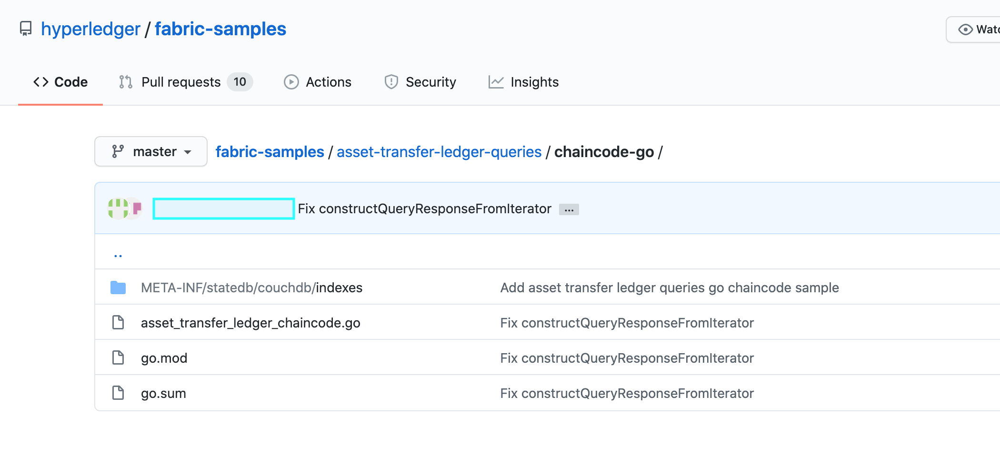

Using CouchDB
=============

このチュートリアルでは、Hyperledger FabricでCouchDBをステートデータベースとして使用するために必要な手順を説明します。これまでに、Fabricの概念を理解し、サンプルとチュートリアルをいくつか確認できたはずです。

.. note:: この手順では、Fabric v2.0リリースで導入された新しいFabricチェーンコードライフサイクルを使用します。以前のライフサイクルモデルを使用したチェーンコードでインデックスを使用する場合は、v1.4バージョンの `Using CouchDB <https://hyperledger-fabric.readthedocs.io/en/release-1.4/couchdb_tutorial.html>`__ を参照してください。

このチュートリアルでは、次の手順を実行します:

#. :ref:`cdb-enable-couch`
#. :ref:`cdb-create-index`
#. :ref:`cdb-add-index`
#. :ref:`cdb-install-deploy`
#. :ref:`cdb-query`
#. :ref:`cdb-best`
#. :ref:`cdb-pagination`
#. :ref:`cdb-update-index`
#. :ref:`cdb-delete-index`

CouchDBの詳細については :doc:`couchdb_as_state_database` を、Fabric台帳の詳細については `Ledger <ledger/ledger.html>`__ トピックを参照してください。ブロックチェーンネットワークでCouchDBを活用する方法については、以下のチュートリアルを参照してください。

このチュートリアルでは、

`Asset transfer ledger queries sample <https://github.com/hyperledger/fabric-samples/blob/{BRANCH}/asset-transfer-ledger-queries/chaincode-go>`__
をユースケースとして使用して、FabricでのCouchDBの使用方法を示し、ステートデータベースに対するJSONのクエリの実行を行います。タスクの :doc:`install` が完了しているはずです。

Why CouchDB?
~~~~~~~~~~~~

Fabricでは、2種類のピアのステートデータベースがサポートされています。LevelDBは、ピアノードに埋め込まれたデフォルトのステートデータベースです。LevelDBは、単純なキーと値のペアとしてチェーンコードデータを格納し、キー、キー範囲および複合キークエリのみをサポートしています。CouchDBはオプションの代替ステートデータベースで、JSONとして台帳のデータをモデル化し、キーではなくデータ値に対してリッチクエリを発行できます。また、CouchDBのサポートによって、チェーンコードとともにインデックスを配置してクエリをより効率的にし、大規模なデータセットにクエリを実行できます。

CouchDBの利点、つまりコンテンツベースのJSONクエリを活用するには、データをJSON形式でモデル化する必要があります。ネットワークを設定する前に、LevelDBとCouchDBのどちらを使用するかを決定する必要があります。LevelDBからCouchDBへのピアの切り替えは、データ互換性の問題によりサポートされていません。ネットワーク上のすべてのピアが同じデータベースタイプを使用する必要があります。JSONとバイナリデータ値が混在している場合でもCouchDBを使用できますが、バイナリ値はキー、キー範囲および複合キークエリに基づいてのみクエリできます。

.. _cdb-enable-couch:

Enable CouchDB in Hyperledger Fabric
~~~~~~~~~~~~~~~~~~~~~~~~~~~~~~~~~~~~

CouchDBは、ピアとは別のデータベースプロセスとして実行されます。セットアップ、管理、および操作の観点から、さらに考慮すべき点があります。 `CouchDB <https://hub.docker.com/_/couchdb/>`__ のDockerイメージが利用可能です。ピアと同じサーバー上で実行することをお薦めします。ピアごとに1つのCouchDBコンテナをセットアップし、 ``core.yaml`` の構成を変更して各ピアコンテナを更新し、CouchDBコンテナを指すようにする必要があります。 ``core.yaml`` ファイルは、環境変数FABRIC_CFG_PATHで指定されたディレクトリに配置する必要があります:

* Docker環境の場合、 ``core.yaml`` は事前に設定されており、ピアコンテナ ``FABRIC_CFG_PATH`` フォルダに置かれています。ただし、Docker環境を使用する場合は、core.yamlを上書きするために、例えばCouchDBのアドレスを指定するのに、 ``CORE_LEDGER_STATE_COUCHDBCONFIG_COUCHDBADDRESS`` といった環境変数を渡すことができます。
* ネイティブバイナリーを利用したデプロイメントの場合、 ``core.yaml`` はリリースアーティファクト配布に含まれています。

``core.yaml`` の ``stateDatabase`` セクションを編集します。 ``stateDatabase`` として ``CouchDB`` を指定し、関連する ``couchDBConfig`` プロパティに値を入力します。詳細については、 `CouchDB configuration <couchdb_as_state_database.html#couchdb-configuration>`__ を参照してください。

.. _cdb-create-index:

Create an index
~~~~~~~~~~~~~~~

なぜインデックスが重要なのでしょうか？

インデックスを使用すると、すべての行をすべてのクエリで検査することなくデータベースにクエリできるため、クエリの実行速度と効率が向上します。通常、インデックスは頻繁に発生するクエリ基準に対して構築されるため、データをより効率的にクエリできます。CouchDBの主な利点であるJSONデータに対して豊富なクエリを実行できる機能を利用するには、インデックスは必要ありませんが、パフォーマンスを向上させるためにインデックスを使用することを強くお薦めします。また、クエリでソートが必要な場合、CouchDBにはソートされたフィールドを含むインデックスが必要です。

.. note::

   インデックスを持たないJSONクエリは動くかもしれませんが、ピアのログにインデックスが見つからなかったことを警告がでるでしょう。ただし、リッチクエリにソート指定が含まれている場合は、そのフィールドのインデックスが必要です。そうでない場合、クエリは失敗し、エラーがスローされます。
  
インデックスの作成を示すために、 `Asset transfer ledger queries sample <https://github.com/hyperledger/fabric-samples/blob/{BRANCH}/asset-transfer-ledger-queries/chaincode-go/asset_transfer_ledger_chaincode.go>`__ のデータを使用します。この例では、資産(Asset)データ構造は次のように定義されています:

.. code:: javascript

   type Asset struct {
           DocType        string `json:"docType"` //docType is used to distinguish the various types of objects in state database
           ID             string `json:"ID"`      //the field tags are needed to keep case from bouncing around
           Color          string `json:"color"`
           Size           int    `json:"size"`
           Owner          string `json:"owner"`
           AppraisedValue int    `json:"appraisedValue"`
   }

この構造では、属性( ``docType`` 、 ``name`` 、 ``ID`` 、 ``size`` 、 ``owner`` 、 ``appraisedValue`` )によって、資産に関連付けられた台帳データが定義されます。 ``docType`` 属性はチェーンコードで使用されるパターンで、個別にクエリする必要がある様々なデータ型を区別するために使用されます。CouchDBを使用する場合は、各チェーンコードは独自のCouchDBデータベースとして表されます。つまり、各チェーンコードには独自のキー用ネームスペースがあります。

Assetデータ構造に関して、 ``docType`` は、このJSONドキュメントが資産であることを識別するために使用されます。チェーンコードデータベースに他のJSONドキュメントタイプが存在する可能性があります。どのJSONフィールドでも、CouchDBのJSONクエリで使用することができます。

チェーンコードクエリで使用するインデックスを定義する場合は、それぞれのインデックスを `*.json` という拡張子を持つ独自のテキストファイルで定義し、インデックス定義をCouchDBインデックスJSONフォーマットでフォーマットする必要があります。

インデックスを定義するには、次の3つの情報が必要です:

  * `fields`: クエリされるフィールド
  * `name`: インデックスの名前
  * `type`: このコンテキストでは常に"json"

たとえば、 ``foo`` という名前のフィールドの ``foo-index`` という名前の単純なインデックスです。

.. code:: json

    {
        "index": {
            "fields": ["foo"]
        },
        "name" : "foo-index",
        "type" : "json"
    }

オプションで、設計ドキュメント属性 ``ddoc`` をインデックス定義で指定できます。 `設計ドキュメント <http://guide.couchdb.org/draft/design.html>`__ は、インデックスを含むように設計されたCouchDB構造です。インデックスは、効率化のために設計ドキュメントにグループ化できますが、CouchDBは設計ドキュメントごとに1つのインデックスを推奨しています。

.. tip:: インデックスを定義する場合は、インデックス名とともに ``ddoc`` 属性および値を含めることをお薦めします。必要に応じて後でインデックスを更新できるように、この属性を含めることが重要です。また、クエリで使用するインデックスを明示的に指定できます。

複数のフィールド ``docType`` と ``owner`` を使用し、 ``ddoc`` 属性を含むインデックス名 ``indexOwner`` を持つAsset transfer ledger queriesサンプルのインデックス定義の別の例を次に示します:

.. _indexExample:

.. code:: json

  {
    "index":{
        "fields":["docType","owner"] // Names of the fields to be queried
    },
    "ddoc":"indexOwnerDoc", // (optional) Name of the design document in which the index will be created.
    "name":"indexOwner",
    "type":"json"
  }

前述の例では、設計ドキュメント ``indexOwnerDoc`` が存在しない場合、インデックスが配布されるときに自動的に作成されます。インデックスは、フィールドのリストに指定された1つ以上の属性を使用して構成でき、属性の任意の組合せを指定できます。1つの属性は、同じdocTypeの複数のインデックスに存在できます。次の例では、 ``index1`` には属性 ``owner`` のみが含まれ、 ``index2`` には属性 ``owner`` および ``color`` が含まれ、 ``index3`` には属性 ``owner`` と ``color`` および ``size`` が含まれます。また、CouchDBの推奨プラクティスに従って、各インデックス定義に独自の ``ddoc`` 値があることに注意してください。

.. code:: json

  {
    "index":{
        "fields":["owner"] // Names of the fields to be queried
    },
    "ddoc":"index1Doc", // (optional) Name of the design document in which the index will be created.
    "name":"index1",
    "type":"json"
  }

  {
    "index":{
        "fields":["owner", "color"] // Names of the fields to be queried
    },
    "ddoc":"index2Doc", // (optional) Name of the design document in which the index will be created.
    "name":"index2",
    "type":"json"
  }

  {
    "index":{
        "fields":["owner", "color", "size"] // Names of the fields to be queried
    },
    "ddoc":"index3Doc", // (optional) Name of the design document in which the index will be created.
    "name":"index3",
    "type":"json"
  }

一般に、クエリのフィルタや並べ替えに使用されるフィールドと一致するように、インデックスフィールドをモデル化する必要があります。JSONフォーマットでのインデックス作成の詳細については、 `CouchDBのドキュメント <http://docs.couchdb.org/en/latest/api/database/find.html#db-index>`__ を参照してください。

インデックスに関する最後のポイントとして、Fabricはデータベース内のドキュメントのインデックス付けを ``インデックスウォーミング`` と呼ばれるパターンを使用して行います。CouchDBは通常、次のクエリまで新しいドキュメントや更新されたドキュメントのインデックス付けを行いません。Fabricは、データブロックがコミットされるたびにインデックスの更新を要求することで、インデックスが 'ウォーム' のままであることを保証します。これにより、クエリを実行する前にドキュメントのインデックス付けが不要になるため、クエリが高速になります。このプロセスは、インデックスを最新の状態に保ち、ステートデータベースに新しいレコードが追加されるたびにリフレッシュされます。

.. _cdb-add-index:

Add the index to your chaincode folder
~~~~~~~~~~~~~~~~~~~~~~~~~~~~~~~~~~~~~~

インデックスを完成させたら、適切なメタデータフォルダに配置して、配布用のチェーンコードとともにパッケージ化する必要があります。このチェーンコードは、 :doc:`commands/peerlifecycle` コマンドを使用してパッケージ化してインストールできます。JSONインデックスファイルは、チェーンコードが存在するディレクトリ内のパス ``META-INF/statedb/couchdb/indexes`` の下に配置する必要があります。

下の `Asset transfer ledger queries sample <https://github.com/hyperledger/fabric-samples/tree/{BRANCH}/asset-transfer-ledger-queries/chaincode-go>`__ は、インデックスがチェーンコードと一緒にパッケージ化されている様子を示しています。

このサンプルには、資産の所有者(owner)によるクエリをサポートするために、indexOwnerDocという名前のインデックスが1つ含まれています:

.. code:: json

  {"index":{"fields":["docType","owner"]},"ddoc":"indexOwnerDoc", "name":"indexOwner","type":"json"}

Start the network
-----------------

:guilabel:`Try it yourself`

Fabricテストネットワークを起動して、Asset transfer ledger queriesチェーンコードを展開します。次のコマンドを使用して、Fabricサンプル内の `test-network` ディレクトリに移動します:

.. code:: bash

    cd fabric-samples/test-network

このチュートリアルでは、既知の初期状態から操作します。次のコマンドは、アクティブまたは古いDockerコンテナを削除し、以前に生成されたアーティファクトを削除します:

.. code:: bash

    ./network.sh down

チュートリアルをまだ実行していない場合は、ネットワークに展開する前に、チェーンコードの依存関係をベンダーに提供する必要があります。次のコマンドを実行します:

.. code:: bash

    cd ../asset-transfer-ledger-queries/chaincode-go
    GO111MODULE=on go mod vendor
    cd ../../test-network

`test-network` ディレクトリから、次のコマンドを使用して、CouchDBを使用するテストネットワークをデプロイします:

.. code:: bash

    ./network.sh up createChannel -s couchdb

これにより、ステートデータベースとしてCouchDBを使用する2つのFabricピアノードが作成されます。また、1つのオーダリングノードと ``mychannel`` という名前の1つのチャネルも作成されます。

.. _cdb-install-deploy:

Deploy the smart contract
~~~~~~~~~~~~~~~~~~~~~~~~~

test networkスクリプトを使って、Asset transfer ledger queriesスマートコントラクトをチャネルにデプロイすることができます。
スマートコントラクトを `mychannel` にデプロイするには、次のコマンドを実行してください。

.. code:: bash

  ./network.sh deployCC -ccn ledger -ccp ../asset-transfer-ledger-queries/chaincode-go/ -ccl go -ccep "OR('Org1MSP.peer','Org2MSP.peer')"

スマートコントラクトを `"OR('Org1MSP.peer','Org2MSP.peer')"` というエンドースメントポリシーでデプロイするために、 `-ccep` フラグを使っていることに注目してください。これによって、ほかの組織のエンドースメントを得ることなく、各組織は資産をつくることができます。

Verify index was deployed
-------------------------

チェーンコードがピアにインストールされ、チャネルに展開されると、インデックスは、各ピアのCouchDBステートデータベースに展開されます。CouchDBインデックスが正常に作成されたことは、Dockerコンテナのピアログを調べることで確認できます。

:guilabel:`Try it yourself`

ピアDockerコンテナのログを表示するには、新しいターミナルウィンドウを開き、次のコマンドを実行してgrepを実行し、インデックスが作成されたことを確認します。

::

   docker logs peer0.org1.example.com  2>&1 | grep "CouchDB index"

次のような結果が表示されます:

::

   [couchdb] createIndex -> INFO 072 Created CouchDB index [indexOwner] in state database [mychannel_ledger] using design document [_design/indexOwnerDoc]

.. _cdb-query:

Query the CouchDB State Database
~~~~~~~~~~~~~~~~~~~~~~~~~~~~~~~~

インデックスがJSONファイルで定義され、チェーンコードとともにデプロイされたので、チェーンコード関数はCouchDBステートデータベースに対してJSONクエリを実行することができます。

クエリでインデックス名を指定するかどうかはオプションです。指定しない場合、クエリ対象のフィールドに既にインデックスが存在すると、既存のインデックスが自動的に使用されます。

.. tip:: ``use_index`` キーワードを使用して、明示的にインデックス名をクエリに含めることをお勧めします。これがないと、CouchDBはあまり最適でないインデックスを選択する可能性があります。また、CouchDBはまったくインデックスを使用しない可能性があり、テスト中の低ボリュームではそれに気付かない可能性があります。CouchDBはインデックスを使用していないので、高ボリュームでのみパフォーマンスが低下する可能性があります。

Build the query in chaincode
----------------------------

チェーンコード内で定義されたクエリを使用して、台帳のデータに対してJSONクエリを実行できます。 `Asset transfer ledger queries sample <https://github.com/hyperledger/fabric-samples/blob/{BRANCH}/asset-transfer-ledger-queries/chaincode-go/asset_transfer_ledger_chaincode.go>`__ には、2つのJSONクエリ関数が含まれています:

  * **QueryAssets** --

      **アドホックなJSONクエリ** の例です。これは、関数にセレクタJSONクエリ文字列を渡すことができるクエリです。このクエリは、実行時に独自のクエリを動的に構築する必要があるクライアントアプリケーションに役立ちます。クエリセレクタの詳細は、 `CouchDBセレクタ構文 <http://docs.couchdb.org/en/latest/api/database/find.html#find-selectors>`__ を参照してください。

  * **QueryAssetsByOwner** --

      **パラメータ化されたクエリ** の例です。クエリはチェーンコードで定義されていますが、クエリパラメータを渡すことができるものです。この例では、関数は資産の所有者という単一の引数を受け入れます。次に、JSONクエリ構文を使用して、 “asset” のdocTypeと所有者IDに一致するJSONドキュメントをステートデータベースにクエリします。

Run the query using the peer command
------------------------------------

クライアントアプリケーションが存在しない場合は、peerコマンドを使用してで定義されたクエリをテストできます。 `peer chaincode query <commands/peerchaincode.html?%20chaincode%20query#peer-chaincode-query>`__ コマンドを使って、Assetsのインデックス ``indexOwner`` を使用し、 ``QueryAssets`` 関数を使用して "tom" が所有するすべての資産をクエリするようにします。

:guilabel:`Try it yourself`

データベースを照会する前に、いくつかのデータを追加する必要があります。次のコマンドをOrg1として実行し、 "tom" が所有する資産を作成します:

.. code:: bash

    export CORE_PEER_LOCALMSPID="Org1MSP"
    export CORE_PEER_TLS_ROOTCERT_FILE=${PWD}/organizations/peerOrganizations/org1.example.com/peers/peer0.org1.example.com/tls/ca.crt
    export CORE_PEER_MSPCONFIGPATH=${PWD}/organizations/peerOrganizations/org1.example.com/users/Admin@org1.example.com/msp
    export CORE_PEER_ADDRESS=localhost:7051
    peer chaincode invoke -o localhost:7050 --ordererTLSHostnameOverride orderer.example.com --tls --cafile ${PWD}/organizations/ordererOrganizations/example.com/orderers/orderer.example.com/msp/tlscacerts/tlsca.example.com-cert.pem -C mychannel -n ledger -c '{"Args":["CreateAsset","asset1","blue","5","tom","35"]}'

次にtomが所有しているすべての資産をクエリします:

.. code:: bash

   // Rich Query with index name explicitly specified:
   peer chaincode query -C mychannel -n ledger -c '{"Args":["QueryAssets", "{\"selector\":{\"docType\":\"asset\",\"owner\":\"tom\"}, \"use_index\":[\"_design/indexOwnerDoc\", \"indexOwner\"]}"]}'

上記のqueryコマンドには、3つの興味深い引数があります:

*  ``QueryAssets``

  Assetsチェーンコード内の関数の名前。下記のチェーンコード関数からわかるように、QueryAssets()は、 ``getQueryResultForQueryString()`` を呼び、それがqueryStringを shim APIの ``getQueryResult()`` に渡し、ステートデータベースにJSONクエリを実行します。

.. code:: bash

  func (t *SimpleChaincode) QueryAssets(ctx contractapi.TransactionContextInterface, queryString string) ([]*Asset, error) {
          return getQueryResultForQueryString(ctx, queryString)
  }

*  ``{"selector":{"docType":"asset","owner":"tom"}``

  これは、 ``owner`` 属性の値が ``tom`` である ``asset`` タイプのすべてのドキュメントをクエリする **アドホックセレクタ** 文字列の例です。

*  ``"use_index":["_design/indexOwnerDoc", "indexOwner"]``

  設計ドキュメント名 ``indexOwnerDoc`` とインデックス名 ``indexOwner`` の両方を指定します。この例では、セレクタクエリに ``use_index`` キーワードを使用して指定したインデックス名が明示的に含まれています。上のインデックス定義 :ref:`cdb-create-index` を思い出してください。これには設計ドキュメント ``"ddoc":"indexOwnerDoc"`` が含まれています。CouchDBでは、クエリにインデックス名を明示的に含める場合、インデックス定義に ``ddoc`` 値を含める必要があるため、 ``use_index`` キーワードを使用して参照できます。:ref:

クエリは正常に実行され、インデックスは次の結果で利用されます:

.. code:: json

  [{"docType":"asset","ID":"asset1","color":"blue","size":5,"owner":"tom","appraisedValue":35}]

.. _cdb-best:

Use best practices for queries and indexes
~~~~~~~~~~~~~~~~~~~~~~~~~~~~~~~~~~~~~~~~~~

インデックスを使用するクエリは、CouchDBでデータベース全体をスキャンすることなく、より高速に処理できます。インデックスを理解することで、クエリを作成してパフォーマンスを向上させることができ、アプリケーションがネットワーク上の大量のデータやブロックを処理できるようになります。

また、チェーンコードとともにインストールするインデックスを計画することも重要です。ほとんどのクエリをサポートするチェーンコードごとに、少数のインデックスのみをインストールする必要があります。追加するインデックスが多すぎるか、インデックス内のフィールドの数が多すぎると、ネットワークのパフォーマンスが低下します。これは、各ブロックがコミットされた後にインデックスが更新されるためです。 "インデックスウォーミング" によって更新するインデックスの数が多いほど、トランザクションの完了にかかる時間が長くなります。

この項の例は、クエリでインデックスがどのように使用されるか、およびどのタイプのクエリが最高のパフォーマンスを発揮するかを示すのに役立ちます。クエリを作成する場合は、次の点に注意してください:

* インデックス内のすべてのフィールドは、インデックスを使用するクエリのセレクタセクションまたは並べ替えセクションにも含まれている必要があります。
* 複雑なクエリではパフォーマンスが低下し、インデックスを使用する可能性が低くなります。
* ``$or`` 、 ``$in`` 、 ``$regex`` など、テーブル全体のスキャンやインデックス全体のスキャンを実行する演算子は避けてください。

このチュートリアルの前のセクションでは、assetsチェーンコードに対して次のクエリを実行しました:

.. code:: bash

  // Example one: query fully supported by the index
  export CHANNEL_NAME=mychannel
  peer chaincode query -C $CHANNEL_NAME -n ledger -c '{"Args":["QueryAssets", "{\"selector\":{\"docType\":\"asset\",\"owner\":\"tom\"}, \"use_index\":[\"indexOwnerDoc\", \"indexOwner\"]}"]}'

asset transfer ledger queriesのチェーンコードは、 ``indexOwnerDoc`` インデックスとともにインストールされました:

.. code:: json

  {"index":{"fields":["docType","owner"]},"ddoc":"indexOwnerDoc", "name":"indexOwner","type":"json"}

``docType`` と ``owner`` の両方のフィールドがインデックスに含まれているため、完全にサポートされたクエリになります。その結果、このクエリは、データベース全体を検索することなく、インデックス内のデータを使用できるようになります。このような完全にサポートされたクエリは、チェーンコードからの他のクエリよりも高速に返されます。

上記のクエリにフィールドを追加しても、インデックスが使用されます。ただし、クエリでは追加したフィールド向けにインデックス付きデータをスキャンする必要があるため、応答時間が長くなります。たとえば、以下のクエリではインデックスが使用されますが、前の例よりも返されるまでの時間が長くなります。

.. code:: bash

  // Example two: query fully supported by the index with additional data
  peer chaincode query -C $CHANNEL_NAME -n ledger -c '{"Args":["QueryAssets", "{\"selector\":{\"docType\":\"asset\",\"owner\":\"tom\",\"color\":\"blue\"}, \"use_index\":[\"/indexOwnerDoc\", \"indexOwner\"]}"]}'

インデックス内のすべてのフィールドが含まれていないクエリは、代わりにデータベース全体をスキャンする必要があります。たとえば、次のクエリは、所有されるアイテムの種類を指定せずに所有者を検索します。indexOwnerDocには ``owner`` フィールドと ``docType`` フィールドの両方が含まれているため、このクエリはインデックスを使用できません。

.. code:: bash

  // Example three: query not supported by the index
  peer chaincode query -C $CHANNEL_NAME -n ledger -c '{"Args":["QueryAssets", "{\"selector\":{\"owner\":\"tom\"}, \"use_index\":[\"indexOwnerDoc\", \"indexOwner\"]}"]}'

一般に、複雑なクエリほどレスポンス時間が長くなり、インデックスでサポートされる可能性が低くなります。 ``$or`` 、 ``$in`` および ``$regex`` などの演算子を使用すると、多くの場合、クエリでインデックス全体がスキャンされるか、インデックスがまったく使用されません。

たとえば、以下のクエリには、すべての資産とtomが所有するすべてのアイテムを検索する ``$or`` という語が含まれています。

.. code:: bash

  // Example four: query with $or supported by the index
  peer chaincode query -C $CHANNEL_NAME -n ledger -c '{"Args":["QueryAssets", "{\"selector\":{\"$or\":[{\"docType\":\"asset\"},{\"owner\":\"tom\"}]}, \"use_index\":[\"indexOwnerDoc\", \"indexOwner\"]}"]}'

このクエリは、 ``indexOwnerDoc`` に含まれるフィールドを検索するため、インデックスを使用します。ただし、クエリの ``$or`` 条件では、インデックス内のすべてのアイテムをスキャンする必要があるため、応答時間が長くなります。

次に、インデックスでサポートされていない複雑なクエリの例を示します。

.. code:: bash

  // Example five: Query with $or not supported by the index
  peer chaincode query -C $CHANNEL_NAME -n ledger -c '{"Args":["QueryAssets", "{\"selector\":{\"$or\":[{\"docType\":\"asset\",\"owner\":\"tom\"},{\"color\":\"yellow\"}]}, \"use_index\":[\"indexOwnerDoc\", \"indexOwner\"]}"]}'

このクエリでは、tomが所有するすべての資産またはその他の黄色のアイテムが検索されます。 ``$or`` 条件を満たすにはテーブル全体を検索する必要があるため、このクエリではインデックスは使用されません。台帳のデータ量によっては、このクエリの応答に時間がかかる場合やタイムアウトになる場合があります。

クエリのベストプラクティスに従うことは重要ですが、インデックスを使用することは大量のデータを収集するためのソリューションではありません。ブロックチェーンのデータ構造は、トランザクションを検証および確認するために最適化されており、データ分析やレポート作成には適していません。アプリケーションの一部としてダッシュボードを構築したり、ネットワークのデータを分析したりする場合は、ピアのデータを複製するオフチェーンデータベースにクエリを実行することをお勧めします。これにより、ネットワークのパフォーマンスを低下させたり、トランザクションを中断させたりすることなく、ブロックチェーン上のデータを理解することができます。

アプリケーションのブロックイベントまたはチェーンコードイベントを使用して、オフチェーンデータベースまたは分析エンジンにトランザクションデータを書き込むことができます。受信された各ブロックに対して、ブロックリスナーアプリケーションはブロックトランザクションを繰り返し処理し、各有効なトランザクションの ``rwset`` からのキー/値の書込みを使用してデータストアを構築します。 :doc:`peer_event_services` は、ダウンストリームデータストアの整合性を確保するために、再生可能なイベントを提供します。イベントリスナーを使用して外部データベースにデータを書き込む方法の例は、Fabric
Samplesの `オフチェーンデータサンプル <https://github.com/hyperledger/fabric-samples/tree/{BRANCH}/off_chain_data>`__ を参照してください。

.. _cdb-pagination:

Query the CouchDB State Database With Pagination
~~~~~~~~~~~~~~~~~~~~~~~~~~~~~~~~~~~~~~~~~~~~~~~~

CouchDBクエリによって大量の結果セットが返される場合、結果のリストをページ付けするためにチェーンコードによって呼び出すことができるAPIのセットが使用可能です。ページ付けは、 ``pagesize`` と ``bookmark`` (結果セット内の開始位置を示すブックマーク)を指定することによって結果セットを分割するメカニズムを提供します。クライアントアプリケーションは、結果が返されなくなるまで、クエリを実行するチェーンコードを繰り返し呼び出します。詳細は、 `CouchDBによるページ付けに関するこのトピック <couchdb_as_state_database.html#couchdb-pagination>`__ を参照してください。

Asset transfer ledger queries sample <https://github.com/hyperledger/fabric-samples/blob/{BRANCH}/asset-transfer-ledger-queries/chaincode-go/asset_transfer_ledger_chaincode.go>`__ 関数 ``QueryAssetsWithPagination`` を使って、ページ付けをチェーンコードとクライアントアプリケーションに実装する方法を説明します。

* **QueryAssetsWithPagination** --

    **ページ区切りを使用したアドホックJSONクエリ** の例です。これは、前述の例と同様にセレクタ文字列を関数に渡すことができるクエリです。この場合、 ``pagesize`` も ``bookmark`` と同様にクエリに含まれます。

ページ付けを説明するには、さらにデータが必要です。この例では、上記のasset1がすでに追加されていることを前提としています。ピアコンテナで次のコマンドを実行して、 "tom" が所有する資産をさらに4つ作成し、 "tom" が所有する資産を合計5つ作成します:

:guilabel:`Try it yourself`

.. code:: bash

    export CORE_PEER_LOCALMSPID="Org1MSP"
    export CORE_PEER_TLS_ROOTCERT_FILE=${PWD}/organizations/peerOrganizations/org1.example.com/peers/peer0.org1.example.com/tls/ca.crt
    export CORE_PEER_MSPCONFIGPATH=${PWD}/organizations/peerOrganizations/org1.example.com/users/Admin@org1.example.com/msp
    export CORE_PEER_ADDRESS=localhost:7051
    peer chaincode invoke -o localhost:7050 --ordererTLSHostnameOverride orderer.example.com --tls --cafile  ${PWD}/organizations/ordererOrganizations/example.com/orderers/orderer.example.com/msp/tlscacerts/tlsca.example.com-cert.pem -C mychannel -n ledger -c '{"Args":["CreateAsset","asset2","yellow","5","tom","35"]}'
    peer chaincode invoke -o localhost:7050 --ordererTLSHostnameOverride orderer.example.com --tls --cafile  ${PWD}/organizations/ordererOrganizations/example.com/orderers/orderer.example.com/msp/tlscacerts/tlsca.example.com-cert.pem -C mychannel -n ledger -c '{"Args":["CreateAsset","asset3","green","6","tom","20"]}'
    peer chaincode invoke -o localhost:7050 --ordererTLSHostnameOverride orderer.example.com --tls --cafile  ${PWD}/organizations/ordererOrganizations/example.com/orderers/orderer.example.com/msp/tlscacerts/tlsca.example.com-cert.pem -C mychannel -n ledger -c '{"Args":["CreateAsset","asset4","purple","7","tom","20"]}'
    peer chaincode invoke -o localhost:7050 --ordererTLSHostnameOverride orderer.example.com --tls --cafile  ${PWD}/organizations/ordererOrganizations/example.com/orderers/orderer.example.com/msp/tlscacerts/tlsca.example.com-cert.pem -C mychannel -n ledger -c '{"Args":["CreateAsset","asset5","blue","8","tom","40"]}'

前の例のクエリの引数に加えて、QueryAssetsWithPaginationは ``pagesize`` と ``bookmark`` を追加します。 ``pagesize`` は、クエリごとに戻されるレコード数を指定します。 ``bookmark`` は、ページの開始位置をcouchDBに指示する "アンカー" です(結果の各ページは一意のブックマークを戻します)。

*  ``QueryAssetsWithPagination``

  下記のチェーンコード内の関数からわかるように、QueryAssetsWithPagination()は、``getQueryResultForQueryStringWithPagination()`` を呼び、queryStringをページサイズおよびブックマークとともに、shim API ``GetQueryResultWithPagination()`` に渡し、ステートデータベースに対してページ付けされたJSONクエリを実行します。

.. code:: bash

  func (t *SimpleChaincode) QueryAssetsWithPagination(
          ctx contractapi.TransactionContextInterface,
          queryString,
          bookmark string,
          pageSize int) ([]*Asset, error) {

          return getQueryResultForQueryStringWithPagination(ctx, queryString, int32(pageSize), bookmark)
  }

次の例は、ページサイズが ``3`` でブックマークが指定されていないQueryAssetsWithPaginationを呼び出すpeerコマンドです。

.. tip:: ブックマークが指定されていない場合、クエリはレコードの "最初の" ページから始まります。

:guilabel:`Try it yourself`

.. code:: bash

  // Rich Query with index name explicitly specified and a page size of 3:
  peer chaincode query -C mychannel -n ledger -c '{"Args":["QueryAssetsWithPagination", "{\"selector\":{\"docType\":\"asset\",\"owner\":\"tom\"}, \"use_index\":[\"_design/indexOwnerDoc\", \"indexOwner\"]}","","3"]}'

次の応答が受信されます(わかりやすくするために改行が追加されています)。 ``pagesize`` が ``3`` に設定されているため、5つの資産のうち3つが返されます:

.. code:: bash

  [{"docType":"asset","ID":"asset1","color":"blue","size":5,"owner":"tom","appraisedValue":35},
  {"docType":"asset","ID":"asset2","color":"yellow","size":5,"owner":"tom","appraisedValue":35},
  {"docType":"asset","ID":"asset3","color":"green","size":6,"owner":"tom","appraisedValue":20}]

.. note::  ブックマークはクエリごとにCouchDBによって一意に生成され、結果セット内のプレースホルダを表します。返されたブックマークを後に続く繰り返しのクエリに渡して、次の結果セットを取得します。

次に、ページサイズが ``3`` のQueryAssetsWithPaginationを呼び出すためのpeerコマンドを示します。今回のクエリには、前のクエリから返されたブックマークが含まれています。

:guilabel:`Try it yourself`

.. code:: bash

  peer chaincode query -C $CHANNEL_NAME -n ledger -c '{"Args":["QueryAssetsWithPagination", "{\"selector\":{\"docType\":\"asset\",\"owner\":\"tom\"}, \"use_index\":[\"_design/indexOwnerDoc\", \"indexOwner\"]}","g1AAAABLeJzLYWBgYMpgSmHgKy5JLCrJTq2MT8lPzkzJBYqz5yYWJeWkGoOkOWDSOSANIFk2iCyIyVySn5uVBQAGEhRz","3"]}'

次の応答が受信されます(わかりやすくするために改行が追加されています)。最後の2つのレコードが取得されます:

.. code:: bash

  [{"Key":"asset4", "Record":{"color":"purple","docType":"asset","name":"asset4","size":"7","owner":"tom","appraisedValue":20}},
   {"Key":"asset5", "Record":{"color":"blue","docType":"asset","name":"asset5","size":"8","owner":"tom","appraisedValue":40}}]
  [{"ResponseMetadata":{"RecordsCount":"2",
  "Bookmark":"g1AAAABLeJzLYWBgYMpgSmHgKy5JLCrJTq2MT8lPzkzJBYqz5yYWJeWkmoKkOWDSOSANIFk2iCyIyVySn5uVBQAGYhR1"}}]

最後のコマンドは、ページサイズが ``3`` で、前のクエリのブックマークを持つQueryAssetsWithPaginationを呼び出すピアコマンドです。

:guilabel:`Try it yourself`

.. code:: bash

    peer chaincode query -C $CHANNEL_NAME -n ledger -c '{"Args":["QueryAssetsWithPagination", "{\"selector\":{\"docType\":\"asset\",\"owner\":\"tom\"}, \"use_index\":[\"_design/indexOwnerDoc\", \"indexOwner\"]}","g1AAAABLeJzLYWBgYMpgSmHgKy5JLCrJTq2MT8lPzkzJBYqz5yYWJeWkmoKkOWDSOSANIFk2iCyIyVySn5uVBQAGYhR1","3"]}'

次の応答が受信されます(わかりやすくするために改行が追加されています)。何もレコードは返されませんでした。すなわち全てのページが取得されたことを示します:

.. code:: bash

    []
    [{"ResponseMetadata":{"RecordsCount":"0",
    "Bookmark":"g1AAAABLeJzLYWBgYMpgSmHgKy5JLCrJTq2MT8lPzkzJBYqz5yYWJeWkmoKkOWDSOSANIFk2iCyIyVySn5uVBQAGYhR1"}}]

クライアントアプリケーションがページ付けを使用して結果セットを繰り返し処理する例として、 `Asset transfer ledger queries sample <https://github.com/hyperledger/fabric-samples/blob/{BRANCH}/asset-transfer-ledger-queries/chaincode-go/asset_transfer_ledger_chaincode.go>`__ の ``getQueryResultForQueryStringWithPagination`` 関数を検索してください。

.. _cdb-update-index:

Update an Index
~~~~~~~~~~~~~~~

インデックスは、時間の経過とともに更新する必要がある場合があります。インストールされるチェーンコードの後続バージョンに同じインデックスが存在する場合があります。インデックスを更新するには、元のインデックス定義に設計ドキュメントの ``ddoc`` 属性とインデックス名が含まれている必要があります。インデックス定義を更新するには、同じインデックス名を使用し、インデックス定義を変更します。インデックスJSONファイルを編集し、インデックスからフィールドを追加または削除するだけです。FabricではインデックスタイプJSONのみがサポートされています。インデックスタイプの変更はサポートされていません。チェーンコード定義がチャネルにコミットされると、更新されたインデックス定義がピアのステートデータベースに再配布されます。インデックス名または ``ddoc`` 属性を変更すると、新しいインデックスが作成され、元のインデックスは削除されるまでCouchDBで変更されません。

.. note:: ステートデータベースに大量のデータがある場合は、インデックスが再構築されるまでに時間がかかります。その時間の間に、チェーンコードが呼び出しを行うと、問い合わせが失敗したりタイムアウトしたりする可能性があります。

Iterating on your index definition
----------------------------------

開発環境でピアのCouchDBステートデータベースにアクセスできる場合は、チェーンコードクエリをサポートするさまざまなインデックスを反復的にテストできます。ただし、チェーンコードを変更する場合は、再デプロイが必要になります。インデックスを作成および更新するには、 `CouchDB Fauxtonインターフェース <http://docs.couchdb.org/en/latest/fauxton/index.html>`__ またはコマンドラインユーティリティーを使用してください。

.. note:: Fauxtonインターフェースは、CouchDBに対してインデックスを作成、更新、およびデプロイするためのWeb UIです。このインターフェースを試してみると、AssetsサンプルのインデックスのFauxtonバージョンのフォーマットの例があります。CouchDBを使用してテストネットワークをデプロイした場合は、ブラウザーを開いて ``http://localhost:5984/_utils`` に移動することにより、Fauxtonインターフェースをロードすることができます。

また、Fauxton UIを使用しない場合は、次のcurlコマンドを使用してデータベース ``mychannel_ledger`` にインデックスを作成できます:

.. code:: bash

  // Index for docType, owner.
  // Example curl command line to define index in the CouchDB channel_chaincode database
   curl -i -X POST -H "Content-Type: application/json" -d
          "{\"index\":{\"fields\":[\"docType\",\"owner\"]},
            \"name\":\"indexOwner\",
            \"ddoc\":\"indexOwnerDoc\",
            \"type\":\"json\"}" http://hostname:port/mychannel_ledger/_index

.. note:: CouchDBで構成されたテストネットワークを使用している場合は、hostname:portを ``localhost:5984`` に置き換えてください。

.. _cdb-delete-index:

Delete an Index
~~~~~~~~~~~~~~~

インデックスの削除はFabricツールで管理されません。インデックスを削除する必要がある場合は、データベースに対してcurlコマンドを手動で発行するか、Fauxtonインタフェースを使用して削除してください。

インデックスを削除するcurlコマンドの形式は次のようになります:

.. code:: bash

   curl -X DELETE http://localhost:5984/{database_name}/_index/{design_doc}/json/{index_name} -H  "accept: */*" -H  "Host: localhost:5984"

このチュートリアルで使用するインデックスを削除するには、curlコマンドを次のようにします:

.. code:: bash

   curl -X DELETE http://localhost:5984/mychannel_ledger/_index/indexOwnerDoc/json/indexOwner -H  "accept: */*" -H  "Host: localhost:5984"

.. Licensed under Creative Commons Attribution 4.0 International License
   https://creativecommons.org/licenses/by/4.0/
