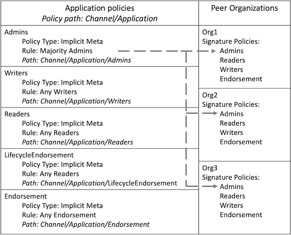

# Channel policies

チャネルは、組織間のプライベートな通信方式です。そのため、チャネル設定に対するほとんどの変更は、チャネルの他のメンバーによって同意される必要があります。組織が他の組織の承認を取得することなくチャネルに参加して台帳上のデータの読み込みができる場合、チャネルは役に立ちません。チャネル **structure** (構造)に対するどんな変更も、チャネルポリシーを満たすことができる一連の組織によって承認される必要があります。

また、ポリシーは、ユーザーがチャネルとやりとりする方法の **processes** (プロセス)も管理します。たとえば、チャネルにデプロイされる前にチェーンコードを承認する必要がある一連の組織や、チャネル管理者が完了する必要があるアクションなどです。

チャネルポリシーは、独自のトピックで議論する必要があるほど重要です。チャネル設定の他の部分とは異なり、チャネルを管理するポリシーは、 `configtx.yaml` ファイルのさまざまなセクションがどのように連携するかによって決定されます。チャネルポリシーはいくつかの制約のもとであらゆるユースケースに合わせて設定することができますが、このトピックでは、Hyperledger Fabricによって提供されるデフォルトポリシーの使用方法に重点を置きます。Fabricテストネットワークまたは [Fabric sample configuration](https://github.com/hyperledger/fabric/blob/{BRANCH}/sampleconfig/configtx.yaml) で使用されるデフォルトポリシーを使用する場合、作成する各チャネルはSignatureポリシー、ImplicitMetaポリシーおよびアクセス制御リストの組合せを使用して、組織がチャネルとやりとりする方法を決定し、チャネル構造の更新することに同意します。Hyperledger Fabricにおけるポリシーのロールについては、 [Policies concept topic](../policies.html) を参照すると、さらに詳しく知ることができます。

## Signature policies

デフォルトでは、各チャネルメンバーは組織を参照するSignatureポリシーのセットを定義します。提案がピアに送信されるか、トランザクションがオーダリングノードに送信されたとき、ノードはトランザクションに添付された署名を読み込みし、チャネル設定で定義されたSignatureポリシーに対してそれらを評価します。すべてのSignatureポリシーには、署名によってポリシーを満たすことができる組織とアイデンティティのセットを指定するルールがあります。次の `configtx.yaml` の **Organizations** セクションで、Org1によって定義されたSignatureポリシーは次のように表示されます。 :

```yaml
- &Org1

  ...

  Policies:
      Readers:
          Type: Signature
          Rule: "OR('Org1MSP.admin', 'Org1MSP.peer', 'Org1MSP.client')"
      Writers:
          Type: Signature
          Rule: "OR('Org1MSP.admin', 'Org1MSP.client')"
      Admins:
          Type: Signature
          Rule: "OR('Org1MSP.admin')"
      Endorsement:
          Type: Signature
          Rule: "OR('Org1MSP.peer')"
```

上記のポリシーはすべて、Org1からの署名によって満たすことができます。ただし、各ポリシーには、そのポリシーを満たすことができる組織内の様々なロール(のセット)が記載されています。 `Admins` ポリシーは、管理者ロールを持つアイデンティティによって送信されたトランザクションによってのみ満たされます。一方、 `Endorsement` ポリシーはピアロールを持つアイデンティティのみが満たすことができます。1つのトランザクションに付けられた署名セットは、複数のSignatureポリシーを満たすことができます。たとえば、トランザクションに添付されたエンドースメントがOrg1とOrg2の両方によって提供された場合、この署名セットはOrg1かつOrg2の `Endorsement` ポリシーを満たすことになります。

## ImplicitMeta Policies

チャネルがデフォルトポリシーを使用する場合、各組織のSignatureポリシーは、チャネル設定の上位レベルにあるImplicitMetaポリシーによって評価されます。ImplicitMetaポリシーはチャネルに送信された署名を直接評価するのではなく、ポリシーを満たすことができるチャネル設定内の他のポリシーのセットを指定するルールを持っています。トランザクションは、ポリシーによって参照される下位レイヤのSignatureポリシーセットを満たすことができれば、ImplicitMetaポリシーを満たすことができます。

次の `configtx.yaml` の **Application** セクションで、定義されたImplicitMetaポリシーは次のように表示されます。 :

```yaml
Policies:
    Readers:
        Type: ImplicitMeta
        Rule: "ANY Readers"
    Writers:
        Type: ImplicitMeta
        Rule: "ANY Writers"
    Admins:
        Type: ImplicitMeta
        Rule: "MAJORITY Admins"
    LifecycleEndorsement:
        Type: ImplicitMeta
        Rule: "MAJORITY Endorsement"
    Endorsement:
        Type: ImplicitMeta
        Rule: "MAJORITY Endorsement"
```

**Application** セクションのImplicitMetaポリシーは、ピア組織とチャネルがどう相互作用するかを管理します。各ポリシーは、各チャネルメンバに関連付けられたSignatureポリシーを参照します。 **Application** セクションのポリシーと **Organization** セクションのポリシーの関係は、次のように表示されます。 :

    

*Figure 1: Admins ImplicitMetaポリシーは、各組織によって定義されたAdmins Signatureポリシーの過半数によって満たされます。*

各ポリシーは、チャネル設定内のパスを参照します。 **Application** セクションにあるポリシーはチャネルグループの中にあるアプリケーショングループに位置するため、 `Channel/Application` ポリシーとして参照されます。Fabricドキュメンテーションのほとんどの箇所では、ポリシーはパスによって参照されるため、チュートリアルの残りの部分では、パスによるポリシー参照をします。

各ImplicitMetaの中の `Rule` は、ポリシーを満たすことができるSignatureポリシーの名前を参照します。たとえば、 `Channel/Application/Admins` ImplicitMetaポリシーは、各組織の `Admins` Signatureポリシーを参照します。各 `Rule` には、ImplicitMetaポリシーを満たすために要求されるSignatureポリシーの数も含まれます。たとえば、 `Channel/Application/Admins` ポリシーでは、 `Admins` Signatureポリシーの過半数が満たされている必要があります。

    

*Figure 2: チャネルに送信されたチャネル更新リクエストは、Org1、Org2およびOrg3からの署名が含まれており、各組織のSignatureポリシーを満たしています。その結果、リクエストはChannel/Application/Adminsポリシーを満たしています。Org3の署名は過半数に達するために必要としなかったため、チェックマークが明るい緑色で表示されています。*

別の例をあげると、 `Channel/Application/Endorsement` ポリシーは、各組織のピアからの署名を必要とする、過半数の組織の `Endorsement` ポリシーを満たすことができます。このポリシーは、デフォルトチェーンコードエンドースメントポリシーとしてFabricチェーンコードライフサイクルに使用されます。異なるエンドースメントポリシーを持つチェーンコード定義をコミットするする場合を除き、チェーンコードを呼び出すトランザクションはチャネルメンバーの過半数によって承認される必要があります。

    

*Figure 3: クライアントアプリケーションからのトランザクションは、Org1およびOrg2のピアにあるチェーンコードを呼び出しました。チェーンコードの呼び出しは成功し、アプリケーションは両組織のピアからエンドースメントを受け取りました。このトランザクションは Channel/Application/Endorsement ポリシーを満足するので、トランザクションはデフォルトエンドースメントポリシーを満たし、チャネル台帳に加えることができます。*

ImplicitMetaポリシーとSignatureポリシーを一緒に使用する利点は、チャネルレベルでガバナンスのルールを設定できる一方で、各チャネルメンバが組織のために署名する必要のあるアイデンティティを選択できることです。たとえば、チャネルは、組織管理者の過半数にチャネル設定更新の署名が必要であることを指定することができます。ただし、各組織はSignatureポリシーを使用して、組織のどのアイデンティティが管理者であるかを選択することができます。また、チャネル更新を承認するために、組織の複数のアイデンティティに対して署名を求めることも要求することができます。

その他のImplicitMetaポリシーの利点としては、組織がチャネルに追加または削除されたときにポリシーを更新する必要がないことです。 *Figure 3* を例にすると、2つの新しい組織がチャネルに追加された場合、 `Channel/Application/Endorsement` では、トランザクションの検証するために3つの組織からのエンドースメントが必要になります。

ImplicitMetaポリシーの欠点は、チャネルのメンバーが使用するSignatureポリシーを明示的に読み込みしないことです(これが暗黙のポリシーと呼ばれる理由です)。代わりに、ユーザーはチャネル設定に基づいた必須のSignatureポリシーを持っていることを想定しています。 `Channel/Application/Endorsement` ポリシーの `rule` は、チャネル内のピア組織の数に基づいています。もし、 *Figure 3* の3つの組織のうち2つが `Endorsement` Signatureポリシーを所有していない場合、どのトランザクションも、 `Channel/Application/Endorsement` ImplicitMetaポリシーを満たすために必要な過半数を得ることはできないでしょう。

## Channel modification policies

チャネル **structure** (構造)は、チャネル設定内の変更ポリシーによって管理されます。チャネル設定の各コンポーネントには、チャネルメンバーによって更新されるために満たす必要のある変更ポリシーがあります。たとえば、各組織によって定義されたポリシーとチャネルMSP、チャネルのメンバーを含むアプリケーショングループ、およびチャネル同意者セットを定義する設定のコンポーネントは、それぞれ異なる変更ポリシーがあります。

各変更ポリシーは、ImplicitMetaポリシーまたはSignatureポリシーを参照することができます。たとえば、デフォルトポリシーを使用する場合、各組織を定義する設定値は、その組織に関連付けられた `Admins` Signatureポリシーを参照します。結果として、組織は他のチャネルメンバーからの承認なしに、チャネルMSPを更新したり、アンカーピアを設定したりすることができます。チャネルメンバーのセットを定義するアプリケーショングループの変更ポリシーは、 `Channel/Application/Admins` ImplicitMetaポリシーです。デフォルトポリシーでは、チャネルメンバーの追加または削除を組織の過半数が承認する必要があります。

## Channel policies and Access Control Lists

チャネル設定内のポリシーは、チャネルによって使用されるFabricリソースへのアクセスを制限するために使用されるアクセス制御リスト [Access Control Lists (ACLs)](../access_control.html) によっても参照されます。ACLは、チャネルの **processes** (プロセス)を管理するために、チャネル設定内のポリシーを拡張します。 [サンプルの configtx.yaml ファイル](http://github.com/hyperledger/fabric/blob/{BRANCH}/sampleconfig/configtx.yaml) でデフォルトACLを確認できます。各ACLは、パスを使用するチャネルポリシーを参照します。たとえば、次のACLでは、 `/Channel/Application/Writers` ポリシーに基づいてチェーンコードを呼び出すことができるユーザーを制限します。 :

```
# ACL policy for invoking chaincodes on peer
peer/Propose: /Channel/Application/Writers
```

ほとんどのデフォルトACLは、チャネル設定のアプリケーションセクションにあるImplicitMetaポリシーを指しています。上記の例を拡張すると、 `/Channel/Application/Writers` ポリシーを満たすことができれば、チェーンコードを呼び出すことができます。

    

*Figure 4: peer/Propose ACLは /Channel/Application/Writers ポリシーによって満たされます。このポリシーは、Writers Signatureポリシーを用いて、任意の組織のクライアントアプリケーションが送信したトランザクションによって満たすことができます。*

## Orderer policies

`configtx.yaml` の **Orderer** セクションにあるImplicitMetaポリシーは、 **Application** セクションがピア組織を管理するのと同様の方法で、チャネルのオーダリングノードを管理します。ImplicitMetaポリシーは、オーダリングサービス管理者である組織に関連付けられたSignatureポリシーを示します。

    

*Figure 5: Channel/Orderer/Admins ポリシーは、オーダリングサービスの管理者に関連付けられたAdmins Signatureポリシーを示しています。*

デフォルトポリシーを使用する場合、orderer組織の過半数がオーダリングノードの追加または削除を承認する必要があります。

    

*Figure 6: チャネルからオーダリングノードを削除するために送信された要求には、ネットワーク内の3つのオーダリング組織からの署名が含まれており、 Channel/Orderer/Admins ポリシーを満たしています。Org3の署名は過半数を達するために必要としなかったので、チェックマークは明るい緑色で表示されます。*

`Channel/Orderer/BlockValidation` ポリシーは、チャネルに追加される新しいブロックがチャネル同意者セットの一部であるオーダリングノードによって生成されたこと、およびブロックが別のピア組織によって改ざんまたは作成されていないことを確認するためにピアによって使用されます。デフォルトでは、 `Writers` Signatureポリシーを持つ任意のオーダリング組織が、そのチャネルのためのブロックを作成、検証することができます。

<!--- Licensed under Creative Commons Attribution 4.0 International License
https://creativecommons.org/licenses/by/4.0/ -->
