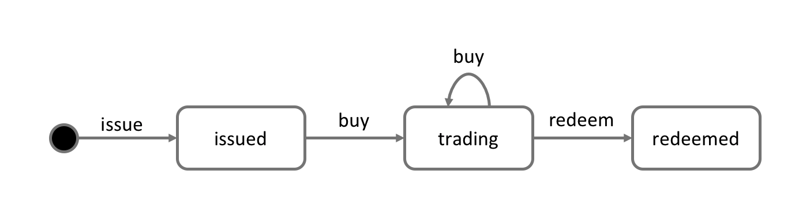

# Process and Data Design

**対象読者**: アーキテクト、アプリケーションおよびスマートコントラクト開発者、ビジネス専門家

このトピックでは、コマーシャルペーパーのプロセスおよびPaperNetにおける関連するデータ構造をどのように設計するかを示します。
前の[分析](./analysis.html)では、ステートとトランザクションによるPaperNetのモデル化によって、何が起きるかを正確に理解することができることを強調しました。
それではこれから、PaperNetのスマートコントラクトとアプリケーションの設計において、この二つの非常に関連した概念がどのように役立つのかを詳細に見ていきましょう。

## Lifecycle

コマーシャルペーパーを取り扱うときに二つの重要な概念、すなわち、**ステート**と**トランザクション**があることをみてきました。
実際これは、*すべての*ブロックチェーンのユースケースであてはまります。
つまり、価値の概念的なオブジェクトが存在し、それはステートとしてモデル化され、そのライフサイクルの遷移はトランザクションによって記述されるということです。
ステートとトランザクションの意味のある分析は、実装がうまくいくための欠かせない出発点になります。

コマーシャルペーパーのライフサイクルを、状態遷移図を用いて次のように表現することができます。

 *コマーシャルペーパーの状態遷移図。
コマーシャルペーパーは、**発行済み(issued)**、**取引中(trading)**、**現金化済み(redeemed)**の状態間を、**発行(issue)**、**購入(buy)**、**現金化(redeem)**のトランザクションによって遷移します。*

コマーシャルペーパーがどのように時間とともに変化し、どのトランザクションがライフサイクルの遷移をもたらしているのか、状態遷移図の表現によって確認してください。
Hyperledger Fabricにおいては、スマートコントラクトは、コマーシャルペーパーの状態間の遷移を行うトランザクションのロジックを実装するものです。
コマーシャルペーパーのステートは、実際には台帳のワールドステートによって保持されます。では、これを詳細に見ていきましょう。

## Ledger state

コマーシャルペーパーの構造を思い出しましょう。

 *コマーシャルペーパーは、それぞれが値を持つプロパティの集まりとして表現できます。
これらのプロパティのいくつかの組み合わせによって、各コマーシャルペーパーのユニークなキーが作り出せることが多いでしょう。*

コマーシャルペーパーの`Paper`プロパティが`00001`という値を持ち、`Face value`(額面)というプロパティが`5M USD`という値を持っていることを見てください。
さらに最も重要なのは、`Current state`(現在の状態)が、コマーシャルペーパーが`issued`(発行済み)、`trading`(取引中)、`redeemed`(現金化済み)のどの状態であるかを表していることです。
これらのプロパティ全てが組み合わさって、コマーシャルペーパーの**ステート**を形づくっています。
そして、これらの個々のコマーシャルペーパーのステートの集まり全体が、台帳の[ワールドステート](../ledger/ledger.html#world-state)を構成しています。

全ての台帳ステートは、この形態をとっています。すなわち、各ステートは、それぞれが異なる値をもつプロパティの集まりをもっているというものです。
ステートが**複数プロパティをもつ**というこの側面は非常に強力な機能で、これにより、Fabricのステートを単なるスカラーではなく、ベクトルとして考えることができます。
そして、オブジェクト全体に関する事実をそれぞれのステートとして表現し、トランザクションのロジックによってその遷移が管理されます。
Fabricのステートは、キーバリューのペアとして実装されており、値はオブジェクトのプロパティを、典型的にはJSONといった、複数のプロパティを表現できるフォーマットによってエンコードしたものです。
[台帳のデータベース](../ledger/ledger.html#ledger-world-state-database-options)は、これらのプロパティに対する高度なクエリ操作をサポートすることもでき、オブジェクトの複雑な取得には非常に役に立ちます。

MagnetoCorpのコマーシャルペーパー`00001`が、トランザクションの刺激によって遷移するベクトルのステートとしてどのように表現されているかを見てください。

 *コマーシャルペーパーのステートは、様々なトランザクションの結果として、誕生し遷移します。
Hyperledger Fabricのステートは複数のプロパティをもっているため、スカラーではなくベクトルとなります。*

個々のコマーシャルペーパーは、最初は存在しないので、空のステート、技術的には[`nil`](https://en.wikipedia.org/wiki/Null_(SQL))(ヌル)状態から始まってることに注意してください!
コマーシャルペーパー`00001`が、**発行(issue)**トランザクションによって産まれ、その後、**購入(buy)**および**現金化(redeem)**トランザクションによって更新されることを確認してください。

各ステートが、自己記述的であることに注目してください。各プロパティは、名前と値を持っています。
このコマーシャルペーパーにおいては、全てが同じプロパティを持っていますが、これはいつもそうである必要はありません。
Hyperledger Fabricはステートが別のプロパティを持つことをサポートしているためです。
これによって、一つの同じ台帳のワールドステートに、異なる資産も、同じ資産であっても異なる形態のものも格納することができます。
また、ステートの構造を更新することも可能になっています。たとえば、新しい規制によって追加のデータフィールドが必要になったときのことを想像してみてください。
ステートのプロパティが柔軟なことで、時間の変化によって起こるデータの進化の根本的な要件に対応しています。

## State keys

多くの実際のアプリケーションでは、ステートは、ある時点においてそれを一意に識別可能なプロパティの組み合わせ、すなわち**キー**を持つでしょう。
PaperNetのコマーシャルペーパーにおけるキーは、`Issuer`(発行者)と`Paper`のプロパティを連結したものとして構成されます。
つまり、MagnetoCorpの最初のコマーシャルペーパーのキーは、`MagnetoCorp00001`となります。

ステートのキーによって、コマーシャルペーパーを一意に識別することができます。
コマーシャルペーパーは、**発行(issue)**トランザクションによって作られ、**購入(buy)**および**現金化(redeem)**トランザクションによって更新されます。
Hyperledger Fabricでは、台帳の各ステートがユニークなキーを持つ必要があります。

存在するプロパティの中からユニークなキーが作れない場合には、アプリケーションによって決められたユニークキーが、ステートを作るトランザクションの入力として与えられます。
このユニークなキーは、通常、可読性は低くなりますが標準的方法である[UUID](https://en.wikipedia.org/wiki/Universally_unique_identifier)の何らかの形を使います。
重要なのは、台帳の各ステートオブジェクトは、ユニークなキーを持たなければならないということです。

_注: U+0000(ヌル文字)をキーに使用することは避けるべきです。_

## Multiple states

これまで見てきたように、PaperNetのコマーシャルペーパーは、台帳にベクトルのステートとして格納されています。
台帳から異なるコマーシャルペーパーをクエリが可能であるというのは、まっとうな要件で、例えば、MagnetoCorpによって発行されたコマーシャルペーパーを全て取得するとか、MagnetoCorpによって発行された`redeemed`(現金化済み)状態のコマーシャルペーパーを全て取得するといったものです。

このような検索タスクを可能にするために、関連するコマーシャルペーパーを論理的なリストにまとめるというのが役立ちます。
PaperNetの設計は、コマーシャルペーパーのリスト、すなわちコマーシャルペーパーが発行されたり変化した場合に更新される論理的なコンテナの考えが考慮されています。

### Logical representation

全てのPaperNetのコマーシャルペーパーが、コマーシャルペーパーの単一のリストに存在すると考えるのがわかりやすいでしょう。

 *MagnetoCorpの新しく作られたコマーシャルペーパーの00004が、既存のコマーシャルペーパーのリストに追加されています。*

新しいコマーシャルペーパーは、**発行(issue)**トランザクションの結果としてリストに追加され、既にリストに存在するコマーシャルペーパーは**購入(buy)**や**現金化済み(redeem)**トランザクションによって更新されることがあります。
このリストが`org.papernet.papers`という名前を持っていることを確認してください。
このような[DNS名](https://en.wikipedia.org/wiki/Domain_Name_System)を使うのは非常によい考えで、なぜならば、良く選ばれた名前によって、他人が直観的にブロックチェーンのデザインを理解できるであろうからです。
この考えは、スマートコントラクトの[名前](./contractname.html)についても同様にあてはまります。

### Physical representation

PaperNetにおいて、コマーシャルペーパーの一つのリスト `org.papernet.papers` として考えることは正しいのですが、リストの最も良い実装は、コンポジットキー(複合キー)によってリストと関連づられたFabricのステートの集まりとするものです。
このようにして、各ステートのコンポジットキーは、ユニークであり、かつリストの有効なクエリにも対応します。

 *PaperNetのコマーシャルペーパーのリストが、別々のHyperledger Fabricステートの集まりとして表現されています*

リストにある各コマーシャルペーパーが、`org.papernet.paper`と、`Issuer`、`Paper`プロパティの連結によって作られたユニークなコンポジットキーを持つベクトルのステートによって表現されていることに注目してください。
この構造は、次の二つの理由で便利です。

  * 各リストを参照せずに、台帳内のベクトルのステートがどのリストにあるかを確かめることができます。
    これは、着ているシャツの色をみて、スポーツファンがどのチームをサポートしているかを見分けるのに似ています。
    スポーツファンは、自身の忠誠を自ら宣言しているため、ファンのリストは必要ありません。

  * Hyperledger Fabricは、台帳の更新に際して、内部的に同時実行制御の機構を利用しています。
    そのため、コマーシャルペーパーを別々のベクトルのステートとすることで、同じステートの更新衝突の可能性を大きく減らすことができます。
    このような衝突が発生すると、トランザクションの再発行が必要となり、アプリケーションの設計を複雑にし、性能を低下させることになります。

この二つ目は、実際のところ、Hyperledger Fabricにおける重要なポイントで、ベクトルのステートという物理的な設計は、性能とふるまいを最適化する上で**非常に重要です**。
ステートは、別々のものとして実装しましょう!

## Trust relationships

トランザクションの署名を誰が行う必要があるかは、ネットワークにおける、発行者や取引者、あるいは格付け機関といったそれぞれの役割、そしてそれぞれの営業上の利益によって決定されます。
Fabricでは、この規則は、[**エンドースメントポリシー**](endorsementpolicies.html)として表現されます。
この規則は、チェーンコードの単位でも、各ステートのキーの単位でも設定することができます。

すなわち、PaperNetでは、誰が新しいコマーシャルペーパーを発行できるかを決める規則を、ネームスペース全体について一つ設定することができます。
そしてその後、個別のコマーシャルペーパーに対して、購入と現金化のトランザクションの信頼関係を表現するために規則を設定し更新することができます。

次のトピックでは、この設計した概念とPaperNetコマーシャルペーパーのスマートコントラクトの実装をどのように結合し、アプリケーションがどのようにそれを利用するのかを見ていきます!

<!--- Licensed under Creative Commons Attribution 4.0 International License
https://creativecommons.org/licenses/by/4.0/ -->
