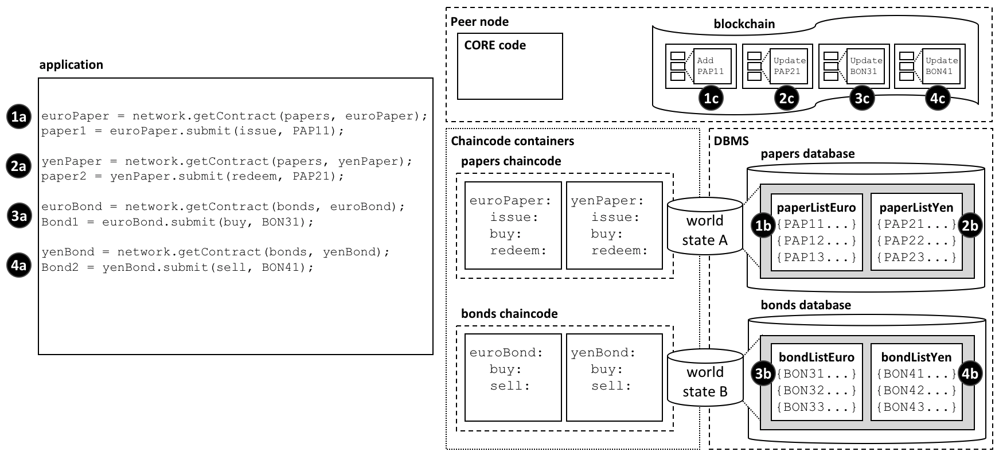
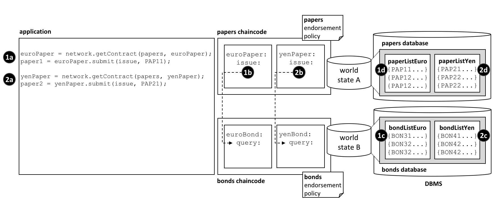

# Chaincode namespace

**対象読者**: アーキテクト、アプリケーションおよびスマートコントラクト開発者、管理者

チェーンコードネームスペースによって、チェーンコードのワールドステートは他のチェーンコードと分離することが可能になります。
具体的にいうと、同じチェーンコード内のスマートコントラクトは、同じワールドステートに直接アクセスすることができますが、異なるチェーンコードのスマートコントラクトは、互いのワールドステートには直接アクセスすることができません。
もしスマートコントラクトが、他のチェーンコードのワールドステートにアクセスすることが必要な場合は、チェーンコード間呼び出しを行うことで可能です。
そして、ブロックチェーンは異なるワールドステートに関するトランザクションを格納することができます。

このトピックでは、次の項目について述べます。

* [ネームスペースの重要性](#motivation)
* [チェーンコードネームスペースとは何か](#scenario)
* [チャネルとネームスペース](#channels)
* [チェーンコードネームスペースの使い方](#usage)
* [チェーンコードをまたいだワールドステートのアクセスのしかた](#cross-chaincode-access)
* [チェーンコードネームスペースに関する設計上の留意点](#considerations)

## Motivation

ネームスペースは、一般的な概念です。
*ニューヨークのパークストリート*と*シアトルのパークストリート*は、同じ名前であっても違う通りであるということがわかります。
パークストリートに対して、都市名は**ネームスペース**を構成していて、同時に自由度とわかりやすさを与えています。

コンピュータシステムにおいても同様です。
ネームスペースによって、別々のユーザーが、互いに邪魔をすることなく、共有システムの異なる部分でプログラム及び処理を行うことができます。
多くのプログラミング言語は、ネームスペースをもっています。これによって、プログラムは、例えば変数名といった固有の識別子を自由に使うことができ、ほかのプログラムのことを心配する必要がありません。
Hyperledger Fabricでは、ネームスペースによって、スマートコントラクトがその台帳ワールドステートを、他のスマートコントラクトとは分離できていることを、これから見ていきましょう。

## Scenario

それでは、台帳ワールドステートにおいて、チャネルの組織に対して重要なビジネスデータに関する事実をどのように構成しているかを、下記の図を用いて詳しく見ていきましょう。
これらのデータがコマーシャルペーパーか債権か自動車登録かに関わらず、また、ライフサイクル上のどこに位置していても、台帳ワールドステートデータベース内に保持されています。
スマートコントラクトは、これらのデータを台帳(ワールドステートおよびブロックチェーン)とのやりとりを行うことで管理し、ほとんどの場合には、台帳ワールドステートのクエリや更新を行います。

台帳ワールドステートが、アクセスするスマートコントラクトのチェーンコードに応じて分割されていると理解することが極めて重要です。
そしてこの分割、すなわち*ネームスペースをもつこと*は、アーキテクトや管理者やプログラマにとってきわめて重要な設計上の留意点となります。

 *台帳ワールドステートは、アクセスするチェーンコードに応じて分割されています。
あるチャネルにおいて、同じチェーンコード内のスマートコントラクトは同じワールドステートを共有し、異なるチェーンコードのスマートコントラクトは互いのワールドステートに直接アクセスすることはできません。
このように、ブロックチェーンは、異なるチェーンコードワールドステートに関するトランザクションを格納することができます。*

ここでの例では、2つのチェーンコードで定義された4つのスマートコントラクトがあることがわかります。それぞれのチェーンコードは、その専用のチェーンコードコンテナ内にあります。
`euroPaper`と`yenPaper`の2つのスマートコントラクトは、`papers`チェーンコード内に定義されています。
`euroBond`と`yenBond`の2つのスマートコントラクトも、同様の状況で、`bonds`チェーンコード内に定義されています。
この設計によって、アプリケーションプログラマは、ユーロまたは円建てのコマーシャルペーパー(papers)あるいは債権(bonds)を扱っているのかを理解することができます。
そして、それぞれの金融商品の規則は、通貨が違ってもあまり変わらないため、同じチェーンコードでデプロイを管理することは理にかなっています。

[この図](#scenario)は、また、このデプロイの方針による結果も表しています。
データベース管理システム(DBMS)は、`papers`と`bonds`のチェーンコードとそれに含まれるスマートコントラクトのために、チェーンコードごとに別のワールドステートデータベースを作成します。
`world state A`と`world state B`は、それぞれ別のデータベースに格納されています。
データは互いに隔離されており、例えば1つのワールドステートのクエリでは、両方のワールドステートにアクセスすることはできません。
ワールドステートは、チェーンコードに応じて*ネームスペースに分かれて*いるということができます。

`world state A`が、2つのコマーシャルペーパーのリスト `paperListEuro`、`paperListYen`を含んでいるのがわかるでしょうか。
ステート`PAP11`と`PAP21`は、それぞれ`euroPaper`と`yenPaper`スマートコントラクトによって管理されているコマーシャルペーパーのインスタンスです。
この二つのステートは、同じチェーンコードネームスペースにあるため、キー(`PAPxyz`)は、`papers`チェーンコードのネームスペース内で一意でなくてはなりません。
これは、町の中で通りの名前が一意であるのと少し似ています。
`papers`チェーンコードで、ユーロ建てか円建てかにかかわらず、すべてのコマーシャルペーパーを集計するスマートコントラクトを書くことができることに注意してください。
これは、コマーシャルペーパーが同じネームスペースを共有しているためです。
債権についても状況は同様で、債権は`world state B`に格納されており、これは別の`bonds`データベースにマップされており、キーはこの中でユニークでなくてはなりません。

そして同じように重要なのは、ネームスペースがあるということは、`euroPaper`と`yenPaper`は直接`world state B`にはアクセスできず、`euroBond`と`yenBond`は直接`world state A`にアクセスすることができないということです。
コマーシャルペーパーと債権は大きく異なる金融商品であり、異なる属性をもち異なるルールに従うため、この隔離は有用なものです。
また、異なるネームスペースにあるため、`papers`と`bonds`は、同じキーを持つこともできることを意味します。
名前付けに関して大きな自由度を与えるため、これも有用なものです。
この自由度を使って、ビジネスデータに意味のある名前付けをするのに役立てましょう。

さらに重要なことに、ブロックチェーンは、あるチャネルで動作するピアに結びつけられるものであり、`world state A`と`world state B`両方に影響するトランザクションを含んでいるのがわかります。
これは、ブロックチェーンは、ピアに格納される最も基本的なデータ構造であるためです。
ワールドステートは、ブロックチェーンのトランザクションの積み重なった結果であるので、いつでもブロックチェーンから再構成することが可能です。
ワールドステートは、スマートコントラクトが通常必要なのはステートの現在の値であるので、スマートコントラクトを単純にしその効率を改善するのに役立つものです。
ワールドステートをネームスペースによって分離しておくことは、スマートコントラクトが別のスマートコントラクトとロジックを隔離し、別のワールドステートに対するトランザクションの心配をする必要をなくすのに役立ちます。
たとえば、`bonds`のコントラクトは、`paper`のトランザクションを心配する必要がありません。なぜならば、`bonds`からは、`paper`のトランザクションの結果のワールドステートは見ることができないからです。

また、ピアとチェーンコードコンテナ、DBMSは全て論理的に別のプロセスであるということも注目しておくべきでしょう。
ピアとそのチェーンコードコンテナは、常にOSの物理的に別のプロセスですが、DBMSはその[種類](../ledger/ledger.html#world-state-database-options)によって、設定で組み込みか分離するかを変更することができます。
LevelDBでは、DBMSは完全にピア内に含まれますが、CouchDBでは別のOSのプロセスになります。

ここでの例において、ネームスペースの選択は、異なる通貨のコマーシャルペーパーは共有し、債権からは分離するというビジネス上の要件から来ているものであることは覚えておきましょう。
全ての金融資産の種類を別々にするようなビジネス要件、あるいは、コマーシャルペーパーと債権を共有するようなビジネス要件であったなら、どのようにネームスペースの構造が変わっていたかを考えてみましょう。

## Channels

ピアが複数のチャネルに参加した場合、各チャネルに対して新しいブロックチェーンが作られ管理されます。
加えて、新しいチャネルにチェーンコードがデプロイされるたびに、新しいワールドステートデータベースが作られます。
これは、ワールドステートにおけるチェーンコードのネームスペースに加えて、チャネルが一種のネームスペースを構成することを意味しています。

しかし、同じピアとチェーンコードコンテナプロセスは、複数のチャネルに同時に参加することができるため、ブロックチェーンやワールドステートデータベースと異なり、これらのプロセスは参加しているチャネルの数に応じて増えはしません。

例えば、`papers`と`bonds`チェーンコードを新しいチャネルにデプロイしたとすると、完全に別のブロックチェーンと、2つのワールドステートデータベースが作られるでしょう。しかし、ピアとチェーンコードコンテナは増加せず、ただ複数のチャネルに接続されるだけでしょう。

## Usage

コマーシャルペーパーの[例](#scenario)を用いて、アプリケーションがどのようにネームスペースとスマートコントラクトを使うのかを見てみましょう。
アプリケーションがピアと通信し、ピアは要求を適切なチェーンコードコンテナにルーティングし、チェーンコードがDBMSにアクセスする、ということは触れておくべきでしょう。
このルーティングは、図に示されているピアの**コア**コンポーネントによって行われます。

以下が、ユーロ建てと円建てのコマーシャルペーパー及び債権を用いるアプリケーションのコードです。
このコードは、説明が不要なほど十分わかりやすいでしょう。

```javascript
const euroPaper = network.getContract(papers, euroPaper);
paper1 = euroPaper.submit(issue, PAP11);

const yenPaper = network.getContract(papers, yenPaper);
paper2 = yenPaper.submit(redeem, PAP21);

const euroBond = network.getContract(bonds, euroBond);
bond1 = euroBond.submit(buy, BON31);

const yenBond = network.getContract(bonds, yenBond);
bond2 = yenBond.submit(sell, BON41);
```

このアプリケーションについて下記のことがわかります。

* `papers`チェーンコードを指定して`getContract()`APIを使うことで、`euroPaper`と`yenPaper`コントラクトにアクセスしていること。**1a**と**2a**を参照してください。

* `bonds`チェーンコードを指定して`getContract()`APIを使うことで、`euroBond`と`yenBond`コントラクトにアクセスしていること。**3a**と**4a**を参照してください。

* `euroPaper`コントラクトを用いて、コマーシャルペーパー`PAP11`の`issue`(発行)トランザクションを送信していること。**1a**を参照してください。そして、その結果`world state A`内の`PAP11`ステートで表現されるコマーシャルペーパーが作成されます(**1b**)。この処理は、ブロックチェーンで**1c**のトランザクションとして表現されています。

* `yenPaper`コントラクトを用いて、コマーシャルペーパー`PAP21`の`redeem`(現金化)トランザクションを送信していること。**2a**を参照してください。そして、その結果`world state A`内の`PAP21`ステートで表現されるコマーシャルペーパーが更新されます(**2b**)。この処理は、ブロックチェーンで**2c**のトランザクションとして表現されています。

* `euroBond`コントラクトを用いて、コマーシャルペーパー`BON31`の`buy`(購入)トランザクションを送信していること。**3a**を参照してください。そして、その結果`world state B`内の`BON31`ステートで表現される債権が更新されます(**3b**)。この処理は、ブロックチェーンで**3c**のトランザクションとして表現されています。

* `yenBond`コントラクトを用いて、コマーシャルペーパー`BON41`の`sell`(売却)トランザクションを送信していること。**4a**を参照してください。そして、その結果`world state B`内の`BON41`ステートで表現される債権が更新されます(**4b**)。この処理は、ブロックチェーンで**4c**のトランザクションとして表現されています。


スマートコントラクトのワールドステートとのやりとりについて下記のことがわかります。

* `euroPaper`と`yenPaper`コントラクトは、`world state A`に直接アクセスできますが、`world state B`には直接アクセスできません。`world state A`は、物理的には`papers`チェーンコードに対応するデータベース管理システム(DBMS)の`papers`データベースに格納されています。

* `euroBond`と`yenBond`コントラクトは、`world state B`に直接アクセスできますが、`world state A`には直接アクセスできません。`world state B`は、物理的には`bonds`チェーンコードに対応するデータベース管理システム(DBMS)の`bonds`データベースに格納されています。


ブロックチェーンの、全てのワールドステートに関するトランザクションを格納するやりかたについて下記のことがわかります。

* **1c**と**2c**のやりとりは、コマーシャルペーパー`PAP11`の作成、`PAP21`の更新を行うトランザクションにそれぞれ対応します。これらは、ともに`world state A`に含まれます。

* **3c**と**4c**のやりとりは、債権`BON31`及び`BON41`の更新を行うトランザクションに対応します。これらは、ともに`world state B`に含まれます。

* `world state A`あるいは`world state B`が何らかの理由で失われることがあったとしたら、ブロックチェーンに含まれるトランザクションをすべて再実行することで再度作成することができるでしょう。

## Cross chaincode access

ここでの例の[シナリオ](#scenario)で見たように、`euroPaper`と`yenPaper`は`world state B`に直接アクセスすることができません。
これは、チェーンコードとスマートコントラクトが、チェーンコードとワールドステートが互いに別々となるように設計されているためです。
しかし、`euroPaper`が`world state B`にアクセスする必要がある場合を考えてみましょう。

どういった場合にこのようなことがあるでしょうか？
スマートコントラクトがコマーシャルペーパーを発行するとき、近い満期日の債権の現在のリターンに応じた価格をコマーシャルペーパーにつけたいという場合を考えてみてください。
この場合、`euroPaper`コントラクトが`world state B`にある債権の価格をクエリできることが必要でしょう。
このやりとりをどのように実現するかを、下記の図を見てみましょう。

 *チェーンコードとスマートコントラクトが間接的に、チェーンコードを介して他のワールドステートにアクセスする方法*

以下のことに注目してください。

* アプリケーションが`PAP11`を発行するために、`euroPaper`スマートコントラクトに`issue`トランザクションを送信します。**1a**を参照してください。

* `euroPaper`スマートコントラクト内の`issue`トランザクションは、`euroBond`スマートコントラクトの`query`トランザクションを呼び出します。**1b**を参照してください。

* `euroBond`の`query`は、`world state B`から情報を取得します。**1c**を参照してください。

* `issue`トランザクションに制御が戻ったとき、`issue`は、応答にある情報を使ってコマーシャルペーパーの価格を決め、`world state A`を更新します。**1d**を参照してください。

* 円建てのコマーシャルペーパーを発行する際の制御フローは同じです。**2a**・**2b**・**2c**・**2d**を参照してください。

`invokeChaincode()` [API](https://hyperledger.github.io/fabric-chaincode-node/{BRANCH}/api/fabric-shim.ChaincodeStub.html#invokeChaincode__anchor)によって、チェーンコード間を制御が渡ります。

このAPIは、あるチェーンコードから別のチェーンコードに制御を渡します。

この例ではクエリトランザクションについてのみ述べましたが、呼ばれた側のチェーンコードのワールドステートを更新するスマートコントラクトを実行(invoke)することも可能です。次の[留意点](#considerations)を参照してください。

## Considerations

* 一般的には、各チェーンコードがもつスマートコントラクトは一つだけです。

* 非常に深く関係する場合のみ、複数のスマートコントラクトを一つのチェーンコード内にデプロイするべきです。通常は、同じワールドステートを共有する場合にのみ必要となります。

* チェーンコードネームスペースは、異なるワールドステート間を分離します。一般的に、関係ないデータを互いに分離するのは意味があります。チェーンコードネームスペースを自分で選ぶことができないことに注意してください。これは、Hyperledger Fabricによって割り当てられ、チェーンコード名に直接マップされるものです。

* `invokeChaincode()` APIを用いたチェーンコード間のやりとりには、両方のチェーンコードが同じピア上にインストールされていなければなりません。

    * 呼ばれたチェーンコードのワールドステートのクエリのみが必要なやりとりには、呼び出し元のチェーンコードとは異なるチャネルに対して行うことができます。

    * 呼ばれたチェーンコードのワールドステートを更新する必要のあるやりとりには、呼び出し元のチェーンコードと同じチャネルで行わなければなりません。

<!--- Licensed under Creative Commons Attribution 4.0 International License
https://creativecommons.org/licenses/by/4.0/ -->
