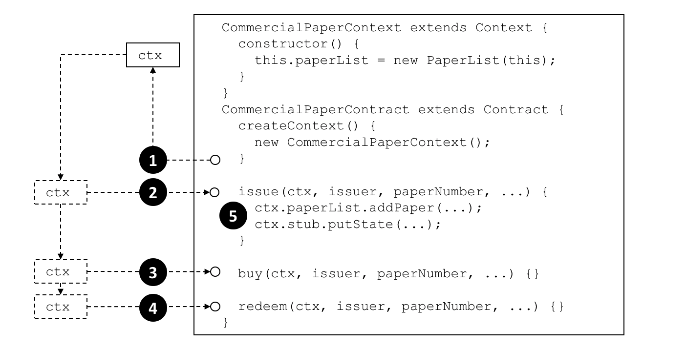

# Transaction context

**対象読者**: アーキテクト、アプリケーションおよびスマートコントラクト開発者

トランザクションコンテキストは、二つの機能を実現します。
一つは、開発者がスマートコントラクトでのトランザクションの実行で使えるユーザー変数を定義し管理できるようにするものです。
もう一つは、スマートコントラクト開発者がより詳細なトランザクション処理に関する操作を行える、幅広いFabric APIに対するアクセスを提供するものです。
この操作には、台帳、すなわちイミュータブルなブロックチェーンと変更可能なワールドステートの両方のクエリや更新から、トランザクションを送信したアプリケーションのデジタルアイデンティティの取得まで含みます。

トランザクションコンテキストは、スマートコントラクトがチャネルにデプロイされ、それ以降のトランザクション呼び出しで利用可能になったときに作成されます。
トランザクションコンテキストによって、スマートコントラクト開発者は、より強力で効率的で処理がわかりやすいプログラムを作成しやすくなります。

* [トランザクションコンテキストはなぜ重要なのか](#scenario)
* [トランザクションコンテキストの使い方](#programming)
* [トランザクションコンテキストには何が含まれているか](#structure)
* [コンテキストの`stub`の利用](#stub)
* [コンテキストの`clientIdentity`の利用](#clientIdentity)

## Scenario

コマーシャルペーパーのサンプルでは、[papercontract](https://github.com/hyperledger/fabric-samples/blob/{BRANCH}/commercial-paper/organization/magnetocorp/contract/lib/papercontract.js)は、最初に対象のコマーシャルペーパーのリストの名前を定義しています。
以降の各トランザクションはこのリストを参照し、発行トランザクションは新しいコマーシャルペーパーをそれに追加し、購入トランザクションは所有者を変更し、現金化トランザクションは完了したとマークします。
これは共通で使えるパターンで、スマートコントラクトを書く際には、ある変数を初期化し、続くトランザクションでそれを呼び出すことが有用なことが多いです。

 *スマートコントラクトのトランザクションコンテキストによって、スマートコントラクトはトランザクション実行で使われるユーザー変数を定義し管理することができます。詳細な説明は本文を参照してください。*

## Programming

開発者は、スマートコントラクトが作成される際、カスタムコンテキストを作成するために、組み込みの`Context`クラスと`createContext`メソッドを下記のようにオーバーライドすることができます。

```JavaScript
createContext() {
    new CommercialPaperContext();
}
```

ここでの例では、`CommercialPaperContext`は、`CommercialPaperContract`のために特化したものです。
下記のように、`this`で参照されているカスタムコンテキストに、特有の変数である`PaperList`を追加しています。

```JavaScript
CommercialPaperContext extends Context {
    constructor () {
        this.paperList = new PaperList(this);
    }
}
```

[上の](#scenario)図の**(1)**で、createContext()メソッドから返ったときには、カスタムコンテキスト`ctx`は作られており、その変数の一つとして`paperList`を含んでいます。

その後、発行、購入、現金化のようなスマートトランザクションが呼ばれるときには常に、このコンテキストが渡されます。
**(2)**、**(3)**、**(4)**で、同じコマーシャルペーパーのコンテキストが`ctx`変数によって、トランザクションメソッドに渡されているのがわかります。

そして、次のように**(5)**でコンテキストが使われていることがわかります。

```JavaScript
ctx.paperList.addPaper(...);
ctx.stub.putState(...);
```

`CommercialPaperContext`に作られた`paperList`が、発行トランザクションで利用可能なことに注目してください。
**現金化**や**購入**トランザクションでも同じように`paperList`が使われているのがわかります。
`ctx`によって、スマートコントラクトが効率的で処理がわかりやすくなっています。

また、`CommercialPaperContext`で明示的に追加されていない、コンテキストの別の要素である`ctx.stub`があることもわかります。
これは、`stub`やその他の変数は、組み込みのコンテキストの一部であるからです。
それでは、この組み込みのコンテキストの構造と、これらの暗黙的な変数、そしてその使い方を見ていきましょう。

## Structure

[この例](#programming)で見たように、トランザクションコンテキストは、`paperList`のような任意の数のユーザー変数をもつことができます。

トランザクションコンテキストは、二つの組み込みの要素を持っており、これらはトランザクションを送信したアプリケーションから台帳へのアクセスに至るまで幅広いFabricの機能へのアクセスを提供します。

  * `ctx.stub`は、台帳に対するアクセスを行う`putState()`と`getState()`から、現在のトランザクションのIDを取得する`getTxID()`に至るまで、幅広いトランザクションの処理操作を提供するAPIへのアクセスに使われます。

  * `ctx.clientIdentity`は、トランザクションを送信したユーザーのアイデンティティに関する情報を取得するのに使われます。

以降では、スマートコントラクトが`stub`と`clientIdentity`を使って、そのAPIによってなにができるかを下記の図を使って示します。

 *スマートコントラクトは、トランザクションコンテキストの`stub`と`clientIdentity`を用いて様々なスマートコントラクトの機能にアクセスすることができます。詳細は本文を参照してください。*

## Stub

stubのAPIは、次のように分類されます。

* **ワールドステートデータAPI**. **(1)**を参照してください。
  スマートコントラクトは、次のAPIによって、キーを用いてワールドステートから個々のオブジェクトに対応するステートを取得、書き込み、削除することができます。

    * [getState()](https://hyperledger.github.io/fabric-chaincode-node/{BRANCH}/api/fabric-shim.ChaincodeStub.html#getState__anchor)
    * [putState()](https://hyperledger.github.io/fabric-chaincode-node/{BRANCH}/api/fabric-shim.ChaincodeStub.html#putState__anchor)
    * [deleteState()](https://hyperledger.github.io/fabric-chaincode-node/{BRANCH}/api/fabric-shim.ChaincodeStub.html#deleteState__anchor)

  <br> これらの基本的なAPIに加えて、一つのステートでなく、ステートの集合をコントラクトが取得することができるクエリAPIがあります。**(2)**を参照してください。
  集合は、キーの全体あるいは一部によるキーバリューの範囲として、あるいは、ワールドステート[データベース](../ledger/ledger.html#world-state-database-options)の値に応じたクエリとして定義されます。
  クエリ結果が大きい場合、必要なストレージを削減するためにページネーションすることができます。

    * [getStateByRange()](https://hyperledger.github.io/fabric-chaincode-node/{BRANCH}/api/fabric-shim.ChaincodeStub.html#getStateByRange__anchor)
    * [getStateByRangeWithPagination()](https://hyperledger.github.io/fabric-chaincode-node/{BRANCH}/api/fabric-shim.ChaincodeStub.html#getStateByRangeWithPagination__anchor)
    * [getStateByPartialCompositeKey()](https://hyperledger.github.io/fabric-chaincode-node/{BRANCH}/api/fabric-shim.ChaincodeStub.html#getStateByPartialCompositeKey__anchor)
    * [getStateByPartialCompositeKeyWithPagination()](https://hyperledger.github.io/fabric-chaincode-node/{BRANCH}/api/fabric-shim.ChaincodeStub.html#getStateByPartialCompositeKeyWithPagination__anchor)
    * [getQueryResult()](https://hyperledger.github.io/fabric-chaincode-node/{BRANCH}/api/fabric-shim.ChaincodeStub.html#getQueryResult__anchor)
    * [getQueryResultWithPagination()](https://hyperledger.github.io/fabric-chaincode-node/{BRANCH}/api/fabric-shim.ChaincodeStub.html#getQueryResultWithPagination__anchor)

* **プライベートデータAPI**. **(3)**を参照してください。スマートコントラクトは、これらのAPIによってプライベートデータコレクションとやりとりすることができます。ワールドステートとやりとりするAPIと類似していて、これらはプライベートデータに対するAPIです。以下のAPIで、キーによってプライベートデータを取得、書き込み、削除することができます。

    * [getPrivateData()](https://hyperledger.github.io/fabric-chaincode-node/{BRANCH}/api/fabric-shim.ChaincodeStub.html#getPrivateData__anchor)
    * [putPrivateData()](https://hyperledger.github.io/fabric-chaincode-node/{BRANCH}/api/fabric-shim.ChaincodeStub.html#putPrivateData__anchor)
    * [deletePrivateData()](https://hyperledger.github.io/fabric-chaincode-node/{BRANCH}/api/fabric-shim.ChaincodeStub.html#deletePrivateData__anchor)

  <br> このAPIに加えて、プライベートデータをクエリするAPI(**(4)**)があります。
  これらのAPIによって、スマートコントラクトは、キーの全部または一部によるキーバリューの範囲、あるいは、ワールドステート[データベース](../ledger/ledger.html#world-state-database-options)の値に対するクエリに従って、プライベートデータコレクションからからステートの集合をクエリすることができます。
  現在のところ、プライベートデータコレクションに対するページネーションに対応したAPIはありません。

    * [getPrivateDataByRange()](https://hyperledger.github.io/fabric-chaincode-node/{BRANCH}/api/fabric-shim.ChaincodeStub.html#getPrivateDataByRange__anchor)
    * [getPrivateDataByPartialCompositeKey()](https://hyperledger.github.io/fabric-chaincode-node/{BRANCH}/api/fabric-shim.ChaincodeStub.html#getPrivateDataByPartialCompositeKey__anchor)
    * [getPrivateDataQueryResult()](https://hyperledger.github.io/fabric-chaincode-node/{BRANCH}/api/fabric-shim.ChaincodeStub.html#getPrivateDataQueryResult__anchor)

* **トランザクションAPI**. **(5)**を参照してください。
  これらのAPIは、スマートコントラクトが、現在処理しているトランザクション提案に関する詳細を取得するのに使われます。
  これには、トランザクションの識別子及びトランザクション提案が作られたときの時刻を含みます。

    * [getTxID()](https://hyperledger.github.io/fabric-chaincode-node/{BRANCH}/api/fabric-shim.ChaincodeStub.html#getTxID__anchor)
      は、現在のトランザクション提案の識別子**(5)**を返します。
    * [getTxTimestamp()](https://hyperledger.github.io/fabric-chaincode-node/{BRANCH}/api/fabric-shim.ChaincodeStub.html#getTxTimestamp__anchor)
      は、現在のトランザクション提案がアプリケーションで作らされた際のタイムスタンプ**(5)**を返します。
    * [getCreator()](https://hyperledger.github.io/fabric-chaincode-node/{BRANCH}/api/fabric-shim.ChaincodeStub.html#getCreator__anchor)
      は、トランザクション提案の作成者の生のアイデンティティ(X.509あるいはその他)を返します。
      X.509証明書の場合は、[`ctx.clientIdentity`](#clientidentity)を使うほうが多くの場合適切です。
    * [getSignedProposal()](https://hyperledger.github.io/fabric-chaincode-node/{BRANCH}/api/fabric-shim.ChaincodeStub.html#getSignedProposal__anchor)
      は、スマートコントラクトによって現在処理されているトランザクション提案の署名付きコピーを返します。
    * [getBinding()](https://hyperledger.github.io/fabric-chaincode-node/{BRANCH}/api/fabric-shim.ChaincodeStub.html#getBinding__anchor)
      は、ノンスを用いて、故意あるいは間違いによってトランザクションがリプレイされるのを防ぐのに使われます。
      (実用的には、ノンスはクライアントアプリケーションによって生成された乱数で、暗号的ハッシュに含まれます)
      例えば、このAPIはスマートコントラクト**(1)**が、トランザクション**(5)**のリプレイを検出するために使うことができるでしょう。
    * [getTransient()](https://hyperledger.github.io/fabric-chaincode-node/{BRANCH}/api/fabric-shim.ChaincodeStub.html#getTransient__anchor)
      によって、スマートコントラクトは、アプリケーションが渡す一時的データにアクセスすることができます。
      **(9)**と**(10)**を参照してください。
      一時的データは、アプリケーションとスマートコントラクトのやりとりでのみアクセスできます。
      台帳には記録されず、プライベートデータコレクション**(3)**とともによく使われます。

  <br>

* **キーAPI**は、スマートコントラクトがワールドステートもしくはプライベートデータコレクションのステートのキーを操作するのに使われます。図中の**(2)**と**(4)**を参照してください。

  これらのAPIのうち、もっとも単純なものは、スマートコントラクトがコンポジットキーを作成あるいは分解するのに使われます。
  もう少し高度なものとして、`ValidationParameter()`API群があり、これは、ワールドステート**(2)**およびプライベートデータ**(4)**に関するステートベースのエンドースメントポリシーを取得および設定するものです。
  最後に、`getHistoryForKey()`は、ステートの履歴を取得するもので、格納された値を返します。これには、そのステート更新を行ったトランザクションの識別子を含んでおり、これによってブロックチェーン**(10)**からそのトランザクションを取得することができます。

    * [createCompositeKey()](https://hyperledger.github.io/fabric-chaincode-node/{BRACNH}/api/fabric-shim.ChaincodeStub.html#createCompositeKey__anchor)
    * [splitCompositeKey()](https://hyperledger.github.io/fabric-chaincode-node/{BRANCH}/api/fabric-shim.ChaincodeStub.html#splitCompositeKey__anchor)
    * [setStateValidationParameter()](https://hyperledger.github.io/fabric-chaincode-node/{BRANCH}/api/fabric-shim.ChaincodeStub.html#setStateValidationParameter__anchor)
    * [getStateValidationParameter()](https://hyperledger.github.io/fabric-chaincode-node/{BRANCH}/api/fabric-shim.ChaincodeStub.html#getStateValidationParameter__anchor)
    * [getPrivateDataValidationParameter()](https://hyperledger.github.io/fabric-chaincode-node/{BRANCH}/api/fabric-shim.ChaincodeStub.html#getPrivateDataValidationParameter__anchor)
    * [setPrivateDataValidationParameter()](https://hyperledger.github.io/fabric-chaincode-node/{BRANCH}/api/fabric-shim.ChaincodeStub.html#setPrivateDataValidationParameter__anchor)
    * [getHistoryForKey()](https://hyperledger.github.io/fabric-chaincode-node/{BRANCH}/api/fabric-shim.ChaincodeStub.html#getHistoryForKey__anchor)

  <br>

* **イベントAPI**は、スマートコントラクトでイベント処理を管理するのに使用されます。

    * [setEvent()](https://hyperledger.github.io/fabric-chaincode-node/{BRANCH}/api/fabric-shim.ChaincodeStub.html#setEvent__anchor)

      スマートコントラクトは、トランザクション応答にユーザーイベントを加えるのに、このAPIを使います。
      図の**(5)**を参照してください。
      イベントは、最終的にはブロックチェーンに記録され、listenしているアプリケーションに送信されます **(11)**。

    <br>

* **ユーティリティAPI**は、便利なAPIを集めたもので、上記には分類しにくいのでここに集めています。
  これには、現在のチャネル名を取得したり、同じピアの別のチェーンコードに処理を渡すものが含まれます。

    * [getChannelID()](https://hyperledger.github.io/fabric-chaincode-node/{BRANCH}/api/fabric-shim.ChaincodeStub.html#getChannelID__anchor)

      図の**(13)**を参照してください。
      どのピアでも、スマートコントラクトはこのAPIを用いて、アプリケーションがどのチャネルでスマートコントラクトを実行したかを判断することができます。

    * [invokeChaincode()](https://hyperledger.github.io/fabric-chaincode-node/{BRANCH}/api/fabric-shim.ChaincodeStub.html#invokeChaincode__anchor)

      図の**(14)**を参照してください。
      MagnetoCorpが所有するPeer3には、複数のスマートコントラクトがインストールされています。
      これらのスマートコントラクトは、このAPIを使って互いを呼び出すことができます。
      スマートコントラクトは同じ場所になくてはならず、異なるピア上のスマートコントラクトを呼び出すことはできません。

    <br> ユーティリティAPIのいくつかは、スマートコントラクトでなく、低レベルなチェーンコードを用いている場合にのみ使われます。
    これらのAPIは、主にチェーンコードの入力値の詳細な操作のためのもので、スマートコントラクトの`Contract`クラスは、パラメータの変換を開発者のために自動的に行います。

    * [getFunctionAndParameters()](https://hyperledger.github.io/fabric-chaincode-node/{BRANCH}/api/fabric-shim.ChaincodeStub.html#getFunctionAndParameters__anchor)
    * [getStringArgs()](https://hyperledger.github.io/fabric-chaincode-node/{BRANCH}/api/fabric-shim.ChaincodeStub.html#getStringArgs__anchor)
    * [getArgs()](https://hyperledger.github.io/fabric-chaincode-node/{BRANCH}/api/fabric-shim.ChaincodeStub.html#getArgs__anchor)

## ClientIdentity

ほとんどの場合、トランザクションを送信するアプリケーションは、X.509証明書を使用するでしょう。
この[例](#structure)では、`CA1` **(7)**によって発行されたX.509証明書 **(6)** が、`Isabella` **(8)**がアプリケーションで、トランザクション`t6` **(5)**の提案に署名するのに使われています。

`ClientIdentity`は、`getCreator()`によって返される情報をもとに、この一般的なユースケースで簡単に使えるように、X.509のユーティリティAPI群を持っているものです。

* [getX509Certificate()](https://hyperledger.github.io/fabric-chaincode-node/{BRANCH}/api/fabric-shim.ClientIdentity.html#getX509Certificate__anchor)
  は、トランザクションの送信者の、全ての属性と値を含むX.509証明書全体を返します。**(6)**を参照してください。
* [getAttributeValue()](https://hyperledger.github.io/fabric-chaincode-node/{BRANCH}/api/fabric-shim.ClientIdentity.html#getAttributeValue__anchor)
  は、例えば、組織単位(`OU`)や、識別名(`DN`)といったX.509の特定の属性の値を返します。**(6)**を参照してください。
* [assertAttributeValue()](https://hyperledger.github.io/fabric-chaincode-node/{BRANCH}/api/fabric-shim.ClientIdentity.html#assertAttributeValue__anchor)
  は、指定したX.509属性が指定した値を持っている場合に`TRUE`を返します。**(6)**を参照してください。
* [getID()](https://hyperledger.github.io/fabric-chaincode-node/{BRANCH}/api/fabric-shim.ClientIdentity.html#getID__anchor)
  は、その識別名と発行したCAの識別名に従って、トランザクション送信者のユニークな識別子を返します。
  フォーマットは、`x509::{subject DN}::{issuer DN}`です。**(6)**を参照してください。
* [getMSPID()](https://hyperledger.github.io/fabric-chaincode-node/{BRANCH}/api/fabric-shim.ClientIdentity.html#getMSPID__anchor)
  は、トランザクション送信者のチャネルMSPを返します。
  これによって、スマートコントラクトは、送信者の組織のアイデンティティに基づいて処理判断をすることができます。
  図の**(15)**あるいは**(16)**を参照してください。

<!--- Licensed under Creative Commons Attribution 4.0 International License
https://creativecommons.org/licenses/by/4.0/ -->
