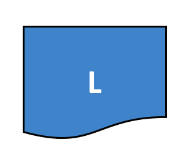
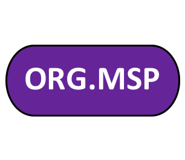

Glossary (用語集)
=================

すべてのHyperledger Fabricユーザーと開発者が、
それぞれの特定の用語が何を意味するかについて合意できるためには、用語集が重要です。
例えば、スマートコントラクトとは何でしょうか。
本ドキュメントは必要に応じてこの用語集を参照しますが、
もしよろしければ全体に目を通してみてください。とても勉強になるでしょう。

.. _Anchor-Peer:

Anchor Peer (アンカーピア)
--------------------------

アンカーピアは、異なる組織に属するピアが互いを知るためにゴシッププロトコルによって利用されます。

アンカーピアの更新を含むコンフィギュレーションブロックがコミットされたとき、各ピアは新しいアンカーピアにアクセスし、
アンカーピアが認識している全てのピアについて学習します。
各組織から少なくとも1つ以上のピアがアンカーピアにコンタクトを取ると、
そのアンカーピアはそのチャネル内の全てのピアについて学習します。
ゴシップのコミュニケーションは定常的に行われ、ピアは常に自分が知らないピアの
存在を通知するよう要求しているため、あるチャネルの所属メンバーについて共通認識を確立できます。

たとえば、あるチャネルに ``A`` と ``B`` と ``C`` の3つの組織があり、
組織 ``C`` のアンカーピアとして ``peer0.orgC`` が定義されているとします。
組織 ``A`` に属する ``peer1.orgA`` が ``peer0.orgC`` にコンタクトを取った時、
``peer0.orgC`` に ``peer0.orgA`` に関して教えるでしょう。
そして、その後 ``peer1.orgB`` が ``peer0.orgC`` にコンタクトを取った時、
``peer0.orgC`` が ``peer1.orgB`` に ``peer0.orgA`` について知らせます。
これ以降、組織 ``A`` と ``B`` はメンバーシップ情報を ``peer0.orgC`` を介さず直接交換するようになります。

組織間の通信はゴシップに依存しているため、チャネル設定には少なくとも1つのアンカーピアが定義されている必要があります。
高可用性と冗長性のために、すべての組織がアンカーピアのセットを提供することを強くお勧めします。

.. _glossary_ACL:

ACL (アクセス制御リスト)
------------------------

ACL (アクセス制御リスト) は、特定のピアのリソース (例えばシステムチェーンコードの API やイベントサービス) へのアクセスを、
:ref:`ポリシー <Policy>` (どのタイプの組織あるいはロールがいくつ必要か指定するもの) に関連付けるものです。
ACLはチャネルの設定の一部です。
そのため、チャネルのコンフィギュレーションブロックに保存され、更新は通常のチャネルのコンフィギュレーションブロックの更新メカニズムを通して行います。

ACLはキーと値のペアのリストとしてフォーマットされ、そこではキーがアクセス制御したいリソースを特定し、値はそのリソースへのアクセスが許可されたグループを指定するチャネルポリシーを特定します。
たとえば ``lscc/GetDeploymentSpec: /Channel/Application/Readers`` はライフサイクルチェーンコードの API ``GetDeploymentSpec`` が、ポリシー ``/Channel/Application/Readers`` を満たす主体からアクセス可能であることを定義します。

デフォルトのACL設定はファイル ``configtx.yaml`` により与えられ、このファイルは configtxgen がチャネル設定をビルドするために使用されます。
このデフォルト設定は、``configtx.yaml`` の "Application" セクションのトップレベルで指定するか、"Profile" セクションでプロファイルごとに上書きして指定できます。

.. _Block:

Block (ブロック)
----------------

.. figure:: ./glossary/glossary.block.png
   :scale: 50 %
   :align: right
   :figwidth: 40 %
   :alt: A Block

   ブロック B1 はブロック B0 にリンクされ、ブロック B2 はブロック B1 にリンクされています。

=======

ブロックは順序付けられたトランザクションのセットを含んでいます。ブロックは暗号論的に前のブロックにリンクされ、そのブロック自身も後続のブロックによってリンクされる。
一連のブロックチェーンの最初のブロックは **ジェネシスブロック (genesis block)** と呼ばれます。
ブロックはオーダリングサービスによって生成され、ピアによって検証およびコミットされます。

.. _Chain:

Chain (チェーン)
----------------

.. figure:: ./glossary/glossary.blockchain.png
   :scale: 75 %
   :align: right
   :figwidth: 40 %
   :alt: Blockchain

   ブロックチェーン B にはブロック 0, 1, 2 を含みます。

=======

台帳のチェーンはトランザクションのログで、複数のトランザクションをまとめたブロックをハッシュチェーンでリンクした構造をしています。
ピアはオーダリングサービスからブロックを受け取ると、エンドースメントポリシーと同時実行違反の有無に基づき各トランザクションが正当かどうかをマークした上で、ピアのファイルシステム上のハッシュチェーンに追加します。

.. _chaincode:

Chaincode (チェーンコード)
--------------------------

詳細については :ref:`スマートコントラクト<Smart-Contract>` を参照。

.. _Channel:

Channel (チャネル)
------------------

.. figure:: ./glossary/glossary.channel.png
   :scale: 30 %
   :align: right
   :figwidth: 40 %
   :alt: A Channel

   チャネル C はアプリケーション A1、ピア P2、およびオーダリングサービス O1 に接続しています。

=======

チャネルとは、データの分離と機密性を実現するためにプライベートブロックチェーンのオーバーレイです。
チャネル固有の台帳はそのチャネルに属するピアの間で共有され、トランザクションを実行する関係者はチャネルとやりとりするためにチャネルに対して認証される必要があります。
チャネルは :ref:`コンフィギュレーションブロック<Configuration-Block>` で定義されています。

.. _Commit:

Commit (コミット)
-----------------

あるチャネル上の各ピア (Peer_) は、順序付けられたトランザクションのブロックを検証し、そのブロックをそのチャネルの台帳 (Ledger_) の複製にコミットします。
ピアは各ブロック内の各トランザクションに対して正当かどうかをマークします。

.. _Concurrency-Control-Version-Check:

Concurrency Control Version Check (同時処理制御バージョンチェック)
------------------------------------------------------------------

同時処理制御バージョンチェックは、チャネル上のピア間で台帳の状態を同期させる方法です。
ピアはトランザクションを並列に実行し、台帳にコミットする前に、トランザクションが実行されたときに読み込まれた状態が変更されているかどうかを確認します。
そのトランザクションのために読み込まれたデータが実行時とコミット時の間で変更された場合、同時実行制御バージョンチェックの違反が発生し、トランザクションは台帳上で無効とマークされ、ステートデータベース中の値は更新されません。

.. _Configuration-Block:

Configuration Block (コンフィギュレーションブロック)
----------------------------------------------------

コンフィギュレーションブロックはシステムチェーン (オーダリングサービス) あるいはチャネルのメンバーやポリシーを定義する設定データを含んでいます。
チャネルまたはネットワーク全体に対する設定の変更 (たとえばメンバーの削除、追加など) があると、新しいコンフィギュレーションブロックが適切なチェーンに追加されることになります。
このブロックには、ジェネシスブロックの内容と、そこからの差分の情報が含まれています。

.. _Consensus:

Consensus (合意形成)
--------------------

トランザクションフロー全体を包括するより広い用語で、トランザクションの実行順序に関する合意を生成して、ブロックを構成するトランザクションセットの正確さを確認するために行われるプロセスを指しています。

.. _Consenter-Set:

Consenter set (同意者セット)
----------------------------

同意者セットは、Raftオーダリングサービスにおいて、チャネル上の合意形成機構に参加しているアクティブなオーダリングノードを指しています。
システムチャネルに存在していても、あるチャネルの一部でないオーダリングノードは、そのチャネルにおいては同意者セットの一員ではありません。

.. _Consortium:

Consortium (コンソーシアム)
---------------------------

コンソーシアムは、ブロックチェーンネットワーク上のorderer組織を除く組織の集合です。
これらは、チャネルを形成するとともにチャネルに参加しており、ピアを所有する組織です。
一つのブロックチェーンネットワークは複数のコンソーシアムを持つことができますが、ほとんどのブロックチェーンネットワークは単一のコンソーシアムを持っています。
チャネルの作成時に、チャネルに追加されるすべての組織は一つのコンソーシアムの一員である必要があります。
ただし、コンソーシアム内で定義されていない組織も、既存のチャネルに追加することができます。

.. _Chaincode-definition:

Chaincode definition (チェーンコード定義)
-----------------------------------------

チェーンコード定義は、チェーンコードがあるチャネル上で利用可能になる前にチェーンコードのパラメータについて組織間で合意するために使用されます。
そのチェーンコードを使ってトランザクションの承認、あるいは台帳のクエリを行いたいチャネルの各メンバーは、その組織に対するチェーンコード定義を承認する必要があります。
チャネルのメンバーからチェーンコード定義の承認が十分な数得られ、ライフサイクルエンドースメントポリシー (デフォルトではチャネルに属する組織の過半数) を満たすと、チェーンコード定義をチャネルにコミットできます。
チェーンコード定義がコミットされた後は、チェーンコードの最初の呼び出し時 (あるいは要求された場合は Init 関数の実行時) にチャネル上のチェーンコードが開始します。

.. _Dynamic-Membership:

Dynamic Membership (動的メンバーシップ)
---------------------------------------

Hyperledger Fabricは、ネットワーク全体の運用性を損なうことなく、メンバー、ピア、およびオーダリングサービスノードの追加・削除をサポートします。
動的メンバーシップは、ビジネス関係を調整し、さまざまな理由でエンティティを追加または削除する必要がある場合に重要です。

.. _Endorsement:

Endorsement (エンドースメント)
------------------------------

エンドースメントは、特定のピアノードがチェーンコードトランザクションを実行し、提案応答をクライアントアプリケーションに返すプロセスを指します。
提案応答には、チェーンコード実行応答メッセージ、結果 (読み込みセットおよび書き込みセット)、イベント、およびピアのチェーンコード実行の証明となる署名が含まれます。
チェーンコードアプリケーションには対応するエンドースメントポリシーがあり、そこではエンドースできるピアが指定されています。

.. note:: endorse という言葉は「承認する」という訳語が与えられることがありますが、
          チェーンコードのライフサイクルを扱う文脈で approve という言葉も用いられるため、
          本ドキュメントでは混同を避けるために endorse はカタカナ表記しています。

.. _Endorsement-policy:

Endorsement policy (エンドースメントポリシー)
---------------------------------------------

エンドースメントポリシーは特定のチェーンコードアプリケーションに紐付けられたトランザクションを実行しなければならないチャネル上のピアノードと、必要な提案応答 (エンドースメント) の組み合わせを定義します。
ポリシーは、あるチェーンコードをエンドースできるピアの中から、ピアの数、ピアの割合、あるいは全てのピアといった形で、トランザクションに対して必要となるエンドースメントを定義することができます。
ポリシーはアプリケーションと、エンドーシングピアの不正行為 (意図的であるかに関わない) に対する望ましいレベルの回復力に基づいて決められます。
送信されたトランザクションは、コミットピアにより正当とマークされる前に、エンドースメントポリシーを満たさなければなりません。

.. _Follower:

Follower (フォロワ)
-------------------

Raftのようなリーダーベースの合意プロトコルにおいて、フォロワはリーダーによって生成されたログエントリを複製するノードのことを意味します。
Raftでは、フォロワはリーダーから「ハートビート」メッセージも受け取ります。
リーダーが設定可能な期間これらのメッセージを送信しなかった場合、フォロワはリーダー選出を開始し、フォロワの中の一つがリーダーとして選出されます。

.. _Genesis-Block:

Genesis Block (ジェネシスブロック)
----------------------------------

ジェネシスブロックはオーダリングサービスを初期化する、またはチェーンの最初のブロックとして機能するコンフィギュレーションブロックのことを意味します。

.. _Gossip-Protocol:

Gossip Protocol (ゴシッププロトコル)
------------------------------------

ゴシッププロトコル (データ配布プロトコル) は以下の3つの機能を実行します。

1. ピアディスカバリとチャネルメンバーシップを管理する
2. チャネル上のすべてのピアに台帳データを配布する
3. チャネル上のすべてのピアの状態を同期させる

ゴシップの詳細については :doc:`Gossip <gossip>` を参照してください。

.. _Fabric-ca:

Hyperledger Fabric CA
---------------------

Hyperledger Fabric CAは、PKIベースの証明書をネットワークメンバー組織とそのユーザーに対して発行するデフォルトの認証局コンポーネントです。
CAは、各メンバーに対して一つのルート証明書 (rootCert) を発行し、許可された各ユーザーに対して一つの登録証明書 (ECert) を発行します。

.. _Init:

Init
----

Initはチェーンコードアプリケーションを初期化するメソッドです。
すべてのチェーンコードはInit関数が必要です。
デフォルトでは、この関数は実行されません。
しかし、チェーンコード定義を使用すると、チェーンコードを初期化するためにInit関数の実行を要求できます。

Install
-------

Installはピアのファイルシステムにチェーンコードを配置する処理です。

Instantiate
-----------

Instantiateは特定のチャネルでチェーンコードアプリケーションを開始および初期化する処理です。
インスタンス化の後、チェーンコードがインストールされているピアはチェーンコードの関数呼び出し (Invoke) を受け入れることができます。

**注**: *この処理 (Instantiate) は、1.4.x以前のバージョンのチェーンコードライフサイクルにおいて使用されていました。
Fabric v2.0に導入された新しいFabricチェーンコードライフサイクルを用いたチャネルでチェーンコードを開始する手順については、* :ref:`チェーンコード定義<Chaincode-definition>` *を参照してください。*

.. _Invoke:

Invoke
------

Invokeは、チェーンコード関数を呼び出すために使用します。
クライアントアプリケーションは、ピアにトランザクション提案を送信することによってチェーンコードを呼び出します。
ピアはチェーンコードを実行し、エンドースされた提案応答をクライアントアプリケーションに返します。
クライアントアプリケーションは、エンドースメントポリシーを満たすために十分な提案応答を収集した後、順序付け、検証、およびコミットのためにトランザクション結果を送信します。
クライアントアプリケーションは、トランザクション結果を送信しないという選択もできます。
たとえば、Invokeが台帳のクエリのみ行う場合、監査目的で台帳に読み込みを記録したいということがないならば、クライアントアプリケーションは通常、読み込み専用トランザクションを発行しません。
Invokeの呼び出しには、チャネル識別子、呼び出すチェーンコード関数名、および引数の配列が渡されます。

.. _Leader:

Leader (リーダー)
-----------------

Raftのようなリーダーベースの合意プロトコルにおいて、リーダーは新しいログエントリの取り込み、それらのフォロワのオーダリングノードへの複製、およびエントリがコミットされたと見なされるタイミングの管理、の責任を担っています。
リーダーはordererの特別な **タイプ** を表すものではありません。
リーダーはあるordererが環境によって決まる特定の期間だけ担っている役割です。

.. _Leading-Peer:

Leading Peer (リーダーピア)
---------------------------

各 :ref:`組織<organization>` は、加入している各チャネルに対して複数のピアを所有できます。
これらのピアのうち1つ以上は、組織を代表してネットワークオーダリングサービスと通信するために、チャネルのリーダーピアとして動作する必要があります。
オーダリングサービスは、チャネル上のリーダーピアにブロックを配信し、リーダーピアは同じ組織内の他のピアにブロックを配信します。

.. _Ledger:

Ledger (台帳)
-------------

   台帳 'L'

台帳は、2つの (関連はあるものの) 異なる部分で構成されています。「ブロックチェーン」と「ステートデータベース」 (「ワールドステート」とも呼ばれます) です。
他の台帳とは異なり、ブロックチェーンは **イミュータブル** です。つまり、一度ブロックがチェーンに追加されたら、そのブロックは変更できません。
対照的に、「ワールドステート」はキーと値のペアのセットの現在の値を含むデータベースで、ブロックチェーン内の検証済みトランザクションとコミット済みトランザクションのセットによって追加、変更、または削除されたものです。

ネットワーク内の各チャネルに対して一つの **論理的な** 台帳があると考えるとわかりやすいでしょう。
実際は、チャネル上の各ピアが台帳のコピーを維持しており、各コピーは **合意形成** と呼ばれるプロセスを経て一貫性が保たれています。
**分散台帳技術 (Distributed Ledger Technology: DLT)** という言葉は、論理的には単一ですが、そのコピーをネットワークノード(ピアやオーダリングサービス)に分散させているような台帳によく関連付けられます。

.. _Log-entry:

Log entry (ログエントリ)
------------------------

ログエントリはRaftオーダリングサービスの作業の基本単位で、リーダーのordererからフォロワに配布されます。
そのようなログエントリの完全なシーケンスのことを「ログ」と呼びます。
ログは、すべてのメンバーがエントリとその順序について同意する場合、一貫していると見なされます。

.. _Member:

Member (メンバー)
-----------------

:ref:`組織<Organization>` を参照してください。

.. _MSP:

Membership Service Provider (メンバーシップサービスプロバイダ)
--------------------------------------------------------------

   "ORG.MSP"というMSP

Membership Service Provider (MSP; メンバーシップサービスプロバイダ)は、クライアントやピアに資格情報を提供してHyperledger Fabricのネットワークに参加できるようにするためのシステムの抽象コンポーネントを指しています。
クライアントはこれらの資格情報を使用してトランザクションを認証し、ピアはこれらの資格情報を使用してトランザクションの処理結果 (エンドースメント) を認証します。
このインターフェースは、システムのトランザクション処理コンポーネントに強く結び付けられている一方で、メンバーシップサービスのコンポーネントを、異なる実装のものをスムーズに (システムのトランザクション処理コンポーネントのコアを変更することなく) プラグインできるよう定義する狙いがあります。

.. _Membership-Services:

Membership Services (メンバーシップサービス)
--------------------------------------------

メンバーシップサービスは、許可型ブロックチェーンネットワーク上のアイデンティティを認証、認可、管理します。
メンバーシップサービスのコードはピアおよびorderer上で実行され、ブロックチェーン操作の認証と認可の両方を行います。
メンバーシップサービスはMSPをPKIベースで実装したものです。

.. _Ordering-Service:

Ordering Service (オーダリングサービス)
---------------------------------------

オーダリングサービスは **orderer** とも呼ばれ、トランザクションの順序を決めてブロックを作り、接続しているピアに検証とコミット処理のためにブロックを配布する役割を持ったノードの集合と定義されています。
オーダリングサービスはピアのプロセスから独立して存在し、ネットワーク上のすべてのチャネルに対してトランザクションを先着順に並べます。
オーダリングサービスは、KafkaやRaftのような外部コンポーネントの違いを超えてプラグイン可能な実装をサポートするように設計されています。
これは、ネットワーク全体に対して共通のバインディングです。つまり各 :ref:`メンバー<Member>` に紐付けられた暗号学的な識別情報を含んでいます。

.. _Organization:

Organization (組織)
-------------------

.. figure:: ./glossary/glossary.organization.png
   :scale: 25 %
   :align: right
   :figwidth: 20 %
   :alt: An Organization

   組織 'ORG'

=====

組織は「メンバー」とも呼ばれ、ブロックチェーンネットワークプロバイダからブロックチェーンネットワークに招待されて参加します。
組織はメンバーシップサービス・プロバイダ (MSP_) をネットワークに追加することで参加します。
MSPは、その組織によって発行された有効なアイデンティティによって署名 (トランザクションに対する署名、など) が生成されたことを、ネットワークの他のメンバーがどのように検証するかを定義します。
MSP内のアイデンティティの特定のアクセス権は、組織がネットワークに参加したときに合意されたポリシーによって管理されます。
組織は、多国籍企業のように大きいものでも、個人ほどの小さいものでも構いません。
組織のトランザクションのエンドポイントはピア (Peer_) です。
組織の集合はコンソーシアム (Consortium_) を形成します。
ネットワーク上のすべての組織はメンバーですが、すべての組織がコンソーシアムに参加しているわけではありません。

.. _Peer:

Peer (ピア)
-----------

.. figure:: ./glossary/glossary.peer.png
   :scale: 25 %
   :align: right
   :figwidth: 20 %
   :alt: A Peer

   ピア 'P'

ピアは台帳を維持するネットワークエンティティであり、台帳への読み書き操作を行うためにチェーンコードのコンテナを実行します。
ピアはメンバーによって所有および維持されます。

.. _Policy:

Policy (ポリシー)
-----------------

ポリシーは、デジタルアイデンティティのプロパティで構成される式です。
たとえば ``OR('Org1.peer', 'Org2.peer')`` のようなものです.
これはブロックチェーンネットワーク上のリソースへのアクセスを制限するために使用されます。
たとえば、チャネルに対して誰が読み込めるか・書き込めるかを指定したり、 :ref:`ACL<glossary_ACL>` を用いて誰が特定のチェーンコードAPIを利用できるかを指定したりできます。
ポリシーはオーダリングサービスを起動する前、あるいはチャネルを作成する前に ``configtx.yaml`` 内で定義してもよいですし、あるいはチャネル上でチェーンコードをインスタンス化する際に指定することもできます。
デフォルト設定はサンプルの ``configtx.yaml`` に記述されていて、大半のネットワークではその設定が適しているでしょう。

.. _glossary-Private-Data:

Private Data (プライベートデータ)
---------------------------------

プライベートデータは各ピアのプライベートデータベースに保存される機密データを意味します。
プライベートデータベースは各ローカルピアにのみアクセスが許可されており、チャネルの台帳データとは論理的に分離されています。
プライベートデータへのアクセスは、プライベートデータコレクションの定義に基づきチャネル上の1つ以上の組織に制限されます。
権限を持たない組織は、トランザクションデータの証拠としてチャネルの台帳上にプライベートデータのハッシュ値を保存するでしょう。
また、より高度な秘匿性のために、プライベートデータのハッシュはオーダリングサービス (Ordering-Service_) を経由しますが、プライベートデータそのものは経由しないようにしています。これによりordererからもデータの機密性が守られます。

.. _glossary-Private-Data-Collection:

Private Data Collection (プライベートデータコレクション、または単にコレクション)
--------------------------------------------------------------------------------

プライベートデータコレクションは、チャネル上の2つ以上の組織が、それ以外の組織から秘匿したいデータを管理するために使用されます。
コレクション定義は、プライベートデータを保存する権限が与えられたチャネル上の組織のサブセットを記述します。
これは、突き詰めると、これらの組織のみが当該プライベートデータを用いたトランザクションを実行できることを意味します。

.. _Proposal:

Proposal (提案)
---------------

提案はチャネル上の特定のピアに対して送信されるエンドース処理の要求を意味します。
各提案は、InitまたはInvoke (読み込み/書き込み) の要求です。

.. _Query:

Query
-----

Queryは、台帳の現在の状態を読み込むが、台帳には書き込まれないチェーンコード呼出しです。
このチェーンコード関数は、台帳の特定のキーを問い合せることも、キーのセットを指定して問い合せることもできます。
Queryによって台帳の状態が変更されることはないため、クライアントアプリケーションは通常、順序付け、検証およびコミットのために読み込み専用のトランザクションを発行しません。
一般的ではありませんが、クライアントアプリケーションは、たとえば、クライアントが特定の時点で特定の台帳状態を認識していたことを台帳チェーンに監査可能な証拠として残したい場合に、順序付け、検証およびコミットのために読み込み専用トランザクションを発行するように選択することもできます。

.. _Quorum:

Quorum (定足数)
---------------

定足数はトランザクションが順序付けされるために必要な、提案をエンドースするメンバー数の最低値を意味します。
全ての同意者セットについて、これはノードの **過半数** を意味します。
5ノードのクラスタでは、定足数を満たすには3ノードが必要です。
なんらかの理由でノードが定足数を満たさない場合、クラスタは読み込みも書き込みもできず、新しいログをコミットすることができません。

.. _Raft:

Raft
----

v1.4.1の新機能であるRaftはクラッシュ故障耐性 (CTF) を持ったオーダリングサービスの実装で、`Raft プロトコル <https://raft.github.io/raft.pdf>`_ の `etcd ライブラリ <https://coreos.com/etcd/>`_ に基づいています。
Raftは「リーダー・フォロワ」モデルに従っており、チャネルごとにリーダーノードを選出し、リーダーの決定がフォロワに複製されます。
Raftオーダリングサービスは、Kafkaベースのオーダリングサービスよりもセットアップや管理が容易で、その設計により組織は分散されたオーダリングサービスにノードを提供できるようになっています。

.. _SDK:

Software Development Kit (SDK)
------------------------------

Hyperledger FabricのクライアントSDKは、開発者がチェーンコードアプリケーションを作成およびテストするための構造化されたライブラリ環境を提供します。
SDKは、標準インターフェイスを通じて完全に設定可能であり、拡張可能です。
署名のための暗号アルゴリズム、ログフレームワーク、状態保存のためのコンポーネントは、SDKに簡単に出し入れできます。
SDKは、トランザクション処理、メンバーシップサービス、ノードトラバーサル、およびイベント処理のためのAPIを提供します。

現在、公式にサポートされているSDKはNode.js用とJava用の2つです。さらに2つ (PythonとGo) のSDKはまだ正式版ではありませんが、ダウンロードしてテストすることは可能です。

.. _Smart-Contract:

Smart Contract (スマートコントラクト)
-------------------------------------

スマートコントラクトは、ブロックチェーンネットワークの外部にあるクライアントアプリケーションによって呼び出され、 :ref:`トランザクション<Transaction>` を通して :ref:`ワールドステート<World-State>` 内のキーバリューペアのセットへのアクセスや更新を管理するコードです。
Hyperledger Fabricでは、スマートコントラクトはチェーンコードとしてパッケージ化されます。
チェーンコードはピアにインストールされ、1つまたは複数のチャネルで定義および使用されます。

.. _State-DB:

State Database (ステートデータベース)
-------------------------------------

ワールドステートのデータは、チェーンコードからの読み込みやクエリに効率よく対処するために、ステートデータベースに格納されます。
サポートされているデータベースは、levelDBとcouchDBです。

.. _System-Chain:

System Chain (システムチェーン)
-------------------------------

システムチェーンはシステムレベルでネットワークを定義するコンフィギュレーションブロックを含んでいます。
システムチェーンはオーダリングサービス内に存在し、チャネルと同様に、次のような情報を含む初期設定を持ちます: MSP情報、ポリシー、および構成の詳細。
ネットワーク全体に変更があると (たとえば、新しい組織の参加や新しいオーダリングノードの追加など)、システムチェーンに新しいコンフィギュレーションブロックが追加されます。

システムチェーンは、チャネルまたはチャネルのグループに対する共通のバインディングと考えることができます。
たとえば、複数の金融機関が (システムチェーンを通じて代表される) コンソーシアムを形成し、その後、時々刻々変化する提携ビジネスのアジェンダに対するチャネルを作成することができます。

.. _Transaction:

Transaction (トランザクション)
------------------------------

.. figure:: ./glossary/glossary.transaction.png
   :scale: 30 %
   :align: right
   :figwidth: 20 %
   :alt: A Transaction

   トランザクション 'T'

トランザクションは、チェーンコードがクライアントアプリケーションから呼び出され、台帳上のデータに対して読み込みまたは書き込みを行うときに作成されます。
Fabricのアプリケーションクライアントは、トランザクション提案をエンドースピアに送信してトランザクションの実行およびエンドース処理を求め、エンドースピアから署名 (エンドース) された応答を収集し、トランザクション結果とエンドースメントをトランザクションにパッケージ化して、オーダリングサービスに送信します。
オーダリングサービスは、トランザクションを順序付けしてブロックに配置し、ブロックをピアにブロードキャストします。ピアはブロック内をトランザクションを検証し、正当なトランザクションの結果を台帳にコミットし、ワールドステートを更新します。

.. _World-State:

World State (ワールドステート)
------------------------------

.. figure:: ./glossary/glossary.worldstate.png
   :scale: 40 %
   :align: right
   :figwidth: 25 %
   :alt: Current State

   ワールドステート 'W'

ワールドステートはHyperledger Fabricの :ref:`台帳<Ledger>` の「現在の状態」を表すコンポーネントです。
ワールドステートはチェーンのトランザクションログに含まれる全てのキーに対する最新の値を表します。
チェーンコードはワールドステートに対してトランザクション提案を処理します。
なぜなら、ワールドステートにより、トランザクションログ全体を走査して計算しなくとも、
各キーに対する最新の値に直接アクセスすることができるためです。
ワールドステートはあるキーの値が変化すると毎回変化します。
例えば、車の所有者 (キー)がある所有者から別の所有者 (値) に移転したときや、新しいキーが追加されたときなどです。
その結果、ワールドステートは、キーと値のペアは変更される前にその現在状態を知る必要があるため、
トランザクションフローにおいて重要な役割を持ちます。
ピアは処理したブロックに含まれる正しいトランザクションのそれぞれについて、最新の値を台帳とワールドステートにコミットします。

.. Licensed under Creative Commons Attribution 4.0 International License
   https://creativecommons.org/licenses/by/4.0/
