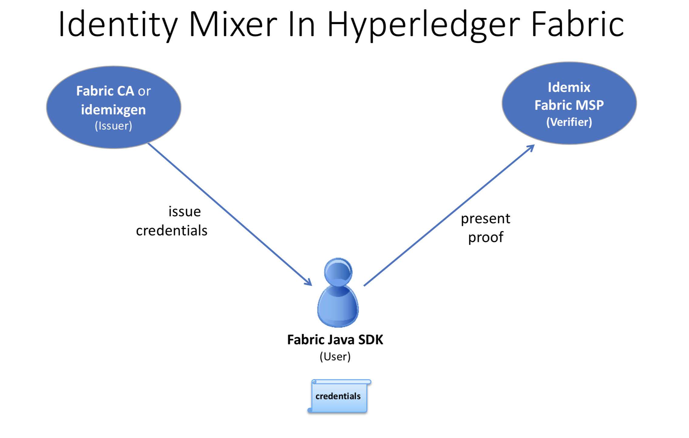

MSP Implementation with Identity Mixer
======================================

What is Idemix?
---------------

Idemixは暗号プロトコルスイートで、強力な認証機能とプライバシー保護機能を提供します。
取引者のアイデンティティを明かさずにトランザクションを実行できる **匿名性** 、および、トランザクションが同じアイデンティティによって送信されたことを明らかにすることなく、単一のアイデンティティが複数のトランザクションを送信できる **リンク不可能性** があります。

Idemixのフローには、 **User(ユーザー)**、 **Issuer(発行者)**、 **Verifier(検証者)** という3つのアクターが関与します。

.. image:: images/idemix-overview.png

* 発行者は、ユーザ属性のセットがデジタル証明書の形で発行されたことを証明します。以下、"資格情報"と呼ばれます。
* ユーザーは、資格情報の所有に関する "`ゼロ知識証明 <https://en.wikipedia.org/wiki/Zero-knowledge_proof>`_" を生成し、ユーザーが開示することを選択した属性のみを公開します。
この証明はゼロ知識なので、検証者、発行者、その他の誰に対しても追加情報を開示しません。

たとえば、"Alice"がBob(店員)に対して、彼女がDMVによって発行された運転免許証を持っていることを証明する必要があると仮定します。

このシナリオでは、Aliceがユーザ、DMVが発行者、Bobが検証者です。
Aliceは運転免許証を持っていることをBobに証明するために、免許証をBobに見せることができます。
しかし、Bobは、Aliceの名前、住所、正確な年齢など、Bobが知る必要のある情報よりもはるかに多くの情報を見ることができます。

代わりに、AliceはIdemixを使用して、Bob向けの"ゼロ知識証明"を生成することができます。
ゼロ知識証明により、Aliceが有効な運転免許証を持っていることだけを明らかにし、それ以外は何も明らかにしません。

その証拠から:

* Bobは、Aliceが有効な運転免許証(匿名)を持っているという事実以外に、Aliceに関する追加情報を取得しません。
* Aliceが何度も店を訪れ、毎回Bobのために証明を生成する場合、Bobはその証明からそれが同一人物であることを見分けることができません(リンク不可能性)。

Idemixの認証技術は、標準的なX.509証明書によって保証されるものと同様の信頼モデルとセキュリティ保証を提供しますが、基礎となる暗号アルゴリズムによって、上記のような高度なプライバシー機能を効率的に提供します。
IdemixとX.509技術の詳細な比較については、以下の技術セクションで説明します。

How to use Idemix
-----------------

Hyperledger FabricでIdemixを使用する方法を理解するためには、FabricのどのコンポーネントがIdemixのユーザー、発行者、検証者に対応しているかを確認する必要があります。

* Fabric Java SDKは **ユーザー** 用のAPIです。将来的には、他のFabric SDKもIdemixをサポートする予定です。

* Fabricは2つのIdemix **発行者** を提供します。:

   a) Fabric CAは、本番環境、または、開発向けです。
   b) :doc:`idemixgen <idemixgen>` は開発環境用のツールです。

* **検証者** はFabricのIdemix MSPです。

Hyperledger FabricでIdemixを使うには、次の3つの基本的なステップが必要です。:

*このイメージのロールを上記のロールと比較します。*

1. 発行者について考えてみよう。

   Fabric CA (バージョン1.3以降)は、Idemixの発行者として自動的に機能するように拡張されました。
   ``fabric-ca-server`` を起動(または ``fabric-ca-server init`` コマンドで初期化)すると、  ``fabric-ca-server`` のホームディレクトリに、 ``IssuerPublicKey`` と ``IssuerRevocationPublicKey`` の2つのファイルが自動的に作成されます。
   これらのファイルはステップ2で必要です。

   開発環境でFabric CAを使用していない場合、 ``idemixgen`` を使ってこれらのファイルを生成できます。

2. 検証者ついて考えてみよう。

  ステップ1の ``IssuerPublicKey`` と ``IssuerRevocationPublicKey`` を利用して、Idemix MSPを生成します。

   例えば、 `Hyperledger Java SDK サンプルのconfigtx.yaml <https://github.com/hyperledger/fabric-sdk-java/blob/{BRANCH}/src/test/fixture/sdkintegration/e2e-2Orgs/v1.3/configtx.yaml>`_ から抜粋したもので考えてみます。

   .. code:: bash

      - &Org1Idemix
          # defaultorg defines the organization which is used in the sampleconfig
          # of the fabric.git development environment
          name: idemixMSP1

          # id to load the msp definition as
          id: idemixMSPID1

          msptype: idemix
          mspdir: crypto-config/peerOrganizations/org3.example.com

   ``msptype`` が ``idemix`` に設定され ``mspdir`` ディレクトリの中身 (この例では ``crypto-config/peerOrganizations/org3.example.com/msp`` ) は、 ``IssuerPublicKey`` と ``IssuerRevocationPublicKey`` のファイルを含みます。

   この例では、 ``Org1Idemix`` が ``Org1`` 向けのIdemix MSPを表すことに注意してください。
   また、(ここには表示されていませんが) X509 MSPを含んでいます。

3. ユーザーについて考えてみよう。Java SDK がユーザー向けのAPIであることを思い出してください。

   IdemixをJava SDKで使用するために必要な追加APIコールは1つだけです。
   ``org.hyperledger.fabric_ca.sdk.HFCAClient`` クラスの ``idemixEnroll`` メソッドです。
   例えば、 ``hfcaClient`` がHFCAClientオブジェクトで、 ``x509Enrollment`` が ``org.hyperledger.fabric.sdk.Enrollment`` でX509証明書に関連付けられているとします。

   次の呼び出しは、Idemixの資格情報に関連付けられた ``org.hyperledger.fabric.sdk.Enrollment`` というオブジェクトを返します。

   .. code:: bash

      IdemixEnrollment idemixEnrollment = hfcaClient.idemixEnroll(x509enrollment, "idemixMSPID1");

   ``IdemixEnrollment`` は ``org.hyperledger.fabric.sdk.Enrollment`` を実装しているので、X509のエンロールオブジェクトを処理する場合と同じように使用できますが、Idemixのプライバシー強化機能が自動的に提供されるということに注意してください。

Idemix and chaincode
----------------------

検証者の観点からは、もう1つ検討すべきアクターとしてチェーンコードがあります。
Idemix資格情報が使用されている場合、チェーンコードはトランザクション実行者について何を知ることができるのでしょうか?

`cid (Client Identity) library <https://godoc.org/github.com/hyperledger/fabric-chaincode-go/pkg/cid>`_
は、Idemix資格情報が使用される場合、 ``GetAttributeValue`` 関数をサポートするように拡張されています(Goのみ)。
ただし、以下の"Current limitations"セクションで述べるように、Idemixのケースで開示される属性は ``ou`` and ``role`` の2つのみです。

Fabric CAが資格情報の発行元である場合:

* ``ou`` 属性の値は、アイデンティティの **affiliation** です。 (例: "org1.department1")
* ``role`` 属性の値は、'member'または'admin'のいずれかになります。
  'admin'の値は、そのアイデンティティがMSP管理者であることを意味します。
  デフォルトでは、Fabric CAによって作成されたアイデンティティは、'member'ロールを返します
  'admin'のアイデンティティを作成するには、 ``role`` 属性とその値を ``2`` にしてアイデンティティを登録します。

Java SDKでaffiliationを設定する例については、
`sample <https://github.com/hyperledger/fabric-sdk-java/blob/{BRANCH}/src/test/java/org/hyperledger/fabric/sdkintegration/End2endIdemixIT.java#L121>`_
を参照してください。

goチェーンコードでCIDライブラリを使用して属性を取得する例については、
`go chaincode <https://github.com/hyperledger/fabric-sdk-java/blob/{BRANCH}/src/test/fixture/sdkintegration/gocc/sampleIdemix/src/github.com/example_cc/example_cc.go#L88>`_
を参照してください。

Idemix組織を使用して、チェーンコードをエンドースしたり、チェーンコード定義を承認することはできません。
これは、チャネルにLifecycleEndorsementおよびEndorsementポリシーを設定するときに考慮する必要があります。
詳細については、以下の制限のセクションを参照してください。

Current limitations
--------------

現在のバージョンのIdemixにはいくつかの制限があります。

* **Idemix組織とエンドースメントポリシー**

  Idemix組織を使用して、チェーンコードトランザクションをエンドースしたり、チェーンコード定義を承認することはできません。
  デフォルトでは、 ``Channel/Application/LifecycleEndorsement`` および ``Channel/Application/Endorsement`` ポリシーは、チャネルでアクティブな組織の過半数からの署名を必要とします。
  これは、多数のIdemix組織を含むチャネルは、デフォルトポリシーを満たすために必要な過半数に到達できない可能性があることを意味します。
  例えば、チャネルに2つのMSP組織と2つのIdemix組織がある場合、チャネルポリシーでは、4つの組織のうち3つがチェーンコード定義を承認し、その定義をチャネルにコミットする必要があります。
  Idemix組織はチェーンコード定義を承認できないため、ポリシーでは4つの署名のうち2つしか検証できません。

  チャネルに、エンドースメントポリシーに影響を与えるのに十分な数のIdemix組織が含まれている場合は、署名ポリシーを使用して、必要なMSP組織を明示的に指定できます。

* **属性の固定セット**

  カスタム属性を利用してIdemix資格情報を発行または使用することはまだできません。
  カスタム属性は将来のリリースでサポートされる予定です。

  現在サポートされている属性は次の4つです。

  1. 組織単位属性("ou"):

   - 使用法: X.509と同じ
   - 型: String
   - 開示: 常に

  2. ロール属性("role"):

   - 使用法: X.509と同じ
   - 型: integer
   - 開示: 常に

  3. 登録ID属性

   - 使用法: ユーザーを一意に識別します。同じユーザーに属するすべての登録資格情報で同じです(今後のリリースで監査に使用されます)。
   - タイプ: BIG
   - 開示: 署名には含まれず、Fabric CAの認証トークンを生成するときにだけ表示されます。

  4. 失効処理属性

   - 使用法: 資格情報を一意に識別します。(将来のリリースで失効に使用されます)。
   - 型: integer
   - 開示: なし

* **失効はまだサポートされていません**

   上記の失効処理属性の存在から分かるように、失効フレームワークの多くは整備されていますが、Idemix資格情報の失効はまだサポートされていません。

* **ピアはIdemixをエンドースに使用しない**

   現在、ピアはIdemix MSPを署名検証のみに使用しています。
   Idemixによる署名は、クライアントSDKを介してのみ行われます。
   Idemix MSPでは、さらに多くのロール('peer'ロールを含む)がサポートされる予定です。

Technical summary
--------

Comparing Idemix credentials to X.509 certificates
~~~~~~~~~~~~~~~~~~~~~~~~~~~~~~~~~~~~~~~

証明書/資格情報の概念と発行プロセスは、IdemixとX.509証明書で非常によく似ています。
属性のセットは偽造できない署名でデジタル署名され、資格情報が暗号的にバインドされる秘密鍵があります。

標準的なX.509証明書とIdentity Mixer資格情報の主な違いは、属性の証明に使用される署名スキームです。
Identity Mixerシステムの基礎となる署名により、署名および(選択された)属性値自体を明らかにすることなく、署名および対応する属性の所有を効率的に証明できます。
ゼロ知識証明を使用して、一部の属性に対する署名が有効で、ユーザーが対応する資格情報の秘密鍵を所有していることを確認して、"知識"または"情報"を開示しないようにします。

このような証明は、X.509証明書と同様に、資格情報に最初に署名した認証局の公開鍵で検証できますが、偽造することはできません。
資格情報の秘密鍵を知っているユーザーのみが、資格情報とその属性に関する証明を生成できます。

リンク不可能性に関しては、X.509証明書が提示された場合、証明書署名を検証するために、すべての属性を明らかにする必要があります。
これは、トランザクションに署名するために証明書を使用したことがリンク可能であることを意味します。

このようなリンク可能性を回避するためには、毎回新しいX.509証明書を使用する必要があります。
その結果、複雑な鍵管理と通信およびストレージのオーバーヘッドが発生します。
さらに、証明書を発行したCAでさえ、すべてのトランザクションをユーザーにリンクできないことが重要な場合もあります。

idemixは、CAと検証者の両方に関して、リンク可能性を回避するのに役立ちます。
なぜなら、CAでさえ、証明を元の資格情報にリンクすることができないからです。
発行者も検証者も、2つの証明が同じ資格情報から(または2つの異なる資格情報から)派生したかどうかを知ることはできません。

Identity Mixerテクノロジーの概念と機能の詳細については、このホワイトペーパーを参照してください。
`Concepts and Languages for Privacy-Preserving Attribute-Based Authentication <https://link.springer.com/chapter/10.1007%2F978-3-642-37282-7_4>`_

Topology Information
~~~~~~~~~~~~

上記の制限を考慮して、IdemixベースのMSPをチャネルごとに、または極端な場合にはネットワークごとに1つだけ持つことをお勧めします。
実際、例えば、チャネルごとに複数のIdemixベースのMSPを持つと、組織はそのチャネルの台帳を読み取って、異なるIdemixベースのMSPに属する組織によって署名されたトランザクションを区別することができます。
これは、各トランザクションが署名者のMSP IDをリークするためです。
言い換えれば、Idemixは現在、同じ組織(MSP)のクライアントの匿名性のみを提供しています。

将来的には、ユニークな公開鍵を使用して証明された資格情報を検証できるIdemixベースの認証局の匿名的な階層をサポートするようにIdemixを拡張することで、組織(MSP)間の匿名性を実現することができます。
これにより、複数のIdemixベースのMSPが同じチャネルに共存できるようになります。

原則として、チャネルは、単一のIdemixベースのMSPと複数のX.509ベースのMSPを持つように設定できます。
もちろん、これらのMSP間の相互作用は、情報をリークする可能性があります。
リークされた情報の評価は、ケースバイケースで行う必要があります。

Underlying cryptographic protocols
~~~~~~~~~~~~~~~~~~~~~~~~

Idemixテクノロジーは、複数のメッセージをサポートするブラインド署名スキームと、効率的なゼロ知識証明で作られています。
Idemixのすべての暗号モジュールは、トップカンファレンスやジャーナルで公開され、科学界によって検証されました。

Fabric向けに特化したIdemixの実装は、
`Camenisch と Lysyanskaya <https://link.springer.com/chapter/10.1007/978-3-540-28628-8_4>`_
により提案され、詳細が
`Au ほか <https://link.springer.com/chapter/10.1007/11832072_8>`_
により説明されているペアリングベースの署名スキームを使用しています。
ゼロ知識証明において署名の知識を証明する能力として、
`Camenisch ほか <https://eprint.iacr.org/2016/663.pdf>`_
が使用されました。

.. Licensed under Creative Commons Attribution 4.0 International License
   https://creativecommons.org/licenses/by/4.0/
