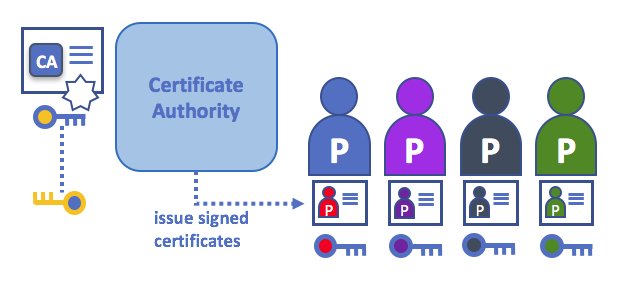

# アイデンティティ

## アイデンティティとは？

ブロックチェーンネットワークには、peer、orderer、クライアントアプリケーション、管理者などさまざまなアクターが含まれます。
これらの各アクター(サービスを消費できるネットワークの内部または外部のアクティブな要素)は、X.509デジタル証明書にカプセル化されたデジタルアイデンティティを持っています。
これらのアイデンティティは、**ブロックチェーン・ネットワーク内のアクターが持つリソースや情報への正確なアクセス権を決定するため**、非常に重要です。

さらにデジタルアイデンティティには、Fabricがアクセス権を決定するために使用するいくつかの追加属性があり、アイデンティティとそれに関連付けられた属性の組み合わせに特別な名前(**プリンシパル**)が与えられています。
プリンシパルはユーザーIDやグループIDに似ていますが、アクターの組織、組織単位、ロール、さらにはアクター固有のアイデンティティなど、アクターのアイデンティティのさまざまなプロパティを含めることができるため、少し柔軟です。
このドキュメントでは、プリンシパルとは、アクセス権を決定するプロパティのことを指します。

アイデンティティを**検証可能**にするには、**信頼できる**機関から取得する必要があります。
[メンバーシップ・サービス・プロバイダ](../membership/membership.html)(MSP)は、Fabricにおける信頼できる機関です。
より具体的には、MSPは、組織の有効なアイデンティティを管理する規則を定義するコンポーネントです。
FabricのデフォルトのMSP実装では、アイデンティティとしてX.509証明書を使用し、従来の公開鍵基盤(PKI)階層モデルを採用しています(PKIの詳細については後述します)。

## アイデンティティの使用を説明する簡単なシナリオ

スーパーマーケットに買い物に行ったとします。
レジのところに、ビザ、マスターカード、アメックスカードしか使えないと書いてあります。
別のカード(「ImagineCard」と呼びましょう)で支払いをしようとする場合、カードが本物で、あなたの口座に十分な資金があるかどうかは、関係がありません。
そのカード会社が受け付けられないのです。

*有効なクレジットカードを持っているだけでは十分ではなく、店舗にも受け入れてもらわないといけません！
PKIとMSPは同じように連携します。
つまり、PKIはアイデンティティのリストを提供し、MSPはこの中のどのアイデンティティがネットワークに参加する特定の組織のメンバーであるか指定します。*

PKI認証局とMSPは、同様の機能の組み合わせを提供します。
PKIはカードプロバイダーのようなもので、さまざまな種類の検証可能なアイデンティティを提供します。
一方、MSPは、店舗が受け入れるカード・プロバイダーのリストのようなものであり、どのアイデンティティが店舗支払いネットワークの信頼できるメンバー(アクター)であるかを決定する仕組みに相当します。
**MSPは、検証可能なアイデンティティをブロックチェーンネットワークのメンバーに変換します**。

これらの概念をもう少し詳しく見ていきましょう。

## PKIとは？

**公開鍵基盤(PKI)は、ネットワークで安全に通信を行うためのインターネット技術の集まりです。**
**HTTPS**の**S**を加えているのがPKIです。
そして、この文書をWebブラウザーで読んでいるのであれば、おそらくPKIを使って、それが検証された情報源からのものであることを確認していることでしょう。

*公開鍵基盤(PKI)の要素。
PKIは、関係者(例えば、サービスの利用者、サービス提供者)にデジタル証明書を発行する認証局から構成され、関係者はそれを使用して彼らの環境において交換するメッセージにおいて自分自身を認証します。
CAの証明書失効リスト(CRL)は、有効でなくなった証明書の参照を構成します。
証明書の失効は、さまざまな理由で発生する可能性があります。
例えば、証明書は、その証明書に関連付けられた暗号の秘密情報が暴露されたために失効され得ます。*

ブロックチェーンネットワークは単なる通信ネットワークではありませんが、さまざまなネットワーク参加者間の安全な通信を確保し、ブロックチェーンに投稿されたメッセージが適切に認証されることを保証するために、PKI標準に依存しています。
したがって、PKIの基本を理解し、MSPがなぜそれほど重要なのかを理解することが重要です。

PKIには、次の4つの主要な要素があります。

 * **デジタル証明書**
 * **公開鍵と秘密鍵**
 * **認証局**
 * **証明書失効リスト**

これらのPKIの基本について簡単に説明します。
詳細を知りたい場合は、[Wikipedia](https://en.wikipedia.org/wiki/Public_key_infrastructure)から始めるとよいでしょう。

## デジタル証明書

デジタル証明書は、証明書の所有者に関する一連の属性を保持する文書です。
最も一般的なタイプの証明書は、[X.509標準](https://en.wikipedia.org/wiki/X.509)に準拠したものであり、これは、その構造において、主体の識別詳細の符号化を可能にします。

たとえば、ミシガン州デトロイト市のMitchell Carsの製造部門のメアリーモリス(Mary Morris)が、`SUBJECT`属性が`C=US`、`ST=Michigan`、`L=Detroit`、`O=Mitchell Cars`、`OU=Manufacturing`、`CN=Mary Morris /UID=123456`のデジタル証明書を持っているとします。
メアリーの証明書は、彼女の政府の身分証明書に似ています、つまり、彼女についての重要な事実を証明するために彼女が使用できる彼女の情報を提供します。
X.509証明書には他にも多くの属性がありますが、ここではこれらの属性だけに注目します。

*メアリーモリスと呼ばれる主体を記述するデジタル証明書。
メアリーは証明書の`SUBJECT`であり、強調表示された`SUBJECT`のテキストは、メアリーに関する重要な事実を示します。
ご覧のように、証明書にはさらに多くの情報が保持されています。
最も重要なのは、メアリーの公開鍵がメアリーの証明書内で配布されるのに対し、メアリーの秘密署名鍵は配布されないことです。
この署名鍵は秘密にしておく必要があります。*

重要なのは、メアリーのすべての属性が、暗号技術(文字通りには「*秘密の書き込み*」)と呼ばれる数学的手法を使用して記録され、改ざんすれば証明書が無効になることです。
暗号技術によって、相手が**認証局**(CA)と呼ばれる証明書の発行元を信頼している限り、メアリーは自分の証明書を他の人に提示して自分の身元を証明できます。
認証局が特定の暗号情報(つまり、自身の**秘密署名鍵**)を安全に保持している限り、証明書を見た誰もが、メアリーに関する情報が改ざんされていないことを確認できます。
つまり、証明書が常にメアリーモリスの特定の属性を持つことを確認できるのです。
メアリーのX.509証明書は、変更不可能なデジタルアイデンティティカードと考えることができます。

## 認証、公開鍵、および秘密鍵

認証とメッセージ完全性は、安全な通信において重要な概念です。
認証においては、メッセージを交換する当事者が、そのアイデンティティが特定のメッセージを作成したことを確信できなくてはなりません。
メッセージが「完全性」を持つということは、伝送中に変更できなかったことを意味します。
たとえば、なりすましではない本物のメアリーモリスと通信していることを確認したいかもしれません。
あるいは、メアリーからメッセージが送信された場合は、伝送中に他のユーザによってメッセージが改ざんされていないことを確認したいかもしれません。

伝統的な認証メカニズムは、その名前が示すように、当事者がそのメッセージにデジタルに**署名**することを可能にする**デジタル署名技術**に依存します。
デジタル署名は、署名されたメッセージの完全性も保証します。

技術的に言えば、デジタル署名メカニズムでは、各当事者が2つの暗号的に接続された鍵を保持する必要があります。
1つは、広く利用可能にされ、認証アンカーとして機能する公開鍵で、もう1つは、メッセージに**デジタル署名**を生成するために使用される秘密鍵です。
デジタル署名されたメッセージの受信者は、添付された署名が期待される送信者の公開鍵の下で有効であることを確認することによって、受信したメッセージの発信元と完全性を検証できます。

**秘密鍵とそれに対応する公開鍵との間の固有の関係は、安全な通信を可能にする暗号マジックです**。
鍵間の固有な数学的関係は、対応する公開鍵のみが同じメッセージに対してのみマッチする署名を、秘密鍵が作成できるというようなものです。

上の例では、メアリーは自分の秘密鍵を使用してメッセージに署名します。
署名は、彼女の公開鍵を使用することで、署名されたメッセージを見た人なら誰でも検証できます。

## 認証局

これまで見てきたように、アクターまたはノードは、システムによって信頼された機関によって発行された**デジタルアイデンティティ**を介して、ブロックチェーンネットワークに参加することができます。
最も一般的なケースでは、デジタルアイデンティティ(または単に**アイデンティティ**)は、X.509標準に準拠し、認証局(CA)によって発行される、暗号学的に検証されたデジタル証明書の形式を持ちます。

CAはインターネットセキュリティプロトコルの共通のパーツであり、Symantec(元はVerisign)、GeoTrust、DigiCert、GoDaddy、Comodoなど、より一般的なCAのいくつかを聞いたことがあるでしょう。

*認証局は、異なるアクターに証明書を配布します。
これらの証明書は、CAによってデジタル署名され、アクターの公開鍵(およびオプションで、プロパティの包括的なリスト)をアクターと結びつけます。
その結果、CAを信頼する(そして、その公開鍵を知っている)場合、そのアクターの証明書上のCAの署名を検証することによって、その特定のアクターが、その証明書に含まれる公開鍵に結びついており、証明書に含まれる属性を所有することを信頼することができます。*

証明書は、アクターの秘密鍵もCAの秘密鍵も含まないので、広く配布することができます。
したがって、異なるアクターからのメッセージを認証するための信頼のアンカーとして使用できます。

CAも証明書を持っており、広く入手可能になっています。
これにより、特定のCAによって発行されたアイデンティティを受け取った側は、証明書が対応する秘密鍵の所有者(CA)によってのみ生成されえたことを確認することによって、アイデンティティを検証できます。

ブロックチェーンの設定では、ネットワークと対話したいすべてのアクターにアイデンティティが必要です。
この設定では、**1つ以上のCA**を使用して、**デジタルの観点から組織のメンバーを定義**できます。
組織のアクターが検証可能なデジタルアイデンティティを持つための基盤を提供するのは、CAです。

### ルートCA、中間CA、および信頼のチェーン

CAには、**ルートCA**と**中間CA**の2種類があります。
ルートCA(Symantec、Geotrustなど)は、数億個の証明書をインターネットユーザに**安全に配布**する必要があるため、このプロセスを*中間CA*と呼ばれるものに分散することは理にかなっています。
これらの中間CAは、ルートCAまたは別の中間CAによって発行された証明書を有し、チェーン内の任意のCAによって発行された任意の証明書のための「信頼のチェーン」の確立を可能にします。
このルートCAまで遡る能力は、セキュリティを提供しながら(証明書を消費する組織が安心して中間CAを使用できるようしながら)CAの機能をスケールできるようにするだけでなく、侵害された場合、信頼のチェーン全体が危険になるルートCAのリスクを限定します。
一方、中間CAが侵害された場合は、はるかに少ないリスクしかありません。

*信頼のチェーンは、ルートCAと一連の中間CAとの間で確立されます。
ただし、これらの各中間CAの証明書の発行元CAが、ルートCA自体であるか、ルートCAに対する信頼のチェーンを持っている必要があります。*

中間CAは、複数の組織にわたる証明書の発行に関して非常に柔軟性があり、許可型ブロックチェーン・システム(Fabricなど)で非常に役立ちます。
たとえば、異なる組織が異なるルートCAを使用する場合や、異なる中間CAを介して同じルートCAを使用する場合がありますが、実際にはネットワークのニーズによって異なります。

### Fabric CA

CAが非常に重要であるため、作成したブロックチェーンネットワークにCAを作成できるよう、Fabricは組み込みのCAコンポーネントを提供します。
このコンポーネントは、**Fabric CA**と呼ばれ、X.509証明書の形式を持つFabric参加者のデジタルアイデンティティを管理できるプライベートルートCAプロバイダーです。
Fabric CAは、FabricのルートCAのニーズを満たすためのカスタムCAであるため、本来的には、ブラウザでの一般的/自動的な使用のためのSSL証明書を提供することはできません。
ただし、**なんらかの**CAを使用してアイデンティティを管理する必要があるため(テスト環境でも)、Fabric CAを使用して証明書を提供および管理できます。
また、公開/商用のルートまたは中間CAを使用して識別情報を提供することも可能ですし、それもまた完全に適切なことです。

Fabric CAの詳細について興味があれば、[CAのドキュメントのセクション](http://hyperledger-fabric-ca.readthedocs.io/)を参照してください。

## 証明書失効リスト

証明書失効リスト(CRL)は簡単に理解できます。
CRLは、何らかの理由で失効したことをCAが認識している証明書への参照の一覧にすぎません。
店舗のシナリオを思い出してみると、CRLは盗まれたクレジットカードのリストのようなものです。

第3者が、別の主体のアイデンティティを検証したい場合、最初に、証明書が失効されていないことを確かめるために、発行元CAのCRLをチェックします。
検証者はCRLをチェックする必要はありませんが、チェックしなければ、侵害されたアイデンティティを受け入れるリスクがあります。

*証明書がまだ有効であることを確認するためのCRLの使用。
なりすました人が侵害されたデジタル証明書を検証側に渡そうとした場合、最初に発行元の認証局のCRLと照合して、その証明書が有効でないことを確認できます。*

証明書の失効は、証明書の期限切れとは大きく異なることに注意してください。
失効された証明書は、期限が切れていません。
失効されたこと以外のすべての点において、完全に有効な証明書です。
CRLの詳細については、[ここ](https://hyperledger-fabric-ca.readthedocs.io/en/latest/users-guide.html#generating-a-crl-certificate-revocation-list)をクリックしてください。

PKIが信頼のチェーンを通じて検証可能なアイデンティティを提供する方法を見てきましたが、次のステップは、これらのアイデンティティを使用してブロックチェーン・ネットワークの信頼できるメンバーを表す方法を見ていきます。
メンバーシップサービスプロバイダー(MSP)が登場し、**ブロックチェーンネットワーク内の特定の組織のメンバーである主体を識別します**。

メンバーシップの詳細については、[MSP](../membership/membership.html)のコンセプトドキュメントを参照してください。

<!---
Licensed under Creative Commons Attribution 4.0 International License https://creativecommons.org/licenses/by/4.0/
-->
