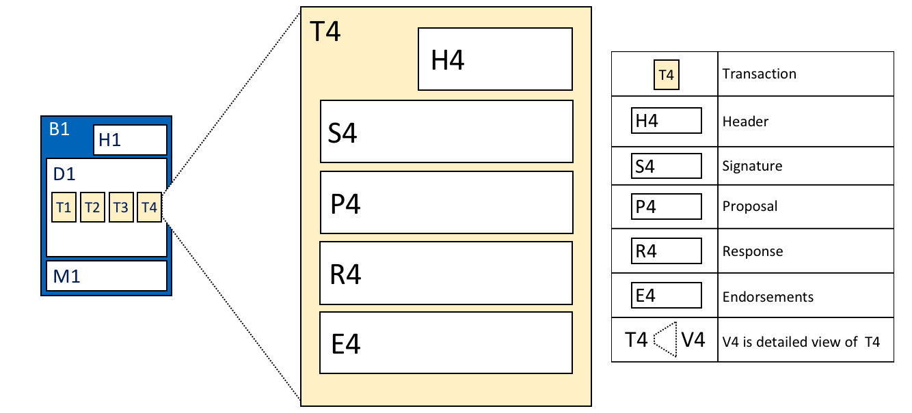
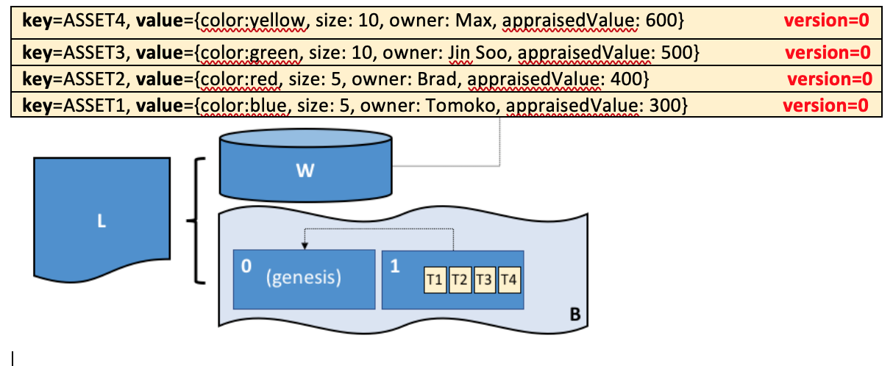

# Ledger

**対象読者**: アーキテクト、アプリケーション・スマートコントラクト開発者、管理者

**台帳**は、Hyperledger Fabricにおける重要な概念の一つです。台帳は、ビジネスデータに関する重要な事実に関する情報、
すなわち、データの属性の現在値およびその現在値に至るまでのトランザクションの履歴を格納します。

このトピックでは、次の項目について扱います。

* [台帳とは何か?](#what-is-a-ledger)
* [ビジネスデータに関する事実の格納](#ledgers-facts-and-states)
* [ブロックチェーン台帳](#the-ledger)
* [ワールドステート](#world-state)
* [ブロックチェーンのデータ構造](#blockchain)
* [ブロックチェーンのブロックの格納方法](#blocks)
* [トランザクション](#transactions)
* [ワールドステートデータベースのオプション](#world-state-database-options)
* [台帳の例 **Fabcar**](#example-ledger-fabcar)
* [台帳とネームスペース](#namespaces)
* [台帳とチャネル](#channels)

## What is a Ledger?

台帳は、取引(transaction)の記録という形で、ビジネスの現在の状況を表しています。
ヨーロッパや中国での最古の台帳はおよそ1000年前にまでさかのぼり、シュメール人は4000年も前に[石の台帳](http://www.sciencephoto.com/media/686227/view/accounting-ledger-sumerian-cuneiform)を使っていました。
しかし、今は最新の例から見ていくことにしましょう！

皆さんは、たぶん銀行口座を見ることには慣れ親しんでいるでしょう。そこで一番重要なのは、残高です。これは、今現在、どれだけ使うことができるかを表しているものです。
もし、この残高がどのように得られたかを知りたければ、預け入れと引き出しをたどっていくことができます。
これが台帳の実生活での例の一つで、ステート(銀行の残高)とそれに至る順序付けられたトランザクション(預け入れと引き出し)から成っています。
Hyperledge Fabricは、この二つの同じ関心ごとに動機付けられています。台帳のステートの現在値を示すことと、そのステートに至るトランザクションの歴史をとらえることです。

## Ledgers, Facts, and States

台帳は、実際にはビジネスデータそのものを格納するわけではなく、それらのデータに関する**事実**を格納しています。
「ビジネスデータを台帳に格納する」というときには、実際には、そのデータの現在の値に関する事実、そして、その現在のステートに至るトランザクションの履歴に関する事実を記録しているのです。
デジタル化の進む世界においては、データに関する事実というよりも、データそのものを扱っているように感じるでしょう。
デジタルデータの場合には、データそのものは外部のデータストアに格納されていることが多いでしょう。
台帳に格納されている事実によって、その格納先を識別し、データに関する重要な情報を知ることができます。

ビジネスデータの現在値に関する事実は変化するかもしれませんが、その事実の歴史は**イミュータブル**です。
追記することはできますが、過去にさかのぼって変更することはできません。
これから、ブロックチェーンを、ビジネスデータに関する事実のイミュータブルな履歴としてとらえることが、いかに単純ながら、理解するのに強力であるかを見ていくことになります。

では、Hyperledger Fabricの台帳の構造について、詳しくみていきましょう!

## The Ledger

Hyperledger Fabricでは、台帳は、別々であると同時に関連する二つの部品からなっています。
ワールドステートとブロックチェーンです。それぞれがビジネスデータに関する事実を表現しています。

まず、**ワールドステート**ですが、これは台帳のステートの**現在値**を保持するデータベースです。
ワールドステートによって、プログラムはステートの現在値に直接アクセスすることが容易になり、トランザクションのログ全体をたどって計算する必要がなくなります。
台帳のステートは、デフォルトでは、**キーと値**(キーバリュー)のペアとして表現されます。
なお、後で述べますが、Hyperledger Fabricは、この点についても柔軟に変更することができます。
ステートが新たに作成されたり更新されたり削除されることで、ワールドステートは頻繁に更新される可能性があります。

次に、**ブロックチェーン**ですが、これは、現在のワールドステートに至るすべての変化を記録するトランザクションログです。
トランザクションはブロックに集められ、ブロックはブロックチェーンに追記されます。
これにより、現在のワールドステートに至る変化の履歴を理解することができます。
ブロックチェーンのデータ構造は、ワールドステートとは大きく異なります。
これは、ブロックチェーンは一度書かれたら変更することができない、すなわち、**イミュータブル**であるからです。

 *台帳LはブロックチェーンBとワールドステートWからなっており、ブロックチェーンBによりワールドステートWが決まります。
ワールドステートWは、ブロックチェーンBから得られたものということもできます。*

Hyperledger Fabricネットワークにおいては、一つの**論理的な**台帳が存在すると考えるのがわかりやすいでしょう。
実際には、ネットワークは台帳の複数のコピーを維持しており、それらは**合意形成**と呼ばれるプロセスによって一貫性が保たれています。
**分散台帳技術**(**DLT**, Distributed Ledger Technology)という単語は、よくこのような台帳について使われています。
すなわち、論理的には単一のものではあるが、一貫性ある複数のコピーがネットワークに分散している種類のものです。

では、ワールドステートとブロックチェーンのデータ構造についてより詳細に見ていきましょう。

## World State

ワールドステートは、あるビジネスデータの属性の現在値を、ユニークな台帳のステートとして保持しています。
プログラムが通常必要とするのはデータの現在値であるため、これは有用です。
データの現在値を得るために、ブロックチェーン全体をたどるのは煩雑でしょう。
これならば、ワールドステートから直接値を取得するだけですみます。

 *台帳のワールドステートは、二つのステートを持っています。
一つは、キーがCAR1で値がAudi、もう一つはより複雑で、キーがCAR2で、値が{model:BMW, color=red, owner=Jane}です。
ステートのバージョンは、両方とも0です。*

台帳のステートは、あるビジネスデータに対するいくつかの事実を記録しています。
この例では、CAR1とCAR2という二つの車についての台帳ステートを示しており、それぞれのステートは、キーと値を持っています。
アプリケーションプログラムは、スマートコントラクトを呼び出すことができ、スマートコントラクトは、ステートを**読み**(get)、**書き**(put)、**削除する**(delete)、単純な台帳APIを使用します。
ステートの値は、単純な値(Audi)でも、複合値(type:BMW...)でもよいことに注意してください。
ワールドステートに対しては、例えば、すべての赤のBMWといった、特定の属性をもつデータを取得するクエリがよく行われます。

ワールドステートは、データベースとして実装されています。
これは、非常に理にかなったもので、データベースは、効率的な保存やステートの取得のための豊富な機能を提供しているからです。
後述しますが、Hyperledger Fabricは異なるワールドステートデータベースを使うように設定することができます。
これは、例えば、複雑なクエリというような、アプリケーションが必要とするアクセスパターンや、ステートの値の種類の違いに対応するためです。

アプリケーションは、ワールドステートに対する変更を行うトランザクションを発行し、このトランザクションが台帳のブロックチェーンに最終的にコミットされます。
Hyperledger Fabric SDKは、アプリケーションを、ここにあるような[合意形成](../txflow.html)の仕組みの詳細から隔離しており、
アプリケーションは、ただスマートコントラクトを実行し、ブロックチェーンに(それが正当であるかどうかにかかわらず)トランザクションが加わったときに通知を受け取ります。
この設計の重要なポイントは、**エンドースを行う組織**の必須とされる集合によって**署名**されたトランザクションだけが、ワールドステートを更新することになるということです。
もしトランザクションが十分なエンドーサーから署名されていなかった場合には、ワールドステートの変更は起こりません。
アプリケーションがどのように[スマートコントラクト](../smartcontract/smartcontract.html)を使うか、
どのように[アプリケーションを開発するか](../developapps/developing_applications.html)の詳細はそれぞれのトピックを参照してください。

また、ステートにはバージョン番号があり、上の図では、ステートCAR1とCAR2は、最初のバージョンの0であることに気づくかもしれません。
バージョン番号は、Hyperledger Fabricが内部的に使用するもので、ステートが変更されるたびにインクリメントされるものです。
バージョン番号は、ステートがアップデートされるたびにチェックされ、エンドースメントの時点のバージョンと一致することを確認するために使われます。
これによって、ワールドステートが予期した通りに変更されることを保証され、同時に更新されなかったことを保証しています。

最後に、台帳が最初に作られる際には、ワールドステートは空の状態です。
ワールドステートに対する正当な更新を表すトランザクションはすべてブロックチェーンに記録されているため、どの時点でも、ワールドステートはブロックチェーンから再生成することが可能です。
例えば、ピアが作られた際にワールドステートを自動的に生成するときなどに、これは非常に便利です。
さらに、もしピアが異常終了した際にも、ピアが再起動した際にワールドステートは再生成することができ、そののちトランザクションを受け入れることになります。

## Blockchain

では、ワールドステートからブロックチェーンに注意を移しましょう。
ワールドステートは、ビジネスデータの現在のステートに関する事実を保持しているのに対し、ブロックチェーンは、どのようにそのデータが現在のステートに至ったかに関する事実の履歴の記録です。
ブロックチェーンは、台帳の各ステートの直前のバージョンと、それがどのように変更されたかを記録しています。

ブロックチェーンの構造は、互いにリンクされたブロックのシーケンシャルなログで、各ブロックはトランザクションのシーケンスを含み、各トランザクションは、ワールドステートへのクエリか更新を表しています。
トランザクションを順序付ける仕組みは、正確には[別のトピック](../peers/peers.html#peers-and-orderers)で議論されていますが、
重要なのは、ブロックのシーケンス、そしてブロック内のトランザクションのシーケンスは、ブロックが**オーダリングサービス**と呼ばれるHyperledger Fabricのコンポーネントによって最初に作られたときに、確立されているということです。

各ブロックのヘッダは、ブロックのトランザクションのハッシュ値と、直前のブロックのヘッダーのハッシュ値を含んでいます。
このようにして、台帳上のすべてのトランザクションは、シーケンスとなっており、互いに暗号的にリンクしています。
このハッシュとリンクによって、台帳のデータは非常にセキュアなものとなっています、
もし、台帳を持っている一つのノードが改ざんされたとしても、他のすべてのノードに対して、それが「正しい」ブロックチェーンであると納得させることはできないでしょう。
台帳は、独立したノードからなるネットワークに分散されているためです。

データベースを使用するワールドステートと対照的に、ブロックチェーンの実装は常にファイルです。
これは、非常に限られた種類の操作に対してよく適したデータ構造なので、道理にかなったデザインチョイスです。
主な操作はブロックチェーンの最後に追記することであり、クエリは今のところ比較的頻度の高くない操作です。

ブロックチェーンの構造について、もう少し詳細に見ていきましょう。

 *ブロックチェーンBは、B0, B1, B2, B3というブロックを含んでいます。
B0はブロックチェーンの最初のブロックであり、ジェネシスブロックです。*

上の図からは、**ブロック**B2が**ブロックデータD2**をもち、D2にはT5,T6,T7というそのブロックのトランザクションが含まれていることがわかります。

より重要なのは、B2は、**ブロックヘッダー**H2をもち、そこにはD2のすべてのトランザクションと、H1の暗号的な**ハッシュ値**を含んでいることです。
このようにして、ブロックは互いに密接に、そしてイミュータブルにリンクしており、まさに**ブロックチェーン**という単語がきれいに表す通りです!

最後に、図でもわかるように、ブロックチェーンの最初のブロックは、**ジェネシスブロック**と呼ばれています。
これは台帳の開始点ですが、ユーザーのトランザクションを何も含んでいません。
代わりに、ネットワークチャネル(図示されていません)の初期状態を含むコンフィグトランザクションを含んでいます。
ジェネシスブロックの詳細については、ドキュメントのブロックチェーンネットワークと[チャネル](../channels.html)についての議論で扱います。

## Blocks

ブロックの構造について、より細かく見ていきましょう。ブロックは、3つのセクションからなります。

* **ブロックヘッダー**

  このセクションは、3つのフィールドからなり、ブロックが作成された時点で書かれます。

  * **ブロック番号**: 0(ジェネシスブロック)からはじまる整数で、ブロックチェーンに新しいブロックが追記されるたびに1ずつ増加します。

  * **現在のブロックのハッシュ**: 現在のブロックのすべてのトランザクションに対するハッシュ値です。

  * **直前のブロックのヘッダーのハッシュ**: 直前のブロックのヘッダーのハッシュ値です。

  これらのフィールドは、内部的には、ブロックデータを暗号的にハッシュ化することで得られています。
  各ブロックが隣接するブロックと密接にリンクされ、これによってイミュータブルな台帳となることを保証しています。

   *ブロックヘッダーの詳細。
  ブロックB2のヘッダーH2は、ブロック番号2、現在のブロックデータD2のハッシュ値CH2、そして、直前のブロックヘッダーH1のハッシュ値を含んでいます。*

* **ブロックデータ**

  このセクションは、順序通りに並んだトランザクションのリストを含んでいます。
  オーダリングサービスによってブロックが作成された時点で書かれます。
  トランザクションは、豊富ですが簡単な構造を持っており、このトピックで[後ほど](#Transactions)述べます。

* **ブロックメタデータ**

  このセクションは、ブロックの作成者の証明書と署名を含んでおり、ネットワークノードがブロックを検証するときに使用します。
  続いて、ブロックのコミッターは、ブロックメタデータに各トランザクションが正当であるか(valid)・正当でないか(invalid)を示したビットマップを加えます。
  また、ステートのフォークを検知するために、そのブロックまでとそのブロックによる累積のステートの更新のハッシュ値も追加します。
  ブロックデータとヘッダーのフィールドと異なり、このセクションは、ブロックのハッシュ値計算の入力には含まれません。

## Transactions

ここまで見てきたように、トランザクションはワールドステートへの更新を表すものでした。
ブロックの中で、トランザクションを含んでいる**ブロックデータ**の詳細な構造を見ていきましょう。

 *トランザクションの詳細。
ブロックB1のブロックデータD1内のトランザクションT4は、トランザクションヘッダーH4、
トランザクションの署名S4、トランザクション提案P4、トランザクション応答R4、エンドースメントのリストE4からなっています。*

上の例から、次のようなフィールドがあることがわかります。

* **ヘッダー**

  H4として図示されているこのセクションは、トランザクションに関する重要なメタデータを含んでいます。
  たとえば、関係するチェーンコードの名前とバージョンなどです。

* **署名**

  S4として図示されているこのセクションは、クライアントアプリケーションによって作成された暗号的署名を含んでいます。
  このフィールドは、生成にアプリケーションの秘密鍵が必要なため、トランザクションの詳細が改ざんされていないことを確認するために使われます。

* **提案**

  P4として図示されているこのセクションは、アプリケーションから、台帳の更新を作成するスマートコントラクトへ渡される入力パラメータをエンコードしています。
  スマートコントラクトが実行されるときには、この提案は入力値のセットを提供し、現在のワールドステートと合わせて、新しいワールドステートを決定します。

* **応答**

  R4として図示されているこのセクションは、ワールドステートの前と後の値を**読み書きセット**(RW-set)の形で含んでいます。
  これは、スマートコントラクトの出力であり、トランザクションの検証が成功したときに、台帳に適用されワールドステートが更新されます。

* **エンドースメント**

  E4として図示されているこれは、エンドースメントポリシーを満たすのに十分な、各組織からの署名付きのトランザクション応答のリストです。
  トランザクションには、トランザクション応答は一つしかないのに、エンドースメントが複数あることに気づくと思います。
  これは、各エンドースメントが各組織のトランザクション応答を実際にエンコードするものとなっているからです。
  すなわち、十分なエンドースメントと一致しないトランザクション応答を含める必要がないことを意味しています。
  そのような応答は、正当でないとして拒否され、ワールドステートの更新が行われないためです。

これでトランザクションの主要なフィールドはおわりです。
他にもフィールドはありますが、これらが、台帳のデータ構造への確かな理解を得るのに欠かせないフィールドでした。

## World State database options

ワールドステートは、台帳のステートの単純かつ効率的な保存と取得が行えるように、物理的にはデータベースとして実装されています。
ここまで見てきたように、台帳のステートは、単純な値も複合値もとることができ、これを実現するために、ワールドステートのデータベースの実装を変えることができます。
そしてこれにより、そのような値を効率的に実装することができます。
ワールドステートのデータベースのオプションには、現在、LevelDBとCouchDBがあります。

LevelDBはデフォルトで、台帳のステートが単純なキー・値のペアであるときに特に適しています。
LevelDBのデータベースは、ピアノードと同じ場所に置かれており、同じOSのプロセス内に組み込まれています。

CouchDBは、台帳のステートの構造がJSONドキュメントであるときに特に適しています。
CouchDBは、ビジネストランザクションによく存在する、リッチなクエリや、リッチなデータ型の更新をサポートしているためです。
実装の観点からいいますと、CouchDBは別のOSのプロセスとして動作しますが、ピアノードとCouchDBのインスタンスには1:1の関係が依然あります。これらはすべて、スマートコントラクトからは見えません。CouchDBについての詳細は、[CouchDB as the State Database](../couchdb_as_state_database.html)を参照してください。

LevelDBとCouchDBからは、Hyperledger Fabricの重要な側面を見ることができます。すなわち、*プラグ可能である*ことです。
ワールドステートデータベースは、リレーショナルなデータストアや、グラフストア、あるいは一時的なデータベースであってもかまいません。
これによって、効率的にアクセスできる台帳のステートの種類に大きな柔軟性をもたらし、Hyperledger Fabricが多くの異なる種類の問題に対応することができます。

## Example Ledger: fabcar

このトピックの終わりにあたって、とあるサンプルの台帳を見てみましょう。
もし、[fabcar サンプルアプリケーション](../write_first_app.html)を実行したことがあるならば、この台帳を作ったことがあることになります。

fabcarのサンプルアプリケーションは、それぞれ異なる識別子、色、メーカー、モデル、所有者をもつ10台の車を作成します。
これが、最初の4つの車が作られた後に台帳がどうなっているかです。

 *台帳Lは、ワールドステートWとブロックチェーンBから構成されています。
Wは、CAR0、CAR1、CAR2、CAR3というキーの4つのステートを含んでいます。
Bは、0と1という2つのブロックを含んでおり、ブロック1は、T1、T2、T3、T4という4つのトランザクションを含んでいます。*

ワールドステートには、CAR0、CAR1、CAR2、CAR3に対応するステートが存在していることがわかります。
CAR0は、青い(blue)トヨタ(Toyota)のプリウス(Prius)で、現在トモコ(Tomoko)によって所有されていることを表す値を持っており、
他の車についても似たようなステートと値を見ることができます。
さらに、すべての車のステートは、バージョンが、最初のバージョン番号を意味する0であり、これらのステートが作成されてから一度も更新されていないことがわかります。

また、ブロックチェーンが2つのブロックを含んでいることもわかります。
ブロック0はジェネシスブロックですが、車に関係するトランザクションは含んでいません。
しかし、ブロック1は、T1、T2、T3、T4というトランザクションを含んでおり、これらがワールドステートのCAR0からCAR3までの初期ステートを作成したトランザクションに対応するものです。
ブロック1がブロック0にリンクされていることがわかります。

ブロックやトランザクションの他のフィールド、具体的にはヘッダーやハッシュについては示してきませんでした。
もしこれらについて正確な詳細について興味があるときは、ドキュメントの他のそれぞれのリファレンストピックで見ることができます。
そのトピックは、ブロック全体とそのトランザクションの素晴らしい詳細について、ステップ・バイ・ステップで説明しています。
しかし、今のところは、Hyperledger Fabricの台帳についての、確かな概念的な理解を得ることができたでしょう。よくできました！

## Namespaces

台帳を、単一のワールドステート、単一のブロックチェーンであるかのように説明してきましたが、少し単純化しすぎたところがあります。
実際には、各チェーンコードは、他のチェーンコードとは切り離された自分のワールドステートをもっています。
ワールドステートは、ネームスペースの中にあり、同じチェーンコードのスマートコントラクトのみがネームスペースにアクセスできます。

ブロックチェーンはネームスペースに分かれていません。多くの異なるスマートコントラクトのネームスペースからのトランザクションを含んでいます。
チェーンコードのネームスペースについては、この[トピック](../developapps/chaincodenamespace.html)を参照してください。

では、ネームスペースの概念が、Hyperledger Fabricのチャネルの中でどのように適用されているかを見てみましょう。

## Channels

Hyperledger Fabricでは、各[チャネル](../channels.html)は、完全に分かれた台帳を持っています。
これはすなわち、完全に分かれたブロックチェーン、ネームスペースも含めて完全に分かれたワールドステートを意味します。
アプリケーションやスマートコントラクトが、チャネル間で台帳の情報にアクセスするために、チャネル間で通信することは可能です。

チャネルと台帳がどう動くかについては、この[トピック](../developapps/chaincodenamespace.html#channels)を参照してください。

## More information

トランザクションフロー、同時実行制御、ワールドステートデータベースのより詳細については、
[Transaction Flow](../txflow.html)、[Read-Write set semantics](../readwrite.html)、[CouchDB as the StateDatabase](../couchdb_as_state_database.html)のトピックをそれぞれ参照してください。

<!--- Licensed under Creative Commons Attribution 4.0 International License
https://creativecommons.org/licenses/by/4.0/ -->
