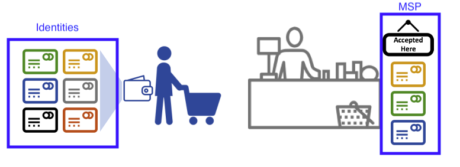

# Membership Service Provider (MSP)

## Why do I need an MSP?

Fabricは許可型ネットワークなので、ブロックチェーン参加者がネットワーク上で取引を行うには、ネットワークの他の参加者に自分のアイデンティティを証明する方法が必要です。[Identity](../identity/identity.html)のドキュメントを読んでいたら、
Public Key Infrastructure (PKI)が、信頼のチェーンを通じて検証可能なアイデンティティを提供することをご存知でしょう。ブロックチェーンネットワークでは、この信頼のチェーンがどのように利用されるのでしょうか?

認証局(CA)は、公開鍵と秘密鍵のキーペアを生成することでアイデンティティを発行し、アイデンティティを証明するために使用できます。秘密鍵は決して公に共有できないため、その証明を可能にするメカニズムが必要であり、ここでMSPの出番です。例えば、あるピアはその秘密鍵を使用して、トランザクションに電子署名(エンドース)します。オーダリングサービスのMSPはピアの公開鍵を含み、この鍵はトランザクションに付けられた署名が有効であることを検証するために使用されます。秘密鍵は、MSP上の対応する公開鍵のみに対して、トランザクションへの署名を生成するために使用されます。したがって、MSPは、メンバーの秘密鍵を明かさずに、ネットワークの他の部分に対してアイデンティティを信頼・認識させることを可能にするメカニズムです。

アイデンティティのトピックにあるクレジットカードのシナリオを思い出してください。認証局(CA)はカード・プロバイダーのようなもので、さまざまな種類の検証可能なアイデンティティを提供します。一方、MSPはどのクレジットカード・プロバイダーが店舗で利用可能かどうかを決定します。このように、MSPはアイデンティティ(クレジットカード)をロール(店で物を買う能力)に変えます。

検証可能なアイデンティティをロールに変換するこの機能は、Fabricネットワークの機能にとって基本的なものです。なぜなら、その機能によって、組織、ノード、および、チャネルは、MSPを確立して、誰が、組織、ノード、および、チャネル・レベルに対して何をできるかを決定できるようになります。



*アイデンティティは、支払能力を証明するために使用されるクレジットカードに似ています。MSPは、利用可能なクレジットカードのリストに似ています。*

ブロックチェーンネットワークを運用する銀行のコンソーシアムを考えてみましょう。各銀行はピアとオーダリングノードを運用し、ピアはネットワークに送信されたトランザクションをエンドースします。しかし、各銀行は部門と口座保有者も持っています。口座保有者は各組織に所属しますが、ネットワーク上のノードを実行しません。モバイルやWebアプリケーションからシステムとのやりとりを行うだけです。では、ネットワークはどのようにしてこれらのアイデンティティを認識し、区別するのでしょうか?アイデンティティの作成にはCAが使用されますが、カードの例と同様に、これらのアイデンティティは単に発行されるだけでなく、ネットワークに認識される必要があります。MSPは、ネットワークのメンバーから信頼される組織を定義するために使用されます。また、MSPはネットワーク内でメンバーに一連のロールと権限を提供するメカニズムです。これらの組織を定義するMSPは、ネットワークのメンバーに知られているので、アクションを実行しようとするネットワーク・エンティティが許可されていることを検証するために使用できます。

最後に、 _既存の_ ネットワークに参加したい場合は、アイデンティティをネットワークによって認識されるものに変える方法が必要であると考えてください。MSPは、許可型ブロックチェーンネットワークにメンバーが参加できるようにするメカニズムです。Fabricネットワークで取引するには、メンバーは次のことを行う必要があります。

1. ネットワークに信頼されたCAによって発行されたアイデンティティを持っています。
2. ネットワークのメンバーに認識・承認された _組織_ のメンバーになります。MSPはアイデンティティを組織のメンバーシップにリンクする方法です。そのメンバーの公開鍵(証明書、署名証明書としても知られる)を組織のMSPに追加すると、メンバーシップを得られます。
3. MSPをネットワークの [consortium](../glossary.html#consortium) コンソーシアム、または、チャネルのどちらかに追加します。
4. MSPがネットワークの [policy](../policies/policies.html) 定義に含まれていることを確認します。

## What is an MSP?

その名前にもかかわらず、メンバーシップサービスプロバイダ(MSP)は、実際には何も提供しません。むしろ、MSPの実装は、ネットワーク設定に追加されるフォルダのセットであり、内向き(組織はその管理者を決定する)と外向き(エンティティが何かを行う権限を持っていることを他の組織が検証できるようにする)の両方で、組織を定義するために使用されます。 認証局(CA)がアイデンティティを表す証明書を生成するのに対して、MSPは許可されたアイデンティティのリストを含みます。

MSP は、信頼ドメインのメンバーを定義するために、どのルートCAと中間CAが受け入れられているかを識別します。メンバーのアイデンティティを一覧化、または、どのCAがメンバーに有効なアイデンティティを発行することを許可されているかを確認します。

しかし、MSPの能力は、誰がネットワークの参加者またはチャネルのメンバーであるかを一覧化するだけに留まりません。ノードまたはチャネル上でアクターが持つ特定の権限を識別することで、アイデンティティを **ロール** に変えるのがMSPです。ユーザーがFabric CAに登録されるとき、admin、peer、client、orderer、または、memberのロールがユーザに関連付けられるように注意してください。例えば、"peer"のロールで登録されたアイデンティティは、当然ながらピアに与えられるべきものです。同様に、"admin"のロールで登録されたアイデンティティは、組織の管理者に与えられるべきものです。これらのロールの意味については、このトピックの後半でさらに掘り下げていきます。

さらに、MSPは失効したアイデンティティのリストを識別できます。[Identity](../identity/identity.html)のドキュメントで説明していますが、このプロセスがMSPにどう適用されるかを説明します。

## MSP domains

MSPはブロックチェーンネットワーク内で2つのドメインに存在します。:

* アクターのノード上でローカルに (**ローカルMSP**)
* チャネル設定に (**チャネルMSP**)

ローカルMSPとチャネルMSPの主な違いは、その機能(どちらもアイデンティティをロールに変換する)ではなく、その **範囲** にあります。各MSPは、特定の管理レベルにあるロールと権限をリストアップします。

### Local MSPs

**ローカルMSPは、クライアントとノード(ピアとOrderer)に対して定義されます。**
ローカルMSPはノードの権限を定義します(例えば、誰がピア管理者としてノードを運用できるのか)。クライアント(先述した銀行のシナリオでは口座保有者)のローカルMSPは、ユーザが自分自身を認証できるようにします。トランザクション(例えば、チェーンコードのトランザクション)では、チャネルのメンバーとして認証します。また、例えばコンフィギュレーショントランザクションでは、組織の管理者などシステムに対する特定のロールがある所有者として認証します。

**すべてのノードはローカルMSPを定義する必要があります。** これは、そのレベルで誰が管理者または参加者の権利を持つかを定義します(ピア管理者は必ずしもチャネル管理者ではありません。その逆もまた然りです)。これにより、チャネルのコンテキスト外でメンバーのメッセージを認証したり、特定のノードに対する権限を定義したりできます(例えば、誰がピアにチェーンコードをインストールする権限を持っているか)。1つの組織が、1つまたは複数のノードを所有できることに注意してください。MSPは、組織の管理者を定義します。そして、組織、組織の管理者、ノードの管理者、ノードは、すべて同じ信頼のルートを持っている必要があります。

OrdererのローカルMSPもノードのファイルシステム上に定義され、そのノードにのみ適用されます。ピアノードと同様に、Ordererも単一の組織に所有されるため、信頼するアクターやノードを一覧化した1つのMSPを持ちます。

### Channel MSPs

これに対して、 **チャネルMSPはチャネルレベルで管理者と参加者の権利を定義します。** アプリケーションチャネル上のピアとオーダリングノードは、チャネルのMSPについて同じビューを共有して、チャネル参加者を正しく認証できるようになります。これは、ある組織がチャネルに参加したい場合、その組織のメンバーの信頼チェーンを含んでいるMSPをチャネル設定に入れる必要があることを意味します。そうでなければ、この組織のアイデンティティを起点とするトランザクションは拒否されます。ローカルMSPがファイルシステム上のフォルダ構造として表現されるのに対し、チャネルMSPはチャネル設定に記述されます。


*2つの組織のMSPを含むチャネル config.json のスニペット*

**チャネルMSPは、チャネルレベルで誰が権限を持っているかを確認します。**
チャネルMSPは、チャネルメンバーのアイデンティティ(それ自体がMSP)とチャネルレベルのポリシーの施行との間の _関係_ を定義します。チャネルMSPはチャンネルメンバーの組織のMSPを含みます。

**チャネルに参加している全ての組織は自分自身を定義したMSPを持つ必要があります。** 実際、組織とMSPを一対一で対応させることが推奨されています。MSPは、どのメンバーが組織を代表して行動する権限を与えられているかを定義します。MSPには、MSP自体と、チャネルへの新規メンバーの追加のように、組織がロールを持つ管理タスクを承認する設定が含まれます。すべてのネットワークメンバーが１つの組織またはMSPに属していた場合、データプライバシーは犠牲になります。複数の組織では、台帳データをチャネルメンバーだけに分離することで、プライバシーを確保しています。組織内でより詳細な粒度が必要な場合、組織をさらに組織単位(OU)に分割することができます。

**システムチャネルMSPはオーダリングサービスに参加する全組織のMSPを含みます。** オーダリングサービスは複数組織のオーダリングノードを含む可能性が高く、これらの組織が共同でオーダリングサービスを実行します。最も重要なことは、組織のコンソーシアムとアプリケーションチャネルに継承されるデフォルトポリシーの管理です。

**ローカルMSPはノードまたはユーザのファイルシステム上のみで定義されます。** したがって、物理的にも論理的にも、ローカルMSPはノードごとに1つだけあります。
しかしながら、チャネルMSPはチャネル内の全ノードが利用できるため、論理的にはチャネル設定で一度定義されることになります。 **チャネルMSPはチャネルの各ノードのファイルシステム上でもインスタンス化され、合意形成によって同期が保たれます。** したがって、各ノードのローカルファイルシステム上に各チャネルMSPのコピーが存在しますが、論理的にはチャネルMSPはチャネルまたはネットワーク上に存在し、維持されます。

次の図は、ローカルMSPとチャネルMSPがネットワーク上で共存している様子を示します。:


*ピアとOrdererのMSPはローカルであるのに対して、チャネル(システムチャネルとも呼ばれるネットワーク設定チャネルを含む)のMSPはグローバルで、そのチャネルのすべての参加者に共有されます。この図では、ネットワークシステムチャネルはORG1に管理されていますが、別のアプリケーションチャネルはORG1とORG2が管理することができます。ピアはORG2のメンバーでORG2に管理されるのに対し、図中のOrdererはORG1が管理します。ORG1はRCA1からのアイデンティティを信頼するのに対して、ORG2はRCA2からのアイデンティティを信頼します。これらのコンポーネントを誰が管理できるかを反映した、管理者アイデンティティであることが重要です。つまり、ORG1がネットワークを管理するのに対して、ORG2.MSPはネットワーク定義の中に存在します。*

## What role does an organization play in an MSP?

**組織**は、論理的に管理されたメンバーの集団です。これは多国籍企業のような大きなものから、花屋のような小さなものまであります。組織(または **orgs**)で最も重要なのは、1つのMSP配下にいるメンバーを管理することです。MSPでは、アイデンティティを組織にリンクさせることができます。これは、前述したX.509証明書で定義されている組織の概念とは異なることに注意してください。

組織とMSPは排他的な関係にあるため、組織にちなんでMSPの名前をつけると直感的です。これは、ほとんどのポリシー設定で採用されている慣習です。例えば、組織 `ORG1` は `ORG1-MSP` のようなMSPを持ちます。いくつかのケースでは、1つの組織に複数のメンバーシップ・グループが必要な場合があります。例えば、組織間で大きく異なるビジネス機能を実行するために、複数のチャネルが使用される場合です。このようなケースでは、複数のMSPを持ち、それが分かるように名前をつけます。例えば、 `ORG2-MSP-NATIONAL` と `ORG2-MSP-GOVERNMENT` は、 `ORG2` に `NATIONAL` 営業チャネルと `GOVERNMENT` 規制チャネルという信頼ルートの異なるメンバーシップが存在していることを反映しています。

### Organizational Units (OUs) and MSPs

組織は複数の **組織単位(OU)** に分けることができます。それぞれの組織単位(OU)は一定の責任を持っており、 `affiliations` とも呼ばれます。OUは組織内の部署だと考えてください。例えば、 `ORG1` という組織は、 `ORG1.MANUFACTURING` と `ORG1.DISTRIBUTION` の両方のOUを持ち、別々の業務部門を反映しているかもしれません。CAがX.509証明書を発行する時、証明書の `OU` フィールドには、アイデンティティが所属する業務部門を指定します。このようなOUを使用する利点は、これらの値をポリシー定義で使用してアクセスを制限したり、スマートコントラクトで属性ベースのアクセス制御を行うことです。そうでない場合は、組織ごとにMSPを作成する必要があります。

OU の指定は任意です。OU を使用しない場合、MSPに含まれる全てのアイデンティティは、その組織のメンバーであるとみなされます。MSPは、ルートCAおよび中間CAのフォルダによって識別されます。

### Node OU Roles and MSPs

さらに、アイデンティティにロールを付与するために使用できる、 `Node OU` と呼ばれる特別な種類の OU があります。これらのNode OU ロールは `$FABRIC_CFG_PATH/msp/config.yaml` ファイルで定義され、組織単位のリストを含みます。その組織単位のメンバーは、MSPで表現される組織にいると見なされます。これが特に便利になのは、組織のメンバーを、特定のNode OU ロールを付与されたアイデンティティ(CAに指定されたMSPに署名されたもの)を持つメンバーに制限したい場合です。例えば、Node OU を使用すると、Org1 の任意のメンバーではなく、Org1 のピアにトランザクションのエンドースを要求するような、よりきめ細かいエンドースメントポリシーを実装できます。

Node OUのロールを使用するには、ネットワークで "identity classification" 機能を有効にする必要があります。フォルダベースのMSP構造を使用する場合、MSPフォルダのルートに存在するconfig.yamlファイルで "Node OUs" を有効にすることで実現できます。:

```
NodeOUs:
  Enable: true
  ClientOUIdentifier:
    Certificate: cacerts/ca.sampleorg-cert.pem
    OrganizationalUnitIdentifier: client
  PeerOUIdentifier:
    Certificate: cacerts/ca.sampleorg-cert.pem
    OrganizationalUnitIdentifier: peer
  AdminOUIdentifier:
    Certificate: cacerts/ca.sampleorg-cert.pem
    OrganizationalUnitIdentifier: admin
  OrdererOUIdentifier:
    Certificate: cacerts/ca.sampleorg-cert.pem
    OrganizationalUnitIdentifier: orderer
```

上記の例では、MSPに対する Node OU `ROLES` は、4つ存在します。:

   * client
   * peer
   * admin
   * orderer

この規則により、X509証明書のCommonName属性に存在するOUによって、MSPのロールを区別することができます。上記の例では、cacerts/ca.sampleorg-cert.pemに発行された証明書は、OU=clientはクライアントとして、OU=peerはピアとして識別されます。Fabric v1.4.3からは、ordererとadminsのOUもあります。新しいadminsのロールは、MSPディレクトリのadmincertsフォルダに明示的に証明書を配置する必要がなくなったことを意味します。ユーザーのsigncertに存在する `admin` ロールが、そのアイデンティティをadminユーザーであると認定します。

これらの Role および OU 属性は、Fabric CA または SDK を使用して CA にユーザーを `register` するときに アイデンティティに割り当てられます。ユーザーの `/msp` フォルダに証明書を生成するのは、その後の `enroll` ユーザーコマンドです。


ROLE および OU属性は、 `/signcerts` フォルダにあるX.509署名証明書の中で見ることができます。 `ROLE` 属性は `hf.Type` として識別され、組織内でのアクターのロールを指します(例えば、アクターが `peer` であることを指定します)。以下の署名証明書のスニペットは、証明書でRoleとOUがどのように表現されているかを示しています。


**注:** チャネルMSPの場合、アクターが管理者のロールを持つからといって、特定のリソースを管理できるわけではありません。与えられたアイデンティティがシステムの管理に関して持つ実際の権限は、システム・リソースを管理する「ポリシー」によって決定されます。例えば、チャネルポリシーは、 `ORG1-MANUFACTURING` 管理者(ロールが `admin` で Node OUが `ORG1-MANUFACTURING` のアイデンティティ)はチャネルに新組織を追加する権利を持つのに対して、 `ORG1-DISTRIBUTION` 管理者はその権利が無いことを指定することがあります。

最後に、OUは、コンソーシアム内の異なる組織が、互いを区別するために使用することができます。しかし、その場合、異なる組織は、同じルートCAと中間CAを信頼チェーンに使用し、各組織のメンバーを識別するOUフィールドを割り当てなければなりません。すべての組織が同じCAや信頼チェーンを持つ場合、システムは望ましいよりも中央集権的になるため、ブロックチェーンネットワークでは慎重に検討する必要があります。

## MSP Structure

ここまで説明した機能を表すMSPの要素を見てみましょう。

ローカルMSPフォルダは以下のサブフォルダを含みます。:


*上記の図は、ファイルシステムのローカルMSPにあるサブフォルダを示します。*

* **config.yaml:**  "Node OUs"を有効にして、受け入れられるロールを定義することで、Fabricの identity classification 機能を設定するために使用します。

* **cacerts:** このフォルダには、このMSPで表現される組織が信頼するルートCAの自己署名X.509証明書のリストが格納されます。このMSPフォルダには、少なくとも1つのルートCA証明書が必要です。

  これは最も重要なフォルダです。他のすべての証明書は、このフォルダで指定されたCAから派生する必要があります。対応する組織のメンバーであると見なされると、信頼チェーンを形成します。

* **intermediatecerts:** このフォルダには、この組織が信頼する中間CAのX.509証明書のリストが格納されます。各証明書は、MSPのルートCAのいずれか、または、CAのチェーンが信頼できるルートCAに最終的につながる中間CAによって署名される必要があります。

  中間CAは、組織の異なる下位区分(例えば `ORG1` に対する `ORG1-MANUFACTURING` および `ORG1-DISTRIBUTION`)、または、組織そのもの(商用CAが組織のアイデンティティ管理に利用される場合)を表すことができます。
  後者の場合、中間CAを使用して、組織の下位部門を表現することができます。
  MSPの設定に関するベストプラクティスについては、[Here](../msp.html)を参照してください。
  中間CAを持たないネットワークを構築することもできて、その場合、このフォルダは空になることに注意してください。

  RootCAフォルダと同様に、このフォルダは、組織のメンバーに対して証明書を発行する必要があるCAを定義します。

* **admincerts (Fabric v1.4.3以降では非推奨):** このフォルダは、この組織の管理者のロールを持つアクターを定義するアイデンティティのリストを含みます。一般に、このリストには1つ以上のX.509証明書が含まれます。

  **注:** Fabric v1.4.3以前では、管理者はピアのローカルMSPディレクトリの `admincerts` フォルダに明示的に証明書を置くことで定義されていました。 **Fabric v1.4.3以降では、このフォルダの証明書は不要になりました。** その代わり、ユーザーをCAに登録する時、 `admin` ロールを使用してノード管理者を指定することが推奨されます。そのアイデンティティはsigncertのNode OU ロールによって `admin` として認識されます。注意点として、管理者ロールを活用するためには、上記のconfig.yamlで "Node OUs" を `Enable: true` に設定し、"identity classification" 機能を有効化する必要があります。これについては、後ほど詳しく説明します。

  また、チャネルMSPの注意点として、アクターが管理者のロールを持つからといって、特定のリソースを管理できるわけではありません。与えられたアイデンティティがシステムの管理に関して持つ実際の権限は、システム・リソースを管理する_policies_によって決定されます。例えば、チャネルポリシーでは、 `ORG1-MANUFACTURING` 管理者にはチャネルに新しい組織を追加する権利があるが、 `ORG1-DISTRIBUTION` 管理者にはそのような権利がない、と指定することができます。

* **keystore: (private Key)** このフォルダは、ピアノードまたはオーダリングノードのローカルMSP(またはクライアントのローカルMSP)に対して定義され、ノードの秘密鍵を含んでいます。この鍵はデータへの署名に使用されます。例えば、エンドースメントフェーズの一部として、トランザクション提案応答に署名するために使用されます。

  このフォルダはローカルMSPに必須で、必ず1つの秘密鍵を含む必要があります。当然ながら、このフォルダへのアクセスは、ピアで管理責任を負うユーザーのアイデンティティのみに制限する必要があります。

  **チャネルMSP** の設定には、このフォルダは含まれません。チャネルMSPは、署名機能ではなく、アイデンティティ検証機能を提供することのみを目的としているためです。

  **注:** 鍵管理に[Hardware Security Module(HSM)](../hsm.html)を使用している場合、秘密鍵はHSMによって生成・保存されるため、このフォルダは空です。

* **signcert:**  ピアノードまたはオーダリングノード(またはクライアントのローカルMSP)の場合、このフォルダにはCAが発行したノードの証明書が含まれます。その証明書はノードのアイデンティティを表し、この証明書に対応する **秘密鍵** を使用して署名を生成すると、この証明書のコピーを持つ誰もが署名を検証できます。

  このフォルダはローカルMSPに必須で、必ず1つの **公開鍵** を含む必要があります。当然ながら、このフォルダへのアクセスは、ピアで管理責任を負うユーザーのアイデンティティのみに制限する必要があります。

  **チャネルMSP** の設定には、このフォルダは含まれません。チャネルMSPは、署名機能ではなく、アイデンティティ検証機能を提供することのみを目的としているためです。

* **tlscacerts:** このフォルダには、**TLSを使用したノード間の安全な通信のために**、この組織が信頼するルートCAの自己署名X.509証明書のリストが含まれています。TLS通信の例は、ピアが台帳の更新を受け取るためにOrdererに接続する場合です。

  MSPのTLS情報は、ネットワークを利用するアプリケーションや管理者ではなく、ネットワーク内部のノード(ピアやOrderer)に関係します。

  このフォルダには、少なくとも1つのTLSルートCAが必要です。TLSに関する詳細は、 [Securing Communication with Transport Layer Security (TLS)](../enable_tls.html) を参照してください。

* **tlsintermediatecacerts:** このフォルダには、**TLSを使用したノード間の安全な通信のために**、このMSPで表現された組織が信頼する中間CA証明書のリストが含まれています。このフォルダは、組織のTLS証明書に商用CA が使用されている場合に特に有用です。メンバーシップの中間CAと同様に、中間TLS CAの指定は任意です。

* **operationscerts:** このフォルダには、communicate with the [Fabric Operations Service](../operations_service.html) APIと通信するために必要な証明書が含まれています。

チャネルMSPは、以下のような追加フォルダを含んでいます。:

* **Revoked Certificates:** アクターのアイデンティティが取り消された場合、アイデンティティ自体ではなく、アイデンティティに関する識別情報がこのフォルダに格納されます。X.509ベースのアイデンティティの場合、これらの識別子は、サブジェクト鍵識別子(SKI)および認証局鍵識別子(AKI)として知られる文字列のペアであり、証明書が使用されているときは常に、証明書が失効していないことが確認されます。

  このリストは、概念的にはCAの証明書失効リスト(CRL)と同じですが、組織のメンバーシップの失効にも関係します。チャネルMSPの管理者は、CAの更新されたCRLを知らせることで、アクターやノードを組織から迅速に失効させることができます。この"リストのリスト"はオプションです。証明書が失効した場合にのみ、使われます。

このドキュメントと[Identity](../identity/identity.html)のドキュメントを読むと、Hyperledger FabricでアイデンティティとMSPがどのように機能するのか、かなり把握できたと思います。
PKIとMSPが、ブロックチェーンネットワークで協働するアクターを識別するためにどのように使用されるか理解したことでしょう。
証明書、公開鍵/秘密鍵、信頼のルートがどのように機能するか、さらにMSPが物理的、論理的にどのように構成されているかを学んだはずです。

<!---
Licensed under Creative Commons Attribution 4.0 International License https://creativecommons.org/licenses/by/4.0/
-->
