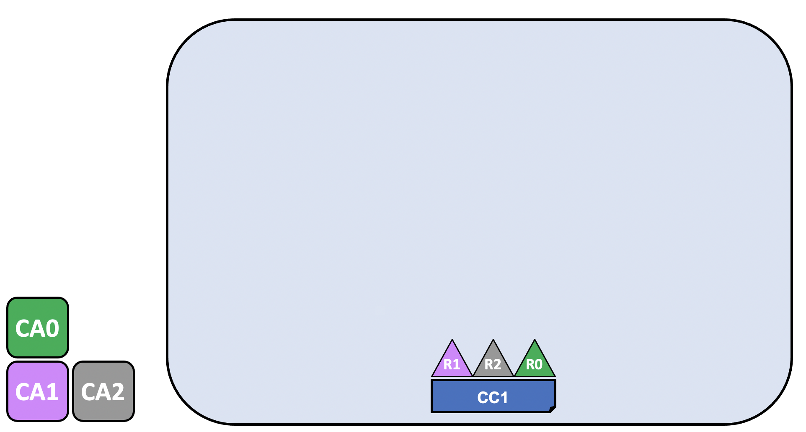
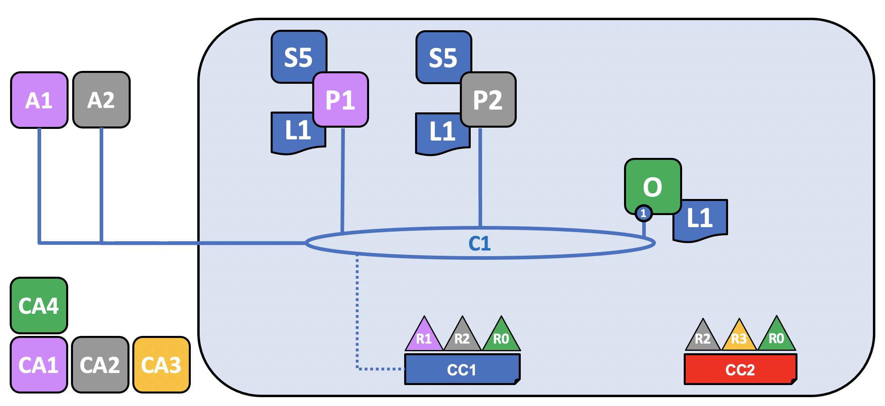

# Blockchain network

このトピックでは Hyperledger Fabric がブロックチェーンネットワークの構造の中で、
どのように組織間のコラボレーションを可能にしているかを**概念レベルで**説明します。
もしあなたがアーキテクト、管理者あるいは開発者であるならば、このトピックを用いて
Hyperledger Fabric のブロックチェーンネットワークの主要な構造やプロセスコンポーネント
について確かな理解を得られるでしょう。
このトピックでは、ブロックチェーンネットワークの主要なコンポーネントを全て取り入れ、扱いやすく加工された例を用います。

このトピックを呼んでポリシーの概念を理解したあとは、デプロイされた Hyperledger Fabric ネットワークを制御するポリシーを確立するために組織間の決定について確かな理解が得られるでしょう。
また、Hyperledger Fabric の鍵となる機能である宣言的なポリシーを用いて、組織がどのようにネットワークの発展を管理しているかを理解するでしょう。
一言で言えば、Hyperledger Fabric の主要な技術的なコンポーネントと、それらについて組織が行う必要がある意思決定について理解できるでしょう。

## What is a blockchain network?

ブロックチェーンネットワークは、アプリケーションに台帳サービスとスマートコントラクト (チェーンコード) サービスを提供する技術基盤です。
第一に、スマートコントラクトはトランザクションを生成するために用いられ、
トランザクションはネットワーク内の各ピアノードに順次配布されます。
各ピアノード内で、トランザクションは台帳のコピー上にイミュータブルなものとして記録されます。
アプリケーションのユーザはクライアントアプリケーションを使用するエンドユーザか、あるいはブロックチェーンネットワークの管理者であるかもしれません。

大半のケースでは、複数の[組織](../glossary.html#organization)が[コンソーシアム](../glossary.html#consortium)として集まり、ネットワークを形成します。
各組織の権限は[ポリシー](../glossary.html#policy)のセットにより決定されます。
ポリシーはネットワークが最初に設定されるときに、コンソーシアムによって合意されます。
さらに、後ほど*更新ポリシー*という概念を議論する際に、
ネットワークのポリシーがコンソーシアム内の組織間の合意に従って時間とともに変更しうることが分かるでしょう。

## The sample network

はじめに、ここで何が狙いであるかを示しましょう。
以下は簡単なネットワークの**最終状態**を表す図です。

複雑に見えるかもしれませんが心配しないでください。
このトピックを読み進んでいくにつれて、ネットワークが一つ一つ構築されていくので、
組織 R1、R2、R3、そしてR4がネットワークの基盤を構築する上でどのように寄与しているか分かるでしょう。
この基盤はブロックチェーンネットワークを実装していて、
ネットワークを構成する組織間で同意されたポリシー (例えば、誰が新しい組織を追加できるか) によって管理されています。
ブロックチェーンネットワークによって提供される台帳およびスマートコントラクトサービスを、アプリケーションがどのように使用しているかは今後分かるでしょう。

*4つの組織R1、R2、R3、およびR4は、合同でHyperledger Fabricネットワークを構築して使用することを決定し、合意文書を作成しました。
R4はネットワークの開始者に指名され、最初のバージョンのネットワークを構築する権限が与えられました。
R4はこのネットワーク上でビジネストランザクションを実行する意図はありません。
R1とR2はネットワーク内でプライベートなやりとりをする必要があり、R2とR3も同様であるとします。
組織R1はチャネルC1内でビジネストランザクションを実行するクライアントアプリケーションを持っています。
組織R2はチャネルC1とC2において似たような処理を実行するクライアントアプリケーションを持っています。
組織R3はチャネルC2内で処理を実行するクライアントアプリケーションを持っています。
ピアノードP1はチャネルC1に関連付けられた台帳L1のコピーを保持しています。
ピアノードP2はチャネルC1に関連付けられた台帳L1のコピーとチャネルC2に関連付けられた台帳L2を保持しています。
ピアノードP3はチャネルC2に関連付けられた台帳L2のコピーを保持しています。
このネットワークはネットワーク設定NC4で指定されたポリシーに基づいて管理されており、組織R1とR4の管理下にあります。
チャネルC1はチャネル設定CC1で指定されたポリシーに基づいて管理されており、組織R1とR2の管理下にあります。
チャネルC2はチャネル設定CC2で指定されたポリシーに基づいて管理されており、組織R2とR3の管理下にあります。
オーダリングサービスO4は、ネットワークNのネットワーク管理点として働いていて、システムチャネルを使用します。
このオーダリングサービスは、トランザクションを順序付けて配布されるブロックを生成する目的でアプリケーションチャネルC1とC2も支えています。
4組織はそれぞれ好きな認証局を使用しています。*

## Creating the Network

ネットワークの基礎を生成するところから始めていきましょう。

*このネットワークはOrdererが開始した時点で形成されます。
このネットワークNの例において、オーダリングサービスは一つのノードO4を含んでいて、ネットワーク設定NC4に基づいて設定されています。
ネットワーク設定NC4は管理権限を組織R4に与えています。
ネットワークのレベルでは、認証局CA4が組織R4の管理者ノードおよびネットワークノードに対してアイデンティティ情報を分配しています。*

最初に**ネットワークN**を定義しているのは**オーダリングサービスO4**であることが分かります。
オーダリングサービスをネットワークの最初の管理点と考えると役立ちます。
事前に同意されているように、O4は最初に設定され、組織R4の管理者によって開始され、組織R4によってホストされています。
ネットワーク設定NC4はネットワークの管理権限の開始時点のセットを記述するポリシーを含んでいます。
最初、これはネットワークの管理権限をR4に与える、と設定されています。
これは、後で分かるように、変更可能です。しかしここではR4がネットワークの唯一のメンバーです。

### Certificate Authorities

図に認証局CA4がありますが、これは管理者ノードとネットワークノードの証明書を発行するために用いられます。
CA4はこのネットワークにおいて重要な役割を果たしています。
なぜなら、組織R4に所属するコンポーネントを同定するために使われるX.509証明書を分配しているからです。
認証局によって発行された証明書は、トランザクションに署名してある組織がトランザクションの結果をエンドースしていることを示す (これは台帳に受け入れられるための前提条件です) ためにも使われます。
認証局のこれら2つの側面について、少し詳細を調べていきましょう。

第一に、ブロックチェーンネットワークの各コンポーネントは、証明書を用いて自身が特定の組織に属していることを互いに確認しています。
これが通常ブロックチェーンネットワークを支える認証局が通常一つ以上ある理由です。
つまり、各組織はたいてい異なる認証局を使用します。
このネットワークの例では、各組織に一つずつ、4つの認証局を使用することになるでしょう。
実際、認証局は非常に重要なので、Hyperledger Fabricは内蔵のもの (*Fabric CA*と呼ばれます) を提供していて、始めてみる手助けになっています。
ただし、実運用時は各組織がそれぞれ自組織用に使用する認証局を選択することになるでしょう。

証明書からメンバー組織へのマッピングは[メンバーシップサービス・プロバイダ (MSP)](../glossary.html#membership-services)と呼ばれる構造体を通して実現されています.
ネットワーク設定NC4は名前付きのMSPを用いて、CA4によって分配された証明書のプロパティを同定しています。
NC4はポリシー内のこのMSP名を用いてR4のアクターにネットワークリソースに対する特定の権限を与えます。
そのようなポリシーの例は、ネットワークにメンバー組織を追加するR4の管理者を同定することです。
図にMSPを表示していませんが、これは単に図が散らかってしまうだろうからで、MSPは非常に重要です。

第二に、認証局によって発行された証明書が[トランザクション](../glossary.html#transaction)の生成や検証プロセスにおいて、どのように中心的役割を果たしているかを見ていきます。
特に、X.509証明書は、クライアントアプリケーションの[トランザクション提案](../glossary.html#proposal)やスマートコントラクトの[トランザクション応答](../glossary.html#response)において、
[トランザクション](../glossary.html#transaction)にデジタル署名するために使用します。
そして、台帳のコピーをホストするネットワークノードは、トランザクションを受け入れる前にトランザクションの署名が妥当であることを検証します。

ブロックチェーンネットワークの例の基本構造についておさらいしておきましょう。
ネットワークNというリソースがあり、認証局CA4によって定義されたユーザーのセットからアクセスされます。
CA4はネットワークN内のリソースに対する権限のセットを持っており、それはネットワーク設定NC4に含まれるポリシーによって記述されています。
これらは全てオーダリングサービスのノードO4が設定され、開始した時点で実際に作成されます。

## Adding Network Administrators

NC4は最初R4にのみネットワークのユーザー管理権限を与えるよう設定しました。
次のフェーズでは、組織R1のユーザにネットワークの管理権限を与えます。
ネットワークがどのように変化するか見てみましょう。

*組織R4はネットワーク設定を更新して、組織R1も管理者にします。
この時点から、R1とR4はネットワーク設定に対して同等の権限を持ちます。*

新しい組織R1が管理者として追加されているのが分かります。
R1とR4はネットワークに対して同等の権限を持ちます。
認証局CA1も追加されています。
これは組織R1のユーザーを同定するために使用されます。
この時点から、R1とR4のどちらのユーザもネットワークを管理できます。

OrdererノードO4はR4の基盤上で実行されていますが、R1はネットワークアクセスがある限り、これに対する管理権限を共有しています。
これは、R1あるいはR4がネットワーク設定NC4を更新して組織R2に対してネットワーク操作のサブセットを与えられることを意味しています。
このように、たとえR4がオーダリングサービスを実行していたとしても、R1はそれに対して完全な管理権限を持っていて、R2は新しいコンソーシアムを作成するための制限付きの権限を持っています。

最も単純な形では、オーダリングサービスはネットワーク内の一つのノードで、この例でもそのようになっています。
オーダリングサービスは通常複数ノードであり、複数の組織が複数のノードを持つよう設定されることもあります。
例えば、R4がO4を運用していて、それをO2 (組織R1内の個別のordererノード) に接続させるかもしれません。
このように、複数サイトで複数組織の管理構造にすることもあります。

[後ほどこのトピックにおいて](#the-ordering-service)、オーダリングサービスについて少し議論します。
しかし現時点では、単にオーダリングサービスは一つの管理点で、ネットワークに対するアクセス制御を様々な組織に与えるものだと考えておいてください。

## Defining a Consortium

今このネットワークはR1とR4によって管理されていますが、まだできることはとてもわずかです。
最初にすべきことは、コンソーシアムを定義することです。
これは文字通り「運命をともにするグループ」を意味していて、ブロックチェーンネットワークにおける組織のセットを適切に選択することに相当します。

コンソーシアムがどのように定義されるか見ていきましょう。

*ネットワーク管理者が2つのメンバー (組織R1とR2) を含むコンソーシアムX1を定義します。
このコンソーシアムの定義はネットワーク設定NC4内に保存され、ネットワークの発展の次のステップにおいて利用されます。
CA1とCA2はそれぞれ組織R1とR2のための認証局です。*

NC4が設定された経緯のため、R1あるいはR4のみ新しいコンソーシアムを作成できます。
この図は、R1とR2を構成組織として持つ新しいコンソーシアムX1が追加されていることを示しています。
また、R2のユーザを同定するために、CA2が追加されていることも示しています。
一つのコンソーシアムは任意の数のメンバー組織を持ちうることに注意してください。
ここでは最も単純な設定例として2つだけ示しています。

なぜコンソーシアムが重要なのでしょうか?
コンソーシアムが、互いに**取引する**必要性を共有しているネットワーク上の組織のセット (このケースではR1とR2です) を定義するものであることは分かるでしょう。
共通の目標を持つ組織をグループにまとめることは本当に合理的で、それがまさに今起きていることです。

このネットワークは単一組織から始まりましたが、今はより大きな組織のセットによって制御されています。
R1とR2とR4で制御を共有した状態でネットワークを開始することは可能ですが、このビルドアップの方がより理解しやすくなります。

それでは、次にコンソーシアムX1を用いてHyperledger Fabricのブロックチェーンにおいて、本当に重要な部分である**チャネル**を作成していきます。

## Creating a channel for a consortium

それでは、Fabricのブロックチェーンネットワークの鍵となる部分である**チャネル**を作成していきましょう。
チャネルはコンソーシアムのメンバーが互いにやりとりする主要なコミュニケーション機構です。
一つのネットワークに複数のチャネルが存在し得ますが、まずはチャネル一つから始めます。

ネットワークに最初のチャネルがどのように追加されるかを見てみましょう。

*コンソーシアム定義X1を用いて、R1とR2のためにチャネルC1が作成されました。
このチャネルはチャネル設定CC1によって管理され、ネットワーク設定とは全く別のものです。
CC1はC1に対して同等の権限を持つR1とR2によって管理されます。
R4はCC1に対していかなる権限も持っていません。*

このチャネルC1はコンソーシアムX1に対してプライベートなコミュニケーション機構を提供します。
チャネルC1がオーダリングサービスO4に接続されているのが分かりますが、他にO4に紐付けられるものは何もありません。
ネットワークの発展の次のステージでは、クライアントアプリケーションやピアノードのようなコンポーネントが接続されるでしょう。
しかし現時点では、チャネルは将来的な接続に対する**可能性** (点線で表示) を示しています。

チャネルC1はネットワークNの一部ですが、それとは明確な違いがあります。
また、組織R3とR4がこのチャネル内にないことにも注意してください。
C1はR1とR2の間のトランザクション処理のためのものです。
以前のステップで、どのようにR4がR1にコンソーシアムを作成する権限を与えたかを見ました。
R4はR1にチャネルを作成する権限**も**与えていることに言及しておくことは有益でしょう。
この図では、チャネルC1を作成したのは組織R1かR4です。
重ねて注意しますが、一つのチャネルは複数の組織が所属し得ますが、ここでは簡単のため2つだけ表示しています。

再びですが、チャネルC1がどのようにネットワーク設定NC4とは全く別の設定CC1を持っているかに注意してください。
CC1はR1とR2がチャネルC1に対する権限を管理するポリシーを含んでいます。
そしてこれまで見てきたように、R3とR4はこのチャネルにおいて何の権限も持っていません。
R3とR4は、R1あるいはR2がチャネル設定CC1を適切なポリシーを追加された場合のみ、C1とやりとりすることができます。
一つの例としては、誰がチャネルに新しい組織を追加できるかの定義です。
特に、R4はチャネルC1に対して自身を追加することはできません。
それはR1あるいはR2に許可されなければならず、許可された場合のみ可能です。

なぜチャネルがそれほど重要なのでしょうか?
チャネルはコンソーシアムのメンバー間でプライベートなやりとりをする機構と、プライベートなデータを提供するため、便利です。
チャネルは他のチャネルから、そしてネットワークからの秘匿性を提供します。
Hyperledger Fabricはこの点において強力です。なぜなら、各組織に対して基盤を共有しつつ、同時に秘匿性も維持しているためです。
ここに矛盾はありません。ネットワーク内の異なるコンソーシアムは、異なる情報と処理が適切に共有されることを必要としており、チャネルはその効率的な機構を提供しています。
チャネルは、基盤の効率的な共有を実現していて、一方でデータとコミュニケーションの秘匿性を維持しています。

また、一度チャネルが作成されると、本当の意味で「ネットワークから自由」になります。
これから先の未来において、チャネルに対して何らかの制御を持っているのは、チャネル設定において明示的に指定された組織だけです。
同様に、現時点から未来において、ネットワーク設定NC4に対するいかなる更新も、チャネル設定CC1に直接的な影響を与えないでしょう。
例えば、もしコンソーシアムの定義X1が変更されても、チャネルC1のメンバに影響を与えないでしょう。
従って、チャネルが便利なのは、チャネルを構成する組織間でプライベートなやり取りを可能にするためです。
さらに、チャネル内のデータは、他のチャネルを含むネットワークの他の部分から完全に分離されています。

余談となりますが、オーダリングサービス用に定義されている特殊な**システムチャネル**もあります。
システムチャネルは通常のチャネル (対比する理由で時々**アプリケーションチャネル**と呼ばれます) と全く同じように振る舞います。
通常このチャネルについて気にする必要はありませんが、[このトピック内で後ほど](#the-ordering-service)少しシステムチャネルについて議論します。

## Peers and Ledgers

それではチャネルを使い始めて、ブロックチェーンネットワークおよび組織のコンポーネントと一緒に接続してみましょう。
ネットワークの発展の次のステージでは、ネットワークNが2つの新しいコンポーネント、すなわちピアノードP1と台帳インスタンスL1を取得することが分かります。

*ピアノードP1がチャネルC1に参加しています。
P1は台帳L1を物理的にホストしています。
P1とO4はチャネルC1を用いて互いにやりとりできます。*

ピアノードはブロックチェーンの台帳のコピーをホストしているネットワークコンポーネントです!
ようやく目に見えるブロックチェーンコンポーネントについて考え始めています!
P1のネットワークにおける目的は純粋に台帳L1を他のコンポーネントからのアクセスのためにホストすることです。
L1はP1上に**物理的にホストされている**ものの、チャネルC1には**仮想的にホストされている**と考えることができます。
この点については、後でチャネルに他のピアを追加するときに、よりはっきり理解できるでしょう。

P1の設定の重要な部分は、C1によって発行され、P1を組織R1に関連付けているX.509アイデンティティです。
R1管理者がピアP1をチャネルC1に参加させる操作を実行したとき、そのピアはorderer O4からブロックを取得し始めます。
このordererはチャネル設定CC1を用いてこのチャネルにおけるP1の権限を判断します。
例えば、CC1内のポリシーはP1 (あるいは組織R1) がチャネルC1上でリードやライトができるかどうかを判断します。

ピアが所属組織によってどのようにチャネルに追加されているかに注意してください。
一つだけピアを追加しましたが、ネットワーク内の複数のチャネルに複数のピアノードがどのように存在しうるかが分かるでしょう。
少し後で、ピアが果たす異なる役割について見ていきます。

## Applications and Smart Contract chaincode

今、チャネルC1上に台帳があり、クライアントアプリケーションに接続して台帳の乗り物とも言えるピアによって提供されるサービスを利用することができます!

ネットワークがどのように拡大したかに注意してください。

*スマートコントラクトS5がP1上にインストールされました。
組織R1上のクライアントアプリケーションA1はS5を用いてピアノードP1経由で台帳にアクセスできます。
A1、P1、およびO4は全てC1に参加しています。
すなわち、それらは全てこのチャネルによって提供されるコミュニケーション設備を利用できます。*

ネットワークの発展の次のステップでは、クライアントアプリケーションA1がチャネルC1を用いて特定のネットワーク上のリソースに接続できることを理解していきます。
この場合、A1はピアノードP1とordererノードO4の両方に接続できます。
再びですが、ネットワークと組織のコンポーネントの間のコミュニケーションおいて、チャネルがどのように重要であるかを見てください。
ちょうどピアやordererのように、クライアントアプリケーションは組織に関連付けられたアイデンティティを持っています。
この例では、クライアントアプリケーションA1は組織R1に関連付けられています。
A1はFabricのブロックチェーンネットワークの外部のものですが、チャネルC1を介してブロックチェーンネットワークに接続しています。

A1はP1を経由して台帳L1に直接アクセスできるように見えるかもしれませんが、
実際は全てのアクセスはスマートコントラクト (チェーンコード) と呼ばれる特別なプログラムS5を介して管理されています。
S5が台帳に対する共通のアクセスパターンの全てを定義していると考えてください。
S5は、台帳L1がクエリあるいは更新される方法の明確に定義されたセットを提供します。
要するに、クライアントアプリケーションA1は台帳L1に到達するためにスマートコントラクトS5を通る必要があります!

スマートコントラクトは、コンソーシアムメンバ間で共有されるビジネスプロセスを実装するために、各組織に属するアプリケーション開発者が作成することができます。
スマートコントラクトは、ネットワーク内の各ノードに後々配布されうるトランザクションの生成を助けるために使用されます。
この点については、ネットワークがもう少し拡大したときの方が理解しやすいため、後ほど少し議論します。
今理解すべき重要な点は、スマートコントラクトを使用できるようにするためにはスマートコントラクトに対して2つの操作、すなわちピアへの**インストール**とチャネル上での**定義**、を行う必要があるということです。

Hyperledger Fabricのユーザはよく**スマートコントラクト**と**チェーンコード**という言葉を同じ意味で使用しています。
一般に、スマートコントラクトは、ワールドステートに含まれるビジネスデータのライフサイクルを制御する**トランザクションのロジック**を定義しています。
スマートコントラクトはチェーンコード内にパッケージされ、ブロックチェーンネットワークにデプロイされます。
スマートコントラクトはトランザクションを管理するもので、一方、チェーンコードはスマートコントラクトがデプロイのためにどのようにパッケージされているかを管理していると考えてください。

### Installing a chaincode package

スマートコントラクトS5が開発された後、組織R1の管理者はチェーンコードパッケージを作成して、それをピアノードP1に[インストール](../glossary.html#install)しなければなりません。
これは単純な操作で、これが済むと、P1はS5に関する情報を全て持っています。
特に、P1はS5の**実装の**ロジック (すなわち台帳L1にアクセスするために使用するプログラムコード) を見ることができます。
このことは実装を気にせずS5の入出力を記述する**インターフェース**と対照をなします。

組織が一つのチャネルにおいて複数のピアを持つ時、スマートコントラクトをインストールするピアを選択できます。
つまり、全てのピアにスマートコントラクトをインストールする必要はありません。

### Defining a chaincode

チェーンコードは個別の組織のピア上にインストールされますが、チャネルのスコープ内で管理・運用されます。
各組織は**チェーンコード定義**、つまりチャネル上でチェーンコードがどのように使われるかを決めるパラメータのセット、を承認する必要があります。
組織は、インストールされたスマートコントラクトを用いて台帳をクエリしたり、トランザクションをエンドースしたりするために、チェーンコード定義を承認しなければなりません。
この例では、ピアノードP1一つしかありませんが、R1の管理者はS5に対するチェーンコード定義を承認しなければなりません。

チェーンコード定義がチャネルにコミットされて、そのチャネルの台帳とのやりとりに使われるようになる前に、十分な数 (デフォルトでは過半数) の組織がチェーンコード定義を承認する必要があります。
例のチャネルのメンバーは一つだけなので、R1の管理者はチャネルC1にS5のチェーンコード定義をコミットできます。
その定義がコミットされると、S5はクライアントアプリケーションA1から[invoke](../glossary.html#invoke)できるようになります!

チャネル上の全てのコンポーネントはS5にアクセスできますが、プログラムロジックは見えないことに注意してください。
プログラムロジックは、それをインストールしたノード (この例ではP1) に対してプライベートなままです。
これは概念的には、チャネル上で定義・コミットされているのはスマートコントラクトの**インターフェース**であることを意味していて、インストールされたのがスマートコントラクトの**実装**であることと対照的です。
この考えの強めるものとして、スマートコントラクトのインストールはピア上で**物理的にホストされる**ことをどのように考えるかを示している一方、
チャネル上で定義されたスマートコントラクトは、チャネルによって**論理的にホストされる**ことをどう考えるかを示しています。

### Endorsement policy

チェーンコード定義に渡される情報のうち最も重要なものは、[エンドースメントポリシー](../glossary.html#endorsement-policy)です。
エンドースメントポリシーは、トランザクションが他の組織の台帳のコピーに受け入れられる前に、どの組織がそれを承認しなければならないかを記述しています。
サンプルネットワークでは、トランザクションはR1あるいはR2がエンドースした場合にのみ、台帳L1に受け入れられます。

チェーンコード定義をチャネルにコミットすると、チャネルの台帳にエンドースメントポリシーが置かれます。
これにより、そのチャネルのあらゆるメンバーによってアクセスできるようになります。
エンドースメントポリシーのより詳細については[トランザクションフローのトピック](../txflow.html)で読むことができます。

### Invoking a smart contract

ひとたびピアノードにスマートコントラクトがインストールされ、チャネル上に定義されると、クライアントアプリケーションから[invoke](../glossary.html#invoke)可能になります。
クライアントアプリケーションは、スマートコントラクトのエンドースメントポリシーによって指定された組織が所有するピアに対してトランザクション提案を送信することによってスマートコントラクトをinvokeします。
トランザクション提案はスマートコントラクトへの入力として働きます。
スマートコントラクトはトランザクション提案を用いてエンドースされたトランザクション応答を生成します。
ピアノードは、トランザクション応答をクライアントアプリケーションに返します。

完全にエンドースされたトランザクション (ネットワーク全体に配布されるのはこのトランザクションです) を作成するためにトランザクション提案とともにパッケージされるのはこれらのトランザクション応答です。
これについては後ほどより詳細を見ていきますが、さしあたりはアプリケーションがスマートコントラクトを呼び出してどのようにエンドースされたトランザクションを生成するかを理解すれば十分です。

ネットワークの発展のこのステージまでで、組織R1がネットワークに完全に参加していることが分かります。
(A1で始まる) アプリケーションは、R1によってエンドースされるであろう (それゆえにエンドースメントポリシーを満たして台帳に受け入れられるであろう) トランザクションを生成するために、スマートコントラクトS5を介して台帳L1にアクセスできます。

## Network completed

私たちの目的はコンソーシアムX1、つまり組織R1およびR2のためにチャネルを作成することだったことを思い出してください。
ネットワークの発展の次のフェーズでは、組織R2がその基盤をネットワークに追加するのを見ていきます。

ネットワークがどのように発展したか見てみましょう。

*ネットワークは組織R2の基盤を追加することを通して成長しました。
とりわけ、R2はピアノードP2を追加し、P2は台帳L1のコピーとチェーンコードS5をホストします。
R2はR1と同じチェーンコード定義を承認します。
また、P2はアプリケーションA2を保有し、チャネルC1に参加します。
A2とP2は、CA2の証明書を用いて同定されます。
これらは全て、アプリケーションA1とA2はいずれもピアノードP1あるいはP2を用いてC1上のS5をinvokeできることを意味しています。*

組織R2がピアノードP2をチャネルC1上に追加したことが分かります。
また、P2は台帳L1のコピーとスマートコントラクトS5をホストしています。
さらに、R2はチャネルC1を通してネットワークと接続できるクライアントアプリケーションA2を追加しました。
これを達成するために、組織R2の管理者はR1の管理者が実行したのと同じ方法で、ピアノードP2を作成し、チャネルC1に参加させました。
また、R2の管理者はR1と同じチェーンコード定義を承認しなければなりません。

私たちは最初の使用可能なネットワークを作成しました!
ネットワークの発展のこの段階では、組織R1とR2が互いに完全に取引できるチャネルがあります。
特に、アプリケーションA1とA2がチャネルC1上のスマートコントラクトS5と台帳L1を用いてトランザクションを生成できることを意味しています。

### Generating and accepting transactions

ピアノードには、台帳のコピーは常にホストしているのとは対照的に、スマートコントラクトをホストするものとしないものという二つの異なる種類があることがわかります。
私たちのネットワークでは、全てのピアノードはスマートコントラクトのコピーをホストしています。
しかし、より大きなネットワークでは、スマートコントラクトのコピーをホストしないピアノードが多数あるでしょう。
ピアは、スマートコントラクトがインストールされたときのみ、それを*実行*することができますが、チャネルに接続されることでスマートコントラクトのインタフェースを*知る*ことはできます。

スマートコントラクトがインストールされていないピアノードを何らかの劣ったものとみなすべきではありません。
スマートコントラクトを持つピアノードは、トランザクションを**生成する**という特別な力を持っていることは事実です、
全てのピアノードが台帳L1のコピー上のトランザクションを**検証**し、続いて**受理**あるいは**却下**することができることに注意してください。
しかし、スマートコントラクトがインストールされたピアノードだけが、正しいトランザクションの生成において中心的役割を果たすトランザクションのエンドースメント処理に参加できます。

このトピックにおいて、トランザクションがどのように生成、配布そして受理されるかの厳密な詳細について心配する必要はありません。
ブロックチェーンネットワークがあって、そこで組織R1とR2が情報とプロセスを台帳に取り込まれたトランザクションとして共有できる、ということを理解すれば十分です。
他のトピックにおいてトランザクション、台帳、スマートコントラクトについてより深く学ぶことでしょう。

### Types of peers

Hyperledger Fabricにおいて、全てのピアは同等で、ネットワークがどのように設定されているかに依存して複数のロールを引き受けています。
ここまでの議論で、私たちはこれらのロールを記述する典型的なネットワークトポロジについて十分理解していると言えます。

  * [*コミットピア*](../glossary.html#commitment): チャネル内の全てのピアはコミットピアです。
    コミットピアは生成されたトランザクションのブロックを受信し、それを検証した後、追記操作としてピアノードの台帳のコピーにトランザクションをコミットします。

  * [*エンドースピア*](../glossary.html#endorsement): スマートコントラクトを持つ全てのピアは、スマートコントラクトがインストールされていれば、エンドースピアに**なりえます**。
    しかし、実際にエンドースピアで**ある**ためには、そのピア上のスマートコントラクトがデジタル署名されたトランザクション応答を生成するためにクライアントアプリケーションによって使用されていなければなりません。
    **エンドースピア**という言葉はこの事実を明示しています。

    スマートコントラクトに対するエンドースメントポリシーは、トランザクションがコミットピア上の台帳のコピーに受理されてコミットされる前に、デジタル署名すべきピアの組織を同定します。

これらはピアの二つの主要なタイプです。
他にもピアが選択しうる役割が二つあります。

  * [*リーダーピア*](../glossary.html#leading-peer): ある組織があるチャネル上に複数のピアを持つ時、リーダーピアはordererから受信したトランザクションを組織内の他の全コミットピアに配布する責任を持つノードです。
    ピアは静的あるいは動的なリーダー選出のどちらかを選んで参加することができます。

    リーダーシップの観点から二つのピアのセット、つまり静的なリーダー選出をするピアのセットと動的なリーダー選出をするピアのセットと考えると役立ちます。
    静的なセットでは、ゼロ以上のピアがリーダーとして設定され得ます。
    さらに、動的なセットではセット自身により一つのピアがリーダーに選出されます。
    もしリーダーピアが故障したら、残りのピアがリーダーを再選出します。

    このことは、ある組織のピアには、オーダリングサービスに接続する一つ以上のリーダーが存在しうることを意味します。
    これは大量のトランザクションを実行する大規模ネットワークにおいてレジリエンスやスケーラビリティを改善するのに役立ちます。

  * [*アンカーピア*](../glossary.html#anchor-peer): あるピアが同じ組織内の他のピアとやりとりする必要がある場合、チャネル設定内でその組織に対して定義されている**アンカーピア**の一つを使用できます。
    ある組織はゼロ以上のアンカーピアを持ち得ます。
    アンカーピアは多くの異なる組織間コミュニケーションのシナリオにおいて役に立ちます。

あるピアは同時にコミットピア、エンドースピア、リーダーピア、そしてアンカーピアになれることに注意してください!
アンカーピアのみオプショナルで、あらゆる現実的な目的のためには、常にリーダーピアと少なくとも一つのエンドースピア、そして少なくとも一つのコミットピアが存在しているでしょう。

### Adding organizations and peers to the channel

R2がチャネルに参加する時、R2は自身のピアノードP2上にスマートコントラクトS5をインストールしなければなりません。
これは明らかで、アプリケーションA1あるいはA2がピアノードP2上のS5を使いたいならば、最初に存在していなければなりません。
インストールはそのためのメカニズムです。
この時点で、ピアノードP2はスマートコントラクトと台帳の物理的なコピーを持ちます。
P1と同様に、P2はトランザクションを生成して台帳L1のコピー上に受け入れることができます。

R2がスマートコントラクトS5を用いるためには、R1が承認したのと同じチェーンコード定義を承認しなければなりません。
チェーンコード定義は既に組織R1によってチャネルにコミットされているため、R2はそのチェーンコード定義を承認してチェーンコードパッケージをインストールするとすぐにそのチェーンコードを利用できます。
チェーンコードをコミットするトランザクションは一度だけ実行する必要があります。
新しい組織は、チャネルの他のメンバーが同意したチェーンコードのパラメータを承認したらすぐにそのチェーンコードを使用できます。
チェーンコード定義の承認は組織レベルで行われるため、R2はそのチェーンコード定義を一回承認して、
インストールされたチェーンコードパッケージとともにそのチャネルに複数のピアを参加させることができます。
しかし、もしR2がチェーンコード定義を変更したい場合、R1とR2の両方が各組織に対して新しい定義を承認する必要があります。
そして、その組織のうち一つが定義をチャネルにコミットする必要があるでしょう。

私たちのネットワークでは、チャネルC1は二つのクライアントアプリケーション、二つのピアノード、そしてオーダリングサービスが接続しています。
チャネルが一つだけあるので、これらのコンポーネントがやりとりする**論理的な**台帳が一つだけあります。
ピアノードP1とP2は台帳L1の同一のコピーを持ちます。
スマートコントラクトS5のコピーは通常同じプログラミング言語で同じように実装されています。
しかし、もしそうでないならば、各コピーは意味的に同等でなければいけません。

ネットワークにピアを慎重に追加することはスループット、安全性、そしてレジリエンスを改善させるのに役立つことが分かります。
例えば、ネットワークのピアが多くなるほど、より多くのクライアントアプリケーションがネットワークに接続することができます。
そして、組織に複数のピアがあると、計画あるいは計画外の機能停止において余分なレジリエンスが提供されます。

このことは全て、様々な運用上の目標をサポートする洗練されたトポロジを設定できることを意味します。
ネットワークがどこまで大きくできるかについて、理論的な上限はありません。
さらに、各組織内のピアが効率よく互いを発見し、やりとりするための技術的なメカニズム、つまり[ゴシッププロトコル](../gossip.html#gossip-protocol)、によってそのようなトポロジーの多数のピアノードを収容するでしょう。

ネットワークとチャネルポリシーを慎重に利用することで、大きなネットワークをうまく管理することができます。
組織は、ネットワークによって同意されたポリシーを満たす限り、ネットワークに自由にピアノードを追加することができます。
ネットワークとチャネルポリシーは、非中央集権的なネットワークを特徴づける自治と統制の間のバランスを保ちます。

## Simplifying the visual vocabulary

ここで、サンプルのブロックチェーンネットワークを表すのに用いられる視覚的な語彙を単純化していきましょう。
ネットワークのサイズが大きくなるにつれて、チャネルを理解するために用いていた線が扱いにくくなります。
他のピア、クライアントアプリケーション、あるいは他のチャネルが追加していくと、図がどのように複雑になっていくか想像してみてください。

そうなる前に、視覚的語彙を単純化しましょう。
以下の図は、これまで発展させてきたネットワークの表現を単純化したものです。

*この図はネットワークN内のチャネルC1に関連する以下の事実を示しています。
クライアントアプリケーションA1とA2はチャネルC1を用いてピアP1、P2、およびorderer O4とやりとりしています。
ピアノードP1とP2はチャネルC1のコミュニケーションサービスを利用できます。
オーダリングサービスO4はチャネルC1のコミュニケーションサービスを利用できます。
チャネル設定CC1はチャネルC1に適用されています。*

このネットワーク図はチャネルを表現していた線を、チャネル番号が書かれた青い円として表現される接続点に置き換えることで単純化していることに注意してください。
情報は何も失われていません。
この表現は、線の交差を避けられるため、よりスケーラブルで、大きなネットワークをより明瞭に表現できます。
チャネル自体よりも、各コンポーネントとチャネルの間の接続点に注目することで、この単純化を実現しています。

## Adding another consortium definition

ネットワークの成長の次のフェーズでは、組織R3を追加します。
そして組織R2とR3に個別のアプリケーションチャネルを作成し、互いに取引できるようにします。
このアプリケーションチャネルは以前に定義したものとは完全に分離されているため、R2とR3のトランザクションはそれらの組織に対してプライベートにできます。

ネットワークのレベルに戻って、R2とR3のための新しいコンソーシアムX2を定義しましょう。

*組織R1あるいはR4の管理者は、組織R2とR3を含む新しいコンソーシアムの定義X2を追加します。
これはX2のための新しいチャネルを定義するために使われます。*

このネットワークは二つのコンソーシアム、つまり組織R1とR2のためのX1と組織R2とR3のためのX2、があります。
コンソーシアムX2は、R2とR3のための新しいチャネルを作成するために導入されました。

新しいチャネルは、ネットワーク設定NC4で同定される組織 (適切な権限を持った組織、つまりR1あるいはR4) によってのみ作成されます。
これは、ネットワークレベルのリソースを管理できる組織と、
チャネルレベルのリソースを管理できる組織を明確に区別するポリシーの例です。
これらのポリシーが稼働する様子を見ることで、なぜHyperledger Fabricが洗練された**層状の**ポリシー構造を持っているかを理解するのに役立ちます。

この例では、コンソーシアムの定義X2はネットワーク設定NC4に追加されました。
この操作の厳密な仕組みについては、このドキュメントの別の場所で議論します。

## Adding a new channel

新しいコンソーシアム定義X2を使って新しいチャネルC2を作成しましょう。
単純なチャネルの表記について理解を深めるために、両方のスタイルを用いました。
チャネルC1は青い円のエンドポイントで表示し、一方チャネルC2は赤い接続線として表示しています。

*新しいチャネルC2はコンソーシアム定義X2を用いてR2とR3のために作成されました。
このチャネルはチャネル設定CC2を持ち、ネットワーク設定NC4とチャネル設定CC1とは完全に分離されています。
チャネルC2は、CC2内のポリシーによって定義されているように、C2に対して同等の権限を持つR2とR3によって管理されています。
R1とR4はCC2内ではいかなる権限も定義されていません。*

チャネルC2はコンソーシアムX2に対してプライベートなコミュニケーション機構を提供します。
再び、コンソーシアム内で結合している組織が、どのようにチャネルを形成しているものとなっているかに注意してください。
チャネル設定CC2はチャネルのリソースを管理するポリシーを含んでおり、このポリシーはチャネルC2に対する組織R2とR3に管理権限を与えています。
これはR2とR3によって独占的に管理されており、R1とR4はC2に対して権限を持ちません。
例えば、チャネル設定CC2はネットワークの成長をサポートするために組織を追加するよう更新され得ますが、これはR2あるいはR3によってのみ実行可能です。

チャネル設定CC1とCC2が互いにどのように完全に分離されているか、そしてネットワーク設定NC4からどのように完全に分離されているかに注意してください。
再び、私たちはHyperledger Fabricネットワークの非中央集権的性質を見ています。
チャネルC2が作成されると、組織R2とR3によって他のネットワーク要素とは独立に管理されます。
チャネルポリシーは常に互いに分離されていて、そのチャネルで権限が与えられた組織によってのみ変更可能です。

ネットワークおよびチャネルが成長するにつれて、ネットワークとチャネルの設定も成長するでしょう。
これが統制の下で達成されるプロセス (設定変更の情報を含んだコンフィギュレーショントランザクションに関わるもの) があります。
各設定変更の結果、新しいコンフィギュレーションブロックが生成されます。
[後ほどこのトピック内で](#the-ordering-serivce)、更新されたネットワーク設定とチャネル設定をそれぞれ作成するために、どのようにこれらのブロックが検証・受理されるかを見ていきます。

### Network and channel configurations

サンプルネットワークを通して、私たちはネットワーク設定とチャネル設定の重要性を理解しています。
これらの設定は、ネットワークメンバーが同意した**ポリシー**を包含しており、これがネットワークのリソースへのアクセスを制御するための共有された参照を与えるため、重要です。
また、ネットワークとチャネルの設定は、コンソーシアム名や参加組織のようなネットワークとチャネルの構成に関する**事実**を含んでいます。

例えば、ネットワークが最初、オーダリングサービスO4を用いて形成されたとき、この振る舞いはネットワーク設定NC4によって管理されます。
NC4の初期設定は組織R4にネットワークリソースを管理する権限を与えるポリシーのみ含んでいます。
NC4はその後R1もネットワークリソースを管理できるように更新されます。
この変更がなされると、O4に接続している組織R1あるいはR4のどの管理者も、ネットワークの管理権限を持ちます。
なぜならネットワーク設定NC4内のポリシーが許可していることだからです。
内部的には、オーダリングサービスの各ノードはネットワーク設定内の各チャネルを記録しているため、ネットワークレベルで各チャネルのレコードが存在しています。

このことは、オーダリングサービスO4はコンソーシアムX1とX2、およびチャネルC1とC2を作成するアクターですが、
ネットワークの**知性**がO4が従うネットワークNC4に含まれていることを意味します。
O4が正しいアクターとして振る舞い、NC4内に定義されるポリシーを正しく実装している限り、ネットワークリソースを扱うときはいつでも、私たちのネットワークは全ての組織が同意したように振る舞うでしょう。
多くの点でNC4はO4よりも重要と考えられます。
なぜならとどのつまり、ネットワークアクセスを管理しているのはNC4だからです。

同様の原理はピアに対するチャネル設定に対しても適用されます。
私たちのネットワークにおいて、P1とP2は同じように正しいアクターです。
ピアノードP1とP2がクライアントアプリケーションA1およびA2とやりとりするとき、
それらはチャネル設定CC1で定義されるポリシーを用いてチャネルC1のリソースへのアクセスを制御します。

例えば、もしA1がピアノードP1あるいはP2上のスマートコントラクト (チェーンコード) S5にアクセスしたいとき、各ピアノードはCC1のコピーを用いて、A1が実行できる操作を判断します。
例えば、A1はCC1内のポリシーに従って台帳L1上のデータをリードあるいはライトできるかもしれません。
チャネル設定CC2におけるアクターに対しても同じパターンが成り立つことを後ほど見ていきます。
ここで再び、ピアやアプリケーションはネットワークにおける重要なアクターであることが分かります。
あるチャネルにおけるそれらの振る舞いは他の要素よりもチャネル設定ポリシーによって記述されます。

最後に、ネットワーク設定およびチャネル設定がどのように物理的に実現されているかを理解することは役に立ちます。
これらの設定は論理的には一つであることが分かります。
つまりネットワークに対して一つだけ、各チャネルに対して一つだけ、存在します。
このことは重要です。ネットワークやチャネルにアクセスする全てのコンポーネントは、異なる組織に与える権限について共通の理解を持たなければなりません。

論理的に一つの設定があるとはいえ、実際にはネットワークあるいはチャネルを構成する各ノードで複製され、一貫性が保たれています。
例えば、私たちのネットワークにおいてピアノードP1とP2はどちらもチャネル設定CC1のコピーを持ち、ネットワークが完全に準備できるまでにピアノードP2とP3はどちらもチャネル設定CC2のコピーを持っています。
同様に、オーダリングサービスO4はネットワーク設定のコピーを持ちます。
しかし、[マルチノードの設定](#the-ordering-service)においては、全てのオーダリングサービスはそれぞれ固有のネットワーク設定のコピーを持つでしょう。

ネットワーク設定もチャネル設定のどちらも、ユーザートランザクションに対して (ただしここでは**コンフィギュレーション**トランザクションに対してですが) 用いられるのと同様のブロックチェーン技術を用いて一貫性が保たれます。
ネットワーク・チャネル設定を変更するために、管理者はコンフィギュレーショントランザクションを発行しなければなりません。
これは適切なポリシー内で設定変更の責任を担うと指定されている組織によって署名されなければなりません。
このポリシーは **mod_policy** と呼ばれ、[後ほど議論](#changing-policy)するでしょう。

実際、オーダリングサービスのノードは以前述べた**システムチャネル**を介してつながるミニブロックチェーンを運用しています。
システムチャネルを用いて、オーダリングサービスノードはネットワークのコンフィギュレーショントランザクションを配布します。
これらのトランザクションは、各オーダリングサービスノード間でネットワーク設定の一貫したコピーを協力して維持するために使われます。
同様に、**アプリケーションチャネル**内のピアノードは、チャネルのコンフィギュレーショントランザクションを配布できます。
同様に、これらのトランザクションは各ピアノード間でチャネル設定の一貫したコピーを維持するために使われます。

論理的に一つであるオブジェクトを、物理的に分散させることによって均衡を保つというのは、Hyperledger Fabricの共通のパターンです。
例えば、ネットワーク設定のようなオブジェクトは論理的に一つですが、物理的にはオーダリングサービスノードのセットの間で複製されていることが分かります。
このパターンは、チャネル設定や台帳、およびある程度はスマートコントラクト (これは複数の場所にインストールされますが、インターフェースは論理的にはチャネルレベルで存在する) に対しても見られます。
このパターンはHyperledger Fabricにおいて他の箇所でも繰り返し見られるもので、Hyperledger Fabricが非中央集権的でありながら同時に管理可能である状況を実現しています。

## Adding another peer

組織R3はチャネルC2に完全に参加できたので、次にこのチャネルに基盤のコンポーネントを追加しましょう。
一度に一コンポーネントを追加するよりも、ピアと台帳のコピー、そしてスマートコントラクトとクライアントアプリケーションを同時に追加しましょう!

組織R3のコンポーネントを追加したネットワークを見てみましょう。

*この図はネットワークN内のチャネルC1およびC2に関連する次のような事実を示しています。
つまり、クライアントアプリケーションA1とA2はチャネルC1を用いてピアP1、P2およびオーダリングサービスO4とやりとりするということ、そしてクライアントアプリケーションA3はチャネルC2を用いてピアP3とオーダリングサービスO4とやりとりするということです。
オーダリングサービスO4はチャネルC1とC2のコミュニケーションサービスを利用しています。
チャネル設定CC1はチャネルC1に、CC2はチャネルC2に適用されます。*

第一に、ピアノードP3がチャネルC2に接続されているため、チャネルC1を用いるピアノードとは**異なる**台帳L2を持ちます。
台帳L2はチャネルC2に対して効率的にスコープが区切られています。
また、台帳L1は完全に分離されていて、チャネルC1に対してスコープが区切られています。
これは理にかなったことです。
なぜなら、C2の目的はコンソーシアムX2のメンバー間のプライベートなコミュニケーションと、トランザクションを保存するプライベートストアを提供することだからです。

似たように、スマートコントラクトS6はピアP3上にインストールされ、チャネルC2上で定義されており、台帳L2への制御されたアクセスを提供するために使用されます。
アプリケーションA3はチャネルC2を用いてスマートコントラクトS6が提供するサービスを呼び出し、ネットワーク上で台帳L2のコピーのそれぞれに受け入れられるトランザクションを生成します。

この時点で、二つの完全に分離されたチャネルを持つ一つのネットワークが得られました。
これらのチャネルは、組織が互いに取引するために独立に管理される設備を提供します。
再び、これは非中央集権性が作用しています。つまり統制と自治のバランスです。
これは異なる組織によって管理されるチャネルに対して適用されるポリシーを通して実現されます。
それとともに、チャネルは組織に対しても影響を与えます。

## Joining a peer to multiple channels

ネットワークの発展の最後のステップでは、組織R2に注目を戻しましょう。
R2が複数のチャネルに参加することでコンソーシアムX1とX2の両方のメンバーであるという事実が利用できます。

*この図はネットワークN内のチャネルC1およびC2に関する以下のような事実を示しています。
つまり、クライアントアプリケーションA1がピアP1とP2、およびオーダリングサービスO4とのコミュニケーションのためにチャネルC1を使用できるということ、
クライアントアプリケーションA2がピアP1とP2とのコミュニケーションのためにチャネルC1を、P2・P3・O4とのコミュニケーションのためにチャネルC2を使用できるということ、
そして、クライアントアプリケーションA3はピアP3、P2、およびO4とのコミュニケーションのためにチャネルC2を使用できるということです。
オーダリングサービスO4はチャネルC1およびC2のコミュニケーションサービスを使用できます。
チャネル設定CC1はチャネルC1に適用され、チャネル設定CC2はチャネルC2に適用されます。*

このネットワークにおいてR2は特別な組織であることが分かります。なぜならR2は二つのアプリケーションチャネルのメンバである唯一の組織だからです!
チャネルC1上で組織R1と取引でき、一方で同時に別のチャネルC2上で組織R3と取引できます。

ピアノードP2がチャネルC1にインストールされたスマートコントラクトS5を、チャネルC2にインストールされたS6を持つ様子に注意してください。
ピアノードP2は両方のチャネルの完全なメンバーで、同時に異なる台帳に対する異なるスマートコントラクトを経由します。

チャネルが組織の分離メカニズムと組織間協力のメカニズムの両方を提供するというのは、とても強力な概念です。
そこでは常に、この基盤は独立した組織のセットによって提供され、それらの間で共有されています。

また、ピアノードP2の振る舞いが、取引を実行しているチャネルによって異なる方法で管理されていることに注意することも重要です。
とりわけ、チャネル設定CC1に含まれるポリシーは、P2がチャネルC1上で取引するときに用いることができる操作を記述しており、一方チャネルC2におけるP2の振る舞いを管理するのはチャネル設定CC2内のポリシーです。

繰り返しますが、R2とR1がチャネルC1に対するルールについて同意し、一方R2とR3がチャネルC2に対するルールについて同意しているので、これは望ましいことです。
これらのルールは各チャネルポリシーに含まれていて、正しい (合意したとおりの) 振る舞いを強制するためにチャネル上の全てのコンポーネントによって使用でき、使用されなければなりません。

同様に、クライアントアプリケーションA2がチャネルC1とC2上の取引を可能にしていることが分かります。
また、A2は適当なチャネル設定内のポリシーによって管理されるでしょう。
余談ですが、クライアントアプリケーションA2とピアノードP2は二つの視覚的な語彙、つまり線と接続、を用いていることに注意してください。
これらは同等であり、見た目が異なる同意語です。

### The ordering service

鋭い読者は、オーダリングサービスノードが中央集権的なコンポーネントのように見えることに気づくかもしれません。
これは最初にネットワークを作成するために使用され、ネットワーク内の全てのチャネルに接続されています。
Ordererを管理するネットワーク設定ポリシーNC4にR1とR4を追加しましたが、このノードはR4の基盤の上で稼働しています。
非中央集権的な世界では、これは間違っているように見えます!

心配無用です!
この例のネットワークでは、ネットワークの管理点について理解しやすいよう、最も単純なオーダリングサービスの構成を示してきました。
実際は、オーダリングサービスは完全に非中央集権的にできます!
以前、オーダリングサービスは異なる組織が所有するいろいろなノードによって構成されうることを述べましたが、ここでサンプルネットワークにおいてどのようにそれが実現されるかを見ていきましょう。

より現実的なオーダリングサービスノードの構成について見てみましょう。

*複数組織によるオーダリングサービス。
このオーダリングサービスはオーダリングサービスノードO1とO4を含んでいます。
O1は組織R1によって提供されて、ノードO4は組織R4によって提供されています。
ネットワーク設定NC4は組織R1およびR4のアクターにネットワークリソースに関する権限を定義しています。*

このオーダリングサービスは完全に非中央集権的であることが分かります。
組織R1と組織4において稼働しています。
ネットワーク設定ポリシーNC4はネットワークリソースに対してR1とR4に同等の権利を与えています。
R1およびR4に属するクライアントアプリケーションとピアノードは、O1あるいはO4に接続することによってネットワークリソースを管理できます。
なぜならO1とO4はいずれもネットワーク設定NC4のポリシーで定義されている通りに同じ様に振る舞うからです。
実用上は特定の組織のアクターは自組織が提供する基盤を用いる**傾向がある**ものの、常にそうなるわけではありません。

### De-centralized transaction distribution

オーダリングサービスは、ネットワークの管理点であるとともに、他にも重要な機能を提供します。
つまり、トランザクションの配布ポイントであるということです。
オーダリングサービスはアプリケーションからエンドースされたトランザクションを集め、それをトランザクションブロックとして順序付けし、そのブロックは後ほどチャネル内の各ピアノードに配布されます。
各コミットピアでは、妥当であるかどうかにかかわらずトランザクションが記録され、台帳のローカルコピーが適切に更新されます。

オーダリングサービスノードO4が、ネットワークNに対して果たしている役割とは全く異なる役割をチャネルC1に対して果たしている様子に注意してください。
チャネルレベルで動作するときは、O4の役割はトランザクションを集めてチャネルC1内にブロックを配布することです。
これはチャネル設定CC1で定義されるポリシーに基づいて実行されます。
一方、ネットワークレベルで動作するときは、O4の役割はネットワーク設定NC4で定義されるポリシーに従ってネットワークリソースに対する管理点を提供することです。
再び、これらの役割はそれぞれチャネル設定とネットワーク設定内の異なるポリシーによって定義されている様子に注意してください
このことは、Hyperledger Fabricにおいて、宣言的なポリシーに基づく設定の重要性を強調しているはずです。
ポリシーは、コンソーシアムの各メンバー間で合意された振る舞いを定義するとともに、その振る舞いを管理するために使用されます。

オーダリングサービスが、Hyperledger Fabricにおける他のコンポーネントと同様に、完全に非中央集権的なコンポーネントであることが分かりました。
ネットワークの管理点として動作するか、チャネルにおけるブロックの配布者として動作するか、
オーダリングサービスノードは、必要に応じて、ネットワーク内の複数の組織にノードを分散させることが可能です。

### Changing policy

サンプルネットワークを調べていくことを通して、システムにおけるアクターの振る舞いを制御するポリシーの重要性について理解してきました。
ここではそこに現れたポリシーのうちのいくつかを議論したに過ぎませんが、宣言的に定義できるポリシーは多数あり、振る舞いのいろいろな側面を制御することができます。
これら個々のポリシーについては、このドキュメントのどこか他の場所で議論されています。

最も重要なことは、Hyperledger Fabricは独自で強力なポリシーを提供していて、それによりネットワーク管理者とチャネル管理者が、ポリシーそのものの変更を管理できるということです!
根底にある哲学は、ポリシーの変更が、組織内のものであろうと組織間のものであろうと、あるいは外部の規制機関によって課されたものであろうと、常に起こりうるものであるということです。
例えば、新しい組織があるチャネルに参加することができますし、既存の組織がその権限を拡大したり縮小したりすることもできます。
Hyperledger Fabricにおいてポリシーの変更がどのように実装されているか、もう少し調べてみましょう。

理解のキーポイントは、ポリシーの変更はポリシー内のポリシーによって管理されるということです。
**更新ポリシー**あるいは略して **mod_policy** は、変更を管理するためにネットワーク設定あるいはチャネル設定に含まれる主要なポリシーです。
私たちのネットワークでは**既に** mod_policy を用いて変更を管理してきましたが、これについて二つの簡単な例を考えてみましょう。

最初の例は、ネットワークが最初にセットアップされたときでした。
そこでは、組織R4のみがネットワークの管理が許可されていました。
実際は、これはR4を、ネットワーク設定NC4におけるネットワークリソースへの権限を付与して定義される唯一の組織とすることで達成されました。
さらに、NC4に対するmod_policyは組織R4について言及するのみなので、R4のみこの設定の変更が許可されていました。

ネットワークNが発展して組織R1もネットワークの管理が可能となりました。
R4は、チャネル作成とコンソーシアム作成のポリシーにR1を追加することで、これを実行しました。
この変更により、R1はコンソーシアムX1とX2を定義でき、チャネルC1とC2を作成できました。
R1は、ネットワーク設定におけるチャネルポリシーとコンソーシアムポリシーに関して、同等の管理権限を持ちました。

しかし、R4はネットワーク設定に関する権限をR1に対してもっと与えることができました!
R4はR1をmod_policyに追加して、R1がネットワークポリシの変更を管理できるようにすることもできました。

第二の例は、最初の例よりもずっと強力なものです。
なぜならR1はネットワーク設定NC4に対して**フルコントロール**を持つからです。
このことは、R1は原理的にR4からネットワークの管理権限を削除できることを意味しています。
実際は、R4はmod_policyを設定して、R4も変更を承認する必要があるとするか、あるいはmod_policyの全ての組織がその変更を承認する必要があるとするでしょう。
mod_policyは十分な柔軟性を備えていて、どのような変更プロセスが要求されたとしても、それをサポートするために必要なだけ洗練された設定が可能です。

基本的な設定を洗練された設定に徐々に発展させていくことができる、これがmod_policyの作用です。
ここまで常に、ネットワークの発展は関係する全組織の同意の上で行われてきました。
mod_policyは、ネットワーク設定あるいはチャネル設定の中の他の全てのポリシーと同様に振る舞います。
つまり、mod_policyはmod_policy自体の変更が許可された組織のセットを定義しています。

このサブセクションでは、ポリシー、特にmod_policyの能力の表面的な部分について議論しました。
より詳細についてはポリシーのトピックにおいて議論されますが、ここでは私たちの最終的なネットワークに立ち返りましょう!

## Network fully formed

私たちのネットワークが一貫した視覚的な語彙を用いてどのように見えるか、まとめましょう。
より大きな接続関係をうまく図に収めるために、よりコンパクトな図形を用いて少し図を再構成しました。

*この図では、Fabricのブロックチェーンネットワークが二つのアプリケーションチャネルと一つのオーダリングチャネルを含んでいます。
組織R1とR4はオーダリングチャネルに対する責任を負っています。
R1とR2は青で示されたアプリケーションチャネルに対する責任を持ち、
一方R2とR3は赤で示されたアプリケーションチャネルに対する責任を持ちます。
クライアントアプリケーションA1は組織R1の要素で、CA1はR1の認証局です。
組織R2のピアP2は、青と赤のアプリケーションチャネルのコミュニケーション機能を利用できることに注意してください。
各アプリケーションチャネルはそれぞれ自身のチャネル設定を持っています。
ここではCC1とCC2です
システムチャネルのチャネル設定はネットワーク設定NC4の一部です。*

Hyperledger Fabricのブロックチェーンネットワークのサンプルを構築する仮想的なツアーはここで終了です。
4つの組織を含み、2つのチャネルと3つのピアノード、2つのスマートコントラクトと1つのオーダリングサービスから成るネットワークを作成しました。
このネットワークは4つの認証局により支えられています。
このネットワークは、3つのクライアントアプリケーションに対して台帳とスマートコントラクトサービスを提供しており、それらのクライアントアプリケーションは2つのチャネルを介してネットワークとやりとりできます。
少し時間を取って、図のネットワークの詳細に目を通し、理解を深めるため気軽にトピックを読み返し、あるいはより詳細なトピックに読み進めてください。

### Summary of network components

ここで議論したネットワークコンポーネントの簡単なサマリは下記のとおりです。

* [台帳](../glossary.html#ledger)。チャネルにつき一つ。
  [ブロックチェーン](../glossary.html#block)と[ワールドステート](../glossary.html#world-state)からなります。
* [スマートコントラクト](../glossary.html#smart-contract) (あるいはチェーンコード)
* [ピアノード](../glossary.html#peer)
* [オーダリングサービス](../glossary.html#ordering-service)
* [チャネル](../glossary.html#channel)
* [認証局](../glossary.html#hyperledger-fabric-ca)

## Network summary

このトピックでは、異なる組織がどのように基盤を共有して統合されたHyperledger Fabricのブロックチェーンネットワークを提供しているかを見てきました。
また、共同の基盤がどのようにチャネルとして組織化されて、独立に管理されるプライベートなコミュニケーション機構を提供しているかを見てきました。
さらに、クライアントアプリケーション、管理者、ピアやordererのようなアクターがどの組織に属するかが、各組織の認証局が与えた証明書を用いてどのように同定されるかを見てきました。
そして、ネットワークやチャネルのリソースに対してこれら組織のアクターに与えられた権限を定義するためのポリシーの重要性について見てきました。
