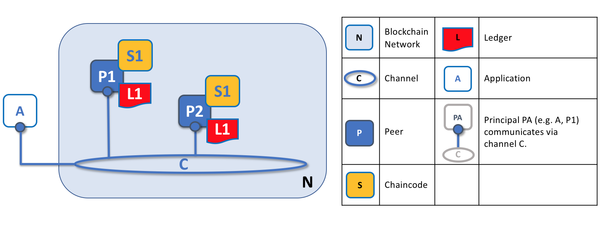

# ピア

ブロックチェーンネットワークは、主に*ピアノード*(または単に*ピア*)のセットで構成されます。ピアは、台帳とスマートコントラクトをホストするため、ネットワークの基本的な要素です。台帳はスマートコントラクトによって生成されたすべてのトランザクションをイミュータブルに記録することを思い出してください(スマートコントラクトは、Hyperledger Fabricでは*チェーンコード*に含まれていますが、これについては後で詳しく説明します)。スマートコントラクトと台帳は、それぞれ、ネットワーク内の共有*プロセス*と共有*情報*をカプセル化するために使用されます。ピアのこれらの側面は、Fabricネットワークを理解するための良い出発点となります。

ブロックチェーンネットワークのその他の要素は、もちろん重要です。台帳とスマートコントラクト、orderer、ポリシー、チャネル、アプリケーション、組織、アイデンティティ、メンバーシップなどです。これらについては、それぞれの専用セクションで詳しく説明しています。このセクションでは、ピアと、Fabricネットワーク内の他の要素との関係に焦点を当てます。

*ブロックチェーンネットワークはピアノードで構成され、各ノードは台帳のコピーとスマートコントラクトのコピーを保持できます。この例では、ネットワークNはピアP1、P2およびP3から構成され、それぞれが分散台帳L1の独自のインスタンスを維持します。P1、P2およびP3は、同じチェーンコード、S1を使用して、分散台帳のコピーにアクセスします。*

ピアの作成、開始、停止、再構成、さらには削除が可能です。ピアは提供するサービスと管理者とアプリケーションが対話できるようにする一連のAPIを公開します。このセクションでは、これらのサービスについて詳しく説明します。

### 用語

Fabricは、**チェーンコード**と呼ばれる技術コンセプトを用いて、**スマートコントラクト**を実装しています。チェーンコードはサポートプログラム言語の１つで書かれた台帳にアクセスするコードに過ぎません。このトピックでは通常、**チェーンコード**という用語を使用しますが、**スマートコントラクト**に慣れている場合は、そちらの用語で読んでも構いません。それは同じことです!チェーンコードとスマートコントラクトの詳細については、[スマートコントラクトとチェーンコードに関する我々のドキュメント](../smartcontract/smartcontract.html)を参照してください。

## 台帳とチェーンコード

ピアをもう少し詳しく見てみましょう。台帳とチェーンコードの両方をピアはホストすることがわかります。より正確には、ピアは実際に台帳の*インスタンス*とチェーンコードの*インスタンス*をホストします。これにより、Fabricネットワークに意図的な冗長性が提供され、単一障害点が回避されます。ブロックチェーンネットワークの分散型および非中央集権型の性質については、このセクションの後半で詳しく説明します。

*ピアは、台帳のインスタンスとチェーンコードのインスタンスをホストします。この例では、P1は台帳L1のインスタンスとチェーンコードS1のインスタンスをホストします。個々のピアでホストされる台帳やチェーンコードが多数存在する場合があります。*

ピアは台帳およびチェーンコードの*ホスト*であるため、アプリケーションおよび管理者がこれらのリソースにアクセスする場合は、ピアと対話する必要があります。そのため、ピアはFabricネットワークの最も基本的な構成要素と見なされています。ピアが最初に作成されたときは、台帳もチェーンコードもありません。台帳がどのように作成され、チェーンコードがどのようにピアにインストールされるかについては、後で説明します。

### 複数台帳

ピアは複数の台帳をホストできます。これは、より柔軟なシステム設計を可能するために有用です。最も単純な構成は、ピアが1つの台帳を管理する場合ですが、必要に応じては、ピアが2つ以上の台帳をホストすることが最適です。

*複数の台帳をホストするピア。ピアは1つ以上の台帳をホストし、各台帳には適用されるチェーンコードが0もしくはそれ以上の場合があります。この例では、ピアP1がL1とL2をホストしていることがわかります。台帳L1には、チェーンコードS1を使用してアクセスします。一方、台帳L2には、チェーンコードS1およびS2を使用してアクセスできます。*

ピアが台帳にアクセスするチェーンコードをホストせずに台帳インスタンスをホストすることは完全に可能ですが、ピアがこのように構成されることはまれです。大多数のピアには、ピアの台帳インスタンスをクエリまたは更新できるチェーンコードが少なくとも1つインストールされています。なお付随する情報として言及しておくべき情報として、ユーザーが外部アプリケーションで使用するためにチェーンコードをインストールしたかどうかにかかわらず、ピアには常に存在する特別な**システムチェーンコード**もあります。これらについては、このトピックでは詳しく説明しません。

### 複数のチェーンコード

ピアが持つ台帳の数と、その台帳にアクセスできるチェーンコードの数との間には、一定の関係はありません。ピアは、多くのチェーンコードと多くの台帳を使用できます。

*複数のチェーンコードをホストするピアの例。各台帳は、それにアクセスするための多数のチェーンコードを有することができます。この例では、ピアP1が台帳L1およびL2をホストしています。L1はチェーンコードS1およびS2によってアクセスされ、L2はS1およびS3によってアクセスされています。S1がL1とL2の両方にアクセスできることがわかります。*

複数の台帳や複数のチェーンコードをピアがホストする場合に、Fabricの**チャネル**の概念が重要である理由については、後ほど説明します。

## アプリケーションとピア

次に、アプリケーションがピアと対話して台帳にアクセスする方法を説明します。台帳にクエリする場合の対話には、アプリケーションとピア間の単純な3ステップの対話が含まれます。台帳を更新する場合の対話はもう少し複雑で、2つの追加ステップが必要です。これらの手順を少し簡略化して、Fabricの使用を開始できるようにしましたが、心配する必要はありません。最も重要な点は、トランザクションスタイルに関して、台帳を更新する場合と台帳にクエリする場合を比べた場合における、アプリケーションとピア間の対話の違いです。

アプリケーションは、台帳およびチェーンコードにアクセスする必要がある場合に、常にピアに接続します。Fabric Software Development Kit(SDK)を使用すると、プログラマはこれを簡単に行うことができます。APIを使用すると、アプリケーションはピアに接続し、チェーンコードを呼び出してトランザクションを生成し、トランザクションをネットワークに送信して、分散台帳に対して順序付け、検証、コミットされ、このプロセスが完了したときにイベントを受信できます。

アプリケーションは、ピア接続を介してチェーンコードを実行し、台帳のクエリまたは更新を実行できます。台帳クエリトランザクションの結果は即時に戻されますが、台帳の更新には、アプリケーション、ピアおよびorderer間のより複雑な対話が必要です。これについて、もう少し詳しく調べてみましょう。

*ピアは、ordererとともに、すべてのピアで台帳が最新の状態に保たれるようにします。この例では、アプリケーションAがP1に接続し、チェーンコードS1を呼び出して台帳L1をクエリもしくは更新します。P1はS1を呼び出して、クエリ結果または提案された台帳更新を含む提案応答を生成します。アプリケーションAが提案応答を受信し、クエリの場合、プロセスはこれで完了です。更新の場合、Aはすべての応答からトランザクションを構築し、ordererであるO1に送信します。O1は、ネットワーク上のトランザクションをブロックに収集し、P1を含むすべてのピアに配信します。P1は、L1にコミットする前にトランザクションを検証します。L1が更新されると、P1はAによって受信される完了を示すイベントを生成します。*

クエリを満たすために必要なすべての情報は、ピアのローカルにある台帳のコピーにあるため、ピアはクエリ結果をただちにアプリケーションに戻すことができます。ピアは、アプリケーションからのクエリに応答するために他のピアと協議することはありません。しかし、アプリケーションは1つ以上のピアに接続してクエリを発行できます。たとえば、複数のピア間で結果をまとめたり、情報が最新ではない可能性がある場合に別のピアから最新の結果を取得したりできます。この図では、台帳へのクエリが単純な3ステップのプロセスであることがわかります。

更新トランザクションは、クエリトランザクションと同じ方法で開始されますが、2つの追加ステップがあります。台帳更新アプリケーションはチェーンコードを起動するためにピアにも接続しますが、台帳クエリアプリケーションとは異なり、他のピアが最初に変更に同意する必要があるため(**合意形成**と呼ばれるプロセス)、個々のピアはこの時点で台帳更新を実行できません。そのため、ピアは、**提案された**更新をアプリケーションに返します。この更新は、他のピアの事前の合意に従って、このピアが後に適用することになるものです。最初の追加ステップ ---ステップ4--- では、アプリケーションが、それぞれの台帳にコミットするためのトランザクションとして、一致する提案済の更新の適切なセットをピアのネットワーク全体に送信する必要があります。これは、**orderer**を使用してトランザクションをブロックにパッケージ化し、それらをピアのネットワーク全体に配布することで実現され、これらのトランザクションは、各ピアの台帳のローカルコピーに適用される前に検証できます。この順序付け処理全体が完了するまでに時間(数秒)がかかるため、ステップ5に示すように、アプリケーションは非同期で通知されます。

順序付けプロセスの詳細については、このセクションの後半で詳しく説明します。このプロセスの更なる詳細については、[トランザクションフロー](../txflow.html)のトピックを参照してください。

## ピアとチャネル

このセクションでは、チャネルよりもピアについて説明しますが、ピアがどのように相互に、また*チャネル*(ブロックチェーン・ネットワーク内の一連のコンポーネントが*個別に*通信および処理できるメカニズム)を介してアプリケーションと相互作用するかを理解するために、少し時間をかける価値があります。

これらのコンポーネントは通常、ピアノード、ordererノード、およびアプリケーションであり、チャネルに参加することによって、そのチャネルに関連付けられた台帳の同一のコピーを共同で共有および管理することに同意します。概念的には、チャネルは友人のグループに似ていると考えることができます(ただし、チャネルのメンバーが友人である必要はありません)。友人のグループが複数あって、それぞれのグループが一緒に活動する場合もあります。これらのグループは完全に独立しているか(趣味の友人のグループと仕事の友人のグループ)、あるいはそれらの間にいくらかの交流があり得ます。それにもかかわらず、各グループは独自のエンティティであり、ある種の"規則"を持っています。

*チャネルを使用すると、特定のピアとアプリケーションのセットがブロックチェーンネットワーク内で相互に通信できます。この例では、アプリケーションAは、チャネルCを使用してピアP1およびP2と直接通信できます。チャネルは、特定のアプリケーションとピア間の通信のためのパスと考えることができます。(簡単にするために、この図ではordererは示されていませんが、機能しているネットワークに存在する必要があります)。*

チャネルはピアと同じようには存在しないことがわかります。チャネルは、物理的なピアの集まりによって形成される論理構造と考える方が適切です。*この点を理解しておくことが重要です。ピアは、チャネルへのアクセスおよびチャネルの管理のための制御ポイントを提供します。*

## ピアと組織

これで、ピアおよび、ピアと台帳、チェーンコード、チャネルとの関係が理解できたので、複数の組織がどのようにしてブロックチェーンネットワークを形成するかを確認できます。

ブロックチェーンネットワークは、単一の組織ではなく、組織の集まりによって管理されます。この種の分散ネットワークを構築するには、ピアが中心となります。ピアは、これらの組織によって所有され、ネットワークへの接続ポイントとなるためです。

*複数の組織を持つブロックチェーンネットワーク内のピア。ブロックチェーンネットワークは、異なる組織によって所有され、提供されるピアから構築されます。この例では、4つの組織が8つのピアを提供してネットワークを形成しています。チャネルCは、ネットワークNの5つのピア --- P1、P3、P5、P7、およびP8を接続します。これらの組織が所有する他のピアは、このチャネルに参加していませんが、通常は少なくとも1つの他のチャネルに参加しています。特定の組織によって開発されたアプリケーションは、異なる組織のピアだけでなく、その組織のピアにも接続されます。ここでも、簡単にするために、この図ではordererノードは示されていません。*

ブロックチェーンネットワークの形成過程で何が起きているかを知ることは非常に重要です。*ネットワークは、リソースを提供する複数の組織によって形成および管理されます。*ピアとは、このトピックで説明しているリソースですが、組織が提供するリソースはピアだけではありません。ここでは原理が働いています。ネットワークは組織が個々の資源を集合的なネットワークに貢献しなければ文字通り存在しません。さらに、ネットワークは、これらの協力する組織によって提供されるリソースとともに拡大および縮小します。

(orderingサービス以外には)一元化されたリソースがないことがわかります。[上の例](#Peer8)では、組織がピアを提供しなければ、ネットワーク**N**は存在しません。これは、組織がネットワークを形成する資源を提供しない限り、また提供するまでは、ネットワークは意味のある状態で存在しないという事実を反映しています。さらに、ネットワークは個々の組織に依存するものではなく、他のどの組織が出入りしても、1つの組織が残っている限り存続します。これは、ネットワークが分散化されるということの核心になります。

[上の例](#Peer8)のように、異なる組織のアプリケーションは同じであっても異なっていてもかまいません。これは、そのアプリケーションがピアの台帳のコピーをどのように処理するかは、完全に組織に依存するためです。つまり、アプリケーションと表現ロジックは、それぞれのピアがまったく同じ台帳データをホストしていても、組織によって異なる場合があります。

アプリケーションは、必要な台帳相互作用の性質に応じて、組織内のピアまたは別の組織内のピアに接続します。台帳クエリの相互作用の場合、アプリケーションは通常、独自の組織のピアに接続します。台帳更新の相互作用については、台帳更新のエンドースに必要な*すべての*組織を代表するピアにアプリケーションを接続する必要がある理由を後で説明します。

## ピアとアイデンティティ

これまで、異なる組織のピアがブロックチェーンネットワークを形成する方法を見てきました。ここでは、ピアがどのようにして管理者によって組織に割り当てられるかについて、少し説明します。

ピアには、特定の認証局からのデジタル証明書を介して割り当てられたアイデンティティがあります。X.509デジタル証明書がどのように機能するかについては、このガイドの別の箇所で詳しく説明していますが、ここでは、デジタル証明書は、ピアに関する多くの検証可能な情報を提供するIDカードのようなものと考えてください。*ネットワーク内のすべてのピアには、所有する組織の管理者によってデジタル証明書が割り当てられます。*

*ピアがチャネルに接続すると、そのデジタル証明書によってチャネルMSPを介して所有組織が識別されます。この例では、P1とP2はCA1によって発行されたアイデンティティを持っています。チャネルCは、チャネル設定のポリシーから、CA1のアイデンティティをORG1.MSPを使用してORG1に関連付ける必要があると判断します。同様に、P3およびP4は、ORG2.MSPによって、ORG2の一部として識別されます。*

ピアがチャネルを使用してブロックチェーンネットワークに接続するたびに、*チャネル設定のポリシーはピアのアイデンティティを使用してその権限を決定します。*組織へのアイデンティティのマッピングは、*メンバーシップサービスプロバイダー*(MSP)と呼ばれるコンポーネントによって提供されます。MSPは、ピアが特定の組織内の特定のロールに割り当てられる方法を決定し、それに応じてブロックチェーンリソースへの適切なアクセスを取得します。さらに、ピアは1つの組織のみが所有できるため、1つのMSPに関連付けられます。ピアアクセスコントロールの詳細については、このセクションの後半で説明します。また、MSPとアクセスコントロールポリシーについては、このガイドの別の箇所で詳しく説明します。しかし今のところ、MSPは、ブロックチェーン・ネットワークにおける個々のアイデンティティと特定の組織的役割との間の結び付きを提供するものと考えてください。

少し話を進めると、*ブロックチェーンネットワークと相互作用するすべてのものと同様に、ピアはデジタル証明書とMSPから組織的なアイデンティティを取得します。*ピア、アプリケーション、エンドユーザ、管理者、ordererがブロックチェーンネットワークと対話する場合は、アイデンティティと関連するMSPが必要です。*アイデンティティを使用してブロックチェーンネットワークと対話するすべてのエンティティについてプリンシパルと名前を付けます。*本書の他の箇所では、プリンシパルと組織についてさらに多くのことを学ぶことができますが、今のところは、ピアについての理解を深めるのに十分な知識があります!

最後に、ピアが物理的にどこにあるかは重要ではないことに注意してください。ピアは、クラウド内にある場合もあれば、いずれかの組織が所有するデータセンターにある場合もあります。また、ローカルマシン上にある場合もあります。ピアに関連付けられたデジタル証明書によって、特定の組織が所有していることが識別されます。上記の例では、P3を組織1のデータセンターでホストできますが、関連付けられたデジタル証明書がCA2によって発行されていれば、組織2が所有しています。

## ピアとorderer

これまで見てきたように、ピアはブロックチェーンネットワークの基盤を形成し、ピアに接続されたアプリケーションによってクエリおよび更新される台帳やスマートコントラクトをホストします。しかし、アプリケーションとピアが相互作用して、すべてのピアの台帳が相互に一貫性を保つようにするメカニズムは、*orderer*と呼ばれる特殊なノードによって仲介され、これらのノードに着目していきます。

更新トランザクションは、単一のピアだけでは台帳を更新できないため、クエリートランザクションとはまったく異なります。更新には、ネットワーク内の他のピアの同意が必要です。ピアは、ピアのローカル台帳に適用する前に、ネットワーク内の他のピアが台帳更新を承認する必要があります。このプロセスは*合意形成*と呼ばれ、単純なクエリよりも完了に時間がかかります。ただし、トランザクションを承認する必要があるすべてのピアが承認し、トランザクションが台帳にコミットされると、ピアは台帳が更新されたことを接続アプリケーションに通知します。このセクションでは、ピアやordererが合意形成プロセスを管理する方法について、さらに詳しく説明します。

具体的には、台帳を更新するアプリケーションは、ブロックチェーンネットワーク内のすべてのピアが台帳の一貫性を維持することを保証する3フェーズプロセスに関与します。

* 最初のフェーズでは、アプリケーションは*エンドーシングピア*のサブセットと連携します。各ピアは、提案された台帳更新のエンドースメントをアプリケーションに提供しますが、提案された更新を台帳のコピーに適用しません。
* 2番目のフェーズでは、これらの個別のエンドースメントがトランザクションとして収集され、ブロックにパッケージ化されます。
* 3番目の最後のフェーズでは、これらのブロックがすべてのピアに配布され、各トランザクションが検証されてから、そのピアの台帳のコピーにコミットされます。

これから説明するように、ordererノードはこのプロセスの中心となるので、アプリケーションとピアがordererを使用して、分散され複製された台帳に一貫して適用できる台帳更新を生成する方法をもう少し詳しく調べていきます。

### フェーズ 1: 提案

トランザクションワークフローのフェーズ1では、アプリケーションと一連のピアとの間の対話が行われますが、ordererは関与しません。フェーズ1は、異なる組織のエンドーシングピアに対して、提案されたチェーンコード呼び出しの結果に同意するように求めるアプリケーションにのみ関係します。

フェーズ1を開始するために、アプリケーションはトランザクション提案を生成し、それをエンドースメントのために必要なピアのセットのそれぞれに送信します。これらの*エンドーシングピア*のそれぞれは、トランザクション提案を使用してチェーンコードを独立して実行し、トランザクション提案応答を生成します。この更新は台帳に適用されず、単に署名してアプリケーションに戻します。アプリケーションが十分な数の署名付き提案応答を受信すると、トランザクションフローの最初のフェーズが完了します。このフェーズをもう少し詳しく見てみましょう。

*トランザクション提案は、承認された提案応答を返すピアによって独立して実行されます。この例では、アプリケーションA1は、チャネルC上のピアP1とピアP2の両方に送信するトランザクションT1の提案Pを生成します。P1は、トランザクションT1の提案Pを使用してS1を実行し、E1でエンドースされるトランザクションT1の応答R1を生成します。独立して、P2は、トランザクションT1の提案Pを使用してS1を実行し、トランザクションT1の応答R2を生成し、これをE2でエンドースします。アプリケーションA1は、トランザクションT1に対する2つのエンドースされた応答、すなわちE1とE2を受け取ります。*

最初に、提案された台帳更新のセットを生成するために、ピアのセットがアプリケーションによって選択されます。どのピアがアプリケーションによって選択されるのでしょうか?これは、(チェーンコードに対して定義された)*エンドースメントポリシー*に依存します。エンドースメントポリシーは、提案された台帳変更をネットワークで受け入れる前にエンドースする必要がある組織のセットを定義します。これは文字通り、合意形成を達成することを意味します。つまり、重要なすべての組織は、提案された台帳変更をエンドース*してからでなければ*、その変更が他の組織の台帳に受け入れられません。

ピアは、デジタル署名を追加し、プライベートキーを使用してペイロード全体に署名することによって、提案応答をエンドースします。このエンドースメントは、その後、この組織のピアが特定の応答を生成したことを証明するために使用できます。この例では、ピアP1が組織Org1によって所有されている場合、エンドースメントE1は、"台帳L1のトランザクションT1の応答R1が組織1のピアP1によって提供された"というデジタル証明に対応します。

フェーズ1は、アプリケーションが十分な数のピアから署名された提案応答を受信すると終了します。我々は、異なるピアが、*同じトランザクション提案に対して*、異なる、すなわち、一貫性のないトランザクション応答をアプリケーションに返す可能性があることに留意が必要です。単に、異なる状態の台帳を持つ異なるピアで異なる時間に結果が生成されたということかもしれず、その場合、アプリケーションは単純に、より最新の提案応答を要求できます。可能性は低いが、より深刻なのは、チェーンコードが*非決定的である*ことにより、結果が異なる場合です。非決定性はチェーンコードと台帳の敵であり、それが発生した場合、矛盾した結果は明らかに台帳に適用できないので、提案されたトランザクションに重大な問題を示す。個々のピアは、トランザクションの結果が非決定的であることを知ることはできません。非決定的であることを検出する前に、比較のためにトランザクション応答を収集する必要があります。(厳密に言えば、これだけでは十分ではありませんが、この議論はトランザクションセクションに委ねます。トランザクションセクションでは、非決定性について詳しく説明します。

フェーズ1の終了時に、アプリケーションは、矛盾したトランザクション応答を破棄することを望む場合には、トランザクションワークフローを効果的に早期に終了させることができます。アプリケーションが一貫性のないトランザクション応答のセットを使用して台帳を更新しようとすると、拒否されることが後でわかります。

### フェーズ 2: トランザクションのブロックへの順序付けとパッケージ化

トランザクションワークフローの2番目のフェーズは、パッケージ化フェーズです。ordererは、このプロセスの中心的役割を果たします。ordererは、多くのアプリケーションからエンドースされたトランザクション提案応答を含むトランザクションを受け取り、そのトランザクションを順序整理してブロックにします。順序付けおよびパッケージ化フェーズの詳細については、[順序付けフェーズに関する概念情報](../orderer/ordering_service.html#phase-two-ordering-and-packaging-transactions-into-blocks)を参照してください。

### フェーズ 3: 検証とコミット

フェーズ2の終わりには、提案されたトランザクション更新を収集し、それらを順序整理してブロックにパッケージ化して、ピアに配布できるようにするという、シンプルだが重要なプロセスをordererが担当していることがわかります。

トランザクションワークフローの最終フェーズでは、ブロックをordererからピアに配布して検証し、台帳にコミットされます。具体的には、各ピアで、ブロック内のすべてのトランザクションが検証され、台帳にコミットされる前に、すべての関連組織によって一貫してエンドースされていることが確認されます。失敗したトランザクションは監査のために保持されますが、台帳にはコミットされません。

*ordererノードの2番目の役割は、ブロックをピアに配布することです。この例では、orderer O1はブロックB2をピアP1およびピアP2に配布します。ピアP1はブロックB2を処理し、P1の台帳L1に新しいブロックが追加されます。並行して、ピアP2はBlock B2を処理し、P2の台帳L1に新しいブロックが追加されます。このプロセスが完了すると、台帳L1はピアP1およびP2上で一貫して更新され、それぞれが、トランザクションが処理されたことをそれぞれのピアに接続しているアプリケーションに通知することができます。*

フェーズ3は、ordererが接続されているすべてのピアにブロックを配布することから始まります。新しいブロックが生成されると、ordererに接続されたすべてのピアに新しいブロックのコピーが送信されるように、ピアはチャネル上のordererに接続されます。各ピアはこのブロックを個別に処理しますが、チャネル上の他のすべてのピアとまったく同じ方法で処理します。このようにして、台帳の整合性を保つことができます。また、すべてのピアがordererに接続されている必要があるわけではないことにも注意してください。ピアは、**ゴシップ**プロトコルを使用してブロックを他のピアに伝播させることができます。また、ゴシッププロトコルは、ブロックを独立して処理することもできます。でも、その話は別の機会にしましょう!

ブロックを受信すると、ピアは、ブロックに現れる順序で各トランザクションを処理します。各ピアは、トランザクションを生成したチェーンコードの*エンドースメントポリシー*に従って、トランザクションが必要な組織によってエンドースされたことを、トランザクションごとに検証します。たとえば、トランザクションの中には、単一の組織によってのみエンドースされる必要があるものもあれば、有効とみなされる前に複数のエンドースメントが必要なものもあります。この検証プロセスは、すべての関連組織が同じ結果または結果を生成したことを検証します。また、この検証はフェーズ1のエンドースメントチェックとは異なります。フェーズ2では、アプリケーションがエンドーシングピアからの応答を受信し、提案トランザクションの送信を決定します。アプリケーションが誤ったトランザクションを送信してエンドースメントポリシーに違反した場合でも、ピアはフェーズ3の検証プロセスでトランザクションを拒否できます。

トランザクションが正しくエンドースされている場合、ピアはそのトランザクションを台帳に適用しようとします。これを行うには、台帳の整合性チェックを実行して、台帳の現在の状態が、提示された更新が生成されたときの台帳の状態と互換性があることを確認する必要があります。これは、トランザクションが完全にエンドースされている場合でも、常に可能であるとは限りません。たとえば、別のトランザクションによって台帳内の同じ資産が更新され、トランザクション更新が有効でなくなり、適用できなくなる場合があります。この方法では、チャネル内の各ピアが同じ検証ルールに従うため、台帳はチャネル内の各ピア間で一貫性が保たれます。

ピアは、各トランザクションの検証に成功すると、台帳を更新します。失敗したトランザクションは台帳に適用されませんが、成功したトランザクションと同様に監査目的で保持されます。これは、ピア上のブロックが、ブロック内の各トランザクションに有効または無効のインジケータがあることを除いて、ordererから受信したブロックと同じであることを意味します。

また、フェーズ3ではチェーンコードの実行は必要ありません。これはフェーズ1でのみ行われます。これは重要です。つまり、チェーンコードはブロックチェーンネットワーク全体ではなく、エンドーシングノードでのみ使用可能である必要があります。これは、チェーンコードの論理をエンドースをする組織内で秘密にしておくのにしばしば役立ちます。これは、チャネル内のすべてのピア（そのピアがトランザクションをエンドースする役割か否かに関わらず）と共有されるチェーンコードの出力(トランザクション提案応答)とは対照的です。このエンドーシングピアの特殊化は、拡張性と機密性を高めるために設計されています。

最後に、ブロックがピアの台帳にコミットされるたびに、そのピアは適切な*イベント*を生成します。*ブロックイベント*には完全なブロック内容が含まれますが、*ブロックトランザクションイベント*には、ブロック内の各トランザクションが検証済みか無効かなどの要約情報のみが含まれます。チェーンコード実行が生成する*チェーンコードイベント*も、このタイミングで発行されます。アプリケーションは、これらのイベントタイプを登録して、イベントが発生したときに通知を受け取ることができます。これらの通知によって、トランザクションワークフローの3番目の最終フェーズが終了します。

要約すると、フェーズ3では、台帳に一貫して適用されているordererによって生成されたブロックが参照されます。ブロックへのトランザクションの厳密な順序付けにより、各ピアは、トランザクション更新がブロックチェーンネットワーク全体に一貫して適用されていることを検証できます。

### ordererと合意形成

このトランザクションワークフロープロセス全体を*合意形成*と呼びます。これは、すべてのピアが、ordererによって仲介されるプロセスにおいて、トランザクションの順序と内容について合意に達しているためです。合意形成は複数ステップのプロセスであり、プロセスが完了したときにのみ、アプリケーションに台帳の更新が通知されます。これは、異なるピアではわずかに異なる時間に発生する場合があります。

ordererについては、今後のordererのトピックでさらに詳しく説明しますが、現時点では、ordererは、アプリケーションから提案された台帳更新を収集して配布し、ピアが検証して台帳に含めるためのノードと考えてください。

これで、Fabric内で関連するピアとその他のコンポーネントのツアーは終了です。これまで見てきたように、ピアは多くの点で最も基本的な要素です。ピアは、ネットワークを形成し、チェーンコードおよび台帳をホストし、トランザクションの提案と応答を処理し、一貫してトランザクションの更新を適用することによって台帳を最新の状態に維持します。

<!--- Licensed under Creative Commons Attribution 4.0 International License
https://creativecommons.org/licenses/by/4.0/) -->
