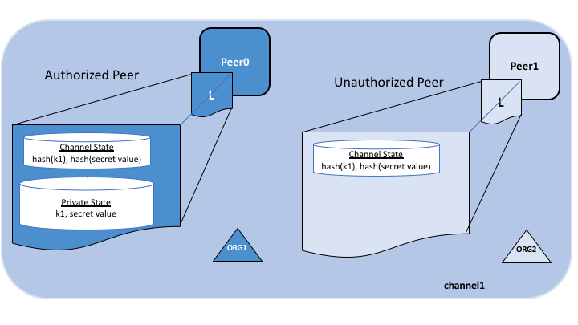

# Private data

## What is private data?

ある組織のグループが、同じチャネル上の他の組織からデータを秘匿する必要がある場合には、データへのアクセスが必要な組織だけから構成される新しいチャネルを作成することができます。しかし、このようにケースに応じて別のチャネルを作成するのは、追加の管理オーバヘッド(チェーンコードのバージョン、ポリシー、MSPなど）となり、また、全ての参加者にトランザクションを見せつつ、データの一部の秘匿化する必要があるユースケースには対応ができなくなります。

これが、Fabricが**プライベートデータコレクション**を提供する理由です。プライベートデータコレクションにより、新たにチャネルを作成する必要なく、チャネル内の組織のサブセットに、プライベートデータのエンドースメント、コミット、あるいはクエリーを行わせることができるのです。

## What is a private data collection?

コレクションは、次の2つの要素の組み合わせです:

1. **実際のプライベートデータ**。そのデータを見る権限のある組織にのみ、[ゴシッププロトコル](../gossip.html)でのpeer-to-peer通信でデータが送信されます。このデータは、許可された組織のピア内のプライベートステートデータベースに保管され、これら許可されたピア上のチェーンコードからアクセスすることができます。オーダリングサービスはここでは関与しないので、プライベートデータを見ることはありません。ゴシッププロトコルにより、許可された組織間のpeer-to-peer通信でプライベートデータが配布されるので、組織間の通信を開始するため、チャネル内にアンカーピアを設定し、各ピアにCORE_PEER_GOSSIP_EXTERNALENDPOINTを設定する必要があることに注意してください。

2. **当該データのハッシュ**。このハッシュ値は、エンドースされ、順序付けされ、チャネル上の各ピアの台帳に書き込まれます。ハッシュはトランザクションの証拠となり、ステートの検証に使われるとともに、監査目的で利用することもできます。

次の図は、プライベートデータを持つ権限があるピアとそうでないピアの台帳の内容を示しています。

係争に巻き込まれたり、資産を第3者に譲渡したいといった場合に、コレクションのメンバーはプライベートデータを他のメンバーに共有するようにすることもできます。その場合、第三者がプライベートデータのハッシュを計算し、それがチャネル台帳のステートと一致するかを確認して、コレクションのメンバー間で共有しているステートが特定の時点で存在していたことを証明することができます。

ケースによっては、単一の組織のみからなるコレクションのセットを定義することもできます。例えば、ある組織が自身のコレクションにプライベートデータを記録しておいて、後ほどチャネル内の他のメンバーに共有、チェーンコードトランザクションから参照してもらうということもできます。この具体的な例については、下のSharing private dataのトピックをご参照ください。

### When to use a collection within a channel vs. a separate channel

* 取引(および台帳)全体の秘匿性を、チャネルのメンバーとなっている組織群の間で確保する必要がある場合には、**チャネル**を使用してください。

* 取引(および台帳)自体は、特定の組織群の間で共有する必要があるが、トランザクション内のデータの一部(あるいは全部）をこれら組織群の一部メンバーのみで共有する必要がある場合には、**コレクション**を使用してください。さらに、プライベートデータはブロック経由ではなくpeer-to-peerで伝播されるため、オーダリングサービスノードからトランザクションデータを秘匿する(見せたくない)場合には、プライベートデータコレクションを使用してください。

## A use case to explain collections

チャネル上で農産物を取引する5つの組織のグループを考えてみましょう：

* 海外で商品を売る**Farmer(農家)**
* 商品を海外に搬送する**Distributor(代理店)**
* 当事者間で実際の商品を移動する**Shipper(物流会社)**
* Distributorから商品を購入する**Wholesaler(卸売業者)**
* ShipperおよびWholesalerから商品を購入する**Retailer(小売業者)**

**Distributor**は取引条件を**Wholesaler**と**Retailer**から秘匿するために、**Farmer**と**Shipper**との間でプライベートトランザクションを利用しようとするかもしれません（彼らが値上げをしないようにするために）。

**Distributor**は、**Retailer**よりも低価格を請求するために、**Wholesaler**との別のプライベートデータの関係を持ちたい場合もあります。

**Wholesaler**は、**Retailer**および**Shipper**とのプライベートデータの関係も必要とする場合があります。

これらの関係ごとに多数の小さなチャネルを定義するのではなく、複数のプライベートデータコレクション **(PDC)** を定義して、以下の様にプライベートデータを共有できます:

1. PDC1: **Distributor**, **Farmer** および **Shipper**
2. PDC2: **Distributor** および **Wholesaler**
3. PDC3: **Wholesaler**, **Retailer** および **Shipper**

この例を使用すると、**Distributor**が所有するピアは、台帳内に複数のプライベートデータベースを持ちます。このデータベースには、**Distributor**、**Farmer**、**Shipper**の関係および**Distributor**と**Wholesaler**との関係のプライベートデータが含まれます。

## Transaction flow with private data

プライベートデータコレクションがチェーンコードから参照される時には、トランザクションの提案、エンドースメント、および台帳へのコミットという一連のトランザクションフローは、プライベートデータの機密性の保護のため通常とやや異なります。

プライベートデータを使用しないトランザクションのフローの詳細については、当ドキュメントの[transaction flow](../txflow.html)をご参照ください。

1. クライアントアプリケーションは、コレクションのアクセス許可のある組織内のエンドーシングピアに、チェーンコードの関数(プライベートデータの読み書き)を呼び出すための提案要求を発行します。プライベートデータ、あるいはプライベートデータをチェーンコード内で生成するために使われるデータは提案の`transient`フィールドにて送信されます。

2. エンドーシングピアはトランザクションをシミュレートし、プライベートデータを`transient data store`(ピアのローカルにある一時ストレージ)に保管します。エンドーシングピアは、コレクションポリシーに従って[gossip](../gossip.html)により許可されたピアにプライベートデータを配布します。

3. エンドーシングピアは提案応答をクライアントに返します。提案応答には、パブリックデータを含むエンドースメント時のread/writeセット、およびプライベートデータのキーと値のハッシュ値を含みます。*プライベートデータはクライアントに返されません*。プライベートデータを伴うエンドースメントの振る舞いのより詳しい情報については[こちら](../private-data-arch.html#endorsement)をクリックください。

4. クライアントアプリケーションは、トランザクション（プライベートデータのハッシュ付きの提案応答を含む）をオーダリングサービスに送信します。プライベートデータのハッシュ付きのトランザクションは、通常どおりブロックに含まれます。プライベートデータハッシュを持つブロックは、すべてのピアに配布されます。このようにして、チャネル上のすべてのピアは、実際のプライベートデータを知らなくても、一貫した方法でプライベートデータのハッシュを使用してトランザクションを検証できます。

5. ブロックのコミット時には、許可されたピアはコレクションポリシーを使用してプライベートデータへのアクセス権限があるかどうかを判断します。もし受け取っていなければ、そのピアは最初に、チェーンコードの承認時にプライベートデータをすでに受け取っているかを判断するために、ローカルの`transient data store`を確認します。もし権限がなければ、ピアは他の許可されたピアからプライベートデータを取得しようとします。その後、ピアはパブリックブロックの中のハッシュとの比較でプライベートデータを検証し、トランザクションとブロックをコミットします。検証/コミット時には、プライベードデータは、プライベートステートデータベースのコピーとプライベートライトセットストレージに移されます。その後、プライベートデータは、`transient data store`から削除されます。

## Sharing private data

多くのシナリオにおいて、１つのコレクション内のプライベートデータのキー/バリューは、他のチャネルメンバー、あるいは他のプライベートコレクションと共有される必要があるかもしれません。例えば、元々のプライベートデータコレクションに含まれていない単一の、あるいは複数のチャネルメンバーとプライベートデータをやりとりする必要がある場合などです。データを受領したメンバーは通常、トランザクションの一部であるオンチェーンハッシュを使ってプライベートデータの検証をしたいものです。

プライベートデータの共有と検証を可能にするために、プライベートデータコレクションにはいくつかの特徴があります:

* 第一に、エンドースメントポリシーを満たしている限り、コレクションにキーを書き込むためにコレクションのメンバーである必要はありません。エンドースメントポリシーは、チェーンコードレベル、キーレベル（ステートベースのエンドースメントを利用)、あるいはコレクションレベル(Fabric v2.0から提供) で定義できます。

* 第二に、v1.4.2からはチェーンコードAPIにてGetPrivateDataHash()が提供されており、これにより、メンバーではないピア上のチェーンコードがプライベートキーのハッシュ値を読み取ることが可能です。これは後ほど説明もしますが、重要な機能です。というのも、これにより、前のトランザクションのプライベートデータから生成されたオンチェーンのハッシュを使ってプライベートデータを検証することをチェーンコードが出来るようになるからです。

プライベートデータを共有し検証するこの機能は、アプリケーションと、関連するプライベートデータコレクションを設計する時に留意しておく必要があります。チャネルメンバーの様々な組み合わせの中でデータを共有する複数のプライベートデータコレクションのセットを作成することももちろん出来ますが、このアプローチは結果的に多数のコレクションを定義する必要が出てしまいます。代わりに、少数のプライベートデータコレクションを使い(例：組織ごとに1コレクション、あるいは組織のペアごとに1コレクション)、そのプライベートデータを他のチャネルメンバー、あるいは他のコレクションと必要に応じて共有する、ということも検討してください。Fabric v2.0からは、暗黙的な組織固有コレクションが全てのチェーンコードから利用可能となり、これによりチェーンコードのデプロイ時にこれら組織単位のコレクションを定義する必要さえなくなりました。

### Private data sharing patterns

プライベートデータコレクションの設計においては、多数の複数組織間のコレクションを定義するというオーバーヘッドなしに、プライベートデータを共有し転送する複数のパターンが利用可能です。チェーンコードアプリケーションが利用可能ないくつかの共有パターンを挙げます:

* **公開されているステートの追跡に対応する公開鍵の使用** -
  公開されているステート(資産の属性や現在の所有者など)を追跡するために、オプションとして対応する公開鍵を使うことができます。また、資産に対応するプライベートデータへのアクセスする必要がある全ての組織について、各組織のプライベートデータコレクションの中にプライベートキー/バリューを作成することができます。

* **チェーンコードのアクセス制御** -
  チェーンコードにアクセス制御を実装して、コレクション内のプライベートデータをクエリできるクライアントを指定できます。例えば、プライベートデータコレクションキーまたはキーの範囲のアクセスコントロールリストを保存してから、(GetCreator()チェーンコードAPIまたはCIDライブラリAPIのGetID()またはGetMSPID()を使用して)クライアント送信者の資格情報をチェーンコード内で取得し、プライベートデータをクライアントに返す前にアクセス権があるかどうかを確認します。同様に、パスフレーズをチェーンコードに渡すようにクライアントに要求することもできます。プライベートデータにアクセスするには、パスフレーズがキーレベルで保存されているパスフレーズと一致している必要があります。このパターンは、公開されているステートデータへのクライアントからのアクセスを制限するためにも使用できます。

* **Fabricネットワーク外でプライベートデータを共有** -
  オフチェーンを利用するオプションとして、プライベートデータをFabricネットワーク外で他の組織と共有し、GetPrivateDataHash()チェーンコードAPIを使用してキー/値をハッシュし、それがオンチェーンハッシュと一致することを確認できます。例えば、資産を購入したい組織は、購入に同意する前に、オンチェーンハッシュをチェックして、資産の属性と正当な所有者であることを確認できます。

* **他のコレクションとプライベートデータを共有** -
  チェーン上のプライベートデータを、他の組織のプライベートデータコレクションと一致するキー/バリューを作成するチェーンコードと「共有」することができます。一時フィールドを介してプライベートデータのキー/バリューをチェーンコードに渡すと、チェーンコードはGetPrivateDataHash()を使用して、渡されたプライベートデータのハッシュがコレクションのチェーン上のハッシュと一致することを確認し、そのプライベートデータを他の組織のプライベートデータコレクションに書き込むことができます。

* **他のコレクションへのプライベートデータの転送** -
  コレクション内のプライベートデータキーを削除し、別の組織のコレクションにキーを作成するチェーンコードを使用して、プライベートデータを「転送」することができます。ここでも、一時フィールドを使用して、チェーンコードを起動したときにプライベートデータを渡し、チェーンコードでGetPrivateDataHash()を使用してプライベートデータコレクションにデータが存在することを確認してから、コレクションからキーを削除し、別の組織のコレクションにてキーを作成します。トランザクションが常に1つのコレクションから削除され、別のコレクションに追加されるようにするには、規制機関や監査人など、他の関係者からの承認を必要とする場合があります。

* **トランザクション承認のためのプライベートデータの利用** -
  トランザクションが完了する前にトランザクションの相手の承認を得たい場合(例えば、彼らがある価格で資産を購入することに同意するというオンチェーンレコード)、チェーンコードは、彼らのプライベートデータコレクションかあなたのコレクションのいずれかにプライベートキーを書き込み、チェーンコードがGetPrivateDataHash()を使用してチェックすることで、彼らにトランザクションの「事前承認」を要求することができます。実際、これは、チェーンコードの定義がチャネルにコミットされる前に、組織がその定義に同意することを保証するために、ビルトインされているライフサイクルシステムチェーンコードが使用しているのと全く同じメカニズムです。Fabric v2.0以降、このパターンは、コレクションレベルのエンドースメントポリシーによってさらに強力になり、コレクションオーナー自身のトラステッドピアにてチェーンコードが実行され、承認されることが保証されるようになりました。あるいは、キーレベルのエンドースメントポリシーによる相互に合意したキーを使用することができます。これは後で、事前承認条件に基づいて更新され、必要とされる組織のピア上で承認されます。

* **取引者の秘匿** -
  前出のパターンの変形により、特定のトランザクションに対する取引者の漏洩を排除することもできます。例えば、買い手は自分のコレクションで購入することに同意することを示し、後続のトランザクションにおいて、売り手は、買い手自身のプライベートデータコレクションで買い手のプライベートデータを参照します。ハッシュ化した参照付きのトランザクションの証明は、オンチェーンに記録され、買い手と売り手だけが自分達が取引主体であることを知っていることになります。しかし、ハッシュを検証できる別の当事者との後続のトランザクションなどで、知る必要が生じた場合には、事前イメージを明らかにすることができます。

上記のパターンに加えて、プライベートデータを使用したトランザクションは、通常のチャネルのステートデータと同様に、具体的には次のような条件に紐付けることできます：

* **キーレベルのトランザクション・アクセス制御** -
  プライベートデータ値に所有権資格情報を含めると、後続のトランザクションで、送信者がデータを共有または転送する所有者権限を持っていることを確認できます。この場合、チェーンコードは送信者の資格情報を取得し(例えば、GetCreator()チェーンコードAPIまたはCIDライブラリーAPIであるGetID()またはGetMSPID()を使用して)、それをチェーンコードに渡される他のプライベートデータと組み合わせてハッシュ化し、トランザクションを進める前にGetPrivateDataHash()を使用してオンチェーンのハッシュと一致することを確認します。

* **キーレベルのエンドースメントポリシー** -
  また、通常のチャネルのステートデータと同様に、ステートベースのエンドースメントを使用すると、SetPrivateDataValidationParameter()チェーンコードAPIを使用して、プライベートデータを共有または転送するトランザクションをどの組織がエンドースする必要があるかを指定できます。たとえば、所有者の組織ピア、保管者の組織ピア、または他の第3者のみがこのようなトランザクションをエンドースする必要があることを指定できます。

### Example scenario: Asset transfer using private data collections

上記のプライベートデータ共有パターンを組み合わせることで、強力なチェーンコードベースのアプリケーションを実現できます。例えば、組織別のプライベートデータコレクションを使用して資産移転シナリオを実装する方法を考えてみましょう:

* 資産は、パブリックチェーンコードステートのUUIDキーで追跡できます。資産の所有権のみが記録され、それ以外の資産に関する情報は記録されません。

* チェーンコードは、いかなる移転要求も資産を所有するクライアントから発行されなければならず、キーは、所有者の組織と規制機関の組織のピアが、いかなる移転要求も承認しなければならないことを要求するステートベースのエンドースメントに関連付けられます。

* 資産所有者のプライベートデータコレクションには、UUIDのハッシュがキーとして設定された、資産に関するプライベートデータの詳細が含まれます。他の組織とオーダリングサービスでは、資産の詳細のハッシュのみを照会できます。

* 必ずしもそうである必要はありませんが、規制機関も各コレクションのメンバーであり、したがってプライベートデータを保管すると仮定しましょう

資産を取引するトランザクションは、次のように動作します:

1. オフチェーンにて、所有者と潜在的な買い手が、資産を特定の価格で取引する契約を結びます。

2. 売り手は、プライベートデータの詳細をFabricネットワーク外で渡すか、買い手のノードまたは規制機関のノード上のプライベートデータを照会するための資格情報を買い手に提供することによって、所有権の証明を提供します。

3. 買い手は、プライベートデータの詳細のハッシュがオンチェーンの公開ハッシュと一致することを確認します。

4. 買い手はチェーンコードを呼び出して、入札の詳細を自身のプライベートデータコレクションに記録します。買い手のピアでチェーンコードが呼び出され、コレクションエンドースメントポリシーによって要求されている場合には、規制機関のピアでチェーンコードが呼び出される可能性があります。

5. 現在の所有者(売り手)は、チェーンコードを呼び出して資産を販売および譲渡し、プライベートデータの詳細および入札情報を渡します。チェーンコードは、パブリックなキーのエンドースメントポリシー、ならびに買い手と売り手のプライベートデータコレクションのエンドースメントポリシーを満たすよう、売り手、買い手、および規制機関のピアにて起動します。

6. チェーンコードは、送信クライアントが所有者であることを確認し、売り手のコレクションのハッシュに対してプライベートデータの詳細を確認し、買い手のコレクションのハッシュに対して入札詳細を確認します。次に、チェーンコードは、パブリックなキーに対する提案された更新を書き込み(買い手に所有権を設定し、買い手の組織および規制機関としてエンドースメントポリシーを設定)、買い手のプライベートデータコレクションにプライベートデータの詳細を書き込み、場合によっては、売り手のコレクションからプライベートデータの詳細を削除します。最終的なエンドースメントの前に、エンドーシングピアは、権限を持つ売り手と規制機関のすべてのピアにプライベートデータが確実に配布されるようにします。

7. 売り手は、オーダリングサービスにパブリックデータおよびプライベートデータのハッシュを付加してトランザクションを送信し、そのトランザクションはブロックに含まれる形で、チャネル内の全てのピアに配布されます。

8. 各ピアのブロック検証ロジックは、エンドースメントポリシーが満たされたこと(買い手、売り手、規制機関のすべてがエンドースしたこと)を一貫して検証し、チェーンコードで読み取られたパブリックおよびプライベートのステートが、チェーンコードの実行後に他のトランザクションによって変更されていないことを検証します。

9. すべてのピアは、検証チェックを通過したため、トランザクションを有効なものとしてコミットします。売り手のピアおよび規制機関のピアは、エンドースメント時にプライベートデータを受信していなかった場合、他の承認されたピアからプライベートデータを取得し、そのプライベートデータを自身のプライベートデータのステートデータベースに保持します(プライベートデータがトランザクションのハッシュと一致すると仮定します)。

10. トランザクションが完了すると、資産は譲渡され、資産に関心を持つ他のチャネルメンバーは、公開鍵の履歴を照会してその出所を把握することができます。しかし、所有者が必要に応じてそれを共有しない限り、プライベートデータの詳細にアクセスすることはできません。

基本的な資産移転シナリオは、他の考慮事項にも拡張することができます。例えば、移転のチェーンコードは、実行前に、支払対引渡の要件を満たすために支払記録が利用可能であることを検証することができたり、銀行が信用状を提出したことを検証することができます。また、取引者が直接ピアを所有する代わりに、ピアを所有している保管組織を通じてトランザクションを実行することもできます。

## Purging private data

非常に機密性の高いデータの場合、個人データを共有している当事者でさえ、ブロックチェーン上にデータのハッシュを残し、個人データの不変の証拠として機能させながら、定期的にピア上のデータを「パージ」(消去)することを望むかもしれないし、行政の規制によってパージを要求されるかもしれません。

このような場合、いくつかのケースでは、プライベートデータは、ピアのブロックチェーンの外部のデータベースに複製されるようになるまでの間のみ、ピアのプライベートデータベースに存在する必要があります。データは、チェーンコードビジネスプロセス(取引の決済、契約の履行など)が完了するまで、ピア上に存在していればよい場合もあります。

これらの使用例をサポートするために、設定したブロック数にわたってプライベートデータが変更されていない場合は、プライベートデータをパージできます。パージされたプライベートデータは、チェーンコードから照会できません。また、他の要求元ピアからは使用できません。

## How a private data collection is defined

コレクション定義の詳細、およびプライベートデータとコレクションに関するその他のローレベルの情報については、[private data reference topic](../private-data-arch.html)を参照してください。

<!--- Licensed under Creative Commons Attribution 4.0 International License
https://creativecommons.org/licenses/by/4.0/ -->
