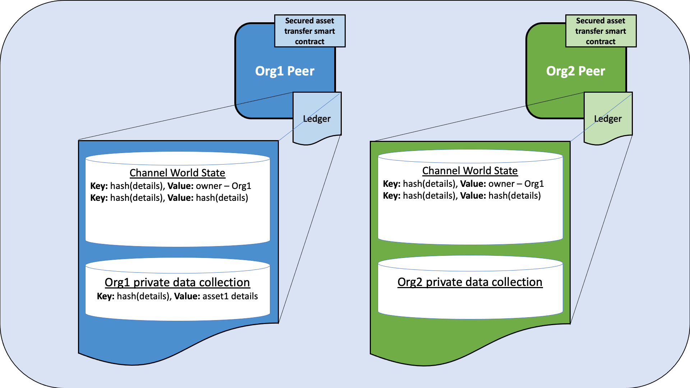
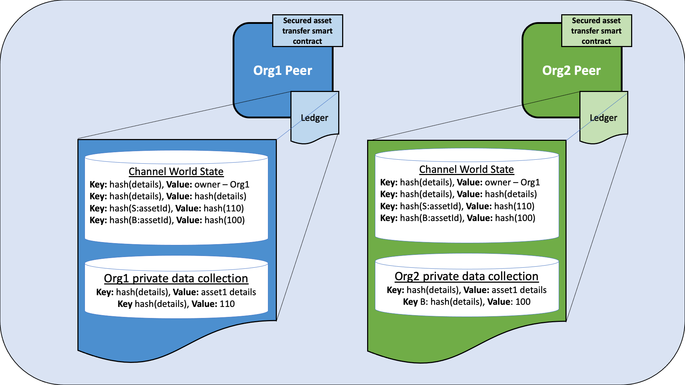
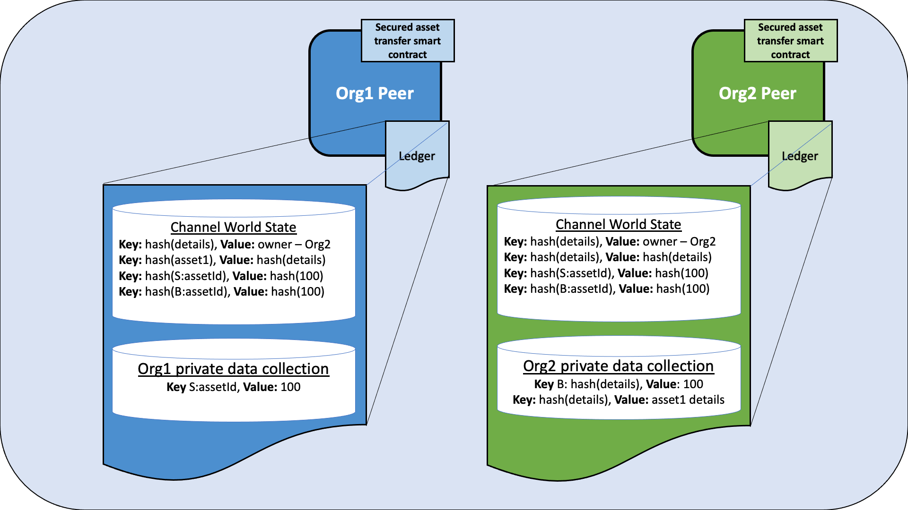

# Secured asset transfer in Fabric

このチュートリアルでは、プライベートデータを使用してアセットとトランザクションの詳細を維持しながら、Hyperledger Fabricブロックチェーンチャネル内の組織間でどのようにアセットが表され、取引できるかを実際にやってみます。チェーン上の各アセットは、ユニークな所有者とともに、特定のイミュータブルなメタデータプロパティ(サイズや色など)を持つ、特有のアセットを表している非代替トークン(NFT)です。所有者がアセットを売却したい場合は、アセットが譲渡される前に両当事者が同じ価格で合意する必要があります。プライベートなアセット転送スマートコントラクトは、アセットの所有者のみがアセットを転送できるように実行します。このチュートリアルでは、ステートベースのエンドースメントやプライベートデータ、アクセス制御などのFabric機能がどのように連携して、お互いにプライベートで検証可能な安全なトランザクションを実現するかを学びます。

このチュートリアルは [secured asset transfer sample](https://github.com/hyperledger/fabric-samples/tree/master/asset-transfer-secured-agreement/chaincode-go) をデプロイし、データをパブリックに共有することなく2つの組織間でプライベートなアセットを転送する方法を実演します。こちらのタスク [Install Samples, Binaries, and Docker Images](../install.html#install-samples-binaries-and-docker-images) は終わっているものとします。

## Scenario requirements

プライベートなアセット転送のシナリオは、以下の要件に紐づけられます。

- アセットは、最初の所有者の組織によって発行される可能性があります(現実の世界では、発行はアセットのプロパティを認証する何らかの機関に限定される可能性があります)。
- 所有権は組織レベルで管理されます(Fabric許可スキームでは、組織内の個々のアイデンティティレベルでの所有権も同様にサポートします)。
- アセット識別子および所有者は、すべてのチャネルメンバーが参照できるように、パブリックチャネルデータとして格納されます。
- ただし、アセットメタデータのプロパティは、アセット所有者(および以前の所有者)のみが知っているプライベートな情報です。
- 関心のある買い手は、個人のアセットのプロパティを確認したいと思うでしょう。
関心のある買い手は、アセットの来歴、特にアセットの起源と管理されているチェーンを確認したいと思うでしょう。彼らはまた、アセットが発行以来変更されていないこと、および以前のすべての転送が合法的であったことを確認したいと思うでしょう。
- アセットを譲渡するには、まず買い手と売り手が販売価格について合意しなければなりません。
- アセットを他の組織に移すことができるのは、現在の所有者だけです。
- 実際のプライベートなアセット転送は、正当なアセットが転送されていることを確認し、価格が合意されていることを確認しなければなりません。買い手と売り手の両方が転送をエンドースしなければなりません。

## How privacy is maintained

スマートコントラクトは、アセットのプロパティがプライベートなままであることを確保するために、以下の技術を使用します。

- アセットメタデータのプロパティは、現在所有している組織のピアの暗黙的なプライベートデータコレクションにのみ格納されます。Fabricチャネルの各組織には、それぞれの組織が利用できるプライベートデータコレクションがあります。このコレクションは、チェーンコードで明示的に定義する必要がないため、 *暗黙的* です。
- プライベートなプロパティのハッシュ値は、すべてのチャネルメンバーが見ることができるようにチェーンに自動的に格納されますが、プライベートなプロパティにはランダムなソルトが含まれているため、他のチャネルメンバーは辞書攻撃によってプライベートデータの原像を推測できません。
- スマートコントラクト要求は、プライベートデータが最終的なチェーン上のトランザクションに含まれないように、プライベートデータ用の一時的なフィールドを利用します。
- プライベートデータクエリーは、org IDがクライアントのピアのorg IDと一致するクライアントから発信される必要があります。org IDは、アセット所有者のorg IDと同じである必要があります。

## How the transfer is implemented

プライベートなアセット転送スマートコントラクトの使用を開始する前に、トランザクションフローの概要と、ブロックチェーンで作成されたアセットを保護するためにFabricの機能がどのように使用されるかについて説明します。

### Creating the asset

プライベートなアセット転送スマートコントラクトは、どのチャネルメンバからもエンドースメントを必要とするエンドースメントポリシーとともにデプロイされます。これにより、どの組織も、他のチャネルメンバーからのエンドースメントを必要としない自身のアセットを作成することができます。アセットの生成は、チェーンコードレベルのエンドースメントポリシーを使用する唯一のトランザクションです。トランザクションの更新または既存アセットの転送は、ステートベースエンドースメントポリシーまたはプライベートデータコレクションのエンドースメントポリシーによって管理されます。他のシナリオでは、発行機関が作成トランザクションをエンドースすることを希望するかもしれないことに注意してください。

スマートコントラクトは、下記のFabric機能を使用して、アセットを所有する組織によってアセットを更新または転送できるようにします。

- アセットが作成されると、スマートコントラクトは、要求を提出した組織のMSP IDを取得し、そのMSP IDを所有者としてパブリックチェーンコードのワールドステートのアセットキー/値に格納します。更新するスマートコントラクトの要求またはアセットの転送は、アクセス制御ロジックを使用して、要求元のクライアントが同じ組織からのものであることを確認します。他のシナリオでは、所有権は、組織自体ではなく、組織内の特定のクライアントアイデンティティに基づく可能性があることに注意してください。
- また、アセットが作成されると、スマートコントラクトはアセットキーのステートベースエンドースメントポリシーを設定します。ステートベースポリシーは、アセットを所有する組織からのピアが、その後の要求を更新するためにエンドースするか、アセットを転送しなければならないと規定しています。これにより、他の組織が自身のピアで悪意を持って変更されたスマートコントラクトを使用して、アセットを更新したり転送したりすることを防止することができます。

### Agreeing to the transfer

アセットが作成されると、チャネルメンバーはスマートコントラクトを使用して、アセットの譲渡に同意できます。

- アセットの所有者は、パブリックな所有権レコードの記述を変更することができます。たとえば、アセットが売りに出されていることを宣伝することができます。スマートコントラクトのアクセス制御では、アセット所有者組織のメンバーがこの変更を送信する必要があることを強制します。ステートベースエンドースメントポリシーにより、所有者の組織のピアがこの記述の変更を承認しなければならないことを強制します。

アセットの所有者とアセットの買い手は、特定の価格でアセットを譲渡することに合意します。

- プライベートデータコレクションは、合意された価格をチャネルの他のメンバーには秘密にします。プライベートデータコレクションのエンドースメントポリシーは、それぞれの組織のピアが価格合意を承認したことを保証し、スマートコントラクトのアクセス制御ロジックは、価格合意が関連する組織のクライアントによって送信されたことを保証します。
- 各価格合意のハッシュ値は、台帳に保管されます。2つのハッシュは、2つの組織が同じ価格で合意した場合にのみ一致します。これにより、組織は、転送が行われる前に、転送の詳細について合意に達したことを検証することができます。ランダムな取引IDが価格合意に追加され、それは*salt*として機能し、他のチャネルメンバーが台帳のハッシュ値を使って価格を推測することができないようにします。

### Transferring the asset

2つの組織が同じ価格に合意した後、アセット所有者は転送関数を使用してアセットを買い手に転送することができます。

- スマートコントラクトのアクセス制御により、アセットを所有する組織のメンバーが転送を開始しなければならないことが保証されます。
- 転送関数は、転送関数に渡されたアセットのプライベートかつイミュータブルなプロパティが、プライベートなコレクション内のアセットデータのチェーンハッシュ値と一致することを確認し、アセット所有者は所有しているアセットと同じ*selling*であることを確認します。
- 転送関数では、台帳の価格合意のハッシュ値を使用して、両方の組織が同じ価格に合意していることを確認します。
- 転送条件が満たされると、転送関数は、アセットを買い手の暗黙的なプライベートデータコレクションに追加し、アセットを売り手のコレクションから削除します。この転送では、パブリックな所有権レコード中の所有者も更新されます。
- 売り手と買い手の暗黙的なデータコレクションのエンドースメントポリシー、およびパブリックレコードのステートベースエンドースメントポリシー(売り手にエンドースを要求する)のために、転送は買い手と売り手の両方からのピアによって承認される必要があります。
- パブリックアセットレコードのステートベースエンドースメントポリシーは、アセットの新しい所有者のピアのみがそれらの新しいアセットを更新または販売できるように更新されます。
- 価格合意は、売り手と買い手の両方の暗黙のプライベートデータコレクションからも削除され、各プライベートデータコレクションで領収書が作成されます。

## Running the private asset transfer smart contract

Fabricテストネットワークを使って、プライベートなアセット転送スマートコントラクトを実行することができます。テストネットワークには、Org1とOrg2の2つのピア組織があり、それぞれ1つのピアを運営しています。このチュートリアルでは、両組織が参加したテストネットワークのチャネルにスマートコントラクトをデプロイします。最初に、Org1が所有するアセットを作成します。2つの組織が価格について合意した後、アセットをOrg1からOrg2に転送します。

## Deploy the test network

これから、Fabricテストネットワークを使って、安全なアセット転送スマートコントラクトを実行します。コマンドターミナルを開き、 [fabric-samples](https://github.com/hyperledger/fabric-samples) のローカルクローンにあるテストネットワークディレクトリに移動します。残りのチュートリアルについては、 `test-network` ディレクトリから操作します。
```
cd fabric-samples/test-network
```

まず、テストネットワークの実行中のインスタンスをすべて停止します。
```
./network.sh down
```

その後、下記のコマンドで新しいインスタンスをネットワークにデプロイできます。
```
./network.sh up createChannel -c mychannel
```
このスクリプトはネットワークのノードをデプロイし、Org1とOrg2をチャネルメンバーとして `mychannel` という名前の単一チャネルを作成します。私たちはこのチャネルを使ってスマートコントラクトをデプロイし、アセットを交換します。

## Deploy the smart contract

安全なアセット転送スマートコントラクトを、チャネルへデプロイするためのテストネットワークスクリプトを利用することができます。スマートコントラクトを `mychannel` へデプロイするために、次のコマンドを実行します。
```
./network.sh deployCC -ccn secured -ccp ../asset-transfer-secured-agreement/chaincode-go/ -ccl go -ccep "OR('Org1MSP.peer','Org2MSP.peer')"
```

`"OR('Org1MSP.peer','Org2MSP.peer')"` のエンドースメントポリシーでスマートコントラクトをデプロイするするために、 `-ccep` フラグを使用していることに注意してください。これにより、一方の組織が他方の組織からエンドースメントを受け取ることなく、アセットを作成することができます。

### Set the environment variables to operate as Org1

このサンプルの実行中に、ネットワークをOrg1とOrg2の両方の立場でやりとりする必要があります。チュートリアルを使いやすくするために、組織ごとに別々のターミナルを使用します。新しいターミナルを開いて、`test-network` ディレクトリから操作していることを確認してください。`peer` CLIをOrg1管理者として操作するには、次の環境変数を設定します。

```
export PATH=${PWD}/../bin:${PWD}:$PATH
export FABRIC_CFG_PATH=$PWD/../config/
export CORE_PEER_TLS_ENABLED=true
export CORE_PEER_LOCALMSPID="Org1MSP"
export CORE_PEER_MSPCONFIGPATH=${PWD}/organizations/peerOrganizations/org1.example.com/users/Admin@org1.example.com/msp
export CORE_PEER_TLS_ROOTCERT_FILE=${PWD}/organizations/peerOrganizations/org1.example.com/peers/peer0.org1.example.com/tls/ca.crt
export CORE_PEER_ADDRESS=localhost:7051
```

環境変数は、要求を送信するために、Org1ピアのエンドポイント情報も指定します。

### Set the environment variables to operate as Org2

Org1として操作できるターミナルが1つできたので、Org2用の新しいターミナルを開きます。また、このターミナルも `test-network` ディレクトリから操作していることを確認してください。Org1管理者として操作するために、次の環境変数を設定します。

```
export PATH=${PWD}/../bin:${PWD}:$PATH
export FABRIC_CFG_PATH=$PWD/../config/
export CORE_PEER_TLS_ENABLED=true
export CORE_PEER_LOCALMSPID="Org2MSP"
export CORE_PEER_MSPCONFIGPATH=${PWD}/organizations/peerOrganizations/org2.example.com/users/Admin@org2.example.com/msp
export CORE_PEER_TLS_ROOTCERT_FILE=${PWD}/organizations/peerOrganizations/org2.example.com/peers/peer0.org2.example.com/tls/ca.crt
export CORE_PEER_ADDRESS=localhost:9051
```

このチュートリアルを実施する際には、2つのターミナルを切り替える必要があります。

## Create an asset

どのチャネルメンバーも、スマートコントラクトを使用して、その組織が所有するアセットを作成できます。アセットの詳細は、プライベートデータコレクションに保存され、アセットを所有する組織だけがアクセスできます。アセットのパブリックレコード、所有者およびパブリックな記述は、チャネル台帳に格納されます。すべてのチャネルメンバーは、パブリックな所有者レコードにアクセスして、誰がアセットを所有しているかを確認し、記述を読み込みし、アセットが売りに出されているかを確認できます。

### Operate from the Org1 terminal

アセットを作成する前に、アセットの詳細を指定する必要があります。次のコマンドを発行して、アセットを記述するJSONを作成します。`"salt"` パラメータは、アセットが台帳のハッシュ値を使用してチャネルの別のメンバーを推測するのを防ぐランダムな文字列です。もしsaltがなかったら、ユーザーは、推測のハッシュ値と台帳のハッシュ値が一致するまで理論的にアセットパラメータを推測できます(これは辞書攻撃と呼ばれます)。この文字列は、一時データとして作成トランザクションに渡すことができるように、Base64形式でエンコードされます。

```
export ASSET_PROPERTIES=$(echo -n "{\"object_type\":\"asset_properties\",\"asset_id\":\"asset1\",\"color\":\"blue\",\"size\":35,\"salt\":\"a94a8fe5ccb19ba61c4c0873d391e987982fbbd3\"}" | base64 | tr -d \\n)
```

これで、次のコマンドを使用して、Org1に属するアセットを作成することができます。

```
peer chaincode invoke -o localhost:7050 --ordererTLSHostnameOverride orderer.example.com --tls --cafile ${PWD}/organizations/ordererOrganizations/example.com/orderers/orderer.example.com/msp/tlscacerts/tlsca.example.com-cert.pem -C mychannel -n secured -c '{"function":"CreateAsset","Args":["asset1", "A new asset for Org1MSP"]}' --transient "{\"asset_properties\":\"$ASSET_PROPERTIES\"}"
```

Org1の暗黙的なデータコレクションをクエリすると、作成されたアセットを確認できます。

```
peer chaincode query -o localhost:7050 --ordererTLSHostnameOverride orderer.example.com --tls --cafile ${PWD}/organizations/ordererOrganizations/example.com/orderers/orderer.example.com/msp/tlscacerts/tlsca.example.com-cert.pem -C mychannel -n secured -c '{"function":"GetAssetPrivateProperties","Args":["asset1"]}'
```

成功した場合、コマンドは次のような結果を返します。

```
{"object_type":"asset_properties","asset_id":"asset1","color":"blue","size":35,"salt":"a94a8fe5ccb19ba61c4c0873d391e987982fbbd3"}
```

また、台帳をクエリして、パブリックな所有権レコードを表示することもできます。

```
peer chaincode query -o localhost:7050 --ordererTLSHostnameOverride orderer.example.com --tls --cafile ${PWD}/organizations/ordererOrganizations/example.com/orderers/orderer.example.com/msp/tlscacerts/tlsca.example.com-cert.pem -C mychannel -n secured -c '{"function":"ReadAsset","Args":["asset1"]}'

```
コマンドは、asset1がOrg1によって所有されているというレコードを返します。

```
{"object_type":"asset","asset_id":"asset1","owner_org":"Org1MSP","public_description":"A new asset for Org1MSP"}
```

アセットのマーケットが活発であるため、Org1はこのアセットを入れ替えて売りに出したいと考えています。アセット所有者であるOrg1は、パブリックの説明を更新して、アセットが販売対象であることを公表することができます。次のコマンドを実行して、アセットの説明を変更します。

```
peer chaincode invoke -o localhost:7050 --ordererTLSHostnameOverride orderer.example.com --tls --cafile ${PWD}/organizations/ordererOrganizations/example.com/orderers/orderer.example.com/msp/tlscacerts/tlsca.example.com-cert.pem -C mychannel -n secured -c '{"function":"ChangePublicDescription","Args":["asset1","This asset is for sale"]}'
```

台帳を再度クエリして、更新された説明を確認します。

```
peer chaincode query -o localhost:7050 --ordererTLSHostnameOverride orderer.example.com --tls --cafile ${PWD}/organizations/ordererOrganizations/example.com/orderers/orderer.example.com/msp/tlscacerts/tlsca.example.com-cert.pem -C mychannel -n secured -c '{"function":"ReadAsset","Args":["asset1"]}'
```

これで、アセットが売りに出されていることがわかります。

```
{"object_type":"asset","asset_id":"asset1","owner_org":"Org1MSP","public_description":"This asset is for sale"}
```

    
*図 1: Org1が所有するアセットを作成すると、アセットの詳細はOrg1ピア上のOrg1暗黙的データ・コレクションに保存されます。パブリック所有レコードはチャネルワールドステートに保存され、Org1とOrg2の両方のピアに保存されます。アセットキーのハッシュ値とアセットの詳細のハッシュ値の詳細は、チャネルワールドステートにも表示され、両方の組織のピアに保存されます。*

### Operate from the Org2 terminal

Org2のターミナルから操作すると、パブリックアセットデータにクエリするスマートコントラクトを使用できます。

```
peer chaincode query -o localhost:7050 --ordererTLSHostnameOverride orderer.example.com --tls --cafile ${PWD}/organizations/ordererOrganizations/example.com/orderers/orderer.example.com/msp/tlscacerts/tlsca.example.com-cert.pem -C mychannel -n secured -c '{"function":"ReadAsset","Args":["asset1"]}'
```

このクエリから、Org2はasset1が売りに出されていることがわかります。

```
{"object_type":"asset","asset_id":"asset1","owner_org":"Org1MSP","public_description":"This asset is for sale"}
```

_実際のチェーンコードでは、JSONクエリを使用して、販売中のすべてのアセットを照会するか、別の販売キーを作成し、キーレンジクエリを使用して現在販売中のアセットを探すことができます。_
Org1が所有するアセットのパブリックな説明を変更する場合は、Org1によって承認される必要があります。エンドースメントポリシーは、チェーンコード内のアクセス制御ポリシーによって補強されており、更新するにはアセットを所有する組織によって送信される必要があります。Org2がパブリックの説明をいたずらで変更しようとした場合にどうなるか見てみましょう。

```
peer chaincode invoke -o localhost:7050 --ordererTLSHostnameOverride orderer.example.com --tls --cafile ${PWD}/organizations/ordererOrganizations/example.com/orderers/orderer.example.com/msp/tlscacerts/tlsca.example.com-cert.pem -C mychannel -n secured -c '{"function":"ChangePublicDescription","Args":["asset1","the worst asset"]}'
```

スマートコントラクトは、Org2がアセットのパブリックな説明にアクセスすることを許可しません。

```
Error: endorsement failure during invoke. response: status:500 message:"a client from Org2MSP cannot update the description of a asset owned by Org1MSP"
```

## Agree to sell the asset

アセットを売るためには、買い手と売り手の両方がアセット価格について合意しなければなりません。各当事者は、合意した価格をそれぞれのプライベートデータコレクションに保管します。プライベートなアセット転送スマートコントラクトでは、アセットを転送する前に両当事者が同じ価格に合意する必要があることを強制します。

## Agree to sell as Org1

Org1のターミナルから操作します。Org1はアセット価格を110ドルに設定することに同意します。 `trade_id` は、買い手でも売り手でもないチャネル・メンバーが価格を推測できないようにするためのソルトとして使用されます。この値は、買い手と売り手の間で電子メールまたはその他の通信を通じて、ブロックチェーンネットワーク外で渡される必要があります。買い手と売り手はまた、アセットキーにソルトを加えて、チャネルの他のメンバーがどのアセットが売りに出されているかを推測することを防止することができます。

```
export ASSET_PRICE=$(echo -n "{\"asset_id\":\"asset1\",\"trade_id\":\"109f4b3c50d7b0df729d299bc6f8e9ef9066971f\",\"price\":110}" | base64)
peer chaincode invoke -o localhost:7050 --ordererTLSHostnameOverride orderer.example.com --tls --cafile ${PWD}/organizations/ordererOrganizations/example.com/orderers/orderer.example.com/msp/tlscacerts/tlsca.example.com-cert.pem -C mychannel -n secured -c '{"function":"AgreeToSell","Args":["asset1"]}' --transient "{\"asset_price\":\"$ASSET_PRICE\"}"
```

Org1のプライベートデータコレクションをクエリし、合意した販売価格を読み込みすることができます。

```
peer chaincode query -o localhost:7050 --ordererTLSHostnameOverride orderer.example.com --tls --cafile ${PWD}/organizations/ordererOrganizations/example.com/orderers/orderer.example.com/msp/tlscacerts/tlsca.example.com-cert.pem -C mychannel -n secured -c '{"function":"GetAssetSalesPrice","Args":["asset1"]}'
```

## Agree to buy as Org2

Org2のターミナルから操作します。購入に同意する前に、次のコマンドを実行してアセットのプロパティを確認します。アセットのプロパティとソルト、電子メールやその他の通信を通じて、売り手と買い手の間で帯域外に渡されます。

```
export ASSET_PROPERTIES=$(echo -n "{\"object_type\":\"asset_properties\",\"asset_id\":\"asset1\",\"color\":\"blue\",\"size\":35,\"salt\":\"a94a8fe5ccb19ba61c4c0873d391e987982fbbd3\"}" | base64)
peer chaincode query -o localhost:7050 --ordererTLSHostnameOverride orderer.example.com --tls --cafile ${PWD}/organizations/ordererOrganizations/example.com/orderers/orderer.example.com/msp/tlscacerts/tlsca.example.com-cert.pem -C mychannel -n secured -c '{"function":"VerifyAssetProperties","Args":["asset1"]}' --transient "{\"asset_properties\":\"$ASSET_PROPERTIES\"}"
```

次のコマンドを実行して、asset1を100ドルで購入することに同意します。現時点では、Org2はOrg2の意図とは異なる価格に同意します。ご心配なく、2つの組織は将来同じ価格で合意するでしょう。しかし、この一時的な不一致は、買い手と売り手が異なる価格に合意した場合に何が起こるかのテストとして使用できます。Org2はOrg1と同じ `trade_id` を使用する必要があります。

```
export ASSET_PRICE=$(echo -n "{\"asset_id\":\"asset1\",\"trade_id\":\"109f4b3c50d7b0df729d299bc6f8e9ef9066971f\",\"price\":100}" | base64)
peer chaincode invoke -o localhost:7050 --ordererTLSHostnameOverride orderer.example.com --tls --cafile ${PWD}/organizations/ordererOrganizations/example.com/orderers/orderer.example.com/msp/tlscacerts/tlsca.example.com-cert.pem -C mychannel -n secured -c '{"function":"AgreeToBuy","Args":["asset1"]}' --transient "{\"asset_price\":\"$ASSET_PRICE\"}"
```

Org2の暗黙的データコレクションから合意済の購入価格を読み込みすることができます。

```
peer chaincode query -o localhost:7050 --ordererTLSHostnameOverride orderer.example.com --tls --cafile ${PWD}/organizations/ordererOrganizations/example.com/orderers/orderer.example.com/msp/tlscacerts/tlsca.example.com-cert.pem -C mychannel -n secured -c '{"function":"GetAssetBidPrice","Args":["asset1"]}'
```

    
*図 2: Org1とOrg2がアセットの転送に合意した後、各組織が合意した価格はそれぞれのプライベートデータコレクションに保管されます。買い手と売り手のコンポジットキーは、アセット詳細とアセット所有権レコードとの衝突を防ぐために使用されます。合意された価格は、各組織のピアにのみ保存されます。ただし、両合意のハッシュ値は、チャネルに加盟しているすべてのピアで、チャネルのワールドステートに保管されます。*  

## Transfer the asset from Org1 to Org2

両方の組織が価格に合意した後、Org1はアセットをOrg2に転送しようとします。スマートコントラクトのプライベートなアセット転送関数は、台帳のハッシュ値を利用して、両組織が同じ価格で合意していることを確認します。関数はまた、プライベートなアセットの詳細のハッシュ値を使用して、転送されるアセットがOrg1が所有するアセットと同じであることを確認します。

### Transfer the asset as Org1

Org1のターミナルから操作します。アセットの所有者が転送を開始する必要があります。以下のコマンドでは、 `--peerAddresses` フラグを使用して、Org1とOrg2の両方のピアをターゲットにしていることに注意してください。両方の組織は転送をエンドースする必要があります。_また、アセットのプロパティと価格は、一時的なプロパティとして転送要求に渡されることにも注意してください。これらは、現在の所有者が正しいアセットが正しい価格で確実に転送するために渡されます。これらのプロパティは、両方のエンドーサーによってチェーンハッシュと照合されます。_

```
peer chaincode invoke -o localhost:7050 --ordererTLSHostnameOverride orderer.example.com --tls --cafile ${PWD}/organizations/ordererOrganizations/example.com/orderers/orderer.example.com/msp/tlscacerts/tlsca.example.com-cert.pem -C mychannel -n secured -c '{"function":"TransferAsset","Args":["asset1","Org2MSP"]}' --transient "{\"asset_properties\":\"$ASSET_PROPERTIES\",\"asset_price\":\"$ASSET_PRICE\"}" --peerAddresses localhost:7051 --tlsRootCertFiles ${PWD}/organizations/peerOrganizations/org1.example.com/peers/peer0.org1.example.com/tls/ca.crt --peerAddresses localhost:9051 --tlsRootCertFiles ${PWD}/organizations/peerOrganizations/org2.example.com/peers/peer0.org2.example.com/tls/ca.crt
```

2つの組織が同じ価格で合意していないため、転送を完了できません。

```
Error: endorsement failure during invoke. response: status:500 message:"failed transfer verification: hash cf74b8ce092b637bd28f98f7cdd490534c102a0665e7c985d4f2ab9810e30b1c for passed price JSON {\"asset_id\":\"asset1\",\"trade_id\":\"109f4b3c50d7b0df729d299bc6f8e9ef9066971f\",\"price\":110} does not match on-chain hash 09341dbb39e81fb50ccb3a81770254525318f777fad217ae49777487116cceb4, buyer hasn't agreed to the passed trade id and price"
```

その結果、Org1とOrg2は、アセットを購入する価格について新しい合意に達しました。Org1により、アセットの価格が100に引き下げられます。

```
export ASSET_PRICE=$(echo -n "{\"asset_id\":\"asset1\",\"trade_id\":\"109f4b3c50d7b0df729d299bc6f8e9ef9066971f\",\"price\":100}" | base64)
peer chaincode invoke -o localhost:7050 --ordererTLSHostnameOverride orderer.example.com --tls --cafile ${PWD}/organizations/ordererOrganizations/example.com/orderers/orderer.example.com/msp/tlscacerts/tlsca.example.com-cert.pem -C mychannel -n secured -c '{"function":"AgreeToSell","Args":["asset1"]}' --transient "{\"asset_price\":\"$ASSET_PRICE\"}"
```

買い手と売り手が同じ価格に合意したので、Org1はアセットをOrg2に転送できます。

```
peer chaincode invoke -o localhost:7050 --ordererTLSHostnameOverride orderer.example.com --tls --cafile ${PWD}/organizations/ordererOrganizations/example.com/orderers/orderer.example.com/msp/tlscacerts/tlsca.example.com-cert.pem -C mychannel -n secured -c '{"function":"TransferAsset","Args":["asset1","Org2MSP"]}' --transient "{\"asset_properties\":\"$ASSET_PROPERTIES\",\"asset_price\":\"$ASSET_PRICE\"}" --peerAddresses localhost:7051 --tlsRootCertFiles ${PWD}/organizations/peerOrganizations/org1.example.com/peers/peer0.org1.example.com/tls/ca.crt --peerAddresses localhost:9051 --tlsRootCertFiles ${PWD}/organizations/peerOrganizations/org2.example.com/peers/peer0.org2.example.com/tls/ca.crt
```

アセット所有者レコードをクエリすると、転送が正常に行われたことを確認できます。

```
peer chaincode query -o localhost:7050 --ordererTLSHostnameOverride orderer.example.com --tls --cafile ${PWD}/organizations/ordererOrganizations/example.com/orderers/orderer.example.com/msp/tlscacerts/tlsca.example.com-cert.pem -C mychannel -n secured -c '{"function":"ReadAsset","Args":["asset1"]}'
```

これで、レコードにアセット所有者としてOrg2がリストされます。

```
{"object_type":"asset","asset_id":"asset1","owner_org":"Org2MSP","public_description":"This asset is for sale"}
```

    
*図 3: アセットが転送された後、アセットの詳細はOrg2の暗黙的データコレクションに配置され、Org1の暗黙的データコレクションから削除されます。その結果、アセットの詳細はOrg2ピアにのみ保存されます。アセットがOrg2によって所有されていることを反映するために、台帳のアセット所有レコードが更新されます。*

### Update the asset description as Org2

Org2のターミナルから操作します。Org2がアセットを所有しているので、Org2の暗黙的なデータコレクションからアセットの詳細を読み込みすることができます。

```
peer chaincode query -o localhost:7050 --ordererTLSHostnameOverride orderer.example.com --tls --cafile ${PWD}/organizations/ordererOrganizations/example.com/orderers/orderer.example.com/msp/tlscacerts/tlsca.example.com-cert.pem -C mychannel -n secured -c '{"function":"GetAssetPrivateProperties","Args":["asset1"]}'
```

Org2は、次のようにアセットのパブリックな記述を更新することができます。

```
peer chaincode invoke -o localhost:7050 --ordererTLSHostnameOverride orderer.example.com --tls --cafile ${PWD}/organizations/ordererOrganizations/example.com/orderers/orderer.example.com/msp/tlscacerts/tlsca.example.com-cert.pem -C mychannel -n secured -c '{"function":"ChangePublicDescription","Args":["asset1","This asset is not for sale"]}'
```

アセットがもはや販売されていないことを確認するために台帳にクエリします。

```
peer chaincode query -o localhost:7050 --ordererTLSHostnameOverride orderer.example.com --tls --cafile ${PWD}/organizations/ordererOrganizations/example.com/orderers/orderer.example.com/msp/tlscacerts/tlsca.example.com-cert.pem -C mychannel -n secured -c '{"function":"ReadAsset","Args":["asset1"]}'
```

## Clean up

アセットの転送が終わったら、テストネットワークを停止することができます。コマンドによってテストネットワークのすべてのノードが削除され、作成した台帳データもすべて削除されます。

```
./network.sh down
```
