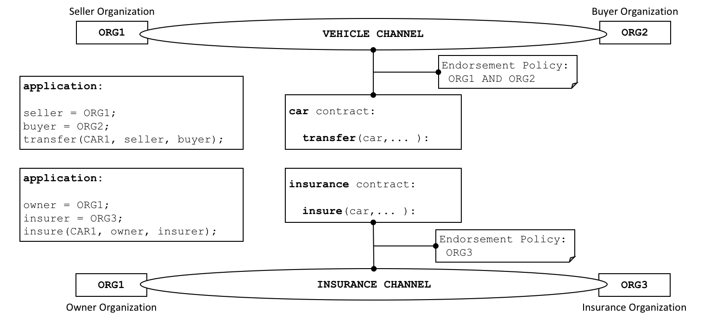

# Smart Contracts and Chaincode

**対象読者**: アーキテクト、アプリケーションおよびスマートコントラクト開発者、管理者

アプリケーション開発者の観点からみると、[台帳](../ledger/ledger.html)と合わせて、**スマートコントラクト**は
Hyperledger Fabricによるブロックチェーンシステムのコアを形成するものです。
台帳はビジネスデータの集合の現在および過去の正しい状態をもっているもので、
**スマートコントラクト**は、台帳に新しく追加される正しいデータを生成する実行可能なロジックを定義するものです。
**チェーンコード**は、通常、管理者が関連するスマートコントラクトをデプロイするためにひとまとめにするのに使われるものですが、
Fabricの低レベルのシステムプログラミングの用途にも使用することができます。
このトピックでは、**スマートコントラクト**と**チェーンコード**がそれぞれなぜ存在するのか、そして、どのようにいつ使うのかについて
注目していきます。

このトピックでは、次のことを扱います。

* [スマートコントラクトとは何か](#smart-contract)
* [用語に関する注意](#terminology)
* [スマートコントラクトと台帳](#ledger)
* [スマートコントラクトの開発の仕方](#developing)
* [エンドースメントポリシーの重要性](#endorsement)
* [正当なトランザクション](#valid-transactions)
* [チャネルとチェーンコード定義](#channels)
* [スマートコントラクト間でのやりとり](#intercommunication)
* [システムチェーンコードとは?](#system-chaincode)

## Smart contract

企業などが互いに取引を行う際には、まず共通の用語、データ、規則、概念の定義、プロセスを含んでいる
共有される契約を結ばなければなりません。
これらの契約は、全体として、取引を行う関係者の間のすべてのやり取りを管理する**ビジネスモデル**を設計することになります。

 *スマートコントラクトは、異なる組織の間の
規則を、実行可能なコードによって定義します。アプリケーションは、台帳に記録されるトランザクションを生成
するために、スマートコントラクトを呼び出します。*

ブロックチェーンネットワークを使うことで、これらの契約を実行可能なプログラム(この業界では**スマートコントラクト**として知られています)
にすることができ、幅広い新しい可能性を開くことができます。
これは、スマートコントラクトが、**いかなる**種類のビジネスデータに対する管理ルールでも実装することができるためで、
スマートコントラクトが実行される際には、そのルールを自動的に強制することができるためです。
例えば、スマートコントラクトは、新車の納車が決められた期間内に行われることを保証するものかもしれませんし、
事前に合意した規定に従って資金が放出されることを保証するものかもしれません。
これらは、それぞれ、モノと資本のフローを改善する例です。
しかし、一番重要なのは、スマートコントラクトの実行は、人間が人手で行うビジネスプロセスと比較して
はるかに効率的なことです。

[上記の図](#smart-contract)では、二つの組織(`ORG1`と`ORG2`)が、車のクエリ(`query`)、
譲渡(`transfer`)、情報の更新(`update`)のために、`car`というスマートコントラクトを
どのように定義しているかがわかります。
ビジネスプロセスで合意した手続きを実行するためには、これらの組織のアプリケーションが
このスマートコントラクトを呼び出します。
例えば、ある車の所有権を`ORG1`から`ORG2`へ譲渡するときなどです。

## Terminology

Hyperledger Fabricのユーザーは、よく**スマートコントラクト**と**チェーンコード**を同じ意味で使っています。
一般的には、スマートコントラクトは、ワールドステートに格納されているビジネスデータのライフサイクルを
コントロールする**トランザクションのロジック**を定義するものです。
そして、ブロックチェーンネットワークにデプロイされるときには、スマートコントラクトはチェーンコードとして
パッケージ化されます。
スマートコントラクトはトランザクションを管理するもの、チェーンコードは、スマートコントラクトがデプロイのために
どのようにパッケージされるかを管理するものと考えてください。

 *スマートコントラクトは、チェーンコード内で
定義されます。一つのチェーンコードの中に複数のスマートコントラクトを定義することもできます。
チェーンコードがデプロイされると、アプリケーションは、そのチェーンコードに含まれるスマートコントラクト全てを
利用することができるようになります。*

この図では、`vehicle`(乗り物)というチェーンコードには、`car`・`boat`・`truck`という3つのスマートコントラクトが
含まれていることがわかります。
また、`insurance`(保険)というチェーンコードには、`policy`・`liability`・`syndication`・`securitization`という
4つのスマートコントラクトが含まれていることがわかります。
どちらのスマートコントラクトも、乗り物と保険に関するビジネスプロセスの重要な側面を扱っています。
このトピックでは、例として、`car`スマートコントラクトを用いていきます。
スマートコントラクトは、あるビジネスプロセスに関連した、ある分野特有のプログラムであり、
チェーンコードは、関連するスマートコントラクト群を、技術的に格納するものであることがわかります。

## Ledger

最も単純にいうと、ブロックチェーンは、台帳のステートを更新するトランザクションをイミュータブルに
記録するものです。スマートコントラクトは、台帳の二つの異なる部分にプログラム的にアクセスします。
一つは、全てのトランザクションの履歴をイミュータブルに記録する**ブロックチェーン**。
もう一つは、ステートの現在の値のキャッシュを保持する**ワールドステート**です。
これは、あるデータの現在値が普通は必要になるためです。

スマートコントラクトは、主に、ワールドステートを設定(**put**)、取得(**get**)、削除(**delete**)し、
また、トランザクションのイミュータブルなブロックチェーンの記録をクエリすることもあります。

* **get**は、あるビジネスデータの現在のステートについての情報を取得するクエリを通常表します。
* **put**は、新しいビジネスデータを作成したり、台帳のワールドステートにある既存のデータの変更を通常行います。
* **delete**は、台帳の現在のステートからビジネスデータを削除することを通常表します。ただし、履歴は削除されません。

スマートコントラクトは多くの[API](../developapps/transactioncontext.html#structure)を利用できます。
トランザクションが、ワールドステートにビジネスデータを作る・読む・更新する・削除する、いずれの場合でも
極めて重要なことは、ブロックチェーンは、それらの変更の[イミュータブルな記録](../ledger/ledger.html)を持っているということです。

## Development

スマートコントラクトは、アプリケーション開発の中心であり、今まで見てきたように、
一つのチェーンコードの中に一つあるいは複数のスマートコントラクトを定義することができます。
チェーンコードをネットワークにデプロイすると、そのネットワーク内の組織が、そのチェーンコード内の
全てのスマートコントラクトを利用可能になります。
すなわち、管理者だけがチェーンコードについて注意する必要があり、管理者以外はスマートコントラクトとして
考えることができるということです。

スマートコントラクトの中心にあるのは、トランザクション(`transaction`)の定義の集合です。
例えば、[この](https://github.com/hyperledger/fabric-samples/blob/{BRANCH}/chaincode/fabcar/javascript/lib/fabcar.js#L93)fabcar.jsを見てみると、
新しい車を作成するスマートコントラクト・トランザクションを見ることができます。

(訳注：上記のリンクは原文の通りですが、リンク切れになっています。たとえば、翻訳時点での最新のソースコードでは[この行](https://github.com/hyperledger/fabric-samples/blob/a461ff581ee0abc968b393df53918480a2605b95/chaincode/fabcar/javascript/lib/fabcar.js#L95)に該当しますが、最新のコード、あるいは利用するFabricのバージョンに対応するコードについては、[fabric-samplesのレポジトリ](https://github.com/hyperledger/fabric-samples/)からたどることをお勧めします)

```javascript
async createCar(ctx, carNumber, make, model, color, owner) {

    const car = {
        color,
        docType: 'car',
        make,
        model,
        owner,
    };

    await ctx.stub.putState(carNumber, Buffer.from(JSON.stringify(car)));
}
```

**FabCar**スマートコントラクトの詳細については、チュートリアルの[Writing your first application](../write_first_app.html)を参照してください。

スマートコントラクトによって、複数の組織の意思決定のデータのイミュータビリティに関わる、ほぼ無限のビジネスユースケースを記述することができます。
スマートコントラクト開発者の役割は、価格や運送条件を決定するといった既存のビジネスプロセスを取り上げ、それをJavaScript・Go・Javaといったプログラミング言語でスマートコントラクトとして記述することです。
スマートコントラクトの作者の間では、多くの法律用語をプログラミング言語に変換するのに必要な、法的および技術的なスキルが使われることが増えています。
スマートコントラクトをどのように設計し開発するかについては、[Developing applicationsのトピック](../developapps/developing_applications.html)を参照してください。

## Endorsement

エンドースメントポリシーは、各チェーンコードに結びついており、そのチェーンコード内で定義されたスマートコントラクト全てに適用されます。
エンドースメントポリシーは非常に重要です。
これは、ブロックチェーンネットワークのどの組織が、そのスマートコントラクトによって生成されたトランザクションに署名しなければならないかを示しています。
これにより、そのトランザクションが**正当である**(valid)といえるかを規定します。

 *各スマートコントラクトには、エンドースメントポリシーが
結びついています。このエンドースメントポリシーは、スマートコントラクトによって生成されたトランザクションが、
正当と認識されるために、どの組織が承認しなければいけないかを示しています。*

エンドースメントポリシーの例としては、トランザクションが**正当**とみなされるために、
ブロックチェーンのネットワークに参加している4組織のうち3組織が署名しなければならない、という定義があるでしょう。
全てのトランザクションは、それが**正当である**(valid)か**正当でない**(invalid)かにかかわらず、分散台帳に加えられますが、
**正当な**トランザクションのみがワールドステートを更新します。

もし、エンドースメントポリシーが、複数の組織が署名しなければならないと規定していた場合、
スマートコントラクトは、正当なトランザクションが生成されるのに十分な組織の集合によって実行されなければなりません。
[上記の](#endorsement)例では、車を譲渡(`transfer`)するトランザクションは、正当とされるためには、
`ORG1`と`ORG2`の両方によって実行され、署名されなければならないでしょう。

Hyperledger FabricがEthereumやBitcoinといった他のブロックチェーンと違うところは、このエンドースメントポリシーです。
他のブロックチェーンでは、ネットワークのどのノードでも正当なトランザクションを生成することができます。
Hyperledger Fabricは、より現実的に実際の世界をモデル化しています。
つまり、トランザクションは、信頼された組織によって検証されなければならない、ということです。
例えば、アイデンティティ発行(`issueIdentity`)の正当なトランザクションには、政府組織が署名していなければなりませんし、
`car`スマートコントラクトの譲渡のトランザクションには、その車の買い手(`buyer`)と売り手(`seller`)の両方が署名していなければなりません。
エンドースメントポリシーによって、Hyperledger Fabricは、このような種類の実際の世界でのやりとりを、よりよくモデル化することができます。

最後に、エンドースメントポリシーは、Hyperledger Fabricにおける[ポリシー](../access_control.html#policies)の一例にすぎません。
他のポリシーには、誰が台帳にクエリあるいは更新ができるのか、あるいはネットワークの参加者を追加・削除できるのか、といったことを
定義できるものがあります。
一般的に、ポリシーはブロックチェーンネットワークにおいて、組織のコンソーシアムによって事前に合意しておくべきものですが、
これは不変のものではありません。
実際、ポリシーは誰によってポリシー自身を変更できるかの規則を定義することができます。
そして、これは高度なトピックになりますが、Fabricの提供するものを上書きして[エンドースメントポリシーをカスタマイズ](../pluggable_endorsement_and_validation.html)することも可能です。

## Valid transactions

スマートコントラクトの実行は、ブロックチェーンネットワークのある組織が所有するピアノード上で行われます。
スマートコントラクトは、**トランザクション提案**と呼ばれる入力パラメータのセットをとり、それをプログラムロジックと合わせて使うことで、台帳の読み書きを行います。
ワールドステートへの変更は**トランザクション提案応答**(もしくは単純に**トランザクション応答**)という形でとらえれます。
提案応答は、トランザクションが読んだステートと、トランザクションが正当となった場合に書き込まれる新しいステートからなる
**読み書きセット**(read-write set)を含んでいます。
ワールドステートは、**スマートコントラクトが実行された時点では更新されない**ということに注意してください。

 *全てのトランザクションは、
識別子、提案、組織の集合によって署名された応答を含んでいます。
全てのトランザクションは正当かどうかにかかわらず、全てブロックチェーンに記録されますが、
正当なトランザクションのみがワールドステートに反映されます。*

車の譲渡(`car transfer`)トランザクションを見てみましょう。
トランザクション`t3`は、`ORG1`と`ORG2`の間で車の譲渡をおこなうものであることがわかります。
このトランザクションは、入力として`{CAR1, ORG1, ORG2}`を持ち、出力として`{CAR1.owner=ORG1, CAR1.owner=ORG2}`を持っており、
これは、`ORG1`から`ORG2`への所有者の変更を表しています。
この入力は、アプリケーションの組織である`ORG1`によって署名されていますが、出力は、エンドースメントポリシーで指定されている組織
`ORG1`と`ORG2`の*両方*によって署名されていることに注意してください。
これらの署名は、それぞれのアクターの秘密鍵によって生成されたもので、
このトランザクションの内容がネットワーク上のすべてのアクターによって合意されたものであることを、
ネットワーク上の誰でも確認することができることを意味します。

ネットワーク上のすべてのピアノードに配布されたトランザクションは、各ピアで2フェーズで検証されます。
最初に、トランザクションがエンドースメントポリシーに従って十分な組織によって署名されているかをチェックします。
次に、ワールドステートの現在の値が、エンドーシングピアノードが署名した時点のトランザクションの読み込みセットと一致しており、
その間に更新がないことをチェックします。
トランザクションが両方のテストに通ると、そのトランザクションは**正当である**としてマークされます。
全てのトランザクションは、それが**正当である**か**正当でないか**にかかわらず、ブロックチェーンの履歴に追加されますが、
**正当である**トランザクションの結果のみが、ワールドステートを更新します。

この例では、`t3`は正当なトランザクションなので、`CAR1`の所有者は`ORG2`に更新されます。
しかし、正当ではないトランザクションの`t4`(図にはありません)は、台帳には記録されますが
ワールドステートは更新されず、`CAR2`の所有者は`ORG2`のままです。

最後に、スマートコントラクトあるいはチェーンコードとワールドステートの使い方については、
[chaincode namespaceのトピック](../developapps/chaincodenamespace.html)を参照してください。

## Channels

Hyperledger Fabricでは、一つの組織は、複数の別のブロックチェーンネットワークに**チャネル**を通して
同時に参加することができます。
複数のチャネルに参加することで、組織は、いわゆる**ネットワークのネットワーク**に参加することができます。
チャネルによって、データとやりとりのプライバシーを保持しつつ、インフラを効率的に共有することができます。
チャネルは、組織が別の取引相手とのトラフィックの分離に役立つのに十分なほど独立でありつつ、
必要があればそれぞれの活動を協調することができるほどには統合されているものです。

 *チャネルは、組織の集合の間での完全に分離した
通信メカニズムを提供します。
チェーンコード定義がチャネルにコミットされると、そのチェーンコードのスマートコントラクトはすべて
そのチャネルのアプリケーションが利用可能になります。*

スマートコントラクトのコードは、チェーンコードパッケージの中という形で組織のピアにインストールされますが、
チャネルのメンバーがスマートコントラクトの実行が可能なのは、チャネルで定義された後のみです。
**チェーンコード定義**は、チェーンコードがどのように運用されるかを管理するパラメータを含む構造体です。
このパラメータには、チェーンコードの名前、バージョン、エンドースメントポリシーを含みます。
各チャネルメンバーは、それぞれの組織でチェーンコード定義を承認することで、チェーンコードのパラメータに同意します。
十分な数の組織(デフォルトでは過半数)が同じチェーンコード定義を承認すると、その定義がチャネルにコミットできるようになります。
そののち、チェーンコードに含まれるスマートコントラクトは、チェーンコード定義に規定されたエンドースメントポリシーに従って、チャネルのメンバーにより実行可能になります。
エンドースメントポリシーは、同じチェーンコードに含まれるすべてのスマートコントラクトに対して同じものが適用されます。

[上記の](#channels)例では、`car`スマートコントラクトは、`VEHICLE`チャネルで定義されており、
`insurance`スマートコントラクトは、`INSURANCE`チャネルで定義されています。
`car`のチェーンコード定義のエンドースメントポリシーは、トランザクションが正当とみなされるには、`ORG1`と`ORG2`の両方により署名されなければならないというものです。
`insurance`スマートコントラクトのチェーンコード定義は、トランザクションのエンドースには`ORG3`のみが必要と指定しています。
`ORG1`は`VEHICLE`チャネルと`INSURACE`ネットワークの両方に参加しており、これら二つのネットワークを通して`ORG2`と`ORG3`と協調した活動を行うことができます。

チェーンコード定義は、チャネルメンバーが、チャネルでトランザクションを発行するためにスマートコントラクトを使いはじめる前に、チェーンコードの管理について合意する方法を提供しています。
上記の例において、`ORG1`と`ORG2`の両方が`car`スマートコントラクトを呼び出すトランザクションをエンドースしたいとします。
デフォルトのポリシーではチェーンコード定義は、過半数の組織によって承認されなければならないので、`AND{ORG1,ORG2}`というエンドースメントポリシーを両方の組織が承認する必要があります。
そうでなく、`ORG1`と`ORG2`が別のチェーンコード定義を承認したとすると、結果としてそのチェーンコード定義をチャネルにコミットすることができなくなるでしょう。
このプロセスによって、`car`スマートコントラクトのトランザクションは、二つの組織によって承認されなければらないということを保証しています。

## Intercommunication

スマートコントラクトは、同じチャネルや異なるチャネルの他のスマートコントラクトを呼び出すことができます。
このようにして、スマートコントラクトのネームスペースの問題で、通常はアクセスできないワールドステートに対して読み書きを行うことができます。

このスマートコントラクト間のやりとりについては制限があり、[chaincode namespace](../developapps/chaincodenamespace.html#cross-chaincode-access)
トピックで十分に解説されています。

## System chaincode

チェーンコード内で定義されたスマートコントラクトは、ブロックチェーンの組織の集合の間で合意されたビジネスプロセスについて
分野依存のルールをエンコードしたものです。
しかし、チェーンコードは、分野に依存しない、ビジネスプロセスのためのスマートコントラクトとは関係のない、*システムの*やりとりに対応する低レベルなプログラムコードを定義することができます。

システムチェーンコードの種類とその略語は、下記の通りです。

* `_lifecycle` は、すべてのピアで実行され、ピアでのチェーンコードのインストール、チェーンコード定義の組織での承認、チャネルへのチェーンコード定義のコミットを管理します。
  `_lifecycle`がどのようにFabricのチェーンコードライフサイクルを実装しているかの詳細については、[process](../chaincode_lifecycle.html)を参照してください。

* ライフサイクル・システムチェーンコード(LSCC)は、Fabricの1.xリリースでのチェーンコードライフサイクルを管理します。
  このバージョンのライフサイクルは、チェーンコードをチャネルでインスタンス化(instantiate)・アップグレードする必要がありました。
  チャネルのアプリケーションケーパビリティがV1_4_x以下に設定されている場合は、まだLSCCをチェーンコードの管理に使い続けることができます。

* コンフィギュレーション・システムチェーンコード(CSCC)は、すべてのピアで実行され、ポリシーの更新といったチャネルのコンフィギュレーションを管理します。
  このプロセスについては、このチェーンコードの[トピック](../configtx.html#configuration-updates)を参照してください。

* クエリ・システムチェーンコード(QSCC)は、すべてのピアで実行され、ブロックのクエリやトランザクションのクエリを含む台帳のAPIを提供します。
  台帳のAPIについては、トランザクション・コンテキストの[トピック](../developapps/transactioncontext.html)を参照してください。

* エンドースメント・システムチェーンコード(ESCC)は、エンドーシングピアで実行され、トランザクション応答に対して暗号的に署名を行います。
  ESCCのこのプロセスの実装については、[こちら](../peers/peers.html#phase-1-proposal)を参照してください。

* 検証システムチェーンコード(VSCC)は、エンドースメントポリシーのチェックや読み書きセットのバージョンのチェックを含むトランザクションの検証を行います。
  VSCCのこのプロセスの実装については、[こちら](../peers/peers.html#phase-3-validation)を参照してください。

低レベルのFabric開発者や管理者は、これらのシステムチェーンコードを自分の用途のために変更することができます。
しかし、システムチェーンコードの開発と管理は、非常に特化した作業であり、スマートコントラクトの開発とはきわめて異なるもので、通常必要となるものではありません。
システムチェーンコード、Hyperledger Fabricのネットワークの正しい動作の基礎となるものなので、変更は細心の注意をもって行わなければなりません。
例えば、もしシステムチェーンコードが正しく開発されなかった場合、ワールドステートやブロックチェーンに対して、あるピアノードは他のピアのノードとは異なる更新を行ってしまうかもしれません。
この合意形成が失われている状態は、**台帳のフォーク**の一種であり、非常に好ましくない状況です。

<!--- Licensed under Creative Commons Attribution 4.0 International License
https://creativecommons.org/licenses/by/4.0/ -->
