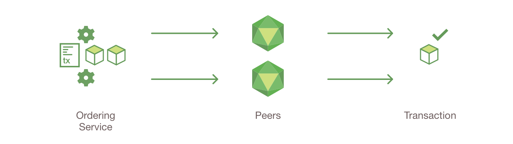

Transaction Flow
================

この文書では、標準的なアセットの交換時に行われるトランザクションの仕組みについて説明します。このシナリオには、ラディッシュを売買する2人の顧客AとBが含まれています。彼らはそれぞれ、ネットワーク上にピアを持ち、それを通じてトランザクションを送信し、台帳をやりとりします。

.. image:: images/step0.png

**Assumptions**

このフローは、チャネルが設定され、実行中であることを前提としています。アプリケーションユーザーは、組織の認証局(CA)に登録し、ネットワークへの認証に使用されるのに必要な暗号マテリアルを受け取りました。

チェーンコード(ラディッシュマーケットの初期状態を表すキーバリューのペアのセットを含む)は、ピアにインストールされ、チャネルにデプロイされます。チェーンコードには、トランザクション命令のセットとラディッシュの合意価格を定義するロジックが含まれています。このチェーンコードにもエンドースメントポリシーが設定されており、 ``peerA`` と ``peerB`` の両方がいずれかのトランザクションにエンドースしなければならないことになっています。

.. image:: images/step1.png

1. **クライアントAがトランザクションを開始する**

どうなっているのでしょうか?クライアントAは、ラディッシュを購入するための要求を送っています。この要求は、クライアントAとクライアントBをそれぞれ代表する ``peerA`` と ``peerB`` を対象としています。エンドースメントポリシーは、両方のピアがいずれかのトランザクションをエンドースする必要があるとしているので、要求は ``peerA`` と ``peerB`` へ向います。

次に、トランザクション提案を構築します。サポートされているSDK(Node、Java、Python)を利用するアプリケーションは、利用可能なAPIの1つを利用してトランザクション提案を生成します。この提案は、台帳を読み出しおよび/または更新する目的で、特定の入力パラメータを有するチェーンコード関数を呼び出すための要求です。

SDKは、トランザクション提案を適切に設計された形式(gRPC上のプロトコルバッファ)にパッケージ化するshimとして機能し、ユーザーの暗号資格情報を使用してこのトランザクション提案用のユニークな署名を生成します。

.. image:: images/step2.png

2. **エンドーシングピアは署名を確認し、取引を実行する**

エンドーシングピアは、(1)トランザクション提案が適切に形成されていること、(2)過去にすでに提出されていないこと(リプレイ攻撃保護)、(3)署名が正当なであること(MSPを使用)、および(4)サブミッタ(この例ではクライアントA)がそのチャネルに対して提案された操作を実行するための適切な権限を与えられていること(すなわち、各エンドーシングピアは、サブミッタがチャネルの *Writers* ポリシーを満たすことを保証する)を検証します。エンドーシングピアは、トランザクション提案の入力を、呼び出されたチェーンコードの関数への引数として取ります。次に、チェーンコードは現在のステートデータベースに対して実行され、応答の値、読み込みセット、および書き込みセット(つまり、作成するまたは更新するアセットを表すキー/値のペア)を含むトランザクション結果を生成します。この時点では台帳の更新は行われていません。これらの値のセットは、エンドーシングピアの署名とともに「提案応答」としてSDKに返され、SDKはペイロードを解析してアプリケーションを消費します。

.. note:: MSPはピアコンポーネントであり、ピアがクライアントから到着したトランザクション要求を確認し、トランザクション結果(エンドースメント)に署名できるようにします。ライティングポリシーは、チャネル作成時に定義され、どのユーザーがそのチャンネルにトランザクションを送信する権利があるかを決定します。メンバーシップの詳細については、 :doc:`membership/membership` ドキュメントをご覧ください。

.. image:: images/step3.png

3. **提案応答を調査する**

アプリケーションは、エンドーシングピアの署名を検証し、提案応答を比較して、その提案の応答が同じであるかどうかを判断します。チェーンコードが台帳のみをクエリしている場合、アプリケーションはクエリ応答のみを検査し、通常はトランザクションをオーダリングサービスに送信しません。クライアントアプリケーションがトランザクションをオーダリングサービスに送信し、台帳を更新することを意図している場合、アプリケーションは、指定されたエンドースメントポリシーが送信前に満たされているかどうかを判断します(つまり、peerAとpeerBの両方がエンドースします)。アーキテクチャは、アプリケーションが応答を検査しないことを選択したり、エンドースされていないトランザクションを転送したりする場合でも、エンドースメントポリシーは依然としてピアによって施行され、コミットの検証フェーズで維持されます。

.. image:: images/step4.png

4. **クライアントはエンドースメントをトランザクションに組み込む**

アプリケーションは、「トランザクションメッセージ」内のトランザクション提案及び応答をオーダリングサービスに「ブロードキャスト」します。トランザクションには、読み込み/書き込みセット、エンドーシングピアの署名、およびチャネルIDが含まれます。オーダリングサービスは、その操作を実行するためにトランザクションの内容全体を検査する必要はなく、単にネットワーク内のすべてのチャネルからトランザクションを受信し、それらをチャネルごとに時系列で順序付けし、チャネルごとにトランザクションのブロックを作成します。

5. **トランザクションを検証し、コミットする**

トランザクションのブロックは、チャネル上のすべてのピアに「配信」されます。ブロック内のトランザクションは、エンドースメントポリシーが満たされていることを確認し、トランザクションの実行によって読み込みセットが生成されて以来、読み込みセットの変数の台帳のステートに変更がないことを確認するために検証されます。ブロック内のトランザクションは、正当か正当でないかタグ付けされます。

.. image:: images/step6.png

6. **台帳を更新する**

各ピアはブロックをチャネルのチェーンに追加し、各正当なトランザクションに対して、書き込みセットは現在のステートデータベースにコミットされます。各ピアからイベントが発信され、トランザクション(呼び出し)がイミュータブルにチェーンに追加されたことをクライアントアプリケーションに通知するとともに、トランザクションが有効か無効かを通知します。

.. note:: アプリケーションは、トランザクションを提出した後にトランザクションイベントについてlistenする必要があります。例えば、トランザクションイベントについて自動的にlistenする ``submitTransaction`` APIを使用します。コミットを待つことは必要不可欠で、もし、これがなければ、トランザクションの順序付け、検証、台帳へのコミットが成功したかどうかを知ることができないでしょう。

下のスイムレーンシーケンス図を使用して、トランザクションフローをより詳細に調べることもできます。

.. image:: images/flow-4.png

.. Licensed under Creative Commons Attribution 4.0 International License
   https://creativecommons.org/licenses/by/4.0/
