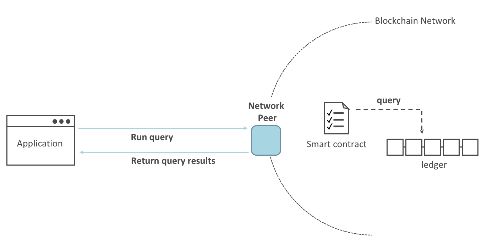
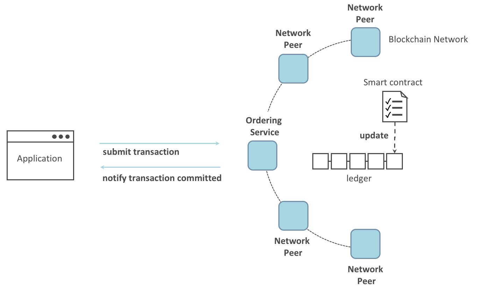

Writing Your First Application
==============================

.. note:: Fabricネットワークの基本的なアーキテクチャにまだ慣れていない場合は、先に進む前に
          :doc:`key_concepts` のセクションを参考にしてください。

          また、このチュートリアルでは、シンプルなスマートコントラクトとアプリケーションを使用してFabricのアプリケーションの概要を説明します。
          Fabricのアプリケーションとスマートコントラクトの詳細については、 :doc:`developapps/developing_applications` セクションまたは :doc:`Commercial Paper Tutorial<tutorial/commercial_paper>` を参照してください。

このチュートリアルでは、Fabricアプリケーションと、デプロイされたブロックチェーンネットワークとのやりとりについて説明します。
Fabric SDKを使用して構築されたサンプル・プログラムを使用します。サンプル・プログラムの詳細については、:doc:`Application</developapps/application>` トピックを参照してください。スマートコントラクトを実行すると、
スマートコントラクトAPIを使用して台帳の参照と更新が行われます。詳細については、 :doc:`Smart Contract Processing</developapps/smartcontract>` を参照してください。
また、サンプル・プログラムとデプロイされたCAを使用して、アプリケーションが許可型のブロックチェーンと接続するために必要なX.509証明書を生成します。

**About Asset Transfer**

このAsset Transfer (basic)サンプルでは、どのように資産の台帳を初期化し、それらの資産をクエリし、新しい資産を作成し、資産IDをもとに一つの資産をクエリし、既存の資産を更新し、また資産を新しい所有者に譲渡するかを示します。
これには、次の2つのコンポーネントが含まれます。

  1.サンプル・アプリケーションはチェーンコード(スマートコントラクト)に実装されたトランザクションを実行して、ブロックチェーン・ネットワークに接続します。アプリケーションは ``fabric-samples`` の下記のディレクトリにあります。

  .. code:: bash

    asset-transfer-basic/application-javascript

  2.スマートコントラクトは、台帳とのやりとりを含むトランザクションを実装します。スマートコントラクト(チェーンコード)は、 ``fabric-samples`` の下記のディレクトリにあります。

  .. code:: bash

    asset-transfer-basic/chaincode-(javascript, java, go, typescript)

このチュートリアルの内容においては、チェーンコードとスマートコントラクトという二つの用語は同じ意味で用いていることに注意してください。
この例では、javascriptのチェーンコードを用います。

ここでは、3つの主要なステップを実行します。

  **1. 開発環境の設定**
  このアプリケーションと接続するためのネットワークが必要なので、スマートコントラクトとアプリケーションのための基本的なネットワークをデプロイします。

  .. image:: images/AppConceptsOverview.png

  **2. サンプルのスマートコントラクトを確認**
  サンプルのassetTransfer (javascript) スマートコントラクトを調べて、その中のトランザクションと、アプリケーションがトランザクションを使用して台帳にクエリしたり、更新したりする方法について学習します。

  **3. サンプルアプリケーションを利用してスマートコントラクトを操作**
  このアプリケーションでは、assetTransfer スマートコントラクトを使用して、台帳に記録された資産へのクエリと更新を行います。
  ここでは、資産で台帳の初期化、ある資産のクエリ、ある範囲の資産のクエリ、新しい資産の作成など、アプリケーションのコードとそのアプリケーションが作成するトランザクションについて説明します。

このチュートリアルを完了すると、ブロックチェーンネットワークの分散台帳上のデータを管理するために、Fabricアプリケーションとスマートコントラクトがどのように連携して動作するのかについて、基本的な理解が得られます。

Before you begin
----------------

このチュートリアルでは、Fabricの :doc:`標準的なソフトウェア <prereqs>` に加えて、Hyperledger Fabric SDK for Node.jsを活用します。
前提条件の最新リストについては、Node.js SDK `README <https://github.com/hyperledger/fabric-sdk-node#build-and-test>`__ を参照してください。

- もしあなたがmacOSを使用している場合は、次の手順を実行します。

  1. `Homebrew <https://brew.sh/>`__ をインストールしてください。
  2. インストールするNode SDKのバージョンを確認するには、Node SDK `prerequisites <https://github.com/hyperledger/fabric-sdk-node#build-and-test>`__ をチェックしてください。
  3. ``brew install node`` を実行して、nodeの最新バージョンをダウンロードするか、または特定のバージョンを選択します。たとえば、前提条件でサポートされている内容に応じて、``brew install node@10`` を実行します。
  4. ``npm install`` を実行してください。

- Windowsの場合は、以下のnpmコマンドで、必要なコンパイラとツールである `windows-build-tools <https://github.com/felixrieseberg/windows-build-tools#readme>`__ をインストールできます。

  .. code:: bash

    npm install --global windows-build-tools

- Linuxを使っている場合、`Python v2.7 <https://www.python.org/download/releases/2.7/>`__ 、`make <https://www.gnu.org/software/make/>`__ 、そして `GCC <https://gcc.gnu.org/>`__ のようなC/C++コンパイラツールをインストールする必要があります。

  .. code:: bash

    sudo apt install build-essential

Set up the blockchain network
-----------------------------

既に :doc:`Using the Fabric test network<test_network>` を実行していて、ネットワークを起動して実行している場合、このチュートリアルは新しいネットワークを起動する前に、実行中のネットワークを停止します。

Launch the network
^^^^^^^^^^^^^^^^^^

.. note:: このチュートリアルでは、Asset TransferスマートコントラクトとアプリケーションのJavaScriptバージョンで紹介しますが、 ``fabric-samples`` リポジトリには、このサンプルのGo、Java、TypeScriptバージョンも含まれています。
  Go、Java、またはTypeScriptのバージョンを試すには、下記の ``./network.sh deployCC -ccl javascript`` の ``javascript`` 引数を ``go`` 、 ``java`` 、または ``typescript`` に変更し、ターミナルに表示された指示に従ってください。
  JavaScriptのアプリケーションサンプルとほかの言語のチェーンコードサンプルを同時に使うことができます(たとえば、goチェーンコード関数を呼ぶJavaScriptアプリケーション、TypeScriptのチェーンコード関数を呼ぶJavaScriptアプリケーションなど)

ローカルの ``fabric-samples`` リポジトリの ``test-network`` サブディレクトリに移動します。

.. code:: bash

  cd fabric-samples/test-network

もしすでにテストネットワークが動いているのであれば、それを停止させて、環境をきれいにします。

.. code:: bash

  ./network.sh down

``network.sh`` シェルスクリプトを使ってFabricテストネットワークを起動します。

.. code:: bash

  ./network.sh up createChannel -c mychannel -ca

このコマンドは、2つのピアと1つのオーダリングサービス、3つのCA(Orderer、Org1、Org2)で構成されたFabricテストネットワークをデプロイします。
cryptogen toolを使用する代わりに、証明局を使用してテストネットワークを起動するので、 ``-ca`` フラグを使います。
さらに、証明局が開始したときに、組織のadminユーザーは初期設定されます。
後の手順で、どのように、アプリケーションがadminとしてエンロールを完了するかを説明します。

次に、チェーンコードの名前と言語のオプションを指定して ``network.sh`` スクリプトを使って、チェーンコードをデプロイしてみましょう。

.. code:: bash

  ./network.sh deployCC -ccn basic -ccp ../asset-transfer-basic/chaincode-javascript/ -ccl javascript

.. note:: 実際には、このスクリプトはチェーンコードライフサイクルを使用して、パッケージ化・インストール・インストールされたチェーンコードのクエリ、Org1とOrg2両方でチェーンコードの承認、最後にチェーンコードのコミットを行っています。

チェーンコードが無事にデプロイされると、ターミナルの表示の最後は、次のようなものになるはずです。

.. code:: bash

  Committed chaincode definition for chaincode 'basic' on channel 'mychannel':
  Version: 1.0, Sequence: 1, Endorsement Plugin: escc, Validation Plugin: vscc, Approvals: [Org1MSP: true, Org2MSP: true]
  ===================== Query chaincode definition successful on peer0.org2 on channel 'mychannel' =====================

  ===================== Chaincode initialization is not required =====================

Sample application
^^^^^^^^^^^^^^^^^^
次に、デプロイされたチェーンコードとやりとりを行う、サンプルのAsset Transfer Javascriptアプリケーションを準備しましょう。

- `JavaScript版アプリケーション <https://github.com/hyperledger/fabric-samples/blob/master/asset-transfer-basic/application-javascript>`__

GoとJava版のサンプルアプリケーションもあり、下記のリンクから参照できます。

- `Go版アプリケーション <https://github.com/hyperledger/fabric-samples/blob/master/asset-transfer-basic/application-go>`__
- `Java版アプリケーション <https://github.com/hyperledger/fabric-samples/blob/master/asset-transfer-basic/application-java>`__

新しいターミナルを開き、 ``application-javascript`` フォルダに移動してください。

.. code:: bash

  cd asset-transfer-basic/application-javascript

このディレクトリには、Fabric SDK for Node.jsを使用して開発されたサンプルプログラムが格納されています。
次のコマンドを実行して、アプリケーションの実行に必要なモジュールをインストールします。完了までに1分かかることもあります。

.. code:: bash

  npm install

このプロセスは、 アプリケーションの ``package.json`` で定義されたアプリケーションに必要なモジュールをインストールします。
その中で最も重要なのは ``fabric-network`` というNode.jsのモジュールです。このモジュールを使用すると、アプリケーションはアイデンティティ、ウォレット、ゲートウェイを使用してチャネルに接続し、トランザクションを送信し、実行結果を待ちます。
また、このチュートリアルでは、 ``fabric-ca-client`` モジュールを使用してユーザをそれぞれのCAに登録し、 ``fabric-network`` モジュールがブロックチェーンネットワークとやりとりするのに使う有効なアイデンティティを生成します。

``npm install`` が完了すると、アプリケーションを実行するためのすべての準備が整います。
このチュートリアルで使用するサンプルのJavaScriptアプリケーションのファイルを見てみましょう。
次のコマンドを実行して、このディレクトリにあるファイルのリストを表示してください。

.. code:: bash

  ls

次のように表示されます。

.. code:: bash

  app.js                  node_modules            package.json       package-lock.json

.. note:: 次のセクションの最初の部分では、CAとの通信について説明します。
          新しいターミナルを開いて ``docker logs -f ca_org1`` を実行することで、今後のプログラムを実行する際にCAログをストリームすることができて便利です。

Fabricテストネットワークを作った時、管理者ユーザー（ ``admin`` と呼ばれる）が認証局（CA）の **登録管理者（Register）** として作られました。
最初のステップは、アプリケーションに ``enrollAdmin`` を呼んでもらうことで、 ``admin`` 用の秘密鍵、公開鍵、X.509証明書を生成することです。
このプロセスでは、**Certificate Signing Request** （CSR）が使用されます。
まず、秘密鍵と公開鍵がローカルで生成され、公開鍵がCAに送信されます。CAは、アプリケーションで使用するためにエンコードされた証明書を返します。
これらの認証情報はウォレットに格納され、CAの管理者として機能できるようになります。

アプリケーションを動かし、スマートコントラクトとのやりとりの一つ一つを順に実行していきましょう。
``asset-transfer-basic/application-javascript`` ディレクトリで、次のコマンドを実行してください。

.. code:: bash

  node app.js

First, the application enrolls the admin user
---------------------------------------------

.. note:: adminとしてエンロールし、アプリケーションユーザーを実行するのは、アプリケーションと証明局の間でのやりとりであって、アプリケーションとチェーンコードの間のやりとりではないということに注意するのは非常に大切です。もし、 ``asset-transfer-basic/chaincode-javascript/lib`` にあるチェーンコードを調べたら、adminとしてエンロールしたり、ユーザーを登録するような機能が、チェーンコード内にはないことがわかるでしょう。

下記のサンプルアプリケーションのコードでは、共通のコネクションプロファイルのパスへの参照を取得し、コネクションプロファイルが実在することを確かめ、どこにウォレットを作成するかを指定したあと、 ``enrollAdmin()`` が実行され、証明局によってadminの認証情報が生成されます。

.. code:: bash

  async function main() {
    try {
      // ネットワーク設定を含むインメモリのオブジェクト(コネクションプロファイルとも呼ばれる)を生成
      const ccp = buildCCP();

      // ネットワーク設定にある情報をもとに、Fabric CAサービスクライアントのインスタンスを生成
      const caClient = buildCAClient(FabricCAServices, ccp);

      // アプリケーションユーザーの認証情報を保持するウォレットのセットアップ
      const wallet = await buildWallet(Wallets, walletPath);

      // 実際のアプリケーションでは、管理者のフローでただ一回だけ実行されるはず
      await enrollAdmin(caClient, wallet);

このコマンドは、CA管理者の認証情報を ``wallet`` ディレクトリに保存します。
``wallet/admin.id`` に管理者の証明書と秘密鍵があります。

.. note:: もし、ネットワークを停止し、再度立ち上げる場合には、 再度JavaScriptアプリケーションを起動する前に、``wallet`` フォルダとその中のアイデンティティを削除する必要があるでしょう。さもなければエラーとなります。これは、認証局とそのデータベースは、テストネットワークが停止したときに削除されているのに、application-javascriptディレクトリの中に元のウォレットがまだ残っているためで、ウォレットを削除しなければなりません。JavaScriptサンプルアプリケーションを再度起動すると、新しいウォレットと認証情報が生成されます。

ターミナルの出力の最初にスクロールを戻すと、次のような表示があるはずです。

.. code:: bash

  Wallet path: /Users/<your_username>/fabric-samples/asset-transfer-basic/application-javascript/wallet
  Successfully enrolled admin user and imported it into the wallet

認証局が開始したときに、adminの登録手順が初期実行されているため、adminをエンロールするだけですむのです。

.. note:: Fabric CAとのやりとりは、サンプル間で共通なので、enrollAdmin()やそのほかのCA関係の関数は、 ``fabric-samples/test-application/javascript/CAUtil.js`` という共通ユーティリティーに含まれています。

アプリケーションのユーザーに関しては、アプリケーションが次の手順で登録しエンロールする必要があります。

Second, the application registers and enrolls an application user
-----------------------------------------------------------------

管理者の認証情報がウォレットにあるので、アプリケーションは ``admin`` ユーザーを使って、ブロックチェーンネットワークとやりとりをするのに使用するアプリケーションユーザーの登録とエンロールを行うことができます。
アプリケーションコードでのこの部分は次の通りです。

.. code:: bash

  // 実際のアプリケーションでは、新しいユーザーの追加が必要なときにのみ行われ、管理者のフローの一部であるはず
  await registerAndEnrollUser(caClient, wallet, mspOrg1, org1UserId, 'org1.department1');

adminのエンロールと同じように、この関数はCSRを用いて ``appUser`` の登録とエンロールを行い、その認証情報をウォレットに ``admin`` と同じように格納します。
これで、 ``admin`` と ``appUser`` という二つの異なるユーザーのアイデンティティが、アプリケーションによって使用できることになります。

ターミナルの出力をさらに下にスクロールしていくと、下記のようなアプリケーションユーザーの登録の確認メッセージがあるはずです。

.. code:: bash

  Successfully registered and enrolled user appUser and imported it into the wallet

Third, the sample application prepares a connection to the channel and smart contract
-------------------------------------------------------------------------------------

ここまでの手順で、アプリケーションは、adminとアプリケーションユーザーの認証情報を生成し、ウォレットに格納しました。
この認証情報が存在し、それに正しくーミッション属性が紐づいていれば、サンプルアプリケーションユーザーは、チャネル名とコントラクト名を取得すれば、チェーンコード関数を呼ぶことができるようになります。

.. note:: ここで使うコネクションプロファイルは、自分のOrgのピアのみを指定しています。
          クライアントSDKに対して、(ピアで動いている)サービスディスカバリを使用するよう指示することで、SDKは、現在オンラインであるほかのピア、関係するエンドースポリシーのようなメタデータ、また、ほかのノードと通信するのに必要となる静的な情報を取得します。
          ここでクライアントは、ほかのFabricのノードと同じネットワーク上で動いているため、 ``asLocalhost`` を ``true`` に設定することで、SDKが、localhostとして接続するようにしています。
          クライアントがほかのFabricのノードと同じネットワークで動いていないデプロイ環境では、 ``asLocalhost`` オプションは ``false`` にセットすることになるでしょう。

アプリケーションコードの下記の行で、アプリケーションが、コントラクト名とチャネル名を使って、Gatewayを介してContractへの参照を取得しているのに気づくでしょう。

.. code:: bash

  // Fabricネットワークとやりとりする新しいGatewayインスタンスを作成。
  // 実際のアプリケーションは、確認されたユーザーに対するバックエンドサーバーのセッションの初期化で行われるはず
  const gateway = new Gateway();

  try {
    // ゲートウェイインスタンスの初期化。
    // ユーザーは、Fabricネットワークに対して接続を行うことができ、トランザクションを送信しクエリを行うことができるようになる。
    // このゲートウェイで送信されるすべてのトランザクションは、ウォレットに格納された認証情報を利用して、このユーザーによって署名される。
    await gateway.connect(ccp, {
      wallet,
      identity: userId,
      discovery: {enabled: true, asLocalhost: true} // using asLocalhost as this gateway is using a fabric network deployed locally
    });

    // スマートコントラクトがデプロイされているチャネルに基づいて、Networkインスタンスを作成
    const network = await gateway.getNetwork(channelName);

    // networkからコントラクトを取得
    const contract = network.getContract(chaincodeName);

チェーンコードパッケージが複数のスマートコントラクトを含む場合、 `getContract() API <https://hyperledger.github.io/fabric-sdk-node/release-2.2/module-fabric-network.Network.html#getContract>`__ で、チェーンコード名と対象の特定のスマートコントラクトの名前を指定することができます。例えば、以下の通りです。

.. code:: bash

  const contract = await network.getContract('chaincodeName', 'smartContractName');

Fourth, the application initializes the ledger with some sample data
--------------------------------------------------------------------

では、サンプルアプリケーションでトランザクションを送信するところまできたので、順を追って見ていきましょう。
アプリケーションコードの一部、呼び出されるチェーンコードの一部は、それぞれ呼ばれる関数ごとに、ターミナルの出力とともに示していきます。

チェーンコードの ``InitLedger`` 関数を呼び出し、台帳にいくつかのサンプルデータを入れるのにsubmitTransaction()関数が使われます。
submitTransaction()関数は、内部では、サービスディスカバリを使ってチェーンコードに対して必要なエンドーシングピアのセットを取得し、チェーンコードを必要な数のピア上で実行し、それらのピアからエンドースされた結果を集め、最後にオーダリングサービスにトランザクションを送信します。

サンプルアプリケーションの ``'InitLedger'`` の呼び出し:

.. code:: bash

  // チェーンコードの'InitLedger'関数を使って、チャネルの資産データセットを初期化。
  // この種類のトランザクションは、アプリケーションによって最初にデプロイされ最初に開始したときに一回だけ実行されるだろう。
  // これより後チェーンコードに対する更新は、"init"タイプの関数を動かす必要になることはあまりないだろう。
  console.log('\n--> Submit Transaction: InitLedger, function creates the initial set of assets on the ledger');
  await contract.submitTransaction('InitLedger');
  console.log('*** Result: committed');

チェーンコードの ``'InitLedger'`` 関数:

.. code:: bash

   async InitLedger(ctx) {
        const assets = [
            {
                ID: 'asset1',
                Color: 'blue',
                Size: 5,
                Owner: 'Tomoko',
                AppraisedValue: 300,
            },
            {
                ID: 'asset2',
                Color: 'red',
                Size: 5,
                Owner: 'Brad',
                AppraisedValue: 400,
            },
            {
                ID: 'asset3',
                Color: 'green',
                Size: 10,
                Owner: 'Jin Soo',
                AppraisedValue: 500,
            },
            {
                ID: 'asset4',
                Color: 'yellow',
                Size: 10,
                Owner: 'Max',
                AppraisedValue: 600,
            },
            {
                ID: 'asset5',
                Color: 'black',
                Size: 15,
                Owner: 'Adriana',
                AppraisedValue: 700,
            },
            {
                ID: 'asset6',
                Color: 'white',
                Size: 15,
                Owner: 'Michel',
                AppraisedValue: 800,
            },
        ];

        for (const asset of assets) {
            asset.docType = 'asset';
            await ctx.stub.putState(asset.ID, Buffer.from(JSON.stringify(asset)));
            console.info(`Asset ${asset.ID} initialized`);
        }
    }

ターミナルの出力は次のようなもののはずです。

.. code:: bash

  Submit Transaction: InitLedger, function creates the initial set of assets on the ledger

Fifth, the application invokes each of the chaincode functions
--------------------------------------------------------------

最初に、台帳のクエリに関してひとこと。

ブロックチェーンネットワークの各ピアは、 `台帳 <./ledger/ledger.html>`_ のコピーをそれぞれ持っています。
アプリケーションプログラムは、クエリと呼ばれる読み取り専用のスマートコントラクトの呼び出しによって、台帳から一番新しいデータを見ることができます。

クエリがどのように動くのかを、簡単に表したのが次の図です。

最も一般的なクエリは、台帳のデータの現在の値、すなわち `ワールドステート <./ledger/ledger.html#world-state>`_ に関するものです。
ワールドステートは、キーバリューのペアの集まりとして表現され、アプリケーションは一つまたは複数のキーに対するデータをクエリすることができます。
加えて、CouchDBをステートデータベースで用いて、データをJSONでモデル化している場合は、台帳のデータの読み取りに複雑なクエリを使うことができます。
これは、ある特定の値にあるキーワードをもつすべての資産、例えば、特定の所有者の全ての資産を探すとき時に非常に役に立ちます。

以下では、サンプルアプリケーションは、前の手順で台帳をデータで初期化した際に入力した資産全てを取得しています。
evaluateTransaction() 関数は、オーダリングサービスにトランザクションを送ることなく、あるピアにクエリするときに使います。

サンプルアプリケーションの ``'GetAllAssets'`` 呼び出し:

.. code:: bash

  // クエリ型の操作(関数)を試してみよう。
  // これは1ピアにだけ送られて、その結果を表示する。
  console.log('\n--> Evaluate Transaction: GetAllAssets, function returns all the current assets on the ledger');
  let result = await contract.evaluateTransaction('GetAllAssets');
  console.log(`*** Result: ${prettyJSONString(result.toString())}`);

チェーンコードの ``'GetAllAssets'`` 関数:

.. code:: bash

   // GetAllAssetsはワールドステートにあるすべての資産を返す
    async GetAllAssets(ctx) {
        const allResults = [];
        // startKeyとendKeyに空文字列を指定したレンジクエリは、チェーンコードネームスペース内のすべての資産の無制限なクエリを行う
        const iterator = await ctx.stub.getStateByRange('', '');
        let result = await iterator.next();
        while (!result.done) {
            const strValue = Buffer.from(result.value.value.toString()).toString('utf8');
            let record;
            try {
                record = JSON.parse(strValue);
            } catch (err) {
                console.log(err);
                record = strValue;
            }
            allResults.push({ Key: result.value.key, Record: record });
            result = await iterator.next();
        }
        return JSON.stringify(allResults);
    }

端末の出力は次のようなものになるはずです。

.. code:: json

    Evaluate Transaction: GetAllAssets, function returns all the current assets on the ledger
    Result: [
    {
      "Key": "asset1",
      "Record": {
        "ID": "asset1",
        "Color": "blue",
        "Size": 5,
        "Owner": "Tomoko",
        "AppraisedValue": 300,
        "docType": "asset"
      }
    },
    {
      "Key": "asset2",
      "Record": {
        "ID": "asset2",
        "Color": "red",
        "Size": 5,
        "Owner": "Brad",
        "AppraisedValue": 400,
        "docType": "asset"
      }
    },
    {
      "Key": "asset3",
      "Record": {
        "ID": "asset3",
        "Color": "green",
        "Size": 10,
        "Owner": "Jin Soo",
        "AppraisedValue": 500,
        "docType": "asset"
      }
    },
    {
      "Key": "asset4",
      "Record": {
        "ID": "asset4",
        "Color": "yellow",
        "Size": 10,
        "Owner": "Max",
        "AppraisedValue": 600,
        "docType": "asset"
      }
    },
    {
      "Key": "asset5",
      "Record": {
        "ID": "asset5",
        "Color": "black",
        "Size": 15,
        "Owner": "Adriana",
        "AppraisedValue": 700,
        "docType": "asset"
      }
    },
    {
      "Key": "asset6",
      "Record": {
        "ID": "asset6",
        "Color": "white",
        "Size": 15,
        "Owner": "Michel",
        "AppraisedValue": 800,
        "docType": "asset"
      }
    }
  ]

次に、サンプルアプリケーションは、'asset13'を作成するトランザクションを送信します。

サンプルアプリケーションの ``'CreateAsset'`` の呼び出し:

.. code:: bash

  // トランザクションを送信してみよう。
  // これは両方のピアに送られ、両方のピアがトランザクションにエンドースすると、エンドースされた提案がordererに送られる。そして、各ピアのチャネルの台帳にコミットされる。
  console.log('\n--> Submit Transaction: CreateAsset, creates new asset with ID, color, owner, size, and appraisedValue arguments');
  await contract.submitTransaction('CreateAsset', 'asset13', 'yellow', '5', 'Tom', '1300');
  console.log('*** Result: committed');

チェーコードの ``'CreateAsset'`` 関数

.. code:: bash

  // CreateAssetは、ワールドステートに新しい資産を与えられた詳細情報で発行する
  async CreateAsset(ctx, id, color, size, owner, appraisedValue) {
    const asset = {
        ID: id,
        Color: color,
        Size: size,
        Owner: owner,
        AppraisedValue: appraisedValue,
    };
    return ctx.stub.putState(id, Buffer.from(JSON.stringify(asset)));
  }

ターミナルの出力:

.. code:: bash

  Submit Transaction: CreateAsset, creates new asset with ID, color, owner, size, and appraisedValue arguments

.. note:: 上記のアプリケーションとチェーンコードの抜粋では、サンプルアプリケーションが ``'CreateAsset'`` トランザクションを、チェーンコードが期待するのと同じ型と数の正しい順序の引数を送っているのに注目するのが大切です。
          この場合、トランザクション名と正しい順序の引数は、 ``'CreateAsset'`` 、 ``'asset13'`` 、 ``'yellow'`` 、 ``'5'`` 、 ``'Tom'`` 、 ``'1300'`` です。
          なぜなら、対応するチェーンコードのCreateAssetは、次の順序と型で資産を定義する引数を期待しているからです。

          順序: ID、Color、Size、Owner、AppraisedValue

          型: ID (string)、Color (string)、Size (int)、Owner (string)、AppraisedValue (int)

次に、サンプルアプリケーションは 'asset13' へのクエリを評価(evaluate)します。

サンプルアプリケーションの ``'ReadAsset'`` 呼び出し:

  .. code:: bash

    console.log('\n--> Evaluate Transaction: ReadAsset, function returns an asset with a given assetID');
    result = await contract.evaluateTransaction('ReadAsset', 'asset13');
    console.log(`*** Result: ${prettyJSONString(result.toString())}`);

チェーンコードの ``'ReadAsset'`` 関数:

  .. code:: bash

    // ReadAssetは、ワールドステートに格納されている指定されたIDの資産を返す
    async ReadAsset(ctx, id) {
      const assetJSON = await ctx.stub.getState(id); // チェーンコードステートから資産を取得
      if (!assetJSON || assetJSON.length === 0) {
          throw new Error(`The asset ${id} does not exist`);
      }
      return assetJSON.toString();
    }

端末の出力:

  .. code:: bash

    Evaluate Transaction: ReadAsset, function returns an asset with a given assetID
    Result: {
      "ID": "asset13",
      "Color": "yellow",
      "Size": "5",
      "Owner": "Tom",
      "AppraisedValue": "1300"
    }

次に示す一連の処理では、サンプルアプリケーションは、 ``asset1`` が存在するかどうかを評価します。
これは、資産で台帳を初期化した際に ``asset1`` を入れているので、boolean値のtrueを返します。
``asset1`` のもともとの評価額は ``300`` であることを覚えているかもしれません。
アプリケーションは、次に ``asset1`` の評価額を更新するトランザクションを送信し、すぐに ``asset1`` を台帳から読む評価を行い、新しい評価額の ``350`` を表示します。

サンプルアプリケーションの ``'AssetExists'`` 、 ``'UpdateAsset'`` 、 ``'ReadAsset'`` の呼び出し:

.. code:: bash

  console.log('\n--> Evaluate Transaction: AssetExists, function returns "true" if an asset with given assetID exist');
  result = await contract.evaluateTransaction('AssetExists', 'asset1');
  console.log(`*** Result: ${prettyJSONString(result.toString())}`);

  console.log('\n--> Submit Transaction: UpdateAsset asset1, change the appraisedValue to 350');
  await contract.submitTransaction('UpdateAsset', 'asset1', 'blue', '5', 'Tomoko', '350');
  console.log('*** Result: committed');

  console.log('\n--> Evaluate Transaction: ReadAsset, function returns "asset1" attributes');
  result = await contract.evaluateTransaction('ReadAsset', 'asset1');
  console.log(`*** Result: ${prettyJSONString(result.toString())}`);

チェーンコードの ``'AssetExists'`` 、 ``'UpdateAsset'`` 、 ``'ReadAsset'`` 関数:

.. code:: bash

  // AssetExistsは指定されたIDの資産がワールドステートに存在するときtrueを返す
    async AssetExists(ctx, id) {
        const assetJSON = await ctx.stub.getState(id);
        return assetJSON && assetJSON.length > 0;
    }
  // UpdateAssetはワールドステートの既存の資産を、指定されたパラメータで更新する
    async UpdateAsset(ctx, id, color, size, owner, appraisedValue) {
        const exists = await this.AssetExists(ctx, id);
        if (!exists) {
            throw new Error(`The asset ${id} does not exist`);
        }

        // 元の資産を新しい資産で上書き
        const updatedAsset = {
            ID: id,
            Color: color,
            Size: size,
            Owner: owner,
            AppraisedValue: appraisedValue,
        };
        return ctx.stub.putState(id, Buffer.from(JSON.stringify(updatedAsset)));
    }
  // ReadAssetは、ワールドステートに格納されている指定されたIDの資産を返す
  async ReadAsset(ctx, id) {
      const assetJSON = await ctx.stub.getState(id); // チェーンコードステートから資産を取得
      if (!assetJSON || assetJSON.length === 0) {
          throw new Error(`The asset ${id} does not exist`);
      }
      return assetJSON.toString();
  }

端末の出力:

.. code:: bash

  Evaluate Transaction: AssetExists, function returns "true" if an asset with given assetID exist
  Result: true

  Submit Transaction: UpdateAsset asset1, change the appraisedValue to 350

  Evaluate Transaction: ReadAsset, function returns "asset1" attributes
  Result: {
    "ID": "asset1",
    "Color": "blue",
    "Size": "5",
    "Owner": "Tomoko",
    "AppraisedValue": "350"
  }

次の一連の処理では、サンプルアプリケーションは ``'UpdateAsset'`` トランザクションを、存在していないとわかっている資産 (``asset70``) に対して送信しようとします。
存在しない資産を更新することはできないので、エラーを受け取ることが予期されます。
これは、資産の更新や削除を行おうとする前に資産が存在するかを確かめるのがよい考えである理由となります。

サンプルアプリケーションの ``'UpdateAsset'`` の呼び出し:

.. code:: bash

  try {
    // 実行するチェーンコードがエラーを投げるトランザクションを試すのはどうか
    // submitTrasnactionがエラーを投げ、それがチェーンコードが投げたエラーを含んでいるのに注目すること
    console.log('\n--> Submit Transaction: UpdateAsset asset70, asset70 does not exist and should return an error');
    await contract.submitTransaction('UpdateAsset', 'asset70', 'blue', '5', 'Tomoko', '300');
    console.log('******** FAILED to return an error');
  } catch (error) {
    console.log(`*** Successfully caught the error: \n    ${error}`);
  }

チェーンコードの ``'UpdateAsset'`` 関数:

.. code:: bash

  // UpdateAssetはワールドステートの既存の資産を、指定されたパラメータで更新する
  async UpdateAsset(ctx, id, color, size, owner, appraisedValue) {
      const exists = await this.AssetExists(ctx, id);
      if (!exists) {
          throw new Error(`The asset ${id} does not exist`);
      }

      // 元の資産を新しい資産で上書き
      const updatedAsset = {
          ID: id,
          Color: color,
          Size: size,
          Owner: owner,
          AppraisedValue: appraisedValue,
      };
      return ctx.stub.putState(id, Buffer.from(JSON.stringify(updatedAsset)));
  }

ターミナルの出力:

.. code:: bash

  Submit Transaction: UpdateAsset asset70
  2020-08-02T11:12:12.322Z - error: [Transaction]: Error: No valid responses from any peers. Errors:
    peer=peer0.org1.example.com:7051, status=500, message=error in simulation: transaction returned with failure: Error: The asset asset70 does not exist
    peer=peer0.org2.example.com:9051, status=500, message=error in simulation: transaction returned with failure: Error: The asset asset70 does not exist
  Expected an error on UpdateAsset of non-existing Asset: Error: No valid responses from any peers. Errors:
    peer=peer0.org1.example.com:7051, status=500, message=error in simulation: transaction returned with failure: Error: The asset asset70 does not exist
    peer=peer0.org2.example.com:9051, status=500, message=error in simulation: transaction returned with failure: Error: The asset asset70 does not exist

サンプルアプリケーションのトランザクションの処理の最後の部分では、アプリケーションが既存の資産を新たな所有者に移すトランザクションを送信し、台帳から資産を読み出し、新しい所有者 ``Tom`` を表示します。

サンプルアプリケーションの ``'TransferAsset'`` と ``'ReadAsset'`` の呼び出し:

.. code:: bash

  console.log('\n--> Submit Transaction: TransferAsset asset1, transfer to new owner of Tom');
  await contract.submitTransaction('TransferAsset', 'asset1', 'Tom');
  console.log('*** Result: committed');

  console.log('\n--> Evaluate Transaction: ReadAsset, function returns "asset1" attributes');
  result = await contract.evaluateTransaction('ReadAsset', 'asset1');
  console.log(`*** Result: ${prettyJSONString(result.toString())}`);

チェーンコードの ``'TransferAsset'`` と ``'ReadAsset'`` 関数:

.. code:: bash

  // TransferAsset updates the owner field of asset with given id in the world state.
  async TransferAsset(ctx, id, newOwner) {
      const assetString = await this.ReadAsset(ctx, id);
      const asset = JSON.parse(assetString);
      asset.Owner = newOwner;
      return ctx.stub.putState(id, Buffer.from(JSON.stringify(asset)));
  }
  // ReadAssetは、ワールドステートに格納されている指定されたIDの資産を返す
  async ReadAsset(ctx, id) {
      const assetJSON = await ctx.stub.getState(id); // チェーンコードステートから資産を取得
      if (!assetJSON || assetJSON.length === 0) {
          throw new Error(`The asset ${id} does not exist`);
      }
      return assetJSON.toString();
  }

端末の出力:

.. code:: bash

  Submit Transaction: TransferAsset asset1, transfer to new owner of Tom
  Evaluate Transaction: ReadAsset, function returns "asset1" attributes
  Result: {
    "ID": "asset1",
    "Color": "blue",
    "Size": "5",
    "Owner": "Tom",
    "AppraisedValue": "350"
  }

A closer look
-------------

サンプルのJavaScriptアプリケーションがどのように `Fabric Node SDK <https://hyperledger.github.io/fabric-sdk-node/>`__ が提供するAPIを使い、Fabricネットワークとやりとりするのかを詳しく見ていきましょう。
エディタ (例えば atom や visual studio)を使って、``asset-transfer-basic/application-javascript`` ディレクトリにある ``app.js`` を開いてください。

アプリケーションは、まず最初に ``Wallets`` と ``Gateway`` という ``fabric-network`` モジュールから二つの重要なクラスをスコープに取り入れています。
これらのクラスは、ウォレットの中で ``appUser`` のアイデンティティの場所を取得し、ネットワークに接続するのに使われます。

.. code:: bash

  const { Gateway, Wallets } = require('fabric-network');

まず、プログラムは、ゲートウェイのコネクションを、ウォレットに格納された userId で立ち上げ、ディスカバリのオプションを指定しています。

.. code:: bash

  // gatewayインスタンスの立ち上げ
  // ユーザーは、Fabricネットワークへの接続を作成してトランザクションやクエリの送信が行えるようになる。
  // このゲートウェイで送信されたすべてのトランザクションは、ウォレットに格納された認証情報を用いて、このユーザーによって署名される
  await gateway.connect(ccp, {
    wallet,
    identity: userId,
    discovery: {enabled: true, asLocalhost: true} // このゲートウェイはローカルにデプロイされたFabricネットワークを使用するので、asLocalhostを使用
  });

サンプルアプリケーションの冒頭で、buildCAClient、registerUser、enrollAdmin、buildCCP (共通コネクションプロファイル)、buildWalletのために外部のユーティリティファイルをrequireしているのに注意してください。
これらのユーティリティプログラムは、 ``test-application/javascript`` ディレクトリの ``AppUtil.js`` 内にあります。

``AppUtil.js`` では、 ``ccpPath`` がアプリケーションがネットワークに接続するのに使うコネクションプロファイルへのパスを格納しています。
コンレクションプロファイルは、 ``fabric-samples/test-network`` ディレクトリ内から読み込まれ、JSONファイルとしてパースされます。

.. code:: bash

  const ccpPath = path.resolve(__dirname, '..', '..', 'test-network','organizations','peerOrganizations','org1.example.com', 'connection-org1.json');

もしコネクションプロファイルの構造と、ネットワークをどのように定義するかについてより理解したい場合には、 `the connection profile topic <./developapps/connectionprofile.html>`_ を参照してください。

ネットワークは複数のチャネルに分割されることがあり、コードの次の重要な行で、アプリケーションがネットワーク内のある特定のチャネル ``mychannel`` (この例でのスマートコントラクトがデプロイされたチャネル) に接続することになります。
サンプルアプリーションの冒頭のほうで、チャネル名とコントラクト名を指定しているのに注意してください。

.. code:: bash

  const channelName = 'mychannel';
  const chaincodeName = 'basic';

.. code:: bash

  const network = await gateway.getNetwork(channelName);

このチャネル内で、台帳とやり取りするために、asset-transfer ('basic') スマートコントラクトにアクセスすることができます。

.. code:: bash

  const contract = network.getContract(chaincodeName);

asset-transfer ('basic') では、多くの様々なトランザクションがあり、アプリケーションは最初に ``InitLedger`` トランザクションを用いて、台帳のワールドステートにデータを入れます。

.. code:: bash

  await contract.submitTransaction('InitLedger');

``evaluateTransaction`` メソッドは、ブロックチェーンネットワークにおいてスマートコントラクトとの最も単純なやりとりを表すものです。
これは、単純にコネクションプロファイルで定義されているピアを一つ選び、それにリクエストを送り、そこで評価が行われます。
スマートコントラクトは、ピアの持っている台帳のコピーにある資産をクエリし、結果をアプリケーションに返します。
このやりとりにおいては、台帳の更新は発生しません。

``submitTransaction`` は、 ``evaluateTransaction`` よりももっと高度なものです。
一つのピアだけとやりとるするのでなく、SDKは ``submitTransaction`` 提案を、チェーンコードのエンドースポリシーに基づいて、ブロックチェーンネットワーク上で必要な組織それぞれのピアに送ります。
これらのピアは、この提案を用いて要求されたスマートコントラクトを実行し、エンドースした(署名した)トランザクション応答を生成し、SDKに返します。
SDKは、全てのエンドースされたトランザクション応答を一つのトランザクションに集め、それをordererに送信します。
ordererは、いろいろなアプリケーションクライアントからのトランザクションを集め順序付けし、トランザクションのブロックにします。
これらのブロックは、ネットワークの各ピアに配布され、それぞれのピアは各トランザクションを検証しコミットします。
最後に、SDKはイベントによって通知を受け、それによってアプリケーションに制御を返すことができます。

.. note:: ``submitTransaction`` は、トランザクションが検証され台帳にコミットされたことを確かめるためのイベントリスナーを含んでいます。
          アプリケーションは、コミットリスナーを用いるか、代わりに行ってくれる ``submitTransaction`` のようなAPIを使うべきです。
          使わない場合には、トランザクションの順序付け、検証、台帳へのコミットは成功していないかもしれません。

``submitTransaction`` は、この全てをアプリケーションのために行ってくれます!
アプリケーション・スマートコントラクト・ピア・オーダリングサービスが一緒に動いて、ネットワーク上の台帳の一貫性を保つプロセスは、合意形成と呼ばれ、この `セクション <./peers/peers.html>`_ で詳しく説明されています。

Updating the ledger
-------------------

アプリケーションの観点からは、台帳の更新は単純です。
アプリケーションは、ブロックチェーンネットワークにトランザクションを送信し、それが検証されコミットされると、アプリケーションはトランザクションが成功したという通知を受け取ります。
その裏では、ブロックチェーンネットワークのいろいろなコンポーネントが一緒に動いて、それぞれの台帳の更新の提案が正当なもので、合意され一貫性ある順序で実行されるように保障する合意形成のプロセスが関わっています。

The asset-transfer ('basic') smart contract
-------------------------------------------

スマートコントラクトのサンプルは、次の言語のものが利用可能です。

- `Golang <https://github.com/hyperledger/fabric-samples/blob/master/asset-transfer-basic/chaincode-go>`__
- `Java <https://github.com/hyperledger/fabric-samples/blob/master/asset-transfer-basic/chaincode-java>`__
- `JavaScript <https://github.com/hyperledger/fabric-samples/blob/master/asset-transfer-basic/chaincode-javascript>`__
- `Typescript <https://github.com/hyperledger/fabric-samples/blob/master/asset-transfer-basic/chaincode-typescript>`__

Clean up
--------

asset-transferのサンプルを使い終わったら、 ``network.sh`` スクリプトを使ってテストネットワークを停止することができます。

.. code:: bash

  ./network.sh down

このコマンドは、作成したネットワークのCA、ピア、およびオーダリングノードを停止します。
台帳のすべてのデータが削除されることに注意してください。

チュートリアルを再度実行する場合は、クリーンな初期状態から開始します。

Summary
-------

これまでに、サンプルアプリケーションとチェーンコードがどのように書かれ、どのように互いにやりとりするかを見てきましたので、
スマートコントラクトを使用してアプリケーションがブロックチェーンネットワークがやりとりし、台帳をクエリまたは更新する方法については、かなり理解しているはずです。
スマートコントラクト、API、そしてSDKがクエリや更新で果たす役割の基本を見てきました。そしてあなたはさまざまな種類のアプリケーションを使用して、他のビジネスタスクや操作を実行する方法を理解する必要があります。

Additional resources
--------------------

導入部で述べたように、:doc:`Developing Application <developapps/developing_applications>` のセクション全体には、スマートコントラクト、プロセス、データ設計に関する詳細な情報、
より詳細な `Commercial Paper Tutorial <./tutorial/commercial_paper.html>`__ を使ったチュートリアル、そしてアプリケーションの開発に関するその他の多くの情報が含まれています。

.. Licensed under Creative Commons Attribution 4.0 International License
   https://creativecommons.org/licenses/by/4.0/
