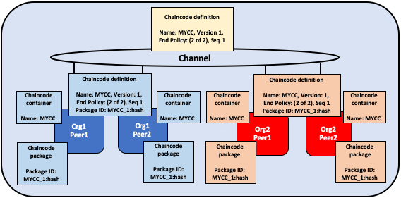
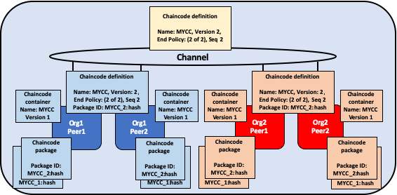
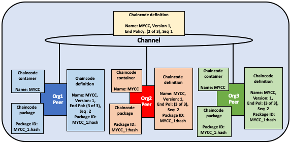
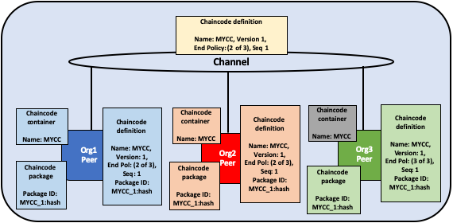

# Ciclo de vida do chaincode na Fabric

<a name="what-is-chaincode"></a>

## O que é o Chaincode?

Chaincode é um programa escrito em [Go](https://golang.org), [Node.js](https://nodejs.org) ou [Java](https://java.com/en/) que implementa 
uma interface prescrita. O Chaincode é executado em um contêiner Docker seguro, isolado do processo de endosso dos pares. O Chaincode 
inicializa e gerencia o estado do livro-razão por meio de transações enviadas pelos aplicativos.

Um chaincode normalmente executa a lógica de negócios acordada pelos membros da rede, portanto pode ser considerada um "contrato 
inteligente". As atualizações do livro-razão criadas por um chaincode têm um escopo exclusivo para esse chaincode e não podem ser acessadas 
diretamente por outro chaincode. No entanto, dentro da mesma rede, com a permissão apropriada, um chaincode pode chamar outro chaincode para 
acessar seu estado.

Neste tópico conceitual, exploraremos o chaincode através dos olhos de um operador da rede blockchain em vez de um desenvolvedor de 
aplicativos. Os operadores de chaincode podem usar este tópico como um guia para usar o ciclo de vida do chaincode da Fabric para implantar 
e gerenciar o chaincode em sua rede.

<a name="deploying-a-chaincode"></a>

## Implantando um chaincode

O ciclo de vida do chaincode na Fabric é um processo que permite que várias organizações concordem em como um chaincode será operado antes 
de poder ser usado em um canal. Um operador de rede usaria o ciclo de vida na Fabric para executar as seguintes tarefas:

- [Instalar e definir o chaincode](#install-and-define-a-chaincode)
- [Atualizar o chaincode](#upgrade-a-chaincode)
- [Cenários de Implantação](#deployment-scenarios)
- [Mirgrar para o novo cilo de vida da Fabric](#migrate-to-the-new-fabric-lifecycle)

Você pode usar o ciclo de vida do chaincode da Fabric criando um novo canal e configurando os recursos do canal para V2_0. Você não poderá 
usar o ciclo de vida antigo para instalar, instanciar ou atualizar um chaincode de canal nos canais com os recursos V2_0 ativados. No 
entanto, você ainda pode chamar o chaincode instalado usando o modelo de ciclo de vida anterior depois de ativar os recursos V2_0. Se você 
estiver atualizando a partir de uma rede v1.4.x e precisar editar as configurações de seu canal para ativar o novo ciclo de vida, confira 
[Ativando o novo ciclo de vida do chaincode](./enable_cc_lifecycle.html).

<a name="install-and-define-a-chaincode"></a>

## Instalar e definir um chaincode

O ciclo de vida do chaincode da Fabric requer que as organizações concordem com os parâmetros que definem um chaincode, como nome, versão e 
política de endosso do chaincode. Os membros do canal chegam ao acordo usando as quatro etapas a seguir. Nem toda organização em um canal 
precisa concluir cada etapa.

1. **Empacote o chaincode:** Esta etapa pode ser concluída por uma organização ou por cada organização.
2. **Instale o chaincode em seus pares:** Toda organização que usará o chaincode para endossar uma transação ou consultar o livro-razão 
   precisa concluir esta etapa.
3. **Aprovar uma definição de chaincode para sua organização:** Toda organização que usará o chaincode precisa concluir esta etapa. A 
   definição do chaincode precisa ser aprovada por um número suficiente de organizações para satisfazer a política de endosso do ciclo de 
   vida do canal (maioria, por padrão) antes que o chaincode possa ser iniciado no canal.
4. **Confirme a definição de chaincode no canal:** A transação de confirmação precisa ser enviada por uma organização depois que o número 
   necessário de aprovações de organizações no canal tiver sido atingido. O remetente primeiro coleta endossos de pares suficientes das 
   organizações que aprovaram e, em seguida, envia a transação para confirmar a definição do chaincode.

Este tópico fornece uma visão geral detalhada das operações do ciclo de vida do chaincode da Fabric, em vez dos comandos específicos. Para 
saber mais sobre como usar o ciclo de vida do Fabric usando o CLI (Peer CLI), consulte o tutorial
[Implementando um contrato inteligente em um canal](deploy_chaincode.html) ou a 
[referência de comando do ciclo de vida do nó](comandos/peerlifecycle.html).

<a name="step-one-packaging-the-smart-contract"></a>

### Etapa um: Empacotar o contrato inteligente

O chaincode precisa ser empacotado em um arquivo tar antes de poder ser instalado em seus pares. Você pode empacotar um chaincode usando os 
binários dos nós da Fabric, o Node Fabric SDK ou uma ferramenta de terceiros, como o GNU tar. Ao criar um pacote de chaincode, você precisa
fornecer um rótulo de pacote do chaincode para criar uma descrição legível e sucinta e humana do pacote.

Se você usar uma ferramenta de terceiros para empacotar o chaincode, o arquivo resultante precisará estar no formato abaixo. Os binários dos
pares do Fabric e os SDKs do Fabric criarão automaticamente um arquivo neste formato.
- O chaincode precisa ser empacotado em um arquivo tar, terminando com uma extensão de arquivo `.tar.gz`.
- O arquivo tar precisa conter dois arquivos (sem diretório): um arquivo de metadados "metadata.json" e outro tar contendo os arquivos de 
  chaincode.
- "metadata.json" contém JSON que especifica a linguagem do chaincode, caminho do código e rótulo do pacote. Você pode ver um exemplo de um 
  arquivo de metadados abaixo:
  ```
  {"Path":"fabric-samples/chaincode/fabcar/go","Type":"golang","Label":"fabcarv1"}
  ```


*O chaincode é empacotado separadamente por Org1 e Org2. Ambas as organizações usam MYCC_1 como rótulo da embalagem para identificar o 
pacote usando o nome e a versão. Não é necessário que as organizações usem o mesmo rótulo da embalagem.*

<a name="step-two-install-the-chaincode-on-your-peers"></a>

### Etapa dois: Instale o chaincode em seus pares

Você precisa instalar o pacote chaincode em todos os pares que executam e endossam transações. Seja usando a CLI ou um SDK, é necessário 
concluir esta etapa usando o **Peer Administrator**. Seu par construir o chaincode após a instalação do chaincode e retornará um erro de 
construção se houver um problema com seu chaincode. É recomendável que as organizações empacotem apenas o chaincode uma vez e depois 
instalem o mesmo pacote em todos os pares que pertencem à sua organização. Se um canal quiser garantir que cada organização esteja 
executando o mesmo código, uma organização pode empacotar um código e enviá-lo para outros membros do canal fora do grupo.

Um comando de instalação bem-sucedido retornará um identificador de pacote chaincode, que é o rótulo do pacote combinado com um hash do 
pacote. Esse identificador de pacote é usado para associar um pacote de chaincode instalado em seus pares a uma definição de chaincode 
aprovada por sua organização. **Salve o identificador** para a próxima etapa. Você também pode encontrar o identificador do pacote 
consultando os pacotes instalados no seu nó usando o CLI do nó.

  

*Um administrador de nós da Org1 e Org2 instala o pacote chaincode MYCC_1 nos pares que ingressaram no canal. A construção do pacote 
chaincode, cria o chaincode e cria um identificador de pacote MYCC_1:hash.*

<a name="step-three-approve-a-chaincode-definition-for-your-organization"></a>

### Etapa três: aprovar uma definição de chaincode para sua organização

O chaincode é governado por uma **definição de chaincode**. Quando os membros do canal aprovam uma definição de chaincode, a aprovação age 
como um voto de uma organização nos parâmetros do código que aceita. Essas definições de organização aprovadas permitem que os membros do 
canal concordem com um chaincode antes que ele possa ser usado em um canal. A definição do chaincode inclui os seguintes parâmetros, que 
precisam ser consistentes nas organizações:

- **Name:** O nome que os aplicativos usarão ao chamar o chaincode.
- **Version:** Um número ou valor da versão associado a um determinado pacote de códigos. Se você atualizar os binários do chaincode, também 
  precisará alterar sua versão do chaincode.
- **Sequence:** O número de vezes que o chaincode foi definido. Esse valor é um número inteiro e é usado para acompanhar as atualizações do 
  chaincode. Por exemplo, quando você instala e aprova pela primeira vez uma definição de chaincode, o número de sequência será 1. Quando 
  você atualizar o chaincode, o número de sequência será incrementado para 2.
- **Endorsement Policy:** Quais organizações precisam executar e validar a saída da transação. A política de endosso pode ser expressa como 
  uma sequência passada para o CLI ou pode fazer referência a uma política na configuração do canal. Por padrão, a política de endosso é 
  definida como ``Channel/Application/Endorsement``, cujo padrão é exigir que a maioria das organizações no canal endosse uma transação.
- **Collection Configuration:** O caminho para um arquivo de definição de dados privados associado ao seu chaincode. Para obter mais 
  informações sobre dados privados, consulte a 
  [Referência da arquitetura de dados privados](https://hyperledger-fabric.readthedocs.io/en/{BRANCH}/private-data-arch.html).
- **ESCC/VSCC Plugins:** O nome de um plug-in de endosso ou validação personalizado a ser usado por este chaincode.
- **Initialization:** Se você usar as APIs de baixo nível fornecidas pela Fabric Chaincode Shim API, seu chaincode precisará conter uma 
  função `Init` que é usada para inicializar o chaincode. Essa função é requerida pela interface chaincode, mas não precisa necessariamente 
  ser chamada por seus aplicativos. Ao aprovar uma definição de chaincode, você pode especificar se `Init` deve ser chamado antes de Invokes. 
  Se você especificar que `Init` é necessário, a Fabric garantirá que a função `Init` seja invocada antes de qualquer outra função no 
  chaincode e seja invocada apenas uma vez. Solicitar a execução da função `Init` permite implementar a lógica que é executada quando o 
  código de inicialização é inicializado, por exemplo, para definir algum estado inicial. Você precisará chamar `Init` para inicializar o 
  chaincode sempre que incrementar a versão de um chaincode, assumindo que a definição do chaincode que incrementa a versão indique que 
  `Init` é necessário.

  Se você estiver usando o CLI do nó da Fabric, poderá usar o sinalizador `--init-required` quando aprovar e confirmar a definição do
  chaincode para indicar que a função `Init` deve ser chamada para inicializar a nova versão do chaincode. Para chamar `Init` usando o CLI 
  do nó da Fabric, use o comando `peer chaincode invoke` e passe o sinalizador `--isInit`.

  Se você estiver usando a API de contrato da Fabric, não precisará incluir um método `Init` no seu chaincode. No entanto, você ainda pode 
  usar o sinalizador `--init-required` para solicitar que o chaincode seja inicializado por uma chamada de seus aplicativos. Se você usar o 
  sinalizador `--init-required`, precisará passar o sinalizador ou parâmetro `--isInit` para uma chamada de chaincode para inicializar o 
  código do chaincode toda vez que incrementar a versão do chaincode. Você pode passar `--isInit` e inicializar o chaincode usando qualquer 
  função no chaincode.

A definição de chaincode também inclui o **Package Identifier**. Este é um parâmetro necessário para cada organização que deseja usar o 
chaincode. O ID do pacote não precisa ser o mesmo para todas as organizações. Uma organização pode aprovar uma definição de chaincode sem 
instalar um pacote de chaincode ou incluir o identificador na definição.

Cada membro do canal que deseja usar o chaincode precisa aprovar uma definição de chaincode para sua organização. Essa aprovação precisa ser 
enviada ao serviço de ordens, após o qual é distribuída a todos os pares. Esta aprovação precisa ser enviada pelo seu **Administrador da 
Organização**. Após o envio bem-sucedido da transação de aprovação, a definição aprovada é armazenada em uma coleção disponível para todos 
os pares da sua organização. Como resultado, você só precisa aprovar um chaincode para sua organização uma vez, mesmo se você tiver vários pares.

  

*Um administrador da organização Org1 e Org2 aprova a definição de chaincode MYCC para sua organização. A definição do chaincode inclui o 
nome do código, a versão e a política de endosso, entre outros campos. Como as duas organizações usarão o chaincode para endossar transações, 
as definições aprovadas para ambas as organizações precisam incluir o ID do pacote.*

### Step Four: Commit the chaincode definition to the channel

Once a sufficient number of channel members have approved a chaincode definition,
one organization can commit the definition to the channel. You can use the
``checkcommitreadiness`` command to check whether committing the chaincode
definition should be successful based on which channel members have approved a
definition before committing it to the channel using the peer CLI. The commit
transaction proposal is first sent to the peers of channel members, who query the
chaincode definition approved for their organizations and endorse the definition
if their organization has approved it. The transaction is then submitted to the
ordering service, which then commits the chaincode definition to the channel.
The commit definition transaction needs to be submitted as the **Organization**
**Administrator**.

The number of organizations that need to approve a definition before it can be
successfully committed to the channel is governed by the
``Channel/Application/LifecycleEndorsement`` policy. By default, this policy
requires that a majority of organizations in the channel endorse the transaction.
The LifecycleEndorsement policy is separate from the chaincode endorsement
policy. For example, even if a chaincode endorsement policy only requires
signatures from one or two organizations, a majority of channel members still
need to approve the chaincode definition according to the default policy. When
committing a channel definition, you need to target enough peer organizations in
the channel to satisfy your LifecycleEndorsement policy. You can learn more
about the Fabric chaincode lifecycle policies in the [Policies concept topic](policies/policies.html).

You can also set the ``Channel/Application/LifecycleEndorsement`` policy to be a
signature policy and explicitly specify the set of organizations on the channel
that can approve a chaincode definition. This allows you to create a channel where
a select number of organizations act as chaincode administrators and govern the
business logic used by the channel. You can also use a signature policy if your
channel has a large number Idemix organizations, which cannot approve
chaincode definitions or endorse chaincode and may prevent the channel from
reaching a majority as a result.

  

*One organization administrator from Org1 or Org2 commits the chaincode definition
to the channel. The definition on the channel does not include the packageID.*

An organization can approve a chaincode definition without installing the
chaincode package. If an organization does not need to use the chaincode, they
can approve a chaincode definition without a package identifier to ensure that
the Lifecycle Endorsement policy is satisfied.

After the chaincode definition has been committed to the channel, the chaincode
container will launch on all of the peers where the chaincode has been installed,
allowing channel members to start using the chaincode. It may take a few minutes for
the chaincode container to start. You can use the chaincode definition to require
the invocation of the ``Init`` function to initialize the chaincode. If the
invocation of the ``Init`` function is requested, the first invoke of the
chaincode must be a call to the ``Init`` function. The invoke of the ``Init``
function is subject to the chaincode endorsement policy.

  

*Once MYCC is defined on the channel, Org1 and Org2 can start using the chaincode. The first invoke of the chaincode on each peer starts the chaincode
container on that peer.*  

## Upgrade a chaincode

You can upgrade a chaincode using the same Fabric lifecycle process as you used
to install and start the chainocode. You can upgrade the chaincode binaries, or
only update the chaincode policies. Follow these steps to upgrade a chaincode:

1. **Repackage the chaincode:** You only need to complete this step if you are
  upgrading the chaincode binaries.

    

   *Org1 and Org2 upgrade the chaincode binaries and repackage the chaincode. Both organizations use a different package label.*  

2. **Install the new chaincode package on your peers:** Once again, you only
  need to complete this step if you are upgrading the chaincode binaries.
  Installing the new chaincode package will generate a package ID, which you will
  need to pass to the new chaincode definition. You also need to change the
  chaincode version, which is used by the lifecycle process to track if the
  chaincode binaries have been upgraded.

    

   *Org1 and Org2 install the new package on their peers. The installation creates a new packageID.*  

3. **Approve a new chaincode definition:** If you are upgrading the chaincode
  binaries, you need to update the chaincode version and the package ID in the
  chaincode definition. You can also update your chaincode endorsement policy
  without having to repackage your chaincode binaries. Channel members simply
  need to approve a definition with the new policy. The new definition needs to
  increment the **sequence** variable in the definition by one.

    

   *Organization administrators from Org1 and Org2 approve the new chaincode definition for their respective organizations. The new definition references the new packageID and changes the chaincode version. Since this is the first update of the chaincode, the sequence is incremented from one to two.*

4. **Commit the definition to the channel:** When a sufficient number of channel
  members have approved the new chaincode definition, one organization can
  commit the new definition to upgrade the chaincode definition to the channel.
  There is no separate upgrade command as part of the lifecycle process.

    

   *An organization administrator from Org1 or Org2 commits the new chaincode definition to the channel.*  

After you commit the chaincode definition, a new chaincode container will
launch with the code from the upgraded chaincode binaries. If you requested the
execution of the ``Init`` function in the chaincode definition, you need to
initialize the upgraded chaincode by invoking the ``Init`` function again after
the new definition is successfully committed. If you updated the chaincode
definition without changing the chaincode version, the chaincode container will
remain the same and you do not need to invoke ``Init`` function.

  

 *Once the new definition has been committed to the channel, each peer will automatically start the new chaincode container.*

The Fabric chaincode lifecycle uses the **sequence** in the chaincode definition
to keep track of upgrades. All channel members need to increment the sequence
number by one and approve a new definition to upgrade the chaincode. The version
parameter is used to track the chaincode binaries, and needs to be changed only
when you upgrade the chaincode binaries.

## Deployment scenarios

The following examples illustrate how you can use the Fabric chaincode lifecycle
to manage channels and chaincode.

### Joining a channel

A new organization can join a channel with a chaincode already defined, and start
using the chaincode after installing the chaincode package and approving the
chaincode definition that has already been committed to the channel.

  

*Org3 joins the channel and approves the same chaincode definition that was
previously committed to the channel by Org1 and Org2.*

After approving the chaincode definition, the new organization can start using
the chaincode after the package has been installed on their peers. The definition
does not need to be committed again. If the endorsement policy is set the default
policy that requires endorsements from a majority of channel members, then the
endorsement policy will be updated automatically to include the new organization.

  

*The chaincode container will start after the first invoke of the chaincode on
the Org3 peer.*

### Updating an endorsement policy

You can use the chaincode definition to update an endorsement policy without
having to repackage or re-install the chaincode. Channel members can approve
a chaincode definition with a new endorsement policy and commit it to the
channel.

  

*Org1, Org2, and Org3 approve a new endorsement policy requiring that all three
organizations endorse a transaction. They increment the definition sequence from
one to two, but do not need to update the chaincode version.*

The new endorsement policy will take effect after the new definition is
committed to the channel. Channel members do not have to restart the chaincode
container by invoking the chaincode or executing the `Init` function in order to
update the endorsement policy.

  

*One organization commits the new chaincode definition to the channel to
update the endorsement policy.*

### Approving a definition without installing the chaincode

You can approve a chaincode definition without installing the chaincode package.
This allows you to endorse a chaincode definition before it is committed to the
channel, even if you do not want to use the chaincode to endorse transactions or
query the ledger. You need to approve the same parameters as other members of the
channel, but not need to include the packageID as part of the chaincode
definition.

  

*Org3 does not install the chaincode package. As a result, they do not need to
provide a packageID as part of chaincode definition. However, Org3 can still
endorse the definition of MYCC that has been committed to the channel.*

### One organization disagrees on the chaincode definition

An organization that does not approve a chaincode definition that has been
committed to the channel cannot use the chaincode. Organizations that have
either not approved a chaincode definition, or approved a different chaincode
definition will not be able to execute the chaincode on their peers.

  

*Org3 approves a chaincode definition with a different endorsement policy than
Org1 and Org2. As a result, Org3 cannot use the MYCC chaincode on the channel.
However, Org1 or Org2 can still get enough endorsements to commit the definition
to the channel and use the chaincode. Transactions from the chaincode will still
be added to the ledger and stored on the Org3 peer. However, the Org3 will not
be able to endorse transactions.*

An organization can approve a new chaincode definition with any sequence number
or version. This allows you to approve the definition that has been committed
to the channel and start using the chaincode. You can also approve a new
chaincode definition in order to correct any mistakes made in the process of
approving or packaging a chaincode.

### The channel does not agree on a chaincode definition

If the organizations on a channel do not agree on a chaincode definition, the
definition cannot be committed to the channel. None of the channel members will
be able to use the chaincode.

  

*Org1, Org2, and Org3 all approve different chaincode definitions. As a result,
no member of the channel can get enough endorsements to commit a chaincode
definition to the channel. No channel member will be able to use the chaincode.*

### Organizations install different chaincode packages

Each organization can use a different packageID when they approve a chaincode
definition. This allows channel members to install different chaincode binaries
that use the same endorsement policy and read and write to data in the same
chaincode namespace.

Organizations can use this capability to install smart contracts that
contain business logic that is specific to their organization. Each
organization's smart contract could contain additional validation that the
organization requires before their peers endorse a transaction. Each organization
can also write code that helps integrate the smart contract with data from their
existing systems.

  

*Org1 and Org2 each install versions of the MYCC chaincode containing business
logic that is specific to their organization.*

### Creating multiple chaincodes using one package

You can use one chaincode package to create multiple chaincode instances on a
channel by approving and committing multiple chaincode definitions. Each
definition needs to specify a different chaincode name. This allows you to run
multiple instances of a smart contract on a channel, but have the contract be
subject to different endorsement policies.

  

*Org1 and Org2 use the MYCC_1 chaincode package to approve and commit two
different chaincode definitions. As a result, both peers have two chaincode
containers running on their peers. MYCC1 has an endorsement policy of 1 out of 2,
while MYCC2 has an endorsement policy of 2 out of 2.*

## Migrate to the new Fabric lifecycle

For information about migrating to the new lifecycle, check out [Considerations for getting to v2.0](./upgrade_to_newest_version.html#chaincode-lifecycle).

If you need to update your channel configurations to enable the new lifecycle, check out [Enabling the new chaincode lifecycle](./enable_cc_lifecycle.html).

## More information

You can watch video below to learn more about the motivation of the new Fabric chaincode lifecycle and how it is implemented.

<iframe class="embed-responsive-item" id="youtubeplayer2" title="Starter Plan videos" type="text/html" width="560" height="315" src="https://www.youtube.com/embed/XvEMDScFU2M" frameborder="0" webkitallowfullscreen mozallowfullscreen allowfullscreen> </iframe>

<!--- Licensed under Creative Commons Attribution 4.0 International License
https://creativecommons.org/licenses/by/4.0/ -->
