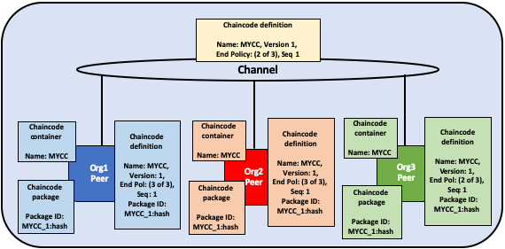
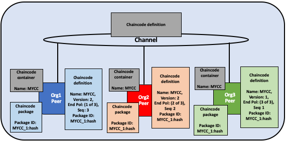

# Ciclo de vida do chaincode na Fabric

<a name="what-is-chaincode"></a>

## O que é o Chaincode?

Chaincode é um programa escrito em [Go](https://golang.org), [Node.js](https://nodejs.org) ou [Java](https://java.com/en/) que implementa 
uma interface prescrita. O Chaincode é executado em um contêiner Docker seguro, isolado do processo de endosso dos pares. O Chaincode 
inicializa e gerencia o estado do livro-razão por meio de transações enviadas pelos aplicativos.

Um chaincode normalmente executa a lógica de negócios acordada pelos membros da rede, portanto pode ser considerada um "contrato 
inteligente". As atualizações do livro-razão criadas por um chaincode têm um escopo exclusivo para esse chaincode e não podem ser acessadas 
diretamente por outro chaincode. No entanto, dentro da mesma rede, com a permissão apropriada, um chaincode pode chamar outro chaincode para 
acessar seu estado.

Neste tópico conceitual, exploraremos o chaincode através dos olhos de um operador da rede blockchain em vez de um desenvolvedor de 
aplicativos. Os operadores do chaincode podem usar este tópico como um guia para usar o ciclo de vida do chaincode da Fabric para implantar 
e gerenciar o chaincode em sua rede.

<a name="deploying-a-chaincode"></a>

## Implantando um chaincode

O ciclo de vida do chaincode na Fabric é um processo que permite que várias organizações concordem em como um chaincode será operado antes 
de poder ser usado em um canal. Um operador de rede usaria o ciclo de vida na Fabric para executar as seguintes tarefas:

- [Instalar e definir o chaincode](#install-and-define-a-chaincode)
- [Atualizar o chaincode](#upgrade-a-chaincode)
- [Cenários de Implantação](#deployment-scenarios)
- [Mirgrar para o novo cilo de vida da Fabric](#migrate-to-the-new-fabric-lifecycle)

Você pode usar o ciclo de vida do chaincode da Fabric criando um novo canal e configurando os recursos do canal para V2_0. Você não poderá 
usar o ciclo de vida antigo para instalar, instanciar ou atualizar um chaincode de canal nos canais com os recursos V2_0 ativados. No 
entanto, você ainda pode chamar o chaincode instalado usando o modelo de ciclo de vida anterior depois de ativar os recursos V2_0. Se você 
estiver atualizando a partir de uma rede v1.4.x e precisar editar as configurações de seu canal para ativar o novo ciclo de vida, confira 
[Ativando o novo ciclo de vida do chaincode](./enable_cc_lifecycle.html).

<a name="install-and-define-a-chaincode"></a>

## Instalar e definir um chaincode

O ciclo de vida do chaincode da Fabric requer que as organizações concordem com os parâmetros que definem um chaincode, como nome, versão e 
política de endosso do chaincode. Os membros do canal chegam ao acordo usando as quatro etapas a seguir. Nem toda organização em um canal 
precisa concluir cada etapa.

1. **Empacote o chaincode:** Esta etapa pode ser concluída por uma organização ou por cada organização.
2. **Instale o chaincode em seus pares:** Toda organização que usará o chaincode para endossar uma transação ou consultar o livro-razão 
   precisa concluir esta etapa.
3. **Aprovar uma definição do chaincode para sua organização:** Toda organização que usará o chaincode precisa concluir esta etapa. A 
   definição do chaincode precisa ser aprovada por um número suficiente de organizações para satisfazer a política de endosso do ciclo de 
   vida do canal (maioria, por padrão) antes que o chaincode possa ser iniciado no canal.
4. **Confirme a definição do chaincode no canal:** A transação de confirmação precisa ser enviada por uma organização depois que o número 
   necessário de aprovações de organizações no canal tiver sido atingido. O remetente primeiro coleta endossos de pares suficientes das 
   organizações que aprovaram e, em seguida, envia a transação para confirmar a definição do chaincode.

Este tópico fornece uma visão geral detalhada das operações do ciclo de vida do chaincode da Fabric, em vez dos comandos específicos. Para 
saber mais sobre como usar o ciclo de vida do Fabric usando o CLI (Peer CLI), consulte o tutorial
[Implementando um contrato inteligente em um canal](deploy_chaincode.html) ou a 
[referência de comando do ciclo de vida do nó](comandos/peerlifecycle.html).

<a name="step-one-packaging-the-smart-contract"></a>

### Etapa um: Empacotar o contrato inteligente

O chaincode precisa ser empacotado em um arquivo tar antes de poder ser instalado em seus pares. Você pode empacotar um chaincode usando os 
binários dos nós da Fabric, o Node Fabric SDK ou uma ferramenta de terceiros, como o GNU tar. Ao criar um pacote do chaincode, você precisa
fornecer um rótulo de pacote do chaincode para criar uma descrição legível e sucinta e humana do pacote.

Se você usar uma ferramenta de terceiros para empacotar o chaincode, o arquivo resultante precisará estar no formato abaixo. Os binários dos
pares do Fabric e os SDKs do Fabric criarão automaticamente um arquivo neste formato.
- O chaincode precisa ser empacotado em um arquivo tar, terminando com uma extensão de arquivo `.tar.gz`.
- O arquivo tar precisa conter dois arquivos (sem diretório): um arquivo de metadados "metadata.json" e outro tar contendo os arquivos de 
  chaincode.
- "metadata.json" contém JSON que especifica a linguagem do chaincode, caminho do código e rótulo do pacote. Você pode ver um exemplo de um 
  arquivo de metadados abaixo:
  ```
  {"Path":"fabric-samples/chaincode/fabcar/go","Type":"golang","Label":"fabcarv1"}
  ```


*O chaincode é empacotado separadamente por Org1 e Org2. Ambas as organizações usam MYCC_1 como rótulo da embalagem para identificar o 
pacote usando o nome e a versão. Não é necessário que as organizações usem o mesmo rótulo da embalagem.*

<a name="step-two-install-the-chaincode-on-your-peers"></a>

### Etapa dois: Instale o chaincode em seus pares

Você precisa instalar o pacote chaincode em todos os pares que executam e endossam transações. Seja usando a CLI ou um SDK, é necessário 
concluir esta etapa usando o **Peer Administrator**. Seu par construir o chaincode após a instalação do chaincode e retornará um erro de 
construção se houver um problema com seu chaincode. É recomendável que as organizações empacotem apenas o chaincode uma vez e depois 
instalem o mesmo pacote em todos os pares que pertencem à sua organização. Se um canal quiser garantir que cada organização esteja 
executando o mesmo código, uma organização pode empacotar um código e enviá-lo para outros membros do canal fora do grupo.

Um comando de instalação bem-sucedido retornará um identificador de pacote chaincode, que é o rótulo do pacote combinado com um hash do 
pacote. Esse identificador de pacote é usado para associar um pacote do chaincode instalado em seus pares a uma definição do chaincode 
aprovada por sua organização. **Salve o identificador** para a próxima etapa. Você também pode encontrar o identificador do pacote 
consultando os pacotes instalados no seu nó usando o CLI do nó.

  

*Um administrador de nós da Org1 e Org2 instala o pacote chaincode MYCC_1 nos pares que ingressaram no canal. A construção do pacote 
chaincode, cria o chaincode e cria um identificador de pacote MYCC_1:hash.*

<a name="step-three-approve-a-chaincode-definition-for-your-organization"></a>

### Etapa três: aprovar uma definição do chaincode para sua organização

O chaincode é governado por uma **definição do chaincode**. Quando os membros do canal aprovam uma definição do chaincode, a aprovação age 
como um voto de uma organização nos parâmetros do código que aceita. Essas definições de organização aprovadas permitem que os membros do 
canal concordem com um chaincode antes que ele possa ser usado em um canal. A definição do chaincode inclui os seguintes parâmetros, que 
precisam ser consistentes nas organizações:

- **Name:** O nome que os aplicativos usarão ao chamar o chaincode.
- **Version:** Um número ou valor da versão associado a um determinado pacote de códigos. Se você atualizar os binários do chaincode, também 
  precisará alterar sua versão do chaincode.
- **Sequence:** O número de vezes que o chaincode foi definido. Esse valor é um número inteiro e é usado para acompanhar as atualizações do 
  chaincode. Por exemplo, quando você instala e aprova pela primeira vez uma definição do chaincode, o número de sequência será 1. Quando 
  você atualizar o chaincode, o número de sequência será incrementado para 2.
- **Endorsement Policy:** Quais organizações precisam executar e validar a saída da transação. A política de endosso pode ser expressa como 
  uma sequência passada para o CLI ou pode fazer referência a uma política na configuração do canal. Por padrão, a política de endosso é 
  definida como ``Channel/Application/Endorsement``, cujo padrão é exigir que a maioria das organizações no canal endosse uma transação.
- **Collection Configuration:** O caminho para um arquivo de definição de dados privados associado ao seu chaincode. Para obter mais 
  informações sobre dados privados, consulte a 
  [Referência da arquitetura de dados privados](https://hyperledger-fabric.readthedocs.io/en/{BRANCH}/private-data-arch.html).
- **ESCC/VSCC Plugins:** O nome de um plug-in de endosso ou validação personalizado a ser usado por este chaincode.
- **Initialization:** Se você usar as APIs de baixo nível fornecidas pela Fabric Chaincode Shim API, seu chaincode precisará conter uma 
  função `Init` que é usada para inicializar o chaincode. Essa função é requerida pela interface chaincode, mas não precisa necessariamente 
  ser chamada por seus aplicativos. Ao aprovar uma definição do chaincode, você pode especificar se `Init` deve ser chamado antes de Invokes. 
  Se você especificar que `Init` é necessário, a Fabric garantirá que a função `Init` seja invocada antes de qualquer outra função no 
  chaincode e seja invocada apenas uma vez. Solicitar a execução da função `Init` permite implementar a lógica que é executada quando o 
  código de inicialização é inicializado, por exemplo, para definir algum estado inicial. Você precisará chamar `Init` para inicializar o 
  chaincode sempre que incrementar a versão de um chaincode, assumindo que a definição do chaincode que incrementa a versão indique que 
  `Init` é necessário.

  Se você estiver usando o CLI do nó da Fabric, poderá usar o sinalizador `--init-required` quando aprovar e confirmar a definição do
  chaincode para indicar que a função `Init` deve ser chamada para inicializar a nova versão do chaincode. Para chamar `Init` usando o CLI 
  do nó da Fabric, use o comando `peer chaincode invoke` e passe o sinalizador `--isInit`.

  Se você estiver usando a API de contrato da Fabric, não precisará incluir um método `Init` no seu chaincode. No entanto, você ainda pode 
  usar o sinalizador `--init-required` para solicitar que o chaincode seja inicializado por uma chamada de seus aplicativos. Se você usar o 
  sinalizador `--init-required`, precisará passar o sinalizador ou parâmetro `--isInit` para uma chamada do chaincode para inicializar o 
  código do chaincode toda vez que incrementar a versão do chaincode. Você pode passar `--isInit` e inicializar o chaincode usando qualquer 
  função no chaincode.

A definição do chaincode também inclui o **Package Identifier**. Este é um parâmetro necessário para cada organização que deseja usar o 
chaincode. O ID do pacote não precisa ser o mesmo para todas as organizações. Uma organização pode aprovar uma definição do chaincode sem 
instalar um pacote do chaincode ou incluir o identificador na definição.

Cada membro do canal que deseja usar o chaincode precisa aprovar uma definição do chaincode para sua organização. Essa aprovação precisa ser 
enviada ao serviço de ordens, após o qual é distribuída a todos os pares. Esta aprovação precisa ser enviada pelo seu **Administrador da 
Organização**. Após o envio bem-sucedido da transação de aprovação, a definição aprovada é armazenada em uma coleção disponível para todos 
os pares da sua organização. Como resultado, você só precisa aprovar um chaincode para sua organização uma vez, mesmo se você tiver vários pares.

  

*Um administrador da organização Org1 e Org2 aprova a definição do chaincode MYCC para sua organização. A definição do chaincode inclui o 
nome do código, a versão e a política de endosso, entre outros campos. Como as duas organizações usarão o chaincode para endossar transações, 
as definições aprovadas para ambas as organizações precisam incluir o ID do pacote.*

<a name="step-four-commit-the-chaincode-definition-to-the-channel"></a>

### Etapa 4: registrar a definição do chaincode no canal

Depois que um número suficiente de membros do canal aprovar uma definição do chaincode, uma organização poderá confirmar a definição no 
canal. Você pode usar o comando ``checkcommitreadiness`` para verificar se a confirmação da definição do chaincode deve ser bem-sucedida com 
base em quais membros do canal aprovaram uma definição antes de enviá-la ao canal usando o CLI do nó par. A proposta de confirmação de 
transação é enviada primeiro aos pares dos membros do canal, que consultam a definição do chaincode aprovada para suas organizações e 
endossam a definição se sua organização a aprovou. A transação é então enviada ao serviço de ordens, que confirma a definição do chaincode 
no canal. A transação de confirmação de definição precisa ser enviada como **Administrador da Organização**.

O número de organizações que precisam aprovar uma definição antes que ela possa ser confirmada com sucesso no canal é governado pela 
política ``Channel/Application/LifecycleEndorsement``. Por padrão, essa política exige que a maioria das organizações no canal endosse a 
transação. A política LifecycleEndorsement é separada da política de endosso do chaincode. Por exemplo, mesmo que uma política de endosso de 
chaincode exija apenas assinaturas de uma ou duas organizações, a maioria dos membros do canal ainda precisará aprovar a definição do 
chaincode de acordo com a política padrão. Ao confirmar uma definição de canal, você precisa direcionar nós de organizações suficientes no 
canal para satisfazer sua política de LifecycleEndorsement. Você pode aprender mais sobre as políticas do ciclo de vida do chaincode da
Fabric no [tópico de conceito de políticas](policies/policies.html).

Você também pode definir a política ``Channel/Application/LifecycleEndorsement`` como uma política de assinatura e especificar 
explicitamente o conjunto de organizações no canal que pode aprovar uma definição do chaincode. Isso permite criar um canal no qual um 
número seleto de organizações atua como administradores do chaincodes e governa a lógica de negócios usada pelo canal. Você também pode usar 
uma política de assinatura se o seu canal tiver um grande número de organizações `Idemix`, que não podem aprovar definições do chaincode ou 
endossar chaincode de conduta e impedir que o canal atinja a maioria como resultado.

  

*Um administrador da organização Org1 ou Org2 confirma a definição do chaincode no canal. A definição no canal não inclui o packageID.*

Uma organização pode aprovar uma definição do chaincode sem instalar o pacote do chaincode. Se uma organização não precisar usar o chaincode, 
poderá aprovar uma definição do chaincode sem um identificador de pacote para garantir que a política de Endosso do Ciclo de Vida seja 
satisfeita.

Após a definição do chaincode ter sido confirmada no canal, o contêiner do chaincode será iniciado em todos os pares em que o chaincode foi 
instalado, permitindo que os membros do canal comecem a usar o chaincode. Pode levar alguns minutos para o contêiner do chaincode iniciar. 
Você pode usar a definição do chaincode para exigir a chamada da função ``Init`` para inicializar o chaincode. Se a chamada da função 
``Init`` for solicitada, a primeira chamada do chaincode deve ser uma chamada para a função ``Init``, a chamada dessa função está 
sujeita à política de endosso do chaincode.

  

*Uma vez definido o MYCC no canal, Org1 e Org2 podem começar a usar o chaincode. A primeira chamada do chaincode em cada ponto 
inicia o contêiner do chaincode nesse ponto.*

<a name="upgrade-a-chaincode"></a>

## Atualizar um chaincode

Você pode atualizar um chaincode usando o mesmo processo de ciclo de vida da Fabric usado para instalar e iniciar o chaincode. Você pode 
atualizar os binários do chaincode ou atualizar apenas as políticas. Siga estas etapas para atualizar um chaincode:

1. **Reempacote o chaincode:** Você só precisará concluir esta etapa se estiver atualizando os binários do chaincode.

    

   *Org1 e Org2 atualizam os binários e reembalam o chaincode. As organizações usam um rótulo de pacote diferente.*

2. **Instale o novo pacote chaincode em seus nós pares:** Mais uma vez, você só precisará concluir esta etapa se estiver atualizando os 
   binários do chaincode. A instalação do novo pacote chaincode gerará um ID do pacote, que você precisará passar para a nova definição de 
   chaincode. Você também precisa alterar a versão do chaincode, que é usada pelo processo do ciclo de vida para rastrear se os binários do 
   chaincode foram atualizados.

    

   *Org1 e Org2 instalam o novo pacote em seus pares. A instalação cria um novo packageID.*

3. **Aprovar uma nova definição do chaincode:** Se você estiver atualizando os binários do chaincode, precisará atualizar a versão do 
   chaincode e o ID do pacote na definição do chaincode. Você também pode atualizar a política de endosso do chaincode sem precisar 
   reembalar seus binários. Os membros do canal simplesmente precisam aprovar uma definição com a nova política. A nova definição precisa 
   incrementar em um a variável **sequence** na definição.

    

   *Os administradores da organização Org1 e Org2 aprovam a nova definição do chaincode para suas respectivas organizações. A nova definição 
   referencia o novo packageID e altera a versão do chaincode. Como esta é a primeira atualização do chaincode, a sequência é incrementada 
   de um para dois.*

4. **Confirme a definição no canal:** Quando um número suficiente de membros do canal aprovar a nova definição do chaincode, uma organização 
   poderá confirmar a nova definição para atualizar a definição do código para o canal. Não há nenhum comando de atualização separado como 
   parte do processo do ciclo de vida.

    

   * Um administrador da organização de Org1 ou Org2 confirma a nova definição do chaincode no canal.*

Depois de confirmar a definição do chaincode, um novo contêiner do chaincode será iniciado com o código dos binários atualizados do 
chaincode. Se você solicitou a execução da função ``Init`` na definição do chaincode, precisará inicializar o chaincode atualizado, chamando 
a função ``Init`` novamente depois que a nova definição for confirmada com êxito. Se você atualizou a definição do chaincode sem alterar a 
versão do chaincode, o contêiner do chaincode permanecerá o mesmo e você não precisará chamar a função ``Init``.

  

 *Depois que a nova definição for confirmada no canal, cada nó iniciará automaticamente o novo contêiner do chaincode.*

O ciclo de vida do chaincode da Fabric usa a **sequence** na definição do chaincode para acompanhar as atualizações. Todos os membros do 
canal precisam incrementar o número de sequência em um e aprovar uma nova definição para atualizar o chaincode. O parâmetro ``version`` é 
usado para rastrear os binários do chaincode e precisa ser alterado apenas quando você atualiza os binários do chaincode.

<a name="deployment-scenarios"></a>

## Cenários de implantação

Os exemplos a seguir ilustram como você pode usar o ciclo de vida do chaincode da Fabric para gerenciar canais e chaincode.

<a name="joining-a-channel"></a>

### Entrando em um canal

Uma nova organização pode ingressar em um canal com um chaincode já definido e começar a usá-lo após instalar o pacote e aprovar a 
definição que já foi confirmada no canal.

  

*Org3 ingressa no canal e aprova a mesma definição do chaincode que foi confirmada anteriormente no canal por Org1 e Org2.*

Depois de aprovar a definição do chaincode, a nova organização pode começar a usar o chaincode após a instalação do pacote em seus nó pares. 
A definição não precisa ser confirmada novamente. Se a política de endosso for definida como a política padrão que exige endossos da maioria 
dos membros do canal, a política de endosso será atualizada automaticamente para incluir a nova organização.

  

*O contêiner do chaincode será iniciado após a primeira chamada do chaincode no ponto Org3.*

<a name="updating-an-endorsement-policy"></a>

### Atualizando uma política de endosso

Você pode usar a definição do chaincode para atualizar uma política de endosso sem precisar reembalar ou reinstalar o chaincode. Os membros 
do canal podem aprovar uma definição do chaincode com uma nova política de endosso e enviá-la ao canal.

  

*Org1, Org2 e Org3 aprovam uma nova política de endosso, exigindo que todas as três organizações endossem uma transação. Eles incrementam a 
sequência de definição de um para dois, mas não precisam atualizar a versão do chaincode.*

A nova política de endosso entrará em vigor após a confirmação da nova definição no canal. Os membros do canal não precisam reiniciar o 
contêiner do chaincode o invocando ou executando a função `Init` para atualizar a política de endosso.

  

*Uma organização confirma a nova definição do chaincode no canal para atualizar a política de endosso.*

<a name="approving-a-definition-without-installing-the-chaincode"></a>

### Aprovar uma definição sem instalar o chaincode

Você pode aprovar uma definição do chaincode sem instalar o pacote. Isso permite endossar uma definição do chaincode antes que ela seja 
confirmada no canal, mesmo se você não desejar usá-lo para endossar transações ou consultar o razão. Você precisa aprovar os mesmos 
parâmetros que outros membros do canal, mas não precisa incluir o packageID como parte da definição do chaincode.

  

*Org3 não instala o pacote chaincode. Como resultado, eles não precisam fornecer um packageID como parte da definição do chaincode. No 
entanto, o Org3 ainda pode endossar a definição de MYCC que foi confirmada no canal.*

<a name="one-organization-disagrees-on-the-chaincode-definition"></a>

### Uma organização discorda da definição do chaincode

Uma organização que não aprova uma definição do chaincode que foi confirmada no canal não pode usar o chaincode. As organizações que não 
aprovaram uma definição do chaincode ou aprovaram uma definição diferente do chaincode, não poderão executar o chaincode em seus pares.

  

*Org3 aprova uma definição do chaincode com uma política de endosso diferente de Org1 e Org2. Como resultado, o Org3 não pode usar o 
chaincode MYCC no canal. No entanto, Org1 ou Org2 ainda podem receber recomendações suficientes para confirmar a definição no canal e usar o 
chaincode. As transações do chaincode ainda serão adicionadas ao livro-razão e armazenadas no par Org3. No entanto, o Org3 não poderá 
endossar transações.*

Uma organização pode aprovar uma nova definição do chaincode com qualquer número de sequência ou versão. Isso permite que você aprove a 
definição que foi confirmada no canal e comece a usar o chaincode. Você também pode aprovar uma nova definição do chaincode para corrigir os 
erros cometidos no processo de aprovação ou empacotamento de um chaincode.

<a name="the-channel-does-not-agree-on-a-chaincode-definition"></a>

### O canal não concorda com uma definição do chaincode

Se as organizações em um canal não concordarem com uma definição do chaincode, a definição não poderá ser confirmada no canal. Nenhum dos
membros do canal poderá usar o chaincode.

   

* Org1, Org2 e Org3 aprovam diferentes definições do chaincode. Como resultado, nenhum membro do canal pode receber recomendações 
suficientes para confirmar uma definição do chaincode para o canal. Nenhum membro do canal poderá usar o chaincode.*

<a name="organizations-install-different-chaincode-packages"></a>

### As organizações instalam pacotes do chaincode diferentes

Cada organização pode usar um packageID diferente quando aprovar uma definição do chaincode. Isso permite que os membros do canal instalem 
binários do chaincode diferentes que usam a mesma política de endosso e leiam e gravem dados no mesmo namespace do chaincode.

As organizações podem usar esse recurso para instalar contratos inteligentes que contenham lógica de negócios específica para sua 
organização. O contrato inteligente de cada organização pode conter validação adicional exigida pela organização antes que seus pares 
endossem uma transação. Cada organização também pode escrever um código que ajude a integrar o contrato inteligente com os dados de seus 
sistemas existentes.

   

*Org1 e Org2 instalam versões do chaincode MYCC contendo lógica de negócios específica para sua organização.*

<a name="creating-multiple-chaincodes-using-one-package"></a>

### Criando vários chaincodes usando um pacote

É possível usar um pacote de chaincode para criar várias instâncias de chaincode em um canal, aprovando e confirmando várias definições de 
chaincode. Cada definição precisa especificar um nome de chaincode diferente. Isso permite que você execute várias instâncias de um contrato 
inteligente em um canal, mas faça com que o contrato esteja sujeito a diferentes políticas de endosso.

   

*Org1 e Org2 usam o pacote chaincode MYCC_1 para aprovar e confirmar duas definições diferentes de chaincode. Como resultado, os dois pares 
têm dois contêineres do chaincode em execução. O MYCC1 possui uma política de endosso de 1 em 2, enquanto o MYCC2 possui uma política de 
endosso de 2 em 2.*

<a name="migrate-to-the-new-fabric-lifecycle"></a>

## Migrar para o novo ciclo de vida da Fabric

Para obter informações sobre como migrar para o novo ciclo de vida, consulte 
[Considerações para acessar a v2.0](./upgrade_to_newest_version.html#chaincode-lifecycle).

Se você precisar atualizar as configurações do seu canal para ativar o novo ciclo de vida, confira 
[Ativando o novo ciclo de vida do chaincode](./enable_cc_lifecycle.html).

<a name="more-information"></a>

## Mais informações 

Você pode assistir ao vídeo abaixo para saber mais sobre a motivação do novo ciclo de vida do chaincode da Fabric e como ele é implementado.

<iframe class="embed-responsive-item" id="youtubeplayer2" title="Starter Plan videos" type="text/html" width="560" height="315" src="https://www.youtube.com/embed/XvEMDScFU2M" frameborder="0" webkitallowfullscreen mozallowfullscreen allowfullscreen> </iframe>

<!--- Licensed under Creative Commons Attribution 4.0 International License
https://creativecommons.org/licenses/by/4.0/ -->
