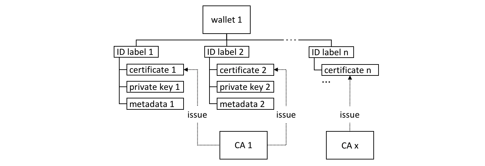

# Wallet

**Público-alvo**: Arquitetos, criadores de aplicações e contratos inteligentes

Uma carteira contém um conjunto de identidades de usuários. Uma aplicação executada por um usuário seleciona
uma destas identidades quando se liga a um canal. Os direitos de acesso aos recursos de canal, tais como o 
livro razão, são determinados utilizando esta identidade em combinação com um MSP.

Neste tópico, vamos abordar:

* [Porque as carteiras são importantes](#Cenário)
* [Como são organizadas as carteiras](#Estrutura)
* [Diferentes tipos de carteira](#Tipos)
* [Operações de carteira](#Operações)

## Cenário

Quando uma aplicação se conecta a um canal de rede como o PaperNet, ela seleciona uma 
identidade de usuário para fazer isso, por exemplo `ID1`. O canal MSPs associa o `ID1` a 
um papel dentro de uma determinada organização, e este papel determinará em última análise
os direitos do aplicativo sobre os recursos do canal. Por exemplo, `ID1` pode 
identificar um usuario como membro da organização MagnetoCorp que pode ler e
escrever no livro razão, enquanto "ID2" pode identificar um administrador em
MagnetoCorp que pode acrescentar uma nova organização a um consórcio.


 *Dois usuários, Isabella e Balaji
têm carteiras com diferentes identidades que podem utilizar para se conectarem a
diferentes canais de rede, PaperNet e BondNet.*

Considere o exemplo dos dois usuários; Isabella da MagnetoCorp e Balaji da
DigiBank.  Isabella vai utilizar o App 1 para invocar um contrato inteligente no PaperNet
e um contrato inteligente diferente na BondNet.  Da mesma forma, Balaji vai utilizar
App 2 para invocar contratos inteligentes, mas apenas na PaperNet. (É muito
[fácil](./application.html#construct-request) para as aplicações terem acesso a múltiplas
 redes e múltiplos contratos inteligentes dentro delas.)

Veja como:

* MagnetoCorp usa CA1 para emitir identidades e o DigiBank usa  o CA2 para emitir 
  identidades. Estas identidades são armazenadas nas carteiras dos usuários.

* A carteira de Balaji tem uma identidade única, `ID4` emitida pela CA2. A carteira da Isabella 
  tem muitas identidades, `ID1`, `ID2` e `ID3`, emitidas pela CA1. Carteiras 
   podem ter várias identidades para um único usuario, e cada identidade pode ser 
   emitida por um CA diferente.

* Tanto Isabella como Balaji ligam-se à PaperNet, e os seus MSPs determinam que 
  Isabella é membro da organização MagnetoCorp, e Balaji é membro
   da organização DigiBank, devido às respectivas CAs que emitiram as suas
  identidades. (É 
  [possível](../membership/membership.html#mapping-msps-to-organizations) uma 
  organização utilizar múltiplas CA, e uma única CA apoiar múltiplas organizações).

* Isabella pode utilizar o `ID1` para se conectar tanto à PaperNet como à BondNet. 
  Em ambos os casos, quando Isabella usa esta identidade, ela é reconhecida como membro de MangetoCorp.

* Isabella pode utilizar o `ID2` para se conectar à BondNet, neste caso ela é identificada 
  como administradora da MagnetoCorp. Isto dá a Isabella dois privilégios muito 
  diferentes: O `ID1` identifica-a como um simples membro da MagnetoCorp que pode ler e escrever no livro razão 
  da BondNet, enquanto a `ID2` a identifica como uma administradora MagnetoCorp que pode acrescentar 
  uma nova organização à BondNet.

* Balaji não pode conectar-se à BondNet com o `ID4`. Se ele tentasse conectar-se, `ID4` 
  não seria reconhecido como membro do DigiBank porque o CA2 não é reconhecido como 
  MSP da BondNet.

## Tipos

Existem diferentes tipos de carteiras de acordo com o local onde armazenam as suas identidades:

 *Os três diferentes tipos de armazenamento de carteiras:
Sistema de arquivo, In-memory e CouchDB.*

* **Sistema de arquivos**: Este é o local mais comum para guardar carteiras; sistemas de arquivos 
  são universais, fáceis de compreender, e podem ser montados em rede. Eles são uma boa escolha padrão para 
  armazenar carteiras.

* **Em memória**: Uma carteira no armazenamento de aplicações. Utilize este tipo de carteira quando 
  a sua aplicação executa-se num ambiente restrito, sem acesso a um sistema de ficheiros; 
  tipicamente um navegador web. Vale a pena lembrar que este tipo de carteira é volátil; 
  as identidades serão perdidas após o fim da aplicação, seja esse fim realizado normalmente ou ate mesmo um crash da aplicação.

* **CouchDB**: Uma carteira guardada no CouchDB. Esta é a forma mais rara de armazenamento de carteira, 
  mas para os usuarios que querem utilizar os mecanismos de back-up e restauração da base de dados, 
  as carteiras CouchDB podem ser uma opção útil para simplificar a recuperação desastre.

Utilize as funções de fábrica fornecidas pela `Wallets`
[class](https://hyperledger.github.io/fabric-sdk-node/{BRANCH}/module-fabric-network.Wallets.html)
para criar carteiras.

### Módulo de Segurança de Hardware

Um Módulo de Segurança de Hardware (HSM) é um dispositivo ultra seguro e à prova 
de adulteração que armazena informação de identidade digital, particularmente 
chaves privadas.  Os HSM podem ser ligados localmente ao seu computador ou atraves do acesso à rede. 
A maioria dos HSMs fornece a capacidade de executar criptografia integrada com chaves privadas, 
de forma que as chaves privadas nunca saiam do HSM.

Um HSM pode ser usado com qualquer tipo de carteira. 
Neste caso, o certificado de uma identidade será armazenado na carteira e a 
chave privada será armazenada no HSM.

Para habilitar o uso de identidades gerenciadas por HSM, um `IdentityProvider` 
deve ser configurado com as informações de conexão HSM e registrado com a carteira. 
Para obter mais detalhes, consulte o [Usando carteiras para gerenciar identidades](https://hyperledger.github.io/fabric-sdk-node/{BRANCH}/tutorial-wallet.html) tutorial.

## Estrutura

Uma única carteira pode conter várias identidades, cada uma emitida por uma 
Autoridade de Certificação específica. Cada identidade tem uma estrutura padrão que compreende um 
rótulo descritivo, um certificado X.509 contendo uma chave pública, uma chave privada,
e alguns metadados específicos do Fabric. Diferentes [wallet types](#types) mapeiam essa
estrutura de forma adequada ao seu mecanismo de armazenamento.


 *Uma carteira Fabric pode conter múltiplas 
identidades com certificados emitidos por uma Autoridade Certificadora diferente.
As identidades incluem certificado, chave privada e Fabric metadados.*


Existem alguns métodos-chave de classe que facilitam o gerenciamento de carteiras e
identidades: 

```JavaScript
const identity: X509Identity = {
    credentials: {
        certificate: certificatePEM,
        privateKey: privateKeyPEM,
    },
    mspId: 'Org1MSP',
    type: 'X.509',
};
await wallet.put(identityLabel, identity);
```

Veja como uma `identity` é criada e que tem metadados de `Org1MSP`, um `certificate` e
uma `privateKey`. Veja como `wallet.put()` adiciona essa identidade à carteira com uma 
`identityLabel` particular.

A classe `Gateway` requer apenas que os metadados `mspId` e `type` sejam definidos para
uma identidade -- `Org1MSP` e `X.509` no exemplo acima. Ele *atualmente* usa o
Valor de ID do MSP para identificar peers específicos de um [connection profile](./connectionprofile.html),
por exemplo, quando uma notificação específica [strategy](./connectoptions.html) é
requisitada. No arquivo de gateway DigiBank `networkConnection.yaml`, veja como 
as notificações de `Org1MSP` serão associadas a `peer0.org1.example.com`:


```yaml
organizations:
  Org1:
    mspid: Org1MSP

    peers:
      - peer0.org1.example.com
```

Você realmente não precisa se preocupar com a estrutura interna dos diferentes
tipos de carteira, mas se você estiver interessado, navegue até uma pasta de identidade do usuário
 no exemplo de papel comercial:

```
magnetocorp/identity/user/isabella/
                                  wallet/
                                        User1@org1.example.com.id
```

Você pode examinar esses arquivos, mas como discutido, é mais fácil usar o SDK para
manipular esses dados.

## Operações

Todos os diferentes tipos de carteira implementam uma
[Wallet](https://hyperledger.github.io/fabric-sdk-node/{BRANCH}/module-fabric-network.Wallet.html)
interface que fornece um conjunto padrão de APIs para gerenciar identidades. Isso significa 
que os aplicativos podem ser feitos independentemente do mecanismo de armazenamento 
de carteira subjacente; por exemplo, sistema de arquivos e carteiras HSM são tratados de uma forma muito
maneira semelhante.

 *Carteiras seguem um
ciclo de vida: elas podem ser criadas ou abertas, e as identidades podem ser lidas, adicionadas e
excluídas.*

Um aplicativo pode usar uma carteira de acordo com um ciclo de vida simples. Carteiras podem ser 
abertas ou criadas e, subsequentemente, identidades podem ser adicionadas, atualizadas, lidas 
e excluídas. Gaste algum tempo nos diferentes métodos `Wallet` em
[JSDoc](https://hyperledger.github.io/fabric-sdk-node/{BRANCH}/module-fabric-network.Wallet.html)
para ver como funcionam; o tutorial de papel comercial fornece um bom exemplo em
`addToWallet.js`:

```JavaScript
const wallet = await Wallets.newFileSystemWallet('../identity/user/isabella/wallet');

const cert = fs.readFileSync(path.join(credPath, '.../User1@org1.example.com-cert.pem')).toString();
const key = fs.readFileSync(path.join(credPath, '.../_sk')).toString();

const identityLabel = 'User1@org1.example.com';
const identity = {
    credentials: {
        certificate: cert,
        privateKey: key,
    },
    mspId: 'Org1MSP',
    type: 'X.509',
};

await wallet.put(identityLabel, identity);
```

Note como:

* Quando o programa é executado pela primeira vez, uma carteira é criada no sistema de arquivos local em
  `.../isabella/wallet`.

* um certificado `cert` e uma private `key` são carregadas do sistema de arquivos.

* uma nova identidade X.509 é criada com `cert`, `key` e `Org1MSP`.

* a nova identidade é adicionada à carteira com `wallet.put()` com um rótulo
  `User1@org1.example.com`.

Isso é tudo que você precisa saber sobre carteiras. Você viu como elas mantêm 
identidades que são usadas por aplicativos em nome de usuários para acessar 
recursos da rede Fabric. Existem diferentes tipos de carteiras disponíveis dependendo da sua 
aplicação, necessidades de segurança, e um conjunto simples de APIs para ajudar
os aplicativos a gerenciar carteiras e as identidades dentro delas.


<!--- Licensed under Creative Commons Attribution 4.0 International License
https://creativecommons.org/licenses/by/4.0/ -->
