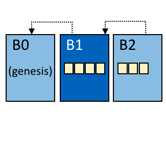
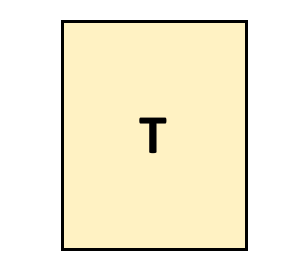

Glossário
=========

A terminologia é muito importante, para que todos os usuários e desenvolvedores 
da Hyperledger Fabric concordem com o que queremos dizer com cada termo específico. 
O que é um contrato inteligente, por exemplo. A documentação fará referência ao 
glossário conforme necessário, mas fique à vontade para ler a coisa toda de uma 
só vez, se quiser; é bem esclarecedor! 

.. _glossary_ACL:
.. _ACL:

ACL
---

Uma ACL, ou Lista de Controle de Acesso, associa o acesso a recursos específicos 
(como APIs de chaincode ou serviços de eventos) a uma Política_ (que especifica 
quantos e quais tipos de organizações ou funções são necessários). A ACL faz 
parte da configuração de um canal. Portanto, ele persiste nos blocos de 
configuração do canal e pode ser atualizado usando o mecanismo de atualização de
configuração padrão.

Uma ACL é formatada como uma lista de pares de chave-valor, onde a chave 
identifica o recurso cujo acesso queremos controlar, e o valor identifica a 
política de canal (grupo) que tem permissão para acessá-lo. Por exemplo, 
``lscc/GetDeploymentSpec:/Channel/Application/Readers`` define que o acesso ao 
ciclo de vida da API ``GetDeploymentSpec`` (o recurso) é acessível por 
identidades que satisfazem a política ``/Channel/Application/Readers``.

Um conjunto de ACLs padrão é fornecido no arquivo ``configtx.yaml``, usado pelo 
configtxgen para criar configurações de canal. Os padrões podem ser definidos na
seção superior "Applications" do ``configtx.yaml`` ou sobrescritas pelo
perfil na seção "Profiles".

.. _Dynamic-Membership:
.. _Associacao-Dinamica:

Associação Dinâmica
-------------------

A Hyperledger Fabric suporta a adição/remoção de membros, pares e nós de serviço 
de ordens, sem comprometer a operacionalidade da rede geral. A associação 
dinâmica é crítica quando os relacionamentos comerciais se ajustam e as entidades 
precisam ser adicionadas/removidas por vários motivos.

.. _State-DB:
.. _Banco-de-Dados-de-Estado:

Banco de Dados de Estado
------------------------

Os dados do estado global são armazenados em um banco de dados de estado para 
leituras e consultas eficientes do chaincode. Os bancos de dados suportados 
incluem levelDB e couchDB.

.. _Block:
.. _Bloco:

Bloco
-----

   O bloco B1 está ligado ao bloco B0. O bloco B2 está ligado ao bloco B1.

=======

Um bloco contém um conjunto ordenado de transações. Ele é criptograficamente 
vinculado ao bloco anterior e, por sua vez, é vinculado aos blocos subsequentes. 
O primeiro bloco dessa cadeia de blocos é chamado de **bloco de gênese**. Os 
blocos são criados pelo serviço de ordens, validados e confirmados pelos pares.

.. _Configuration-Block:
.. _Bloco-de-Configuracao:

Bloco de Configuração
---------------------

Contém os dados de configuração que definem membros e políticas para uma cadeia 
do sistema (serviço de ordens) ou canal. Quaisquer modificações na configuração 
de um canal ou rede em geral (por exemplo, um membro saindo ou ingressando) 
resultarão em um novo bloco de configuração sendo anexado à cadeia apropriada. 
Este bloco conterá o conteúdo do bloco de gênese, além do delta.

.. _Chain:
.. _Cadeia:

Cadeia (Chain)
--------------

.. figure:: ./glossary/glossary.blockchain.png
   :scale: 75 %
   :align: right
   :figwidth: 40 %
   :alt: Blockchain

   Blockchain B contêm os blocos 0, 1, 2.

=======

A cadeia do livro-razão é um log de transações estruturado como blocos de 
transações vinculados a um hash. Os pares recebem blocos de transações do serviço
de ordens, marcam as transações do bloco como válidas ou inválidas com base em 
políticas de endosso e violações de concorrência, e anexam o bloco à cadeia de
hash no sistema de arquivos do nó.

.. _System-Chain:
.. _Cadeia-do-Sistema:

Cadeia do Sistema
-----------------

Contém um bloco de configuração que define a rede no nível do sistema. A cadeia 
do sistema reside no serviço de ordens e, semelhante a um canal, possui uma 
configuração inicial que contém informações como: políticas e detalhes de 
configuração do :ref:`MSP`. Qualquer alteração na rede geral (por exemplo, uma 
nova associação organizacional ou um novo nó de ordem sendo adicionado) resultará
na adição de um novo bloco de configuração à cadeia do sistema.

A cadeia do sistema pode ser considerada a ligação comum a um canal ou grupo de 
canais. Por exemplo, uma coleção de instituições financeiras pode formar um 
consórcio (representado através da cadeia do sistema) e, em seguida, continuar a
criar canais relativos às suas agendas comerciais e variáveis.

.. _Channel:
.. _Canal:

Canal (Channel)
---------------

.. figure:: ./glossary/glossary.channel.png
   :scale: 30 %
   :align: right
   :figwidth: 40 %
   :alt: Um Canal

   Canal C conecta a aplicação A1, nó P2 e o serviço de ordem O1.

=======

Um canal é uma sobreposição de blockchain privada que permite isolamento e 
confidencialidade dos dados. Um livro-razão específico do canal é compartilhado 
entre os pares no canal, e as partes envolvidas na transação devem ser 
autenticadas em um canal para interagir com ele. Os canais são definidos por um 
:ref:`bloco-de-configuracao`.

.. _chaincode:

Chaincode
---------

Veja :ref:`smart-contract`.

.. _glossary-Private-Data-Collection:
.. _Colecao-de-Dados-Privados:

Coleção de Dados Privados (Collection)
--------------------------------------

Usado para gerenciar dados confidenciais que duas ou mais organizações em um 
canal desejam manter privadas de outras organizações nesse canal. A definição de
coleção descreve um subconjunto de organizações em um canal autorizado a armazenar
um conjunto de dados particulares, o que, por extensão, implica que apenas essas
organizações podem fazer transações com os dados privados.

.. _Commit:
.. _Confirmar:

Confirmar (Commit)
------------------

Cada par_ em um canal valida os blocos ordenados das transações e, em seguida, 
confirma (grava/acrescenta) os blocos à sua réplica do Livro-Razao_ do canal. Os 
pares também marcam cada transação em cada bloco como válida ou inválida.

.. _Consenter-Set:
.. _Conjunto-de-Consentidores:

Conjunto de Consentidores
-------------------------

Em um serviço de ordens :ref:`raft`, esses são os nós de ordens que participam 
ativamente do mecanismo de consenso em um canal. Se outros nós de ordens 
existirem no canal do sistema, mas não fizerem parte de um canal, eles não farão
parte do conjunto consenter desse canal.

.. _Consensus:
.. _Consenso:

Consenso
--------

Um termo mais amplo abrangendo todo o fluxo transacional, que serve para gerar 
a concordância sobre o pedido e para confirmar a validade do conjunto de 
transações que constituem um bloco.

.. _Query:
.. _Consulta:

Consulta
--------

Uma consulta é uma chamada de chaincode que lê o estado atual do livro-razão, 
mas não grava no livro-razão. A função chaincode pode consultar determinadas 
chaves no livro-razão ou pode consultar um conjunto de chaves. Como as consultas 
não alteram o estado do livro-razão, o aplicativo cliente normalmente não envia 
essas transações de somente leitura para o ordenação, validação e confirmação.
Embora não seja típico, o aplicativo cliente pode optar por enviar a transação 
de leitura para ordenação, validação e confirmação, por exemplo, se o cliente 
deseja uma prova auditável na cadeia do livro-razão que tenha conhecimento do 
estado específico do livro-razão em um determinado momento .

.. _Consortium:
.. _Consorcio:

Consórcio
---------

Um consórcio, é uma coleção de organizações que não enviam ordens para rede 
blockchain. Essas são as organizações que formam e fazem parte nos canais e que 
possuem pares. Enquanto uma rede blockchain pode ter vários consórcios, a maioria
das redes blockchain possui um único consórcio. No momento da criação do canal, 
todas as organizações adicionadas ao canal devem fazer parte de um consórcio. No 
entanto, uma organização que não está definida em um consórcio pode ser 
adicionada a um canal existente.

.. _Smart-Contract:
.. _Contrato-Inteligente:

Contrato Inteligente
--------------------

Um contrato inteligente é um código -- invocado por um aplicativo cliente externo
à rede blockchain -- que gerencia o acesso e as modificações em um conjunto de 
pares de chave-valor no :ref:`Estado-Global` via :ref:`Transacao` na Hyperledger 
Fabric, os contratos inteligentes são empacotados como um chaincode. O Chaincode 
é instalado nos pares e, em seguida, definido e usado em um ou mais canais.

.. _glossary-Private-Data:
.. _dados-privados:

Dados Privados
--------------

Os dados confidenciais armazenados em um banco de dados privado em cada nó 
autorizado, separam-se logicamente dos dados do livro-razão do canal. O acesso a
esses dados é restrito a uma ou mais organizações em um canal por meio de uma 
definição de coleta de dados privada. Organizações não autorizadas terão um hash
dos dados privados no razão do canal como evidência dos dados da transação. Além 
disso, para maior privacidade, os hashes dos dados privados passam pelo 
:ref:`servico-de-ordem` e não os dados privados em si, portanto, isso mantém 
os dados privados confidenciais para o ordenador.

.. _Chaincode-definition:
.. _Definicao-de-Chaincode:

Definição de Chaincode
----------------------

Uma definição de chaincode é usada pelas organizações para concordar com os 
parâmetros de um chaincode antes de poder ser usada em um canal. Cada membro do 
canal que deseja usar o chaincode para endossar transações ou consultar o razão 
precisa aprovar uma definição de chaincode para sua organização. Depois que os
membros do canal aprovarem uma definição de chaincode o  suficiente para atender 
à política de  Ciclo de Vida de Endosso (que é definida por padrão pela a maioria 
das organizações no canal por padrão), a definição de chaincode pode ser 
confirmada no canal. Após a definição ser confirmada, a primeira invocação do 
chaincode (ou, se invocado, a execução da função Init) iniciará o código de no 
canal.

.. _Endorsement:
.. _Endosso:

Endosso
-------

Refere-se ao processo em que os nós de pares específicos executam uma transação 
de um chaincode e retornam uma resposta para proposta ao aplicativo cliente. A 
resposta da proposta inclui a mensagem de resposta da execução do chaincode, 
resultados (conjunto de leituras e gravações) e eventos, além de uma assinatura 
para servir como prova da execução do chaincode do nó. Os aplicativos Chaincode 
possuem políticas de endosso, nas quais os pares endossantes são especificados.

.. _Log-entry:
.. _Entrada-de-Log:

Entrada de log
--------------

A principal unidade de trabalho em um serviço de ordens :ref:`raft`, as entradas
de log são distribuídas dos ordenadores líderes para os seguidores. A sequência 
completa dessas entradas é conhecida como "log". O log é considerado consistente 
se todos os membros concordarem com as entradas e sua ordem.

.. _World-State:
.. _Estado-Global:

Estado Global
-------------

.. figure:: ./glossary/glossary.worldstate.png
   :scale: 40 %
   :align: right
   :figwidth: 25 %
   :alt: Estado Atual

   Estado Global, 'W'

Também conhecido como "estado atual", o estado global é um componente do 
:ref:`livro-razao` da HyperLedger Fabric. O estado global representa os valores 
mais recentes para todas as chaves incluídas no log de transações da cadeia. O 
Chaincode executa propostas de transação com base nos dados do estado global 
porque o estado global fornece acesso direto ao valor mais recente dessas chaves, 
em vez de precisar calculá-las percorrendo todo o log de transações. O estado global
muda sempre que o valor de uma chave é alterado (por exemplo, quando a 
propriedade de um carro -- a "chave" -- ​​é transferida de um proprietário para 
outro -- o "valor") ou quando uma nova chave é adicionada (um carro é criado). 
Como resultado, o estado global é crítico para um fluxo de transações, pois o 
estado atual de um par de chave-valor deve ser conhecido antes que possa ser 
alterado. Os pares confirmam os valores mais recentes no estado global do 
livro-razão para cada transação válida incluída em um bloco processado.

.. _Genesis-Block:
.. _Bloco-Genesis:

Globo Gênesis
-------------

O bloco de configuração que inicializa o serviço de ordens ou serve como o 
primeiro bloco em uma cadeia.

.. _Fabric-ca:

Hyperledger Fabric CA
---------------------

A CA do Hyperledger Fabric é o componente padrão de Autoridade de Certificação, 
que emite certificados baseados em PKI para organizações membros da rede e seus 
usuários. A CA emite um certificado raiz (rootCert) para cada membro e um 
certificado de inscrição (ECert) para cada usuário autorizado.

.. _Init:

Init
----

Um método para inicialização de um aplicativo chaincode. Todos os chaincodes 
precisam ter uma função Init. Por padrão, essa função nunca é executada. No 
entanto, você pode usar a definição do chaincode para solicitar a execução da 
função Init para inicializar o código chaincode.

.. _Install:

Instalação
----------

O processo de colocar um código chaincode no sistema de arquivos do nó.

Instanciar
----------

O processo de iniciar e inicializar um aplicativo chaincode em um canal 
específico. Após a instanciação, os pares que possuem o chaincode instalado 
podem aceitar invocações do chaincode.

**NOTA**: *Este método, ou seja, o Instantiate, foi usado no ciclo de vida do 
chaincode até as versões 1.4.x. Para ver o procedimento usado para 
iniciar um chaincode em um canal da Fabric introduzido como parte da Fabric v2.0, 
consulte* :ref:`definicao-de-chaincode`. 

.. _Invoke:
.. _Invocacao:

Invocação
---------

Usado para chamar funções de um chaincode. Um aplicativo cliente chama o chaincode
enviando uma proposta de transação para um nó par. O par executará o código de 
chaincode e retornará uma da proposta de resposta endossada ao aplicativo cliente. 
O aplicativo cliente reunirá as respostas das propostas o suficientes para satisfazer 
uma política de endosso e em seguida, enviará os resultados da transação para 
ordenação, validação e confirmação. O aplicativo cliente pode optar por não enviar
os resultados da transação. Por exemplo, se a chamada apenas consultasse o 
livro-razão, o aplicativo cliente normalmente não enviaria a transação de leitura
apenas, a menos que haja desejo de registrar a leitura no razão para fins de 
auditoria. A chamada inclui, um identificador do canal, a função do chaincode a 
ser chamada e uma matriz de argumentos.

.. _Leader:
.. _Lider:

Líder
------

Em um protocolo de consenso baseado em líder, como o :ref:`raft`, o líder é 
responsável por ingerir novas entradas de log, replicá-las para nós de ordens 
seguidores e gerenciar quando uma entrada é considerada confirmada. Este não é 
um **tipo** especial de ordem. É apenas uma função que um solicitante pode ter 
em determinados momentos, e não em outros, conforme as circunstâncias determinam.

.. _Ledger:
.. _Livro-Razao:

Livro-Razão
-----------

.. figure:: ./glossary/glossary.ledger.png
   :scale: 25 %
   :align: right
   :figwidth: 20 %
   :alt: Um Livro-Razão

   Um Livro-Razão, 'L'

Um livro-razão consiste em duas partes distintas, embora relacionadas -- uma 
"blockchain" e o "banco de dados de estados", também conhecido como "estado 
global". Diferente de outros livros, as cadeias de blocos são **imutáveis**, ou 
seja, depois que um bloco é adicionado à cadeia, ele não pode ser alterado. Por 
outro lado, o "estado global" é um banco de dados que contém o valor atual do 
conjunto de pares de chave-valor que foram adicionados, modificados ou excluídos 
pelo conjunto de transações validadas e confirmadas na blockchain.

É útil pensar em um registro livro-razão **lógico** para cada canal da rede. Na 
realidade, cada par em um canal mantém sua própria cópia do livro-razão -- que é 
mantida consistente com a cópia de qualquer outro par através de um processo 
chamado **consenso**. O termo **Tecnologia de Livro-Razão Distribuído** (**DLT**) 
é frequentemente associado a esse tipo de livro-razão -- um que é logicamente 
singular, mas tem muitas cópias idênticas distribuídas em um conjunto de nós da 
rede (os pares e o serviço de ordens).

.. _Member:
.. _Membro:

Membro
------

Veja Organização_.

.. _No:

Nó
--

Veja Par_.

.. _Anchor-Peer:
.. _No-Ancora:

Nó Âncora
---------

Usado pelo :ref:`protocolo-gossip` para garantir que os pares de diferentes 
organizações se conheçam.

Quando um bloco de configuração que contém alguma atualização sobre os pares âncoras 
é confirmado na rede, os demais nós se conectam ao nós âncoras para obter com 
eles todas as informações dos demais nós pares. Depois que pelo menos um nó 
de cada organização entra em contato com um nó âncora, o nó âncora aprendem sobre 
todos os demais nós do canal. Como a comunicação do protocolo Gossip é constante,
e como os nós sempre pedem que sejam informados sobre a existência de alguém que 
eles desconhecem, uma visão única da associação pode ser estabelecida para um canal.

Por exemplo, vamos supor que temos três organizações --- ``A``, ``B``, ``C`` 
--- no canal e um único ponto de ancoragem --- ``peer0.orgC`` --- definido para 
a organização ``C``. Quando ``peer1.orgA`` (da organização ``A``) entrar em 
contato com ``peer0.orgC``, ele informará ao ``peer0.orgC`` sobre ``peer0.orgA``. 
E quando mais tarde ``peer1.orgB`` entrar em contato com ``peer0.orgC``, o 
último dirá ao primeiro sobre ``peer0.orgB``. Desse ponto em diante, as 
organizações ``A`` e ``B`` começariam a trocar informações de membros 
diretamente sem a ajuda de ``peer0.orgC``.

Como a comunicação entre as organizações depende do protocolo Gossip para 
funcionar, deve haver pelo menos um nó de ancoragem definido na configuração 
do canal. É altamente recomendável que toda organização forneça seu próprio 
conjunto de nós âncora para alta disponibilidade e redundância.

.. _Organization:
.. _Organizacao:

Organização
-----------

=====

.. figure:: ./glossary/glossary.organization.png
   :scale: 25 %
   :align: right
   :figwidth: 20 %
   :alt: Uma Organização

   Uma Organização, 'ORG'

Também conhecidas como "membros", as organizações são convidadas a ingressar na 
rede blockchain por um provedor de rede blockchain. Uma organização ingressa em 
uma rede adicionando seu provedor de serviços de associação (MSP_) à rede. O MSP 
define como outros membros da rede podem verificar se as assinaturas (como aquelas
sobre transações) foram geradas por uma identidade válida, emitida por essa 
organização. Os direitos de acesso específicos das identidades em um MSP são 
regidos por políticas que também são acordadas quando a organização ingressa na 
rede. Uma organização pode ser tão grande quanto uma corporação multinacional ou 
tão pequena quanto um indivíduo. O ponto final da transação de uma organização é 
um Par_. Uma coleção de organizações forma um consórcio. Embora todas as 
organizações em uma rede sejam membros, nem todas as organizações farão parte de 
um consórcio.

.. _Peer:
.. _Par:

Par
---

.. figure:: ./glossary/glossary.peer.png
   :scale: 25 %
   :align: right
   :figwidth: 20 %
   :alt: A Peer

   Um Par, 'P'

Uma entidade de rede que mantém um livro-razão e executa operações em contêineres 
de chaincode de leitura/gravação no livro-razão. Os pares pertencem e são mantidos 
pelos membros.

.. _Leading-Peer:
.. _Par-Lider:

Par Líder
---------

Cada organização_ pode possuir vários pares em cada canal em que se inscreve. Um
ou mais desses pares devem servir como o líder do canal, para se comunicar com o
serviço de ordens da rede em nome da organização. O serviço de ordens entrega 
blocos para os pares líderes em um canal, que os distribuem para outros pares na
mesma organização.

.. _Policy:
.. _Politica:

Política
--------

Políticas são expressões compostas de propriedades das identidades digitais, por 
exemplo: ``Org1.Peer OR Org2.Peer``. Elas são usadas para restringir o acesso 
aos recursos em uma rede blockchain. Por exemplo, elas determinam quem pode ler 
ou gravar em um canal ou quem pode usar uma API específica do chaincode por meio 
de uma ACL_. As políticas podem ser definidas em ``configtx.yaml`` antes de 
inicializar um serviço de ordens ou criar um canal, ou podem ser especificadas 
ao instanciar o chaincode em um canal. Um conjunto padrão de políticas é enviado 
no exemplo ``configtx.yaml``, que será apropriado para a maioria das redes.

.. _Endorsement-policy:
.. _Politica-de-endosso:

Política de endosso
-------------------

Define os nós pares em um canal que devem executar as transações associadas a um
aplicativo chaincode específico e a combinação necessária de respostas 
(recomendações). Uma política pode exigir que uma transação seja endossada por um
número mínimo de pares, endossado por uma porcentagem mínima de pares ou
endossados por todos os pares atribuídos a um aplicativo chaincode específico. 
As políticas podem ser selecionadas com base na aplicação e no nível desejado de 
resiliência contra mau comportamento (deliberado ou não) dos pares endossantes. 
Uma transação enviada deve satisfazer a política de endosso antes de ser marcada 
como válida por meio da confirmação de pares.

.. _Proposal:
.. _Proposta:

Proposta
--------

Uma solicitação de endosso destinada aos pares específicos em um canal. Cada 
proposta é uma solicitação Init ou Invoke (leitura/gravação).

.. _Gossip-Protocol:
.. _Protocolo-Gossip:

Protocolo Gossip
----------------

O protocolo Gossip de disseminação de dados executa três funções:

1) gerencia a descoberta de pares e associação ao canal;
2) divulga dados do livro-razão entre todos os pares no canal;
3) sincroniza o estado do livro-razão entre todos os pares no canal.

Consulte o tópico :doc:`Gossip <gossip>` para obter mais detalhes.

.. _MSP:

Provedor de Serviço de Associação (MSP)
---------------------------------------

.. figure:: ./glossary/glossary.msp.png
   :scale: 35 %
   :align: right
   :figwidth: 25 %
   :alt: Um MSP

   Um MSP, 'ORG.MSP'

O Provedor de Serviço de Associação (MSP) refere-se a um componente abstrato do 
sistema que fornece credenciais aos clientes e aos nós para eles participarem de 
uma rede Hyperledger Fabric. Os clientes usam essas credenciais para autenticar 
suas transações e os pares usam essas credenciais para autenticar os resultados 
do processamento de transações (endossos). Embora fortemente conectada aos 
componentes de processamento de transações dos sistemas, essa interface visa 
definir componentes de serviços de associação, de forma que implementações 
alternativas possam ser conectadas sem problemas, sem modificar o núcleo dos 
componentes de processamento de transações do sistema.

.. _Quorum:

Quorum
------

Isso descreve o número mínimo de membros do cluster que precisam afirmar uma 
proposta para que as transações possam ser solicitadas. Para cada conjunto de 
validadores há uma **maioria** de nós. Em um cluster com cinco nós, três 
devem estar disponíveis para que exista um quorum. Se o quorum de nós estiver 
indisponível por qualquer motivo, o cluster ficará indisponível para operações 
de leitura e gravação e nenhum novo registro poderá ser confirmado.

.. _Raft:

Raft
----

Novidade na v1.4.1, o Raft é uma implementação de serviço de ordens tolerante a 
falhas (CFT) com base na `biblioteca etcd <https://coreos.com/etcd/>`_ do 
`protocolo Raft <https: // raft. github.io/raft.pdf>`_. O Raft segue um modelo 
de "líder e seguidor", em que um nó líder é eleito (por canal) e suas decisões
são replicadas pelos seguidores. Os serviços de ordens Raft devem ser mais 
fáceis de configurar e gerenciar do que os serviços de ordens baseados em Kafka, 
e seu design permite que as organizações contribuam com nós para um serviço de 
ordens distribuído.

.. _Follower:
.. _Seguidor:

Seguidor
--------

Em um protocolo de consenso baseado em líder, como o :ref:`raft`, esses são os 
nós que replicam as entradas de log produzidas pelo líder. No Raft, os seguidores 
também recebem mensagens de "batimento cardíaco" (heartbeat) do líder. Caso o 
líder pare de enviar essas mensagens por um período configurável, os seguidores 
iniciarão uma eleição e um deles será eleito o novo líder.

.. _Membership-Services:
.. _Servico-de-Associacao:

Serviço de Associação
---------------------

O Serviço de Associação autentica, autoriza e gerencia identidades em uma rede 
blockchain permissionada. O código dos serviços de associação que são executados
nos nós pares e nos nós de ordens autentica e autoriza operações da blockchain. 
É uma abstração do :ref:`MSP`.

.. _Ordering-Service:
.. _Servico-de-Ordem:

Serviço de Ordem
----------------

Também conhecido como **ordenador**. Um conjunto definido de nós que ordena as 
transações em um bloco e depois distribui os blocos aos pares conectados para 
validação e confirmação. O serviço de ordens existe independentemente dos 
processos dos nós e das transações de ordenadas no estilo primeiro-a-chegar-primeiro-a-ser-atendido,
para todos os canais da rede. Ele foi projetado para suportar implementações 
conectáveis além do Kafka e do Raft. É uma ligação comum para toda a rede, 
contém o material de identidade criptográfica vinculado a cada Membro_.

.. _SDK:

Software Development Kit (SDK)
------------------------------

A Hyperledger Fabric fornece um SDK para desenvolvimento estruturado em 
bibliotecas para que os desenvolvedores criem e testem aplicativos de chaincode. 
O SDK é totalmente configurável e extensível através de uma interface padrão. 
Componentes, incluindo algoritmos criptográficos para assinaturas, estruturas de 
log e armazenamentos de estado, são facilmente trocados dentro e fora do SDK. O 
SDK fornece APIs para processamento de transações, serviços de associação, 
cruzamento de nós e manipulação de eventos.

Atualmente, os dois SDKs oficialmente suportados são para Node.js e Java, 
enquanto outros dois -- Python e Go -- ainda não são oficiais, mas podem ser 
baixados e testados.

.. _Transaction:
.. _Transacao:

Transação
---------

   Uma Transação, 'T'

As transações são criadas quando um chaincode é chamado a partir de um aplicativo
cliente para ler ou gravar dados do livro-razão. Os aplicativos clientes da 
Fabric submetem propostas de transação para nós endossantes para execução e 
endosso, reúnem as respostas assinadas (endossadas) desses pares endossantes e 
empacotam os resultados e endossos em uma transação que é submetida ao serviço 
de ordens. O serviço de ordens ordena uma solicitação e coloca transações em um 
bloco que é transmitido aos pares que validam e confirmam as transações para o
livro-razão e atualizam o estado global.

.. _Concurrency-Control-Version-Check:
.. _Verificacao-de-Concorrencia-do-Controle-de-Versao:

Verificação de Concorrência do Controle de Versão 
-------------------------------------------------

A verificação de concorrência do controle de versão é um método para manter o 
estado do razão sincronizado entre os pares de um canal. Os pares executam 
transações em paralelo e, antes de se confirmarem no livro-razão, os pares 
verificam se o estado lido no momento em que a transação foi executada foi 
modificado. Se os dados lidos para a transação foram alterados entre o tempo de 
execução e o tempo de confirmação, ocorreu uma violação da Verificação de 
Concorrência do Controle de Versão, e a transação é marcada como inválida no 
razão e os valores não são atualizados no banco de dados de estado.

.. Licensed under Creative Commons Attribution 4.0 International License
   https://creativecommons.org/licenses/by/4.0/
