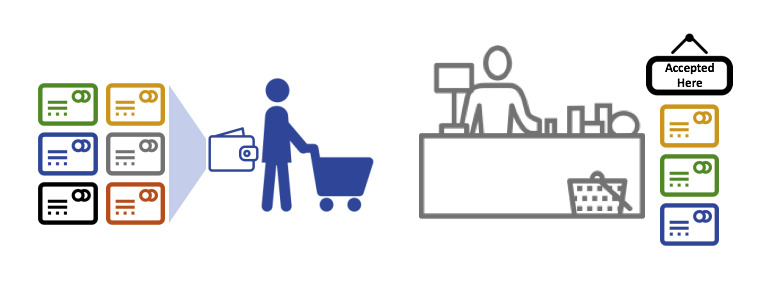

# Identidade

## O que é uma identidade?

Os diferentes atores em uma rede blockchain incluem nós pares, ordens, aplicativos 
clientes, administradores e muito mais. Cada um desses atores -- elementos ativos 
dentro ou fora de uma rede e capaz de consumir serviços -- possui uma identidade 
digital encapsulada em um certificado digital X.509. Essas identidades realmente 
importam porque **determinam as permissões exatas dos recursos e acessos as 
informações que os atores têm em uma rede blockchain.**

Além disso, uma identidade digital possui alguns atributos adicionais que a Fabric
usa para determinar permissões e da à união de uma identidade e dos atributos
associados um nome especial --- **principal**. Principals são exatamente como IDs 
de usuário ou IDs de grupo, mas um pouco mais flexíveis porque podem incluir uma 
ampla variedade de propriedades da identidade de um ator, como organização, 
unidade organizacional, função ou até mesmo a identidade específica do ator. 
Quando falamos sobre entidades, elas são as propriedades que determinam suas
permissões.

Para uma identidade ser **verificável**, ela deve vir de uma autoridade 
**confiável**. Um [provedor de serviços de associação](../Membership/Membership.html) 
(MSP) é essa autoridade confiável na Fabric. Mais especificamente, um MSP é um 
componente que define as regras que governam as identidades válidas para esta 
organização. A implementação padrão do MSP na Fabric usa certificados X.509 como 
identidades, adotando um modelo hierárquico tradicional de Infraestrutra de Chave
Pública (PKI) (mais sobre PKI adiante).

## Um cenário simples para explicar o uso de uma identidade

Imagine que você visita um supermercado para realizar algumas compras. No caixa, 
você vê uma placa informando que apenas os cartões Visa, Mastercard e AMEX são 
aceitos. Se você tentar pagar com um cartão diferente -- vamos usar um 
"ImagineCard" - não importa se o cartão é autêntico e que você tem fundos 
suficientes em sua conta. Não será aceito.

*Não basta ter um cartão de crédito válido -- ele também deve ser aceito pela 
loja! PKIs e MSPs trabalham juntos da mesma maneira -- uma PKI fornece uma lista 
de identidades e um MSP diz quais deles são membros de uma determinada 
organização que participa da rede.*

As autoridades de certificação da PKI e os MSPs fornecem uma combinação 
semelhante de funcionalidades. Uma PKI é como um fornecedor de cartões -- 
distribui muitos tipos diferentes de identidades verificáveis. Um MSP, por outro 
lado, é como a lista de fornecedores de cartões aceitos pela loja, determinando 
quais identidades são os membros confiáveis (atores) da rede de pagamento da 
loja. **MSPs transformam identidades verificáveis em membros de uma rede
blockchain**.

Vamos detalhar esses conceitos um pouco mais detalhadamente.

## O que são PKIs?

**Uma infraestrutura de chave pública (PKI) é uma coleção de tecnologias da
Internet que fornece comunicações seguras em uma rede.** É a PKI que coloca o 
**S** em **HTTPS** --- e se você estiver lendo esta documentação em um navegador
da Web, você provavelmente está usando uma PKI para garantir que ela seja 
proveniente de uma fonte verificada.

*Os elementos da infraestrutura de chave pública (PKI). Uma PKI é composta por 
autoridades de certificação que emitem certificados digitais para as partes (por 
exemplo, usuários de um serviço, provedor de serviços), que as usam para se 
autenticar nas mensagens que trocam em seu ambiente. A lista de revogação de 
certificados (CRL) de uma CA constitui uma referência para os certificados que 
não são mais válidos. A revogação de um certificado pode ocorrer por vários 
motivos. Por exemplo, um certificado pode ser revogado porque o material 
criptográfico privado associado ao certificado foi exposto.*

Embora uma rede blockchain seja mais do que uma rede de comunicações, ela se 
baseia no padrão PKI para garantir a comunicação segura entre vários 
participantes da rede e para garantir que as mensagens postadas na blockchain 
sejam autenticadas corretamente. Portanto, é importante entender os conceitos 
básicos da PKI e, em seguida, por que os MSPs são tão importantes.

Existem quatro elementos principais para a PKI:

 * **Certificados Digitais**
 * **Chaves Públicas e Privadas**
 * **Autoridade Certificadora**
 * **Lista de Certificados Revogados**

Vamos descrever rapidamente os conceitos básicos da PKI e, se você quiser saber 
mais detalhes, a [Wikipedia](https://pt.wikipedia.org/wiki/Infraestrutura_de_chaves_p%C3%BAblicas) 
é um bom lugar por onde começar.

## Certificados Digitais

Um certificado digital é um documento que contém um conjunto de atributos 
relacionados ao titular do certificado. O tipo mais comum de certificado é aquele
compatível com o [padrão X.509](https://pt.wikipedia.org/wiki/X.509), que permite 
a codificação dos detalhes de identificação de uma entidade em sua estrutura.

Por exemplo, Mary Morris na Divisão de Fabricação da Mitchell Cars em Detroit, 
Michigan, pode ter um certificado digital com o atributo `SUBJECT` de `C=US`, 
`ST=Michigan`, `L=Detroit`, `O=Mitchell Automóveis`, `OU=Manufacturing`, 
`CN=Mary Morris / UID = 123456`. O certificado de Mary é semelhante ao seu 
cartão de identidade do governo -- fornece informações sobre Mary que ela pode 
usar para provar fatos importantes sobre ela. Existem muitos outros atributos em 
um certificado X.509, mas vamos nos concentrar apenas nesses por enquanto.

*Um certificado digital que descreve uma parte chamada Mary Morris. Mary é o 
`ASSUNTO` (SUBJECT) do certificado e o texto em destaque SUBJECT mostra fatos 
importantes sobre Mary. O certificado também contém muito mais informações, como 
você pode ver. Mais importante, a chave pública de Mary é distribuída dentro de 
seu certificado, enquanto sua chave de assinatura privada não é. Essa chave de 
assinatura deve ser mantida em sigilo. *

O importante é que todos os atributos de Mary possam ser registrados usando uma 
técnica matemática chamada criptografia (literalmente, "*escrita secreta*") para 
que a adulteração invalide o certificado. A criptografia permite que Mary 
apresente seu certificado a outras pessoas para provar sua identidade, desde que 
a outra parte confie no emissor do certificado, conhecido como **Autoridade de 
Certificação** (CA). Desde que a CA mantenha certas informações criptográficas
com segurança (ou seja, sua própria **chave de assinatura privada**), qualquer 
pessoa que esteja lendo o certificado pode ter certeza de que as informações 
sobre Mary não foram adulteradas. Pense no certificado X.509 de Mary como uma 
carteira de identidade digital impossível de mudar.

## Autenticação, Chaves Públicas e Chaves Privadas

Autenticação e integridade da mensagem são conceitos importantes em comunicações 
seguras. A autenticação exige que as partes que trocam mensagens tenham certeza 
da identidade que criou uma mensagem específica. Para uma mensagem ter 
"integridade" significa que não pode ter sido modificado durante sua transmissão. 
Por exemplo, convém ter certeza de que está se comunicando com a verdadeira Mary 
Morris, e não com um imitador. Ou, se Mary lhe enviou uma mensagem, convém ter 
certeza de que ela não foi adulterada por mais ninguém durante a transmissão.

Os mecanismos de autenticação tradicionais dependem de **assinaturas digitais** 
que, como o nome sugere, permitem que uma parte **assine** digitalmente suas 
mensagens. As assinaturas digitais também fornecem garantias sobre a integridade da mensagem 
assinada.

Tecnicamente, os mecanismos de assinatura digital exigem que cada parte mantenha 
duas chaves criptograficamente conectadas: uma chave pública que é amplamente 
disponibilizada e atua como âncora de autenticação e uma chave privada usada para 
produzir **assinaturas digitais** nas mensagens. Os destinatários das mensagens 
assinadas digitalmente podem verificar a origem e a integridade de uma mensagem 
recebida, verificando se a assinatura anexada é válida sob a chave pública do 
remetente esperado.

**O relacionamento exclusivo entre uma chave privada e a respectiva chave pública
é a mágica criptográfica que torna possível a comunicação segura**. O 
relacionamento matemático exclusivo entre as chaves é tal que a chave privada 
pode ser usada para produzir uma assinatura em uma mensagem que somente a chave 
pública correspondente pode corresponder e apenas na mesma mensagem.

No exemplo acima, Mary usa sua chave privada para assinar a mensagem. A assinatura
pode ser verificada por qualquer pessoa que veja a mensagem assinada usando sua 
chave pública.

## Autoridades de certificação

Como você viu, um ator ou um nó pode participar da rede blockchain, por meio de 
uma **identidade digital** emitida por uma autoridade confiável pelo sistema. No 
caso mais comum, as identidades digitais (ou simplesmente **identidades**) têm a 
forma de certificados digitais validados criptograficamente que estão em 
conformidade com o padrão X.509 e são emitidos por uma Autoridade de Certificação 
(CA).

As CAs são uma parte comum dos protocolos de segurança da Internet, e você 
provavelmente já ouviu falar de alguns dos mais populares: Symantec (originalmente 
Verisign), GeoTrust, DigiCert, GoDaddy e Comodo, entre outros.

*Uma autoridade de certificação distribui certificados para diferentes atores. 
Esses certificados são assinados digitalmente pela CA e vinculam o ator à chave 
pública do ator (e, opcionalmente, a uma lista abrangente de propriedades). Como 
resultado, se alguém confia na CA (e conhece sua chave pública), pode confiar 
que o ator específico está vinculado à chave pública incluída no certificado e 
possui os atributos incluídos, validando a assinatura da CA no certificado do ator.*

Os certificados podem ser amplamente divulgados, pois não incluem as chaves 
privadas dos atores nem da CA. Como tal, eles podem ser usados como âncora de 
relações de confiança para autenticar mensagens vindas de diferentes atores.

As autoridades de certificação também possuem um certificado, que eles 
disponibilizam amplamente. Isso permite que os consumidores de identidades 
emitidas por uma determinada CA os verifiquem, verificando se o certificado só 
pode ter sido gerado pelo titular da chave privada correspondente (a CA).

Em uma configuração de blockchain, todo ator que deseja interagir com a rede 
precisa de uma identidade. Nessa configuração, você pode dizer que **uma ou mais 
CAs** podem ser usadas para **definir os membros de uma organização de uma 
perspectiva digital**. É a CA que fornece a base para que os atores de uma 
organização tenham uma identidade digital verificável.

### CAs raiz, CAs Intermediárias e Cadeias de Confiança

As CAs têm dois tipos: **CAs Raiz** e **CAs Intermediárias**. Como as CAs raiz 
(Symantec, Geotrust etc.) precisam **distribuir com segurança** centenas de 
milhões de certificados para os usuários da Internet, faz sentido espalhar esse 
processo pelas chamadas **CAs intermediárias**. Essas CAs intermediárias têm seus 
certificados emitidos pela CA raiz ou outra autoridade intermediária, permitindo 
o estabelecimento de uma "cadeia de confiança" para qualquer certificado emitido 
por qualquer CA da cadeia. Essa capacidade de rastrear a autoridade de 
certificação raiz não apenas permite o dimensionamento da função das autoridades 
de certificação, mas também fornece segurança -- permitindo que as organizações 
que consomem certificados usem as autoridades de certificação intermediárias com 
confiança -- limita a exposição da autoridade de certificação raiz, que, se 
comprometido, colocaria em risco toda a cadeia de confiança. Se uma CA 
intermediária for comprometida, por outro lado, haverá uma exposição muito menor.

*Uma cadeia de confiança é estabelecida entre uma CA Raiz e um conjunto de CAs 
Intermediárias, desde que a CA de emissão do certificado de cada uma dessas CAs
Intermediárias seja a própria CA Raiz ou tenha uma cadeia de confiança na CA Raiz.*

As CAs intermediárias fornecem uma enorme flexibilidade quando se trata da 
emissão de certificados em várias organizações, e isso é muito útil em um sistema 
de blockchain permissionado (como a Fabric). Por exemplo, você verá que
organizações diferentes podem usar CAs raiz diferentes ou a mesma CA raiz com 
CAs intermediárias diferentes -- isso realmente depende das necessidades da rede.

### Fabric CA

Isso ocorre porque as CAs são tão importantes que a Fabric fornece um componente 
de CA interno para permitir que você crie CAs nas redes de blockchain que você 
formar. Esse componente --- conhecido como **Fabric CA** é um provedor de CA raiz
privado, capaz de gerenciar identidades digitais de participantes da Fabric que 
possuem o formato de certificados X.509. Como a Fabric CA é uma CA personalizada,
direcionada às necessidades de CA raiz da Fabric, ela não é capaz de fornecer 
certificados SSL para uso geral/automático nos navegadores. No entanto, como 
**alguma** CA deve ser usada para gerenciar a identidade (mesmo em um ambiente de
teste), a Fabric CA pode ser usada para fornecer e gerenciar certificados. Também
é possível -- e totalmente apropriado -- usar uma raiz pública/comercial ou CA 
intermediária para fornecer identificação.

Se você estiver interessado, pode ler muito mais sobre o Fabric CA [na seção de 
documentação da CA](http://hyperledger-fabric-ca.readthedocs.io/).

## Lista de Certificados Revogados

É fácil entender uma lista de revogação de certificados (CRL) -- é apenas uma 
lista de referências a certificados que uma CA sabe que foi revogada por um 
motivo ou outro. Se você se lembrar do cenário da loja, uma CRL seria como uma 
lista de cartões de crédito roubados.

Quando uma terceira parte deseja verificar a identidade de outra parte, ela 
primeiro verifica a CRL da CA emissora para garantir que o certificado não foi 
revogado. Um verificador não precisa verificar a CRL, mas se não o fizer, corre 
o risco de aceitar uma identidade comprometida.

*Usando uma CRL para verificar se um certificado ainda é válido. Se um imitador 
tentar passar um certificado digital comprometido para uma parte que está 
validando, ele poderá ser verificado primeiro na CRL da CA emissora para garantir 
que não esteja listado como não válido.*

Observe que um certificado que está sendo revogado é muito diferente de um 
certificado que está expirando. Os certificados revogados não expiraram -- eles 
são, por qualquer outra medida, um certificado totalmente válido. Para obter 
informações mais detalhadas sobre CRLs, clique em [aqui](https://hyperledger-fabric-ca.readthedocs.io/en/latest/users-guide.html#generating-a-crl-certificate-revocation-list).

Agora que você viu como uma PKI pode fornecer identidades verificáveis por meio 
de uma cadeia de confiança, a próxima etapa é ver como essas identidades podem 
ser usadas para representar os membros confiáveis de uma rede blockchain. É aí 
que um Provedor de Serviço de Associação (MSP) entra em ação --- **identifica as 
partes que são membros de uma determinada organização na rede blockchain**.

Para saber mais sobre associação, consulte a documentação conceitual em [MSPs](../membership/membership.html).

<!---
Licensed under Creative Commons Attribution 4.0 International License https://creativecommons.org/licenses/by/4.0/
-->
