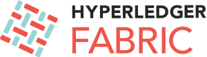

.. note:: Verifique se você está acessando a documentação que
      corresponde a versão do software que você está usando. Veja o
      rótulo da versão na parte superior do painel de navegação a esquerda.
      Você pode alterá-lo usando o seletor na parte inferior
      painel de navegação.

Uma plataforma de Blockchain para a empresas
============================================

Plataforma de livro-razão distribuído, com acesso permissionado de nível
corporativo, que oferece modularidade e versatilidade para um amplo conjunto de 
casos de uso da indústria.

.. toctree::
   :maxdepth: 1

   whatis
   whatsnew
   key_concepts
   getting_started
   developapps/developing_applications
   tutorials
   deployment_guide_overview
   ops_guide
   upgrade
   command_ref
   architecture
   Fabric-FAQ
   CONTRIBUTING
   glossary
   releases
   questions
   status

.. note:: Caso você tenha dúvidas não respondidas por essa documentação ou 
         tenha alguma dificuldade em qualquer dos tutoriais, por favor, visite
         a página :doc:`questions` para ver algumas dicas sobre onde buscar mais
         ajuda.

.. Licensed under Creative Commons Attribution 4.0 International License
   https://creativecommons.org/licenses/by/4.0/