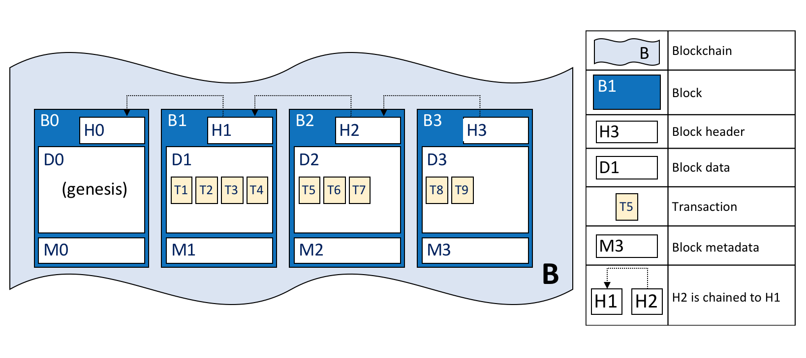

# Livro-Razão

**Audiência**: Arquitetos, desenvolvedores de aplicativos e contratos inteligentes, administradores

Um **livro-razão** é um conceito-chave na Hyperledger Fabric, ele armazena informações factuais importantes sobre objetos de negócios, o 
valor atual dos atributos dos objetos e o histórico de transações que resultaram nesses valores atuais.

Neste tópico, abordaremos:

* [O que é um livro-razão?](#o-que-e-um-livro-razao)
* [Registrando fatos sobre objetos de negócio](#livros-razao-fatos-e-estados)
* [O Livro-Razão](#o-livro-razao)
* [O Estado Global](#estado-global)
* [Estrutura de dados do blockchain](#blockchain)
* [Como os blocos são registrados na blockchain](#blocos)
* [Transações](#transacoes)
* [Opções de Banco de Dados do estado global](#opcoes-para-banco-de-dados-do-estado-global)
* [O livro-razão de exemplo do **Fabcar**](#exemplo-de-livro-razao-fabcar)
* [Livro-Razão e namespace](#namespaces)
* [Livro-Razão e canais](#canais)

## O que é um livro-razão?

Um livro-razão contém o estado atual de uma empresa como um diário de transações. Os primeiros livros-razão europeus e chineses datam de 
quase 1000 anos atrás, e os sumérios tinham [livros de pedra](http://www.sciencephoto.com/media/686227/view/accounting-ledger-sumerian-cuneiform) 
há 4000 anos --- mas vamos começar com um exemplo mais atualizado!

Você provavelmente está acostumado a olhar para sua conta bancária. O mais importante para você é o saldo disponível --- é o que você pode 
gastar no momento atual. Se você quiser ver como seu saldo foi aferido, verifique as transações de créditos e débitos que o determinaram. 
Este é um exemplo real de um livro-razão --- um estado (seu saldo bancário) e um conjunto de transações ordenadas (créditos e débitos) que o 
determinam. A Hyperledger Fabric é motivada por essas mesmas duas preocupações --- apresentar o valor atual de um conjunto de estados 
contábeis e capturar o histórico das transações que determinaram esses estados.

## Livros-Razão, Fatos e Estados

Um livro-razão não armazena literalmente objetos de negócios --- em vez disso, armazena **fatos** sobre esses objetos. Quando dizemos 
"armazenamos um objeto de negócios em um razão", o que realmente queremos dizer é que estamos registrando os fatos sobre o estado atual de 
um objeto e os fatos sobre o histórico de transações que levaram ao estado atual. Em um mundo cada vez mais digital, pode parecer que 
estamos vendo um objeto, em vez de fatos sobre um objeto. No caso de um objeto digital, é provável que ele viva em um armazenamento de dados 
externo, os fatos que armazenamos no livro-razão nos permitem identificar sua localização, além de outras informações importantes sobre ele.

Embora os fatos sobre o estado atual de um objeto de negócios possam mudar, o histórico dos fatos sobre ele é **imutável**, pode ser 
incluído, mas não pode ser alterado retrospectivamente. Vamos ver como pensar em uma [blockchain](../blockchain.html) como uma história 
imutável de fatos sobre objetos de negócios é uma maneira simples e poderosa de entendê-la.

Vamos agora dar uma olhada na estrutura do livro-razão da Hyperledger Fabric!

## O Livro-Razão

No Hyperledger Fabric, um livro-razão consiste em duas partes distintas, embora relacionadas --- um estado global e uma 
[blockchain](../blockchain.html). Cada um deles representa um conjunto de fatos sobre um conjunto de objetos de negócios.

Em primeiro lugar, existe um **estado global** --- um banco de dados que contém os **valores atuais** de um conjunto de estados do 
livro-razão. O estado global facilita para um programa acessar diretamente o valor atual de um estado, em vez de precisar calculá-lo 
percorrendo todo o log de transações. Os estados do razão são, por padrão, expressos como pares de **chave-valor**, e veremos mais adiante 
como a Hyperledger Fabric fornece flexibilidade nesse sentido. O estado global pode mudar com freqüência, pois os estados podem ser criados, 
atualizados e excluídos.

Em segundo lugar, existe um **blockchain** --- um log de transações que registra todas as alterações que resultaram no estado global atual. 
As transações são coletadas dentro de blocos anexados à blockchain --- permitindo entender o histórico de mudanças que resultaram no estado 
global atual. A estrutura de dados da blockchain é muito diferente do estado global porque, uma vez escrita, não pode ser modificada; é 
**imutável**.

 *Um Ledger L compreende o blockchain B e o estado global W, onde o blockchain B determina o estado 
global W. Também podemos dizer que o estado globl W é derivado do blockchain B.*

É útil pensar em um registro **lógico** no livro-razão em uma rede Hyperledger Fabric. Na realidade, a rede mantém várias cópias de um 
livro-razão --- que são mantidas consistentes com todas as outras por meio de um processo chamado **consenso**. O termo **Tecnologia de 
Livro-Razão Distribuido** (** DLT **) é frequentemente associado a esse tipo de livro-razão --- que é logicamente único, mas que possui 
muitas cópias consistentes distribuídas por uma rede.

Vamos agora examinar as estruturas de dados do estado global e da blockchain com mais detalhes.

## Estado Global

O estado global mantém o valor atual dos atributos de um objeto de negócios como um único do livro-razão. Isso é útil porque os programas 
geralmente exigem o valor atual de um objeto, seria complicado correr todo o blockchain para calcular o valor atual de um objeto --- você 
pode obter diretamente do estado global.

 *Um estado global do razão contendo dois estados. O primeiro estado é: chave = CAR1 e valor = 
Audi. O segundo estado possui um valor mais complexo: chave = CAR2 e valor = {modelo: BMW, cor = vermelho, proprietario = Jane}. Ambos os 
estados estão na versão 0.*

Um estado do livro-razão registra um conjunto de fatos sobre um objeto de negócio específico. Nosso exemplo mostra os estados do livro-razão 
para dois carros, CAR1 e CAR2, cada um com uma chave e um valor. Um programa de aplicativo pode chamar as APIs de um contrato inteligente 
**get**, **put** e **delete** para interagir com um livro-razão simples. Observe como um valor de estado pode ser simples (Audi ...) ou 
composto (tipo: BMW ...). O estado global é frequentemente consultado para recuperar objetos com certos atributos, por exemplo, para 
encontrar todos os BMWs vermelhos.

O estado global é implementado como um banco de dados. Isso faz muito sentido, porque um banco de dados fornece um rico conjunto de 
operadores para o armazenamento e recuperação eficientes de estados. Veremos mais adiante que a Hyperledger Fabric pode ser configurada para 
usar diferentes bancos de dados de estado global para atender às necessidades de diferentes tipos de valores de estado e aos padrões de 
acesso exigidos pelos aplicativos, por exemplo, em consultas complexas.

Os aplicativos enviam transações que geram alterações no estado global e essas transações acabam sendo confirmadas no livro-razão da 
blockchain. Os aplicativos são isolados dos detalhes desse mecanismo de [consenso](../txflow.html) pelo SDK da Hyperledger Fabric, eles 
simplesmente invocam um contrato inteligente e são notificados quando a transação foi incluída na blockchain (válida ou inválida). O ponto 
principal do projeto é que apenas as transações **assinadas** pelo conjunto necessário de **organizações endossantes** resultarão em uma 
atualização no estado global. Se uma transação não for assinada por endossantes suficientes, não resultará em uma mudança de estado global. 
Você pode ler mais sobre como os aplicativos usam [contratos inteligentes] e como 
[desenvolver aplicativos](../developapps/developing_applications.html).

Você também notará que um estado possui um número de versão e, no diagrama acima, os estados CAR1 e CAR2 estão em suas versões iniciais, 0. 
O número da versão é para uso interno da Hyperledger Fabric e é incrementado toda vez que o estado muda. A versão é verificada sempre que o 
estado é atualizado para garantir que os estados atuais correspondam à versão do momento do endosso. Isso garante que o estado global esteja 
mudando conforme o esperado, ou seja, que não houve uma atualização simultânea.

Finalmente, quando um livro-razão é criado, o estado global está vazio. Como qualquer transação que represente uma mudança válida para o 
estado global é registrada na blockchain, significa que o estado global pode ser gerado novamente a partir da blockchain a qualquer momento. 
Isso pode ser muito conveniente --- por exemplo, o estado global é gerado automaticamente quando um par é criado. Além disso, se um par 
falhar de forma anormal, o estado global poderá ser recriado no reinício do mesmo, antes que as transações sejam aceitas.

## Blockchain

Vamos agora mudar nossa atenção do estado global para o blockchain. Enquanto o estado global contém um conjunto de fatos relacionados ao 
estado atual de um conjunto de objetos de negócios, o blockchain é um registro histórico dos fatos sobre como esses objetos chegaram aos 
seus estados atuais. A blockchain registrou todas as versões anteriores de cada estado do livro-razão e como foi alterado.

A blockchain é estruturada como log sequencial de blocos interligados, em que cada bloco contém uma sequência de transações, cada transação 
representando uma consulta ou atualização no estado global. O mecanismo exato pelo qual as transações são ordenadas é discutido 
[em outro lugar](../peers/peers.html#peers-and-orderers), o importante é que o sequenciamento de blocos, bem como o sequenciamento de 
transações dentro dos blocos, seja estabelecido quando os blocos são criados pela primeira vez por um componente da Hyperledger Fabric 
chamado **serviço de ordens**.

O cabeçalho de cada bloco inclui um hash das transações do bloco, bem como um hash do cabeçalho do bloco anterior. Dessa maneira, todas as 
transações no razão são sequenciadas e criptograficamente vinculadas. Esse hash e vinculação tornam os dados do livro-razão muito seguros. 
Mesmo se um nó que hospeda o livro-razão for violado, ele não poderá convencer todos os outros nós de que possui a blockchain 'correta' 
porque o livro-razão é distribuído por uma rede de nós independentes.

A blockchain é sempre implementada como um arquivo, em contraste com o estado global, que usa um banco de dados. Essa é uma escolha sensata 
de design, pois a estrutura de dados da blockchain é fortemente influenciada por um conjunto muito pequeno de operações simples. Anexar ao 
final da blockchain é a principal operação, e a consulta atualmente é uma operação relativamente pouco frequente.

Vamos dar uma olhada na estrutura de uma blockchain com um pouco mais de detalhes.

 *Uma blockchain B contendo os blocos B0, B1, B2, B3. B0 é o primeiro bloco da blockchain, o 
bloco de gênese. *

No diagrama acima, podemos ver que o **bloco** B2 tem um **bloco de dados** D2 que contém as transações: T5, T6, T7.

Mais importante, B2 tem um **cabeçalho de bloco** H2, que contém um hash criptográfico de todas as transações em D2, bem como um hash de H1. 
Dessa forma, os blocos estão interligados de forma imutável um ao outro, o que o termo **blockchain** captura tão bem!

Finalmente, como você pode ver no diagrama, o primeiro bloco na blockchain é chamado de **bloco de gênese**. É o ponto de partida para o 
livro-razão, embora não contenha nenhuma transação do usuário. Em vez disso, ele contém uma transação de configuração que contém o estado 
inicial do canal de rede (não mostrado). Discutiremos o bloco genesis em mais detalhes quando discutimos a documentação rede blockchain e 
[canais](../channels.html).

## Blocos

Vamos dar uma olhada na estrutura de um bloco. Consiste em três seções

* **Cabeçalho do Bloco**

   Esta seção possui três campos, escritos quando um bloco é criado.

   * **Número do bloco**: Um número inteiro começando em 0 (o bloco de gênese) e acrescido 1 para cada novo bloco anexado à blockchain.

   * **Hash do bloco atual**: O hash de todas as transações contidas no bloco atual.

   * **Hash do cabeçalho do bloco anterior**: O hash do cabeçalho do bloco anterior.

   Esses campos são derivados internamente por hash criptográfico dos dados do bloco. Eles garantem que todos e cada bloco estejam 
   indissociavelmente ligados ao seu anterior, levando a um razão imutável.

    *Detalhes do cabeçalho do bloco. O cabeçalho H2 do bloco B2 consiste no número de bloco 2, o 
   hash CH2 dos dados atuais do bloco D2 e o hash do cabeçalho anterior do bloco H1.*

* **Dados do bloco**

   Esta seção contém uma lista de transações organizadas em ordem. É gravado quando o bloco é criado pelo serviço de ordens. Essas 
   transações têm uma estrutura rica, mas direta, que descrevemos [mais tarde](#transacoes) neste tópico.

* **Metadados do bloco**

   Esta seção contém o certificado e a assinatura do criador do bloco que é usado para verificar o bloco pelos nós da rede. Posteriormente, 
   o confirmador do bloco adiciona um indicador válido/inválido para cada transação em um bitmap que também reside nos metadados do bloco, 
   bem como um hash do estado cumulativo atualizado até esse bloco (inclusive), a fim de detectar uma inconsistencia do estado. Diferente 
   dos campos de dados e cabeçalho do bloco, esta seção não é uma entrada para o cálculo de hash do bloco.

## Transações

Como vimos, uma transação captura mudanças no estado global. Vamos dar uma olhada detalhada na estrutura do **blockdata** que contém as 
transações em um bloco.

 *Detalhes da transação. A transação T4 no bloco de dados D1 do bloco B1 consiste no cabeçalho 
da transação, H4, uma assinatura de transação S4, uma proposta de transação P4, uma resposta de transação R4 e uma lista de endossos E4.*

No exemplo acima, podemos ver os seguintes campos:

* **Cabeçalho**

   Esta seção, ilustrada por H4, captura alguns metadados essenciais sobre a transação --- por exemplo, o nome do chaincode relevante e sua 
   versão.

* **Assinatura**

   Esta seção, ilustrada pelo S4, contém uma assinatura criptográfica criada pelo aplicativo cliente. Este campo é usado para verificar se 
   os detalhes da transação não foram violados, pois requer a chave privada do aplicativo para gerá-lo.

* **Proposta**

   Este campo, ilustrado por P4, codifica os parâmetros de entrada fornecidos por um aplicativo ao contrato inteligente que cria a 
   atualização proposta do livro-razão. Quando o contrato inteligente é executado, esta proposta fornece um conjunto de parâmetros de 
   entrada que, em combinação com o estado global atual, determinam o novo estado global.

* **Resposta**

  Esta seção, ilustrada por R4, captura os valores antes e depois do estado global, como um **conjunto de leitura e gravação** (conjunto RW). 
  É a saída de um contrato inteligente e, se a transação for validada com sucesso, ela será aplicada ao livro-razão para atualizar o estado 
  global.

* **Endossos**

  Conforme mostrado no E4, esta é uma lista de respostas de transações assinadas de cada organização necessária, suficientes para satisfazer 
  a política de endosso. Você notará que, embora apenas uma resposta da transação esteja incluída na transação, há vários endossos. Isso 
  ocorre porque cada endosso codifica efetivamente a resposta de transação específica de sua organização --- o que significa que não há 
  necessidade de incluir nenhuma resposta de transação que não corresponda a endossos suficientes, pois ela será rejeitada como inválida e 
  não atualizará o estado global.

Isso conclui os principais campos da transação --- existem outros, mas esses são os essenciais que você precisa entender para ter um 
entendimento sólido da estrutura de dados do livro-razão.

## Opções para banco de dados do estado global

O estado global é fisicamente implementado como um banco de dados, para fornecer armazenamento e recuperação simples e eficiente dos estados 
do razão. Como vimos, os estados do livro-razão podem ter valores simples ou compostos e, para acomodar isso, a implementação do banco de 
dados do estado global pode variar, permitindo que esses valores sejam implementados com eficiência. As opções para o banco de dados de 
estado global atualmente incluem LevelDB e CouchDB.

LevelDB é o padrão e é particularmente apropriado quando os estados do livro-razão são simples pares de chave-valor. Um banco de dados 
LevelDB é co-localizado no nó par --- ele é baseado no mesmo processo do sistema operacional.

O CouchDB é uma opção particularmente apropriada quando os estados do livro-razão são estruturados como documentos JSON, porque o CouchDB 
suporta consultas avançadas e atualização de tipos de dados mais ricos, geralmente encontrados em transações comerciais. Em termos de 
implementação, o CouchDB é executado em um processo separado do sistema operacional, mas ainda existe uma relação 1:1 entre um nó par e uma 
instância do CouchDB. Tudo isso é invisível para um contrato inteligente. Consulte 
[CouchDB como Banco de Dados de Estado](../couchdb_as_state_database.html) para obter mais informações sobre o CouchDB.

No LevelDB e no CouchDB, vemos um aspecto importante da Hyperledger Fabric --- ele é *conectável*. O banco de dados do estado global pode 
ser um banco de dados relacional, um repositório de grafos ou um banco de dados temporal. Isso fornece grande flexibilidade nos tipos de 
estados que podem ser acessados com eficiência no livro-razão, permitindo que a Hyperledger Fabric resolva muitos tipos diferentes de
problemas.

## Exemplo de livro-razão: fabcar

Conforme terminamos este tópico do livro-razão, vamos dar uma olhada em um exemplo de livro-razão. Se você executou o 
[aplicativo de exemplo fabcar](../write_first_app.html), então criou o livro-razão.

O aplicativo de exemplo fabcar cria um conjunto de 10 carros, cada um com uma identidade única; uma cor, marca, modelo e proprietários 
diferentes. Aqui está a aparência do livro depois que os quatro primeiros carros foram criados.

 *O livro-razão L, compreende um estado global W e uma blockchain B. W contém quatro estados 
com as chaves: CAR0, CAR1, CAR2 e CAR3. B contém dois blocos, 0 e 1. O bloco 1 contém quatro transações: T1, T2, T3, T4.*

Podemos ver que o estado global contém os estados que correspondem a CAR0, CAR1, CAR2 e CAR3. O CAR0 tem um valor que indica que é um Toyota 
Prius azul, atualmente de propriedade da Tomoko, e podemos ver estados e valores semelhantes para os outros carros. Além disso, podemos ver 
que todos os estados do carro estão na versão 0, indicando que esse é o número da versão inicial --- eles não foram atualizados desde que 
foram criados.

Também podemos ver que o blockchain contém dois blocos. O bloco 0 é o bloco de gênese, embora não contenha transações relacionadas a carros. 
O bloco 1, no entanto, contém as transações T1, T2, T3, T4 e elas correspondem às transações que criaram os estados iniciais de CAR0 a CAR3
no estado global. Podemos ver que o bloco 1 está vinculado ao bloco 0.

Não mostramos os outros campos nos blocos ou transações, especificamente cabeçalhos e hashes. Se você estiver interessado nos detalhes 
precisos, encontrará um tópico de referência dedicado em outra parte da documentação. Ele fornece um exemplo completo de um bloco inteiro 
com suas transações em gloriosos detalhes --- mas, por enquanto, você alcançou um sólido entendimento conceitual de um livro-razão 
Hyperledger Fabric. Bem feito!

## Namespaces

Embora tenhamos apresentado o livro como se fosse um único estado global e uma única blockchain, isso é um pouco de simplificação demais. Na 
realidade, cada chaincode tem seu próprio estado global, separado de todos os outros chaincodes. Os estados globais são organizados por 
`namespaces`, de modo que apenas contratos inteligentes dentro do mesmo chaincode possam acessar um determinado namespace.

A blockchain não está no namespace. Ele contém transações de vários namespaces de contratos inteligentes diferentes. Você pode ler mais 
sobre os namespaces do chaincode neste [tópico](../developapps/chaincodenamespace.html).

Vamos ver agora como o conceito de `namespace` é aplicado em um canal da Hyperledger Fabric.

## Canais

Na Hyperledger Fabric, cada [canal](../channels.html) possui um livro-razão completamente separado. Isso significa uma blockchain 
e estados globais completamente separados, incluindo namespaces. É possível que aplicativos e contratos inteligentes se comuniquem entre 
canais para que as informações do livro-razão possam ser acessadas entre eles.

Você pode ler mais sobre como os livros-razão funcionam com canais neste [tópico](../developapps/chaincodenamespace.html#channels).

## Mais informações

Veja os tópicos [Fluxo da Transação](../txflow.html),
[Semantica de Escrita e Leitura](../readwrite.html) e
[CouchDB como Banco de Dados de Estado](../couchdb_as_state_database.html) 
para se aprofundar sobre o fluxo de transações, 
o controle de simultaneidade e o banco de dados do estado global.

<!--- Licensed under Creative Commons Attribution 4.0 International License
https://creativecommons.org/licenses/by/4.0/ -->
