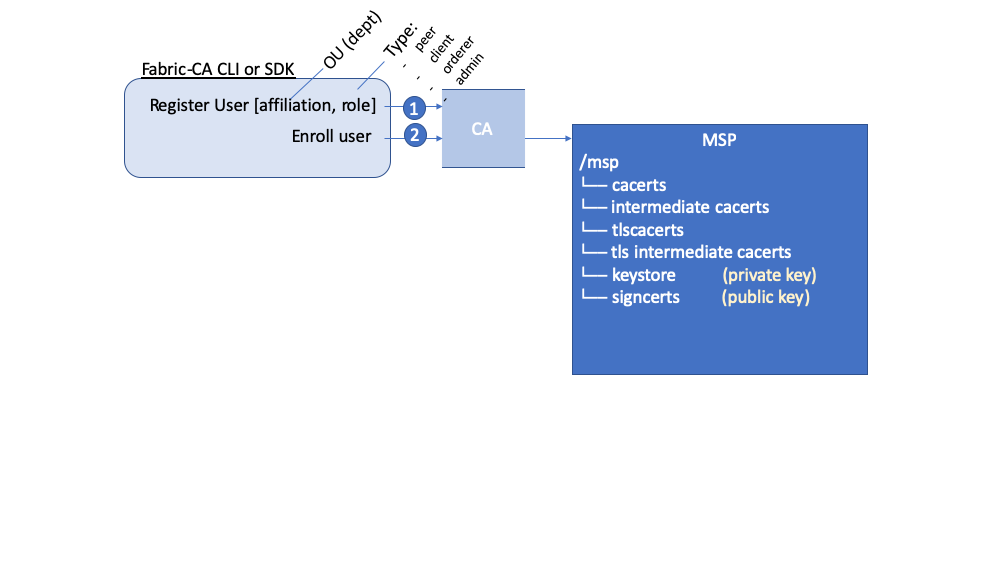
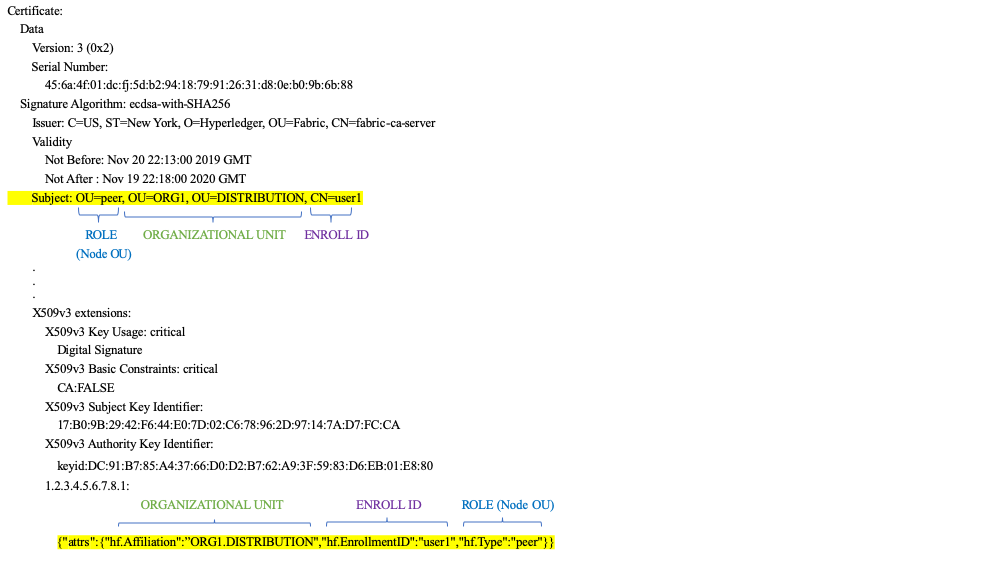

# Provedor de Serviço de Associação (MSP)

## Por que preciso de um MSP?

Como a Fabric é uma rede permissionada, os participantes da blockchain precisam 
de uma maneira de provar sua identidade para o restante da rede, a fim de realizar
transações na rede. Se você leu a documentação sobre [Identidade](../identity/identity.html), 
viu como uma PKI (Public Key Infrastructure) pode fornecer identidades verificáveis 
​​por meio de uma cadeia de confiança. Como essa cadeia de confiança é usada pela 
rede blockchain?

As autoridades de certificação emitem identidades gerando uma chave pública e 
privada que forma um par de chaves que pode ser usado para provar a identidade. 
Como uma chave privada nunca pode ser compartilhada publicamente, é necessário 
um mecanismo para executar a prova, é onde o MSP entra. Por exemplo, um par usa 
sua chave privada para assinar digitalmente ou endossar uma transação. O MSP no 
serviço de pedidos contém a chave pública do par que é usada para verificar se a
assinatura anexada à transação é válida. A chave privada é usada para produzir 
uma assinatura em uma transação que somente a chave pública correspondente, que 
faz parte de um MSP, pode corresponder. Assim, o MSP é o mecanismo que permite 
que essa identidade seja confiável e reconhecida pelo restante da rede sem nunca 
revelar a chave privada do membro.

Lembre-se, no cenário do cartão de crédito, no tópico Identidade, que a Autoridade
de Certificação é como um fornecedor de cartões -- ela distribui muitos tipos 
diferentes de identidades verificáveis. Um MSP, por outro lado, determina quais 
fornecedores de cartão de crédito são aceitos na loja. Dessa maneira, o MSP 
transforma uma identidade (o cartão de crédito) em uma função (a capacidade de 
comprar coisas na loja).

Essa capacidade de transformar identidades verificáveis em funções é fundamental 
para o funcionamento das redes Fabric, pois permite que as organizações, nós e 
canais estabeleçam MSPs que determinam quem tem permissão para fazer o que nos
níveis de organização, nó e canal.


*As identidades são semelhantes aos seus cartões de crédito usados ​​para provar 
que você pode pagar. O MSP é semelhante à lista de cartões de crédito aceitos.*

Considere um consórcio de bancos que operam uma rede blockchain. Cada banco opera 
nós pares e de ordens, e os pares endossam as transações enviadas à rede. No 
entanto, cada banco também teria departamentos e correntistas. Os titulares da 
conta pertenceriam a cada organização, mas não executariam nós na rede. Eles só 
interagiriam com o sistema a partir de seus aplicativos móveis ou da web. Então,
como a rede reconhece e diferencia essas identidades? Uma CA foi usada para criar
as identidades, mas, como no exemplo do cartão, essas identidades não podem apenas 
ser emitidas, elas precisam ser reconhecidas pela rede. MSPs são usados ​​para 
definir as organizações confiáveis ​​pelos membros da rede. Os MSPs também são os 
mecanismos que fornecem aos membros um conjunto de funções e permissões na rede. 
Como os MSPs que definem essas organizações são conhecidos pelos membros de uma 
rede, eles podem ser usados ​​para validar as entidades de rede que tentam executar 
ações.

Por fim, considere se você deseja ingressar em uma rede _existente_, precisa de 
uma maneira de transformar sua identidade em algo que seja reconhecido pela rede. 
O MSP é o mecanismo que permite que você participe de uma rede blockchain 
permissionada. Para realizar transações em uma rede Fabric, um membro precisa:

1. Tenha uma identidade emitida por uma CA confiável pela rede.
2. Torne-se membro de uma _organização_ que é reconhecida e aprovada pelos membros
da rede. O MSP é como a identidade está vinculada à associação de uma organização. 
A associação é obtida adicionando a chave pública do membro (também conhecida como 
certificado, certificado de assinatura ou certificado de assinatura) ao MSP da 
organização.
3. Adicione o MSP a um [consórcio](../glossary.html#consorcio) na rede ou em um canal.
4. Verifique se o MSP está incluído nas definições da [política](../policies/policies.html) 
da rede.

## O que é um MSP?

Apesar do nome, o Provedor de Serviços para Membros não fornece nada. Em vez disso,
a implementação do requisito MSP é um conjunto de pastas que são adicionadas à 
configuração da rede e são usadas para definir uma organização interna (as 
organizações decidem quem são seus administradores) e externa (permitindo que 
outras organizações validem que entidades tem autoridade para fazer o que eles 
estão tentando fazer). Enquanto as autoridades de certificação geram os 
certificados que representam identidades, o MSP contém uma lista de identidades 
permitidas.

O MSP identifica quais CAs raises e intermediárias são aceitas para definir os 
membros de um domínio confiável listando as identidades de seus membros ou 
identificando quais CAs estão autorizadas a emitir identidades válidas para seus 
membros.

Mas o poder de um MSP vai além de simplesmente listar quem é participante da rede 
ou membro de um canal. É o MSP que transforma uma identidade em uma **função**, 
identificando privilégios específicos que um ator possui em um nó ou canal. 
Observe que, quando um usuário é registrado com uma Fabric CA, o papel de 
administrador, nó, cliente, ordenação ou membro deve ser associada ao usuário. 
Por exemplo, identidades registradas com a função "nó" devem, naturalmente, ser 
atribuídas a um nó par. Da mesma forma, identidades registradas com a função 
"admin" devem ser dadas aos administradores da organização. Iremos nos aprofundar 
no significado dessas funções mais adiante neste tópico.

Além disso, um MSP pode permitir a identificação de uma lista de identidades que 
foram revogadas -- como discutido na documentação [Identidade](../identity/identity.html) --, 
mas falaremos sobre como esse processo também se estende a um MSP.

## Domínios MSP

MSPs ocorrem em dois domínios em uma rede blockchain:

* Localmente no nó de um ator (**MSP local**)
* Na configuração do canal (**channel MSP**)

A principal diferença entre os MSPs locais e de canal não é como eles funcionam 
-- ambos transformam identidades em papéis -- mas seu **escopo**. Cada MSP lista 
funções e permissões em um nível específico de administração.

### MSPs locais

**MSPs locais são definidos para clientes e nós (nós pares e ordens)**.
MSPs locais definem as permissões para um nó (que são os administradores de mesmo
nível que podem operar o nó, por exemplo). Os MSPs locais de clientes (os titulares
da conta no cenário bancário acima) permitem que o usuário se autentique em suas
transações como membro de um canal (por exemplo, em transações de chaincodes) ou
como proprietário de uma função específica no sistema, como administrador da 
organização, por exemplo, em transações de configuração.

**Todo nó deve ter um MSP local definido**, pois define quem possui direitos 
administrativos ou participativos nesse nível (os administradores de nós pares 
não serão necessariamente administradores de canal e vice-versa). Isso permite 
autenticar mensagens de membros fora do contexto de um canal e definir as 
permissões em um nó específico (que tem a capacidade de instalar o chaincode em 
um par, por exemplo). Observe que um ou mais nós podem pertencer a uma organização. 
Um MSP define os administradores da organização. E a organização, o administrador 
da organização, o administrador do nó e o próprio nó devem ter a mesma raiz de 
confiança.

Um MSP local do ordenador também é definido no sistema de arquivos do nó e se 
aplica apenas a esse nó. Como nós pares, os pedidos também pertencem a uma única 
organização e, portanto, têm um único MSP para listar os atores ou nós nos quais 
confia.

### MSPs de canal

Por outro lado, **os MSPs de canal definem direitos administrativos e participativos 
no nível do canal**. Os pares e os nós de ordens em um canal de aplicativo 
compartilham a mesma visualização dos MSPs do canal e, portanto, poderão autenticar 
corretamente os participantes do canal. Isso significa que, se uma organização 
desejar ingressar no canal, um MSP que incorpore a cadeia de confiança dos membros 
da organização precisará ser incluído na configuração do canal. Caso contrário, 
as transações originárias das identidades desta organização serão rejeitadas. 
Enquanto os MSPs locais são representados como uma estrutura de pastas no sistema
de arquivos, os MSPs do canal são descritos em uma configuração de canal.


*Snippet de um arquivo config.json do canal que inclui dois MSPs da organização.*

**MSPs de canal identificam quem possui autoridades no nível do canal**.
O canal MSP define a _relação_ entre as identidades dos membros do canal (que são 
MSPs) e a imposição de políticas no nível do canal. Os MSPs do canal contêm os 
MSPs das organizações dos membros do canal.

**Toda organização que participa de um canal deve ter um MSP definido para ele**. 
De fato, é recomendável que haja um mapeamento individual entre organizações e MSPs. 
O MSP define quais membros têm poderes para agir em nome da organização. Isso inclui 
a configuração do próprio MSP, bem como a aprovação de tarefas administrativas que a
organização possui, como adicionar novos membros a um canal. Se todos os membros da
rede faziam parte de uma única organização ou MSP, a privacidade dos dados é 
sacrificada. Várias organizações facilitam a privacidade segregando dados do 
livro-razão apenas para membros do canal. Se for necessária mais granularidade 
dentro de uma organização, ela poderá ser dividida em unidades organizacionais (OUs)
que descrevemos em mais detalhes a frente neste tópico.

**O canal do sistema MSP inclui os MSPs de todas as organizações que participam 
de um serviço de ordens.** Um serviço de ordens provavelmente incluirá nós de 
ordens de várias organizações e, coletivamente, essas organizações executam o 
serviço de ordens, gerenciando o consórcio de organizações e as políticas padrão 
que são herdadas pelos canais de aplicativos.

**MSPs locais são definidos apenas no sistema de arquivos do nó ou usuário** ao 
qual eles se aplicam. Portanto, fisicamente e logicamente, há apenas um MSP local 
por nó. No entanto, como os MSPs do canal estão disponíveis para todos os nós no 
canal, eles são definidos logicamente uma vez na configuração do canal. No entanto, 
**um canal MSP também é instanciado no sistema de arquivos de todos os nós no canal
e mantido sincronizado por consenso**. Portanto, embora exista uma cópia de cada 
MSP de canal no sistema de arquivos local de cada nó, logicamente um MSP de canal
reside e é mantido pelo canal ou pela rede.

O diagrama a seguir ilustra como os MSPs locais e de canal coexistem na rede:


*Os MSPs do nó e do solicitante são locais, enquanto os MSPs de um canal (incluindo
o canal de configuração de rede, também conhecido como canal do sistema) são 
globais, compartilhados entre todos os participantes desse canal. Nesta figura, 
o canal do sistema de rede é administrado pelo ORG1, mas outro canal de aplicativo 
pode ser gerenciado pelo ORG1 e ORG2. O par é um membro e é gerenciado pelo ORG2,
enquanto o ORG1 gerencia o ordenador da figura. O ORG1 confia nas identidades do 
RCA1, enquanto o ORG2 confia nas identidades do RCA2. É importante observar que 
essas são identidades de administração, refletindo quem pode administrar esses 
componentes. Portanto, enquanto o ORG1 administra a rede, o ORG2.MSP existe na 
definição de rede.*

## Qual o papel de uma organização em um MSP?

Uma **organização** é um grupo lógico de membros gerenciados. Isso pode ser algo 
tão grande quanto uma corporação multinacional ou tão pequeno quanto uma loja de 
flores. O mais importante sobre as organizações (ou **orgs**) é que elas gerenciam 
seus membros em um único MSP. O MSP permite que uma identidade seja vinculada a 
uma organização. Observe que isso é diferente do conceito de organização definido 
em um certificado X.509, que mencionamos acima.

O relacionamento exclusivo entre uma organização e seu MSP torna sensato nomear 
o MSP após a organização, uma convenção que você encontrará adotada na maioria 
das configurações de políticas. Por exemplo, a organização `ORG1` provavelmente 
teria um MSP chamado algo como `ORG1-MSP`. Em alguns casos, uma organização pode
exigir vários grupos de associação --- por exemplo, onde os canais são usados ​​
para executar funções comerciais muito diferentes entre as organizações. Nesses 
casos, faz sentido ter vários MSPs e nomeá-los adequadamente, por exemplo, 
`ORG2-MSP-NATIONAL` e `ORG2-MSP-GOVERNMENT`, refletindo as diferentes raízes de 
confiança da associação dentro do `ORG2` nas vendas `NATIONAL` canal em 
comparação com o canal regulatório `GOVERNO`.

### Unidades Organizacionais (OUs) e MSPs

Uma organização também pode ser dividida em várias **unidades organizacionais**, 
cada uma das quais com um certo conjunto de responsabilidades, também chamadas de 
`afiliações`. Pense em uma UO como um departamento dentro de uma organização. Por
exemplo, a organização `ORG1` pode ter UOs `ORG1.MANUFACTURING` e `ORG1.DISTRIBUTION` 
para refletir essas linhas de negócios separadas. Quando uma CA emite certificados 
X.509, o campo `OU` no certificado especifica a linha de negócios à qual a 
identidade pertence. Um benefício do uso de OUs como esse é que esses valores 
podem ser usados nas definições de política para restringir o acesso ou em 
contratos inteligentes para controle de acesso baseado em atributos. Caso 
contrário, MSPs separados precisariam ser criados para cada organização.

A especificação de UOs é opcional. Se as OUs não forem usadas, todas as identidades 
que fazem parte de um MSP -- como identificadas pelas pastas CA raiz e CA 
intermediária -- serão consideradas membros da organização.

### Papéis da OU e MSPs

Além disso, existe um tipo especial de OU, às vezes chamada de `Node OU`, que 
pode ser usada para conferir uma função a uma identidade. Essas funções da OU do 
nó são definidas no arquivo `$FABRIC_CFG_PATH/msp/config.yaml` e contêm uma lista
de unidades organizacionais cujos membros são considerados parte da organização 
representada por este MSP. Isso é particularmente útil quando você deseja 
restringir os membros de uma organização àqueles que possuem uma identidade 
(assinada por uma das CAs designadas pelo MSP) com uma função específica de OU 
do nó. Por exemplo, com OUs de nó, você pode implementar uma política de endosso
mais granular que exige que os nós pares Org1 endossem uma transação, em vez de 
qualquer membro da Org1.

Para usar as funções da OU do Nó, o recurso "classificação de identidade" deve 
estar ativado para a rede. Ao usar a estrutura MSP baseada em pasta, isso é feito 
ativando "OUs de nó" no arquivo config.yaml, que reside na raiz da pasta MSP:

```
NodeOUs:
  Enable: true
  ClientOUIdentifier:
    Certificate: cacerts/ca.sampleorg-cert.pem
    OrganizationalUnitIdentifier: client
  PeerOUIdentifier:
    Certificate: cacerts/ca.sampleorg-cert.pem
    OrganizationalUnitIdentifier: peer
  AdminOUIdentifier:
    Certificate: cacerts/ca.sampleorg-cert.pem
    OrganizationalUnitIdentifier: admin
  OrdererOUIdentifier:
    Certificate: cacerts/ca.sampleorg-cert.pem
    OrganizationalUnitIdentifier: orderer
```
No exemplo acima, existem 4 possíveis Nós OU `ROLES` para o MSP:

  * cliente (client)
  * par (peer)
  * admin (admin)
  * ordenador (orderer)

Esta convenção permite distinguir funções do MSP pela OU presente no atributo 
CommonName do certificado X509. O exemplo acima diz que qualquer certificado 
emitido por cacerts/ca.sampleorg-cert.pem no qual OU=client será identificado 
como cliente, OU=peer como nó, etc. A partir do Fabric v1.4.3, também há uma OU 
para o ordenador e para administradores. A nova função de administrador significa 
que você não precisa mais colocar explicitamente certs na pasta admincerts do 
diretório MSP. Em vez disso, a função `admin` presente no signcert do usuário 
qualifica a identidade como um usuário administrador.

Esses atributos de função e OU são atribuídos a uma identidade quando o CA ou 
SDK da Fabric é usado para `registrar` um usuário na CA. É o comando do usuário 
`register` subsequente que gera os certificados na pasta `/msp` dos usuários.



Os atributos ROLE e OU resultantes são visíveis dentro do certificado de assinatura 
X.509 localizado na pasta `/signcerts`. O atributo `ROLE` é identificado como 
`hf.Type` e refere-se à função de um ator dentro de sua organização (especificando, 
por exemplo, que um ator é um `par`). Veja a seguir o pedaço de um certificado de
assinatura mostra como as Funções e OUs são representadas no certificado.



**Nota:** Para MSPs de canal, apenas porque um ator tem o papel de administrador, 
isso não significa que eles podem administrar recursos específicos. O poder real 
de uma determinada identidade em relação à administração do sistema é determinado 
pelas _políticas_ que gerenciam os recursos do sistema. Por exemplo, uma política 
de canal pode especificar que os administradores do `ORG1-MANUFACTURING`, ou seja, 
identidades com a função de `admin` e uma OU do nó da `ORG1-MANUFACTURING`, tenham 
o direito de adicionar novas organizações ao canal, enquanto os administradores da
`ORG1-DISTRIBUTION` não têm esses direitos.

Finalmente, as OUs podem ser usadas por diferentes organizações em um consórcio 
para se distinguir. Porém, nesses casos, as diferentes organizações precisam usar 
as mesmas CAs raiz e intermediárias para sua cadeia de confiança e atribuir o 
campo OU para identificar membros de cada organização. Quando toda organização 
tem a mesma CA ou cadeia de confiança, isso torna o sistema mais centralizado do
que seria desejável e, portanto, merece uma atenção cuidadosa em uma rede blockchain.

## Estrutura do MSP

Vamos explorar os elementos MSP que estruturam a funcionalidade que descrevemos 
até agora.

Uma pasta MSP local contém as seguintes subpastas:


*A figura acima mostra as subpastas em um MSP local no sistema de arquivos*

* **config.yaml:** Usado para configurar o recurso de classificação de identidade 
  no Fabric, ativando "OUs de nó" e definindo as funções aceitas.

* **cacerts:** Esta pasta contém uma lista de certificados X.509 autoassinados 
das CAs raiz confiáveis pela organização representada por este MSP. Deve haver 
pelo menos um certificado de CA raiz nesta pasta MSP.

   Essa é a pasta mais importante porque identifica as CAs das quais todos os 
   outros certificados devem ser derivados para serem considerados membros da
   organização correspondente para formar a cadeia de confiança.

* **intermediatecerts:** Esta pasta contém uma lista de certificados X.509 das 
CAs intermediárias creditadas ​​por esta organização. Cada certificado deve ser 
assinado por uma das CAs raiz no MSP ou por qualquer CA intermediária cuja cadeia 
de CA emissora finalmente retorne a uma CA raiz confiável.

  Uma CA intermediária pode representar uma subdivisão diferente da organização 
  (como `ORG1-MANUFACTURING` e `ORG1-DISTRIBUTION` fazem para `ORG1`) ou a própria 
  organização (como pode ser o caso se uma CA comercial for definida como 
  responsável pelo gerenciamento de identidade de uma organização). No último caso, 
  as CAs intermediárias podem ser usadas para representar subdivisões da 
  organização. [Aqui](../msp.html), você pode encontrar mais informações sobre 
  práticas recomendadas para a configuração do MSP. Observe que é possível ter 
  uma rede em funcionamento que não possua uma CA intermediária, nesse caso, essa 
  pasta estaria vazia.

  Como a pasta CA raiz, essa pasta define as CAs das quais os certificados devem
  ser emitidos para serem considerados membros da organização.

* **admincerts (Descontinuado do Fabric v1.4.3 e superior):** Esta pasta contém 
uma lista de identidades que definem os atores que têm a função de administradores 
dessa organização. Em geral, deve haver um ou mais certificados X.509 nesta lista.

  **Nota:** Antes do Fabric v1.4.3, os administradores eram definidos colocando 
  explicitamente certificados na pasta `admincerts` no diretório MSP local do seu 
  nó par. **Com o Fabric v1.4.3 ou superior, os certificados nesta pasta não são 
  mais necessários.** Em vez disso, é recomendável que, quando o usuário estiver 
  registrado na CA, a função `admin` seja usada para designar o administrador do 
  nó. Em seguida, a identidade é reconhecida como um `admin` pelo valor da função 
  OU do nó em seu certificado de assinatura. Como um lembrete, para alavancar a 
  função de administrador, o recurso "identity classification" deve ser ativado 
  no config.yaml acima, configurando "OUs de nó" para `Enable: true`. Vamos 
  explorar isso mais tarde.

  E, como lembrete, para os MSPs do canal, apenas porque um ator tem o papel de 
  administrador, não significa que eles possam administrar recursos específicos. 
  O poder real de uma determinada identidade em relação à administração do sistema 
  é determinado pelas _políticas_ que gerenciam os recursos do sistema. Por 
  exemplo, uma política de canal pode especificar que os administradores da 
  `ORG1-MANUFACTURING` têm o direito de adicionar novas organizações ao canal, 
  enquanto os administradores do `ORG1-DISTRIBUTION` não têm esses direitos.

* **keystore: (chave privada)** Esta pasta é definida para o MSP local de um nó 
par ou de ordens (ou no MSP local de um cliente) e contém a chave privada do nó. 
Essa chave é usada para assinar dados -- por exemplo, para assinar uma resposta 
da proposta de transação, como parte da fase de endosso.

  Essa pasta é obrigatória para MSPs locais e deve conter exatamente uma chave 
  privada. Obviamente, o acesso a esta pasta deve ser limitado apenas às 
  identidades dos usuários que têm responsabilidade administrativa no par.

  A configuração **channel MSP** não inclui essa pasta, porque os MSPs do canal 
  visam apenas oferecer funcionalidades de validação de identidade e não 
  habilidades de assinatura.

  **Nota:** Se você estiver usando um [Módulo Físico de Segurança (HSM)](../hsm.html) 
  para gerenciamento de chaves, esta pasta estará vazia porque a chave privada é 
  gerada e armazenada no HSM.

* **signcert:** Para um nó par ou de ordens (ou no MSP local de um cliente), esta 
pasta contém a **chave de assinatura do nó**. Essa chave corresponde 
criptograficamente à identidade do nó incluída na pasta **Node Identity** e é 
usada para assinar dados --- por exemplo, para assinar uma resposta da proposta 
de transação, como parte da fase de endosso.

  Essa pasta é obrigatória para MSPs locais e deve conter exatamente uma chave 
  pública. Obviamente, o acesso a esta pasta deve ser limitado apenas às 
  identidades dos usuários que têm responsabilidade administrativa no nó par.

  A configuração de um **MSP de canal** não inclui esta pasta, pois os MSPs de 
  canal visam apenas oferecer funcionalidades de validação de identidade e não 
  habilidades de assinatura.

* **tlscacerts:** Esta pasta contém uma lista de certificados X.509 autoassinados 
das CAs raiz confiáveis ​​por esta organização **para comunicações seguras entre os 
nós usando TLS**. Um exemplo de comunicação TLS seria quando um par precisa se 
conectar a um ordenador para poder receber atualizações do razão.

  As informações do MSP TLS estão relacionadas aos nós dentro da rede -- os pares 
  e ordens, e não aos aplicativos e administrações que consomem a rede.

  Deve haver pelo menos um certificado de CA raiz TLS nesta pasta. Para obter 
  mais informações sobre TLS, consulte [Protegendo a comunicação com TLS 
  (Transport Layer Security)](../enable_tls.html).

* **tlsintermediatecacerts:** Esta pasta contém uma lista de certificados CA 
intermediários de CAs confiáveis ​​pela organização representada por este MSP 
**para comunicações seguras entre nós usando TLS**. Essa pasta é especificamente 
útil quando CAs comerciais são usadas para certificados TLS de uma organização. 
Semelhante às CAs intermediárias de associação, a especificação de CAs TLS 
intermediárias é opcional.

* **operationscerts:** Esta pasta contém os certificados necessários para se 
comunicar com a API [Serviços de Operação da Fabric](../operations_service.html).

Um canal MSP inclui a seguinte pasta adicional:

* **Certificados revogados:** Se a identidade de um ator foi revogada, as 
informações de identificação sobre a identidade -- e não a própria identidade -- 
são mantidas nesta pasta. Para identidades baseadas no X.509, esses identificadores 
são pares de caracteres conhecidos como SKI (Subject Key Identifier) ​​e AKI 
(Authority Access Identifier) ​​e são verificados sempre que o certificado estiver 
sendo usado para garantir que o certificado não foi revogado.

  Esta lista é conceitualmente a mesma que uma CRL (Lista de revogação de 
  certificados) da CA, mas também se refere à revogação de associação da 
  organização. Como resultado, o administrador de um MSP de canal pode revogar
  rapidamente um ator ou nó de uma organização anunciando a CRL atualizada da CA. 
  Esta "lista de listas" é opcional. Ele só será preenchido quando os certificados 
  forem revogados.

Se você leu este documento e também o documento [Identity](../identity/identity.html),
já deve ter uma boa noção de como as identidades e os MSPs funcionam na Hyperledger 
Fabric. Você viu como uma PKI e MSPs são usados para identificar os atores que 
colaboram em uma rede blockchain. Você aprendeu como certificados, chaves 
públicas/privadas e CA raízes da confiança funcionam, além de como os MSPs são 
física e logicamente estruturados.

<!---
Licensed under Creative Commons Attribution 4.0 International License https://creativecommons.org/licenses/by/4.0/
-->
