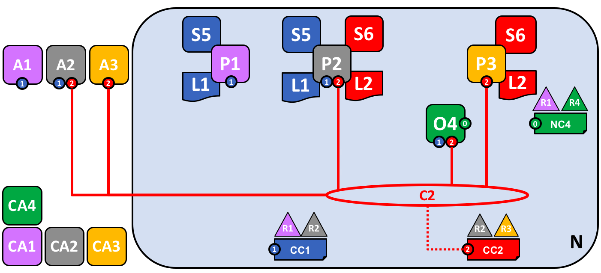
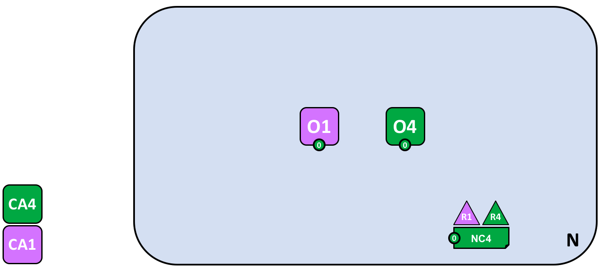

# Rede Blockchain

Este tópico descreverá, **em nível conceitual**, como a Hyperledger Fabric 
permite que as organizações colaborem na formação de redes blockchain. Se você é 
um arquiteto, administrador ou desenvolvedor, pode usar este tópico para obter 
um entendimento sólido dos principais componentes da estrutura e dos processos 
em uma rede de blockchain Hyperledger Fabric. Este tópico usará uma atividade
prática de exemplo, que apresenta todos os principais componentes em uma 
rede blockchain.

Depois de ler este tópico e entender o conceito de políticas, você terá um sólido 
entendimento das decisões que as organizações precisam tomar para estabelecer as
políticas que controlam uma rede implantada na Hyperledger Fabric. Você também 
entenderá como as organizações gerenciam a evolução da rede usando políticas 
declarativas -- um recurso importante da Hyperledger Fabric. Em poucas palavras,
você entenderá os principais componentes técnicos do Hyperledger Fabric e as 
decisões que as organizações precisam tomar sobre eles.

## O que é uma rede blockchain?

Uma rede blockchain é uma infraestrutura técnica que fornece serviços de 
livro-razão e contrato inteligente (chaincode) para os aplicativos. Inicialmente, 
os contratos inteligentes são usados para gerar transações que são 
subsequentemente distribuídas para todos os nós da rede onde são gravados de 
maneira imutável em sua cópia do livro-razão. Os usuários dos aplicativos podem
ser usuários finais ou administradores da rede blockchain.

Na maioria dos casos, várias [organizações](../glossary.html#organizacao) se 
reúnem como um [consórcio](../glossary.html#consorcio) para formar a rede e 
determinar suas permissões por meio de um conjunto de [políticas](../glossary.html#politica) 
que são acordadas pelo consórcio quando a rede é configurada. Além disso, as 
políticas de rede podem mudar com o tempo, dependendo do acordo das organizações 
no consórcio, como descobriremos quando discutirmos o conceito de *política de alteração*.

## Rede de exemplo

Antes de começarmos, vamos mostrar o que pretendemos fazer! Aqui está um diagrama 
representando o **estado final** da nossa rede de exemplo.

Não se preocupe, pois isso pode parecer complicado! À medida que discutimos este
tópico, construiremos a rede peça por peça, para que você veja como as 
organizações R1, R2, R3 e R4 contribuem com infraestrutura para ajudar a rede
a se formar. Essa infraestrutura implementa a rede blockchain e é governada por 
políticas acordadas pelas organizações que formam a rede -- por exemplo, quem 
pode adicionar novas organizações. Você descobrirá como os aplicativos consomem 
os serviços de livro-razão e contrato inteligente fornecidos pela rede blockchain.

 

*Quatro organizações, R1, R2, R3 e R4, decidiram em conjunto formalizar um 
contrato onde irão configurar e explorar uma rede Hyperledger Fabric. O R4 foi 
designado para ser o criador da rede -- ele tem a capacidade de configurar a 
versão inicial da rede. O R4 não tem intenção de realizar transações comerciais 
na rede. R1 e R2 precisam de uma comunicação privada dentro da rede geral, assim 
como R2 e R3. A organização R1 possui um aplicativo cliente que pode executar 
transações comerciais no canal C1. A organização R2 possui um aplicativo cliente 
que pode executar um trabalho semelhante nos canais C1 e C2. A organização R3 
tem um aplicativo cliente que pode fazer isso no canal C2. O nó P1 mantém 
uma cópia do livro-razão L1 associada a C1. O nó P2 mantém uma cópia do razão L1 
associada ao C1 e uma cópia do razão L2 associada ao C2. O nó P3 mantém uma 
cópia do razão L2 associada a C2. A rede é governada de acordo com as regras da
política especificada na configuração de rede NC4, a rede está sob o controle 
das organizações R1 e R4. O canal C1 é governado de acordo com as regras da 
política especificada na configuração de canal CC1; o canal está sob o controle
das organizações R1 e R2. O canal C2 é governado de acordo com as regras da 
política especificada na configuração do canal CC2; o canal está sob o controle 
das organizações R2 e R3. Há um serviço de ordem O4 que atua como um ponto de 
administração de rede para N e usa o canal do sistema. O serviço de ordem também 
suporta os canais de aplicativos C1 e C2, para fins de ordem de transações dos 
blocos para distribuição. Cada uma das quatro organizações possui uma Autoridade 
de Certificação preferida.*

## Criando uma Rede

Vamos começar do inicio, criando a base para a rede:

*A rede é formada quando um ordenador é iniciado. Em nossa rede de exemplo, N, o
serviço de ordens, é um único nó, O4, e é configurado de acordo com uma 
configuração de rede NC4, que concede direitos administrativos à organização R4. 
No nível da rede, a Autoridade de Certificação CA4 é usada para distribuir 
identidades aos administradores e nós de rede da organização R4.*

Podemos ver que a primeira coisa que define uma **rede, N,** é um 
**serviço de ordens, O4**. É útil pensar no serviço de ordens como o ponto 
inicial de administração da rede. Conforme combinado anteriormente, o O4 é 
inicialmente configurado e iniciado por um administrador na organização R4 e
hospedado no R4. A configuração NC4 contém as políticas que descrevem o conjunto
inicial de recursos administrativos para a rede. Inicialmente, isso é definido 
para conceder apenas direitos a R4 na rede. Isso vai mudar, como veremos mais 
adiante, mas por enquanto R4 é o único membro da rede.

### Autoridades de Certificação

Você também pode ver a autoridade de certificação CA4, usada para emitir 
certificados para administradores e para os nós da rede. O CA4 desempenha um 
papel fundamental em nossa rede porque distribui certificados X.509 que podem 
ser usados para identificar componentes como os pertencentes à organização R4. 
Os certificados emitidos pelas CAs também podem ser usados para assinar 
transações para indicar que uma organização endossa o resultado da transação 
-- uma condição prévia para que ela seja aceita no livro-razão. Vamos examinar 
esses dois aspectos de uma autoridade de certificação com mais detalhes.

Em primeiro lugar, diferentes componentes da rede blockchain usam certificados 
para se identificarem como pertencentes a uma organização específica. É por isso 
que geralmente há mais de uma CA suportando uma rede blockchain -- organizações 
diferentes costumam usar CAs diferentes. Nós vamos usar quatro CAs em nossa rede,
um para cada organização. De fato, as CAs são tão importantes que o Hyperledger 
Fabric fornece uma integrada (chamada *Fabric-CA*) para ajudá-lo a avançar, 
embora, na prática, as organizações escolham usar sua própria CA.

O mapeamento de certificados para organizações membros é realizado por meio de 
uma estrutura chamada [Serviço Provedor de Associação (MSP)](../glossary.html#servico-associacao). 
A configuração da rede NC4 usa um MSP nomeado para identificar as propriedades 
dos certificados dispensados pelo CA4 que associam os titulares de certificado à 
organização R4. O NC4 pode usar esse MSP nas suas políticas para conceder aos 
atores do R4 direitos específicos sobre os recursos de rede. Um exemplo dessa 
política é identificar os administradores no R4 que podem adicionar novas 
organizações membros à rede. Não mostramos MSPs nesses diagramas, pois eles 
gerariam confusão, mas são muito importantes.

Em segundo lugar, veremos mais adiante como os certificados emitidos pelas CAs 
estão no centro do processo de geração e validação da [transação](../glossary.html#transacao). 
Especificamente, os certificados X.509 são usados no aplicativo cliente 
[solicitador da transação](../glossary.html#proposta) e no contrato inteligente 
da [resposta de transação](../glossary.html#endosso) para assinar digitalmente 
[transações](../glossary.html#transacao). Posteriormente, os nós da rede que 
hospedam cópias do livro-razão verificam se as assinaturas da transação são 
válidas antes de aceitar as transações no livro-razão.

Vamos recapitular, a estrutura básica de nossa rede blockchain de exemplo. Há um
recurso, a rede N, acessada por um conjunto de usuários definidos por uma 
autoridade de certificação CA4, que possui um conjunto de direitos sobre os 
recursos na rede N, conforme descrito pelas políticas contidas em uma 
configuração de rede NC4. Tudo isso se torna real quando configuramos e iniciamos
o nó de serviço de ordens O4.

## Adicionando Administradores de Rede

O NC4 foi configurado inicialmente para permitir apenas aos usuários R4 direitos 
administrativos na rede. Nesta próxima fase, permitiremos que os usuários da 
organização R1 administrem a rede. Vamos ver como a rede evolui:

*A organização R4 atualiza a configuração da rede para tornar a organização R1 
um administrador. Após esse ponto, R1 e R4 têm direitos iguais sobre a 
configuração de rede.*

Vemos a adição de uma nova organização R1 como administrador -- R1 e R4 agora 
têm direitos iguais sobre a rede. Também podemos ver que a autoridade de 
certificação CA1 foi adicionada -- ela pode ser usada para identificar os usuários 
da organização R1. Após esse ponto, os usuários de R1 e R4 podem administrar a 
rede.

Embora o nó de ordens, O4, esteja sendo executado na infraestrutura do R4, o R1
possui direitos administrativos compartilhados, desde que possa obter acesso à 
rede. Isso significa que R1 ou R4 pode atualizar a configuração de rede NC4 para 
permitir à organização R2 um subconjunto de operações de rede. Dessa maneira, 
mesmo que o R4 esteja executando o serviço de ordens e o R1 possua direitos 
administrativos completos, o R2 possui direitos limitados para criar novos 
consórcios.

Na sua forma mais simples, o serviço de ordens é um único nó na rede, e é isso 
que você pode ver no exemplo. Os serviços de ordens geralmente são com vários 
nós e podem ser configurados para ter nós diferentes em diferentes organizações. 
Por exemplo, podemos executar o O4 no R4 e conectá-lo ao O2, um nó de ordem 
separado na organização R1. Dessa forma, teríamos uma estrutura de administração 
de vários sites e várias organizações.

Discutiremos o serviço de ordens um pouco [mais adiante neste tópico](#o-servico-de-ordem), 
mas, por enquanto, apenas pense no serviço de ordens como um ponto de 
administração que fornece acesso controlado à rede a diferentes organizações.

## Definindo um Consórcio

Embora a rede agora possa ser administrada por R1 e R4, muito pouco pode ser 
feito. A primeira coisa que precisamos fazer é definir um consórcio. Essa 
palavra significa literalmente "um grupo com um destino compartilhado", por isso 
é uma escolha apropriada para um conjunto de organizações em uma rede blockchain.

Vamos ver como um consórcio é definido:

*Um administrador de rede define um consórcio X1 que contém dois membros, as 
organizações R1 e R2. Essa definição de consórcio é armazenada na configuração 
de rede NC4 e será usada no próximo estágio de desenvolvimento da rede. CA1 e
CA2 são as respectivas autoridades de certificação dessas organizações.* 

Devido à maneira como o NC4 está configurado, apenas R1 ou R4 podem criar novos 
consórcios. Este diagrama mostra a adição de um novo consórcio, X1, que define 
R1 e R2 como suas organizações constituintes. Também podemos ver que o CA2 foi 
adicionado para identificar usuários do R2. Observe que um consórcio pode ter 
qualquer número de membros da organização -- acabamos de mostrar dois, pois é a
configuração mais simples.

Por que os consórcios são importantes? Podemos ver que um consórcio define o 
conjunto de organizações na rede que compartilham a necessidade de **transacionar** 
entre si -- nesse caso, R1 e R2. Realmente faz sentido agrupar organizações se 
elas têm um objetivo comum, e é exatamente isso que está acontecendo.

A rede, embora iniciada por uma única organização, agora é controlada por um 
conjunto maior de organizações. Poderíamos ter começado dessa maneira, com R1, 
R2 e R4 tendo controle compartilhado, mas essa estrutura facilita a compreensão.

Agora vamos usar o consórcio X1 para criar uma parte realmente importante de uma 
blockchain na Hyperledger Fabric -- **um canal**.

## Criando um Canal para um Consórcio

Então, vamos criar essa parte essencial da rede blockchain Fabric -- **um canal**. 
Um canal é o mecanismo de comunicação principal pelo qual os membros de um 
consórcio podem se comunicar. Pode haver vários canais em uma rede, mas, por 
enquanto, começaremos com um.

Vamos ver como o primeiro canal foi adicionado à rede:

*O canal C1 foi criado para R1 e R2 usando a definição de consórcio X1. O canal 
é governado por uma configuração de canal CC1, completamente separada da 
configuração de rede. CC1 é gerenciado por R1 e R2 que têm direitos iguais sobre 
C1. R4 não tem nenhum direito no CC1.*

O canal C1 fornece um mecanismo de comunicação privado para o consórcio X1. 
Podemos ver que o canal C1 foi conectado ao serviço de ordens O4, mas que nada 
mais está anexado a ele. No próximo estágio do desenvolvimento da rede, 
conectaremos componentes como aplicativos clientes e nós de mesmo nível. Mas, 
neste ponto, um canal representa o **potencial** para conectividade futura.

Embora o canal C1 faça parte da rede N, ele é bastante distinto dela. Observe 
também que as organizações R3 e R4 não estão neste canal -- é para processamento 
de transações entre R1 e R2. Na etapa anterior, vimos como o R4 poderia conceder
permissão ao R1 para criar novos consórcios. É útil mencionar que o R4 **também** 
permitiu ao R1 criar canais! Neste diagrama, poderia ter sido a organização R1 
ou R4 que criou um canal C1. Novamente, observe que um canal pode ter qualquer 
número de organizações conectadas a ele -- mostramos dois pois é a configuração 
mais simples.

Novamente, observe como o canal C1 possui uma configuração completamente separada, 
CC1, na configuração de rede NC4. O CC1 contém as políticas que governam os 
direitos que R1 e R2 têm sobre o canal C1 -- e, como vimos, R3 e R4 não têm 
permissões nesse canal. R3 e R4 podem interagir apenas com C1 se forem 
adicionados por R1 ou R2 à política apropriada na configuração de canal CC1. Um 
exemplo é definir quem pode adicionar uma nova organização ao canal. 
Especificamente, observe que R4 não pode se adicionar ao canal C1 -- deve e só 
pode ser autorizado por R1 ou R2.

Por que os canais são tão importantes? Os canais são úteis porque fornecem um 
mecanismo para comunicações e dados privados entre os membros de um consórcio. 
Os canais fornecem privacidade em relação a outros canais e da rede. A 
Hyperledger Fabric é poderosa nesse sentido, pois permite que as organizações 
compartilhem a infraestrutura e a mantenham privadas ao mesmo tempo. Não há 
contradição aqui -- diferentes consórcios na rede precisarão compartilhar 
informações e processos diferentes de maneira apropriada, e os canais fornecem 
um mecanismo eficiente para fazer isso. Os canais fornecem um compartilhamento 
eficiente da infraestrutura, mantendo a privacidade dos dados e das comunicações.

Também podemos ver que, uma vez que um canal foi criado, ele é, em um sentido 
muito real, "livre da rede". Somente as organizações especificadas explicitamente
em uma configuração de canal têm controle sobre ela, deste momento em diante para 
o futuro. Da mesma forma, quaisquer atualizações na configuração de rede NC4 a 
partir de agora não terão efeito direto na configuração de canal CC1, por 
exemplo, se a definição do consórcio X1 for alterada, ela não afetará os membros 
do canal C1. Os canais são, portanto, úteis porque permitem comunicações privadas
entre as organizações que constituem o canal. Além disso, os dados em um canal 
são completamente isolados do restante da rede, incluindo outros canais.

Além disso, há também um **canal de sistema** especial definido para uso pelo 
serviço de ordens. Ele se comporta exatamente da mesma maneira que um canal 
comum, às vezes chamado de **canais de aplicativos** por esse motivo. Normalmente, 
não precisamos nos preocupar com esse canal, mas discutiremos um pouco mais sobre 
isso [mais adiante neste tópico](#o-servico-de-ordem).

## Pares e Livros-Razão

Agora vamos começar a usar o canal para conectar a rede blockchain e os 
componentes organizacionais. No próximo estágio do desenvolvimento da rede, 
podemos ver que nossa rede N acaba de adquirir dois novos componentes, a saber, 
um nó do ponto P1 e uma instância de livro-razão, L1.

*Um nó P1 se juntou ao canal C1. P1 hospeda fisicamente uma cópia do livro-razão 
L1. P1 e O4 podem se comunicar usando o canal C1.*

Nós pares são os componentes de rede onde as cópias do livro-razão da blockchain 
estão hospedadas! Por fim, estamos começando a ver alguns componentes reconhecíveis
da blockchain! O objetivo de P1 na rede é puramente hospedar uma cópia do 
livro-razão L1 para que outros acessem. Podemos pensar em L1 como sendo 
**fisicamente hospedado** em P1, mas **logicamente hospedado** no canal C1. 
Veremos essa ideia mais claramente quando se adiciona mais pares ao canal.

Uma parte essencial da configuração do P1 é uma identidade X.509 emitida por CA1 
que associa P1 à organização R1. Uma vez iniciado o P1, ele pode **ingressar** 
no canal C1 usando o ordenador O4. Quando o O4 recebe essa solicitação de 
associação, ele usa a configuração de canal CC1 para determinar as permissões de
P1 nesse canal. Por exemplo, CC1 determina se P1 pode ler e/ou gravar informações
no livro-razão L1.

Observe como os pares são unidos aos canais pelas organizações que os possuem e,
embora tenhamos adicionado apenas um par, veremos como pode haver vários nós pares 
em vários canais da rede. Veremos os diferentes papéis que os eles podem assumir 
um pouco mais adiante.

## Aplicativos Clientes e código de Contrato Inteligente

Agora que o canal C1 possui um livro-razão, podemos começar a conectar aplicativos 
clientes para consumir alguns dos serviços fornecidos pelo cavalo de força do
livro-razão, o nó par!

Observe como a rede cresceu:

*Um contrato inteligente S5 foi instalado no P1. O aplicativo cliente A1 na 
organização R1 pode usar S5 para acessar o razão via nó P1 do mesmo nível. A1,
P1 e O4 estão todos unidos ao canal C1, ou seja, todos podem fazer uso dos 
recursos de comunicação fornecidos por esse canal.*

No próximo estágio de desenvolvimento da rede, podemos ver que o aplicativo 
cliente A1 pode usar o canal C1 para conectar-se a recursos de rede específicos 
-- nesse caso, A1 pode conectar-se ao nó de ponto P1 e ao nó de ordem O4. 
Novamente, veja como os canais são centrais para a comunicação entre os componentes
de rede e organização. Assim como pares e ordens, um aplicativo cliente terá uma 
identidade que o associa a uma organização. No nosso exemplo, o aplicativo cliente 
A1 está associado à organização R1, e, embora esteja fora da rede blockchain 
Fabric, está conectado a ela através do canal C1.

Agora pode parecer que A1 pode acessar o livro-razão L1 diretamente via P1, mas 
na verdade, todo o acesso é gerenciado através de um programa especial chamado 
contrato inteligente (chainconde), S5. Pense no S5 como definidor de todos os 
padrões de acesso comuns ao livro-razão; S5 fornece um conjunto bem definido de
maneiras pelas quais o livro-razão L1 pode ser consultado ou atualizado. Em suma, 
o aplicativo cliente A1 precisa passar pelo contrato inteligente S5 para acessar 
o livro-razão L1!

Contratos inteligentes podem ser criados por desenvolvedores de aplicativos de 
cada organização para implementar um processo de negócios compartilhado pelos
membros do consórcio. Contratos inteligentes são usados para ajudar a gerar 
transações que podem ser posteriormente distribuídas para todos os nós da rede. 
Discutiremos essa idéia um pouco mais tarde, será mais fácil entender quando a 
rede for maior. Por enquanto, o importante é entender que, para chegar a esse 
ponto, duas operações devem ter sido executadas no contrato inteligente; ele deve 
ter sido **instalado** nos nós pares e **definido** em um canal.

Os usuários da Hyperledger Fabric geralmente usam os termos **contrato inteligente** 
e **código de chamada** de forma intercambiável. Em geral, um contrato inteligente
define a **lógica da transação** que controla o ciclo de vida de um objeto de 
negócios contido no estado global. Em seguida, é empacotado em um chaincode que 
é implantado em uma rede blockchain. Pense nos contratos inteligentes como 
transações de controle, enquanto o chaincode governa como os contratos 
inteligentes são compactados para implantação.

### Instalando um Pacote Chaincode

Após o desenvolvimento de um contrato inteligente S5, um administrador da 
organização R1 deve criar um pacote de código de código e [instalar](../ glossary.html#install)
no nó par P1. Esta é uma operação direta. Uma vez concluído, P1 tem pleno 
conhecimento de S5. Especificamente, P1 pode ver a lógica de **implementação** de
S5 -- o código do programa que ele usa para acessar o razão L1. Comparamos isso 
com a **interface** de S5, que apenas descreve as entradas e saídas do S5, sem 
levar em consideração sua implementação.

Quando uma organização possui vários pares em um canal, pode escolher os pares nos
quais instala os contratos inteligentes, ele não precisa instalar um contrato 
inteligente em todos os pares.

### Definindo um chaincode

Embora um chaincode seja instalado nos nós pares de uma organização individual, 
ele é governado e operado no escopo do canal. Cada organização precisa aprovar as 
**definições do chaincode**, um conjunto de parâmetros que estabelecem como um o
código do chaincode será usado em um canal. A organização deve aprovar uma 
definição de chaincode para usar o contrato inteligente instalado para consultar
o livro-razão e endossar as transações. Em nosso exemplo, que possui apenas um 
único nó P1, um administrador da organização R1 deve aprovar uma definição de 
código de código para S5.

Um número suficiente de organizações precisa aprovar uma definição de chaincode 
(maioria, por padrão) antes que a definição do chaincode possa ser confirmada no
canal e usada para interagir com o livro-razão do canal. Como o canal possui 
apenas um membro, o administrador do R1 pode confirmar a definição do código do 
chaincode S5 no canal C1. Depois que a definição foi confirmada, o S5 agora pode 
ser [invocado](../glossary.html#invoke) pelo aplicativo cliente A1!

Observe que, embora todos os componentes no canal agora possam acessar o S5, eles
não podem ver a lógica do programa. Isso permanece privado para os nós que
o instalaram, no nosso exemplo, isso significa P1. Conceitualmente, isso 
significa que é a **interface** do contrato inteligente que é definido e aceito
em um canal, em contraste com a **implementação** do contrato inteligente 
instalado. Para reforçar essa ideia, a instalação de um contrato inteligente 
mostra como pensamos que ele é **fisicamente hospedado** em um nó, enquanto um
contrato inteligente que foi definido em um canal mostra como o consideramos 
**logicamente hospedado** no canal.

### Política de endosso

A informação mais importante fornecida na definição do chaincode é a 
[política de endosso](../glossary.html#politica-de-endosso). Ele descreve quais 
organizações devem aprovar transações antes de serem aceitas por outras 
organizações na sua cópia do livro-razão. Em nossa rede de amostra, as transações 
só podem ser aceitas no razão L1 se R1 ou R2 as endossarem.

O registro da definição do chaincode no canal, coloca a política de endosso no 
livro-razão do canal, permitindo que seja acessado por qualquer membro do canal. 
Você pode ler mais sobre políticas de endosso no [tópico do fluxo de transações](../txflow.html).

### Invocando um Contrato Inteligente

Depois que um contrato inteligente é instalado em um nó par e definido em um 
canal, ele pode ser [invocado](../glossary.html#Invocacao) por um aplicativo 
cliente. Os aplicativos clientes fazem isso enviando propostas de transação aos
nós das organizações especificadas na política de aprovação de contrato 
inteligente. A proposta de transação serve como entrada para o contrato 
inteligente, que a utiliza para gerar uma resposta de transação endossada, que é 
retornada pelo nó para o aplicativo cliente.

São essas respostas de transações que são empacotadas junto com a proposta de 
transação para formar uma transação totalmente endossada, que pode ser distribuída 
para toda a rede. Veremos isso com mais detalhes posteriormente. Por enquanto, 
basta entender como os aplicativos invocam contratos inteligentes para gerar 
transações endossadas.

Nesta fase do desenvolvimento da rede, podemos ver que a organização R1 está 
participando na rede por completo. Suas aplicações -- começando com A1 -- podem 
acessar o razão L1 por meio do contrato inteligente S5, para gerar transações que
serão endossadas por R1 e, portanto, aceitas no razão porque estão em conformidade
com a política de endosso.

## Rede concluída

Lembre-se de que nosso objetivo era criar um canal para o consórcio X1 
-- organizações R1 e R2. Nesta próxima fase do desenvolvimento da rede, a 
organização R2 adiciona sua infraestrutura à rede.

Vamos ver como a rede evoluiu:

*A rede cresceu através da adição de infraestrutura da organização R2. 
Especificamente, o R2 adicionou o nó par P2, que hospeda uma cópia do livro-razão L1 
e o chaincode S5. R2 aprova a mesma definição do chaincode que R1. P2 também se 
juntou ao canal C1, assim como o aplicativo A2. A2 e P2 são identificados usando 
certificados de CA2. Tudo isso significa que os aplicativos A1 e A2 podem chamar 
S5 em C1 usando o nó par P1 ou P2.*

Podemos ver que a organização R2 adicionou um nó par P2, no canal C1. P2 também 
hospeda uma cópia do livro-razão L1 e do contrato inteligente S5. Podemos ver que
o R2 também adicionou o aplicativo cliente A2, que pode se conectar à rede via o
canal C1. Para conseguir isso, um administrador na organização R2 criou o nó par
P2 e o associou ao canal C1, da mesma maneira que o administrador em R1. O 
administrador também precisa aprovar a mesma definição do chaincode que R1.

Criamos nossa primeira rede operacional! Nesta fase do desenvolvimento da rede, 
temos um canal no qual as organizações R1 e R2 podem realizar transações completas
entre si. Especificamente, isso significa que os aplicativos A1 e A2 podem gerar
transações usando o contrato inteligente S5 e o livro-razão L1 no canal C1.

### Gerando e aceitando Transações

Ao contrário dos nós pares, que sempre hospedam uma cópia do livro-razão, vemos 
que existem dois tipos diferentes de nós pares, aqueles que hospedam os contratos
inteligentes e aqueles que não. Em nossa rede, todos os pares hospedam uma cópia 
do contrato inteligente, mas em redes maiores, haverá muito mais nós que não 
hospedam uma cópia do contrato inteligente. Um par só pode **executar** um
contrato inteligente se estiver instalado nele, mas pode **saber** sobre a 
interface de um contrato inteligente ao estar conectado a um canal.

Você não deve pensar em nós pares que não possuem contratos inteligentes instalados 
como sendo de alguma forma inferiores. É mais o caso dos nós pares com contratos 
inteligentes terem um poder especial -- para ajudar a **gerar** transações. 
Observe que todos os nós pares podem **validar** e subsequentemente **aceitar** 
ou **rejeitar** transações em sua cópia do livro-razão L1. No entanto, apenas nós 
pares com um contrato inteligente instalado podem participar do processo de 
**aprovação** da transação, que é central para a geração de transações válidas.

Não precisamos nos preocupar com os detalhes exatos de como as transações são 
geradas, distribuídas e aceitas neste tópico -- é o suficiente entender que temos
uma rede blockchain em que as organizações R1 e R2 podem compartilhar informações
e processos como transações de captura-de-livro-razão. Aprenderemos muito mais 
sobre transações, livros-razão, contratos inteligentes em outros tópicos.

### Tipos de pares

No Hyperledger Fabric, como todos os pares são iguais, eles podem assumir várias 
funções, dependendo de como a rede está configurada. Agora temos entendimento 
suficiente de uma topologia de rede típica para descrever essas funções.

  * [*Pares de Confirmação*](../glossary.html#confirmar). Todo nó par em um canal 
    é um ponto de confirmação. Ele recebe blocos de transações geradas, que são 
    posteriormente validadas antes de serem confirmadas na cópia local do 
    livro-razão como uma operação de adição.

  * [*Pares de Endosso*](../glossary.html#endosso). Todo nó com um contrato 
    inteligente **pode** ser um nó endossante se tiver um contrato inteligente 
    instalado. No entanto, para realmente **ser** um par endossante, o contrato 
    inteligente no par deve ser usado por um aplicativo cliente para gerar uma 
    resposta de transação assinada digitalmente. O termo **endossando pares** é 
    uma referência explícita a esse fato.

    Uma política de endosso para um contrato inteligente identifica as organizações 
    cujo parceiro deve assinar digitalmente uma transação gerada antes que ela 
    possa ser aceita na cópia do livro-razão de um parceiro.

Esses são os dois principais tipos de pares, existem outras duas funções que um 
nó pode adotar:

  * [*Par Líder*](../glossary.html#par-lider). Quando uma organização possui 
    vários pares em um canal, é um nó líder que assume a responsabilidade de 
    distribuir transações do ordenador para os outros pares confirmadores da 
    organização. Um nó pode optar por participar da liderança de forma estática 
    ou dinâmica.

    Portanto, é útil pensar em dois conjuntos de pares da perspectiva da liderança 
    -- aqueles que têm seleção estática de líderes e aqueles com seleção dinâmica 
    de líderes. Para o conjunto estático, zero ou mais pares podem ser configurados
    como líderes. Para o conjunto dinâmico, um par será eleito líder pelo conjunto.
    Além disso, no conjunto dinâmico, se um colega líder falhar, os colegas 
    restantes reelegerão um líder.

    Isso significa que os pares de uma organização podem ter um ou mais líderes 
    conectados ao serviço de ordens. Isso pode ajudar a melhorar a resiliência e 
    a escalabilidade em grandes redes que processam grandes volumes de transações.

  * [*Nó Âncora*](../glossary.html#no-ancora). Se um ponto precisar se comunicar 
    com um ponto em outra organização, ele poderá usar um dos **nós âncora** 
    definidos na configuração do canal para essa organização. Uma organização 
    pode ter zero ou mais pares âncoras definidos para ela e um par âncora pode 
    ajudar com muitos cenários diferentes de comunicação entre organizações. 

Observe que um par pode ser um par de confirmação, par de endosso, um par líder 
e um par âncora ao mesmo tempo! Somente o ponto de ancoragem é opcional -- para 
todos os fins práticos, sempre haverá um líder e pelo menos um endossante e pelo 
menos um confirmador.

### Adicionando organizações e pares ao canal

Quando R2 ingressa no canal, a organização deve instalar o contrato inteligente 
S5 em seu nó par, P2. Isso é óbvio -- se os aplicativos A1 ou A2 desejam usar 
S5 no nó par P2 para gerar transações, ele deve estar presente primeiro. 
Instalação é o mecanismo pelo qual isso acontece. Nesse ponto, o nó P2 possui 
uma cópia física do contrato inteligente e do livro-razão, como P1 e ele pode 
gerar e aceitar transações em sua cópia do livro-razão L1.

O R2 deve aprovar a mesma definição de chaincode aprovada pelo R1 para usar o 
contrato inteligente S5. Como a definição de chaincode já foi confirmada no 
canal pela organização R1, o R2 pode usá-lo assim que a organização aprovar a 
definição do chaincode e instalar o pacote. A transação de confirmação precisa 
acontecer apenas uma vez. Uma nova organização pode usar o chaincode assim que 
aprovar os parâmetros do código acordado por outros membros do canal. Como a 
aprovação de um chaincode ocorre no nível da organização, o R2 pode aprovar a 
definição de código de código uma vez e unir vários pares ao canal com o 
chaincode instalado. No entanto, se o R2 quisesse alterar a definição do código, 
R1 e R2 precisariam aprovar uma nova definição para sua organização e, em 
seguida, uma das organizações precisaria confirmar a definição no canal.

Em nossa rede, podemos ver que o canal C1 conecta dois aplicativos clientes, 
dois nós pares e um serviço de ordens. Como existe apenas um canal, existe 
apenas um registro **lógico** com o qual esses componentes interagem. Os nós 
pares P1 e P2 têm cópias idênticas do livro-razão L1. As cópias do contrato 
inteligente S5 geralmente serão implementadas de forma idêntica usando a mesma 
linguagem de programação, caso não sejam, devem ser semanticamente equivalentes.

Podemos ver que a adição cuidadosa de pares à rede pode ajudar a aumentar o 
rendimento, a estabilidade e a resiliência. Por exemplo, mais pares em uma rede 
permitirão que mais aplicativos se conectem a ela, e vários pares em uma 
organização fornecerão resiliência extra no caso de interrupções planejadas ou 
não planejadas.

Tudo isso significa que é possível configurar topologias sofisticadas que 
suportam uma variedade de objetivos operacionais -- não há limite teórico para 
o tamanho da rede. Além disso, o mecanismo técnico pelo qual os pares das  
organizações se descobrem e se comunicam com eficiência -- o 
[protocolo gossip](../gossip.html#gossip-protocol) -- acomodará um grande 
número de nós pares nessa topologias.

O uso cuidadoso das políticas de rede e canal permite que até redes grandes 
sejam bem governadas. As organizações são livres para adicionar nós pares à rede,
desde que estejam em conformidade com as políticas acordadas pela rede. As 
políticas de rede e canal criam o equilíbrio entre autonomia e controle, que 
caracteriza uma rede descentralizada.

## Simplificando o vocabulário visual

Agora, vamos simplificar o vocabulário visual usado para representar nossa rede
blockchain de exemplo. À medida que o tamanho da rede aumenta, as linhas
inicialmente usadas para nos ajudar a entender os canais se tornarão complicadas.
Imagine o quão complicado seria o nosso diagrama se adicionássemos ao par outro 
aplicativo, ou cliente, ou outro canal?

É isso que vamos fazer em um minuto. Antes de fazer, vamos simplificar o 
vocabulário visual. Aqui está uma representação simplificada da rede que 
desenvolvemos até agora:

*O diagrama mostra os fatos relacionados ao canal C1 na rede N da seguinte 
maneira: Os aplicativos clientes A1 e A2 podem usar o canal C1 para comunicação
com os pares P1 e P2 e o ordem O4. Os nós de pares P1 e P2 podem usar os 
serviços de comunicação do canal C1. O serviço de ordens O4 pode fazer uso dos 
serviços de comunicação do canal C1. A configuração do canal CC1 se aplica ao 
canal C1.*

Observe que o diagrama da rede foi simplificado substituindo as linhas de canal
por pontos de conexão, mostrados como círculos azuis que incluem o número do 
canal. Nenhuma informação foi perdida. Essa representação é mais escalável porque
elimina linhas de cruzamento. Isso nos permite representar mais claramente redes
maiores. Conseguimos essa simplificação focando nos pontos de conexão entre 
componentes e um canal, e não no próprio canal.

## Adicionando outra definição de consórcio

Nesta próxima fase do desenvolvimento da rede, apresentamos a organização R3. 
Vamos dar às organizações R2 e R3 um canal de aplicativo separado, que permite 
que elas realizem transações entre si. Esse canal de aplicativo será 
completamente separado do definido anteriormente, para que as transações R2 e R3 
possam ser mantidas privadas entre eles.

Vamos voltar ao nível da rede e definir um novo consórcio, X2, para R2 e R3:

*Um administrador de rede da organização R1 ou R4 adicionou uma nova definição 
de consórcio, X2, que inclui as organizações R2 e R3. Isso será usado para 
definir um novo canal para o X2.*

Observe que a rede agora tem dois consórcios definidos: X1 para organizações R1 
e R2 e X2 para organizações R2 e R3. O Consortium X2 foi introduzido para poder 
criar um novo canal para R2 e R3.

Um novo canal só pode ser criado pelas organizações especificamente identificadas 
na política de configuração de rede, NC4, como possuindo os direitos apropriados 
para fazê-lo, ou seja, R1 ou R4. Este é um exemplo de política que separa as 
organizações que podem gerenciar recursos no nível da rede e aquelas que podem 
gerenciar recursos no nível do canal. Ver essas políticas em ação nos ajuda a 
entender por que a Hyperledger Fabric possui uma sofisticada estrutura em 
camadas de políticas.

Na prática, a definição de consórcio X2 foi adicionada à configuração de rede 
NC4. Discutimos a mecânica exata dessa operação em outras partes da documentação.

## Adicionando um novo canal

Agora vamos usar essa nova definição de consórcio, X2, para criar um novo canal, 
C2. Para ajudar a reforçar sua compreensão da notação de canal mais simples, 
usamos os dois estilos visuais -- o canal C1 é representado com pontos finais 
circulares azuis, enquanto o canal C2 é representado com linhas de conexão vermelhas:

*Um novo canal C2 foi criado para R2 e R3 usando a definição de consórcio X2. O
canal possui uma configuração de canal CC2, completamente separada da 
configuração de rede NC4 e a configuração de canal CC1. O canal C2 é gerenciado 
por R2 e R3 que têm direitos iguais sobre C2, conforme definido por uma política 
no CC2. R1 e R4 não têm direitos definidos no CC2.*

O canal C2 fornece um mecanismo de comunicação privado para o consórcio X2. Mais 
uma vez, observe como as organizações unidas em um consórcio são as que formam 
os canais. A configuração do canal CC2 agora contém as políticas que governam os
recursos do canal, atribuindo direitos de gerenciamento às organizações R2 e R3 
pelo canal C2. É gerenciado exclusivamente por R2 e R3, R1 e R4 não têm poder no 
canal C2. Por exemplo, a configuração do canal CC2 pode ser atualizada 
posteriormente para adicionar organizações para apoiar o crescimento da rede,
mas isso só pode ser feito pelo R2 ou pelo R3.

Observe como as configurações de canal CC1 e CC2 permanecem completamente 
separadas uma da outra e completamente separadas da configuração de rede, NC4. 
Mais uma vez, estamos vendo a natureza descentralizada de uma rede Hyperledger 
Fabric, depois que o canal C2 é criado, ele é gerenciado pelas organizações R2 e 
R3 independentemente de outros elementos da rede. As políticas de canal sempre 
permanecem separadas umas das outras e só podem ser alteradas pelas organizações 
autorizadas a fazê-lo no canal.

À medida que a rede e os canais evoluem, o mesmo ocorre com as configurações de 
rede e canal. Há um processo pelo qual isso é realizado de maneira controlada -- 
envolvendo transações de configuração que capturam a alteração nessas 
configurações. Toda mudança de configuração resulta em uma nova transação no 
bloco de configuração sendo gerada, e [logo mais nesse tópico](#o-servico-de-ordem) 
veremos como esses blocos são validados e aceitos para criar configurações
atualizadas de rede e canal, respectivamente.

### Configurações de rede e canal

Em toda a nossa rede de exemplo, vemos a importância das configurações de rede e
canal. Essas configurações são importantes porque encapsulam as **políticas** 
acordadas pelos membros da rede, que fornecem uma referência compartilhada para 
controlar o acesso aos recursos da rede. As configurações de rede e canal também 
contêm **fatos** sobre a composição da rede e do canal, como o nome dos consórcios 
e suas organizações.

Por exemplo, quando a rede é formada pela primeira vez usando o nó de serviço de
ordem O4, seu comportamento é governado pela configuração de rede NC4. A 
configuração inicial do NC4 contém apenas políticas que permitem à organização 
R4 gerenciar recursos de rede. O NC4 é atualizado posteriormente para permitir 
também que o R1 gerencie os recursos da rede. Depois que essa alteração é feita, 
qualquer administrador da organização R1 ou R4 que se conecta ao O4 terá direitos
de gerenciamento de rede, pois é isso que a política na configuração de rede NC4
permite. Internamente, cada nó no serviço de ordens registra cada canal na 
configuração de rede, para que haja um registro de cada canal criado, no nível 
da rede.

Isso significa que, embora o pedido do nó de ordem O4 seja o ator que criou os 
consórcios X1 e X2 e os canais C1 e C2, a **inteligência** da rede está contida 
na configuração de rede NC4 que O4 está obedecendo. Desde que o O4 se comporte 
como um bom ator e implemente corretamente as políticas definidas no NC4 sempre 
que estiver lidando com recursos de rede, nossa rede se comportará como todas as
organizações concordaram. De muitas maneiras, o NC4 pode ser considerado mais 
importante que o O4 porque, em última análise, controla o acesso à rede.

Os mesmos princípios se aplicam às configurações de canal em relação aos pares.
Em nossa rede, P1 e P2 são igualmente bons atores. Quando os nós de pares P1 e 
P2 estão interagindo com os aplicativos clientes A1 ou A2, cada um deles usa as 
políticas definidas na configuração de canal CC1 para controlar o acesso aos 
recursos do canal C1.

Por exemplo, se A1 quiser acessar o chaincode do contrato inteligente S5 nos nós 
pares P1 ou P2, cada nó usará sua cópia do CC1 para determinar as operações que 
A1 pode executar. Por exemplo, A1 pode ter permissão para ler ou gravar dados do
livro-razão L1 de acordo com as políticas definidas em CC1. Veremos mais adiante 
o mesmo padrão para os atores no canal e sua configuração de canal CC2. Novamente, 
podemos ver que, embora os pares e aplicativos sejam atores críticos na rede, 
seu comportamento em um canal é ditado mais pela política de configuração do 
canal do que por qualquer outro fator.

Por fim, é útil entender como as configurações de rede e canal são fisicamente 
realizadas. Podemos ver que as configurações de rede e canal são logicamente 
singulares -- há uma para a rede e uma para cada canal. Isso é importante, todo 
componente que acessa a rede ou o canal deve ter um entendimento compartilhado 
das permissões concedidas as diferentes organizações.

Embora exista logicamente uma única configuração, ela é replicada e mantida 
consistente por todos os nós que formam a rede ou canal. Por exemplo, em nossa 
rede os nós pares P1 e P2 têm uma cópia da configuração do canal CC1 e, quando a
rede estiver totalmente concluída, os nós pares P2 e P3 terão uma cópia da 
configuração do canal CC2. Da mesma forma, o nó de serviço de ordem O4 possui 
uma cópia da configuração de rede, mas em uma [configuração de vários nós](#o-servico-de-ordem), 
cada nó de serviço de ordem terá sua própria cópia da configuração de rede.

As configurações de rede e canal são mantidas consistentes usando a mesma 
tecnologia blockchain usada para transações do usuário -- mas para transações de 
**configuração**. Para alterar uma configuração de rede ou canal, um administrador 
deve enviar uma transação de configuração para alterar a configuração de rede ou 
canal. Ele deve ser assinado pelas organizações identificadas na política 
apropriada como responsáveis ​​pela alteração da configuração. Essa política é 
chamada de **mod_policy** e [discutiremos mais tarde](#mudanca-de-politica).

De fato, os nós do serviço de ordens operam um mini-blockchain, conectado via 
**canal do sistema** que mencionamos anteriormente. Usando o canal do sistema, 
os nós do serviço de ordens distribuem as transações de configuração de rede. 
Essas transações são usadas para manter cooperativamente uma cópia consistente 
da configuração de rede em cada nó do serviço de ordens. De maneira semelhante, 
os nós pares nível em um **canal de aplicativo** podem distribuir transações de 
configuração de canal. Da mesma forma, essas transações são usadas para manter 
uma cópia consistente da configuração do canal em cada nó do mesmo nível.

Esse equilíbrio entre objetos logicamente singulares, por serem fisicamente 
distribuídos, é um padrão comum no Hyperledger Fabric. Objetos como configurações
de rede, logicamente únicos, acabam sendo replicados fisicamente entre um 
conjunto de nós de serviços de ordens, por exemplo. Também o vemos com 
configurações de canais, livros-razão e, até certo ponto, contratos inteligentes
que são instalados em vários locais, mas cujas interfaces existem logicamente no 
nível do canal. É um padrão que você vê repetidas vezes no Hyperledger Fabric e
permite que o Hyperledger Fabric seja descentralizado e, ao mesmo tempo, 
gerenciável.

## Adicionando outro nó par

Agora que a organização R3 pode participar totalmente do canal C2, vamos 
adicionar seus componentes de infraestrutura ao canal. Ao invés de fazer isso um
componente por vez, adicionaremos um nó par, sua cópia local de um livro-razão, 
um contrato inteligente e um aplicativo cliente de uma só vez!

Vamos ver a rede com os componentes da organização R3 adicionados:

*O diagrama mostra os fatos relacionados aos canais C1 e C2 na rede N da seguinte
maneira: Os aplicativos clientes A1 e A2 podem usar o canal C1 para comunicação 
com os pares P1 e P2 e solicitar o serviço O4; os aplicativos clientes A3 podem 
usar o canal C2 para comunicação com o ponto P3 e o serviço de ordens O4. O 
serviço de ordens O4 pode fazer uso dos serviços de comunicação dos canais C1 e 
C2. A configuração do canal CC1 se aplica ao canal C1, CC2 se aplica ao canal C2.*

Antes de tudo, observe que, como o nó P3 está conectado ao canal C2, ele possui 
um livro-razão **diferente** -- L2 -- para os nós pares usando o canal C1. O razão 
L2 é efetivamente definido no canal C2. O livro-razão L1 é completamente separado,
está no escopo do canal C1. Isso faz sentido -- o objetivo do canal C2 é fornecer 
comunicações privadas entre os membros do consórcio X2, e o livro-razão L2 é o 
armazenamento privado para suas transações.

De maneira semelhante, o contrato inteligente S6, instalado no nó par P3 e
definido no canal C2, é usado para fornecer acesso controlado ao livro-razão L2. 
O aplicativo A3 agora pode usar o canal C2 para chamar os serviços fornecidos 
pelo contrato inteligente S6 para gerar transações que podem ser aceitas em 
todas as cópias do livro-razão L2 na rede.

Neste momento, temos uma única rede que possui dois canais completamente separados 
definidos dentro dela. Esses canais fornecem recursos gerenciados de forma 
independente para as organizações negociarem entre si. Novamente, isso é 
descentralização no trabalho, nós temos um equilíbrio entre controle e autonomia. 
Isso é alcançado por meio de políticas aplicadas a canais controlados e afetando 
diferentes organizações.

## Juntando um par a vários canais

Nesta fase final do desenvolvimento da rede, vamos voltar nosso foco para a 
organização R2. Podemos explorar o fato de o R2 ser um membro dos consórcios X1
e X2 juntando-o a vários canais:

*O diagrama mostra os fatos relacionados aos canais C1 e C2 na rede N da seguinte 
maneira: Os aplicativos clientes A1 podem usar o canal C1 para comunicação com os
pares P1 e P2 e solicitar o serviço O4; o aplicativo cliente A2 pode usar o canal
C1 para comunicação com os pares P1 e P2 e o canal C2 para comunicação com os 
pares P2 e P3 e solicitar o serviço O4; o aplicativo cliente A3 pode usar o canal
C2 para comunicação com os pares P3 e P2 e solicitar o serviço O4. O serviço de 
ordens O4 pode fazer uso dos serviços de comunicação dos canais C1 e C2. A 
configuração do canal CC1 se aplica ao canal C1, CC2 se aplica ao canal C2.*

Podemos ver que o R2 é uma organização especial na rede, porque é a única 
organização que é membro de dois canais de aplicativos! É capaz de negociar com 
a organização R1 no canal C1, enquanto, ao mesmo tempo, também pode negociar com 
a organização R3 em um canal diferente, C2.

Observe como o nó P2 possui o contrato inteligente S5 instalado para o canal C1 
e o contrato inteligente S6 instalado para o canal C2. O nó P2 é um membro de 
ambos os canais ao mesmo tempo, por meio de contratos inteligentes diferentes 
para diferentes livros-razão.

Este é um conceito muito poderoso -- os canais fornecem um mecanismo para a 
separação de organizações e um mecanismo para colaboração entre organizações. 
Enquanto isso, essa infraestrutura é fornecida e compartilhada entre um conjunto 
de organizações independentes.

Também é importante observar que o comportamento do nó P2 é controlado de maneira
muito diferente, dependendo do canal no qual ele está transacionando. 
Especificamente, as políticas contidas na configuração de canal CC1 ditam as 
operações disponíveis para P2 quando transacionando no canal C1, enquanto 
as políticas na configuração de canal CC2 controlam o comportamento de P2 no 
canal C2.

Novamente, isso é desejável -- R2 e R1 concordaram com as regras do canal C1, 
enquanto R2 e R3 concordaram com as regras do canal C2. Essas regras foram 
capturadas nas respectivas políticas de canal -- elas podem e devem ser usadas
por todos os componentes de um canal para impor o comportamento correto, 
conforme acordado.

Da mesma forma, podemos ver que o aplicativo cliente A2 agora pode fazer 
transações nos canais C1 e C2. Da mesma forma, ele também será regido pelas 
políticas nas configurações de canal apropriadas. Como um aparte, observe que o 
aplicativo cliente A2 e o nó P2 estão usando um vocabulário visual misto -- 
linhas e conexões. Você pode ver que eles são equivalentes, eles são sinônimos visuais.

### O serviço de ordem

O leitor atento pode perceber que o nó do serviço de ordens parece ser um 
componente centralizado, foi usado para criar a rede inicialmente e se conecta a 
todos os canais da rede. Embora tenhamos adicionado R1 e R4 à política de 
configuração de rede NC4 que controla o ordenador, o nó estava sendo executado 
na infraestrutura do R4. Em um mundo de descentralização, isso parece errado!

Não se preocupe! Nosso exemplo de rede mostrou a configuração mais simples do 
serviço de ordens para ajudá-lo a entender a ideia de um ponto de administração
de rede. De fato, o serviço de ordens também pode ser completamente descentralizado! 
Mencionamos anteriormente que um serviço de ordens pode ser composto por muitos 
nós pertencentes a diferentes organizações, então vamos ver como isso seria feito 
em nossa rede de exemplo.

Vamos dar uma olhada em uma configuração de nós de serviços de ordens mais realista:

*Um serviço de ordem de múltiplas organizações. O serviço de ordens compreende 
os nós de serviço O1 e O4. O1 é fornecido pela organização R1 e o nó O4 é 
fornecido pela organização R4. A configuração de rede NC4 define permissões de 
recursos de rede para os atores de ambas as organizações R1 e R4.*

Podemos ver que esse serviço de ordens é totalmente descentralizado -- é executado 
na organização R1 e na organização R4. A política de configuração de rede, NC4, 
permite direitos iguais R1 e R4 sobre os recursos da rede. Aplicativos cliente e 
nós de mesmo nível das organizações R1 e R4 podem gerenciar recursos de rede 
conectando-se ao nó O1 ou O4, porque ambos os nós se comportam da mesma maneira, 
conforme definido pelas políticas na configuração de rede C4. Na prática, os 
atores de uma organização específica **tendem** a usar a infraestrutura fornecida 
por sua organização de origem, mas esse nem sempre é o caso.

### Distribuição de transação descentralizada

Além de ser o ponto de gerenciamento da rede, o serviço de ordens também oferece
outro recurso importante -- é o ponto de distribuição das transações. O serviço 
de ordens é o componente que reúne transações endossadas de aplicativos e as 
ordena em blocos de transações, que são subsequentemente distribuídos para todos
os nós do canal. Em cada um desses nós confirmados, as transações são registradas, 
válidas ou inválidas, e sua cópia local do livro-razão é atualizada adequadamente.

Observe como o nó de serviço de ordens O4 desempenha uma função muito diferente 
para o canal C1 do que para a rede N. Ao atuar no nível do canal, a função de O4 
é coletar transações e distribuir blocos dentro do canal C1. Isso é feito de 
acordo com as políticas definidas na configuração de canal CC1. Por outro lado, 
ao atuar no nível da rede, a função da O4 é fornecer um ponto de gerenciamento 
para os recursos da rede, de acordo com as políticas definidas na configuração de
rede NC4. Observe novamente como essas funções são definidas por políticas 
diferentes nas configurações de canal e rede, respectivamente. Isso deve reforçar
a importância da configuração de política declarativa da Hyperledger Fabric. As 
políticas definem e são usadas para controlar os comportamentos acordados por 
cada membro de um consórcio.

Podemos ver que o serviço de ordens, como os outros componentes da Hyperledger 
Fabric, é um componente totalmente descentralizado. Seja atuando como um ponto 
de gerenciamento de rede ou como um distribuidor de blocos em um canal, seus nós 
podem ser distribuídos conforme necessário pelas várias organizações em uma rede.

### Mudança de política

Ao longo de nossa exploração da rede de exemplo, vimos a importância das 
políticas para controlar o comportamento dos atores no sistema. Discutimos apenas
algumas das políticas disponíveis, mas há muitas que podem ser definidas
declarativamente para controlar todos os aspectos do comportamento. Essas 
políticas individuais são discutidas em outras partes da documentação.

Mais importante ainda, o Hyperledger Fabric fornece uma política exclusivamente 
poderosa que permite que os administradores de rede e canal gerenciem a própria 
alteração de política! A filosofia subjacente é que a mudança de política é uma
constante, se ela ocorre dentro ou entre organizações ou se é imposta por 
reguladores externos. Por exemplo, novas organizações podem ingressar em um canal
ou organizações existentes e podem ter suas permissões aumentadas ou diminuídas. 
Vamos investigar um pouco mais como a política de mudança é implementada no 
Hyperledger Fabric.

O ponto principal do entendimento é que a mudança de política é gerenciada por 
uma política dentro da própria política. A **política de modificação**, ou 
**mod_policy**, é uma política de primeira classe em uma configuração de rede ou 
canal que gerencia alterações. Vamos dar dois breves exemplos de como **já** 
usamos o mod_policy para gerenciar alterações em nossa rede!

O primeiro exemplo foi quando a rede foi configurada inicialmente. No momento, 
apenas a organização R4 tinha permissão para gerenciar a rede. Na prática, isso 
foi conseguido tornando R4 a única organização definida na configuração de rede 
NC4 com permissões para recursos de rede. Além disso, o mod_policy para NC4 
mencionou apenas a organização R4 -- somente R4 foi autorizado a alterar essa
configuração.

Em seguida, desenvolvemos a rede N para também permitir que a organização R1 
administre. O R4 fez isso adicionando R1 às políticas para criação de canal e 
criação de consórcio. Devido a essa alteração, R1 conseguiu definir os consórcios
X1 e X2 e criar os canais C1 e C2. R1 tinha direitos administrativos iguais sobre 
as políticas de canal e consórcio na configuração de rede.

R4, no entanto, poderia conceder ainda mais poder sobre a configuração de rede 
ao R1! O R4 poderia adicionar R1 ao mod_policy, para que o R1 também pudesse 
gerenciar a alteração da política de rede.

Este segundo poder é muito mais poderoso que o primeiro, porque o R1 agora possui 
**controle total** sobre a configuração de rede NC4! Isso significa que o R1 pode,
em princípio, remover os direitos de gerenciamento do R4 da rede. Na prática, o 
R4 configuraria o mod_policy de forma que o R4 também precisasse aprovar a 
alteração ou que todas as organizações no mod_policy precisassem aprová-la. Há 
muita flexibilidade para tornar o mod_policy tão sofisticado quanto necessário 
para suportar qualquer processo de mudança necessário.

Esse é o mod_policy no trabalho -- permitiu a evolução graciosa de uma 
configuração básica para uma sofisticada. O tempo todo isso ocorreu com o acordo 
de toda organização envolvida. O mod_policy se comporta como todas as outras 
políticas dentro de uma configuração de rede ou canal, define um conjunto de 
organizações que têm permissão para alterar o próprio mod_policy.

Nós apenas arranhamos a superfície do poder das políticas e do mod_policy em 
particular nesta subseção. Isso é discutido muito mais detalhadamente no tópico 
da política, mas por enquanto vamos voltar à nossa rede concluída!

## Rede totalmente formada

Vamos recapitular a aparência da nossa rede usando um vocabulário visual 
consistente. Reorganizamos um pouco usando nossa sintaxe visual mais compacta, 
pois ela acomoda melhor topologias maiores:

*Neste diagrama, vemos que a rede blockchain da Fabric consiste em dois canais 
de aplicativos e um canal de pedidos. As organizações R1 e R4 são responsáveis 
pelo canal de pedidos, R1 e R2 são responsáveis pelo canal de aplicativos azul, 
enquanto R2 e R3 são responsáveis pelo canal de aplicativos vermelho. Os 
aplicativos clientes A1 são um elemento da organização R1 e CA1 é sua autoridade
de certificação. Observe que o ponto P2 da organização R2 pode usar os recursos 
de comunicação do canal de aplicativo azul e vermelho. Cada canal de aplicativo 
possui sua própria configuração de canal, neste caso, CC1 e CC2. A configuração 
do canal do sistema faz parte da configuração de rede, NC4.*

Estamos no final de nossa jornada conceitual para construir uma rede blockchain
Hyperledger Fabric de exemplo. Criamos uma rede de quatro organizações com dois 
canais e três nós pares, com dois contratos inteligentes e um serviço de ordens. 
É suportado por quatro autoridades de certificação. Ele fornece serviços de 
contrato inteligente e de livro-razão para três aplicativos clientes, que podem 
interagir com ele pelos dois canais. Reserve um momento para examinar os detalhes 
da rede no diagrama e sinta-se à vontade para ler novamente o tópico para reforçar
seu conhecimento ou vá para um tópico mais detalhado.

### Resumo dos componentes de rede

Aqui está um rápido resumo dos componentes de rede que discutimos:

* [Livro-Razão](../glossary.html#livro-razao). Um por canal. Composto pelo
  [Blockchain](../glossary.html#bloco) e pelo
  [Estado Global](../glossary.html#estado-global)
* [Contrato Inteligente](../glossary.html#contrato-inteligente) (ou chaincode)
* [Nós Pares](../glossary.html#par)
* [Serviço de Ordens](../glossary.html#servico-de-ordem)
* [Canal](../glossary.html#canal)
* [Autoridade de Certificação](../glossary.html#fabric-ca)

## Resumo da rede

Neste tópico, vimos como diferentes organizações compartilham sua infraestrutura 
para fornecer uma rede blockchain integrada Hyperledger Fabric. Vimos como a 
infraestrutura coletiva pode ser organizada em canais que fornecem mecanismos de
comunicação privados gerenciados de forma independente. Vimos os atores como, 
aplicativos clientes, administradores, pares e ordens são identificados como de
diferentes organizações pelo uso de certificados de suas respectivas autoridades 
de certificação. E, por sua vez, vimos a importância da política para definir as
permissões acordadas que esses atores organizacionais têm sobre os recursos de 
rede e canal.
