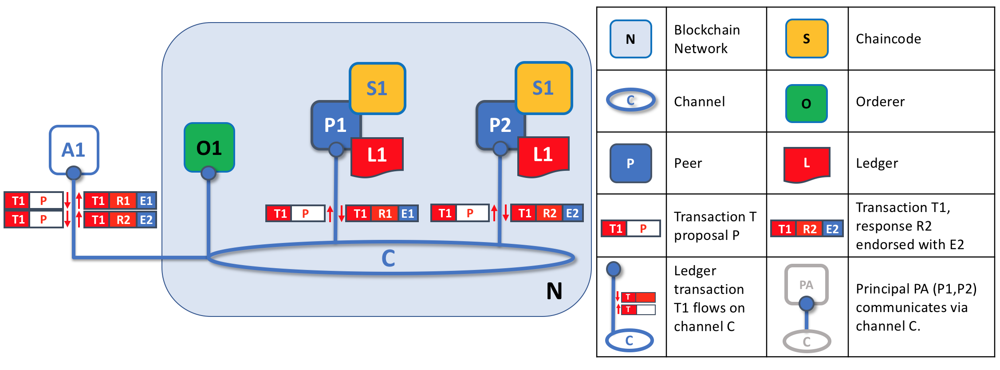

# Pares

Uma rede blockchain é composta principalmente por um conjunto de *nós de pares* (ou, simplesmente, *pares*). Os pares são um elemento 
fundamental da rede porque hospedam os livros-razão e o contratos inteligentes. Lembre-se de que um libro-razão registra de forma imutável 
todas as transações geradas por contratos inteligentes (que na Hyperledger Fabric estão chamados de *chaincode*, mais sobre isso a frente). 
Contratos inteligentes e livros-razaõ são usados para encapsular os processos *compartilhados* e as informações *compartilhadas* em uma 
rede, respectivamente. Esses aspectos de um par os tornam um bom ponto de partida para entender uma rede Fabric.

Outros elementos da rede blockchain são obviamente importantes: livros-razão e contratos inteligentes, ordens, políticas, canais, 
aplicativos, organizações, identidades e associação, você pode ler mais sobre eles em suas próprias seções. Esta seção se concentra nos 
pares e no relacionamento deles com os outros elementos em uma rede Fabric.

*Uma rede blockchain é composta por nós pares, cada um dos quais pode conter cópias de livros-razão e cópias de contratos inteligentes. 
Neste exemplo, a rede N consiste em pares P1, P2 e P3, cada um dos quais mantém sua própria instância do livro-razão distribuída L1. P1, P2 
e P3 usam o mesmo chaincode, S1, para acessar sua cópia desse livro-razão distribuído*.

Os pares podem ser criados, iniciados, parados, reconfigurados e até excluídos. Eles expõem um conjunto de APIs que permitem que 
administradores e aplicativos interajam com os serviços que eles fornecem. Aprenderemos mais sobre esses serviços nesta seção.

### Uma palavra sobre terminologia

A Fabric implementa **contratos inteligentes** com um conceito de tecnologia que chama **chaincode** --- simplesmente um trecho de código 
que acessa o livro-razão, escrito em uma das linguagens de programação suportadas. Neste tópico, geralmente usaremos o termo **chaincode**, 
mas fique à vontade para lê-lo como **contrato inteligente** se você estiver mais acostumado a esse termo. É a mesma coisa! Se você quiser 
saber mais sobre chaincode e contratos inteligentes, consulte nossa 
[documentação sobre contratos inteligentes e chaincode](../smartcontract/smartcontract.html).

## Livros-Razão e Chaincode

Vejamos um par com mais detalhes. Podemos ver que é o ponto que hospeda o livro-razão e o chaincode. Mais precisamente, o par realmente 
hospeda *instâncias* do livro-razão e *instâncias* do chaincode. Observe que isso fornece uma redundância deliberada em uma rede Fabric 
--- evita pontos únicos de falha. Aprenderemos mais sobre a natureza distribuída e descentralizada de uma rede blockchain posteriormente 
nesta seção.

*Um par hospeda instâncias do livro-razão e instâncias de chaincode. Neste exemplo, P1 hospeda uma instância do livro-razão L1 e uma 
instância do chaincode S1. Pode haver muitos livros-razão e chaincodes hospedados em um par individual.*

Como um par é um *host* para livros-razão e chaincodes, aplicativos e administradores devem interagir com um par se quiserem acessar esses 
recursos. É por isso que os pares são considerados os blocos de construção mais fundamentais de uma rede Fabric. Quando um par é criado pela 
primeira vez, ele não possui livros-razão nem chaincodes. Veremos mais adiante como os livros-razão são criados e como os chaincodes são 
instalados nos pares.

### Múltiplos livros-razão

Um par é capaz de hospedar mais de um livro-razão, o que é útil porque permite um design de sistema flexível. A configuração mais simples é 
um par gerenciar um único livro-razão, mas é absolutamente apropriado que ele hospede dois ou mais livros quando necessário.

*Um par que hospeda vários livros-razão. Os pares hospedam um ou mais livros-razão, e cada livro-razão tem zero ou mais chaincodes que se 
aplicam a eles. Neste exemplo, podemos ver que o par P1 hospeda os livros-razão L1 e L2. O razão L1 é acessado usando o chaincode S1. O 
razão L2, por outro lado, pode ser acessado usando os chaincode S1 e S2.*

Embora seja perfeitamente possível que um par hospede uma instância do livro-razão sem hospedar nenhum chaincode que acesse esse 
livro-razão, é raro que os pares sejam configurados dessa maneira. A grande maioria dos pares terá pelo menos um chaincode instalado, que 
pode consultar ou atualizar as instâncias do próprio livro-razão. Vale mencionar de passagem que, independentemente de os usuários terem 
instalado ou não um chaincode para uso em aplicativos externos, os pares também têm **chaincodes especiais** sempre presentes. Estes não são 
discutidos em detalhes neste tópico.

### Múltiplos Chaincodes

Não há um relacionamento fixo entre o número de livros-razão que um par possui e o número de chaincodes que podem acessar esse livro. Um par 
pode ter muitos chaincodes e muitos livros-razão à sua disposição.

*Um exemplo de um par que hospeda vários chaincodes. Cada livro-razão pode ter muitos chaincodes de acesso que o acessam. Neste exemplo, 
podemos ver que o par P1 hospeda os livros-razão L1 e L2, onde L1 é acessado pelos chaincode S1 e S2 e L2 é acessado por S1 e S3. Podemos 
ver que S1 pode acessar L1 e L2.*

Veremos um pouco mais adiante por que o conceito de **canais** na Fabric é importante ao hospedar vários livros-razão ou vários chaincodes 
em um par.

## Aplicativos e Pares

Agora vamos mostrar como os aplicativos interagem com os pares para acessar o livro-razão. As interações de consulta no livro-razão envolvem 
um simples diálogo de três etapas entre um aplicativo e um par, as interações de atualização do livro-razão são um pouco mais exigentes e
demandas duas etapas extras. Simplificamos um pouco essas etapas para ajudá-lo a começar com a Fabric, mas não se preocupe --- o mais 
importante é entender a diferença nas interações entre pares de aplicativos para consulta do livro-razão em comparação com modelos de 
transação de atualização de livro-razão.

Os aplicativos sempre se conectam com os pares quando precisam acessar os livros-razão e chaincodes. O Fabric Software Development Kit (SDK) 
facilita isso para os programadores --- suas APIs permitem que os aplicativos se conectem aos pares, invoquem chaincodes para gerar 
transações, enviar transações à rede solicitada, validadar e confirmadar no livro-razão distribuído e receber eventos quando esse processo 
estiver concluído.

Por meio de uma conexão com o par, os aplicativos podem executar chaincodes para consultar ou atualizar um livro-razão. O resultado de uma 
transação de consulta do livro-razão é retornado imediatamente, enquanto as atualizações do razão envolvem uma interação mais complexa entre 
aplicativos, pares e ordens. Vamos investigar isso com mais detalhes.

*Os pares, em conjunto com os ordenadores, garantem que o livro-razão seja mantido atualizado em todos os pares. Neste exemplo, o aplicativo 
A se conecta a P1 e chama o chaincode S1 para consultar ou atualizar o livro-razão L1. P1 chama S1 para gerar uma resposta da 
proposta que contém um resultado da proposta de consulta ou uma atualização do livro-razão. O aplicativo A recebe a resposta da proposta e, 
para consultas, o processo está concluído. Para atualizações, A cria uma transação com todas as respostas, que são enviadas à O1 para 
ordenar. O1 coleta transações da rede em blocos e as distribui a todos os pares, incluindo P1. P1 valida a transação antes de confirmar com 
L1. Depois que L1 é atualizado, P1 gera um evento, recebido por A, para indicar a conclusão.*

Um par pode retornar os resultados de uma consulta para um aplicativo imediatamente, pois todas as informações necessárias para satisfazer a 
consulta estão na cópia local do livro-razão do par. Os pares nunca consultam outros para responder a uma consulta de um aplicativo. Os 
aplicativos podem, no entanto, conectar-se a um ou mais pares para emitir uma consulta, por exemplo, para corroborar um resultado entre 
vários pares ou recuperar um resultado mais atualizado de outro par, se houver suspeita de que as informações possam estar desatualizadas. 
No diagrama, você pode ver que a consulta do livro-razão é um processo simples de três etapas.

Uma transação de atualização inicia da mesma maneira que uma transação de consulta, mas possui duas etapas extras. Embora os aplicativos de 
atualização do livro-razão também se conectem aos pares para chamar um chaincode, diferente dos aplicativos de consulta do livro-razão, um 
par individual não pode executar uma atualização do livro-razão no momento, porque outros pares devem primeiro concordar com a alteração 
--- em um processo chamado **consenso**. Portanto, os pares retornam ao aplicativo uma **proposta** de atualização --- que esse parceiro 
aplicaria, mediante acordo prévio de outros pares. A primeira etapa extra --- etapa quatro --- exige que os aplicativos enviem um conjunto 
apropriado de atualizações propostas correspondentes para toda a rede de pares como uma transação para compromisso com seus respectivos 
livros-razão. Isso é alcançado pelo aplicativo usando um **ordenador** para empacotar transações em blocos e distribuí-las para toda a rede 
de pares, onde elas podem ser verificadas antes de serem aplicadas à cópia local do livro-razão de cada par. Como todo esse processamento de 
pedidos leva algum tempo para ser concluído (segundos), o aplicativo é notificado de forma assíncrona, conforme mostrado na etapa cinco.

Posteriormente nesta seção, você aprenderá mais sobre a natureza detalhada desse processo de ordens --- e para uma visão realmente detalhada 
desse processo, consulte o tópico [Fluxo de transações](../txflow.html).

## Pares e Canais

Embora esta seção seja sobre pares e não canais, vale a pena dedicar um pouco de tempo para entender como os pares interagem entre si e com 
aplicativos via *canais* --- um mecanismo pelo qual um conjunto de componentes dentro de uma rede blockchain pode se comunicar e 
transacionar *de forma privada*.

Esses componentes geralmente são nós de pares, nós de ordens e aplicativos, e ao ingressar em um canal, eles concordam em colaborar para 
compartilhar e gerenciar coletivamente cópias idênticas do razão associado a esse canal. Conceitualmente, você pode pensar em canais como 
sendo semelhantes a grupos de amigos (embora os membros de um canal certamente não precisem ser amigos!). Uma pessoa pode ter vários grupos 
de amigos, com cada grupo tendo atividades que realiza juntos. Esses grupos podem ser totalmente separados (um grupo de amigos de trabalho 
em comparação com um grupo de amigos de hobby) ou pode haver algum cruzamento entre eles. No entanto, cada grupo é sua própria entidade, com 
suas próprias "regras".

Os canais permitem que um conjunto específico de pares e aplicativos se comuniquem entre si em uma rede blockchain. Neste exemplo, o 
aplicativo A pode se comunicar diretamente com os pares P1 e P2 usando o canal C. Você pode pensar no canal como um caminho para a 
comunicação entre aplicativos e pares específicos. (Para simplificar, as ordens não são mostradas neste diagrama, mas devem estar presentes 
em uma rede que funcione.)*

Vemos que os canais não existem da mesma maneira que os pares --- é mais apropriado pensar em um canal como uma estrutura lógica formada por 
uma coleção de pares físicos. *É vital entender esse ponto --- os pares fornecem o ponto de controle para acesso e gerenciamento de canais*.

## Pares e organizações

Agora que você conhece os pares e o relacionamento deles com os livros-razão, chaincodes e canais, poderá ver como várias organizações se 
reúnem para formar uma rede blockchain.

As redes Blockchain são administradas por um conjunto de organizações, e não por uma única organização. Os pares são fundamentais para a 
construção desse tipo de rede distribuída, porque pertencem a --- e são os pontos de conexão da rede para --- essas organizações.

*Pares em uma rede blockchain com várias organizações. A rede blockchain é construída a partir de pares pertencentes e suportados por 
diferentes organizações. Neste exemplo, vemos quatro organizações contribuindo com oito pares para formar uma rede. O canal C conecta cinco 
desses pares na rede N --- P1, P3, P5, P7 e P8. Os outros pares pertencentes a essas organizações não ingressaram neste canal, mas 
geralmente estão associados a pelo menos um outro canal. Os aplicativos que foram desenvolvidos por uma organização específica se conectam 
aos pares de sua própria organização e aos de diferentes organizações. Novamente, por simplicidade, o nó do ordenador não é mostrado neste 
diagrama.

É realmente importante que você possa ver o que está acontecendo na formação de uma rede blockchain. *A rede é formada e gerenciada pelas 
várias organizações que contribuem com recursos*. Pares são os recursos que estamos discutindo neste tópico, mas os recursos que uma 
organização fornece são mais do que apenas pares. Há um princípio em ação aqui --- a rede literalmente não existe sem as organizações 
contribuírem com seus recursos individuais para uma rede coletiva. Além disso, a rede cresce e diminui com os recursos fornecidos por essas 
organizações colaboradoras.

Você pode ver que (além do serviço de ordens) não existem recursos centralizados --- no [exemplo acima](#Peer8), a rede **N** não existiria 
se as organizações não contribuíssem com seus pares. Isso reflete o fato de que a rede não existe em nenhum sentido significativo, a menos e 
até que as organizações contribuam com os recursos que a formam. Além disso, a rede não depende de nenhuma organização individual 
--- continuará a existir enquanto uma organização permanecer, independentemente de outras organizações que possam ir e vir. Este é o cerne 
do que significa descentralizar uma rede.

Aplicativos em diferentes organizações, como no [exemplo acima](#Peer8), podem ou não ser os mesmos. Isso porque depende inteiramente de uma 
organização a maneira como seus aplicativos processam as cópias de seus pares do livro-razão. Isso significa que a lógica do aplicativo e da 
apresentação pode variar de organização para organização, mesmo que seus respectivos pares hospedem exatamente os mesmos dados no 
livro-razão.

Os aplicativos se conectam aos pares em sua organização ou de outra organização, dependendo da natureza da interação com o livro-razão 
necessária. Para interações entre consulta e livro-razão, os aplicativos geralmente se conectam aos pares da própria organização. Para 
interações de atualizaão do livro-razão, veremos mais adiante por que os aplicativos precisam se conectar aos pares que representam *todas* 
as organizações necessárias para endossar a atualizar o livro-razão.

## Pares e Identidade

Agora que você viu como pares de diferentes organizações se reúnem para formar uma rede blockchain, vale a pena gastar algum tempo para 
entender como os pares são atribuídos às organizações por seus administradores.

Os pares têm uma identidade atribuída a eles por meio de um certificado digital de uma autoridade de certificação específica. Você pode ler
muito mais sobre como os certificados digitais X.509 funcionam em outras partes deste guia, mas, por enquanto, pense em um certificado 
digital como um cartão de identificação que fornece muitas informações verificáveis sobre um par. *Todos os pares na rede recebem um 
certificado digital de um administrador da organização proprietária*.

*Quando um par se conecta a um canal, seu certificado digital identifica sua organização proprietária por meio de um MSP do canal. Neste 
exemplo, P1 e P2 têm identidades emitidas por CA1. O canal C determina, a partir de uma política em sua configuração de canal, que as 
identidades do CA1 devem ser associadas ao Org1 usando o ORG1.MSP. Da mesma forma, P3 e P4 são identificados pelo ORG2.MSP como parte da 
Org2.*

Sempre que um par se conecta usando um canal a uma rede blockchain, *uma política na configuração do canal usa a identidade do par para 
determinar seus direitos.* O mapeamento da identidade para a organização é fornecido por um componente chamado *Membership Service Provider* 
(MSP) --- determina como um par é atribuído a uma função específica em uma organização específica e, consequentemente, obtém acesso adequado 
aos recursos da blockchain. Além disso, um par pode pertencer apenas a uma única organização e, portanto, está associado a um único MSP. 
Aprenderemos mais sobre controle de acesso por pares posteriormente nesta seção, e há uma seção inteira sobre MSPs e políticas de controle
de acesso em outras partes deste guia. Mas, por enquanto, pense em um MSP como fornecendo ligação entre uma identidade individual e uma 
função organizacional específica em uma rede blockchain.

Uma pequena digressão, pares e *tudo o que interage com uma rede blockchain adquirem sua identidade organizacional a partir de seu 
certificado digital e de um MSP*. Pares, aplicativos, usuários finais, administradores e ordens devem ter uma identidade e um MSP associado 
se quiserem interagir com uma rede blockchain. *Damos um nome a todas as entidades que interagem com uma rede blockchain usando uma 
identidade --- um `principal`*. Você pode aprender muito mais sobre `principals` e organizações em outras partes deste guia, mas por 
enquanto, você sabe mais que o suficiente para continuar entendendo de pares!

Por fim, observe que não é realmente importante onde o par está fisicamente localizado --- ele pode residir na nuvem ou em um data center 
pertencente a uma das organizações ou em uma máquina local --- é o certificado digital associado que o identifica como pertencente a uma 
organização específica. No nosso exemplo acima, o P3 pode estar hospedado no data center da Org1, mas desde que o certificado digital 
associado a ele seja emitido pelo CA2, ele pertence ao Org2.

## Pares e Ordenadores

Vimos que os pares formam a base de uma rede blockchain, hospedando livros-razão e contratos inteligentes que podem ser consultados e 
atualizados pelos aplicativos conectados aos pares. No entanto, o mecanismo pelo qual os aplicativos e os pares interagem entre si para 
garantir que o registro de todos os pares seja mantido consistente é mediado por nós especiais chamados *ordenadores*, e é para esses nós 
que agora voltamos nossa atenção.

Uma transação de atualização é bem diferente de uma transação de consulta porque um único par não pode, por si só, atualizar o livro-razão 
--- a atualização requer o consentimento de outros pares na rede. Um par exige que outros na rede aprovem uma atualização do livro-razão 
antes de poder ser aplicada ao livro-razão local de um par. Esse processo é chamado de *consenso*, que leva muito mais tempo para ser 
concluído do que uma simples consulta. Porém, quando todos os pares necessários para aprovar a transação o fizerem e a transação for 
confirmada no livro-razão, os pares notificarão seus aplicativos conectados que o razão foi atualizado. Você verá muito mais detalhes sobre 
como pares e ordenadores gerenciam o processo de consenso nesta seção.

Especificamente, os aplicativos que desejam atualizar o livro-razão estão envolvidos em um processo trifásico, o que garante que todos os 
pares de uma rede blockchain mantenham seus registros consistentes entre si.

* Na primeira fase, os aplicativos trabalham com um subconjunto de *pares endossantes*, cada um dos quais fornece um endosso da proposta de
  atualização do livro-razão pelo aplicativo, mas não aplica a atualização proposta à sua cópia do livro-razão.
* Na segunda fase, esses endossos separados são coletados como transações e empacotados em blocos.
* Na terceira e última fase, esses blocos são distribuídos de volta para todos os pares, e cada transação é validada antes de serem 
  registradas na cópia do livro-razão desse par.

Como você verá, os nós de ordens são centrais nesse processo, portanto, vamos investigar um pouco mais detalhadamente como aplicativos e 
pares usam as ordens para gerar atualizações do livro-razão que podem ser aplicadas de maneira consistente a um livro-razão replicado e 
distribuído.

### Fase 1: proposta

A fase 1 do fluxo de trabalho da transação envolve uma interação entre um aplicativo e um conjunto de pares --- não envolve ordenadores. 
A fase 1 refere-se apenas a um aplicativo que solicita que pares de diferentes organizações concordem com o resultado proposto pela chamada 
do chaincode.

Para iniciar a fase 1, os aplicativos geram uma proposta de transação que eles enviam para cada um dos conjuntos de pares necessários para 
aprovação. Cada um desses *pares endossante * executa independentemente um chaincode usando a proposta de transação para gerar uma resposta 
da proposta de transação. Ele não aplica essa atualização ao livro-razão, simplesmente a assina e a devolve ao aplicativo. Depois que o 
aplicativo recebe um número suficiente de respostas da proposta assinadas, a primeira fase do fluxo da transação é concluída. Vamos examinar 
esta fase um pouco mais detalhadamente.

*As propostas de transação são executadas independentemente pelos pares que retornam as respostas endossadas à proposta. Neste exemplo, o 
aplicativo A1 gera a proposta P da transação T1, que é enviada ao par P1 e ao par P2 no canal C. P1 executa S1 usando a proposta P de 
transação T1, gerando a resposta R1 da transação T1 que endossa com E1. Independentemente, P2 executa S1 usando a proposta P de transação T1 
gerando a resposta R2 da transação T1, que endossa com E2. O aplicativo A1 recebe duas respostas endossadas para a transação T1, ou seja, E1
e E2.*

Inicialmente, um conjunto de pares é escolhido pelo aplicativo para gerar o conjunto de atualizações propostas do livro-razão. Quais pares 
são escolhidos pelo aplicativo? Bem, isso depende da *política de endosso* (definida para um chaincode), que define o conjunto de 
organizações que precisam endossar uma mudança do livro-razão proposta antes que ela possa ser aceita pela rede. Isso é literalmente o que 
significa obter consenso --- toda organização que importa deve ter endossado a mudança proposta do livro-razão *antes* de ser aceita no 
razão de qualquer par.

Um par endossa uma resposta da proposta adicionando sua assinatura digital e assinando todo conteúdo usando sua chave privada. Esse 
endosso pode ser usado posteriormente para provar que os pares dessa organização geraram uma resposta específica. Em nosso exemplo, se P1 é 
de propriedade dq Org1, o endosso E1 corresponderá a uma prova digital de que "A resposta R1 da transação T1 no livro-razão L1 foi fornecida 
pelo P1 da Org1".

A fase 1 termina quando o aplicativo recebe respostas assinadas da proposta de pares suficientes. Observamos que diferentes pares podem 
retornar respostas de transação diferentes e, portanto, inconsistentes para o aplicativo *para a mesma proposta de transação*. Pode ser que 
o resultado tenha sido gerado em momentos diferentes, em diferentes pares, com livros-razão em diferentes estados, nesse caso, um aplicativo 
pode simplesmente solicitar uma resposta da proposta mais atualizada. É pouco provável que ocorra, mas muito sério se ocorrer, os resultados 
podem ser diferentes porque o chaincode é *não determinístico*. O não determinismo é o inimigo dos chaincodes e livros-razão e, se ocorrer, 
indica um problema sério com a transação proposta, pois resultados inconsistentes não podem, obviamente, ser aplicados aos livros-razão. Um 
par individual não pode saber que o resultado de sua transação é não determinístico --- as respostas da transação devem ser reunidas para 
comparação antes que o não-determinismo possa ser detectado. (Estritamente falando, mesmo isso não basta, mas adiamos essa discussão para a 
seção de transações, na qual o não-determinismo é discutido em detalhes.)

No final da fase 1, o aplicativo é livre para descartar respostas inconsistentes da transação, se desejar, encerrando efetivamente o fluxo 
de trabalho da transação com antecedência. Veremos mais adiante que, se um aplicativo tentar usar um conjunto inconsistente de respostas de 
transação para atualizar o livro-razão, ele será rejeitado.

### Fase 2: encomendar e empacotar transações em blocos

A segunda fase do fluxo de trabalho da transação é a fase de empacotamento. O ordenador é essencial para esse processo --- ele recebe 
transações contendo respostas da proposta de transação endossadas de muitos aplicativos e ordena as transações em blocos. Para obter mais 
detalhes sobre a fase de ordens e empacotamento, consulte nossas 
[informações conceituais sobre a fase de ordens](../orderer/ordering_service.html#phase-two-ordering-and-packaging-transactions-into-blocks).

### Fase 3: validação e confirmação

No final da fase 2, vemos que as ordens são responsáveis pelos processos simples, mas vitais, de coletar atualizações das propostas de 
transações, ordená-las e empacotá-las em blocos, prontas para distribuição aos pares.

A fase final do fluxo de trabalho da transação envolve a distribuição e a validação subsequente dos blocos do ordenador pelos pares, onde 
eles podem ser confirmados no livro-razão. Especificamente, em cada par, todas as transações em um bloco são validadas para garantir que 
tenham sido consistentemente endossadas por todas as organizações relevantes antes de serem confirmadas no livro-razão. As transações com 
falha são retidas para auditoria, mas não são confirmadas no razão.

*A segunda função de um nó do ordenador é distribuir blocos aos pares. Neste exemplo, o ordenador O1 distribui o bloco B2 nos pares P1 e P2. 
O par P1 processa o bloco B2, resultando em um novo bloco sendo adicionado ao razão L1 em ​​P1. Paralelamente, o par P2 de mesmo nível 
processa o bloco B2, resultando em um novo bloco sendo adicionado ao razão L1 em ​​P2. Depois que esse processo é concluído, o razão L1 foi 
consistentemente atualizado nos pares P1 e P2, e cada um pode informar aos aplicativos conectados que a transação foi processada.*

A fase 3 começa com o ordenador distribuindo blocos a todos os pares conectados a ele. Os pares são conectados aos ordenadores nos canais, 
de modo que, quando um novo bloco for gerado, todos os pares conectados ao ordenador receberão uma cópia do novo bloco. Cada par processará 
esse bloco de forma independente, mas exatamente da mesma maneira que qualquer outro par no canal. Dessa forma, veremos que o razão pode ser 
mantido consistente. Também vale a pena notar que nem todos os pares precisam estar conectados a um ordenador --- os pares podem cascatear
blocos com outros usando o protocolo **gosip**, que também pode processá-los independentemente. Mas vamos deixar essa discussão para outra 
hora!

Após o recebimento de um bloco, um par processará cada transação na sequência em que aparece no bloco. Para cada transação, cada par 
verificará se a transação foi endossada pelas organizações requeridas, de acordo com a *política de endosso* do chaincode que gerou a 
transação. Por exemplo, algumas transações podem precisar ser aprovadas apenas por uma única organização, enquanto outras podem exigir 
várias recomendações antes de serem consideradas válidas. Esse processo de validação verifica se todas as organizações relevantes geraram o
mesmo resultado. Observe também que essa validação é diferente da verificação de endosso na fase 1, onde é o aplicativo que recebe a 
resposta de endosso dos pares e toma a decisão de enviar as transações da proposta. Caso o aplicativo viole a política de endosso enviando 
transações incorretas, o par ainda poderá rejeitar a transação no processo de validação da fase 3.

Se uma transação foi endossada corretamente, o par tentará aplicá-la ao livro-razão. Para fazer isso, um par deve executar uma verificação 
de consistência do razão para verificar se o estado atual do razão é compatível com o estado do razão quando a atualização proposta foi 
gerada. Isso nem sempre é possível, mesmo quando a transação foi totalmente endossada. Por exemplo, outra transação pode ter atualizado o 
mesmo ativo no razão, de forma que a atualização da transação não seja mais válida e, portanto, não possa mais ser aplicada. Dessa maneira, 
o razão é mantido consistente em cada ponto no canal, porque todos seguem as mesmas regras para validação.

Depois que um ponto validar com êxito cada transação individual, ele atualizará o livro-razão. As transações com falha não são aplicadas ao 
razão, mas são retidas para fins de auditoria, assim como as transações bem-sucedidas. Isso significa que os blocos dos pares são quase 
exatamente iguais aos blocos recebidos do ordenador, exceto por um indicador válido ou inválido em cada transação no bloco.

Também observamos que a fase 3 não requer a execução de chaincodes --- isso é feito apenas durante a fase 1, e isso é importante. Isso 
significa que os chaincodes apenas precisam estar disponíveis nos nós de endosso, em vez de em toda a rede blockchain. Isso geralmente é 
útil, pois mantém a lógica do chaincode confidencial para as organizações endossadas. Isso contrasta com a saída dos chaincodes (as 
respostas da proposta de transação) que são compartilhados com todos os pares no canal, independentemente de terem ou não endossado a 
transação. Essa especialização de pares de endosso ​​foi projetada para ajudar a escalabilidade e confidencialidade.

Finalmente, toda vez que um bloco é confirmado no livro-razão de um par, esse par gera um *evento* apropriado. *Eventos de bloco* incluem 
todo o conteúdo do bloco, enquanto *eventos de transação de bloco* incluem apenas informações resumidas, como, se cada transação no bloco foi 
validada ou invalidada. Os eventos de execução que o *chaincode*  produziu também podem ser publicados neste momento. Os aplicativos podem 
se registrar para receber esses tipos de eventos, para que possam ser notificados quando ocorrerem. Essas notificações concluem a terceira e 
última fase do fluxo de trabalho da transação.

Em resumo, a fase 3 vê os blocos que são gerados pelo ordenador aplicados de forma consistente ao livro-razão. A ordem estrita de transações 
em blocos permite que cada par valide que as atualizações de transações são aplicadas de forma consistente na rede blockchain.

### Ordens e Consenso

Todo o processo do fluxo de trabalho da transação é chamado de "consenso", porque todos os pares chegam a um acordo sobre a ordem e o 
conteúdo das transações, em um processo mediado pelos ordenadores. O consenso é um processo de várias etapas e os aplicativos são 
notificados apenas das atualizações do razão quando o processo estiver concluído --- o que pode acontecer em momentos ligeiramente 
diferentes em diferentes pares.

Discutiremos os ordens com muito mais detalhes em um tópico futuro sobre ordenadores, mas, por enquanto, pense nos ordenadores como nós que 
coletam e distribuem as atualizações do livro-razão proposto nos aplicativos para validação e inclusão no livro-razão dos pares.

É isso aí! Agora concluímos nosso tour sobre pares e outros componentes com os quais eles se relacionam na Fabric. Vimos que os pares são, 
sob muitos aspectos, o elemento mais fundamental --- eles formam a rede, hospedam o chaincode e o livro-razão, lidam com propostas e 
respostas de transações e mantêm o registro atualizado, aplicando consistentemente atualizações de transações a ele .

<!--- Licensed under Creative Commons Attribution 4.0 International License
https://creativecommons.org/licenses/by/4.0/) -->
