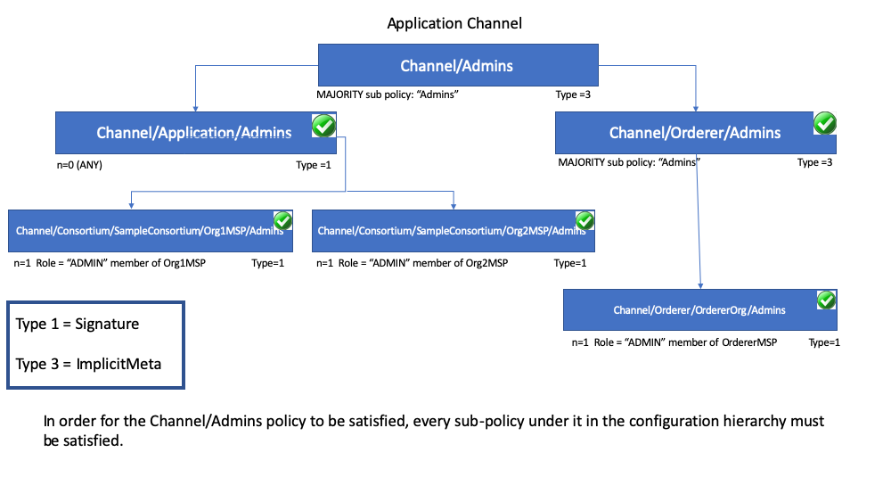

# Políticas

**Audiência**: Arquitetos, desenvolvedores de aplicativos e contratos inteligentes,
administradores

Neste tópico, abordaremos:

* [O que é uma política](#o-que-e-uma-politica)
* [Por que são necessárias políticas](#por-que-sao-necessarias-politicas)
* [Como as políticas são implementadas na Fabric](#como-as-politicas-sao-implementadas-na-fabric)
* [Os domínios da política da Fabric](#os-dominios-da-politica-da-fabric)
* [Como você escreve uma política na Fabric](#como-voce-escreve-uma-politica-na-fabric)
* [Ciclo de vida do chaincode na Fabric](#ciclo-de-vida-do-chaincode-na-fabric)
* [Substituindo definições de política](#substituindo-definicoes-de-politica)

## O que é uma política

No nível mais básico, uma política é um conjunto de regras que definem a estrutura de como as decisões são tomadas e resultados específicos 
são alcançados. Para esse fim, as políticas normalmente descrevem um **quem** e um **o que**, como o acesso ou direitos que um indivíduo tem 
sobre um **ativo**. Podemos ver que as políticas são usadas ao longo de nossas vidas diárias para proteger bens de valor para nós, como 
aluguel de carros, saúde, nossas casas e muito mais.

Por exemplo, uma política de seguro define as condições, termos, limites e vencimento sob os quais um pagamento de seguro será feito. A 
política é acordada entre o tomador e a seguradora e define os direitos e responsabilidades de cada parte.

Enquanto uma política de seguro é implementada para o gerenciamento de riscos, no Hyperledger Fabric, as políticas são o mecanismo para o 
gerenciamento da infraestrutura. As políticas da Fabric representam como os membros chegam a um acordo sobre aceitar ou rejeitar alterações 
na rede, em um canal ou em um contrato inteligente. As políticas são acordadas pelos membros do consórcio quando uma rede é configurada 
originalmente, mas também podem ser modificadas à medida que a rede evolui. Por exemplo, eles descrevem os critérios para adicionar ou 
remover membros de um canal, alteram a forma como os blocos são formados ou especificam o número de organizações necessárias para endossar 
um contrato inteligente. Todas essas ações são descritas por uma política que define quem pode executar a ação. Simplificando, tudo o que 
você deseja fazer em uma rede Fabric é controlado por uma política.

## Por que são necessárias políticas

As políticas são uma das coisas que tornam o Hyperledger Fabric diferente de outras blockchains como Ethereum ou Bitcoin. Nesses sistemas, 
as transações podem ser geradas e validadas por qualquer nó da rede. As políticas que governam a rede são fixadas a qualquer momento e só 
podem ser alteradas usando o mesmo processo que governa o código. Como o Fabric é uma blockchain permissionada cujos usuários são 
reconhecidos pela infraestrutura subjacente, esses usuários têm a capacidade de decidir sobre o controle da rede antes do lançamento e 
alterar o controle de uma rede em execução.

As políticas permitem que os membros decidam quais organizações podem acessar ou atualizar uma rede Fabric e fornece o mecanismo para 
aplicar essas decisões. As políticas contêm as listas de organizações que têm acesso a um determinado recurso, como um chaincode de sistema 
ou usuário. Eles também especificam quantas organizações precisam concordar com uma proposta para atualizar um recurso, como um canal ou 
contratos inteligentes. Uma vez escritas, as políticas avaliam a coleta de assinaturas anexadas às transações e propostas, e validam se as 
assinaturas cumprem a governança acordada pela rede.

## Como as políticas são implementadas na Fabric

As políticas são implementadas em diferentes níveis de uma rede Fabric. Cada domínio de política governa diferentes aspectos de como uma 
rede opera.

 *Uma representação visual da hierarquia de políticas do Fabric.*

### Configuração do canal do sistema

Toda rede começa com um ordenador no **canal do sistema** . Deve haver exatamente um canal do sistema de ordens para um serviço de ordens e 
é o primeiro canal a ser criado. O canal do sistema também contém as organizações que são membros do serviço de ordens (organizações de 
ordens) e aquelas que estão nas redes para realizar transações (organizações de consórcio).

As políticas nos blocos de configuração de canal do sistema de ordens governam o consenso usado pelo serviço de ordens e definem como novos 
blocos são criados. O canal do sistema também controla quais membros do consórcio podem criar novos canais.

### Configuração do canal do aplicativo

Os aplicativos de _canais_ são usados ​​para fornecer um mecanismo de comunicação privada entre as organizações do consórcio.

As políticas em um canal de aplicativo controlam a capacidade de adicionar ou remover membros do canal. Os canais de aplicativos também 
controlam quais organizações são obrigadas a aprovar um chaincode antes que o chaincode seja definido e confirmado em um canal usando o 
ciclo de vida do chaincode na Fabric. Quando um canal de aplicativo é inicialmente criado, ele herda por padrão todos os parâmetros do 
serviço de ordens do canal do sistema. No entanto, esses parâmetros (e as políticas que os regem) podem ser personalizados em cada canal.

### Listas de controle de acesso (ACLs)

Os administradores de rede estarão especialmente interessados no uso de ACLs da Fabric, que fornecem a capacidade de configurar o acesso aos 
recursos, associando esses recursos às políticas existentes. Esses "recursos" podem ser funções no chaincode do sistema (por exemplo, 
"GetBlockByNumber" no chaincode do sistema "qscc") ou outros recursos (por exemplo, quem pode receber eventos de Bloco). As ACLs se referem 
às políticas definidas em uma configuração de canal de aplicativo e as estendem para controlar recursos adicionais. O conjunto padrão de 
ACLs da Fabric está disponível no arquivo `configtx.yaml` na seção `Application: &ApplicationDefaults`, mas eles podem e devem ser 
substituídos em um ambiente de produção. A lista de recursos nomeados em `configtx.yaml` é o conjunto completo de todos os recursos internos 
atualmente definidos pela Fabric.

Nesse arquivo, as ACLs são expressas usando o seguinte formato:

```
# ACL policy for chaincode to chaincode invocation
peer/ChaincodeToChaincode: /Channel/Application/Readers
```

Onde `peer/ChaincodeToChaincode` representa o recurso que está sendo protegido e `/Channel/Application/Readers` se refere à política que 
deve ser satisfeita para que a transação associada seja considerada válida.

Para um aprofundamento no ACLS, consulte o tópico no Guia de Operações em [ACLs](../access_control.html).

### Políticas de aprovação de contratos inteligentes

Todo contrato inteligente dentro de um pacote de código de um chaincode possui uma política de endosso que especifica quantos pares 
pertencentes a diferentes membros do canal precisam executar e validar uma transação em relação a um determinado contrato inteligente para 
que a transação seja considerada válida. Portanto, as políticas de endosso definem as organizações (através de seus pares) que devem 
"endossar" (ou seja, aprovar) a execução de uma proposta.

### Políticas de modificação

Há um último tipo de política que é crucial para o funcionamento das políticas na Fabric, a `Modification policy`. As políticas de 
modificação especificam o grupo de identidades necessárias para assinar (aprovar) qualquer _modificação_ (update) de configuração. É a 
política que define como a política é atualizada. Assim, cada elemento de configuração de canal inclui uma referência a uma política que 
governa sua modificação.

## Os domínios da política da Fabric

Embora as políticas da Fabric sejam flexíveis e possam ser configuradas para atender às necessidades de uma rede, a estrutura de políticas 
naturalmente leva a uma divisão entre os domínios governados pelas organizações do Ordering Service ou pelos membros do consórcio. No 
diagrama a seguir, você pode ver como as políticas padrão implementam o controle sobre os domínios de política da Fabric abaixo.

 *Uma visão mais detalhada dos domínios de política regidos pelas organizações 
Ordenadoras e organizações de consórcio.*

Uma rede Fabric totalmente funcional pode apresentar muitas organizações com responsabilidades diferentes. Os domínios fornecem a capacidade
de estender diferentes privilégios e funções a diferentes organizações, permitindo que os fundadores do serviço de ordens estabeleçam as 
regras iniciais e a associação ao consórcio. Eles também permitem que as organizações que ingressam no consórcio criem canais de aplicativos 
privados, governem sua própria lógica de negócios e restrinjam o acesso aos dados que são colocados na rede.

A configuração do canal do sistema e uma parte da configuração de cada canal de aplicativo fornece às organizações ordenadoras o controle 
sobre quais organizações são membros do consórcio, como os blocos são entregues aos canais e o mecanismo de consenso usado pelos nós do 
serviço de ordens.

A configuração do canal do sistema fornece aos membros do consórcio a capacidade de criar canais. Canais de aplicativo e ACLs são o
mecanismo que as organizações de consórcio usam para adicionar ou remover membros de um canal e restringir o acesso a dados e contratos 
inteligentes em um canal.

## Como você escreve uma política na Fabric

Se você deseja alterar alguma coisa na Fabric, a política associada ao recurso descreve **quem** precisa aprovar, seja com uma indicação 
explícita de indivíduos ou com uma saída implícita de um grupo. No domínio de uma seguradora, uma assinatura explícita pode ser de um único 
membro do grupo de agentes de seguros de propriedades. E uma assinatura implícita seria análoga a exigir a aprovação da maioria dos membros 
gerenciais do grupo de seguros de proprietários de casas. Isso é particularmente útil porque os membros desse grupo podem mudar ao longo do 
tempo sem exigir que a política seja atualizada. No Hyperledger Fabric, as saídas explícitas nas políticas são expressas usando a sintaxe 
`Signature` e as saídas implícitas usam a sintaxe `ImplicitMeta`.

### Políticas de assinatura

As políticas de "assinatura" (`Signature`) definem tipos específicos de usuários que devem assinar para que uma política seja satisfeita, 
como `Org1.Peer OR Org2.Peer`. Essas políticas são consideradas as mais versáteis porque permitem a construção de regras extremamente 
específicas, como: "Um administrador da organização A e 2 outros administradores ou 5 de 6 administradores da organização". A sintaxe 
suporta combinações arbitrárias de `AND`,` OR` e `NOutOf`. Por exemplo, uma política pode ser facilmente expressa usando `AND (Org1, Org2)`, 
o que significa que é necessária uma assinatura de pelo menos um membro na Org1 E um membro na Org2 para que a política seja satisfeita.

### Políticas do ImplicitMeta

As políticas de `ImplicitMeta` são válidas apenas no contexto da configuração do canal, que se baseia em uma hierarquia de níveis de 
políticas em uma árvore de configuração. As políticas do ImplicitMeta agregam o resultado de políticas mais profundas na árvore de 
configuração, definidas em última instância pelas políticas de assinatura. Eles são `Implicit` porque são construídos implicitamente com 
base nas organizações atuais na configuração do canal e são `Meta` porque sua avaliação não é contra princípios específicos do MSP, mas 
contra outras subpolíticas abaixo delas na árvore de configuração.

O diagrama a seguir ilustra a estrutura de política em camadas de um canal de aplicativo e mostra como a política de administração 
`ImplicitMeta` de configuração do canal, denominada `/Channel/Admins`, é resolvida quando as subpolíticas denominadas `Admins` abaixo na 
hierarquia de configuração são satisfeitas, onde, cada marca de seleção representa que as condições da subpolítica foram satisfeitas.



Como você pode ver no diagrama acima, as políticas `ImplicitMeta`, Type = 3, usam uma sintaxe diferente, `"<ANY|ALL|MAJORITY> <SubPolicyName>"`, por exemplo:

```
`MAJORITY sub policy: Admins`
```

O diagrama mostra uma subpolítica `Admins`, que se refere a todas as políticas `Admins` abaixo dela na árvore de configuração. Você pode 
criar suas próprias subpolíticas, nomeá-las como quiser e depois defini-las em cada uma de suas organizações.

Como mencionado acima, um dos principais benefícios de uma política do `ImplicitMeta`, como `MAJORITY Admins`, é que, quando você adiciona 
uma nova organização administrativa ao canal, não precisa atualizar a política do canal. Portanto, as políticas do `ImplicitMeta` são 
consideradas mais flexíveis à medida que os membros do consórcio mudam. O consórcio no ordenador pode mudar à medida que novos membros são 
adicionados ou um membro existente sai com os membros do consórcio concordando com as alterações, mas nenhuma atualização de política é 
necessária. Lembre-se de que as políticas `ImplicitMeta` acabam resolvendo as subpolíticas `Signature` embaixo delas na árvore de 
configuração, como mostra o diagrama.

Você também pode definir uma política implícita no nível do aplicativo para operar nas organizações, em um canal, por exemplo, e exigir que 
QUALQUER uma delas seja satisfeita, que TODAS estejam satisfeitas ou que uma MAIORIDADE seja satisfeita. Esse formato se presta a padrões 
muito melhores e mais naturais, para que cada organização possa decidir o que significa um endosso válido.

Granularidade e controle adicionais podem ser alcançados se você incluir [`NodeOUs`](msp.html#organizational-units) na definição da sua 
organização. As unidades organizacionais (OUs) são definidas no arquivo de configuração do cliente Fabric CA e podem ser associadas a uma 
identidade quando ele é criado. No Fabric, `NodeOUs` fornecem uma maneira de classificar identidades em uma hierarquia de certificados 
digitais. Por exemplo, uma organização com `NodeOUs` específicos ativados pode exigir que um sinal de 'ponto' seja um endosso válido, 
enquanto uma organização sem nenhuma pode simplesmente exigir que qualquer membro possa assinar.

## Um exemplo: política de configuração de canal

O entendimento das políticas começa com o exame do `configtx.yaml`, onde as políticas do canal são definidas. Podemos usar o arquivo 
`configtx.yaml` na rede de teste da Fabric para ver exemplos de ambos os tipos de sintaxe de política. Vamos examinar o arquivo de exemplo
configtx.yaml usado pelo [fabric-samples/test-network](https://github.com/hyperledger/fabric-samples/blob/{BRANCH}/test-network/configtx/configtx.yaml).

A primeira seção do arquivo define as organizações da rede. Dentro de cada definição de organização, estão as políticas padrão para essa 
organização, `Readers`, `Writers`, `Admins` e `Endorsement`, embora você possa nomear suas políticas como quiser. Cada política possui um 
`Tipo` que descreve como a política é expressa (`Signature` ou `ImplicitMeta`) e uma `Rule`.

O exemplo da rede de teste abaixo mostra a definição de organização Org1 no canal do sistema, onde a política `Type` é `Signature` e a regra
da política de endosso é definida como `"OR('Org1MSP.peer')"`. Esta política especifica que um par que é membro do `Org1MSP` precisa assinar. 
São essas políticas de assinatura que se tornam as subpolíticas que as políticas do ImplicitMeta apontam.

<details>
  <summary>
    **Clique aqui para ver um exemplo de organização definida com políticas de assinatura**
  </summary>

```
 - &Org1
        # DefaultOrg defines the organization which is used in the sampleconfig
        # of the fabric.git development environment
        Name: Org1MSP

        # ID to load the MSP definition as
        ID: Org1MSP

        MSPDir: crypto-config/peerOrganizations/org1.example.com/msp

        # Policies defines the set of policies at this level of the config tree
        # For organization policies, their canonical path is usually
        #   /Channel/<Application|Orderer>/<OrgName>/<PolicyName>
        Policies:
            Readers:
                Type: Signature
                Rule: "OR('Org1MSP.admin', 'Org1MSP.peer', 'Org1MSP.client')"
            Writers:
                Type: Signature
                Rule: "OR('Org1MSP.admin', 'Org1MSP.client')"
            Admins:
                Type: Signature
                Rule: "OR('Org1MSP.admin')"
            Endorsement:
                Type: Signature
                Rule: "OR('Org1MSP.peer')"
```
</details>

O próximo exemplo mostra o tipo de política `ImplicitMeta` usado na seção `Application` do `configtx.yaml`. Esse conjunto de políticas está 
no caminho `/Channel/Application/`. Se você usar o conjunto padrão de ACLs da Fabric, essas políticas definirão o comportamento de muitos 
recursos importantes dos canais de aplicativos, como quem pode consultar o livro-razão do canal, chamar um chaincode ou atualizar uma 
configuração de canal. Essas políticas apontam para as subpolíticas definidas para cada organização. A Org1 definida na seção acima contém 
as subpolíticas `Reader`, `Writer` e `Admin` que são avaliadas pelas políticas `Reader`, `Writer` e `Admin` `ImplicitMeta` na seção
`Application` . Como a rede de teste é construída com as políticas padrão, você pode usar o exemplo Org1 para consultar o razão do canal, 
chamar um chaincode e aprovar atualizações de canal para qualquer canal da rede de teste que você criar.

<details>
  <summary>
    **Clique aqui para ver um exemplo de políticas do ImplicitMeta**
  </summary>
```
################################################################################
#
#   SECTION: Application
#
#   - This section defines the values to encode into a config transaction or
#   genesis block for application related parameters
#
################################################################################
Application: &ApplicationDefaults

    # Organizations is the list of orgs which are defined as participants on
    # the application side of the network
    Organizations:

    # Policies defines the set of policies at this level of the config tree
    # For Application policies, their canonical path is
    #   /Channel/Application/<PolicyName>
    Policies:
        Readers:
            Type: ImplicitMeta
            Rule: "ANY Readers"
        Writers:
            Type: ImplicitMeta
            Rule: "ANY Writers"
        Admins:
            Type: ImplicitMeta
            Rule: "MAJORITY Admins"
        LifecycleEndorsement:
            Type: ImplicitMeta
            Rule: "MAJORITY Endorsement"
        Endorsement:
            Type: ImplicitMeta
            Rule: "MAJORITY Endorsement"
```
</details>

## Ciclo de vida do chaincode na Fabric

Na versão 2.0 da Fabric, um novo processo de ciclo de vida do chaincode foi introduzido, pelo qual um processo mais democrático é usado para 
controlar o chaincode na rede. O novo processo permite que várias organizações votem em como um chaincode será operado antes de poder ser 
usado em um canal. Isso é significativo porque é a combinação desse novo processo do ciclo de vida e as políticas especificadas durante esse
processo que determinam a segurança na rede. Mais detalhes sobre o fluxo estão disponíveis no tópico sobre o
[ciclo de vida do chaincode na Fabric](../chaincode_lifecycle.html), mas, para os propósitos deste tópico, você deve entender como as 
políticas são usadas nesse fluxo. O novo fluxo inclui duas etapas nas quais as políticas são especificadas: quando o código de chamada é 
**aprovado** pelos membros da organização e quando é **confirmado** para o canal.

A seção `Application` do arquivo `configtx.yaml` inclui a política padrão de endosso do ciclo de vida do chaincode. Em um ambiente de
produção, você personalizaria essa definição para seu próprio caso de uso.

```
################################################################################
#
#   SECTION: Application
#
#   - This section defines the values to encode into a config transaction or
#   genesis block for application related parameters
#
################################################################################
Application: &ApplicationDefaults

    # Organizations is the list of orgs which are defined as participants on
    # the application side of the network
    Organizations:

    # Policies defines the set of policies at this level of the config tree
    # For Application policies, their canonical path is
    #   /Channel/Application/<PolicyName>
    Policies:
        Readers:
            Type: ImplicitMeta
            Rule: "ANY Readers"
        Writers:
            Type: ImplicitMeta
            Rule: "ANY Writers"
        Admins:
            Type: ImplicitMeta
            Rule: "MAJORITY Admins"
        LifecycleEndorsement:
            Type: ImplicitMeta
            Rule: "MAJORITY Endorsement"
        Endorsement:
            Type: ImplicitMeta
            Rule: "MAJORITY Endorsement"
```

- A política `LifecycleEndorsement` governa quem precisa _aprovar uma definição de chaincode_.
- `Endorsement` é a _política de endosso padrão para um chaincode_. Mais sobre isso abaixo.

## Políticas de endosso de Chaincode

A política de endosso é especificada para um **chaincode** quando ele é aprovado e confirmado no canal usando o ciclo de vida de chaincode 
na Fabric (ou seja, uma política de endosso abrange todo o estado associado a um chaincode). A política de endosso pode ser especificada por 
referência a uma política de endosso definida na configuração do canal ou especificando explicitamente uma política de Assinatura.

Se uma política de endosso não for especificada explicitamente durante a etapa de aprovação, a política padrão de endosso 
`"MAJORITY Endorsement"` será usada, o que significa que a maioria dos pares pertencentes aos diferentes membros do canal (organizações) 
precisa executar e validar um transação contra o chaincode para que a transação seja considerada válida. Essa política padrão permite que as 
organizações que ingressam no canal sejam automaticamente adicionadas à política de endosso do chaincode. Se você não quiser usar a política
de endosso padrão, use o formato da política de assinatura (Signature policy) para especificar uma política de endosso mais complexa (como exigir 
que um código de conduta seja endossado por uma organização e depois por uma das outras organizações no canal).

As políticas de assinatura (`Signature policies`) também permitem incluir `principals`, que são simplesmente uma maneira de corresponder uma 
identidade a uma função. Os `principals` são exatamente como IDs de usuário ou de grupo, mas são mais versáteis porque podem incluir uma 
ampla variedade de propriedades da identidade de um ator, como organização, unidade organizacional, função ou mesmo a identidade específica 
do ator. Quando falamos sobre entidades, elas são as propriedades que determinam suas permissões. Os `principals` são descritos como 
'MSP.ROLE', onde `MSP` representa o ID do MSP necessário (a organização) e `ROLE` representa uma das quatro funções aceitas: Member, Admin, 
Client, e Peer. Uma função é associada a uma identidade quando um usuário se registra em uma CA. Você pode personalizar a lista de funções 
disponíveis na sua Fabric CA.

Alguns exemplos de entidades válidas são:
* 'Org0.Admin': um administrador da Org0 no MSP 
* 'Org1.Member': um membro da Org1 no MSP 
* 'Org1.Client': um cliente da Org1 no MSP
* 'Org1.Peer': um par do Org1 no MSP
* 'OrdererOrg.Orderer': um ordenador do OrdererOrg no MSP 

Há casos em que pode ser necessário que um estado em particular (um par de chave-valor em particular, em outras palavras) tenha uma política 
de endosso diferente. Esse **endosso baseado em estado** permite que as políticas padrão de endosso em nível de código sejam substituídas 
por uma política diferente para as chaves especificadas.

Para um aprofundamento sobre como escrever uma política de endosso, consulte o tópico [políticas de Endosso](../endorsement-policies.html) 
no Guia de Operações.

**Nota:** As políticas funcionam de maneira diferente dependendo da versão da Fabric que você está usando:
- Nas versões do Fabric anteriores à 2.0, as políticas de endosso do chaincode podem ser atualizadas durante a instanciação do chaincode ou 
  usando os comandos do ciclo de vida de chaincode. Se não for especificado no momento da instanciação, a política de endosso será 
  padronizada como "qualquer membro das organizações no canal". Por exemplo, um canal com "Org1" e "Org2" teria uma política de endosso 
  padrão de “OR(‘Org1.member’, ‘Org2.member’)”.
- Começando com o Fabric 2.0, o Fabric introduziu um novo processo de ciclo de vida do chaincode que permite que várias organizações 
  concordem em como um chaincode será operado antes de poder ser usado em um canal. O novo processo requer que as organizações concordem com 
  os parâmetros que definem um chaincode, como nome, versão e política de endosso do chaincode.

## Substituindo definições de política

O Hyperledger Fabric inclui políticas padrão que são úteis para iniciar, desenvolver e testar sua blockchain, mas essas políticas devem ser 
personalizadas em um ambiente de produção. Você deve estar ciente das políticas padrão no arquivo `configtx.yaml`. As políticas de 
configuração de canal podem ser estendidas com verbos arbitrários, além dos `Readers, Writers, Admins` padrão no `configtx.yaml`. O sistema
do ordenador e os canais do aplicativo são substituídos emitindo uma atualização de configuração quando você substitui as políticas padrão 
editando o `configtx.yaml` para o canal do sistema do ordenador ou o `configtx.yaml` para um canal específico.

Consulte o tópico em [Atualizando uma configuração de canal](../config_update.html#updating-a-channel-configuration) para maiores 
informações.

<!--- Licensed under Creative Commons Attribution 4.0 International License
https://creativecommons.org/licenses/by/4.0/) -->
