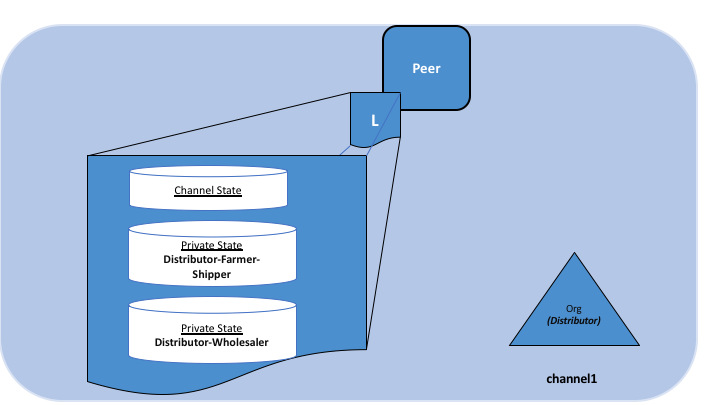

# Private data

## O que são dados privados?

Nos casos em que um grupo de organizações em um canal precisa manter os dados privados de outras organizações nesse canal, eles têm a opção 
de criar um novo canal, incluindo apenas as organizações que precisam acessar os dados. No entanto, a criação de canais separados em cada um 
desses casos cria uma sobrecarga administrativa (manutenção de versões do chaincode, políticas, MSPs, etc.) e não permite casos de uso nos 
quais você deseja que todos os participantes do canal vejam uma transação enquanto mantêm uma parte dos dados privados.

É por isso que o Fabric oferece a capacidade de criar **coleções de dados privados**, que permitem a um subconjunto definido de 
organizações em um canal a capacidade de endossar, confirmar ou consultar um conjunto dados privados sem precisar criar um canal separado.

## O que é uma coleção de dados privada?

Uma coleção é a combinação de dois elementos:

1. **Os dados privados reais**, são enviados ponto-a-ponto [via protocolo gossip](../gossip.html) para as organizações autorizadas a 
   vê-lo. Esses dados são armazenados em um banco de dados de estado privado nos nós pares das organizações autorizadas, que podem ser 
   acessados ​​a partir do chaincode desses pares autorizados. O serviço de ordens não está envolvido aqui e não vê os dados privados. 
   Observe que, como a protocolo gossip distribui os dados privados ponto-a-ponto para organizações autorizadas, é necessário configurar 
   pontos de ancoragem no canal e configurar CORE_PEER_GOSSIP_EXTERNALENDPOINT em cada ponto, para iniciar a comunicação entre organizações.

2. **Somente o hash desses dados**, que é endossado, ordenado e gravado nos livros-razão de todos os pares no canal. O hash serve como 
   evidência da transação e é usado para validação de estado e pode ser usado para fins de auditoria.

O diagrama a seguir ilustra o conteúdo do livro-razão de um par autorizado a ter dados privados e um que não é.

Os membros da coleção privada podem decidir compartilhar os dados privados com outras partes se entrarem em uma disputa ou se quiserem 
transferir o ativo para terceiros. O terceiro pode calcular o hash dos dados privados e verificar se ele corresponde ao estado no 
livro-razão do canal, provando que o estado existia entre os membros da coleção em um determinado momento.

Em alguns casos, você pode optar por ter um conjunto de coleções, cada uma composta por uma única organização. Por exemplo, uma organização 
pode registrar dados privados em sua própria coleção, que posteriormente poderão ser compartilhados com outros membros do canal e 
referenciados em transações do chaincode. Veremos exemplos disso no tópico de compartilhamento de dados privados abaixo.

### Quando usar uma coleção em um canal vs. um canal separado

* Use **canais** quando transações inteiras (e livros-razão) devem ser mantidas em sigilo em um conjunto de organizações que são membros do 
  canal.

* Use **coleções** quando transações (e livro-razão) devem ser compartilhadas entre um conjunto de organizações, mas quando apenas um 
  subconjunto dessas organizações deve ter acesso a alguns (ou todos) dos dados em uma transação. Além disso, como os dados privados são 
  disseminados ponto-a-ponto, e não através de blocos, use dados privados quando os dados da transação tiverem que ser mantidos em sigilo 
  das ordens dos nós de serviço.

## Um caso de uso para explicar coleções

Considere um grupo de cinco organizações em um canal que comercializa produtos:

* **Um fazendeiro** vendendo seus produtos no exterior
* **Um distribuidor** transportando mercadorias para o exterior
* **Um transportador** movendo mercadorias entre as partes
* **Um atacadista** que compra mercadorias de distribuidores
* **Um varejista** que compra mercadorias de transportadores e atacadistas

O **Distribuidor** pode querer fazer transações privadas com o **Fazendeiro** e o **Transportador** para manter em sigilo os termos das 
negociações do **Atacadista** e do **Varejista** (para não expor os valores que eles estão cobrando).

O **Distribuidor** também pode querer ter um relacionamento de dados privados separado com o **Atacadista**, porque cobra um preço mais 
baixo do que o **Varejista**.

O **Atacadista** também pode querer ter um relacionamento de dados privado com o **Varejista** e o **Transportador**.

Em vez de definir muitos canais pequenos para cada um desses relacionamentos, várias coleções de dados privados **(PDC)** podem ser 
definidas para compartilhar dados privados entre:

1. PDC1: **Distribuidor**, **Agricultor** e **Transportador**
2. PDC2: **Distribuidor** e **Atacadista**
3. PDC3: **Atacadista**, **Varejista** e **Transportador**

Usando este exemplo, os pares pertencentes ao **Distribuidor** terão vários bancos de dados privados em seu livro-razão, que incluem os dados 
privados do relacionamento do **Distribuidor**, **Agricultor** e **Transportador** e o relacionamento **Distribuidor** e **Atacadista**.

## Fluxo de transação com dados privados

Quando os dados privados são referenciadas no chaincode, o fluxo da transação é um pouco diferente para proteger a confidencialidade dos 
dados privados conforme as transações são propostas, endossadas e confirmadas no livro-razão.

Para obter detalhes sobre fluxos de transações que não usam dados privados, consulte nossa documentação em [fluxo de transações](../txflow.html).

1. O aplicativo cliente envia uma proposta de solicitação para chamar uma função de chaincode (lendo ou gravando dados privados) para 
   os pares de endosso que fazem parte das organizações autorizadas da coleção. Os dados privados, ou dados usados ​​para gerar dados privados 
   no chaincode, são enviados em um campo `transitório` da proposta.

2. Os pares endossantes simulam a transação e armazenam os dados privados em um `armazenamento temporário de dados` (um armazenamento 
   local temporário no par). Eles distribuem os dados privados, com base na política, para pares autorizados via protocolo 
   [gossip](../gossip.html).

3. O nó de endosso envia a resposta da proposta de volta ao cliente. A resposta da proposta inclui o conjunto de leitura/gravação endossado, 
   que inclui dados públicos, bem como um hash de quaisquer chaves e valores de dados privados. *Nenhum dado privado é enviado de volta ao 
   cliente*. Para obter mais informações sobre como o endosso funciona com dados privados, clique em [aqui](../private-data-arch.html#endorsement).

4. O aplicativo cliente envia a transação (que inclui a resposta da proposta com os hashes dos dados privados) ao serviço de ordens. As 
   transações com os hashes de dados privados são incluídas no blocos normalmente. O bloco com hashes dos dados privados é distribuído a 
   todos os pares. Dessa forma, todos os pares no canal podem validar transações com os hashes dos dados privados de maneira consistente, 
   sem conhecer os dados privados reais.

5. No momento da confirmação do bloco, os pares autorizados usam a política para determinar se estão autorizados a ter acesso aos 
   dados privados. Se o fizerem, primeiro verificarão o seu `armazenamento local de dados temporários` para determinar se eles já receberam 
   os dados privados no momento do endosso do chaincode. Caso contrário, eles tentarão extrair os dados privados de outro par autorizado. 
   Eles validarão os dados privados contra os hashes no bloco público e confirmarão a transação e o bloco. Após a validação/confirmação, os 
   dados privados são movidos para sua cópia do banco de dados de estado privado e armazenamento de gravações privadas. Os dados privados 
   são então excluídos do `armazenamento local temporário de dados`.

## Compartilhando dados privados

Em muitos cenários, as chaves/valores de dados privados em uma coleção podem precisar ser compartilhados com outros membros do canal ou com 
outras coleções de dados privados, por exemplo, quando você precisa realizar transações sobre dados privados com um membro do canal ou 
grupo de membros do canal que não foram incluídos nos dados privados originais. As partes receptoras geralmente desejam verificar os 
dados privados em relação aos hashes da cadeia como parte da transação.

Existem vários aspectos de dados privados que permitem o compartilhamento e a verificação de dados privados:

* Primeiro, você não precisa necessariamente ser um membro de uma coleção para gravar uma chave de uma coleção, desde que a política de 
  endosso seja cumprida. A política de endosso pode ser definida no nível do chaincode, no nível da chave (usando o endosso baseado no 
  estado) ou no nível da coleção (iniciando no Fabric v2.0).

* Segundo, a partir da v1.4.2, há uma API `GetPrivateDataHash()` da chaincode que permite que o chaincode em pares não membros leia o valor 
  de hash de uma chave privada. Esse é um recurso importante, como você verá mais adiante, pois permite que o chaincode verifique dados 
  privados em relação aos hashes criados a partir de dados privados em transações anteriores.

Essa capacidade de compartilhar e verificar dados privados deve ser considerada ao projetar aplicativos e as coleções de dados privados
associadas. Embora você possa certamente criar conjuntos de coleções de dados privados multilaterais para compartilhar dados entre várias 
combinações de membros do canal, essa abordagem pode resultar em um grande número de coleções que precisam ser definidas. Como alternativa, 
considere usar um número menor de coleções de dados privados (por exemplo, uma coleção por organização ou uma coleção por par de 
organizações) e, em seguida, compartilhar dados privados com outros membros do canal ou com outras coleções conforme a necessidade. A partir 
do Fabric v2.0, coleções implícitas específicas de organizações estão disponíveis para qualquer chaincode utilizar, para que você nem 
precise definir essas coleções por organização ao implementar o chaincode.

### Padrões de compartilhamento de dados privados

Ao modelar coleções de dados privados por organização, vários padrões ficam disponíveis para compartilhamento ou transferência de dados privados sem a sobrecarga de definir muitas coleções multilaterais. Aqui estão alguns dos padrões de compartilhamento que podem ser aproveitados em aplicativos de chaincode:

* **Use uma chave pública correspondente para rastrear o estado público** - 
  Você pode opcionalmente ter uma chave pública correspondente para rastrear o estado público (por exemplo, propriedades do ativo, 
  propriedade atual etc.) e para todas as organizações que devem ter acesso ao correspondente do ativo nos dados privados, você pode criar 
  uma chave/valor privado de dados privados de cada organização.

* **Controle de acesso do chaincode** - 
  Você pode implementar o controle de acesso em seu chaincode, para especificar quais clientes podem consultar dados privados em uma coleção. 
  Por exemplo, armazene uma lista de controle de acesso para uma chave de dados privada ou um conjunto de chaves e, no 
  chaincode, obtenha as credenciais do remetente do cliente (usando a API GetCreator() ou a biblioteca CID, API GetID () ou GetMSPID ()) e 
  verifique se eles têm acesso antes de retornar os dados privados. Da mesma forma, você pode exigir que um cliente passe uma senha no 
  chaincode, que deve corresponder a uma senha armazenada no nível da chave, para acessar os dados privados. Observe que esse padrão também 
  pode ser usado para restringir o acesso do cliente aos dados do estado público.

* **Compartilhando dados privados fora da cadeia** - 
  Como uma opção fora da cadeia, você pode compartilhar dados privados fora da cadeia, com outras organizações, e elas podem fazer o hash da 
  chave/valor para verificar se ele corresponde ao hash dentro da cadeia usando API de chaincode GetPrivateDataHash(). Por exemplo, uma 
  organização que deseja comprar um ativo pode querer verificar as propriedades de um ativo e se você é o proprietário legítimo, verificando 
  o hash na cadeia antes de concordar com a compra.

* **Compartilhando dados privados com outras coleções** - 
  Você pode 'compartilhar' os dados privados na cadeia com o chaincode que cria uma chave/valor correspondente de dados privados 
  da outra organização. Você passaria a chave/valor dos dados privados para codificar por meio de um campo transitório, e o chaincode 
  poderia confirmar que um hash dos dados privados passados ​​corresponde ao hash na cadeia da sua coleção usando GetPrivateDataHash ) e, em
  seguida, grava os dados privados no campo de dados privados de outra organização.

* **Transferindo dados privados para outras coleções** - 
  Você pode 'transferir' os dados privados com um chaincode que exclui a chave de dados privados da sua coleção e os cria na coleção de 
  outra organização. Novamente, use o campo transitório para passar os dados privados ao chamar o chaincode e, no chaincode, use 
  GetPrivateDataHash() para confirmar se os dados existem na sua coleção de dados privada, antes de excluir a chave da coleção e criar a 
  chave na coleção de outra organização. Para garantir que uma transação sempre seja excluída de uma coleção e adicionada a outra coleção, 
  convém solicitar recomendações de partes adicionais, como um regulador ou auditor.

* **Uso de dados privados para aprovação de transação** - 
  Se você deseja obter a aprovação de uma contraparte para uma transação antes que ela seja concluída (por exemplo, um registro na cadeia de 
  que eles concordam em comprar um ativo por um determinado preço), o chaincode pode solicitar que eles 'pré-aprovem' a transação, 
  escrevendo uma chave privada de dados privada ou na sua coleção, que o chaincode verificará usando GetPrivateDataHash(). De fato, 
  esse é exatamente o mesmo mecanismo que o chaincode do sistema de ciclo de vida interno usa para garantir que as organizações concordem com
  uma definição de chaincode antes de ser comprometida com um canal. A partir da Fabric v2.0, esse padrão se torna mais poderoso com as 
  políticas de endosso no nível da coleção, para garantir que o chaincode seja executado e endossado no mesmo ponto de confiança do 
  proprietário da coleção. Como alternativa, uma chave mutuamente acordada com uma política de endosso em nível de chave pode ser usada, que 
  é atualizada com os termos de pré-aprovação e endossada em pares das organizações necessárias.

* **Mantendo as entidades privadas** - 
  Uma variação do padrão anterior também podem eliminar o vazamento das entidades para uma determinada transação. Por exemplo, um comprador 
  indica um acordo para comprar sua própria coleção e, em uma transação subsequente, o vendedor faz referência aos dados privados do 
  comprador em sua própria base de dados privada. A prova de transação com referências de hash é registrada na cadeia, apenas o comprador 
  e o vendedor sabem que são os negociadores, mas podem revelar as pré-imagens se surgir uma necessidade, como em uma transação subsequente 
  com outra empresa. parte que pôde verificar os hashes.

Juntamente com os padrões acima, é importante notar que as transações com dados privados podem ser vinculadas às mesmas condições que os 
dados regulares do estado do canal, especificamente:

* **Controle de acesso à transação em nível de chave** -
  Você pode incluir credenciais de propriedade em um valor de dados particulares, para que as transações subsequentes possam verificar se o 
  remetente tem privilégio de propriedade para compartilhar ou transferir os dados. Nesse caso, o chaincode obteria as credenciais do 
  remetente (por exemplo, usando a API GetCreator() ou a API CID da biblioteca GetID() ou GetMSPID ()), combinando-o com outros dados 
  privados que são passados ​​ao chaincode para gerar o hash, use GetPrivateDataHash() para verificar se ele corresponde ao hash na cadeia 
  antes de prosseguir com a transação.

* **Políticas de endosso de nível chave** -
  E também como com os dados normais do estado do canal, você pode usar o endosso baseado no estado para especificar quais organizações 
  devem endossar transações que compartilham ou transferem dados privados, usando a API de chaincode SetPrivateDataValidationParameter(), 
  por exemplo, para especificar que apenas um parceiro da organização do proprietário, a organização de custódia pares ou outros terceiros 
  devem endossar essas transações.

### Cenário de exemplo: transferência de ativos usando dados privados

Os padrões de compartilhamento de dados privados mencionados acima podem ser combinados para criar aplicativos poderosos baseados em 
chaincode. Por exemplo, considere como um cenário de transferência de ativos pode ser implementado usando dados privados por organização:

* Um ativo pode ser rastreado por uma chave UUID no estado global do chaincode. Somente a propriedade do ativo é registrada, nada mais se 
  sabe sobre o ativo.

* O chaincode exigirá que qualquer solicitação de transferência seja originária do cliente proprietário e a chave esteja vinculada ao 
  endosso baseado no estado, exigindo que um par da organização do proprietário e da organização reguladora endosse qualquer solicitação de 
  transferência.

* Os dados privados do proprietário do ativo contém os detalhes privados sobre o ativo, registrados por um hash do UUID. Outras organizações 
  e o serviço de ordens verão apenas um hash dos detalhes do ativo.

* Vamos supor que o regulador também seja um membro de cada coleção e, portanto, persista os dados privados, embora esse não seja o caso.

Uma transação para negociar o ativo ocorreria da seguinte maneira:

1. Fora da cadeia, o proprietário e um potencial comprador fazem um acordo para negociar o ativo por um determinado preço.

2. O vendedor fornece prova de sua propriedade, passando os detalhes privados para fora da cadeia ou fornecendo credenciais ao comprador 
   para consultar os dados privados em seu nó ou no nó do regulador.

3. O comprador verifica se um hash dos detalhes privados corresponde ao hash público na cadeia.

4. O comprador chama o chaincode para registrar os detalhes de seu lance em sua própria base de dados privada. O chaincode é invocado no par 
   do comprador e, potencialmente, no par do regulador, se exigido pela política de endosso da cobrança.

5. O atual proprietário (vendedor) chama o chaincode para vender e transferir o ativo, passando os detalhes particulares e as informações de 
   lance. O chaincode é invocado em pares do vendedor, comprador e regulador, a fim de atender à política de endosso da chave pública, bem 
   como às políticas de endosso das bases de dados privados do comprador e do vendedor.

6. O chaincode verifica se o cliente que envia é o proprietário, verifica os detalhes particulares em relação ao hash na coleção do vendedor 
   e verifica os detalhes da oferta em relação ao hash na coleção do comprador. O chaincode grava as atualizações propostas para a chave 
   pública (definindo a propriedade do comprador e definindo a política de endosso como organização e reguladora de compras), grava os 
   detalhes privados nas bases de dados privadas do comprador e potencialmente exclui os detalhes privados do vendedor. Antes do endosso 
   final, os pares endossados ​​garantem a disseminação de dados privados para quaisquer outros pares autorizados do vendedor e do regulador.

7. O vendedor envia a transação com os hashes de dados públicos e privados, a ordem é criada e distribuída a todos os pares de canais em um 
   bloco.

8. A lógica de validação de bloco de cada parceiro verificará consistentemente a política de endosso (comprador, vendedor, regulador, todos 
   endossados) e o estado público e privado lido no chaincode se não foi modificado por nenhuma outra transação desde a execução do 
   chaincode.

9. Todos os pares confirmam a transação como válida, pois passou nas verificações de validação. Os pares do comprador e do regulador 
   recuperam os dados privados de outros pares autorizados se não os receberam no momento do endosso e mantêm os dados privados em seu banco 
   de dados de estado de dados privados (supondo que os dados privados correspondam aos hashes da transação).

10. Com a transação concluída, o ativo foi transferido e outros membros do canal interessados ​​no ativo podem consultar o histórico da chave 
    pública para entender sua procedência, mas não terão acesso a nenhum detalhe particular, a menos que um proprietário o compartilhe em 
    uma necessidade de se conhecer.

O cenário básico de transferência de ativos pode ser estendido para outras considerações, por exemplo, o chaincode de transferência pode 
verificar se um registro de pagamento está disponível para atender aos requisitos de pagamento versus entrega, ou verificar se um banco 
enviou uma carta de crédito antes da execução do chaincode de transferência. E, em vez de as entidades hospedarem diretamente os nós, eles 
poderiam realizar transações através de organizações de custódia que estão executando os nós.

## Limpando dados privados

Para dados muito confidenciais, mesmo as partes que compartilham os dados privados podem desejar --- ou podem ser exigidas pelas 
regulamentações governamentais --- periodicamente "limpar" os dados de seus pares, deixando para trás um hash dos dados no blockchain para 
servir como evidência imutável dos dados privados.

Em alguns desses casos, os dados privados precisam apenas existir no banco de dados privado do par até que possam ser replicados em um banco 
de dados externo ao blockchain do par. Os dados também podem precisar existir apenas nos pares até que um processo de negócios do chaincode 
seja concluído (comércio finalizado, contrato cumprido, etc.).

Para suportar esses casos de uso, os dados privados podem ser limpos se não tiverem sido modificados para um número configurável de blocos. 
Os dados privados eliminados não podem ser consultados a partir do chaincode e não estão disponíveis para outros pares solicitantes.

## Como uma base de dados privada é definida

Para obter mais detalhes sobre definições de dados privados e outras informações de baixo nível sobre dados e coleções privadas, consulte o 
[tópico de referência de dados privados](../private-data-arch.html).

<!--- Licensed under Creative Commons Attribution 4.0 International License
https://creativecommons.org/licenses/by/4.0/ -->
