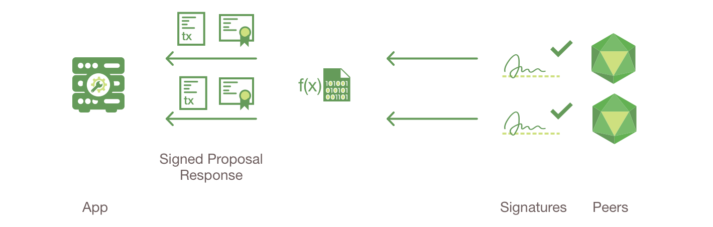

Fluxo da Transação
==================

Este documento descreve a mecânica transacional que ocorre durante uma troca de 
básica de ativos. O cenário inclui dois clientes, A e B, que estão comprando e 
vendendo rabanetes. Cada um deles tem um ponto na rede através do qual enviam 
suas transações e interagem com o livro-razão.

.. image:: images/step0.png

**Premissas**

Esse fluxo supõe que um canal esteja configurado e em execução. O usuário do 
aplicativo se registrou e se inscreveu na Autoridade de Certificação (CA) da 
organização e recebeu de volta o material criptográfico necessário, usado para 
autenticação na rede.

O chaincode (contendo um conjunto de pares de chave-valor que representam o 
estado inicial do mercado de rabanete) é instalado nos nós e implantado no 
canal. O chaincode contém a lógica que define um conjunto de instruções de 
transação e o preço acordado para um rabanete. Também foi definida uma política 
de endosso para este código, definindo que ``peerA`` e ``peerB`` devem 
endossar qualquer transação.

.. image:: images/step1.png

1. **O cliente A Inicia uma transação**

O que está acontecendo? O cliente A está enviando uma solicitação para comprar 
rabanetes. Essa solicitação tem como alvo ``peerA`` e ``peerB``, que são
respectivamente representantes do Cliente A e do Cliente B. A política de endosso
afirma que ambos os pares devem endossar qualquer transação, portanto, a 
solicitação vai para ``peerA`` e ``peerB``.

Em seguida, a proposta de transação é construída. Um aplicativo que utiliza um 
SDK suportado (Node, Java, Python) utiliza uma das APIs disponíveis para gerar 
uma proposta de transação. A proposta é uma solicitação para chamar uma função 
do chaincode com certos parâmetros de entrada, com a intenção de ler e/ou 
atualizar o livro-razão.

O SDK serve como um ferramenta para empacotar a proposta de transação no formato 
arquitetado corretamente (buffer de protocolo sobre gRPC) e usa as credenciais 
criptográficas do usuário para produzir uma assinatura exclusiva para essa 
proposta de transação.

2. **Nós de endosso verificam a assinatura & executam a transação**

Os nós de endosso verificam (1) se a proposta de transação está bem formada, (2) 
se ja não foi enviada no passado (proteção contra ataques de repetição), (3) a 
assinatura é válida (usando o MSP) e (4) se que o remetente (Cliente A, no exemplo) 
está devidamente autorizado a executar a operação proposta nesse canal (ou seja,
cada ponto de endosso garante que o remetente cumpra a política *escrita* do 
canal). Os nós de endosso recebem as entradas da proposta de transação como 
argumentos para a função invocada do chaincode. O chaincode é então executado no
banco de dados do estado atual para produzir os resultados da transação, 
incluindo um valor de resposta, um conjunto de leitura e um conjunto de gravação 
(ou seja, pares de chave-valor que representam um ativo para criar ou atualizar). 
Nenhuma atualização é feita no livro-razão neste momento. O conjunto desses 
valores, juntamente com a assinatura do par endossado, é retornado como uma 
"resposta da proposta" ao SDK, que analisa o conteúdo para o aplicativo consumir.

.. note:: O MSP é um componente do nó que permite verificar os pedidos de transação 
          que chegam dos clientes para assinar os resultados da transação 
          (recomendações). A política de gravação é definida no momento da criação
          do canal e determina quais usuários têm direito a enviar uma transação 
          para esse canal. Para obter mais informações sobre associação, consulte
          nossa documentação :doc:`membership/membership`

.. image:: images/step3.png

3. **As respostas da proposta são inspecionadas**

O aplicativo verifica as assinaturas dos nós endossantes e compara com as respostas 
da proposta para determinar se as respostas da proposta são iguais. Se o código 
de chamada estiver apenas consultando o livro-razão, o aplicativo somente 
inspecionará a resposta da consulta e normalmente não enviará a transação ao 
serviço de ordens. Se o aplicativo cliente pretender enviar a transação ao serviço
de ordens para atualizar o livro-razão, o aplicativo determinará se a política de
endosso especificada foi cumprida antes do envio (ou seja, peerA e peerB ambos 
endossam). A arquitetura é tal que, mesmo que um aplicativo opte por não 
inspecionar respostas ou encaminhar uma transação não endossada, a política de 
endosso ainda será aplicada pelos pares e mantida na fase de validação da confirmação.

.. image:: images/step4.png

4. **Cliente reúne os endossos em uma transação**

O aplicativo "transmite" a proposta e a resposta da transação dentro de uma 
"mensagem de transação" para o serviço de ordens. A transação conterá os conjuntos 
de leitura/gravação, as assinaturas dos pares endossantes e o ID do canal. O 
serviço de pedidos não precisa inspecionar todo o conteúdo de uma transação para 
executar sua operação, simplesmente recebe transações de todos os canais da rede, 
ordena-os cronologicamente por canal e cria blocos de transações por canal.

.. image:: images/step5.png

5. **A transação é validada e confirmada**

Os blocos da transações são "entregues" a todos os pares no canal. As transações 
dentro do bloco são validadas para garantir que a política de endosso seja 
cumprida e para garantir que não houve alterações no estado do livro-razão para 
as variáveis do conjunto de leitura desde que o conjunto de leitura foi gerado 
pela execução da transação. As transações no bloco são marcadas como válidas ou 
inválidas.

.. image:: images/step6.png

6. **Livro-razão atualizado**

Cada nó anexa o bloco à cadeia do canal e, para cada transação válida, os conjuntos 
de gravação são confirmados no banco de dados do estado atual. Um evento é emitido
por cada nó para notificar o aplicativo cliente de que a transação (invocação) 
foi anexada à cadeia de registros imutáveis, bem como a notificação de que a 
transação foi validada ou invalidada.

.. note:: Os aplicativos devem escutar o evento da transação após enviar uma 
          transação, por exemplo, usando a API ``submitTransaction``, que escuta
          automaticamente os eventos da transação. Sem atender a eventos de 
          transação, você não saberá se sua transação foi realmente ordenada, 
          validada e confirmada no livro-razão.

