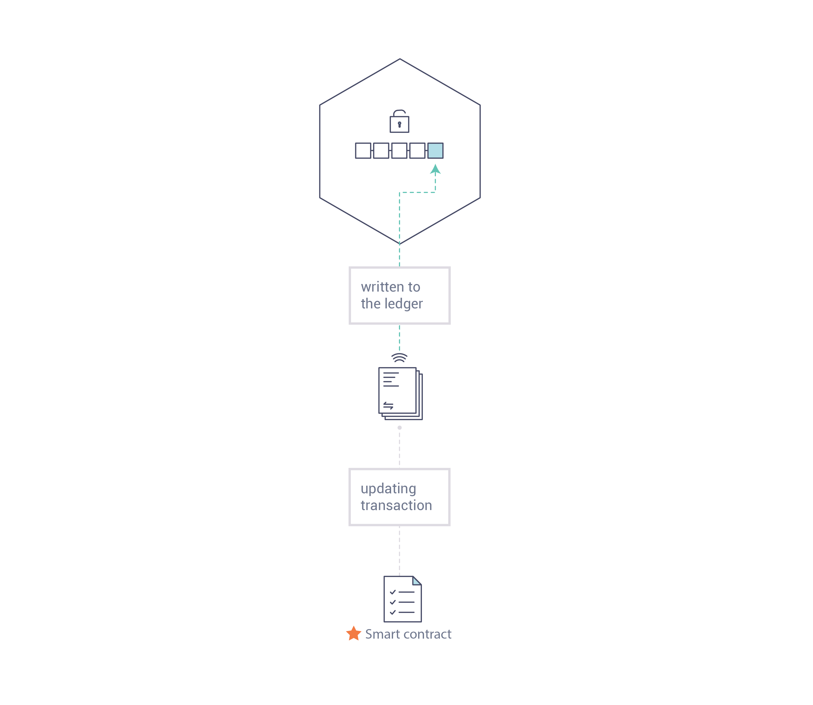

Вступление
==========
Hyperledger Fabric --- платформа для решений на основе распределенного реестра, имеющая модульную архитектуру и обеспечивающая высокий уровень конфиденциальности, устойчивости, гибкости и масштабируемости. Она была спроектирована так, чтобы поддерживать сменные реализации разных компонентов и учитывать трудности, существующие в экономических экосистемах.

Новичкам мы советуем начать с прочтения оставшегося вступления, чтобы познакомится с тем, как работает блокчейн, с его особенностями и с компонентами Hyperledger Fabric.

Когда вы освоитесь или если вы уже были знакомы с блокчейном и Hyperledger Fabric, приступайте к секции :doc:`getting started` и изучайте демо-проекты, технические спецификации, API и др.

Что такое блокчейн?
-------------------
**Распределенный реестр**

В основе сети блокчейн лежит распределенный реестр, который записывает все транзакции, которые происходят в сети.

Реестр блокчейна часто называют **децентрализованным**, поскольку он хранится всеми участниками сети, каждый из которых **коллаборирует** в его поддержке. Чуть позже мы поймем, что децентрализация и коллаборация --- важные атрибуты, которые отражают происходящий в реальном мире обмен услугами и товарами в бизнесе.

.. image:: images/basic_network.png

В дополнение к децентрализации и коллаборации, информация, записанная в блокчейн, уже не может быть удалена. Используемые криптографические техники гарантируют, что, если транзакция была добавлена в реестр, изменить или убрать ее невозможно. Эта неизменяемость позволяет легко определить источник информации, поскольку участники уверены в том, что информация сохранилась в изначальном виде. Именно поэтому блокчейн иногда называют “systems of proof” (система доказательства).

**Смартконтракты**

Чтобы обеспечить согласованное обновление информации и чтобы сделать возможным работу всего множества функций по работе с реестром (создание транзакций, осуществление поисковых запрос и т.д.) --- блокчейн-сеть использует **смартконтракты**, чтобы предоставить контролируемый доступ к реестру.
 

Смартконтракты, кроме того, что являются ключевым механизмом, позволяющим инкапсулировать информацию и хранить ее повсюду в сети, также могут быть написаны так, чтобы участники могли сами исполнять некоторые части транзакций автоматически.

Смартконтракт, например, может быть написан так, чтобы предусматривать стоимость транспортировки предмета, которая зависит от того, насколько быстро он будет доставлен. По согласованным ранее условиям, занесенным в реестр, соответствующая сумма перейдет из рук в руки автоматически, когда предмет будет получен.

**Консенсус**

Процесс хранения реестра транзакций синхронизированным повсюду в сети --- для того чтобы реестры обновлялись лишь тогда, когда транзакции подтверждены всеми соответствующими участниками, и чтобы все реестры обновлялись одними и теми же транзакциями, и в одной и той же последовательности --- называется консенсусом.

.. image:: images/consensus.png

Позже вы узнаете больше про реестры, смартконтракты и консенсусы. Пока достаточно представлять себе блокчейн, как совместную, реплицируемую систему транзакций, которая обновляется с помощью смартконтрактов и держится постоянно синхронизированной с помощью процесса взаимодействия, называемого консенсусом.

В чем польза блокчейна?
-----------------------

**Современная система записи**

Транзакционные сети, существующие на сегодняшний день, --- это лишь слегка обновленные версии сетей, которые остались с тех пор, когда бизнес-записи только начинали хранить. Участники **бизнес-сети** заключают и осуществляют друг с другом сделки, но поддерживают частные, отдельные друг от друга записи транзакций. И происхождение вещей, участвующих в транзакциях, будь то фламандские гобелены в 16 веке или ценные бумаги сейчас, должно быть установлено каждый раз, когда они продаются, чтобы убедиться в том, что купленная вещь обладает последовательностью правовых титулов, удостоверяющую право на собственность.

Мы остаемся с бизнес-сетью, которая выглядит вот так: 

.. image:: images/current_network.png

Современные технологии перенесли этот процесс из области каменных табличек и бумажных папок в область облачных платформ и жестких дисков, однако стоящая за всем этим структура все та же. Унифицированных систем для управления учетной записью участника сети не существует, установление происхождения настолько трудоемко, что сделки с ценными бумагами (чей мировой объем оценивается в множество триллионов долларов) занимают дни, контракты должны быть подписаны и исполнены вручную, и каждая база данных в системе содержит уникальную информацию и поэтому представляет собой ..

Учитывая сегодняшний разнящийся подход к информации и процессу ее передачи, невозможно создать систему записи, которая охватывает бизнес сеть, хотя потребность в доверии и видимости очевидна.

**Отличие блокчейна**

Что, если вместо неэффективного беспорядка, который представляет из себя современная система транзакций, бизнес-сети имели стандартные методы для идентифицирования участников сети, для исполнения транзакций и для хранения данных? Что, если происхождение актива можно определить, лишь просмотрев список транзакций, которым можно доверять, поскольку, записав их, внести изменения или удалить их уже нельзя?

Такая бизнес сеть будет выглядеть вот так:

.. image:: images/future_net.png

Это блокчейн-сеть, в которой каждый участник имеет собственную копию реестра. В дополнение к тому, что информация реестра является единой и общей, процессы, обновляющие реестр, также публичны. В отличие от сегодняшних систем, где приватные программы участника обновляют его приватные реестры, система блокчейн использует общие программы, чтобы обновлять общие реестры. Сеть блокчейн, способная координировать бизнес сеть через общий реестр, может сократить время, стоимость и риски, связанные с приватной информацией и ее обработкой, но укрепить доверие и улучшить видимость.

Теперь вы понимаете, что такое блокчейн и чем он так полезен. Существует еще много важных деталей, однако они все связаны с этими фундаментальными идеями обмена информацией и процессами.

Что такое Hyperledger Fabric?
-----------------------------

Linux Foundation основал проект Hyperledger в 2015 году для продвижения кросс-отраслевых применений технологии блокчейн. Вместо того чтобы установить единый стандарт блокчейна, он поощряет совместную разработку технологий блокчейн независимыми разработчиками, с правами на интеллектуальную собственность, что стимулирует открытую разработку и принятие ключевых стандартов.

Hyperledger Fabric --- один из блокчейн проектов в рамках Hyperledger. Также как и другие блокчейн-технологии он использует реестр, смартконтракты и систему, с помощью которых участники управляют своими транзакциями.

Однако Hyperledger Fabric обладает **private permissioned-сетью**, что отличает его от многих других блокчейн-систем. В отличие от пользователей public permissionless-систем, которые позволяют неизвестным участвовать в сети (требуя протоколы вида “proof of work” для подтверждения транзакций и  обеспечения безопасности сети), члены сети Hyperledger Fabric вступают в сеть через доверенную службу Membership Service Provider (MSP).

Hyperledger Fabric также предлагает сменные опции. Данные реестра могут хранится в нескольких форматах, механизмы консенсуса могут быть заменены, поддерживаются несколько MSP.

Hyperledger Fabric также предоставляет возможность создавать **каналы**, позволяющие группе участников создать отдельный реестр транзакций. Это особенно важная функция для сетей, в которых конкурирующие участники не хотят, чтобы некоторые их транзакции были известны всем --- например, когда делают специальное предложение, которое не хотят делать доступным для всех. Два участника могут иметь приватный канал друг с другом, тогда лишь они будут иметь копию реестра этого канала. 

**Общий реестр**

Реестр Hyperledger Fabric имеет состоящую из двух компонент подсистему: **world state** (состояние мира) и **transaction log** (журнал транзакций). Каждый участник имеет копию реестра каждой сети Hyperledger Fabric, в которой он состоит.

Компонент world state описывает состояние реестра в определенный момент времени. Это база данных реестра. Компонент transaction log записывает все транзакции, которые привели к текущему world state; это обновленная история для world state. В реестре, тогда, это комбинация базы данных world state и истории transaction log.

Реестр имеет сменное хранилище данных для world state. По умолчанию, это база LevelDB, работающая со структурами данных типа «ключ — значение». В сменном transaction log нет необходимости, он просто записывает значения «до» и «после» базы данных реестра при использовании блокчейн-сети.

**Смартконтракты**

Все смартконтракты Hyperledger Fabric написаны через **chaincode** и вызываются через внешнее приложение, когда ему требуется провзаимодействовать с реестром. В большинстве случаев, chaincode взаимодействует только с базой данных реестра --- компонентом world state (например, совершая поисковые запросы).

Chaincode может быть написан на нескольких языках программирования. В настоящее время поддерживаются Go и Node.js.

**Приватность**

В зависимости от нужд сети, участники Business-to-Business (B2B) сети могут быть очень осторожными в плане количества распространяемой ими информции. Для других сетей, приватность может не являться главной проблемой.

**Консенсус**

Транзакции должны быть записаны в реестр в порядке появления, хотя они могут происходить между разными наборами участников внутри сети. Для этого необходимо установить четкий порядок транзакций (совершить ordering), а также иметь метод для отклонения плохих транзакций, которые были внесены в реестр ошибочно или злонамеренно.

Эта область Computer Science крайне хорошо изучена, и есть несколько способов достижения этой цели, каждый со своими недостатками. Для примера, PBFT (Practical Byzantine Fault Tolerance) может обеспечить механизм согласования через общение между несколькими репликами одного файла, даже в случае повреждения одной из них. В качестве альтернативы, в Bitcoin ordering происходит с помощью механизма майнинга, в котором компьютеры соревнуются, кто быстрее сможет решить криптографический пазл, определяющий порядок, по которому строятся все остальные процессы.

Hyperledger Fabric был спроектирован, чтобы сделать возможным выбор механизма консенсуса, который лучше всех отражает отношения, существующие между участниками. Как и с приватностью, тут существует целый спектр нужд; от сетей, крайне структурированных в существующих в них отношениях, до более peer-to-peer сетей.

.. Licensed under Creative Commons Attribution 4.0 International License
   https://creativecommons.org/licenses/by/4.0/
