## Жизненный цикл чейнкода Fabric

## Что такое чейнкод

Чейнкод — это программный код, написанный с использованием языков программирования [Go](https://golang.org), [Node.js](https://nodejs.org), или [Java](https://java.com/en/), для реализации необходимых интерфейсов. Чейнкод выполняется из защищенного контейнера Docker, изолированного от процесса одобрения. Чейнкод инициализирует и управляет состоянием реестра посредством транзакций, отправляемых приложениями.

В большинстве случаев чейнкод обрабатывает бизнес-логику, согласованную участниками сети, поэтому его можно рассматривать как «смарт-контракт». Обновления реестра, создаваемые определенным чейнкодом, ограничены исключительно этим чейнкодом и недоступны напрямую другому чейнкоду. Однако при наличии соответствующего разрешения внутри сети чейнкод может вызывать другой чейнкод для доступа к его состоянию.

В этом разделе документации чейнкод рассматривается с точки зрения оператора блокчейн-сети, а не разработчика приложений. Операторы чейнкода могут использовать этот раздел в качестве руководства к применению жизненного цикла чейнкода Fabric для развертывания и управления чейнкодом в своей сети.

## Развертывание чейнкода 

Жизненный цикл чейнкода Fabric — это процесс, который позволяет нескольким организациям согласовывать особенности работы чейнкода перед его использованием в канале. Оператор сети может использовать жизненный цикл Fabric для выполнения следующих задач:

- [Установка и определение чейнкода.](#install-and-define-a-chaincode) 
- [Обновление чейнкода.](#upgrade-a-chaincode)
- [Различные варианты развертывания.](#deployment-scenarios)
- [Переход на новую версию жизненного цикла Fabric.](#migrate-to-the-new-fabric-lifecycle)

Жизненный цикл чейнкода Fabric можно использовать, создав новый канал и указав версию V2_0 функциональных возможностей для этого канала. Старая версия жизненного цикла не может использоваться для установки, создания или обновления чейнкода в каналах с версией V2_0 функциональных возможностей. Однако по-прежнему можно вызывать чейнкод, установленный с использованием предыдущей модели жизненного цикла, после включения возможностей версии V2_0. При обновлении сети версии v1.4.x может понадобится изменить настройки каналов и включить новую версию жизненного цикла. Как это сделать описано в разделе [Включение новой версии жизненного цикла чейнкода.](./enable_cc_lifecycle.html). 

## Установка и определение чейнкода

Жизненный цикл чейнкода Fabric требует, чтобы организации согласовывали определяющие чейнкод параметры — название, версию и правила одобрения чейнкода. Члены канала приходят к соглашению в процессе, состоящем из следующих четырех шагов. Не каждой организации в канале нужно выполнять все шаги.

1. **Упаковка чейнкода:** этот шаг может быть выполнен одной организацией или всеми организациями. 
2. **Установка чейнкода на одноранговых узлах:** каждая организация, которая будет использовать чейнкод для подтверждения транзакций или обращения к реестру, должна выполнить этот шаг.
3. **Утверждение определения чейнкода в рамках организации:** каждая организация, которая будет использовать чейнкод, должна выполнить этот шаг. Определение чейнкода должно быть одобрено достаточным количеством организаций, чтобы соответствовать правилам одобрения жизненного цикла LifecycleEndorsment канала (по умолчанию большинство), прежде чем чейнкод может быть использован в канале.
4. **Запись определения чейнкода в канале:** транзакция записи отправляется ​одной организацией после одобрения необходимым количеством организаций в канале. Отправитель сначала получает одобрения от достаточного количества одноранговых узлов организаций, а затем отправляет транзакцию записи определения чейнкода.

В этом разделе представлен общий обзор операций жизненного цикла чейнкода Fabric. Конкретные команды не рассматриваются. Более подробно о работе с жизненным циклом Fabric через интерфейс командной строки одноранговых узлов рассказано в разделах [Развертывание смарт-контракта в канале](deploy_chaincode.html) и [Справка по командам жизненного цикла одноранговых узлов](commands/peerlifecycle.html).

### Шаг первый: упаковка смарт-контракта

Перед установкой на одноранговых узлах чейнкод необходимо упаковать в файл формата tar. Для упаковки чейнкода можно использовать двоичные файлы одноранговых узлов Fabric, комплект разработчика Node Fabric SDK или сторонние утилиты, например, GNU TAR. При создании пакета чейнкода необходимо указать метку пакета чейнкода для краткого и понятного описания пакета.

При использовании сторонней утилиты для упаковки чейнкода, результирующий файл должен иметь указанный ниже формат. Двоичные файлы одноранговых узлов Fabric и комплект разработчика Fabric SDK позволяют автоматически создавать файлы в нужном формате.
- Чейнкод должен быть упакован в файл tar, заканчивающийся расширением `.tar.gz`.
 - Файл tar должен содержать два файла (без каталога): файл метаданных «metadata.json» и еще один файл формата tar «code.tar.gz» с файлами чейнкода.
- Файл «metadata.json» содержит данные в формате JSON, в которых указан язык чейнкода, путь к коду и метка пакета. Ниже приведен пример файла метаданных:

  ```
  {"Path":"fabric-samples/chaincode/fabcar/go","Type":"golang","Label":"fabcarv1"}
  ```

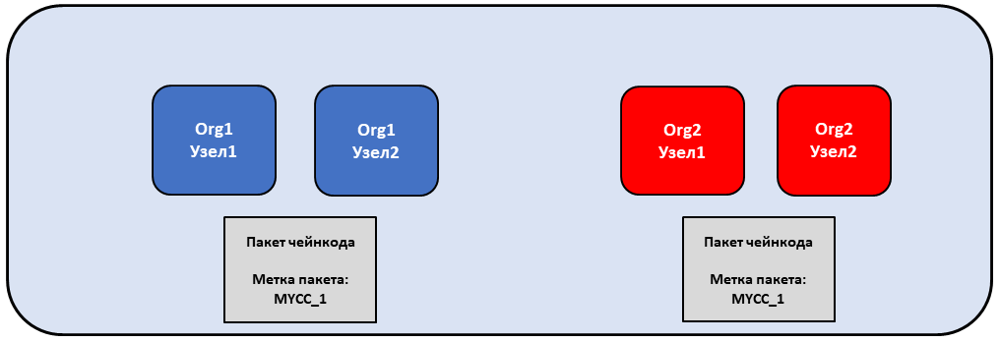

*Организации Org1 и Org2 самостоятельно упаковывают чейнкод. Обе организации используют MYCC_1 в качестве метки для идентификации пакета по названию и версии. Организациям не обязательно использовать одну и ту же метку пакета.*

### Шаг второй: установка чейнкода на одноранговых узлах

Пакет чейнкода необходимо установить на каждом одноранговом узле, который будет выполнять и одобрять транзакции. Независимо от того, используется ли интерфейс командной строки или SDK, этот шаг выполняется **администратором одноранговых узлов**. После установки чейнкода одноранговый узел производит сборку чейнкода или возвращает ошибку сборки в случае проблемы с чейнкодом. Рекомендуется производить упаковку чейнкода только один раз, а затем устанавливать этот пакет на каждом одноранговом узле. Для гарантии того, что все организации в канале используют один и тот же чейнкод, одна организация может упаковать и отправить чейнкод другим участникам канала по внешнему каналу передачи данных.

Успешное выполнение команды установки возвращает идентификатор пакета чейнкода, который представляет собой метку пакета в сочетании с хешем пакета. Этот идентификатор пакета используется для связывания пакета чейнкода, установленного на одноранговых узлах, с определением чейнкода, утвержденного организацией. Следует **сохранить идентификатор** для использования в следующем шаге. Также идентификатор пакета можно получить с помощью интерфейса командной строки одноранговых узлов, запросив пакеты, установленные на одноранговом узле.

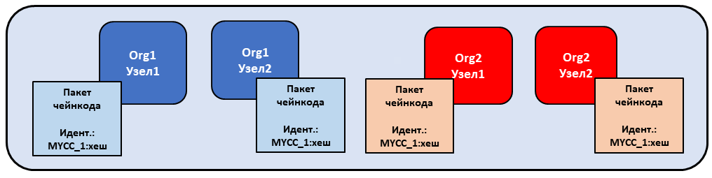

*Администраторы одноранговых узлов организаций Org1 и Org2 устанавливают пакет чейнкода MYCC_1 на одноранговых узлах, подключенных к каналу. При установке пакета чейнкода создается чейнкод и идентификатор пакета в виде MYCC_1:хеш.*

 ### Шаг третий: утверждение определения чейнкода внутри организации

Чейнкод управляется **определением чейнкода**. При утверждении определения чейнкода участниками канала, организации «голосуют» за желаемые параметры чейнкода. Эти утвержденные организациями определения позволяют участникам канала согласовать содержание чейнкода, прежде чем его можно будет использовать в канале. Определение чейнкода включает следующие параметры, которые должны быть согласованы всеми организациями:

- **Название:** название, которое будет использоваться приложениями при вызове чейнкода.
- **Версия:** номер версии или значение, соответствующее определенному пакету чейнкоду. При обновлении двоичных файлов чейнкода также необходимо изменить версию чейнкода.
- **Порядковый номер:** количество повторных определений чейнкода. Представляет собой целое число, которое используется для отслеживания обновлений чейнкода. Например, порядковый номер «1» означает изначальную установку и утверждение определения чейнкода. При следующем обновлении чейнкода порядковый номер увеличится до «2».
- **Правила одобрения:** перечисляют организации, которые должны выполнить транзакцию и подтвердить ее итог. Правила одобрения могут быть выражены в виде строки, передаваемой в интерфейс командной строки, а также могут ссылаться на правила в конфигурации канала. По умолчанию для правил одобрения задано значение ``Channel/Application/Endorsement``. Это значит, что большинство организаций в канале должны одобрить транзакцию.
- **Конфигурация подгруппы допуска к закрытым данным:** путь к файлу с определением подгруппы допуска к закрытым данным, связанным с чейнкодом. Для получения дополнительной информации о подгруппах допуска к закрытым данным см. [Справочник по архитектуре закрытых данных](https://hyperledger-fabric.readthedocs.io/en/{BRANCH}/private-data-arch.html).
- **Плагины ESCC/VSCC:** название настраиваемого плагина одобрения или проверки, который будет использоваться этим чейнкодом.
- **Инициализация:** при использовании функций низкого уровня, предоставляемых API-интерфейсом Fabric Chaincode Shim, чейнкод должен содержать функцию `Init`, которая используется для инициализации чейнкода. Эта функция должна обязательно содержаться в интерфейсе чейнкода, однако может не вызываться приложениями. При утверждении определения чейнкода можно указать необходимость обращения к функции `Init` перед вызовом чейнкода. В случае, если указано, что требуется обращение к функции `Init`, Fabric гарантированно вызовет функцию `Init` перед любой другой функцией в чейнкоде и вызовет ее только один раз. Функция `Init` позволяет реализовать логику, которая запускается при инициализации чейнкода, например, для установки некоторого начального состояния. Функцию `Init` следует вызывать для инициализации чейнкода при каждом увеличении версии чейнкода в случае, если в определении чейнкода, которое увеличивает версию, указана необходимость запуска функции `Init`.

  При использовании интерфейса командной строки одноранговых узлов Fabric можно добавить флаг `--init-required` при утверждении и записи определения чейнкода, чтобы указать, что функция `Init` должна быть вызвана для инициализации новой версии чейнкода. Чтобы вызвать `Init` с помощью интерфейса командной строки одноранговых узлов Fabric, используйте команду `peer chaincode invoke` с флагом `--isInit`.

  При использовании API-интерфейса смарт-контрактов Fabric, чейнкод может не содержать метод `Init`. Однако по-прежнему можно использовать флаг `--init-required`, чтобы запросить инициализацию чейнкода при вызове из приложения.   В случае использовании флага `--init-required` необходимо передавать флаг или параметр `--isInit` в вызове чейнкода для инициализации чейнкода при каждом увеличении номера версии чейнкода. Можно передать флаг `--isInit` и инициализировать чейнкод, используя любую функцию чейнкода.

Определение чейнкода также включает **идентификатор пакета**. Идентификатор является обязательным параметром для каждой организации, которая хочет использовать чейнкод. Идентификатор пакета не обязательно должен быть одинаковым для всех организаций. Организация может утвердить определение чейнкода без установки пакета чейнкода или добавления идентификатора в определение.

Каждый участник канала, который хочет использовать чейнкод, должен утвердить определение чейнкода для своей организации. Транзакцию одобрения необходимо отправить в службу упорядочения, после чего она будет распространена среди всех одноранговых узлов. Транзакцию одобрения отправляет **администратор организации**. После успешного отправления транзакции одобрения, утвержденное определение сохраняется в подгруппе доступа, открытой всем одноранговым узлам организации. Это означает, что чейнкод утверждается в рамках организации только один раз, даже при наличии множества одноранговых узлов. 

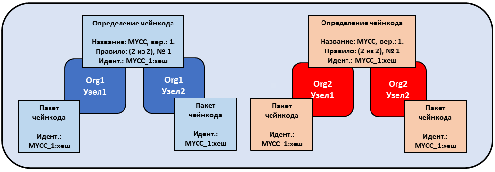

*Администраторы организаций Org1 и Org2 утверждают определение чейнкода MYCC для своих организаций. Определение чейнкода включает название, версию и правила одобрения чейнкода, а также другие данные. Поскольку обе организации будут использовать чейнкод для одобрения транзакций, утвержденные определения для обеих организаций должны включать идентификатор пакета packageID.*

### Шаг четвертый: запись определения чейнкода в канале

После утверждения определения чейнкода достаточным количеством участников канала, одна организация может записать определение в канал. Прежде чем записать определение в канал с помощью интерфейса командной строки однорангового узла, можно воспользоваться командой ``checkcommitreadiness``, чтобы убедиться, что запись определения чейнкода пройдет успешно на основании того, какие участники канала одобрили определение. Транзакция запроса на запись сначала отправляется одноранговым узлам участников канала, которые запрашивают определение чейнкода, утвержденное для их организаций, и одобряют определение, если их организация одобрила это определение. Затем транзакция отправляется в службу упорядочения, которая записывает определение чейнкода в канал. Транзакция записи определения должна отправляться **администратором организации**.

Количество организаций, которым необходимо утвердить определение, прежде чем оно может быть успешно записано в канале, регулируется правилами одобрения жизненного цикла ``Channel/Application/LifecycleEndorsement``. По умолчанию эти правила подразумевают, что большинство организаций в канале должны одобрить транзакцию. Правила одобрения жизненного цикла LifecycleEndorsement отделены от правил одобрения чейнкода. Например, даже если правила одобрения чейнкода требуют подписи только одной или двух организаций, большинству членов канала все еще нужно одобрить определение чейнкода в соответствии с правилами одобрения по умолчанию. При записи определения в канале необходимо задействовать достаточное количество организаций с одноранговыми узлами, чтобы удовлетворить требования правил одобрения LifecycleEndorsement. Больше о правилах одобрения жизненного цикла чейнкода Fabrinc рассказано в разделе [Концепция установленных правил](policies/policies.html).

Также можно указать, что правила одобрения ``Channel/Application/LifecycleEndorsement`` являются правилами подписи, а также явно указать набор организаций в канале, которые могут утверждать определение чейнкода. Это позволяет создать канал, в котором определенное количество организаций действуют как администраторы чейнкода и управляют бизнес-логикой в канале. Также можно использовать правила подписи, если в канале присутствует большое количество организаций Idemix, которые не могут утверждать определения чейнкодов или одобрять чейнкоды, что может приести к отсутствию большинства при одобрении.

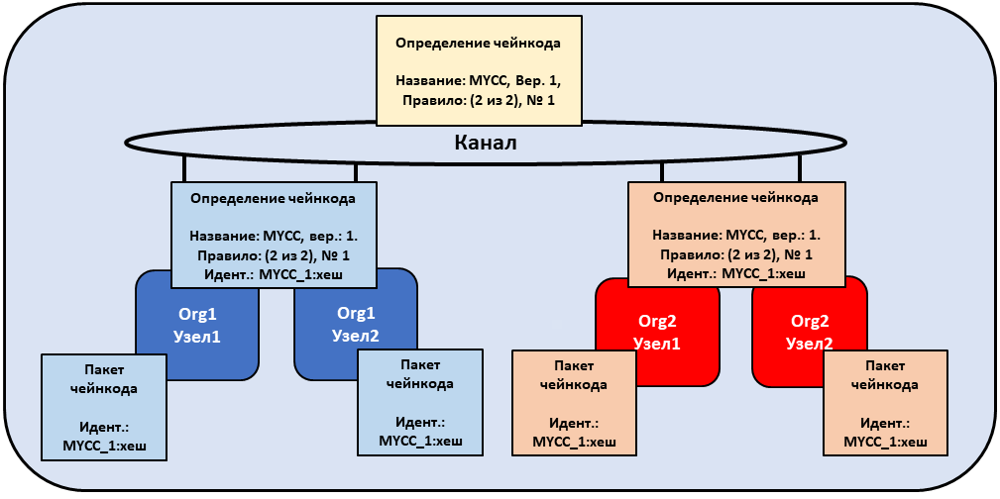

*Администратор организации Org1 или Org2 записывает определение чейнкода в канал. Определение в канале не включает идентификатор пакета packageID.* 

Организация может утвердить определение чейнкода без установки пакета чейнкода. Если организация не собирается использовать чейнкод, она может утвердить определение чейнкода без идентификатора пакета, чтобы гарантировать выполнение правил одобрения жизненного цикла.

После записи определения чейнкода в канал, контейнер чейнкода запускается на всех одноранговых узлах с установленным чейнкодом, позволяя участникам канала начать использовать чейнкод. Запуск контейнера чейнкода может занять несколько минут. В определение чейнкода можно указать необходимость вызова функции ``Init`` для инициализации чейнкода. В таком случае при первом обращении к чейнкоду должен производится вызов функции ``Init``. Вызов функции ``Init`` подчиняется правилам одобрения чейнкода.

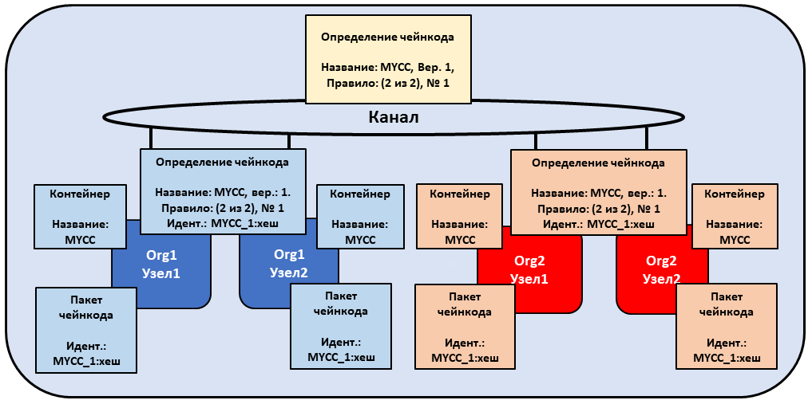

*После определения чейнкода MYCC в канале, организации Org1 И Org2 могут начать использовать этот чейнкод. При первом вызове чейнкода на каждом одноранговом узле запускается контейнер чейнкода.*  

## Обновление чейнкода 

Для обновления чейнкода можно использовать тот же процесс жизненного цикла Fabric, который применяется для установки и запуска чейнкода. Можно обновлять двоичные файлы чейнкода или только правила чейнкода. Для обновления чейнкода предусмотрена следующая процедура:

1. **Упаковка чейнкода:** этот шаг нужно выполнять только в случае обновления двоичных файлов чейнкода.

    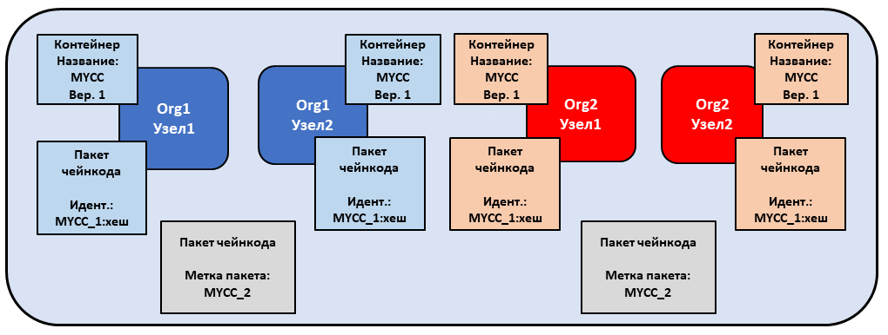

   *Организации Org1 и Org2 обновляют двоичные файлы чейнкода и переупаковывают чейнкод. Обе организации используют разные метки пакета.*  

2. **Установка нового пакета чейнкода на одноранговых узлах:** этот шаг также выполняется только в случае обновления двоичных файлов чейнкода.   При установке нового пакета чейнкода генерируется идентификатор пакета, который нужно передать в новое определение чейнкода. Также необходимо изменить версию чейнкода, которая используется процессом жизненного цикла для отслеживания обновлений двоичных файлов чейнкода.

    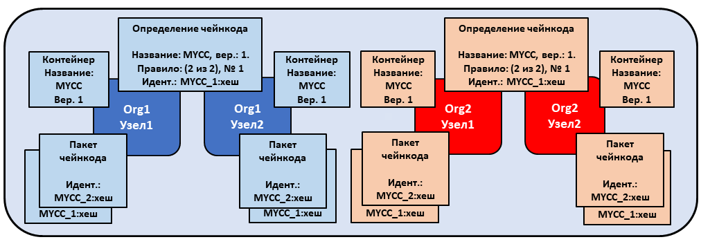

   *Организации Org1 и Org2 устанавливают новый пакет на своих одноранговых узлах. При установке создается новый идентификатор пакета packageID.*  

3. **Утверждение нового определения чейнкода:** при обновлении двоичных файлов чейнкода необходимо обновить версию чейнкода и идентификатор пакета в определении чейнкода. Также можно обновить правила одобрения чейнкода в организации без необходимости переупаковывать двоичные файлы чейнкода. Члены канала просто должны утвердить определение с новыми правилами. В новом определении **порядковый номер** должен быть увеличен на единицу.

    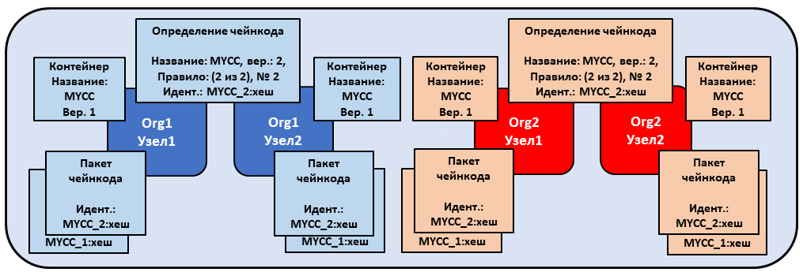

   *Администраторы организаций Org1 и Org2 утверждают новое определение чейнкода для своих организаций. Новое определение ссылается на новый идентификатор пакета packageID и изменяет версию чейнкода. Поскольку это первое обновление чейнкода, порядковый номер увеличивается с одного до двух.*

4. **Запись определения в канал:** после утверждения нового определения чейнкода достаточным количеством участников в канале, одна организация может записать новое определение, чтобы обновить определение чейнкода в канале.   В процессе жизненного цикла не предусматрено отдельной команды обновления.

    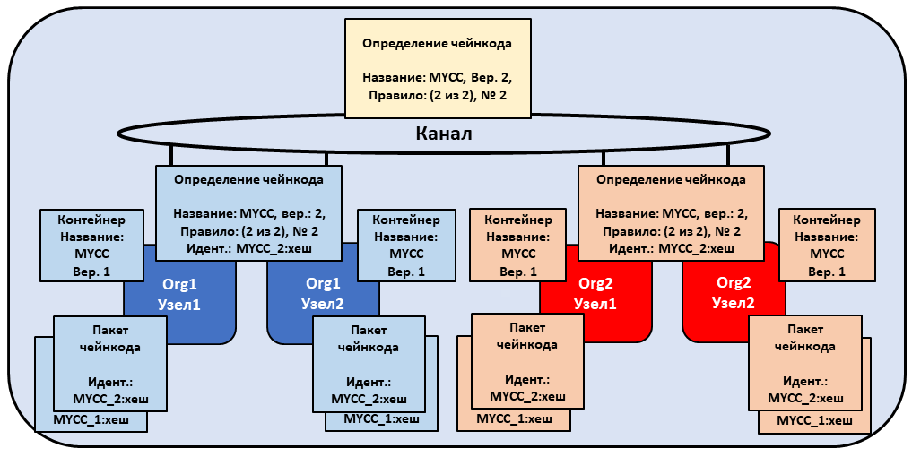

   *Администратор организации Org1 или Org2 записывает новое определение чейнкода в канале.*  

После записи определения чейнкода новый контейнер чейнкода запустится вместе с кодом из обновленных двоичных файлов чейнкода. Если в определении чейнкода указана необходимость выполнения функции ``Init``, то инициализацию обновленного чейнкода следует производить путем вызова функции ``Init`` после того, как новое определение будет успешно записано в канале. В случае обновления определения чейнкода без изменения версии чейнкода, контейнер чейнкода останется прежним, и функцию ``Init`` вызывать не нужно.

  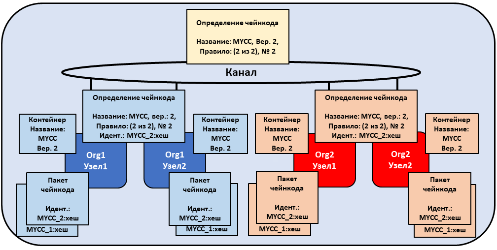 

 *Как только новое определение будет записано в канале, на всех одноранговых узлах автоматически запустится новый контейнер чейнкода.*

Жизненный цикл чейнкода Fabric использует **порядковый номер* * в определении чейнкода для отслеживания обновлений. Всем участникам канала необходимо увеличить порядковый номер на единицу и утвердить новое определение для обновления чейнкода. Версия используется для отслеживания обновлений двоичных файлов чейнккода. Ее следует изменять только при обновлении двоичных файлов чейнкода.

## Сценарии развертывания 

Следующие примеры иллюстрируют, как можно использовать жизненный цикл чейнкода Fabric для управления каналами и чейнкодом.

### Присоединение к каналу 

Новая организация может присоединиться к каналу с уже определенным чейнкодом, а также начать использовать чейнкод после установки пакета чейнкода и утверждения определения чейнкода, которое уже записано в канале.

  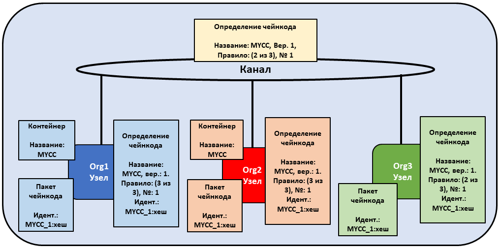

*Организация Org3 присоединяется к каналу и утверждает то же определение чейнкода, которое ранее было записано в канал организациями Org1 и Org2.*

Утвердив определение чейнкода, организация может начать использовать чейнкод после установки пакета на своих одноранговых узлах. Определение не нужно повторно записывать. Если в правилах одобрения используются правила по умолчанию, которые требуют одобрения от большинства участников канала, то правила одобрения будут обновлены ​автоматически, чтобы включить новую организацию.

  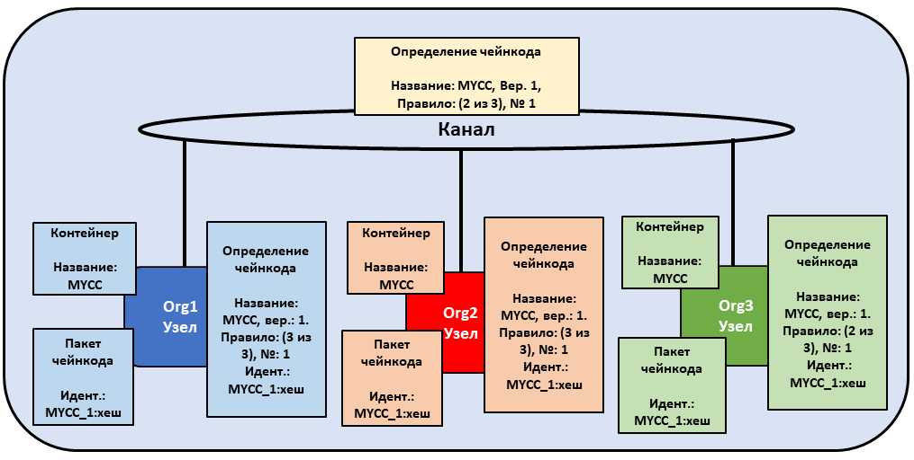

*Контейнер чейнкода запустится после первого вызова чейнкода на узле организации Org3.*

### Обновление правил одобрения

Определение чейнкода можно использовать для обновления правил одобрения без переупаковки или переустановки чейнкода. Члены канала могут утвердить определение чейнкода с новыми правилами одобрения и записать это определение в канале.

  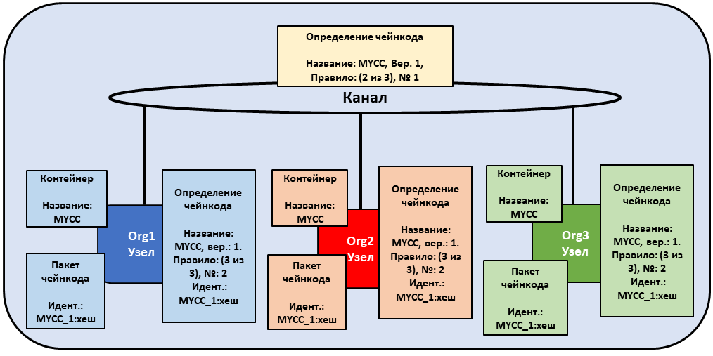

*Организации Org1, Org2 и Org3 утверждают новые правила одобрения, согласно которым все три организации должны одобрять транзакции. Порядковый номер определения увеличивается с одного до двух, а версия чейнкода остается неизменной.*

Новые правила одобрения вступают в силу после того, как новое определение будет записано в канале. Членам канала не нужно повторно запускать контейнер чейнкода, вызывая чейнкод или выполняя функцию `Init` для обновления правил одобрения.

  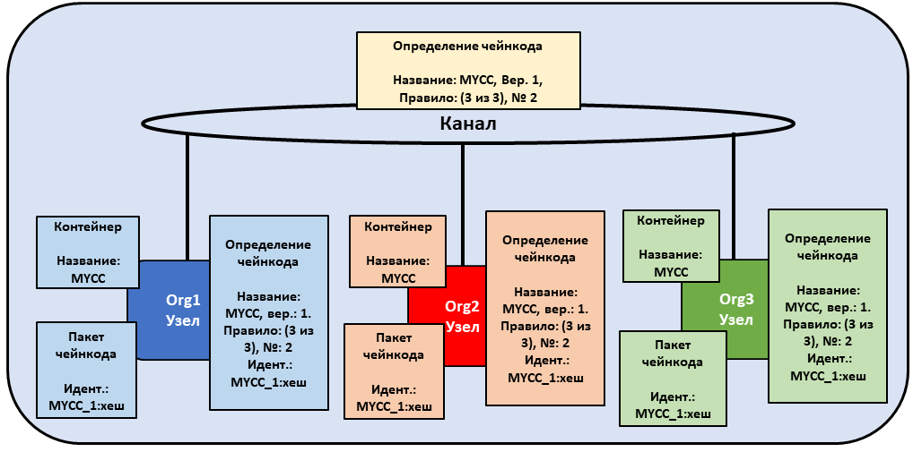

*Одна организация записывает новое определение чейнкода в канал для обновления правил одобрения.*

### Утверждение определения без установки чейнкода

Утвердить определение чейнкода возможно без установки пакета чейнкода. Это позволяет одобрить определение чейнкода перед тем, как оно будет записано в канале, даже если нет необходимости использовать чейнкод для одобрения транзакций или запросов к реестру. Для этого необходимо указать параметры, указанные другими члены канала, и идентификатор пакет packageID не обязательно включать в определение чейнкода.

  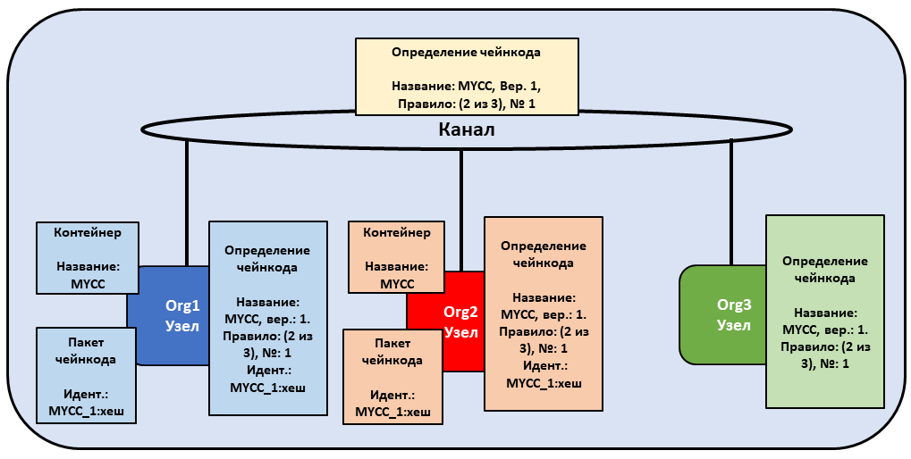 

*Организация Org3 не устанавливает пакет чейнкода. Поэтому организации не нужно указывать идентификатор пакета в определении чейнкода. Однако организация Org3 по-прежнему может одобрить определение чейнкода MYCC, которое было записано в канале.*

### Одна из организаций не согласна с определением чейнкода 

Организация, которая не одобряет записанное в канале определение чейнкода, не может использовать этот чейнкод. Организации, которые либо не одобрили определение чейнкода, либо одобрили другое определение чейнкода, не могут выполнять чейнкод на своих одноранговых узлах.

  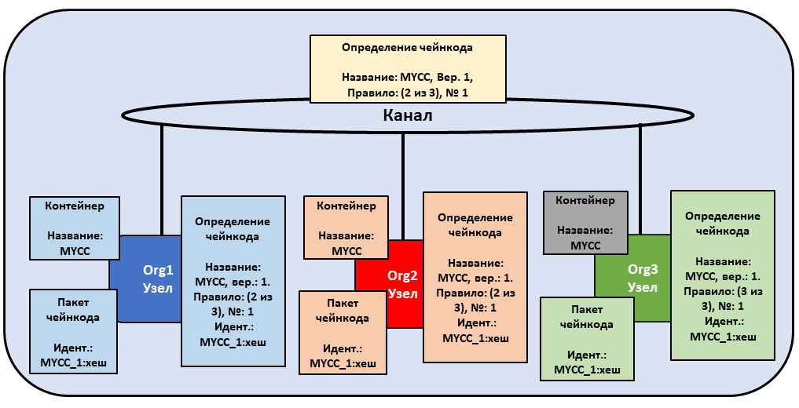

*Организация Org3 утверждает определение чейнкода с другими правилами одобрения, чем утвержденные организациями Org1 и Org2. В результате организация Org3 не может использовать чейнкод MYCC в канале. Однако организации Org1 или Org2 все еще могут получить достаточно одобрений, чтобы записать определение в канал и использовать этот чейнкод. Транзакции, сгенерированные чейнкодом, будут по-прежнему добавляться в реестр и сохраняться на одноранговых узлах организации Org3. Тем не менее, организация Org3 не сможет одобрять транзакции.*

Организация может одобрить новое определение чейнкода с любым порядковым номером или версией. Это позволяет одобрить записанное в канале определение и сразу же начать использовать чейнкод. Также можно утвердить новое определение чейнкода, чтобы исправить любые ошибки, допущенные в процессе утверждения или упаковки чейнкода.

### Канал не согласен с определением чейнкода

Если организации в канале не согласны с определением чейнкода, определение не может быть записано в канале. В таком случае ни один из участников канала не сможет использовать чейнкод.

  

*Организации Org1, Org2 и Org3 утверждают разные определения чейнкода. В результате ни один член канала не может получить достаточно одобрений, чтобы записать определение чейнкода в канале. Ни один участник канала не сможет использовать чейнкод.*

### Организации устанавливают разные пакеты чейнкода

Каждая организация может использовать свой идентификатор пакета при утверждении определения чейнкода. Это позволяет участникам канала устанавливать разные двоичные файлы чейнкода, которые используют одни и ту же правила одобрения, а также считывать и записывать данные в одном и том же пространстве имен чейнкода.

Организации могут использовать эту возможность для установки смарт-контрактов с собственной бизнес-логикой. Смарт-контракт каждой организации может содержать дополнительную проверку, требуемую организацией перед тем, как транзакция будет одобрена одноранговыми узлами. Каждая организация также может написать код, который помогает интегрировать смарт-контракт с данными из существующих систем организации.

  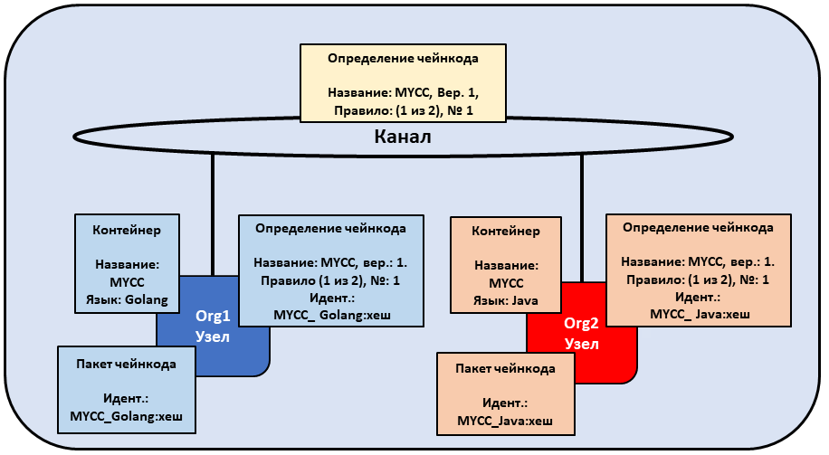 

*Организации Org1 и Org2 устанавливают собственные версии чейнкода MYCC, содержащие разную бизнес-логику.* 

### Создание нескольких чейнкодов с помощью одного пакета

Один пакет чейнкода можно использовать для создания нескольких экземпляров чейнкода в канале путем утверждения и записи нескольких определений чейнкода. Каждое определение должно иметь уникальное название чейнкода. Это позволяет запускать несколько экземпляров смарт-контракта в канале, но при этом к смарт-контракту будут применяться разные правила одобрения.

  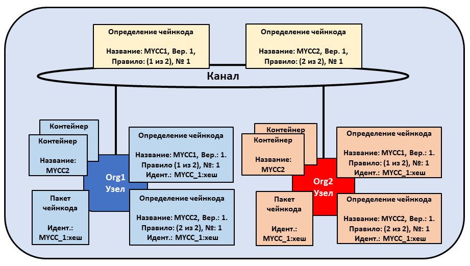

*Организации Org1 и Org2 используют пакет чейнкода MYCC_1 для утверждения и записи двух разных определений чейнкода. В результате обе органиназации имеют два контейнера с чейнкодом, работающие на их узлах. Одобрение чейнкода MYCC1 происходит согласно правилу «1 из 2», а одобрение чейнкода MYCC2 — согласно правилу «2 из 2».*

 ## Переход на новую версию жизненного цикла Fabric

Для получения информации о переходе на новую версию жизненного цикла ознакомьтесь с разделом [Рекомендации по переходу на версию v2.0](./upgrade_to_newest_version.html#chaincode-lifecycle).

В случае необходимости обновления конфигурации каналов для включения новой версии жизненного цикла ознакомьтесь с разделом [Включение новой версии жизненного цикла чейнкода](./enable_cc_lifecycle.html).

## Дополнительная информация 

В видео ниже рассказано для чего предназначена новая версия жизненного цикла чейнкода Fabric, а также о том, как он реализуется.

<iframe class="embed-responsive-item" id="youtubeplayer2" title="Видео базового пакета" type="text/html" width="560" height="315" src="https://www.youtube.com/embed/XvEMDScFU2M" frameborder="0" webkitallowfullscreen mozallowfullscreen allowfullscreen> </iframe>

<!--- Licensed under Creative Commons Attribution 4.0 International License
https://creativecommons.org/licenses/by/4.0/ -->
