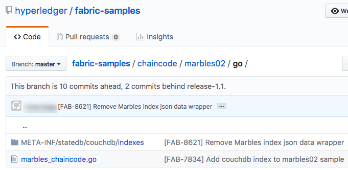

Использование базы данных CouchDB
=================================

В этом учебном руководстве описывается использование CouchDB в качестве базы данных состояний для сетей Hyperledger Fabric. Прежде чем приступить к изучению этого раздела, следует ознакомиться с базовыми принципами работы сетей Fabric, а также рассмотреть другие примеры и учебные руководства.

.. note:: В этом руководстве используется новый жизненный цикл чейнкода Fabric, добавленный в версии 2.0. Если для использования индексов с чейнкодом требуется предыдущая модель жизненного цикла, смотрите раздел «Использование CouchDB <https://hyperledger-fabric.readthedocs.io/en/release-1.4/couchdb_tutorial.html>`__ для версии 1.4.

Это руководство состоит из следующих подразделов:

#. :ref:`cdb-enable-couch`
#. :ref:`cdb-create-index`
#. :ref:`cdb-add-index`
#. :ref:`cdb-install-deploy`
#. :ref:`cdb-query`
#. :ref:`cdb-best`
#. :ref:`cdb-pagination`
#. :ref:`cdb-update-index`
#. :ref:`cdb-delete-index`

Для более глубокого понимания работы с базами данных CouchDB смотрите раздел :doc:`couchdb_as_state_database`. Больше информации о реестре Fabric приводится в разделе `Реестр <ledger/ledger.html>`_. В этом разделе приводится подробная информация о том, как использовать базы данных CouchDB в блокчейн-сети.

В этом учебном руководстве используется `пример Marbles <https://github.com/hyperledger/fabric-samples/blob/{BRANCH}/chaincode/marbles02/go/marbles_chaincode.go>`__, который развертывается в примерах для сети Fabric, где демонстрируется использование базы данных CouchDB. Перед тем как приступить к изучению, следует выполнить шаги, описанные в разделе :doc:`install`.

Преимущества CouchDB?
~~~~~~~~~~~~~~~~~~~~~

В сетях Fabric возможно использование двух типов баз данных на одноранговых узлах. По умолчанию базой данных является LevelDB, встроенная в процессы одноранговых узлов. Данные чейнкода хранятся в базе данных LevelDB в виде простых пар ключей и значений, при этом поддерживаются только запросы ключей, диапазонов ключей и составных ключей. В качестве альтернативного варианта базы данных состояний можно использовать CouchDB. Эта база данных позволяет моделировать данные реестра в формате JSON и использовать расширенные запросы значений данных, вместо ключей. CouchDB также позволяет развертывать индексы вместе с чейнкодом, делая запросы более эффективными с возможностью обработки больших наборов данных.

Чтобы использовать преимущества CouchDB, а именно запросы с помощью JSON, данные должны быть смоделированы в формате JSON. Пользователю предоставляется возможность выбора базы данных (LevelDB или CouchDB) перед тем, как запустить сеть. Переключение одноранговых узлов с LevelDB на CouchDB не поддерживается из-за проблем совместимости данных. Все одноранговые узлы в сети должны использовать базы данных одного типа. При использовании JSON вместе с данными в двоичном формате, можно по-прежнему использовать CouchDB, однако в таком случае двоичные значения будут запрашиваться только по ключу, диапазону ключей и составным ключам.

.. _cdb-enable-couch:

Как включить CouchDB в Hyperledger Fabric
~~~~~~~~~~~~~~~~~~~~~~~~~~~~~~~~~~~~~~~~~

CouchDB выполняется отдельным процессом базы данных наряду с одноранговыми узлами. Эта база данных имеет некоторые особенности настройки, управления и использования. Существует образ Docker `базы данных CouchDB <https://hub.docker.com/_/couchdb/>`__, который рекомендуется запускать на одном сервере вместе с одноранговым узлом. Для каждого однорангового узла следует настроить по одному контейнеру CouchDB, а затем обновить контейнеры одноранговых узлов, указав контейнер CouchDB в конфигурации ``core.yaml`. Файл ``core.yaml`` должен располагаться в каталоге, указанном в переменной среды FABRIC_CFG_PATH:

* В случае развертывания образов Docker, файл ``core.yaml`` уже предварительно сконфигурирован и расположен в каталоге ``FABRIC_CFG_PATH`` контейнера однорангового узла. Однако при использовании сред Docker переменные среды обычно задаются изменением ``docker-compose-couch.yaml``, переопределяя файл ``core.yaml``.

* Для двоичных развертываний ``core.yaml`` входит в комплект распространения артефакта.

Перейдите к разделу ``stateDatabase`` файла ``core.yaml``. Укажите ``CouchDB`` в качестве базы данных состояний ``stateDatabase`` и заполните соответствующие параметры ``couchDBConfig``. Дополнительная информация о настройке CouchDB приведена в разделе <couchdb_as_state_database.html#couchdb-configuration>`__.

.. _cdb-create-index:

Создание индекса
~~~~~~~~~~~~~~~~

Почему индексы так важны?

Индексы позволяют обращаться к базе данных без необходимости изучения каждой строки каждого запроса, делая их быстрее и эффективнее. Как правило, индексы предусмотрены для часто используемых запросов и позволяют более эффективно запрашивать данные. Индексы не требуются, чтобы использовать основное преимущество CouchDB — способность выполнять расширенные запросы данных в формате JSON, однако мы настоятельно рекомендуем использовать индексы для увеличения производительности. Также, если при запросе требуется сортировка, CouchDB требует указать индекс отсортированных полей.

.. note::

   Расширенные запросы будут работать без индекса, однако будет появляться предупреждение в журнале CouchDB о том, что индекс не найден. В то же время, при наличии спецификации сортировки в запросе для поля, по которому делается сортировка, требуется индекс. В противном случае запрос будет неудачным и завершится с ошибкой.

Для демонстрации создания индекса воспользуемся данными из `примера Marbles <https://github.com/hyperledger/fabric-samples/blob/{BRANCH}/chaincode/marbles02/go/marbles_chaincode.go>`__. В этом примере применяется следующая структура данных Marbles:

.. code:: javascript

  type marble struct {
	   ObjectType string `json:"docType"` // docType используется для указания различных типов объектов в базе данных состояний
	   Name       string `json:"name"`    // теги field применяются для контроля строчных и заглавных букв
	   Color      string `json:"color"`
           Size       int    `json:"size"`
           Owner      string `json:"owner"`
  }

В этой структуре свойства (``docType``, ``name``, ``color``, ``size``, ``owner``) определяют данные в реестре, связанные с активом. Свойство ``docType`` является шаблоном, используемым в чейнкоде для указания различных типов данных, которые необходимо запрашивать по отдельности. При использовании CouchDB рекомендуется использовать свойство ``docType`` для указания типа документа в пространстве имен чейнкода (каждый чейнкод представлен в качестве отдельной базы данных CouchDB, то есть каждый чейнкод имеет собственное пространство имен для ключей).

В контексте структуры данных Marbles ``docType`` используется для определения того, что этот документ или актив является активом типа Marble, так как база данных чейнкода может потенциально содержать другие документы или активы. Поиск по документам в базе данных возможен с использование всех значений свойств.

Определение каждого индекса для использования в запросах к чейнкоду следует указывать в отдельном текстовом файле с расширением `*.json`, причем определение индекса должно соответствовать формату индексов CouchDB в JSON.

Для определения индекса требуется следующая информация:

  * `fields`: часто запрашиваемые поля;
  * `name`: название индекса;
  * `type`: всегда JSON в случае с CouchDB.

Рассмотрим простой индекс под названием ``foo-index`` для поля под названием ``foo``.

.. code:: json

    {
        "index": {
            "fields": ["foo"]
        },
        "name" : "foo-index",
        "type" : "json"
    }

Также, определение индекса может содержать свойство дизайн-документа ``ddoc``. `Дизайн-документ <http://guide.couchdb.org/draft/design.html>`__ является структурой CouchDB, предназначенной для хранения индексов. Индексы можно группировать в дизайн-документы для удобства, однако для CouchDB рекомендуется использовать по одному индексу на дизайн-документ.

.. tip:: При определении индекса рекомендуется указывать свойство ``ddoc``, а также значение вместе с названием индекса. Важно включить это свойство для возможности обновления индекса позже. Также это свойство позволяет явно указать, какой индекс использовать в запросе.

Ниже показан еще один пример определения индекса из образца Marbles с названием ``indexOwner``, который включает поля ``docType`` и ``owner``, а также свойство ``ddoc``:

.. _indexExample:

.. code:: json

  {
    "index":{
        "fields":["docType","owner"] // Имена полей запроса
    },
    "ddoc":"indexOwnerDoc", // (Необязательно) имя дизайн-документа, в котором будет храниться индекс.
    "name":"indexOwner",
    "type":"json"
  }

В приведенном выше примере дизайн-документ ``indexOwnerDoc`` будет автоматически создан при развертывании индекса. Индекс может быть создан с одним или несколькими свойствами, указанными в списке полей, при этом может быть указан любой набор свойств. Одно и то же свойство можно указывать в нескольких индексах для одного docType. В следующем примере индекс ``index1`` включает только одно свойство ``owner``, ``index2`` содержит свойства ``owner и color``, а ``index3`` включает свойства ``owner, color и size``. Кроме того, каждое определение индекса должно иметь свое значение ``ddoc`` согласно рекомендуемой практике CouchDB.

.. code:: json

  {
    "index":{
        "fields":["owner"] // Имена полей запроса
    },
    "ddoc":"index1Doc", // (Необязательно) имя дизайн-документа, в котором будет храниться индекс
    "name":"index1",
    "type":"json"
  }

  {
    "index":{
        "fields":["owner", "color"] // Имена полей запроса
    },
    "ddoc":"index2Doc", // (Необязательно) имя дизайн-документа, в котором будет храниться индекс
    "name":"index2",
    "type":"json"
  }

  {
    "index":{
        "fields":["owner", "color", "size"] // Имена полей запроса
    },
    "ddoc":"index3Doc", // (Необязательно) имя дизайн-документа, в котором будет храниться индекс
    "name":"index3",
    "type":"json"
  }

Как правило, поля индексов моделируются таким образом, чтобы они соответствовали полям, которые будут использоваться в фильтрах и сортировках запроса. Для получения более подробной информации о создании индексов в формате JSON смотрите `Документацию CouchDB <http://docs.couchdb.org/en/latest/api/database/find.html#db-index>`__.

Напоследок, Fabric самостоятельно выполняет индексирование документов в базе данных с использованием шаблона, называемого ``прогрев индексов`` (index warming). CouchDB обычно не индексирует новые или обновленные документы до следующего запроса. Fabric гарантирует, что индексы остаются в «прогретом состоянии», запрашивая обновление индекса после каждой операции записи данных. Это обеспечивает быстроту запросов, так как устраняется необходимость индексирования документов перед запуском запроса. Этот процесс поддерживает актуальность индекса, обновляя его при добавлении новых записей в базу данных состояний.

.. _cdb-add-index:

Добавление индекса в каталог чейнкода
~~~~~~~~~~~~~~~~~~~~~~~~~~~~~~~~~~~~~

После создания индекса необходимо упаковать его вместе с чейнкодом для развертывания, поместив индекс в соответствующий каталог метаданных. Для установки чейнкода воспользуйтесь командой :doc:`commands/peerlifecycle`. Файлы индекса в формате JSON должны быть расположены в каталоге ``META-INF/statedb/couchdb/indexes``, который расположен внутри каталога чейнкода.

В примере `Marbles <https://github.com/hyperledger/fabric-samples/tree/{BRANCH}/chaincode/marbles02/go>`__ ниже показано, как упаковать индекс с чейнкодом.

В этом примере используется один индекс с названием indexOwnerDoc:

.. code:: json

  {"index":{"fields":["docType","owner"]},"ddoc":"indexOwnerDoc", "name":"indexOwner","type":"json"}

Запуск сети
-----------

:guilabel:`Пробуем на практике`

Далее мы запустим пример сети Fabric и используем ее для развертывания чейнкода Marbles. Используйте следующую команду для перехода к подкаталогу `test-network` каталога примеров Fabric:

.. code:: bash

    cd fabric-samples/test-network

В рамках этого учебного примера будем использовать известное начальное состояние. Следующая команда удалит любые активные или устаревшие контейнеры Docker, а также ранее созданные артефакты.

.. code:: bash

    ./network.sh down

В случае первого выполнения команд из этого учебного руководства следует установить зависимости чейнкода, прежде чем развернуть его в сети. Выполните следующие команды:

.. code:: bash

    cd ../chaincode/marbles02/go
    GO111MODULE=on go mod vendor
    cd ../../../test-network

Выполните следующую команду из каталога `test-network` для развертывания базы данных CouchDB в сети.

.. code:: bash

    ./network.sh up createChannel -s couchdb

Эта команда создаст два одноранговых узла Fabric, которые используют CouchDB в качестве базы данных состояний. Также будет создан один упорядочивающий узел и один канал с именем ``mychannel``.

.. _cdb-install-deploy:

Установка и определение чейнкода
~~~~~~~~~~~~~~~~~~~~~~~~~~~~~~~~

Клиентские приложения взаимодействуют с реестром блокчейн с помощью чейнкода. Поэтому пакет чейнкода необходимо установить на каждом одноранговом узле, который будет выполнять и одобрять транзакции. Чтобы иметь возможность взаимодействовать с чейнкодом в канале, участники канала должны утвердить определение чейнкода, которое описывает правила управления чейнкодом. В предыдущем разделе было продемонстрировано, как добавить индекс в каталог чейнкода для развертывания индекса вместе с чейнкодом.

Перед установкой на одноранговых узлах чейнкод следует упаковать. Можно воспользоваться командой `peer lifecycle chaincode package <commands/peerlifecycle.html#peer-lifecycle-chaincode-package>`__ для упаковки чейнкода marbles.

:guilabel:`Пробуем на практике`

1. После запуска сети скопируйте и вставьте следующие переменные среды в интерфейс командной строки для взаимодействия с сетью от имени администратора организации Org1. Убедитесь, что вы находитесь в каталоге `test-network`.

.. code:: bash

    export PATH=${PWD}/../bin:$PATH
    export FABRIC_CFG_PATH=${PWD}/../config/
    export CORE_PEER_TLS_ENABLED=true
    export CORE_PEER_LOCALMSPID="Org1MSP"
    export CORE_PEER_TLS_ROOTCERT_FILE=${PWD}/organizations/peerOrganizations/org1.example.com/peers/peer0.org1.example.com/tls/ca.crt
    export CORE_PEER_MSPCONFIGPATH=${PWD}/organizations/peerOrganizations/org1.example.com/users/Admin@org1.example.com/msp
    export CORE_PEER_ADDRESS=localhost:7051

2. Используйте следующую команду для упаковки чейнкода marbles.

.. code:: bash

    peer lifecycle chaincode package marbles.tar.gz --path ../chaincode/marbles02/go --lang golang --label marbles_1

Эта команда создаст пакет чейнкода с именем marbles.tar.gz.

3. Используйте следующую команду для установки пакета чейнкода на одноранговом узле ``peer0.org1.example.com``.

.. code:: bash

    peer lifecycle chaincode install marblesp.tar.gz

При успешном завершении команды установки будет возвращен идентификатор чейнкода с аналогичным результатом:

.. code:: bash

    2019-04-22 18:47:38.312 UTC [cli.lifecycle.chaincode] submitInstallProposal -> INFO 001 Installed remotely: response:<status:200 payload:"\nJmarbles_1:0907c1f3d3574afca69946e1b6132691d58c2f5c5703df7fc3b692861e92ecd3\022\tmarbles_1" >
    2019-04-22 18:47:38.312 UTC [cli.lifecycle.chaincode] submitInstallProposal -> INFO 002 Chaincode code package identifier: marbles_1:0907c1f3d3574afca69946e1b6132691d58c2f5c5703df7fc3b692861e92ecd3

После установки пакета чейнкода на одноранговом узле ``peer0.org1.example.com`` необходимо утвердить определение чейнкода в рамках организации Org1.

4. Используйте следующую команду для обращения к одноранговому узлу, чтобы получить идентификатор пакета установленного чейнкода.

.. code:: bash

    peer lifecycle chaincode queryinstalled

Эта команда возвращает такой же идентификатор пакета, как и команда установки. В терминале должно появиться похожее сообщение:

.. code:: bash

    Установленные чейнкоды на одноранговом узле:
    Package ID: marbles_1:60ec9430b221140a45b96b4927d1c3af736c1451f8d432e2a869bdbf417f9787, Label: marbles_1

5. Укажите идентификатор пакета в качестве переменной среды. Вставьте идентификатор пакета marbles_1, возвращенный командой ``peer lifecycle chaincode queryinstalled``, в указанную ниже команду. Идентификатор пакета будет отличаться для разных пользователей, поэтому нужно выполнить этот шаг, используя идентификатор пакета из консоли.

.. code:: bash

    export CC_PACKAGE_ID=marbles_1:60ec9430b221140a45b96b4927d1c3af736c1451f8d432e2a869bdbf417f9787

6. Используйте следующую команду для одобрения определения чейнкода marbles от имени организации Org1.

.. code:: bash

    export ORDERER_CA=${PWD}/organizations/ordererOrganizations/example.com/orderers/orderer.example.com/msp/tlscacerts/tlsca.example.com-cert.pem
    peer lifecycle chaincode approveformyorg -o localhost:7050 --ordererTLSHostnameOverride orderer.example.com --channelID mychannel --name marbles --version 1.0 --signature-policy "OR('Org1MSP.member','Org2MSP.member')" --init-required --package-id $CC_PACKAGE_ID --sequence 1 --tls --cafile $ORDERER_CA

При успешном завершении команды отобразиться сообщение, аналогичное следующему:

.. code:: bash

    2020-01-07 16:24:20.886 EST [chaincodeCmd] ClientWait -> INFO 001 txid [560cb830efa1272c85d2f41a473483a25f3b12715d55e22a69d55abc46581415] committed with status (VALID) at

Для утверждения определения чейнкода, прежде чем оно может быть успешно записано в канале, требуется согласие большинства организаций. Однако определение чейнкода должно быть еще одобрено на уровне организации Org2. Поскольку организации Org2 не требуется одобрять чейнкод и пакет чейнкода не устанавливался на ее одноранговых узлах, packageID не нужно указывать в определении чейнкода.

7. Далее воспользуемся интерфейсом командной строки от имени администратора Org2. Скопируйте и вставьте следующий блок команд в контейнер однорангового узла и выполните их все сразу:

.. code:: bash

    export CORE_PEER_LOCALMSPID="Org2MSP"
    export CORE_PEER_TLS_ROOTCERT_FILE=${PWD}/organizations/peerOrganizations/org2.example.com/peers/peer0.org2.example.com/tls/ca.crt
    export CORE_PEER_MSPCONFIGPATH=${PWD}/organizations/peerOrganizations/org2.example.com/users/Admin@org2.example.com/msp
    export CORE_PEER_ADDRESS=localhost:9051

8. После этого можно одобрить определение чейнкода от лица организации Org2.

.. code:: bash

    peer lifecycle chaincode approveformyorg -o localhost:7050 --ordererTLSHostnameOverride orderer.example.com --channelID mychannel --name marbles --version 1.0 --signature-policy "OR('Org1MSP.member','Org2MSP.member')" --init-required --sequence 1 --tls --cafile $ORDERER_CA

9. Теперь можно записать определение чейнкода в канале с помощью команды `peer lifecycle chaincode commit <commands/peerlifecycle.html#peer-lifecycle-chaincode-commit>`__.

.. code:: bash

    export ORDERER_CA=${PWD}/organizations/ordererOrganizations/example.com/orderers/orderer.example.com/msp/tlscacerts/tlsca.example.com-cert.pem
    export ORG1_CA=${PWD}/organizations/peerOrganizations/org1.example.com/peers/peer0.org1.example.com/tls/ca.crt
    export ORG2_CA=${PWD}/organizations/peerOrganizations/org2.example.com/peers/peer0.org2.example.com/tls/ca.crt
    peer lifecycle chaincode commit -o localhost:7050 --ordererTLSHostnameOverride orderer.example.com --channelID mychannel --name marbles --version 1.0 --sequence 1 --signature-policy "OR('Org1MSP.member','Org2MSP.member')" --init-required --tls --cafile $ORDERER_CA --peerAddresses localhost:7051 --tlsRootCertFiles $ORG1_CA --peerAddresses localhost:9051 --tlsRootCertFiles $ORG2_CA

При успешном завершении команды отобразиться сообщение, аналогичное следующему:

.. code:: bash

    2019-04-22 18:57:34.274 UTC [chaincodeCmd] ClientWait -> INFO 001 txid [3da8b0bb8e128b5e1b6e4884359b5583dff823fce2624f975c69df6bce614614] committed with status (VALID) at peer0.org2.example.com:9051
    2019-04-22 18:57:34.709 UTC [chaincodeCmd] ClientWait -> INFO 002 txid [3da8b0bb8e128b5e1b6e4884359b5583dff823fce2624f975c69df6bce614614] committed with status (VALID) at peer0.org1.example.com:7051

10. Так как чейнкод marbles содержит функцию инициализации, следует использовать команду `peer chaincode invoke <commands/peerchaincode.html?%20chaincode%20instantiate#peer-chaincode-invoke>`__ для вызова функции ``Init()``, прежде чем будет можно использовать другие функции чейнкода.

.. code:: bash

    peer chaincode invoke -o localhost:7050 --ordererTLSHostnameOverride orderer.example.com --channelID mychannel --name marbles --isInit --tls --cafile $ORDERER_CA --peerAddresses localhost:7051 --tlsRootCertFiles $ORG1_CA -c '{"Args":["Init"]}'

Проверка успешного развертывания индекса
----------------------------------------

Индексы будут развернуты для каждой базы данных состояний CouchDB после установки чейнкода на одноранговом узле и развертывания в канале. Для проверки успешного создания индекса CouchDB посмотрите журнал однорангового узла в контейнере Docker.

:guilabel:`Пробуем на практике`

Чтобы просмотреть журнал контейнера Docker однорангового узла, откройте новое окно терминала и запустите следующую команду, которая вернет подтверждение успешного создания индекса.

::

   docker logs peer0.org1.example.com  2>&1 | grep "CouchDB index"

В консоли должно появиться похожее сообщение:

::

   [couchdb] CreateIndex -> INFO 0be Created CouchDB index [indexOwner] in state database [mychannel_marbles] using design document [_design/indexOwnerDoc]

.. note:: Если Marbles установлен на одноранговом узле, отличном от ``peer0.org1.example.com``, возможно, потребуется заменить имя этого узла на имя узла, на котором установлен Marbles.

.. _cdb-query:

Запрос к базе данных состояний CouchDB
~~~~~~~~~~~~~~~~~~~~~~~~~~~~~~~~~~~~~~

После определения индекса в файле JSON и развертывания вместе с чейнкодом, функции чейнкода могут выполнять JSON-запросы к базе данных состояний CouchDB, а также команды одноранговых узлов для вызова функций чейнкода.

Название индекса не обязательно указывать в запросе. Если название не указано и существует индекс для запрашиваемых полей, будет автоматически использован существующий индекс.

.. tip:: Рекомендуется явно указывать название индекса в запросе, используя ключевое слово ``use_index`` Без указания названия CouchDB может выбрать менее оптимальный вариант. Также возможна ситуация, в которой CouchDB вообще не воспользуется индексом, что трудно отследить при маленьких объемах данных во время тестирования. Только при больших объемах данных можно легко заметить разницу в скорости выполнения запроса, если CouchDB не использует индекс.

Создание запроса в чейнкоде
---------------------------

С помощью определенных в чейнкоде запросов можно выполнять расширенные запросы данных из реестра. В примере `marbles02 <https://github.com/hyperledger/fabric-samples/blob/{BRANCH}/chaincode/marbles02/go/marbles_chaincode.go>`__ предусмотрены две функции с расширенными запросами:

  * **queryMarbles** --

      Пример **произвольного расширенного запроса** (ad hoc query). В этом типе запроса строка (селектора) может быть передана в функцию. Такие запросы удобно использовать в клиентских приложениях при необходимости динамического создания собственных селекторов во время выполнения. Более подробно о селекторах рассказывается разделе  `Синтаксис селекторов CouchDB <http://docs.couchdb.org/en/latest/api/database/find.html#find-selectors>`__.

  * **queryMarblesByOwner** --

      Пример **параметризованного запроса**, логика которого прописывается в чейнкоде. В этом случае функция принимает один аргумент — владельца объекта marble. Далее из базы данных состояний запрашиваются документы JSON, соответствующие docType «Marble» и указанному идентификатору владельца, используя синтаксис JSON-запросов.

Выполнение запроса с помощью команд одноранговых узлов
------------------------------------------------------

При отсутствии клиентского приложения можно использовать команды одноранговых узлов для тестирования запросов, определенных в чейнкоде. Изменим команду `peer chaincode query <commands/peerchaincode.html?%20chaincode%20query#peer-chaincode-query>`__ для использования индекса Marbles ``indexOwner`` для запроса всех объектов marbles, принадлежащих владельцу "tom" с помощью функции ``queryMarbles``.

:guilabel:`Пробуем на практике`

Перед запросом к базе данных следует добавить некоторые данные. Запустите следующую команду от имени организации Org1, чтобы создать объект marble, принадлежащий владельцу "tom":

.. code:: bash

    export CORE_PEER_LOCALMSPID="Org1MSP"
    export CORE_PEER_TLS_ROOTCERT_FILE=${PWD}/organizations/peerOrganizations/org1.example.com/peers/peer0.org1.example.com/tls/ca.crt
    export CORE_PEER_MSPCONFIGPATH=${PWD}/organizations/peerOrganizations/org1.example.com/users/Admin@org1.example.com/msp
    export CORE_PEER_ADDRESS=localhost:7051
    peer chaincode invoke -o localhost:7050 --ordererTLSHostnameOverride orderer.example.com --tls --cafile ${PWD}/organizations/ordererOrganizations/example.com/orderers/orderer.example.com/msp/tlscacerts/tlsca.example.com-cert.pem -C mychannel -n marbles -c '{"Args":["initMarble","marble1","blue","35","tom"]}'

После развертывания индекса при инициализации чейнкода, он будет автоматически использоваться в запросах чейнкода. CouchDB автоматически определяет, какой индекс использовать в зависимости от запрашиваемых полей. Будет использоваться тот индекс, который максимально соответствует критериям запроса. Однако рекомендуется в запросе указывать ключевое слово ``use_index``. В приведенной ниже команде одноранговых узлов явно указывается индекс в синтаксисе селектора через ключевое слово ``use_index``:

.. code:: bash

   // Расширенный запрос с явно указанным названием индекса:
   peer chaincode query -C mychannel -n marbles -c '{"Args":["queryMarbles", "{\"selector\":{\"docType\":\"marble\",\"owner\":\"tom\"}, \"use_index\":[\"_design/indexOwnerDoc\", \"indexOwner\"]}"]}'

В команде запроса выше есть три основных аргумента:

*  ``queryMarbles``

  Имя функции в чейнкоде Marbles. Обратите внимание, что для доступа и изменения реестра используется `оболочка <https://godoc.org/github.com/hyperledger/fabric-chaincode-go/shim>`__ ``shim.ChaincodeStubInterface``. Функция ``getQueryResultForQueryString()`` передает строку запроса queryString в функцию перехвата вызова API-интерфейса ``getQueryResult()``.

.. code:: bash

  func (t *SimpleChaincode) queryMarbles(stub shim.ChaincodeStubInterface, args []string) pb.Response {

	  //   0
	  // "queryString"
	   if len(args) < 1 {
		   return shim.Error("Incorrect number of arguments. Expecting 1")
	   }

	   queryString := args[0]

	   queryResults, err := getQueryResultForQueryString(stub, queryString)
	   if err != nil {
		 return shim.Error(err.Error())
	   }
	   return shim.Success(queryResults)
  }

*  ``{"selector":{"docType":"marble","owner":"tom"}``

  Это пример строки **произвольного селектора**, который находит все документы типа ``marble``, в которых свойство ``owner`` имеет значение ``tom``.

*  ``"use_index":["_design/indexOwnerDoc", "indexOwner"]``

  Здесь указывается название дизайн-документа ``indexOwnerDoc`` и индекса ``indexOwner``. В этом примере запрос с селектором явно включает в себя название индекса, указанное с помощью ключевого слова ``use_index``. Согласно определению индекса выше :ref:`cdb-create-index`, он содержит дизайн-документ,``"ddoc":"indexOwnerDoc"``. При использовании CouchDB, если планируется явно указывать название индекса в запросе, определение индекса должно включать в себя значение ``ddoc``, которое в последствии указывается с ключевым словом `` use_index``.

Успешное выполнение запроса с использованием индекса даст следующие результаты:

.. code:: json

  Query Result: [{"Key":"marble1", "Record":{"color":"blue","docType":"marble","name":"marble1","owner":"tom","size":35}}]

.. _cdb-best:

Рекомендации по использованию запросов и индексов
~~~~~~~~~~~~~~~~~~~~~~~~~~~~~~~~~~~~~~~~~~~~~~~~~

Запросы с использованием индексов выполняются быстрее, так как не требуют сканирования все базы данных CouchDB. Понимание принципов работы индексов ускорит выполнение запросов и позволит приложениям обрабатывать большие объемы данных или блоки в сети.

Также важно планировать, какие индексы будут устанавливаться с чейнкодом. Следует устанавливать только ограниченное количество индексов с чейнкодом, которые отвечают критериям большинства запросов. Производительность сети может снизиться в случае добавления большого количества индексов или полей в индексе. Это связано с тем, что индексы обновляются после записи каждого блока. Чем больше индексов необходимо обновить в процессе «разогрева индексов», тем больше времени потребуется для завершения транзакций.

Примеры в этом разделе демонстрируют, каким образом индексы используются в запросах, а также какие запросы будут работать быстрее всего. Помните следующее при написании запросов:

* Для правильной работы индекса все поля индекса должны быть указаны в разделах селектора или сортировки запроса.
* Более сложные запросы работают медленнее и с меньшей вероятностью будут использовать индексы.
* Не следует использовать операторы, которые приводят к полному сканированию таблицы или полному сканированию индекса, например, ``$or``, ``$in`` и ``$regex``.

В предыдущем разделе этого руководства описывался следующий запрос к чейнкоду marbles:

.. code:: bash

  // Пример один: запрос полностью поддерживается индексом
  export CHANNEL_NAME=mychannel
  peer chaincode query -C $CHANNEL_NAME -n marbles -c '{"Args":["queryMarbles", "{\"selector\":{\"docType\":\"marble\",\"owner\":\"tom\"}, \"use_index\":[\"indexOwnerDoc\", \"indexOwner\"]}"]}'

Чейнкод marbles был установлен с индексом ``indexOwnerDoc``:

.. code:: json

  {"index":{"fields":["docType","owner"]},"ddoc":"indexOwnerDoc", "name":"indexOwner","type":"json"}

Обратите внимание, что поля ``doctype`` и ``owner`` в запросе также включены в индекс, что делает запрос полностью поддерживаемым. В результате этот запрос может использовать данные в индексе, без необходимости сканирования всей базы данных. Аналогичные полностью поддерживаемые запросы работают быстрее, чем другие запросы чейнкода.

При добавлении дополнительных полей в запрос выше индекс будет по-прежнему использоваться. Однако запрос дополнительно должен отсканировать индексированные данные для дополнительных полей, что увеличит время отклика. Например, приведенный ниже запрос будет использовать индекс, однако его выполнение будет более долгим в сравнении с предыдущим примером.

.. code:: bash

  // Пример два: запрос полностью поддерживается индексом с дополнительными данными
  peer chaincode query -C $CHANNEL_NAME -n marbles -c '{"Args":["queryMarbles", "{\"selector\":{\"docType\":\"marble\",\"owner\":\"tom\",\"color\":\"red\"}, \"use_index\":[\"/indexOwnerDoc\", \"indexOwner\"]}"]}'

Запрос, который не включает в себя все поля индекса, сканирует всю базу данных. Например, запрос ниже ищет владельца без указания типа объекта. Поскольку ownerIndexDoc содержит поля ``owner`` и ``docType``, этот запрос не сможет использовать индекс.

.. code:: bash

  // Пример три: запрос не поддерживается индексом
  peer chaincode query -C $CHANNEL_NAME -n marbles -c '{"Args":["queryMarbles", "{\"selector\":{\"owner\":\"tom\"}, \"use_index\":[\"indexOwnerDoc\", \"indexOwner\"]}"]}'

Как правило более сложные запросы будут иметь более длительное время отклика и более низкую вероятность поддержки индекса. Использование таких операторов, как ``$or``, ``$in`` и ``$regex``, часто приводит к тому, что запрос будет сканировать весь индекс или не использовать индекс вообще.

Например, запрос ниже содержит оператор ``$or``, что приведет к поиску всех объектов marble и других объектов, принадлежащих владельцу ``tom``.

.. code:: bash

  // Пример четыре: запрос c $or, поддерживаемый индексом
  peer chaincode query -C $CHANNEL_NAME -n marbles -c '{"Args":["queryMarbles", "{\"selector\":{\"$or\":[{\"docType\":\"marble\"},{\"owner\":\"tom\"}]}, \"use_index\":[\"indexOwnerDoc\", \"indexOwner\"]}"]}'

Этот запрос будет использовать индекс, потому что он ищет поля, которые включены в ``indexOwnerDoc``. Однако условие ``$or`` в запросе требует сканирования всех элементов индекса, что замедляет выполнение запроса.

Ниже приведен пример сложного запроса, который не поддерживается индексом.

.. code:: bash

  // Пример пять: запрос c $or, не поддерживаемый индексом
  peer chaincode query -C $CHANNEL_NAME -n marbles -c '{"Args":["queryMarbles", "{\"selector\":{\"$or\":[{\"docType\":\"marble\",\"owner\":\"tom\"},{\"color\":\"yellow\"}]}, \"use_index\":[\"indexOwnerDoc\", \"indexOwner\"]}"]}'

Этот запрос ищет все объекты marble, принадлежащие владельцу ``tom``, а также любые другие объекты с цветом ``yellow``. В этом запросе индекс использоваться не будет, так как для выполнения требования ``$or`` потребуется производить поиск по всей таблице. В зависимости от объема данных в реестре этот запрос займет много времени на выполнение или будет прекращен по истечению срока ожидания.

При создании запросов важно следовать рекомендациям, однако следует помнить, что индексы не являются идеальным решением при сборе большого количества данных. Структура данных блокчейн оптимизирована для проверки и подтверждения транзакций и не подходит для аналитики или отчетности. При необходимости создания панели аналитики и отчетности в рамках приложения или анализа данных из сети рекомендуется осуществлять запросы к базе данных вне сети, которая реплицирует данные, хранящиеся на одноранговых узлах. Это позволит проанализировать данные блокчейн без ухудшения производительности сети или нарушения выполнения транзакций.

Используйте события блока или чейнкода в приложении для записи данных транзакции в базу данных вне сети или передачи данных на аналитику. При получении блока приложение-обработчик блоков просматривает транзакции блоков и добавляет запись в виде ключ/значение в хранилище для каждого действительного набора ``rwset`` транзакции. Служба :doc:`peer_event_services` предоставляет воспроизводимые события для обеспечения целостности данных при последующих сохранениях. Использование обработчика событий для записи данных в базу данных вне сети описано в `Примере хранения данных вне сети <https://github.com/hyperledger/fabric-samples/tree/{BRANCH}/off_chain_data>`__ в разделе примеров Fabric.

.. _cdb-pagination:

Запрос к базе данных состояний CouchDB с разбивкой на страницы
~~~~~~~~~~~~~~~~~~~~~~~~~~~~~~~~~~~~~~~~~~~~~~~~~~~~~~~~~~~~~~

Для случаев возврата больших наборов данных запросами к CouchDB предусмотрен набор функций API-интерфейса, который можно вызвать из чейнкода для разбивки результатов на страницы. Для разбивки на страницы указывается размер страницы ``pagesize`` и точка начала ``bookmark``, указывающая место начала вывода результирующего набора данных. Клиентское приложение итеративно вызывает чейнкод, который выполняет запрос до тех пор, пока не будут возвращены все результаты. Дополнительная информация по этой теме приведена в разделе `Разбивка на страницы при использовании CouchDB <couchdb_as_state_database.html#couchdb-pagination>`__.

Воспользуемся функцией ``queryMarblesWithPagination`` из примера `Marbles <https://github.com/hyperledger/fabric-samples/blob/{BRANCH}/chaincode/marbles02/go/marbles_chaincode.go>`__, чтобы продемонстрировать реализацию разбивки на страницы в чейнкоде и клиентском приложении.

* **queryMarblesWithPagination** --

    Пример **произвольного расширенного запроса с разбивкой на страницы**. В этом типе запроса строка (селектора) может быть передана в функцию так же, как и в предыдущем примере запроса. В этом случае, аргумент ``pageSize`` также включается в запрос вместе с аргументом ``bookmark``.

Для демонстрации разбивки на страницы потребуется больше данных. В этом примере предполагается, что объект marble1 из предыдущего примера уже добавлен. Запустите следующие команды из контейнера однорангового узла для создания еще четырех объектов marbles, принадлежащих владельцу «tom», чтобы в общей сложности получилось пять объектов, принадлежащих этому владельцу:

:guilabel:`Пробуем на практике`

.. code:: bash

    export CORE_PEER_LOCALMSPID="Org1MSP"
    export CORE_PEER_TLS_ROOTCERT_FILE=${PWD}/organizations/peerOrganizations/org1.example.com/peers/peer0.org1.example.com/tls/ca.crt
    export CORE_PEER_MSPCONFIGPATH=${PWD}/organizations/peerOrganizations/org1.example.com/users/Admin@org1.example.com/msp
    export CORE_PEER_ADDRESS=localhost:7051
    peer chaincode invoke -o localhost:7050 --ordererTLSHostnameOverride orderer.example.com --tls --cafile  ${PWD}/organizations/ordererOrganizations/example.com/orderers/orderer.example.com/msp/tlscacerts/tlsca.example.com-cert.pem -C mychannel -n marbles -c '{"Args":["initMarble","marble2","yellow","35","tom"]}'
    peer chaincode invoke -o localhost:7050 --ordererTLSHostnameOverride orderer.example.com --tls --cafile  ${PWD}/organizations/ordererOrganizations/example.com/orderers/orderer.example.com/msp/tlscacerts/tlsca.example.com-cert.pem -C mychannel -n marbles -c '{"Args":["initMarble","marble3","green","20","tom"]}'
    peer chaincode invoke -o localhost:7050 --ordererTLSHostnameOverride orderer.example.com --tls --cafile  ${PWD}/organizations/ordererOrganizations/example.com/orderers/orderer.example.com/msp/tlscacerts/tlsca.example.com-cert.pem -C mychannel -n marbles -c '{"Args":["initMarble","marble4","purple","20","tom"]}'
    peer chaincode invoke -o localhost:7050 --ordererTLSHostnameOverride orderer.example.com --tls --cafile  ${PWD}/organizations/ordererOrganizations/example.com/orderers/orderer.example.com/msp/tlscacerts/tlsca.example.com-cert.pem -C mychannel -n marbles -c '{"Args":["initMarble","marble5","blue","40","tom"]}'

В дополнение к аргументам запроса из предыдущего примера, в queryMarblesWithPagination добавляется ``pagesize`` и ``bookmark``. Аргумент ``PageSize`` задает количество записей, которые будут возвращены одним запросом.  Аргумент ``bookmark`` является «якорем», который указывает CouchDB место начала страницы (каждая страница результатов возвращает уникальное значение аргумента ``bookmark``).

*  ``queryMarblesWithPagination``

  Имя функции в чейнкоде Marbles. Обратите внимание, что для доступа и изменения реестра используется `прокладка <https://godoc.org/github.com/hyperledger/fabric-chaincode-go/shim>`__ ``shim.ChaincodeStubInterface``. Функция ``getQueryResultForQueryStringWithPagination()`` отправляет queryString вместе pagesize и bookmark в функцию перехвата вызова API-интерфейса ``GetQueryResultWithPagination()``.

.. code:: bash

  func (t *SimpleChaincode) queryMarblesWithPagination(stub shim.ChaincodeStubInterface, args []string) pb.Response {

  	//   0
  	// "queryString"
  	if len(args) < 3 {
  		return shim.Error("Incorrect number of arguments. Expecting 3")
  	}

  	queryString := args[0]
  	// возвращаемый тип ParseInt — int64
  	pageSize, err := strconv.ParseInt(args[1], 10, 32)
  	if err != nil {
  		return shim.Error(err.Error())
  	}
  	bookmark := args[2]

  	queryResults, err := getQueryResultForQueryStringWithPagination(stub, queryString, int32(pageSize), bookmark)
  	if err != nil {
  		return shim.Error(err.Error())
  	}
  	return shim.Success(queryResults)
  }

В следующем примере приводится команда однорангового узла, которая вызывает запрос queryMarblesWithPagination с величиной pageSize ``3`` и не указанным аргументом bookmark.

.. tip:: Если аргумент bookmark не указан, вывод запроса начинается с «первой» страницы записей.

:guilabel:`Пробуем на практике`

.. code:: bash

  // Расширенный запрос с явно указанным названием индекса и размером страницы, равным 3:
  peer chaincode query -C $CHANNEL_NAME -n marbles -c '{"Args":["queryMarblesWithPagination", "{\"selector\":{\"docType\":\"marble\",\"owner\":\"tom\"}, \"use_index\":[\"_design/indexOwnerDoc\", \"indexOwner\"]}","3",""]}'

Будет получен следующий ответ (для наглядности добавлены разрывы строк) — будут возвращены три из пяти объектов marble, так как для ``pagsize`` указано значение ``3``:

.. code:: bash

  [{"Key":"marble1", "Record":{"color":"blue","docType":"marble","name":"marble1","owner":"tom","size":35}},
   {"Key":"marble2", "Record":{"color":"yellow","docType":"marble","name":"marble2","owner":"tom","size":35}},
   {"Key":"marble3", "Record":{"color":"green","docType":"marble","name":"marble3","owner":"tom","size":20}}]
  [{"ResponseMetadata":{"RecordsCount":"3",
  "Bookmark":"g1AAAABLeJzLYWBgYMpgSmHgKy5JLCrJTq2MT8lPzkzJBYqz5yYWJeWkGoOkOWDSOSANIFk2iCyIyVySn5uVBQAGEhRz"}}]

.. note::  Уникальные значения bookmark генерируются CouchDB для каждого запроса и представляют собой указатель места вставки в наборе результирующих данных. Передайте возвращенное значение bookmark в последующий запрос для получения следующего набора результатов.

Ниже приведена команда однорангового узла для вызова запроса queryMarblesWithPagination со значением ``3`` для аргумента pageSize. Обратите внимание, что в этом примере в запросе указан аргумент bookmark, значение которого возвращено предыдущим запросом.

:guilabel:`Пробуем на практике`

.. code:: bash

  peer chaincode query -C $CHANNEL_NAME -n marbles -c '{"Args":["queryMarblesWithPagination", "{\"selector\":{\"docType\":\"marble\",\"owner\":\"tom\"}, \"use_index\":[\"_design/indexOwnerDoc\", \"indexOwner\"]}","3","g1AAAABLeJzLYWBgYMpgSmHgKy5JLCrJTq2MT8lPzkzJBYqz5yYWJeWkGoOkOWDSOSANIFk2iCyIyVySn5uVBQAGEhRz"]}'

Будет получен следующий ответ (для наглядности добавлены разрывы строк), который включает две последние записи:

.. code:: bash

  [{"Key":"marble4", "Record":{"color":"purple","docType":"marble","name":"marble4","owner":"tom","size":20}},
   {"Key":"marble5", "Record":{"color":"blue","docType":"marble","name":"marble5","owner":"tom","size":40}}]
  [{"ResponseMetadata":{"RecordsCount":"2",
  "Bookmark":"g1AAAABLeJzLYWBgYMpgSmHgKy5JLCrJTq2MT8lPzkzJBYqz5yYWJeWkmoKkOWDSOSANIFk2iCyIyVySn5uVBQAGYhR1"}}]

Ниже приведена команда однорангового узла для вызова запроса queryMarblesWithPagination со значением ``3`` для аргумента pageSize, а также значением bookmark из предыдущего запроса.

:guilabel:`Пробуем на практике`

.. code:: bash

    peer chaincode query -C $CHANNEL_NAME -n marbles -c '{"Args":["queryMarblesWithPagination", "{\"selector\":{\"docType\":\"marble\",\"owner\":\"tom\"}, \"use_index\":[\"_design/indexOwnerDoc\", \"indexOwner\"]}","3","g1AAAABLeJzLYWBgYMpgSmHgKy5JLCrJTq2MT8lPzkzJBYqz5yYWJeWkmoKkOWDSOSANIFk2iCyIyVySn5uVBQAGYhR1"]}'

Будет получен следующий ответ (для наглядности добавлены разрывы строк), который не содержит записей, так как все страницы уже были получены:

.. code:: bash

    []
    [{"ResponseMetadata":{"RecordsCount":"0",
    "Bookmark":"g1AAAABLeJzLYWBgYMpgSmHgKy5JLCrJTq2MT8lPzkzJBYqz5yYWJeWkmoKkOWDSOSANIFk2iCyIyVySn5uVBQAGYhR1"}}]

Пример разбивки набора запрошенных данных на страницы клиентским приложением приводится в функции ``getQueryResultForQueryStringWithPagination`` в разделе `Пример Marbles <https://github.com/hyperledger/fabric-samples/blob/{BRANCH}/chaincode/marbles02/go/marbles_chaincode.go>`__.

.. _cdb-update-index:

Обновление индекса
~~~~~~~~~~~~~~~~~~

Со временем может потребоваться изменить индекс. Индекс может сохранятся в новых устанавливаемых версиях чейнкода. Для обновления индекса, исходное определение индекса должно включать свойство ``ddoc``, описывающее дизайн-документ, а также название индекса. Чтобы обновить определение индекса, используйте исходное название индекса и измените само определение. Просто отредактируйте файл JSON индекса, добавляя или удаляя поля из индекса. В сетях Fabric поддерживаются только индексы в формате JSON. Изменение типа индекса не поддерживается. Обновленное определение индекса развертывается в базу данных состояний однорангового узла, когда определение чейнкода записывается в канале. Изменение названия индекса или значения свойства ``ddoc`` приведет к созданию нового индекса, при этом исходный индекс останется неизменным в CouchDB до тех пор, пока он не будет удален.

.. note:: Если база данных состояний имеет значительный объем, повторное построение индекса займет некоторое время, в течение которого вызовы чейнкода, создающие запросы, могут быть неуспешными или будут прекращены по истечению срока ожидания.

Итеративное тестирование индексов
----------------------------------

При наличии доступа к базе данных состояний CouchDB в среде разработки можно итеративно тестировать различные индексы для работы с запросами чейнкода. В то же время любые изменения чейнкода потребуют повторного развертывания. Используйте `интерфейс CouchDB Fauxton <http://docs.couchdb.org/en/latest/fauxton/index.html>`__ или инструмент командной строки curl для создания или обновления индексов.

.. note:: Интерфейс Fauxton — это веб-интерфейс для создания, обновления и развертывания индексов для CouchDB. Если вы хотите попробовать этот интерфейс, версия формата индекса для Fauxton приведена в примере Marbles. В случае развертывания примера сети с базой данных CouchDB, интерфейс Fauxton можно открыть в браузере, перейдя по ссылке ``http://localhost:5984/_utils``.

Если вы предпочитаете не использовать интерфейс Fauxton, ниже приводится пример команды curl для создания индекса в базе данных ``mychannel_marbles``:

.. code:: bash

  // Индекс для docType, owner.
  // Пример команды curl для задания определения индекса в базе данных CouchDB channel_chaincode
   curl -i -X POST -H "Content-Type: application/json" -d
          "{\"index\":{\"fields\":[\"docType\",\"owner\"]},
            \"name\":\"indexOwner\",
            \"ddoc\":\"indexOwnerDoc\",
            \"type\":\"json\"}" http://hostname:port/mychannel_marbles/_index

.. note:: При использовании примера сети вместе с базой данных CouchDB, замените hostname:port на ``localhost:5984``.

.. _cdb-delete-index:

Удаление индекса
~~~~~~~~~~~~~~~~

Удаление индексов не предусмотрено инструментами Fabric. Если нужно удалить индекс, следует вручную запустить команду curl для базы данных или удалите индекс с помощью интерфейса Fauxton.

Используйте следующий формат команды curl для удаления индекса:

.. code:: bash

   curl -X DELETE http://localhost:5984/{database_name}/_index/{design_doc}/json/{index_name} -H  "accept: */*" -H  "Host: localhost:5984"

Для удаления примера индекса из этого руководства используйте следующую команду curl:

.. code:: bash

   curl -X DELETE http://localhost:5984/mychannel_marbles/_index/indexOwnerDoc/json/indexOwner -H  "accept: */*" -H  "Host: localhost:5984"
