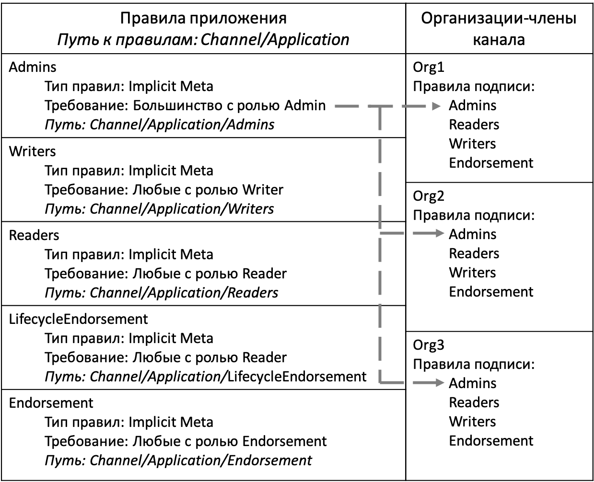
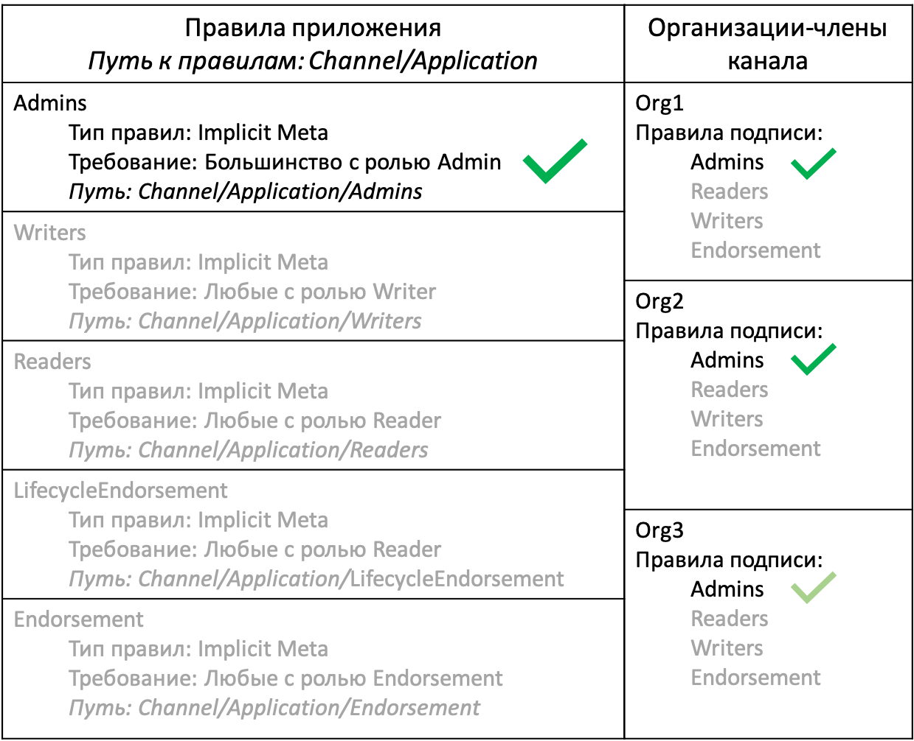
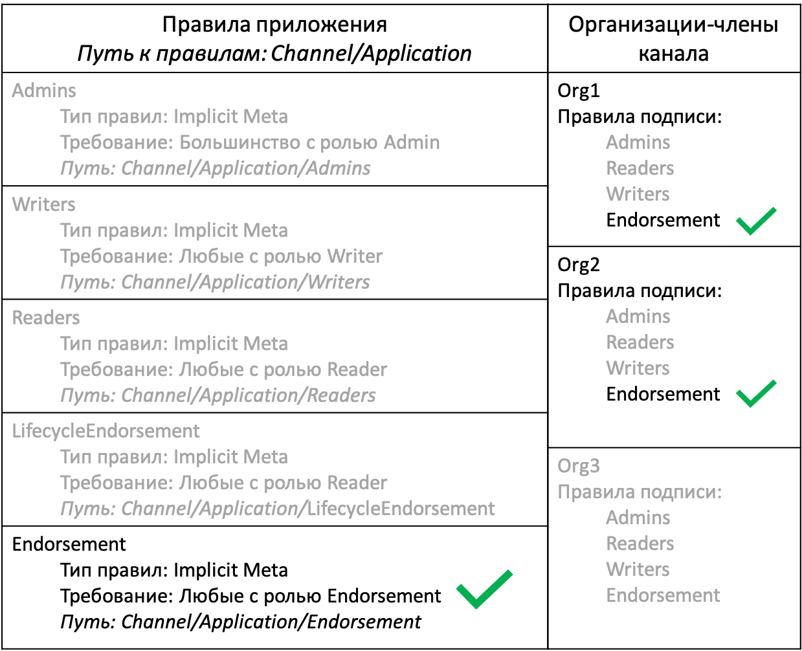
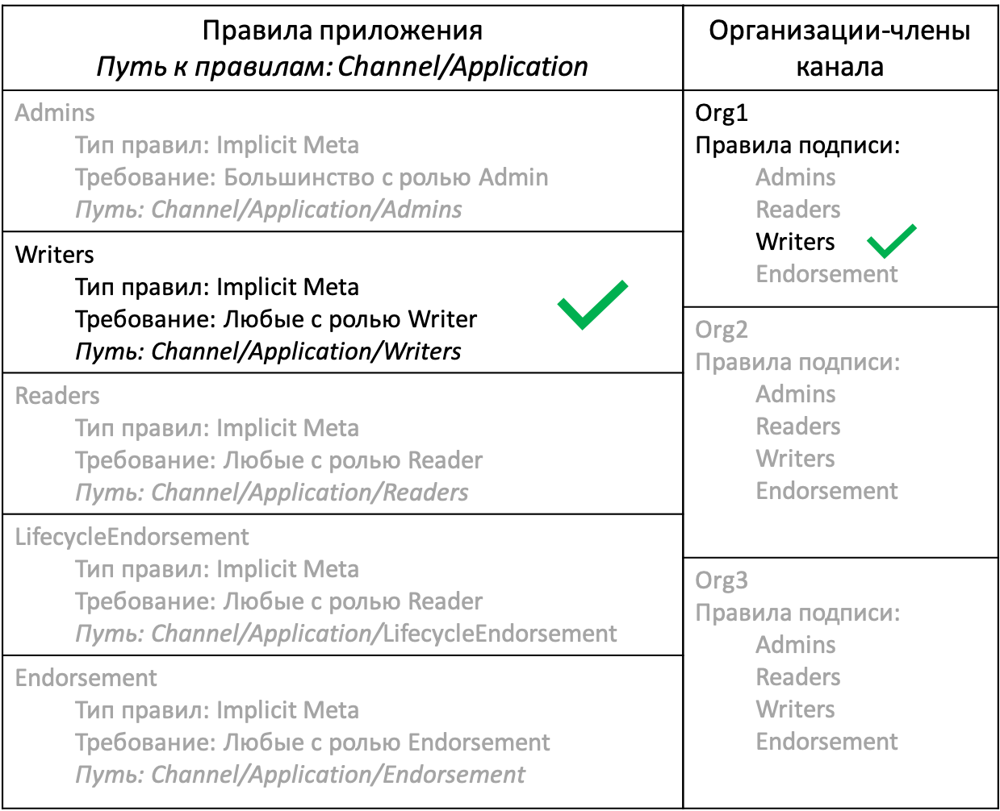
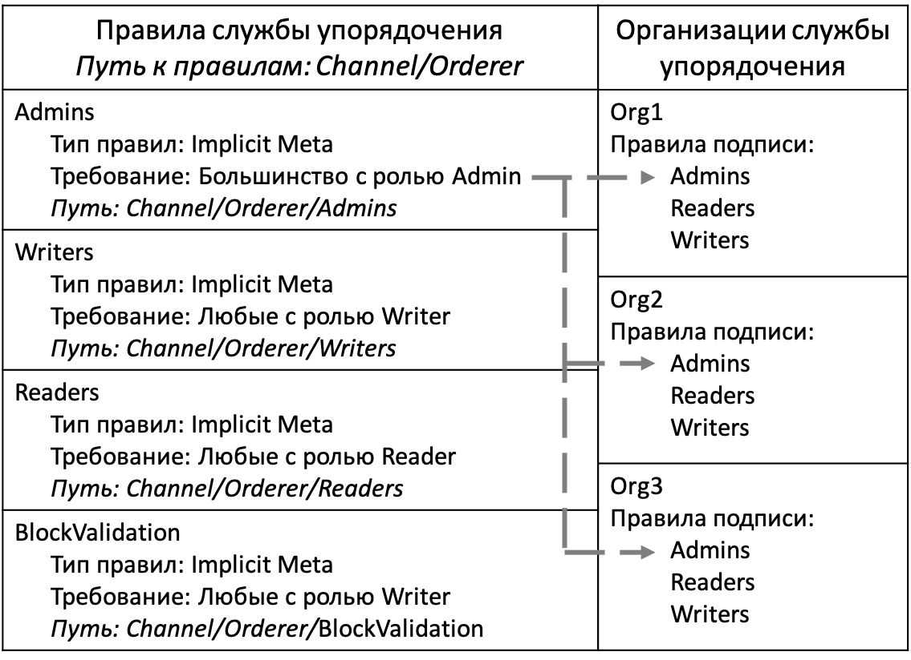
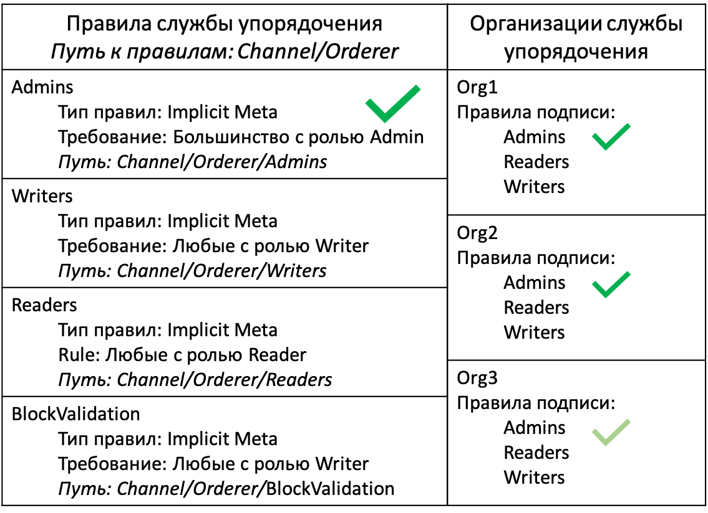

# Правила канала

Каналы обеспечивают закрытую связь между организациями. В то же время большинство изменений в конфигурации канала должно быть согласовано с другими членами канала. В каналах не было бы смысла, если бы организации могли присоединяться к каналу и считывать данные из реестра без одобрения других организаций. Любые изменения в **структуре** канала должны быть одобрены определенным количеством организаций согласно требованиям правил канала.

Установленные правила также управляют **процессами** взаимодействия пользователей с каналом, например, указывают организации, которые должны одобрить чейнкод перед развертыванием в канале, или действия, которые должны быть выполнены администраторами канала.

Правила канала являются достаточно важным компонентом, поэтому им посвящен отдельный раздел. В отличие от других составляющих конфигурации канала, регулирующие работу канала правила определяются содержимым различных разделов файла `configtx.yaml`. Правила канала могут быть настроены для любого случая использования с помощью определенных ограничений. Однако, в этом разделе подробно рассказывается о том, как использовать правила по умолчанию, которые предусмотрены в Hyperledger Fabric. При использовании правил по умолчанию примера сети Fabric или [примера конфигурации Fabric](https://github.com/hyperledger/fabric/blob/{BRANCH}/sampleconfig/configtx.yaml) в каждом создаваемом канале будут действовать правила подписи, правила ImplicitMeta и списки контроля доступа, которые определяют порядок взаимодействия организаций с каналом, а также процесс достижения консенсуса при обновлении структуры канала. Больше о роли правил в сетях Hyperledger Fabric рассказано в разделе [Концепция установленных правил](../policies.html).

## Правила подписи

По умолчанию каждый член канала определяет набор правил подписи, которые ссылаются на организацию-владельца. При отправлении запроса на одобрение на одноранговый узел или транзакции на узлы службы упорядочения, узлы считывают прикрепленные к транзакции подписи и сверяют их с условиями правил подписи, которые определены в конфигурации канала. В любых правилах подписи указывается набор организаций и идентификаторов, подписи которых необходимы для удовлетворения требований этих правил. Правила подписи, определенные организацией Org1 в разделе **Organizations** файла `configtx.yaml`, указаны ниже:
```yaml
- &Org1

  ...

  Policies:
      Readers:
          Type: Signature
          Rule: "OR('Org1MSP.admin', 'Org1MSP.peer', 'Org1MSP.client')"
      Writers:
          Type: Signature
          Rule: "OR('Org1MSP.admin', 'Org1MSP.client')"
      Admins:
          Type: Signature
          Rule: "OR('Org1MSP.admin')"
      Endorsement:
          Type: Signature
          Rule: "OR('Org1MSP.peer')"
```

Все вышеуказанные правила могут быть удовлетворены подписями от организации Org1. Однако в разных правилах указаны разные наборы ролей пользователей организации, которые могут соответствовать требованиям правил. Правила `Admins` могут быть удовлетворены только транзакциями, отправленными от идентификатора с ролью администратора, в то время как идентификаторы с ролью одноранговых узлов могут удовлетворить правила одобрения `Endorsement`. Набор подписей, прикрепленных к одной транзакции, может удовлетворить несколько правил подписи. Например, если прикрепленные к транзакции одобрения предоставлены организациями Org1 и Org2, то этот набор подписей удовлетворяет требованиям правил одобрения организаций Org1 и Org2.

## Правила ImplicitMeta

Если в канале используются правила по умолчанию, на более высоких уровнях конфигурации канала правила подписи для каждой организации проверяются на соответствие правилами ImplicitMeta. Вместо непосредственной проверки подписей, отправленных в канал, в правилах ImplicitMeta указывается набор других правил в конфигурации канала, требования которых необходимо удовлетворить. Транзакция будет удовлетворять требованиям правил ImplicitMeta, если она удовлетворяет требованиям базового набора правил подписи, на которые ссылаются правила ImplicitMeta.

Ниже приведен пример правил ImplicitMeta, определенных в разделе **Application** файла `configtx.yaml`:
```yaml
Policies:
    Readers:
        Type: ImplicitMeta
        Rule: "ANY Readers"
    Writers:
        Type: ImplicitMeta
        Rule: "ANY Writers"
    Admins:
        Type: ImplicitMeta
        Rule: "MAJORITY Admins"
    LifecycleEndorsement:
        Type: ImplicitMeta
        Rule: "MAJORITY Endorsement"
    Endorsement:
        Type: ImplicitMeta
        Rule: "MAJORITY Endorsement"
```

Правила ImplicitMeta раздела **Application** регулируют взаимодействие организаций-членов с каналом. В каждом наборе правил указываются правила подписи, связанные с соответствующим членом канала. Взаимосвязи между правилами разделов **Application** и **Organization** указаны ниже:

    

*Рисунок 1. Требования правил администраторов ImplicitMeta могут быть удовлетворены выполнением большинства правил подписи администраторов, которые определяются каждой организацией.*

Ссылкой на правила является соответствующий путь в конфигурации канала. Поскольку правила в разделе **Application** находятся в группе приложений, которая находится внутри группы каналов, эти правила называются правилами `Channel/Application`. Поскольку в большинстве разделов документации Fabric правила указываются по их пути, в этом разделе мы также будем указывать правила аналогичным образом.

Каждый элемент `Rule` правил ImplicitMeta содержит название правил подписи, которые могут удовлетворить требованиям этих правил. Например, в правилах ImplicitMeta `Channel/Application/Admins` указаны правила подписи `Admins` для каждой организации. Каждый элемент `Rule` также содержит определенные правила подписи, необходимые для удовлетворения правил ImplicitMeta. Например, правила `Channel/Application/Admins` требуют выполнения большинства требований правил подписи `Admins`.

    

*Рисунок 2. Отправленный в канал запрос на обновление канала содержит подписи от организаций Org1, Org2 и Org3, что соответствуют требованиям правил подписи для каждой организации. В результате запрос удовлетворяет правилам Channel/Application/Admins. Проверка от лица организации Org3 выделена светло-зеленом цветом, потому что подпись этой организации не нужна для достижения большинства.*

Приведем другой пример. Правила `Channel/Application/Endorsement` могут быть удовлетворены большинством правил одобрения `Endorsement` организации, которые требуют подписей от одноранговых узлов каждой организации. Эти правила используются жизненным циклом чейнкода Fabric в качестве правил одобрения чейнкода по умолчанию. При вызове чейнкода транзакции должны быть одобрены большинством членов канала кроме случаев, когда определение чейнкода записано с другими правилами одобрения.

    

*Рисунок 3. Транзакция из клиентского приложения вызывает чейнкод на одноранговых узлах организаций Org1 и Org2. Вызов чейнкода выполнен успешно и приложение получает одобрение от одноранговых узлов обеих организаций. Так как эта транзакция удовлетворяет требованиям правил `Channel/Application/Endorsement`, транзакция соответствует правилам одобрения по умолчанию и может быть добавлена в реестр канала.*

Совместное использование правил ImplicitMeta и правил подписи позволяет осуществлять управление на уровне канала, обеспечивая каждому элементу канала возможность выбора идентификаторов, которые должны ставить подпись от лица организации-владельца. Например, в канале может быть указано, что для обновления конфигурации канала требуются подписи от большинства администраторов организаций. Тем не менее каждая организация может использовать правила подписи для выбора идентификаторов, которые будут выполнять роль администраторов, или требовать, чтобы при одобрении обновления канала использовалось более одной подписи от членов это организации.

Еще одним преимуществом правил ImplicitMeta является то, что их не нужно обновлять при добавлении или удалении организации из канала. Как показано на *рис. 3* в качестве примера — если в канал добавляются две новые организации, правила одобрения `Channel/Application/Endorsement` потребуют одобрения от трех организаций для подтверждения транзакции.

Недостатком правил ImplicitMeta является то, что они явно не считывают правила подписи, используемые членами канала (поэтому и называются неявными - `implicit`). Вместо этого предполагается, что пользователи имеют требуемые правила подписи, основанные на конфигурации канала. Значение элемента `rule` правил одобрения `Channel/Application/Endorsement` зависит от количества организаций-членов канала. Если две из трех организаций на *рис. 3* не имеют правил подписи `Endorsement`, транзакции не смогут получить большинство одобрений, необходимых для удовлетворения правил ImplicitMeta `Channel/Application/Endorsement`.

## Правила обновления канала

**Структура** канала регулируется правилами обновления, указанными в конфигурации канала. Каждый компонент конфигурации канала имеет правила обновления, которые должны быть удовлетворены членами канала для внесения изменений. Например, правила и провайдер службы членства канала, определяемые каждой организацией, группа приложений, которая содержит членов канала, и компоненты конфигурации, которые определяют состав выборщиков канала — все эти элементы имеют собственные правила обновления.

Правила обновления могут ссылаться на правила ImplicitMeta или правила подписи. Например, при использовании правил по умолчанию, значения, которые определяют каждую организацию, указывают на правила подписи `Admins`, связанные с этой организацией. Это позволяет организациям обновлять собственных провайдеров службы членства канала или добавлять якорные узлы без получения одобрения от других членов канала. Правила ImplicitMeta `Channel/Application/Admins` являются правилами обновления группы приложений, определяющими набор членов канала. В результате правила по умолчанию требуют, чтобы большинство организаций одобряли добавление или удаление члена канала.

## Правила канала и списки контроля доступа

Правила в конфигурации канала также указываются в [списках контроля доступа (ACL)](../access_control.html), которые используются для ограничения доступа к используемым в канале ресурсам сети Fabric. Списки контроля доступа расширяют возможности управления **процессами** канала для правил, указанных в конфигурации канала. Списки контроля доступа, используемые по умолчанию, можно посмотреть в [примере файла configtx.yaml](http://github.com/hyperledger/fabric/blob/{BRANCH}/sampleconfig/configtx.yaml). В списках ACL правила канала указываются с помощью пути. Например, следующий список контроля доступа ограничивает пользователей, которые могут вызывать чейнкод, с помощью правил `/Channel/Application/Writers`:
```
# Правила контроля доступа для вызова чейнкода на одноранговом узле
peer/Propose: /Channel/Application/Writers
```

В большинстве списков контроля доступа по умолчанию указываются правила ImplicitMeta в разделе **Application** конфигурации канала. Продолжим рассматривать пример выше. Так, организация может вызывать чейнкод при выполнении требований правил `/Channel/Application/Writers`.

    

*Рисунок 4. Список контроля доступа peer/Propose удовлетворяется правилами /Channel/Application/Writers. Эти правила могут быть удовлетворены транзакцией, отправленной клиентским приложением из любой организации, имеющей правила подписи Writers.*

## Правила службы упорядочения

Правила ImplicitMeta раздела **Orderer** файла `configtx.yaml` управляют работой узлов службы упорядочения канала аналогично тому, как правила раздела **Application** руководят организациями-членами канала. Правила ImplicitMeta ссылаются на правила подписи, связанные с организациями, которые являются администраторами службы упорядочения.

    

*Рисунок 5. Правила Channel/Orderer/Admins ссылаются на правила подписи Admins для администраторов служба упорядочения.*

При использовании правил по умолчанию, большинство организаций должны одобрить добавление или удаление узла службы упорядочения.

    

*Рисунок 6. Запрос для удаления узла службы упорядочения из канала содержит подписи от трех организаций службы упорядочения сети, что выполняет требования правил Channel/Orderer/Admins. Проверка от лица организации Org3 выделена светло-зеленом цветом, потому что подпись этой организации не нужна для достижения большинства.*

Правила `Channel/Orderer/BlockValidation` используются одноранговыми узлами для подтверждения того, что новые блоки в канале были сгенерированы узлом службы упорядочения, который входит в состав выборщиков, и что блок не был подделан или создан другой организацией. По умолчанию любая организация службы упорядочения с помощью правил подписи `Writers` может создавать и проверять блоки в рамках канала.