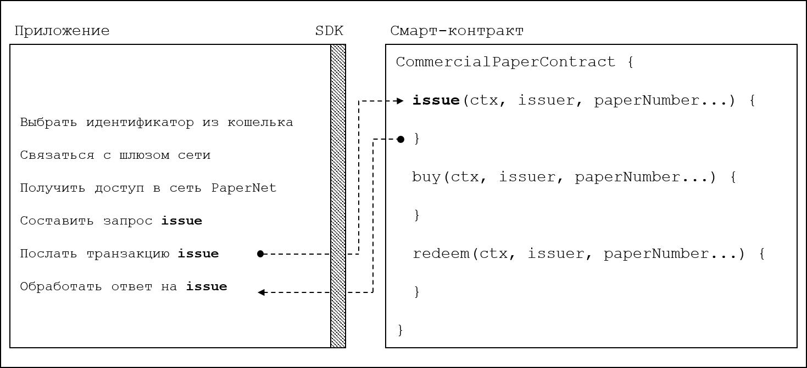

# Приложения

**Аудитория**: Архитекторы приложений, разработчики смарт-контрактов и приложений.

Приложение взаимодействует с блокчейн-сетью посредством записи транзакций в реестр
или запросов к содержанию реестра. В этом разделе рассмотрим механизм того, как
это делается; в нашем сценарии организации взаимодействуют с сетью PaperNet при помощи
приложений, которые вызывают транзакции **issue**, **buy** и **redeem**, определенные
в смарт-контракте ценной бумаги. Несмотря на то, что приложение организации MagnetoCorp
по выпуску ценной бумаги достаточно простое, в нем содержатся все ключевые для понимания
пункты.


В этом разделе мы разберем:

* [Поток приложения при вызове смарт-контракта](#basic-flow)
* [Как приложение пользуется кошельком и идентификатором](#wallet)
* [Как приложение соединяется через шлюз](#gateway)
* [Как получить доступ в конкретную сеть](#network-channel)
* [Как составить запрос на транзакцию](#construct-request)
* [Как послать транзакцию](#submit-transaction)
* [Как обработать ответ на транзакцию](#process-response)

Для пояснения, мы приведем в пример приложение коммерческой ценной бумаги, входящее в
состав Hyperledger Fabric. Его можно [загрузить](../install.html) и [запустить на локальной машине](../tutorial/commercial_paper.html).
Оно написано как на JavaScript, так и на Java, но внутренняя логика не зависит от языка реализации,
так что вам будет легко следить за происходящим (скоро будет вариант и на языке Go).

## Основной поток

Приложение взаимодействует с сетью блокчейн при помощи набора разработчика Fabric SDK.
Взгляните на упрощенную диаграмму того, как приложение вызывает смарт-контракт
коммерческой ценной бумаги:

 *Приложение PaperNet application вызывает
смарт-контракт коммерческой ценной бумаги, чтобы записать запрос на транзакцию выпуска/эмиссии
ценной бумаги.*

Чтобы записать транзакцию, приложение должно совершить шесть основных действий:

* Выбрать идентификатор из кошелька
* Соединиться со шлюзом
* Войти в нужную сеть
* Составить для смарт-контракта запрос на транзакцию
* Послать транзакцию в сеть
* Обработать ответ

Вам предстоит увидеть, как при помощи Fabric SDK эти шесть действий
совершает типичное приложение. Код приложения находится в файле `issue.js`. [Файл по ссылке](https://github.com/hyperledger/fabric-samples/blob/{BRANCH}/commercial-paper/organization/magnetocorp/application/issue.js)
можно открыть в браузере или в привычном вам редакторе после загрузки.
Обратите внимание на общую структуру приложения; несмотря на комментарии и пустые строки,
оно занимает лишь 100 строчек кода!

## Кошелек

В самом начале `issue.js` можно видеть, как вводятся два класса Fabric:

```JavaScript
const { Wallets, Gateway } = require('fabric-network');
```

Информацию о классах `fabric-network` можно получить из
[документации node SDK](https://hyperledger.github.io/fabric-sdk-node/{BRANCH}/module-fabric-network.html),
а сейчас мы посмотрим, как ими пользуются для связи приложения MagnetoCorp с
PaperNet. Это приложение использует класс Fabric **Wallet** следующим образом:

```JavaScript
const wallet = await Wallets.newFileSystemWallet('../identity/user/isabella/wallet');
```

Обратите внимание, как `wallet` обнаруживает [кошелек](./wallet.html) в локальной
файловой системе.
Идентификатор, извлеченный из кошелька, явным образом соответствует пользователю
по имени Изабелла, который использует приложение `issue`. В кошельке содержится набор
идентификаторов -- цифровые сертификаты X.509 -- и они могут быть использованы для
доступа в PaperNet или другую сеть Fabric. Если вы запустите руководство и посмотрите
в эту директорию, то увидите там описание идентификатора для пользователя Изабелла.

Представьте себе [кошелек](./wallet.html), в котором содержатся цифровые аналоги вашего
паспорта, водительского удостоверения или банковской карточки. Цифровые сертификаты X.509,
содержащиеся в нем, сопоставляют их держателя с организацией, наделяя его таким образом
правами в сетевом канале. К примеру, `Isabella` может являться администратором MagnetoCorp,
и это дает ей больше прав, чем другому пользователю -- `Balaji` из DigiBank. 
Более того, смарт-контракт может извлечь её идентификатор при обработке смарт-контракта,
используя [контекст транзакции](./transactioncontext.html).

Просим заметить, что эти кошельки не содержат денег в какой-либо форме или токенов --
в них хранятся идентификаторы.

## Шлюз

Второй ключевой класс это класс Fabric **Gateway**. В первую очередь,
[шлюз](./gateway.html) определяет один или более одноранговых узлов, предоставляющих
доступ к сети -- в нашем случае это PaperNet. Так `issue.js` связывается с шлюзом:

```JavaScript
await gateway.connect(connectionProfile, connectionOptions);
```

У `gateway.connect()` есть два важных параметра:

  * **connectionProfile**: местонахождение в файловой системе
    [профиля соединения](./connectionprofile.html), который идентифицирует
    набор узлов, являющихся шлюзом к PaperNet

  * **connectionOptions**: набор управляющих параметров взаимодействия `issue.js`
    с PaperNet


Теперь посмотрите, как клиентское приложение пользуется шлюзом, чтобы изолировать
себя от топологии сети, которая может и измениться. Шлюз берет на себя отправку предлагаемой
транзакции нужным одноранговым узлам сети, используя [профиль соединения](./connectionprofile.html) и
[параметры соединения](./connectionoptions.html).

Взгляните на подробности
[профиля соединения](https://github.com/hyperledger/fabric-samples/blob/{BRANCH}/commercial-paper/organization/magnetocorp/gateway/networkConnection.yaml)
`./gateway/connectionProfile.yaml`. Он написан в формате
[YAML](http://yaml.org/spec/1.2/spec.html#Preview) и легко читается.

Профиль соединения загружается и конвертируется в объект JSON:

```JavaScript
let connectionProfile = yaml.safeLoad(file.readFileSync('./gateway/connectionProfile.yaml', 'utf8'));
```

В настоящий момент нам нужны лишь разделы профиля `channels:` и `peers:`:
(Подробности немного изменены для наглядности)

```YAML
channels:
  papernet:
    peers:
      peer1.magnetocorp.com:
        endorsingPeer: true
        eventSource: true

      peer2.digibank.com:
        endorsingPeer: true
        eventSource: true

peers:
  peer1.magnetocorp.com:
    url: grpcs://localhost:7051
    grpcOptions:
      ssl-target-name-override: peer1.magnetocorp.com
      request-timeout: 120
    tlsCACerts:
      path: certificates/magnetocorp/magnetocorp.com-cert.pem

  peer2.digibank.com:
    url: grpcs://localhost:8051
    grpcOptions:
      ssl-target-name-override: peer1.digibank.com
    tlsCACerts:
      path: certificates/digibank/digibank.com-cert.pem
```

Взгляните, как `channel:` идентифицирует сетевой канал `PaperNet:` и два его
одноранговых узла. У MagnetoCorp есть `peer1.magenetocorp.com` и у DigiBank есть
`peer2.digibank.com`, и оба они — одобряющие одноранговые узлы. Ключ `peers:` содержит
 подробности о том, как соединиться с этими узлами, включая их сетевые адреса.

Профиль соединения содержит много информации, и не только об узлах, но и о сетевых каналах,
упорядочивающих узлах сети, организациях и УЦ, поэтому — на данном этапе, если вы еще не все
понимаете, ничего страшного!

Теперь обратим внимание на объект `connectionOptions`:

```JavaScript
let connectionOptions = {
    identity: userName,
    wallet: wallet,
    discovery: { enabled:true, asLocalhost: true }
};
```

Как видно, в нем определены идентификатор `userName` и кошелек `wallet` для связи
со шлюзом. Эти значения переменных были присвоены ранее в коде.

Есть и другие [параметры соединения](./connectionoptions.html), которые приложение
может использовать для передачи в SDK, чтобы действовать от его имени.
Например:

```JavaScript
let connectionOptions = {
  identity: userName,
  wallet: wallet,
  eventHandlerOptions: {
    commitTimeout: 100,
    strategy: EventStrategies.MSPID_SCOPE_ANYFORTX
  },
}
```

Здесь `commitTimeout` устанавливает для SDK интервал ожидания в 100 секунд, пока транзакция не будет записана.
В то же время `strategy: EventStrategies.MSPID_SCOPE_ANYFORTX` определяет для SDK необходимость
оповещать приложение о том, что один одноранговый узел MagnetoCorp подтвердил транзакцию,
и, напротив,`strategy: EventStrategies.NETWORK_SCOPE_ALLFORTX` требует подтверждения
транзакции от всех узлов MagnetoCorp и DigiBank.

Если хотите, [почитайте](./connectionoptions.html) о том, как параметры соединения
дают приложениям возможность задавать цели без того, чтобы заботиться о тех средствах,
какими они будут выполнены.

## Сетевой канал

Одноранговые узлы, что записаны в `connectionProfile.yaml`, дают
`issue.js` доступ к PaperNet. Поскольку эти одноранговые узлы могут быть присоединены к нескольким
сетевым каналам, то и шлюз дает приложению доступ к этим каналам!

Вот как приложение выбирает конкретный канал:

```JavaScript
const network = await gateway.getNetwork('PaperNet');
```

И только после этого `network` дает доступ к PaperNet. Ну, а если приложение
попробует одновременно получить доступ к другой сети  - `BondNet`, то это легко реализуется
таким образом:

```JavaScript
const network2 = await gateway.getNetwork('BondNet');
```

Теперь у нашего приложения есть доступ одновременно и к сети `BondNet` и `PaperNet`!

Таков мощный механизм в Hyperledger Fabric -- приложения могут участвовать
в **сети сетей** - они присоединяются через шлюзы к нескольким одноранговым узлам,
каждый из которых в свою очередь соединен с несколькими сетевыми каналами.
В разных каналах у них будут разные права - в соответствии с их идентификаторами из
кошелька, записанными в `gateway.connect()`.

## Составить запрос

И вот — приложение готово к тому, чтобы **выпустить** коммерческую ценную бумагу. Для 
этого оно применит `CommercialPaperContract` и это будет довольно просто:

```JavaScript
const contract = await network.getContract('papercontract', 'org.papernet.commercialpaper');
```

Заметьте, что приложение сообщает имя -- `papercontract` -- и явным образом
имя контракта: `org.papernet.commercialpaper`! Посредством [имени контракта](./contractname.html)
выбирается один контракт из файла чейнкода `papercontract.js`, содержащего и другие контракты.
`papercontract.js` был установлен и развернут в канале сети PaperNet с именем
 `papercontract`, и, если поинтересуетесь, можете почитать [как](../chaincode_lifecycle.html)
 развернуть чейнкод, содержащий несколько смарт-контрактов.

Если бы наше приложение одновременно попробовало бы подключиться к другому контракту
в сетях PaperNet или BondNet, это легко было бы сделать так:

```JavaScript
const euroContract = await network.getContract('EuroCommercialPaperContract');

const bondContract = await network2.getContract('BondContract');
```

Следуя этим примерам, обратите внимание, что мы не нашли нужным использовать
конкретное имя контракта - в каждом файле лишь один смарт-контракт, и `getContract()`
берет первый, который найдет.

Теперь вспомним ту транзакцию, которой организация MagnetoCorp выпускает свою
первую ценную коммерческую ценную бумагу:

```
Txn = issue
Issuer = MagnetoCorp
Paper = 00001
Issue time = 31 May 2020 09:00:00 EST
Maturity date = 30 November 2020
Face value = 5M USD
```

Настало время послать эту транзакцию в PaperNet!

## Послать транзакцию

Послать транзакцию можно простым вызовом метода из SDK:

```JavaScript
const issueResponse = await contract.submitTransaction('issue', 'MagnetoCorp', '00001', '2020-05-31', '2020-11-30', '5000000');
```

Параметры `submitTransaction()` соответствуют параметрам запроса транзакции.
Именно эти значения будут переданы в метод `issue()` смарт-контракта и с их
помощью будет создана коммерческая ценная бумага.  Вот его подпись:

```JavaScript
async issue(ctx, issuer, paperNumber, issueDateTime, maturityDateTime, faceValue) {...}
```

Может показаться, что смарт-контракт вступает в действие сразу же после того, как
приложение запускает `submitTransaction()`, но это не так. Для того чтобы это сделать,
SDK сначала посылает информацию из `connectionOptions` и `connectionProfile` назначенным
узлам в сети, от которых может получить необходимые одобрения. Но приложению видеть
этого и не нужно — оно всего лишь запускает `submitTransaction` и SDK сделает всё за него само!

Важно заметить, что в API для `submitTransaction` входит и процесс
получения подтверждений о записи транзакций. Получение подтверждений о записи транзакций
необходимо — транзакция должна быть прежде успешно упорядочена, подтверждена и записана
в реестр.

Обратим теперь внимание на то, как приложение обращается с ответами!

## Обработать ответ

Так транзакция **issue** возвращает ответ на коммерческую ценную бумагу (известно из
  вспомним `papercontract.js`):

```JavaScript
return paper.toBuffer();
```

Вы можете заметить небольшую особенность -- каждая новая ценная бумага - `paper`,
должна быть сконвертирована в буфер для ответа приложению. Обратите внимание, как `issue.js`
использует метод `CommercialPaper.fromBuffer()` для восстановления коммерческой ценной бумаги
из буфера ответа:

```JavaScript
let paper = CommercialPaper.fromBuffer(issueResponse);
```

Таким образом `paper` естественным образом используется как содержательное сообщение
о завершении:

```JavaScript
console.log(`${paper.issuer} commercial paper : ${paper.paperNumber} successfully issued for value ${paper.faceValue}`);
```

Видно, как один и тот же класс `paper` может быть использован и в приложении, и в смарт-контракте
-- если вы будете структурировать свой код так же, он будет и читаемым и пригодным к повторному
использованию.

Что же касается запроса на одобрение транзакции, может показаться, что
приложению даются права на управление сразу же после завершения работы смарт-контракта,
но это не так. Внутренний механизм работы подразумевает, что всем процессом консенсуса
заведует SDK, который и уведомляет приложение о завершении процесса - в соответствии
с параметрами соединения `strategy` connectionOption. Если интересны подробности —
почитайте здесь - [транзакционный поток](../../txflow.html).

Вот и всё! В этой главе вы разобрались в том, как вызывать смарт-контракт из
приложения, перед тем рассмотрев как приложение MagnetoCorp выпускает новую ценную бумагу
в сети PaperNet. Теперь же предлагаем рассмотреть принципы структур данных реестра и смарт-контрактов
в [этом разделе](./architecture.html).

<!--- Licensed under Creative Commons Attribution 4.0 International License
https://creativecommons.org/licenses/by/4.0/ -->
