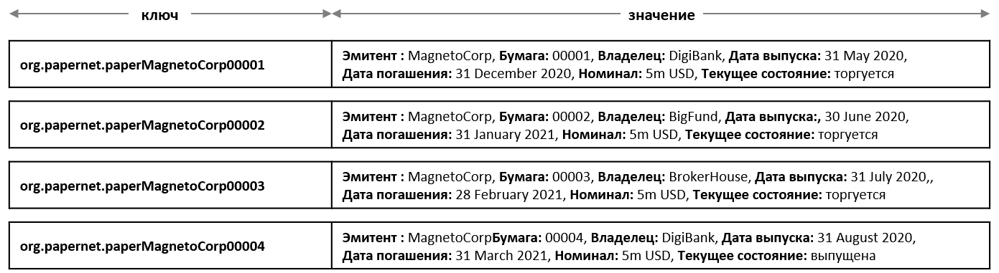

# Конструирование процессов и структур данных

**Аудитория**: Архитекторы приложений, разработчики смарт-контрактов и приложений, представители бизнес-функций

В этой главе мы покажем, как сконструировать процессы коммерческой ценной бумаги и соответствующие
им структуры данных в сети PaperNet. В нашем [анализе](./analysis.html) мы кратко
обрисовали, как использование состояний и транзакций позволяет точно понимать происходящее
при моделировании сети PaperNet.
Сейчас же мы подробнее рассмотрим две эти тесно взаимосвязанные концепции, чтобы
впоследствии начать конструировать смарт-контракты и приложения сети PaperNet.

## Жизненный цикл

Ранее было показано, что важнейшими для сети коммерческих ценных бумаг являются две
концепции: **состояний** и **транзакций**. Важнейшими они являются и для
*всех* сценариев использования блокчейна; есть концептуально заданные объекты с определенной ценностью,
которые моделируется посредством состояний, а изменения этих состояний описываются
транзакциями. Детальный анализ состояний и транзакций необходимо проделать в начале любой
программной реализации концепций.

Жизненный цикл коммерческой ценной бумаги можно представить в виде диаграммы перехода
от одного состояния к другому:

 *Диаграмма перехода между состояниями. Переход коммерческой ценной бумаги от состояния **выпущена**
к состояниям **торгуется** и **погашена** путем применения транзакций **выпуск**, **купить** and
**погашение**.

На диаграмме показаны состояния, через которые проходит бумага на своем жизненном цикле, и
транзакции, которые осуществляют эти переходы. В Hyperledger Fabric транзакционная логика, которая
управляет переходами между различными состояниями, воплощена в смарт-контрактах.
Состояния коммерческой ценной бумаги на деле содержатся в реестре глобальных состояний, и
на них стоит посмотреть пристальнее.

## Состояние реестра

Припомним структуру коммерческой ценной бумаги:

 *Коммерческую ценную бумагу можно
представить в виде набора свойств, каждому которых приписано определенное значение. Обычно
уникальный ключ любой ценной бумаги задается комбинацией этих свойств.*

Заметно, что свойство `Бумага` имеет значение `00001`, а значение свойства `Номинал` составляет
`5M USD`. Что важнее, свойство `Текущее состояние` показывает, `торгуется`ли ценная бумага,
или только что `выпущена` или уже `погашена`. В совокупности, полный набор этих свойств составляет **состояние**
ценной бумаги. Более того, полное перечисление всех этих состояний составляет реестр
[глобального состояния](../ledger/ledger.html#world-state).

Все состояния в реестре имеют одну и ту же форму: у каждого состояния есть набор свойств,
и каждое из них имеет определенное значение. Задание состояния как сущности с многими
свойствами чрезвычайно полезно - таким образом, мы представляем состояние в рамках Fabric
как вектор, а не просто скалярную величину.
Затем мы представляем сведения об объекте в виде череды индивидуальных состояний,
которые затем претерпевают изменения, подчиняющиеся логике транзакций. Состояние
в Fabric задается парой "ключ-значение", в которой значение является набором свойств объекта
в формате, достаточном для их отображения, обычно - JSON.
[База данных реестра](../ledger/ledger.html#ledger-world-state-database-options) может
воспринимать сложные запросы к этим свойствам, что очень полезно для извлечения объектов
по сложным алгоритмам.

Вот как ценная бумага `00001` организации MagnetoCorp представлена в виде вектора состояния,
который изменяется под различными управляющими воздействиями от транзакций:

 *Различные транзакции сначала создают,
а затем изменяют коммерческую ценную бумагу.
Состояния в Hyperledger Fabric содержат множество свойств, что делает их векторными, а не
скалярными.*

Заметьте, что каждая конкретная бумага начинается с пустого состояния, которое технически
обозначаем как [`nil`](https://en.wikipedia.org/wiki/Null_(SQL)) - нулевое состояние,
потому что она еще не существует! Теперь бумага `00001` создается транзакцией **выпустить**,
и видоизменяется транзакциями **купить** and **погасить**.

Заметьте, что каждое состояние описано самоочевидным образом; у каждого свойства есть название и
есть значение. Сейчас наши коммерческие ценные бумаги имеют одинаковый набор свойств, но это
не обязательно - Hyperledger Fabric позволяет задавать состояния с разными наборами свойств.
Таким образом в реестре глобальных состояний можно содержать как различные формы одного и того же
актива, так и различные активы.
Также позволительно и изменять структуру состояния - например, если в данном примере
законодательно потребуется приписывать ценной бумаге еще одно поле значений. Гибкость
определения набора состояния отражает базовое требование допустимости эволюции данных
во времени.

## Ключи состояний

На практике почти всегда состояние будет иметь сочетание свойств, которым оно определяется
единственным образом в заданном контексте - это **ключ**. Ключ коммерческой ценной бумаги
в сети PaperNet формируется связкой полей `Эмитент` and
`бумага`; так, например для первой бумаги организации MagnetoCorp это `MagnetoCorp00001`.

Ключ состояния идентифицирует бумагу единственным образом; его создает транзакция **выпустить**
и изменяют впоследствии транзакции **купить** и **погасить**.
В Hyperledger Fabric требуется, чтобы каждое состояние в реестре имело уникальный ключ.

Если уникальный ключ нельзя составить из набора свойств, тогда приложение определяет
собственный уникальный ключ как входные данные для транзакции создания состояния.
Уникальный ключ обычно содержит в какой-то форме
[UUID](https://en.wikipedia.org/wiki/Universally_unique_identifier), который, хоть
и трудно читается, но является элементом общепринятой практики. В данном случае важно, чтобы 
 каждый объект конкретного состояния был наделен уникальным ключом.

_Примечание: Избегайте использования U+0000 (пустого байта) как значения ключа._

## Множественные состояния

Как видим, коммерческие ценные бумаги хранятся PaperNet в виде векторов состояния
в реестре. Необходимое требование извлекаемости по запросу различных коммерческих ценных
бумаг представляется разумным: например, найти все бумаги, выпущенные организацией MagnetoCorp,
или же: найти все выпущенные ранее MagnetoCorp бумаги, но уже переведенные в состояние
`погашенных`.

Для того, чтобы иметь возможность проводить такой поиск, помогает группировка ценных бумаг
в логический список. Структура PaperNet содержит идею списка коммерческих ценных бумаг --
логический контейнер, который обновляется при изменении состояний.

### Логическое представление

Все коммерческие ценные бумаги PaperNet полезно представлять единым списком:

 *Вновь созданная коммерческая ценная
бумага MagnetoCorp под номером 00004 записывается в список существующих.*

Новые бумаги добавляются в список как результат транзакции **выпустить**, а бумаги, уже
находящиеся в списке, могут быть изменены транзакциями **купить** или **погасить**.
Название списка говорит само за себя: `org.papernet.papers`;
является хорошим тоном присваивать что-то вроде [имени DNS](https://en.wikipedia.org/wiki/Domain_Name_System),
так как хорошо подобранное название помогает интуитивному пониманию другими
людьми конструкции вашего блокчейна. Та же идея применима и к [названиями](./contractname.html)
смарт-контрактов.

### Физическое представление

В то время как мы совершенно верно представляем ценные бумаги в виде единого списка --
`org.papernet.papers` -- списки лучше всего реализовывать как набор индивидуальных состояний
в контексте Fabric, где составной ключ каждого состояния связывает состояние со своим списком.
Таким образом мы обеспечиваем уникальность составного ключа каждого состояния и возможность
эффективного поиска по запросам.

 *Представление списка коммерческих ценных
бумаг PaperNet как набора различных состояний Hyperledger Fabric*

Обратите внимание, как каждая ценная бумага в списке представлена векторным состоянием, снабженным
уникальным **составным** ключом, образованным связкой свойств - `org.papernet.paper`,
`Эмитент` и `Бумага`. Такая структура эффективна по следующим причинам:

  * Мы можем посмотреть на каждый вектор состояния в реестре и определить, в
    каком он списке, не исследуя список отдельно. Можно сравнить это с тем, как
    если бы мы посмотрели на список спортивных болельщиков, и определили, за
    какую команду болеет каждый, лишь посмотрев на цвета его майки. Болельщики
    сами обозначают свою принадлежность команде, и нам не нужно смотреть на списки
    болельщиков каждой команды по отдельности.

  * Внутри Hyperledger Fabric работает механизм контроля одновременного доступа
   <!-- Add more information to explain this topic-->
    для изменения реестра, и хранение ценных бумаг в отдельных векторах состояний
    значительно снижает вероятность конфликта одинаковых состояний.
    Случаи таких конфликтов требуют записи заново, диктуют сложные конструкции в приложениях
    и вообще - снижают производительность.

Второй пункт является ключевым тезисом для Hyperledger Fabric; физическое строение
векторов состояния является **чрезвычайно важным** для оптимизации производительности
и поведения кода. Всегда разделяйте состояния!

## Отношения доверия

Итак, мы обсудили, как исходя из различных назначенных ролей, таких как эмитент, трейдер, или рейтинговое
агентство, а также различных бизнес-интересов, определяются и стороны, которые
должны удостоверять транзакции. В Fabric, эти правила записаны в так называемых
[**установленных правилах одобрения**](endorsementpolicies.html). Эти правила могут быть
установлены как на уровне общности чейнкода, так и индивидуально для каждого ключа состояния.

Из этого следует, что в PaperNet мы можем установить единое правило для всего пространства
участников, которое будет определять тех, кто имеет право на выпуск ценных бумаг.
Впоследствии мы можем задавать новые правила и изменять старые с тем, чтобы отражать
отношения доверия для транзакций покупки и погашения.

В следующей главе мы рассмотрим, как совместить эти структурные концепции для
реализации смарт-контракта коммерческих ценных бумаг для PaperNet и применения его
приложении!

<!--- Licensed under Creative Commons Attribution 4.0 International License
https://creativecommons.org/licenses/by/4.0/ -->
