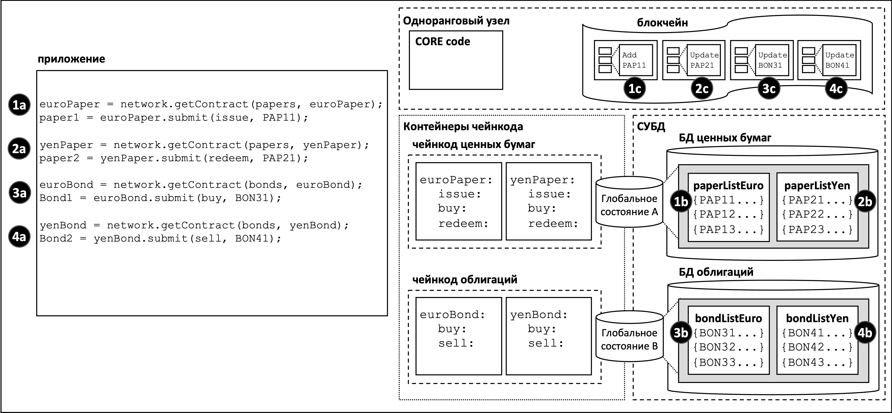
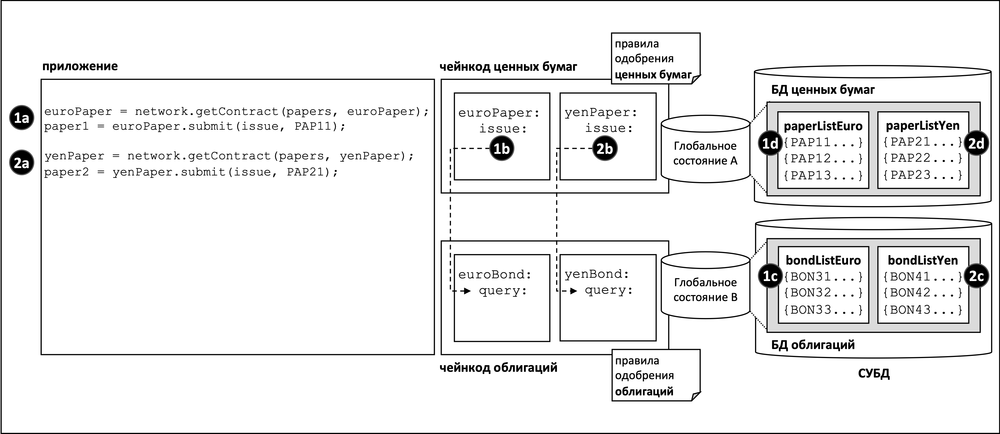

# Пространство имен чейнкода

**Аудитория**: Архитекторы, разработчики смарт-контрактов и приложений, администраторы

Пространство имен чейнкода позволяет сохранять глобальное состояние изолированным от
других чейнкодов. В частности, смарт-контракты того же чейнкода имеют одинаковый
прямой доступ к тому же глобальному состоянию, в то время как смарт-контракты разных чейнкодов
не могут обращаться напрямую к глобальным состояниям друг друга. Если смарт-контракту
требуется обратиться к глобальному состоянию другого чейнкода, он может сделать путем
вызова необходимого чейнкода. И наконец, блокчейн может содержать транзакции, относящиеся к разным
глобальным состояниям.

В этой главе мы рассмотрим:

* [Важность пространства имен](#motivation)
* [Описание пространства имен чейнкода](#сценарий)
* [Каналы и пространства имен](#каналы)
* [Как использовать пространство имен чейнкода](#практика)
* [Как обращаться к глобальным состояниям разных контрактов](#межчейнкодовый-доступ)
* [Обсуждение конструкции пространств имен чейнкода](#заключение)
  

## Введение

Концепция "пространства имен" широко распространена. Очевидно, например, что
адреса *Park Street, New York* и *Park Street, Seattle* означают разные улицы, несмотря на то, что
их названия одинаковые. Название города образует **пространство имен** для улицы Park Street,
одновременно обеспечивая прозрачность и свободу наименования.

Тот же принцип применяется и в компьютерных системах. Пространства имен позволяют разным
пользователям программировать и управлять различными частями совместно используемой
системы, не мешая друг другу. Во многих языках программирования есть пространства имен,
позволяющих программам присваивать уникальные идентификаторы, например, именам переменных,
без пересечения с другими программами, которые делают то же самое.
Далее мы увидим, что Hyperledger Fabric использует пространства имен, чтобы помочь
смарт-контрактам изолировать свои глобальные состояния реестра от других смарт-контрактов.

## Сценарий

С помощью диаграммы, приведенной ниже, посмотрим на то, как глобальное состояние реестра
описывает факты бизнес-объектов, важных для деятельности организаций в канале.
Какими бы ни были эти объекты - коммерческие ценные бумаги, облигации или регистрационные
данные автомобилей, и на какой бы стадии жизненного цикла они ни находились, они
описываются как состояния в базе данных глобальных состояний реестра. Смарт-контракт
управляет бизнес-объектами путем взаимодействия с реестром (блокчейн и глобальное состояние),
и в большинстве случаев за этим стоят запросы к реестру или изменения глобального состояния реестра.

Жизненно важно понимать, что глобальное состояние реестра размечено в соответствии с
чейнкодом или смарт-контрактом, который к нему обращается, и конструкцию этой разметка, или
*организацию пространства имен* архитекторам, администраторам или программистам чрезвычайно важно продумать.  

 *Глобальное состояние реестра делится
на три разных пространства имен в соответствии с чейнкодом, который к ним обращается.
Внутри каждого заданного канала смарт-контракты одного чейнкода пользуются одним и тем же
глобальным состоянием, а смарт-контракты разных чейнкодов не имеют прямого доступа к глобальным
состояниям друг друга. Точно так же и блокчейн - может содержать транзакции, относящиеся
к глобальным состояниям разных чейнкодов.*

В нашем примере мы видим четыре смарт-контракта, заданных в двух разных чейнкодах, каждый
из которых содержится в своем контейнере. Смарт-контракты `euroPaper` и `yenPaper` заданы 
в чейнкоде `papers`. Таким же образом смарт-контракты `euroBond` и `yenBond` заданы в чейнкоде `bonds`.
Такое устройство помогает разработчикам приложений понимать, работают ли они с коммерческими ценными 
бумагами/облигациями, номинированными в евро или йенах, и, раз уж правила для каждого финансового продукта одинаковы,
вне зависимости от валюты номинации, разумно управлять их развертыванием при помощи одного и того же чейнкода.

Приведенная выше [диаграмма](#сценарий) показывает также и последствия такого выбора развертывания.
Система управления базами данных (СУБД) создает разные базы данных глобальных состояний
для чейнкодов `ценных бумаг` и `облигаций` и смарт-контрактов, в них содержащихся.
`Глобальное состояние A` и `глобальное состояние B` хранятся в разных базах данных, 
а данные изолированы друг от друга таким образом, что одним запросом нельзя обратиться 
к обоим состояниям. В этом случае говорится, что глобальное состояние *организовано по пространству имен* 
в соответствии со своим чейнкодом.

Обратите внимание, что `глобальное состояние A` содержит два списка ценных бумаг `paperListEuro`
и `paperListYen`. Состояния `PAP11` и `PAP21` - это экземпляры каждой ценной бумаги под управлением
смарт-контрактов `euroPaper` и `yenPaper` соответственно. Из-за того, что они совместно
используют пространство имен одного чейнкода, их ключи (`PAPxyz`) должны быть уникальными
в пространстве имен чейнкода `papers`, примерно так же, как должно быть уникальным название
каждой улицы в городе. Обратите внимание, что можно было бы написать смарт-контракт в чейнкоде `papers`,
который бы выполнял агрегированные вычисления по всем ценным бумагам, номинированным как
в евро, так и в йенах, потому что они совместно используют одно и то же пространство имен. 
Ситуация для облигаций идентичная -- они содержатся в `глобальном состоянии B`, которое отображается 
на изолированную БД `bonds` с уникальными ключами.

Не менее важно то, что пространства имен подразумевают, что `euroPaper` и `yenPaper` не
могут напрямую обращаться к `глобальному состоянию B`, и `euroBond` и `yenBond` не
могут напрямую обращаться к `глобальному состоянию A`. Эта изоляция очень полезна,
так как коммерческие ценные бумаги и облигации отличаются как финансовые инструменты, у них
разные атрибуты и они подчиняются различным правилам. Это также значит, что у `papers` и
`bonds` могут быть одни и те же ключи, поскольку они содержатся в разных пространствах имен.
Это удобно: таким образом обеспечивается определенная свобода в именовании. Пользуйтесь этой
свободой для осмысленного присвоения имен различным бизнес-объектам.

Самое главное, мы видим, что блокчейн связан с одноранговым узлом, работающим в конкретном канале,
и содержит транзакции, влияющие как на `глобальное состояние A`, так и на `глобальное состояние B`. 
Причиной этому служит то, что блокчейн является самой фундаментальной структурой данных,
содержащейся на одноранговом узле. Набор глобальных состояний всегда можно восстановить из этого
блокчейна, поскольку они являются совокупным результатом транзакций в блокчейне.
Глобальное сосотяние помогает упростить смарт-контракты и улучшить их эффективность, так как
им требуется обычно только текущее значение состояния. Разделение глобальных состояний посредством
пространства имен помогает смарт-контрактам изолировать логику своего функционала друг от друга,
чтобы не беспокоиться о том, что отдельно взятая транзакция может повлиять сразу на несколько
глобальных состояний. К примеру, контракту `bonds` не нужно беспокоиться о транзакциях `paper`, потому
что он не может видеть их результирующее глобальное состояние.

Также стоит заметить, что одноранговые узлы, контейнеры чейнкода и СУБД являются
логически изолированными процессами. Одноранговый узел и все контейнеры его чейнкодов
всегда находятся в физически изолированных процессах операционной системы, хотя СУБД может
быть сконфигурирована и как встроенная, и как изолированная, в зависимости от своего
[типа](../ledger/ledger.html#world-state-database-options). В случае с LevelDB, СУБД
целиком содержится в одноранговом узле, но в случае с CouchDB это изолированный на
уровне операционной системы процесс.

Важно помнить, что выбор пространства имен в этом примере является результатом бизнес-требования
совместного использования коммерческих ценных бумаг в разных валютах, но раздельного их использования
по отношению к облигациям. Подумайте, как структура пространства имен может быть изменена
для того, чтобы удовлетворять требованиям совместного использования всех финансовых инструментов, или
напротив - изолированного использования каждого финансового инструмента?

## Каналы

Как только одноранговый узел входит в несколько каналов, для каждого канала создается
новый блокчейн. Более того, каждый раз, когда чейнкод развертывается в новом канале, создается
новая БД глобальных состояний. Это значит, что канал также формирует что-то вроде пространства
имен наряду с чейнкодом для глобального состояния.

Однако один и тот же одноранговый узел и те же процессы контейнеров чейнкода могут быть одновременно
подключены к нескольким каналам - в отличие от блокчейнов и БД глобальных состояний, число этих процессов
не увеличивается по мере подключения к большему количеству каналов.

Например, если вы развернули чейнкод `papers` и `bonds` в новом канале,
будет создан полностью изолированный блокчейн и будут созданы две новых БД глобальных
состояний. Однако, число узлов и контейнеров чейнкода не увеличится, каждый будет
просто присоединен к нескольким каналам.

## Практика

Давайте применим наш [пример](#сценарий) коммерческих ценных бумаг, чтобы показать,
что приложение использует смарт-контракт с пространствами имен. Стоит отметить, что
приложение общается с одноранговым узлом, и одноранговый узел направляет запрос
в соответствующий контейнер чейнкода, который затем обращается к СУБД. Такая маршрутизация
осуществляется компонентом **ядра** однорангового узла, показанном на диаграмме как **CORE**.

Приведем код приложения, которое использует как коммерческие ценные бумаги, так и облигации,
номинированные в евро и йенах. Код в достаточной степени очевидный:

```javascript
const euroPaper = network.getContract(papers, euroPaper);
paper1 = euroPaper.submit(issue, PAP11);

const yenPaper = network.getContract(papers, yenPaper);
paper2 = yenPaper.submit(redeem, PAP21);

const euroBond = network.getContract(bonds, euroBond);
bond1 = euroBond.submit(buy, BON31);

const yenBond = network.getContract(bonds, yenBond);
bond2 = yenBond.submit(sell, BON41);
```

Таким образом приложение:

* Обращается к контрактам `euroPaper` и `yenPaper`, используя API `getContract()`,
  указывая чейнкод `papers`. Обратите внимание на точки взаимодействия **1a** и
  **2a**.

* Обращается к контрактам `euroBond` и `yenBond` используя API `getContract()`, указывая
  чейнкод `bonds`. Обратите внимание на точки взаимодействия **3a** и
  **4a**.

* Посылает транзакцию `выпуск` в сеть для коммерческой ценной бумаги `PAP11` при
  помощи контракта `euroPaper`. См. точку взаимодействия **1a**. Это приводит к
  созданию коммерческой ценной бумаги, представленной состоянием `PAP11` в `глобальном состояния A`;
  см. точку взаимодействия **1b**. Эта операция описывается транзакцией в блокчейне в точке взаимодействия **1c**.

* Посылает транзакцию `погасить` в сеть для коммерческой ценной бумаги `PAP21` при помощи
  контракта `yenPaper`. См. точку взаимодействия **2a**. Это приводит к созданию
  коммерческой ценной бумаги, представленной состоянием `PAP21` в `глобальном
  состоянии A`; см. точку взаимодействия **2b**. Эта операция описывается транзакцией в блокчейне в точке взаимодействия **2c**.

* Посылает транзакцию `купить` в сеть для облигации `BON31` при помощи контракта
  `euroBond`. См. точку взаимодействия **3a**. Это приводит к созданию
  облигации, представленной состоянием `BON31` в `глобальном состоянии B`;
  см. точку взаимодействия**3b**. Эта операция описывается транзакцией в блокчейне в точке взаимодействия **3c**.

* Посылает транзакцию `продать` в сеть для облигации  `BON41` при помощи контракта
  `yenBond`. См. точку взаимодействия **4a**. Это приводит к созданию
  облигации, представленной состоянием `BON41` в `глобальном состоянии B`; см. точку взаимодействия
  **4b**. Эта операция описывается транзакцией блокчейна в точке взаимодействия **4c**.


А вот как смарт-контракты взаимодействуют с глобальным состоянием:

* контракты `euroPaper` и `yenPaper` могут напрямую обращаться к `глобальному состоянию A`, но
  не могут напрямую обратиться к `глобальному состоянию B`. `Глобальное состояние A` физически расположено
  в БД `papers` в СУБД, относящейся к чейнкоду `papers`.

* контракты `euroBond` и `yenBond` могут напрямую обращаться к `глобальному состоянию B`, но
  не могут напрямую обратиться к `глобальному состоянию A`. `Глобальное состояние B` физически расположено
  в БД `bonds` в СУБД, относящейся к чейнкоду `bonds`.


Посмотрите, как блокчейн записывает транзакции для всех глобальных состояний:

* Взаимодействия в **1c** и **2c** соотносятся с транзакциями создания и изменения ценных бумаг
  `PAP11` and `PAP21` соответственно. Обе они содержатся в `глобальном состоянии A`.

* Взаимодействия в **3c** и **4c** относятся к транзакциям изменения облигаций
  `BON31` and `BON41`. Обе содержатся в `глобальном состоянии B`.

* Если `глобальное состояние A` или `глобальное состояние B` по какой-то причине будут уничтожены
  их можно восстановить посредством воспроизведения всех транзакций в блокчейне.

## Доступ между чейнкодами

Как было видно в нашем [примере](#сценарий), контракты `euroPaper` и `yenPaper`
не могут напрямую обратиться к `глобальному состоянию B`. Это оттого, что мы заранее сконструировали
чейнкоды и смарт-контракты так, чтобы они содержались изолированно друг от друга. Тем не менее
давайте представим, что контракту `euroPaper` необходим доступ к `глобальному состоянию B`.

Почему бы это могло потребоваться? Представим, что при выпуске коммерческой ценной бумаги
смарт-контракт захотел присвоить цену этой бумаге, опираясь на расчет текущей доходности
по облигациям со сходной датой погашения. В этом случае будет контракту `euroPaper`
необходимо иметь право запросить цену облигаций в `глобальном состоянии B`.
Посмотрите на диаграмму, чтобы увидеть способ структурирования такой транзакции.

 *Как чейнкоды и смарт-контракты могут
косвенно обращаться к другому глобальному состоянию -- посредством его чейнкода.*

Таким образом:

* приложение посылает транзакцию `выпуск` в смарт-контракт `euroPaper`, чтобы выпустить
  ценную бумагу `PAP11`. См. точку взаимодействия **1a**.

* транзакция `выпуск` в смарт-контракте `euroPaper` вызывает транзакцию `запрос`
  смарт-контракта `euroBond`. См. точку взаимодействия **1b**.

* `запрос` в контракте `euroBond` может извлечь информацию из `глобального состояния B`.
  См. точку взаимодействия **1c**.

* когда управление возвращается к транзакции `выпуск`, она может использовать полученную
  информацию для присвоения бумаге цены и изменить этой информацией `глобальное состояние A`.
  См. точку взаимодействия **1d**.

* поток управления для выпуска коммерческих ценных бумаг с ценой в йенах тот же самый.
  См. точки взаимодействия **2a**, **2b**, **2c** and **2d**.

Управление между чейнкодами передается при помощи
[функции API](https://hyperledger.github.io/fabric-chaincode-node/{BRANCH}/api/fabric-shim.ChaincodeStub.html#invokeChaincode__anchor) `invokeChaincode()`.

Эта функция API передает управление от одного чейнкода другому.

Несмотря на то, что мы обсудили только транзакции запроса, сходным образом можно
вызывать смарт-контракт, который будет и изменять глобальное состояние вызванного чейнкода.
Подробности - в разделе [далее](#заключение).

## Заключение

* В общем случае, каждый чейнкод содержит единственный смарт-контракт.

* Множественные смарт-контракты могут быть развернуты в том же чейнкоде, только если
  они тесно связаны. Обычно, это необходимо лишь в том случае, если они совместно
  пользуются одним и тем же глобальным состоянием.

* Пространства имен чейнкода обеспечивают изоляцию между различными глобальными состояниями.
  В общем случае, имеет смысл изолировать любые не связанные друг с другом данные.
  Обратите внимание, что вы не вправе выбирать пространство имен чейнкода -- оно назначается
  Hyperledger Fabric и отображается напрямую на имя чейнкода.

* Для взаимодействия двух чейнкодов через интерфейс API `invokeChaincode()`
  необходимо, чтобы оба они были установлены на одном и том же одноранговом узле.

    * Для взаимодействия, подразумевающего только запрос к глобальному состоянию вызываемого
      чейнкода, вызов может проводиться в канале, отличающемся от канала чейнкода вызывающего.

    * Для взаимодействия, подразумевающего изменение глобального состояния вызываемого
      чейнкода, вызов должен быть в том же канале, что и канал чейнкода вызывающего.

<!--- Licensed under Creative Commons Attribution 4.0 International License
https://creativecommons.org/licenses/by/4.0/ -->
