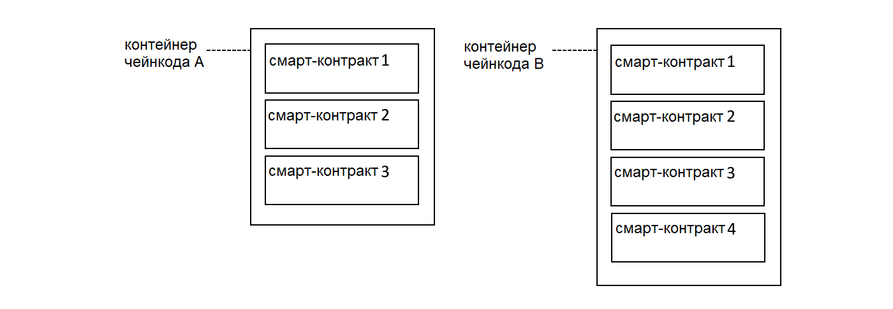
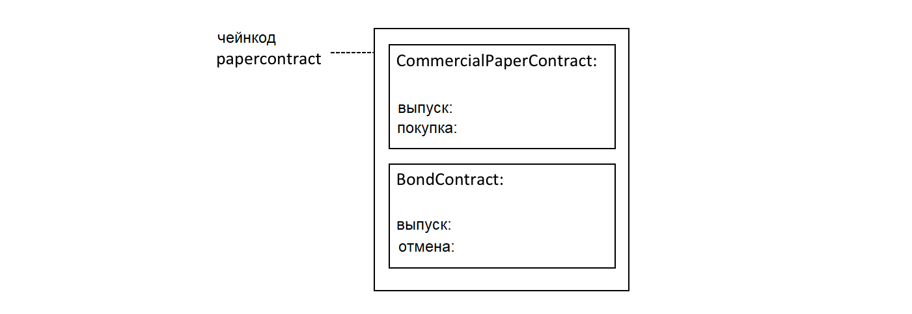

# Имена контрактов

**Аудитория**: Архитекторы, разработчики смарт-контрактов и приложений, администраторы

Чейнкод - это общий контейнер для развертывания кода в блокчейн-сети Hyperledger Fabric.
В рамках чейнкода определяется один или несколько связанных смарт-контрактов. У каждого смарт-контракта
есть уникальное в рамках чейнкода имя. Приложения обращаются к определенному смарт-контракту в чейнкоде
по его имени.

В этой главе мы опишем:
* [Как в чейнкоде может содержаться множество смарт-контрактов](#chaincode)
* [Как присвоить имя смарт-контракту](#name)
* [Как обратиться к смарт-контракту из приложения](#application)
* [Смарт-контракт по умолчанию](#default-contract)

## Чейнкод

В главе [Разработка приложений](./developing_applications.html) описано, как Fabric SDK 
предоставляет высокоуровневые абстракции, которые помогают разработчикам
приложений и смарт-контрактов фокусироваться на бизнес-логике, не вникая в подробности
низкоуровневого взаимодействия с сетью Fabric.

Смарт-контракты являются примером высокоуровневой абстракции программирования, и их можно
описать в контейнере чейнкода. Как только чейнкод установлен на вашем одноранговом узле и
развернут в канале, все его смарт-контракты становятся доступными для приложений.

 *В чейнкоде может быть определено множество смарт-контрактов.
У каждого из них есть уникальное внутри чейнкода имя.*

На диаграмме [выше](#chaincode), чейнкод A содержит три смарт-контракта, а чейнкод B –
четыре смарт-контракта. Обратите внимание, что для полной идентификации смарт-контракта используется имя чейнкода.

Структура реестра определяется набором развернутых смарт-контрактов. Причиной тому является
то, что реестр содержит факты о бизнес-объектах, представляющих интерес для сети (например, коммерческие
ценные бумаги в сети PaperNet), а эти бизнес-объекты в свою очередь проживают свой жизненный цикл
(в стадиях выпуска, покупки и погашения) посредством транзакций, функционально определенных внутри смарт-контрактов.

В большинстве случаев, в чейнкоде определен лишь один смарт-контракт.
Тем не менее, может иметь смысл держать в одном чейнкоде все взаимосвязанные
смарт-контракты. К примеру, коммерческие ценные бумаги, номинированные в различных валютах, могут
определяться смарт-контрактами `EuroPaperContract`, `DollarPaperContract` и
`YenPaperContract`, и для этих контрактов может требоваться взаимная синхронизация в том канале,
в котором они развернуты.

## Имя

Каждый смарт-контракт внутри чейнкода уникальным образом идентифицируется своим именем. Смарт-контракт может явно назначить
это имя при создании класса или позволить классу `Contract` неявно назначить имя по умолчанию.

Изучите чейнкод `papercontract.js`
[file](https://github.com/hyperledger/fabric-samples/blob/{BRANCH}/commercial-paper/organization/magnetocorp/contract/lib/papercontract.js#L31):

```javascript
class CommercialPaperContract extends Contract {

    constructor() {
        // Unique name when multiple contracts per chaincode file
        super('org.papernet.commercialpaper');
    }
```

Здесь конструктор `CommercialPaperContract` задает имя контракта как
`org.papernet.commercialpaper`. В результате внутри чейнкода `papercontract`
этот смарт-контракт связан с именем контракта `org.papernet.commercialpaper`.

Если имя контракта не задано явным образом, тогда ему присваивается имя по умолчанию
-- имя класса. В нашем примере имя контракта по умолчанию будет -- `CommercialPaperContract`.

Выбирайте имена с осторожностью. Дело даже не в том, что у каждого
смарт-контракта имя должно быть уникальным, но еще и в том, что оно должно быть
"говорящим" для того, кто его читает. В частности, рекомендуется использовать явный порядок
присвоения имен по образцу DNS -- для того, чтобы названия были прозрачными и со смыслом.
Так, например, имя `org.papernet.commercialpaper` означает, что этот контракт задан
для стандартных коммерческих ценных бумаг на сети PaperNet.

Имена контрактов также помогают различать одинаково названные функции транзакций разных смарт-контрактов
в одном чейнкоде. Такое бывает, когда смарт-контракты тесно связаны; в таком случае
имена их транзакций также бывают одинаковыми. Мы видим, что транзакция однозначным определяется
в канале комбинацией имени ее своего чейнкода и имени смарт-контракта.

Имена контрактов должны быть уникальными внутри одного файла чейнкода. Некоторые редакторы
кода могут распознавать множественные определения одного и того же класса перед развертыванием.
Вне зависимости от этого, чейнкод будет выдавать ошибку, если несколько классов явным или неявным образом
будут заданы для одного и того же смарт-контракта.

## Приложение

Как только чейнкод будет установлен на узле и развернут в канале, его смарт-контракты станут доступны приложению:

```javascript
const network = await gateway.getNetwork(`papernet`);

const contract = await network.getContract('papercontract', 'org.papernet.commercialpaper');

const issueResponse = await contract.submitTransaction('issue', 'MagnetoCorp', '00001', '2020-05-31', '2020-11-30', '5000000');
```

Из приведенного примера видно, как приложение обращается к смарт-контракту через вызов метода
`network.getContract()`. По имени смарт-контракта `org.papernet.commercialpaper` из чейнкода `papercontract` 
получается ссылка на объект `contract`, который используется для отправки транзакций по выпуску
коммерческих ценных бумаг в вызове функции API `contract.submitTransaction()`.

## Контракт по умолчанию

Первый смарт-контракт, определенный в чейнкоде, называется контрактом *по умолчанию*.
Контракт по-умолчанию облегчает работу, потому что в чейнкоде обычно определяется один смарт-контракт;
а обращение по умолчанию позволяет приложению обращаться к транзакциям напрямую, без указания
названия контракта.

 *Смарт-контракт по умолчанию - это первый контракт,
определенный в чейнкоде.*

Согласно этой диаграмме, `CommercialPaperContract` - контракт по-умолчанию.
Даже если бы у нас было два смарт-контракта, смарт-контракт по-умолчанию облегчил бы написание
нашего [предыдущего](#application) примера:

```javascript
const network = await gateway.getNetwork(`papernet`);

const contract = await network.getContract('papercontract');

const issueResponse = await contract.submitTransaction('issue', 'MagnetoCorp', '00001', '2020-05-31', '2020-11-30', '5000000');
```

Такой способ работает, потому что смарт-контракт по-умолчанию в `papercontract` - это
`CommercialPaperContract` и в нем имеется транзакция `issue`. Заметим, что транзакция
`issue` в `BondContract` может быть вызвана только явным образом. Сходным образом, несмотря
на то, что транзакция `cancel` уникальна, она может быть вызвана только явным образом, потому что
принадлежит смарт-контракту `BondContract`, который *не* является смарт-контрактом по-умолчанию.

В большинстве случаев чейнкод содержит единственный смарт-контракт, так что аккуратный выбор
имен в чейнкоде снижает заботы разработчиков о самом чейнкоде как о концепции. 
В случае кода, приведенного [выше](#default-contract) кажется, что `papercontract` и есть смарт-контракт.

В целом, имена контрактов - это простой механизм идентификации смарт-контрактов внутри
заданного чейнкода. Имена контрактов позволяют приложениям легко находить конкретный смарт-контракт и
использовать его для доступа к реестру.

<!--- Licensed under Creative Commons Attribution 4.0 International License
https://creativecommons.org/licenses/by/4.0/ -->
