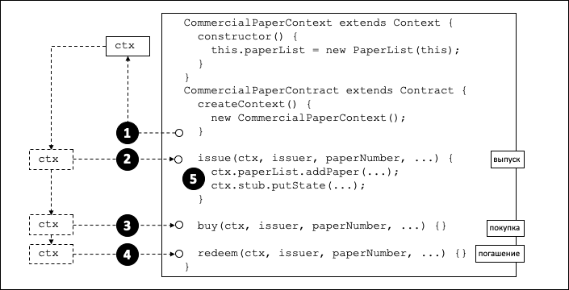
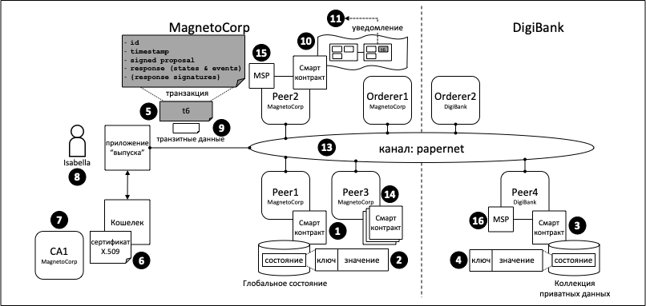

# Контекст транзакции

**Аудитория**: Архитекторы, разработчики смарт-контрактов и приложений.

Контекст транзакции исполняет две функции. Во-первых, он позволяет разработчику
определять и поддерживать пользовательские переменные во время вызовов транзакций в рамках
смарт-контракта. Во-вторых, он предоставляет доступ к широкому спектру API Fabric, 
которые позволяют разработчикам смарт-контрактов выполнять операции, связанные
с детальной обработкой транзакций: от запросов или обновления реестра, как неизменяемого блокчейна,
так и изменяемого состояния, до получения цифрового идентификатора приложения, отправляющего транзакцию.

Контекст транзакции создается, когда смарт-контракт развертывается в канале и становится доступным
для каждого последующего вызова в транзакции. Контекст транзакции позволяет разработчикам
смарт-контрактов писать функциональные, эффективные и легкие для понимания программы.

* [Почему контекст транзакции важен](#scenario)
* [Как пользоваться контекстом транзакции](#programming)
* [Что он содержит контекст транзакции](#structure)
* [`stub` в контексте транзакции](#stub)
* [`clientIdentity` в контексте транзакции](#clientIdentity)

## Сценарий

В примере коммерческих ценных бумаг, контракт
[papercontract](https://github.com/hyperledger/fabric-samples/blob/{BRANCH}/commercial-paper/organization/magnetocorp/contract/lib/papercontract.js) 
изначально задает имя списка коммерческих ценных бумаг, за которые отвечает. 
Каждая транзакция впоследствии ссылается на этот список; транзакция
выпуска добавляет в него новые бумаги, транзакция покупки меняет владельца бумаги, а
транзакция погашения помечает ее как завершенную. Это общий шаблон; при написании
смарт-контракта часто полезно инициализировать переменные и обращаться к ним в последовательных
транзакциях.

 *Контекст транзакции 
позволяет смарт-контрактам задавать и поддерживать пользовательские переменные в различных
вызовах транзакций. Подробное пояснение см. в тексте.*

## Программирование

При конструировании смарт-контракта разработчик может по желанию переопределить метод `createContext`
встроенного класса `Context`, чтобы создать собственный контекст:

```JavaScript
createContext() {
    new CommercialPaperContext();
}
```

В нашем примере контекст `CommercialPaperContext` определен для контракта `CommercialPaperContract`.
Посмотрите, как пользовательский контекст, адресованный через `this`,
добавляет в себя определенную переменную `PaperList`:

```JavaScript
CommercialPaperContext extends Context {
    constructor () {
        this.paperList = new PaperList(this);
    }
}
```

Когда метод createContext() возвращается в точку **(1)** на диаграмме
[выше](#scenario), создается пользовательский контекст `ctx`, содержащий
`paperList` как одну из своих переменных.

Впоследствии, когда бы ни вызывалась транзакция смарт-контракта, будь то выпуск, покупка
или погашение, ей будет передан этот контекст. Ниже покажем, как в точках **(2)**, **(3)**
и **(4)** тот же контекст коммерческой ценной бумаги передается в  метод при помощи
переменной `ctx`.

Посмотрите, как контекст используется в точке **(5)**:

```JavaScript
ctx.paperList.addPaper(...);
ctx.stub.putState(...);
```

Обратите внимание, что `paperList`, созданный в `CommercialPaperContext`, доступен в
транзакции **выпуска**. Аналогичным образом `paperList` используется
и для транзакций **погашения** и **покупки**; `ctx` таким образом делает смарт-контракты
эффективными и понятными.

Также обратите внимание, что в контексте есть и другой элемент -- `ctx.stub` --
который не был явным образом добавлен `CommercialPaperContext`. Это оттого, что
`stub` и прочие переменные являются частью встроенного контекста. Давайте теперь
изучим структуру этого встроенного контекста, эти неявные переменные и как их использовать.

## Структура

Как мы видели в [примере](#программирование), контекст транзакции может
содержать сколько угодно пользовательских переменных, таких как `paperList`.

Контекст транзакции также содержит два встроенных элемента, которые предоставляют
доступ к широкому спектру функциональности Fabric -- от клиентского приложения, посылающего
транзакцию, до доступа к реестру.

  * `ctx.stub` используется для доступа к API, которые предоставляют широкий диапазон
    операций обработки транзакций, от `putState()` и `getState()` для доступа к реестру,
    до `getTxID()` для извлечения идентификатора текущей транзакции.

  * `ctx.clientIdentity` используется для получения информацию об идентификаторе пользователя,
    пославшего транзакцию.

На следующей диаграмме показано, что может сделать смарт-контракт, используя `stub` and `clientIdentity`,
с помощью доступных ему API:

 *Смарт-контракт может получить доступ к ряду
возможностей через `stub` и `clientIdentity` из контекста транзакции. Подробное пояснение - далее в тексте.*

## Stub

Функционал `stub` можно поделить на несколько категорий:

* **API базы состояния**. См. точку взаимодействия **(1)**. Эти функции
  дают смарт-контрактам возможность получать, записывать и удалять состояния, соответствующее
  отдельным объектам в глобальном состоянии, используя их ключ:

    * [getState()](https://hyperledger.github.io/fabric-chaincode-node/{BRANCH}/api/fabric-shim.ChaincodeStub.html#getState__anchor)
    * [putState()](https://hyperledger.github.io/fabric-chaincode-node/{BRANCH}/api/fabric-shim.ChaincodeStub.html#putState__anchor)
    * [deleteState()](https://hyperledger.github.io/fabric-chaincode-node/{BRANCH}/api/fabric-shim.ChaincodeStub.html#deleteState__anchor)

  <br> Эти основные функции дополняются запросами, при помощи которых контракты могут получать набор состояний, 
  а не только отдельные состояния. См. точку взаимодействия **(2)**. Набор можно задавать или диапазоном значений ключей,
  полных или частичных, или запросом в соответствии со значениями соответствующей 
  [базы данных](../ledger/ledger.html#world-state-database-options) состояний.  
  При больших запросах, результат можно делить на страницы из соображений уменьшения занимаемого места:

    * [getStateByRange()](https://hyperledger.github.io/fabric-chaincode-node/{BRANCH}/api/fabric-shim.ChaincodeStub.html#getStateByRange__anchor)
    * [getStateByRangeWithPagination()](https://hyperledger.github.io/fabric-chaincode-node/{BRANCH}/api/fabric-shim.ChaincodeStub.html#getStateByRangeWithPagination__anchor)
    * [getStateByPartialCompositeKey()](https://hyperledger.github.io/fabric-chaincode-node/{BRANCH}/api/fabric-shim.ChaincodeStub.html#getStateByPartialCompositeKey__anchor)
    * [getStateByPartialCompositeKeyWithPagination()](https://hyperledger.github.io/fabric-chaincode-node/{BRANCH}/api/fabric-shim.ChaincodeStub.html#getStateByPartialCompositeKeyWithPagination__anchor)
    * [getQueryResult()](https://hyperledger.github.io/fabric-chaincode-node/{BRANCH}/api/fabric-shim.ChaincodeStub.html#getQueryResult__anchor)
    * [getQueryResultWithPagination()](https://hyperledger.github.io/fabric-chaincode-node/{BRANCH}/api/fabric-shim.ChaincodeStub.html#getQueryResultWithPagination__anchor)

* **API приватных данных**. См. точку взаимодействия **(3)**. При помощи
  этих функций смарт-контракты взаимодействуют с коллекциями приватных данных. Они
  аналогичны API для взаимодействия с глобальными состояниями и позволяют получать,
  записывать и удалять приватные данные, обращаясь к ним по их ключу:

    * [getPrivateData()](https://hyperledger.github.io/fabric-chaincode-node/{BRANCH}/api/fabric-shim.ChaincodeStub.html#getPrivateData__anchor)
    * [putPrivateData()](https://hyperledger.github.io/fabric-chaincode-node/{BRANCH}/api/fabric-shim.ChaincodeStub.html#putPrivateData__anchor)
    * [deletePrivateData()](https://hyperledger.github.io/fabric-chaincode-node/{BRANCH}/api/fabric-shim.ChaincodeStub.html#deletePrivateData__anchor)

  <br> Эти основные функции дополняются запросами приватных данных **(4)**.
  С их помощью смарт-контракты извлекают набор состояний из коллекций приватных данных
  по диапазону значений ключей (полных или частичных) или запросом в соответствии со значениями
  соответствующей [базы данных](../ledger/ledger.html#world-state-database-options)
  состояния. В настоящее время нет возможности разделения на страницы для коллекций приватных данных.

    * [getPrivateDataByRange()](https://hyperledger.github.io/fabric-chaincode-node/{BRANCH}/api/fabric-shim.ChaincodeStub.html#getPrivateDataByRange__anchor)
    * [getPrivateDataByPartialCompositeKey()](https://hyperledger.github.io/fabric-chaincode-node/{BRANCH}/api/fabric-shim.ChaincodeStub.html#getPrivateDataByPartialCompositeKey__anchor)
    * [getPrivateDataQueryResult()](https://hyperledger.github.io/fabric-chaincode-node/{BRANCH}/api/fabric-shim.ChaincodeStub.html#getPrivateDataQueryResult__anchor)

* **API транзакций**. См. точку взаимодействия **(5)**. Этими функциями смарт-контракты
  извлекают подробные данные о предложении транзакции, обрабатываемом
  смарт-контрактом в настоящее время. Они включают и идентификатор транзакции
  и время создания предложения транзакции.

    * [getTxID()](https://hyperledger.github.io/fabric-chaincode-node/{BRANCH}/api/fabric-shim.ChaincodeStub.html#getTxID__anchor)
      возвращает идентификатор предложения транзакции **(5)**.
    * [getTxTimestamp()](https://hyperledger.github.io/fabric-chaincode-node/{BRANCH}/api/fabric-shim.ChaincodeStub.html#getTxTimestamp__anchor)
      возвращает метку времени создания приложением предложения транзакции **(5)**.
    * [getCreator()](https://hyperledger.github.io/fabric-chaincode-node/{BRANCH}/api/fabric-shim.ChaincodeStub.html#getCreator__anchor)
      возвращает необработанный идентификатор (X.509 или др.) создателя предложения
      транзакции. Если это сертификат X.509, тогда бывает удобнее использовать [`ctx.ClientIdentity`](#clientidentity).
    * [getSignedProposal()](https://hyperledger.github.io/fabric-chaincode-node/{BRANCH}/api/fabric-shim.ChaincodeStub.html#getSignedProposal__anchor)
      возвращает подписанную копию текущего предложения транзакции, находящегося в обработке у смарт-контракта.
    * [getBinding()](https://hyperledger.github.io/fabric-chaincode-node/{BRANCH}/api/fabric-shim.ChaincodeStub.html#getBinding__anchor)
      предотвращает случайный или злонамеренный повторный вызов транзакции при помощи одноразового кода (nonce).
      (На практике, одноразовый код - это случайно сгенерированное клиентским приложением число,
      включенное в криптографический хэш). К примеру, эта функция может использоваться смарт-контрактом в точке **(1)**,
      чтобы обнаружить повторный вызов транзакции **(5)**.
    * [getTransient()](https://hyperledger.github.io/fabric-chaincode-node/{BRANCH}/api/fabric-shim.ChaincodeStub.html#getTransient__anchor)
      позволяет смарт-контракту обращаться к транзитным данным, переданным приложением. 
      См. точки взаимодействия **(9)** и **(10)**.
      Транзитные данные являются приватными данными взаимодействия "приложение-смарт-контракт".
      Они не записываются в реестр и часто используются вместе с коллекциями приватных данных **(3)**.

  <br>

* **API ключей** используется смарт-контрактами для операций с ключами состояния в
  глобальном состоянии или коллекции приватных данных. См. точки взаимодействия **2** и **4**.

  Простейшие из функций этого API позволяют смарт-контрактам формировать и разделять
  композитные ключи на их отдельные компоненты. Немного более продвинутыми являются API
  `ValidationParameter()`, которые получают и устанавливают основанные на состоянии правила одобрения
  для глобального состояния **(2)** и приватных данных **(4)**.
  И, наконец, `getHistoryForKey()` получает историю состояния, возвращая набор
  хранимых значений, включающих идентификаторы транзакции, с помощью которых было
  проведено изменение состояния, что позволяет прочитать транзакцию из блокчейна **(10)**.

    * [createCompositeKey()](https://hyperledger.github.io/fabric-chaincode-node/{BRACNH}/api/fabric-shim.ChaincodeStub.html#createCompositeKey__anchor)
    * [splitCompositeKey()](https://hyperledger.github.io/fabric-chaincode-node/{BRANCH}/api/fabric-shim.ChaincodeStub.html#splitCompositeKey__anchor)
    * [setStateValidationParameter()](https://hyperledger.github.io/fabric-chaincode-node/{BRANCH}/api/fabric-shim.ChaincodeStub.html#setStateValidationParameter__anchor)
    * [getStateValidationParameter()](https://hyperledger.github.io/fabric-chaincode-node/{BRANCH}/api/fabric-shim.ChaincodeStub.html#getStateValidationParameter__anchor)
    * [getPrivateDataValidationParameter()](https://hyperledger.github.io/fabric-chaincode-node/{BRANCH}/api/fabric-shim.ChaincodeStub.html#getPrivateDataValidationParameter__anchor)
    * [setPrivateDataValidationParameter()](https://hyperledger.github.io/fabric-chaincode-node/{BRANCH}/api/fabric-shim.ChaincodeStub.html#setPrivateDataValidationParameter__anchor)
    * [getHistoryForKey()](https://hyperledger.github.io/fabric-chaincode-node/{BRANCH}/api/fabric-shim.ChaincodeStub.html#getHistoryForKey__anchor)

  <br>

* **API событий** используются для работы с событиями в смарт-контракте.

    * [setEvent()](https://hyperledger.github.io/fabric-chaincode-node/{BRANCH}/api/fabric-shim.ChaincodeStub.html#setEvent__anchor)

      Смарт-контракты при помощи этого API добавляют пользовательские события
      в ответ транзакции. См. точку взаимодействия **(5)**. Эти события в итоге
      записываются в блокчейн и посылаются в ожидающие приложения в точке взаимодействия **(11)**.

    <br>

* **Вспомогательные API** -- это набор полезных API, которые не поместились в другие
  категории. С их помощью можно, в частности, получать имя текущего канала и
  передавать управление другому чейнкоду на одном и том же узле.

    * [getChannelID()](https://hyperledger.github.io/fabric-chaincode-node/{BRANCH}/api/fabric-shim.ChaincodeStub.html#getChannelID__anchor)

      См. точку взаимодействия **(13)**.  Смарт-контракт, запущенный на любом одноранговом узле
      может при помощи этого API определить, на каком канале данное приложение
      вызвало смарт-контракт.

    * [invokeChaincode()](https://hyperledger.github.io/fabric-chaincode-node/{BRANCH}/api/fabric-shim.ChaincodeStub.html#invokeChaincode__anchor)

      См. точку взаимодействия **(14)**.  На Peer3 (одноранговом узле 3), принадлежащем MagnetoCorp,
      установлено несколько смарт-контрактов. Эти смарт-контракты способны вызывать друг друга
      с помощью этого API. Смарт-контракты должны быть расположены в одном и том же узле,
      вызвать смарт-контракт с другого узла не получится.

    <br> Некоторые из вспомогательных API используются только в низкоуровневом чейкоде, а не в смарт-контрактах.
    Эти API предназначены прежде всего для операций с вводными данными чейнкода;
    класс `Contract` смарт-контракта делает автоматический разбор этих параметров для разработчиков.

    * [getFunctionAndParameters()](https://hyperledger.github.io/fabric-chaincode-node/{BRANCH}/api/fabric-shim.ChaincodeStub.html#getFunctionAndParameters__anchor)
    * [getStringArgs()](https://hyperledger.github.io/fabric-chaincode-node/{BRANCH}/api/fabric-shim.ChaincodeStub.html#getStringArgs__anchor)
    * [getArgs()](https://hyperledger.github.io/fabric-chaincode-node/{BRANCH}/api/fabric-shim.ChaincodeStub.html#getArgs__anchor)

## ClientIdentity

В большинстве случаев, приложение, которое посылает транзакцию, использует
сертификат X.509. В нашем [примере](#структура), сертификат X.509 **(6)**, выпущенный
УЦ `CA1` **(7)**, используется пользователем `Isabella` **(8)** в ее приложении для
подписывания транзакции `t6` **(5)**.

`ClientIdentity` принимает информацию, которую возвращает ему `getCreator()`, и помещает
поверх ее набор вспомогательных API X.509, чтобы облегчить ее использование в данном
часто встречающемся сценарии.

* [getX509Certificate()](https://hyperledger.github.io/fabric-chaincode-node/{BRANCH}/api/fabric-shim.ClientIdentity.html#getX509Certificate__anchor)
  возвращает полный сертификат X.509 того, кто послал транзакцию, включая все его атрибуты
  и их значения. См. точку взаимодействия **(6)**.
* [getAttributeValue()](https://hyperledger.github.io/fabric-chaincode-node/{BRANCH}/api/fabric-shim.ClientIdentity.html#getAttributeValue__anchor)
  возвращает значение конкретного атрибута X.509, например, название организационной единицы
  `OU` или выделенное имя `DN`. См. точку взаимодействия **(6)**.
* [assertAttributeValue()](https://hyperledger.github.io/fabric-chaincode-node/{BRANCH}/api/fabric-shim.ClientIdentity.html#assertAttributeValue__anchor)
  возвращает `TRUE`, если определенный атрибут X.509 имеет заданное значение.
  См. точку взаимодействия **(6)**.
* [getID()](https://hyperledger.github.io/fabric-chaincode-node/{BRANCH}/api/fabric-shim.ClientIdentity.html#getID__anchor)
  возвращает уникальный идентификатор того, кто послал транзакцию в соответствии с его
  выделенным именем и выделенным именем выпускающего УЦ в формате `x509::{subject DN}::{issuer DN}`.
  См. точку взаимодействия **(6)**.
* [getMSPID()](https://hyperledger.github.io/fabric-chaincode-node/{BRANCH}/api/fabric-shim.ClientIdentity.html#getMSPID__anchor)
  возвращает MSP канала того, кто послал транзакцию. Это позволяет смарт-контракту принимать
  решения об обработке решений на основе идентификатора организации пославшего.
  См. точку взаимодействия **(15)** or **(16)**.

<!--- Licensed under Creative Commons Attribution 4.0 International License
https://creativecommons.org/licenses/by/4.0/ -->
