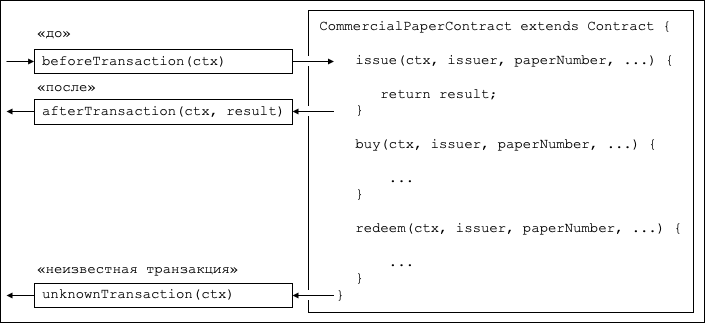

# Обработчики транзакций
**Аудитория**: Архитекторы, разработчики смарт-контрактов и приложений.

Обработчики транзакций позволяют разработчикам смарт-контрактов определять общую обработку
в ключевых точках взаимодействия приложения и смарт-контракта. Обработчики транзакций не обязательны,
но, если они определены, они будут получать управление до или после каждой транзакции в вызванном смарт-контракте.
Также есть специальный обработчик, который получает управление, когда производится запрос на вызов
транзакции, не определенной в смарт-контракте.

Рассмотрим работу обработчиков транзакций на [примере смарт-контракта коммерческой ценной бумаги](./smartcontract.html):



*Обработчики "До", "После" и "Неизвестная транзакция". 
В данном примере `beforeTransaction()` вызывается до транзакций **issue**, **buy** и **redeem**.
`afterTransaction()` вызывается после этих транзакций. 
`unknownTransaction()` вызывается только в случае запроса на вызов транзакции, не определенной в смарт-контракте.
(Диаграмма упрощена за счет исключения повторения обозначений `beforeTransaction` и `afterTransaction` для каждой транзакции)*

## Типы обработчиков

Есть три типа обработчиков, и они отвечают за разные аспекты взаимодействия приложения и смарт-контракта:

  * **Обработчик "до"** вызывается перед любой транзакцией смарт-контракта.
    Обычно при этом обработчик изменяет контекст данной транзакции.
    У обработчика есть доступ к полному набору API Fabric; например, он
    может выполнить операции `getState()` и `putState()`.


  * **Обработчик "после"** вызывается после каждой транзакции смарт-контракта.
    Обработчик обычно проделывает пост-обработку, одинаковую для всех транзакций;
    у него также есть полный доступ к интерфейсам API Fabric.


  * **Обработчик "неизвестная транзакция"** вызывается при обнаружении попытки вызова транзакции,
    не определенной в смарт-контракте. Обычно обработчик производит запись об отказе для
    последующей обработки администратором. Этот обработчик тоже наделен полным доступом к интерфейсам API Fabric.

Определение обработчиков транзакций необязательно; смарт-контракт будет работать и без них. В смарт-контракте
может быть определен только один обработчик каждого типа.

## Определение обработчика

Обработчики транзакций добавляются в смарт-контракт в виде методов с четко определенными именами.
Покажем пример добавления обработчика каждого типа:

```JavaScript
CommercialPaperContract extends Contract {

    ...

    async beforeTransaction(ctx) {
        // Вывод ID транзакции на консоль
        console.info(ctx.stub.getTxID());
    };

    async afterTransaction(ctx, result) {
        // Этот обработчик взаимодействует с реестром
        ctx.stub.cpList.putState(...);
    };

    async unknownTransaction(ctx) {
        // Этот обработчик выбрасывает исключение
        throw new Error('Unknown transaction function');
    };

}
```

Форма определения обработчика транзакции одинакова для всех типов обработчиков, но
обратите внимание, что `afterTransaction(ctx, result)` также получает результат,
возвращенный транзакцией. В [документации API](https://hyperledger.github.io/fabric-chaincode-node/{BRANCH}/api/fabric-contract-api.Contract.html)
показаны точные формы этих обработчиков.

## Обработка транзакции

Как только обработчик добавлен в смарт-контракт, он будет вызван при обработке транзакции.
Во время обработки обработчик получает [контекст транзакции](./transactioncontext.html) `ctx`,
выполняет обработку, и затем возвращает управление по завершении.
Обработка происходит следующим образом:

* **Обработчик "до"**: Если обработчик завершает работу успешно, транзакция
  выполняется с измененным контекстом. Если обработчик выбрасывает исключение, то транзакция
  не выполняется и смарт-контракт заканчивает работу сбоем и сообщением об ошибке.


* **Обработчик "после"**: Если обработчик завершает работу успешно, то смарт-контракт
  завершает работу так, как это определено вызванной транзакцией. Если обработчик выкидывает
  исключение, тогда транзакция завершается сбоем и сообщением об ошибке.


* **Обработчик "неизвестная транзакция"**: Обработчик должен выбросить исключение с
  соответствующим сообщением об ошибке по завершению работы. Если этот обработчик не определен 
  или не выдает исключения, тогда происходит обработка "по умолчанию": смарт-контракт заканчивает работу сбоем и
  выдает сообщение об ошибке **неизвестная транзакция**.

Если обработчику требуется доступ к функции и параметрам, это делается так:

```JavaScript
async beforeTransaction(ctx) {
    // Извлечение подробных данных транзакции
    let txnDetails = ctx.stub.getFunctionAndParameters();

    console.info(`Calling function: ${txnDetails.fcn} `);
    console.info(util.format(`Function arguments : %j ${stub.getArgs()} ``);
}
```

Покажем, как этот обработчик пользуется функцией API `getFunctionAndParameters`
при помощи [контекста транзакции](./transactioncontext.html#stub).

## Множественные обработчики

В смарт-контракте может быть определен только один обработчик каждого типа. В том случае,
если смарт-контракту нужно вызвать несколько функций до или после обработки транзакции
или при обработке неизвестной транзакции, это нужно определять внутри соответствующей функции.
