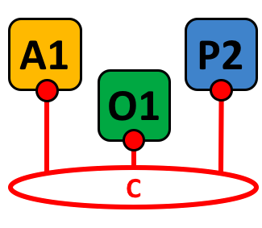

Глоссарий
=========

Терминология важна, поскольку именно благодаря ей пользователи и разработчики Hyperledger Fabric понимают, что мы подразумеваем, используя тот или иной термин.
Например, что такое смарт-контракт. Документация часто ссылается на глоссарий, но можно прочитать его и просто так, это довольно познавательно!

.. _Anchor-Peer:

Anchor-пир
----------

Используется gossip-протоколом, чтобы соединять пиры разных организаций и для обнаружения других пиров.

Когда сохраняется конфигурационный блок с обновлением anchor-пира, пиры подсоединяются к anchor-пиру, чтобы
узнать о всех пирах, известных anchor-пиру. Как только хотя бы один пир от каждой организации канала соединился с anchor-пиром,
последний узнает обо всех пирах канала. Так как gossip-связь постоянна и пиры всегда просят рассказать о неизвестных им пирах,
через anchor-пиры устанавливается представление о акторах канала.

Например, предположим, что мы имеем три организации --- ``A``, ``B``, ``C`` --- в канале и
один anchor-пир --- ``peer0.orgC`` --- определенный для организации ``C``.
Когда ``peer1.orgA`` (из организации ``A``) соединится с ``peer0.orgC``, он расскажет
``peer0.orgC`` про ``peer0.orgA``. А когда позже ``peer1.orgB``
соединится с ``peer0.orgC``, первый расскажет последнему о ``peer0.orgB``.
После этого организации ``A`` и ``B`` начнут обмениваться информацией об акторах без
прямой помощи от ``peer0.orgC``.

Так как межорганизационная связь нуждается в работе gossip-протокола, в конфигурации канала должен
быть определен хотя бы один anchor-пир. Крайне рекомендуется каждой организации предоставить
свой набор anchor-пиров для избыточности и высокой доступности (high availability and redundancy).

.. _glossary_ACL:

ACL
---

ACL, или Access Control List, назначает доступ к определенным ресурсам пиров
(таким как API-интерфейсы системного чейнкода или событийные службы)
через Policy_ - политику доступа (она определяет количество и типы организаций и ролей,
которым предоставляется доступ). ACL - часть конфигурации канала,
поэтому она содержится в конфигурационном блоке канала и может быть обновлена через стандартный механизм обновления конфигурации.

ACL задается как список пар ключ-значение, где ключ - это ресурс, а значение - политика доступа.
Например, наличие в этом списке пары ``lscc/GetDeploymentSpec: /Channel/Application/Readers`` означает,
что доступ к функции life cycle chaincode API (``lscc``, API жизненного цикла чейнкода) ``GetDeploymentSpec`` (это ресурс) доступен identities,
удовлетворяющим политике ``/Channel/Application/Readers``.

Набор стандартных ACL приведен в файле ``configtx.yaml``, который ``configtxgen`` использует для создания конфигурации канала.
Этот набор находится в секции ``Application`` файла ``configtx.yaml``. Он может быть переопределен для конкретного профиля в секции ``Profiles``.

.. _Block:

Блок
-----

.. figure:: ./glossary/glossary.block.png
   :scale: 50 %
   :align: right
   :figwidth: 40 %
   :alt: A Block

   Блок B1 привязан к блоку B0. Блок B2 привязан к блоку B1.

=======

Блок содержит упорядоченный набор транзакций. Он криптографически привязан к предыдущему блоку, а также связан с последующими блоками.
Первый блок в цепи блоков называется **genesis-блоком**. Блоки создаются ordering-службой, а потом валидируются и вносятся в реестр пирами.

.. _Chain:

Блокчейн
--------

.. figure:: ./glossary/glossary.blockchain.png
   :scale: 75 %
   :align: right
   :figwidth: 40 %
   :alt: Blockchain

   Блокчейн B contains blocks 0, 1, 2.

=======

Блокчейн реестра --- журнал транзакций, структурированный в виде блоков транзакций,
связанных между собой с помощью хешей. Пиры получают блоки от ордеринг-службы, помечают
транзакции блока как валидные или невалидные, основываясь на политиках подтверждения и
нарушений, связанных с параллелизмом, и добавляют блок в локальную копию блокчейна на
файловой системе пира.

.. _chaincode:

Чейнкод
-------

См Smart-Contract_.

.. _Channel:

Канал
-------

   Канал C объединяет приложение A1, пир P2 и ordering-службу O1.

=======

Канал --- это приватный блокчейн-оверлей, обеспечивающий изоляцию и
конфиденциальность. Реестр канала распространен между пирами канала, и стороны транзакций должны
быть аутентифицированы в канале для взаимодействий с ним. Каналы определяются через Configuration-Block_.

.. _Commit:

Сохранение (Commit)
-------------------

Каждый Peer_ канала проверяет блоки транзакций и затем сохраняет (commits, записывает/добавляет)
блоки в свою копию реестра канала.

.. _Concurrency-Control-Version-Check:

Проверка версий
---------------

Проверка версий для контроля параллелизма (Concurrency Control Version Check) --- метод, обеспечивающий синхронизацию
состояния реестра между пирами канала. Пиры могут выполнять транзакции одновременно, параллельно,
и прежде чем сохранять транзакцию в реестр, пиры проверяют, было ли состояние, которое было
считано для выполнения транзакции, изменено с момента выполнения. Если данные, использовавшиеся транзакцией,
были изменены между выполнением смартконтракта и сохранением транзакции, тогда это нарушение
проверки версий, транзакция помечается в реестре как невалидная и не обновляет значения
state-БД.

.. _Configuration-Block:

Конфигурационный блок
---------------------

Содержит конфигурационные данные, определяющие участников и политики системного
канала (ордеринг-службы) или обычного канала. Любое изменение конфигурации
(например, исключение или добавление участника) ведет к созданию нового
конфигурационного блока, добавляющегося в соответствующий блокчейн.
Этот блок включает содержимое genesis-блока + изменения.

.. _Consensus:

Консенсус
---------

Широкое понятие, охватывающее весь транзакционный поток, служащий для того, чтобы
создать согласие на порядок транзакций и их корректность. Это согласие образует блок.

.. _Consenter-Set:

Consenter set
-------------

В ордеринг-службе на основе Raft существуют ордеринг-узлы, активно участвующие
в механизме достижения консенсуса на канале. Если ордеринг-узел существует в системном канале,
но не является частью данного канала, узел - элемент consenter set канала.

.. _Consortium:

Консорциум
----------

Консорциум (Consortium) - коллекция из организаций блокчейн-сети.
Эти организации могут образовывать каналы.
Хотя блокчейн-сеть может иметь несколько консорциумов, большинство блокчейн сетей имеют только один.
Во время создания канала, все организации, добавленные в канал, должны быть частью одного консорциума.
Однако организация, не определенная в консорциуме, может быть добавлена в существующий канал.

.. _Chaincode-definition:

Определение чейнкода
--------------------

Определение чейнкода (Chaincode definition) используется организациями чтобы прийти к согласию насчет
параметров чейнкода до того, как чейнкод сможет использоваться в канале.
Каждый участник канала, который хочет использовать чейнкод для создания или одобрения транзакций или
для совершения запросов по реестру, должен одобрить определение чейнкода для своей организации.
Когда достаточное количество участников канала одобрило определение чейнкода (такое, которое
удовлетворяет Политику подтверждения жизненного цикла, по умолчанию --- большинство оранизакций канала),
определение чейнкода будет сохранено в канал. После этого, первый вызов (invoke) чейнкода
(или, если так требуется, выполнение функции Init) запустит чейнкод на канале.

.. _Dynamic-Membership:

Динамический состав
-------------------

Hyperledger Fabric поддерживает добавление/исключение участников, пиров, ордеринг-узлов не
задевающее работу сети. Динамический состав (Dynamic Membership) крайне важен во время развития бизнес-отношений, когда разные
сущности должны быть исключены/добавлены по разным причинам.

.. _Endorsement:

Подтверждение (Endorsement)
---------------------------

Процесс, в котором указанные пиры выполняют чейнкод-транзакцию и возвращает proposal response
(ответ на предложение о транзакции) клиентскому приложению. Proposal response включает
в себя результат работы чейнкода, read set и write set, события и подпись, служащую
доказательством того, что пир выполнил чейнкод.
Чейнкод-приложения имеют соответствующие политики подтверждения, в которых указаны
подтверждающие пиры.

.. _Endorsement-policy:

Политика подтверждения
----------------------

Определяет пиры канала, которые должны выполнить транзакцию, связанную с определенным
чейнкод-приложением, и требуемый набор ответов (подтверждений).
Политика подтверждения (endorsement policy) может потребовать, например, чтобы транзакция была одобрена каким-то минимальным
количеством/процентом пиров или всеми пирами.
Политика может зависеть от конкретного приложения или от необходимого уровня устойчивости
от неправомерного поведения (умышленного или нет) подтверждающих пиров. Транзакция, предлагающаяся
на ордеринг, должна удовлетворять политике подтверждения, после чего сохраняющие пиры могут
отметить ее как валидную/невалидную.

.. _Follower:

Подписчик
---------

В консенсус-протоколе, основывающегося на идее лидерства, таком как Raft, подписчики (followers) ---
это узлы, копирующие записи журнала, произведенные лидером. В Raft, подписчики также получают
"heartbeat"-сообщения от лидера. В случае, когда лидер не посылает эти сообщения в течении (настраиваемого)
интервала времени, подписчики начнут выборы лидера и один из них будет выбран лидером.

.. _Genesis-Block:

Genesis-блок
------------

Конфигурационный блок, инициализирующий ордеринг-службу или служащий первым блоком блокчейна.

.. _Gossip-Protocol:

Gossip-протокол
---------------

Gossip-протокол распределения данных:
1) заведует обнаружением пиров (peer discovery) и составом канала (channel membership);
2) распределяет данные реестра по всем пирам канала;
3) синхронизирует состояние реестра всех пиров канала.

.. _Fabric-ca:

Hyperledger Fabric CA
---------------------

Hyperledger Fabric CA --- стандартный CA (сертификационный центр) компонент, который
выдает сертификаты инфраструктуры публичных ключей (Public Key Infrastructure, PKI)
участниками сети и их пользователям. CA выдает один корневой сертификат (rootCert) каждому
участнику и один enrollment-сертификат (ECert, enrollment --- зачисление) каждому авторизованному пользователю

.. _Init:

Init
----

Метод инициализации чейнкод-приложения. Все чейнкоды должны иметь функцию Init.
По умолчанию, эта функция никогда не выполняется, однако вы можете потребовать исполнение
Init через определение чейнкода для инициализации чейнкода.

Установить (Install)
--------------------

Процесс размещения чейнкода на файловой системе пира.

Инстанцировать (Instantiate)
----------------------------

Процесс запуска и инициализации чейнкод-приложения на конкретном канале.
После инстанцирования пиры, установившие чейнкод, могут принимать вызовы чейнкода.

**Обратите внимание**: *Этот метод, то есть Instantiate был использован в версиях 1.4.x и ниже
в старом жизненном цикле чейнкода. См. Chaincode-definition_ для текущей процедуры
запуска чейнкода на канале с новым жизненным циклом чейнкода, представленным в Fabric v2.0.*

.. _Invoke:

Вызвать (Invoke)
----------------

Вызвать чейнкод-функцию. Клиентское приложение вызывает чейнкод, посылай tx proposal на пир.
Пир выполняет чейнкод и возвращает подтвержденный proposal response приложению.
Приложение собирает достаточное для удовлетворения политики подтверждения количество responses,
а затем сдает транзакцию на ордеринг, проверку и сохранение. Приложение может решить не
сдавать транзакцию. Например, если вызов чейнкода только искал в реестре, приложение обычно
не пошлет такую read-only транзакцию, только если не хочет записать этот запрос к реестру
в целях проведения аудита. Вызов включает в себя идентификатор канала, функцию чейнкода, которую
надо исполнить, а так же массив аргументов.

.. _Leader:

Лидер
-----

В консенсус-протоколе, основывающегося на идее лидерства, таком как Raft, лидер
отвечает за создание новых записей журнала и отправку их подписчикам. Это не специальный
тип ордеринг-узла, а только роль, которую тот может на себя принять на некоторое
время.

.. _Leading-Peer:

Ведущий пир
-----------

Каждая Organization_ может иметь несколько пиров на каждом канале.
Один или более этих пиров должны быть ведущими пирами (leading peer) канала, которые
взаимодействуют с ордеринг-службой. Ордеринг-служба доставляет блоки ведущим пирам,
которые потом отправляют блоки всем остальным пирам той же организации.

.. _peecтpa:

Реестр
------

.. figure:: ./glossary/glossary.ledger.png
   :scale: 25 %
   :align: right
   :figwidth: 20 %
   :alt: A Ledger

   Реестр L

======

Реестр состоит из двух отдельных, но связанных c друг другом частей -- из блокчейна и
state-базы данных, также известной как "world state". В отличие от других реестров,
блокчейн **неизменяем** -- в том смысле, что с того момента, как блок был добавлен в блокчейн,
блок не может быть изменен. В то же время, "world state --- это база данных, содержащая
текущие значения набора пар ключ-значение которые были добавлены, изменены или удалены
набором провалидированных и сохраненных в блокчейн транзакций.

Полезно представлять, что на канале **логически** существует только один реестр. В реальности
на каждом пире есть своя копия реестра, синхронизируемая с копиями других пиров через
процесс под названием **консенсус**. Термин **Distributed Ledger Technology**
(**DLT**, **Технология распределенного реестра**) часто связывается именно с таким видом реестра -- таким, который логически един,
но физически представляет собой набор копий, распределенных по сети узлов (пиров и узлов ордеринг-службы).

.. _Log-entry:

Запись журнала
--------------

Основная рабочая единица Raft ордеринг-службы, записи журнала (log entries) распространяются от
лидера ордеринг-узлов ко всем остальным, его подписчикам. Полная последовательность таких записей
называется "журнал" (log). Предполагается, что журнал синхронизирован (is consistent), если все
участники приходят к согласию к содержимому записей и их порядку.

.. _Member:

Участник
--------

См. Organization_.

.. _MSP:

Membership Service Provider
---------------------------

.. figure:: ./glossary/glossary.msp.png
   :scale: 35 %
   :align: right
   :figwidth: 25 %
   :alt: An MSP

   MSP 'ORG.MSP'

Membership Service Provider (MSP, примерный перевод - "поставщик состава") --- абстрактный компонент
системы HL Fabric, поставляющий удостоверения пользователям и пирам, чтобы они могли
участвовать в сети Fabric. Клиенты используют эти удостоверения для аутентификации своих
транзакций, а пиры - для аутентификации результатов обработки транзакций (подтверждений).
Хотя MSP сильно связано со всем процессом обработки транзакций, его интерфейс определен так, что
его реализацию можно легко заменить без модификации основных компонент транзакционного процесса.

.. _Membership-Services:

Membership Services
-------------------

Membership Services (службы состава) аутентифицирует, авторизует и управляет identities.
Это основанная на PKI реализация MSP.

.. _Ordering-Service:

Ордеринг-служба
---------------

Также известная как **ордерер**. Определенный коллектив узлов, упорядочивающий транзакции в блоки, а затем
распространяющий блоки пирам для проверки и сохранения. Ордеринг-служба не зависит от пиров и упорядочивает
транзакции по принципу first-come-first-serve (чем раньше транзакция поступает, тем быстрее ее обработают).
Она спроектирована так, чтобы ее реализацию (Kafka или Raft) можно было легко заменить на пользовательскую.
Она соединяет всю сеть, и содержит криптографические identity-материалы, связанные с каждым Member_.

.. _Organization:

Организация
-----------

=====

.. figure:: ./glossary/glossary.organization.png
   :scale: 25 %
   :align: right
   :figwidth: 20 %
   :alt: An Organization

   Организация 'ORG'

Также известные как "участники" (members), организации включаются в сеть добавлением их MSP_ в сеть.
MSP определяет, как другие члены сети могут проверить, что подписи (например, подписи транзакций) были
созданы валидной identity, выпущенной этой организацией. Конкретные права identities определяются
политиками, к которым приходят организации, когда данная организация присоединяется к каналу.
Размер организации может быть произвольным. Актор организации, хранящий транзакции --- Peer_. Набор
организаций образует Consortium_. Хотя все организации сети являются ее членами, не каждая организация ---
часть консорциума.

.. _Peer:

Пир
---

.. figure:: ./glossary/glossary.peer.png
   :scale: 25 %
   :align: right
   :figwidth: 20 %
   :alt: A Peer

   Пир 'P'

Актор сети, поддерживающий копию реестра и исполняющий чейнкод для исполнения операций с реестром.
Пиры находятся во владении и поддерживаются участниками.

.. _Policy:

Политика
--------

Политики --- выражения, состоящие из параметров цифровых identity, например
``OR('Org1.peer', 'Org2.peer')``. Они используются чтобы ограничить доступ к ресурсам блокчейн-сети.
Например, они диктуют, кто может считывать с канала данные или записывать их в канал, или кто
может использовать определенное API чейнкода через ACL_.
Политики могут быть определены в ``configtx.yaml`` до первого запуска ордеринг-службы или создания канала,
или они могут быть определены во время инстанцирования чейнкода на канале.
Стандартный набор политик входит в пример ``configtx.yaml``, он подойдет для большинства сетей.

.. _glossary-Private-Data:

Конфиденциальные данные
-----------------------

Конфиденциальные данные, которые хранятся в конфиденциальной базе данных каждого авторизованного на это пира,
логически отделены от данных реестра канала. Доступ к этим данным ограничен одной или более организациям канала,
указанным в определении коллекции конфиденциальных данных. Неавторизованные организации будут иметь хеш
конфиденциальных данных в реестре канала как свидетельство определенного состояния этих данных.
Также для дополнительной конфиденциальности, ордеринг-службе поступают только хеши этих данных.

.. _glossary-Private-Data-Collection:

Коллекция конфиденциальных данных (Коллекция)
---------------------------------------------

Используется для управлениями конфиденциальными данными. Определение коллекции
описывает подмножество организаций канала, хранящих определенные конфиденциальные данные.

.. _Proposal:

Proposal
--------

Запрос на подтверждение, нацеленный на определенных пиров канала. Каждый proposal --- это запрос либо к Init, либо к Invoke.

.. _Query:

Query
-----

Query (поисковый запрос) --- вызов чейнкода, который читает текущее состояние реестра, но ничего в него не записывает.
Функиця чейнкода может запрашивать ключи из реестра. Так как такие запросы не обновляют состояние реестра,
приложения обычно не отправляют такие транзакции на ордеринг.

.. _Quorum:

Кворум
------

Минимальное количество участников кластера, которое должно утвердить
запрос на ордеринг транзакции, чтобы транзакция была упорядочена.
Для каждого consenter set, кворум (quorum) --- это **большинство** узлов. В кластере из 5 узлов три должны быть доступны для формирования
кворума. Если кворум сформировать не получается, то кластер становится не доступ для чтения и записи.

.. _Raft:

Raft
----

Поддерживаемая с v1.4.1, Raft --- устойчивая к сбоям (CFT) реализация ордеринг-службы
базирующаяся на `библиотеке etcd <https://coreos.com/etcd/>`_ `протокола Raft <https://raft.github.io/raft.pdf>`_. Raft использует модель
"Follower_ и Leader_". Raft проще поднять в роли ордеринг-службы, чем Kafka.

.. _SDK:

Software Development Kit (SDK)
------------------------------

Hyperledger Fabric client SDK обеспечивает структурированное окружение библиотек
для разработчиков для разработки и тестирования чейнкод-приложений.
SDK полностью настраивается и расширяется через стандартный интерфейс.
Компоненты, включающие криптографические алгоритмы, фреймворки для логирования и
хранения состояний, лего заменяются.
SDK включает APIs для обработки транзакции, работы с membership services, обхода узлов
и обработки событий.

.. _Smart-Contract:

Смартконтракт
-------------

Смартконтракт это код, вызываемый клиентскими приложениями, существующими вне блокчейн-сети,
изменяющий или считывающий World State.
В Hyperledger Fabric смартконтракты содержатся в Chaincode_.

.. _State-DB:

State-БД
--------

Данные World State хранятся в State-базе данных для эффективной обработки запросов
от чейнкода. Официально поддерживаются levelDB и couchDB.

.. _System-Chain:

Системный канал
---------------

Содержит конфигурационный блок, определяющий сеть на уровне системы.
Системный канал содержит ордеринг-службу, а так же обычную для всех каналов
информацию, как MSP, политики и т.д. Любое изменение общей сети (например, добавление
новой организации или нового ордеринг-узла) приведет к добавлению нового конфигурационного
блока в системный канал.

.. _Transaction:

Транзакция
----------

.. figure:: ./glossary/glossary.transaction.png
   :scale: 30 %
   :align: right
   :figwidth: 20 %
   :alt: A Transaction

   Транзакция 'T'

Транзакции создаются, когда клиент вызывает чейнкод. Клиенты приложений должны собрать набор Endorsement_ от нескольких
пиров на свой Proposal_, а потом (опционально) отослать результат на ордеринг, после чего транзакция попадет в блок и будет
распределена в этом блоке на пиры канала и сохранена в копию реестра на каждом пире.

.. _World-State:

Глобальное состояние
-----------

.. figure:: ./glossary/glossary.worldstate.png
   :scale: 40 %
   :align: right
   :figwidth: 25 %
   :alt: Current State

   Глобальное состояние 'W'

Также известное как “текущее состояние”, глобальное состояние является компонентом peecтpa_ Hyperledger Fabric.
Глобальное состояние хранит последние значения всех ключей, включенных в журнал транзакций блокчейна. Чейнкод
выполняет запросы на транзакции с данными глобального состояния, потому что глобальное состояние обеспечивает
прямой доступ к последним значениям этих ключей, вместо того чтобы вычислять их, просматривая весь журнал транзакций.
Глобальное состояние изменяется каждый раз, когда меняется значение ключа (например, когда право собственности на
автомобиль --- "ключ" --- переходит от одного владельца к другому --- "значение"), или когда добавляется новый
ключ (выпуск автомобиля). В результате, глобальное состояние является критическим для исполнения транзакций, поскольку
текущее состояние пары "ключ-значение" должно быть известно до того, как оно может быть изменено. Одноранговые узлы
записывают последние значения в реестр глобального состояния для каждой действительной транзакции, включенной в
обрабатываемый блок.

.. Licensed under Creative Commons Attribution 4.0 International License
   https://creativecommons.org/licenses/by/4.0/
