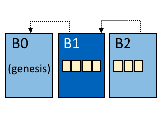
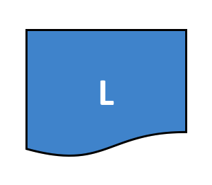
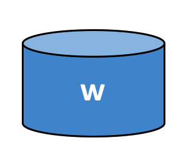

Термины и определения
=====================

Терминология важна, поскольку именно благодаря ей пользователи и разработчики Hyperledger Fabric понимают, что мы подразумеваем, используя
тот или иной термин. Например, что такое смарт-контракт. Документация будет ссылаться на глоссарий по мере необходимости, но можно прочитать его
и просто так, если хотите, это довольно познавательно!

.. _Anchor-Peer:

Якорный (одноранговый) узел
---------------------------

Используется протоколом gossip для того, чтобы одноранговые узлы разных организаций знали друг о друге.

Когда записывается конфигурационный блок, содержащий обновление для якорных узлов, одноранговые узлы обращаются к
якорным узлам и узнают от них обо всех известных им одноранговых узлах. Как только хотя бы один одноранговый узел из
каждой организации обратился к якорному узлу, якорный узел получает информацию обо всех одноранговых узлах в канале.
Т.к. обмен данными через протокол gossip выполняется постоянно, а одноранговые узлы всегда просят сообщать им о
существовании неизвестных им одноранговых узлов, для канала может быть сформировано общее представление о членстве.

Например, предположим, что в канале представлены три организации, ``A``, ``B`` и ``C``, и один якорный узел ``peer0.orgC``,
определенный для организации ``C``. Когда узел ``peer1.orgA`` (из организации ``A``) обратится к узлу ``peer0.orgC``, он
сообщит ему информацию о себе. А когда позже узел ``peer1.orgB`` обратиться к ``peer0.orgC``, он получит от узла
``peer0.orgC`` информацию об узле ``peer0.orgA``. После этого организации ``A`` и ``B`` начнут обмениваться информацией
о членстве без какой-либо помощи узла ``peer0.orgC``.

Поскольку связь между организациями для работы зависит от протокола gossip, в конфигурации канала должен быть определен
хотя бы один якорный узел. Настоятельно рекомендуется каждой организации предоставить свой набор якорных узлов
для обеспечения высокой доступности и избыточности.

.. _glossary_ACL:

ACL
---

ACL, или список контроля доступа, назначает доступ к определенным ресурсам одноранговых узлов (таким как API-интерфейсы системного чейнкода или
событийные службы) через :ref:`политику<Policy>` доступа (она определяет количество и типы организаций и ролей, которым предоставляется доступ).
ACL является частью конфигурации канала, поэтому она сохраняется в блоках  конфигурации канала и может быть обновлена через стандартный механизм
обновления конфигурации.

ACL задается как список пар ключ-значение, где ключ -- это ресурс, доступом к которому мы хотим управлять, а значение определяет политику канала
-- группу, которой разрешен доступ к ресурсу. Например, наличие в этом списке пары ``lscc/GetDeploymentSpec: /Channel/Application/Readers``
означает, что доступ к API жизненного цикла чейнкода ``GetDeploymentSpec`` (это ресурс) имеют идентификаторы, удовлетворяющие политике
``/Channel/Application/Readers``.

Набор стандартных ACL приведен в файле ``configtx.yaml``, который ``configtxgen`` использует для создания конфигурации канала.
Этот набор находится в секции ``Application`` файла ``configtx.yaml``. Он может быть переопределен для конкретного профиля в секции ``Profiles``.

.. _Block:

Блок
-----

   Блок B1 привязан к блоку B0. Блок B2 привязан к блоку B1.

=======

Блок содержит упорядоченный набор транзакций. Он криптографически привязан к предыдущему блоку, а тот, в свою очередь, связан с предыдущими блоками.
Первый блок в цепочке блоков называется **первичным или genesis-блоком**. Блоки создаются службой упорядочения, а потом валидируются и вносятся в
реестр одноранговыми узлами.

.. _Chain:

Блокчейн
--------

.. figure:: ./glossary/glossary.blockchain.png
   :scale: 75 %
   :align: right
   :figwidth: 40 %
   :alt: Blockchain

   Блокчейн B contains blocks 0, 1, 2.

=======

Блокчейн реестра -- журнал транзакций, структурированный в виде блоков транзакций,
связанных между собой с помощью хэш-связи. Одноранговые узлы получают блоки от службы
упорядочения, на основе политик одобрения и нарушений, связанных с одновременностью
выполнения, помечают транзакции блока как валидные или невалидные, и добавляют блок в
локальную копию блокчейна на файловой системе однорангового узла.

.. _chaincode:

Чейнкод
-------

См :ref:`Смарт-контракт<Smart-Contract>`.

.. _Channel:

Канал
-------

.. figure:: ./glossary/glossary.channel.png
   :scale: 30 %
   :align: right
   :figwidth: 40 %
   :alt: A Channel

   Канал C объединяет приложение A1, одноранговый узел P2 и службу упорядочения O1.

=======

Канал -- это логически выделенный частный блокчейн, обеспечивающий изоляцию и
конфиденциальность. Относящийся к каналу реестр совместно используется всеми
одноранговыми узлами в этом канале, а стороны транзакций должны быть
аутентифицированы в канале для взаимодействий с ним. Каналы задаются
:ref:`блоком конфигурации<Configuration-Block>`.

.. _Commit:

Запись (Commit)
-------------------

Каждый :ref:`одноранговый узел<Peer>` канала проверяет упорядоченные блоки транзакций, а затем записывает блоки в свою
копию реестра, относящегося к каналу. Одноранговые узлы также помечают каждую транзакцию в блоке как действительную
или недействительную.

.. _Concurrency-Control-Version-Check:

Процедура контроля одновременности версий
------------------------------------------

Процедура контроля одновременности версий (Concurrency Control Version Check) -- метод, обеспечивающий синхронизацию
состояния реестра между одноранговыми узлами канала. Одноранговые узлы могут одновременно выполнять разные транзакции,
поэтому перед записью в реестр одноранговые узлы проверяют, что состояние, прочитанное во время выполнения транзакции,
не было изменено ни в блоке, который находился в процессе подготовки одновременно с выполнением транзакции, ни в одной
из предыдущих транзакции в текущем блоке. Если данные, прочитанные для транзакции, изменились между моментом выполнения и
моментом записи, то произошло нарушение процедуры контроля одновременности версий, транзакция записывается в реестр
как недействительная, а значения в базе данных состояний не обновляются.

.. _Configuration-Block:

Блок конфигурации
------------------

Содержит данные конфигурации, определяющие участников и политики системного
канала (службы упорядочения) или обычного канала. Любое изменение конфигурации
(например, исключение или добавление участников) ведет к созданию нового
конфигурационного блока, добавляющегося в соответствующий блокчейн.
Этот блок включает содержимое первичного блока + изменения.

.. _Consensus:

Консенсус
---------

Более широкое понятие, охватывающее весь процесс выполнения транзакции, который предназначен для выработки соглашения об
очередности включения транзакций в блок и подтверждения корректности набора транзакций, составляющих блок.

.. _Consenter-Set:

Множество согласующих
---------------------

В службе упорядочения на основе Raft_ существуют узлы службы упорядочения, активно участвующие в механизме достижения
консенсуса в канале. Если другие узлы службы упорядочения существуют в системном канале, но не являются частью
данного канала, то они не входят во множество согласующих этого канала.

.. _Consortium:

Консорциум
----------

Консорциум - это совокупность организаций в сети блокчейн, не участвующих в службе упорядочения. Эти организации
могут формировать каналы и присоединяться к ним, а также владеть одноранговыми узлами. Хотя сеть блокчейн может
иметь несколько консорциумов, большинство сетей блокчейн имеют один консорциум. При создании канала все организации,
добавленные в канал, должны быть частью одного консорциума. Однако организация, которая не определена в консорциуме,
может быть добавлена в существующий канал.

.. _Chaincode-definition:

Определение чейнкода
--------------------

Определение чейнкода (Chaincode definition) используется организациями для согласования параметров чейнкода, прежде
чем он может быть использован в канале. Каждый участник канала, который хочет использовать чейнкод для создания и
одобрения транзакций или для совершения запросов к реестру, должен одобрить определение чейнкода для своей организации.
После получения одобрения от достаточного количества участников определение чейнкода сохраняется в канале.
Под достаточным количеством участников подразумевается такое, которое удовлетворяет политике одобрения
жизненного цикла. По умолчанию -- это большинство организаций канала. После этого, первый вызов чейнкода
(или, если требуется, выполнение функции Init) запустит чейнкод в канале.

.. _Dynamic-Membership:

Динамическое членство
---------------------

Hyperledger Fabric поддерживает добавление/исключение участников, одноранговых узлов, узлов службы упорядочения без
ущерба для работоспособности всей сети. Динамическое членство (Dynamic Membership) крайне важно во время развития
бизнес-отношений, когда различные сущности должны быть исключены/добавлены по разным причинам.

.. _Endorsement:

Одобрение
-----------

Процесс, в котором определенные одноранговые узлы выполняют чейнкод-транзакцию и возвращают ответ на запрос одобрения
клиентскому приложению. Такой ответ включает в себя результат работы чейнкода, набор чтения-записи, события, а так же
подпись, являющуюся доказательством того, что одноранговый узел выполнил чейнкод. Одноранговые узлы, которые могут
выполнять одобрение, указываются в :ref:`политике одобрения<Endorsement-policy>` чейнкода.

.. _Endorsement-policy:

Политика одобрения
----------------------

Определяет одноранговые узлы канала, которые должны выполнить транзакцию, связанную с определенным чейнкодом, а также
требуемый набор ответов (одобрений). Политика одобрения может требовать, как одобрение транзакции некоторым
минимальным количеством/процентом одноранговых узлов, так и всеми одноранговыми узлами, назначенными для данного чейнкода.
Политика может зависеть от конкретного приложения или от необходимого уровня устойчивости от неправомерного поведения
(умышленного или нет) одобряющих одноранговых узлов. Выполняемая транзакция должна полностью соответствовать политике одобрения,
прежде чем обновляющие узлы смогут отметить ее как действительную.

.. _Follower:

Ведомый
-------

В протоколе консенсуса на основе выбора ведущего, таком как Raft_, ведомые копируют журнальные записи, созданные ведущим.
В Raft ведомые также получают от :ref:`ведущего<Leader>` регулярные сообщения -- "сердцебиения". В случае, если ведущий
перестает посылать эти сообщения в течение заданного времени, ведомые инициируют выборы ведущего, пока один из них
не будет избран новым ведущим.

.. _Genesis-Block:

Первичный блок
---------------

Блок конфигурации, который инициализирует службу упорядочения или служит первым блоком блокчейна.

.. _Gossip-Protocol:

Протокол gossip
---------------

Протокол распространения данных gossip выполняет три функции:
1) заведует обнаружением одноранговых узлов и членством в канале;
2) распространяет данные реестра по всем одноранговым узлам канала;
3) синхронизирует состояние реестра у всех одноранговых узлов канала.
Более подробную информацию см. в теме :doc:`Протокол распространения данных gossip <gossip>`.

.. _Fabric-ca:

Hyperledger Fabric CA
---------------------

Hyperledger Fabric CA -- стандартный компонент удостоверяющего центра (CA), который выдает сертификаты на основе
инфраструктуры открытых ключей (PKI) участниками сети и их пользователям. Удостоверяющий центр выдает один корневой
сертификат (rootCert) каждому участнику и один сертификат регистрации (ECert) каждому авторизованному пользователю.

.. _Init:

Init
----

Метод инициализации чейнкода. Функция Init должна быть в любом чейнкоде, но по умолчанию она никогда
не выполняется. Однако в определении чейнкода вы можете потребовать проводить инициализацию чейнкода через
вызов функции Init.

Установка
----------

Процесс размещения чейнкода на файловой системе однорангового узла.

Запуск копии (Instantiate)
----------------------------

Процесс запуска и инициализации чейнкода в определенном канале. После запуска копии чейнкода одноранговые узлы,
у которых он установлен, могут принимать его вызовы.

**Обратите внимание**: *Этот метод, т.е. запуск копии, был использован в 1.4.x и более ранних версиях
жизненного цикла чейнкода. Текущая процедура, используемая для запуска чейнкода в канале с новым
жизненным циклом, представленным в Fabric v2.0, описана в разделе* :ref:`Определение чейнкода<Chaincode-definition>`.

.. _Invoke:

Вызов (Invoke)
----------------

Используется для вызова функций чейнкода. Отправляя одноранговому узлу запрос на транзакцию клиентское приложение
**вызывает** чейнкод. Одноранговый узел, в свою очередь, выполняет чейнкод и возвращает клиентскому приложению ответ
на запрос. Клиентское приложение собирает достаточное для удовлетворения политики одобрения количество ответов на
запрос, и отправляет результаты транзакции для упорядочивания, проверки и записи. Клиентское приложение может и не
отправлять результаты транзакции. Например, если **вызов** касается только чтения из реестра, то клиентское приложение,
обычно, не отправляет дальше результаты этой транзакции, если только нет задачи зарегистрировать чтение в реестре
для целей аудита. **Вызов** включает в себя идентификатор канала, функцию чейнкода, которую надо исполнить, а так же
массив аргументов.

.. _Leader:

Ведущий
-----

В протоколе консенсуса на основе выбора ведущего, таком как Raft_, ведущий отвечает за создание новых записей
журнала и отправку их последователям. Это не специальный тип узла службы упорядочения, а только роль,
которую узел может в одних случаях выполнять, а в других -- нет, в зависимости от обстоятельств.

.. _Leading-Peer:

Узел-лидер
-----------

Каждая :ref:`организация<Organization>` может иметь несколько одноранговых узлов в каждом канале, котором
она зарегистрирована.  Для взаимодействия со службой упорядочения один или несколько таких одноранговых
узлов должны выступать в качестве узла-лидера канала. Служба упорядочения доставляет блоки узлам-лидерам,
которые затем распространяют их среди остальных одноранговых узлов в рамках организации.

.. _Ledger:

Реестр
------

   Реестр L

======

Реестр состоит из двух отдельных, но связанных друг с другом частей -- "блокчейна" и
"базы данных состояний", также известной как "глобальное состояние". В отличие от других реестров,
блокчейн **неизменяем** -- в том смысле, что с того момента, как блок был добавлен в блокчейн,
блок не может быть изменен. В то же время, "глобальное состояние" -- это база данных, содержащая
текущие значения набора пар ключ-значение которые были добавлены, изменены или удалены
набором проверенных и записанных в блокчейн транзакций.

Удобно представлять, что для каждого канала **логически** существует только один реестр. В действительности
каждый одноранговый узел ведет свою собственную копию реестра, синхронизируемая с копиями других одноранговых
узлов через процесс с названием **консенсус**. Термин **Технология распределенного реестра** (**DLT**,
**Distributed Ledger Technology**) часто используется именно с таким видом реестра, который логически един,
но физически представляет собой набор копий, распределенных по множеству узлов сети (одноранговых узлов
и узлов службы упорядочения).

.. _Log-entry:

Журнальная запись
-----------------

Журнальные записи передаются от ведущего к ведомым как первичная единица работы в службе упорядочения Raft.
Полная последовательность таких записей называется "журнал" (log). Журнал считается последовательным, если
все участники согласны с записями и их порядком.

.. _Member:

Участник
--------

См. :ref:`Организация<Organization>`.

.. _MSP:

Провайдер службы членства (MSP)
-------------------------------

   MSP 'ORG.MSP'

Провайдер службы членства (MSP) -- абстрактный компонент системы, который предоставляет
учетные данные клиентам и одноранговым узлам для их участия в сети Hyperledger Fabric.
Клиенты используют эти учетные данные для аутентификации своих транзакций, а одноранговые
узлы -- для аутентификации результатов обработки транзакций (одобрений).
Хотя провайдер службы членства сильно связан со всем процессом обработки транзакций,
его интерфейс определен так, что его альтернативные реализации можно плавно подключать
без изменения ядра компонентов системы обработки транзакций.

.. _Membership-Services:

Служба членства
----------------

Служба членства (службы состава) аутентифицирует, авторизует и управляет идентификаторами.
Это основанная на инфраструктуре открытых ключей (PKI) реализация провайдера службы членства (MSP).

.. _Ordering-Service:

Служба упорядочения
-------------------

Также известная как **ордерер**. Определенная группа узлов, которая упорядочивает транзакции в блок, а затем
распределяет блоки одноранговым узлам для проверки и записи. Служба упорядочивания существует независимо от
процессов одноранговых узлов и упорядочивает транзакции в порядке поступления для всех каналов сети.
Она разработана для поддержки подключаемых реализаций, выходящих за рамки готовых вариантов Kafka и Raft.
Служба упорядочения объединяет всю сеть и содержит криптографические материалы идентификации, связанные
с каждым :ref:`участником<Member>`.

.. _Organization:

Организация
-----------

=====

.. figure:: ./glossary/glossary.organization.png
   :scale: 25 %
   :align: right
   :figwidth: 20 %
   :alt: An Organization

   Организация 'ORG'

Также известные как "участники сети", организации приглашаются к присоединению к сети блокчейн провайдером
сети блокчейн. Организации присоединяется к сети путем добавлением в сеть их :ref:`провайдера службы членства<MSP>`
(MSP), который определяет, как другие участники сети могут проверить, что подписи (например, подписи транзакций)
были созданы действительным идентификатором, выпущенным этой организацией. Конкретные права доступа идентификаторов
в рамках MSP регулируются политиками, которые также согласовываются при подключении организации к сети. 
Размер организации может быть произвольным. Конечной точкой транзакции в организации является
:ref:`одноранговый узел<Peer>`. Совокупность организаций образует :ref:`Консорциум<Consortium>`. Хотя все организации
сети являются участниками сети, не каждая организация будет входить в консорциум.

.. _Peer:

Одноранговый узел (peer)
------------------------

.. figure:: ./glossary/glossary.peer.png
   :scale: 25 %
   :align: right
   :figwidth: 20 %
   :alt: A Peer

   Одноранговый узел 'P'

Субъект сети, поддерживающий копию реестра и исполняющий чейнкод для выполнения операций с реестром.
Одноранговые узлы принадлежат и поддерживаются участниками.

.. _Policy:

Политика
--------

Политики -- это выражения, состоящие из параметров цифровых идентификаторов, например
``OR('Org1.peer', 'Org2.peer')``. Они используются для ограничения доступа к ресурсам в сети блокчейн.
Например, они диктуют, кто может читать данные из канала или записывать их в канал, или кто
может использовать определенное API чейнкода через ACL_.
Политики могут быть определены в ``configtx.yaml`` перед загрузкой службы упорядочения или созданием канала,
или они могут быть определены во время запуска копии чейнкода в канале.
Стандартный набор политик входит в шаблон ``configtx.yaml``. Он подойдет для большинства сетей.

.. _glossary-Private-Data:

Частные данные
-----------------------

Конфиденциальные данные, хранящиеся в частной базе данных каждого авторизованного однорангового узла и
логически отделенные от данных реестра канала. Доступ к этим данным ограничивается для одной или нескольких
организаций канала посредством **определения коллекции частных данных**. В реестре канала неавторизованных
организаций в качестве свидетельства транзакции будет находиться хеш частных данных. Также, для обеспечения
конфиденциальности, :ref:`службе упорядочения<Ordering-Service>` поступают только хеши данных, а не сами
частные данные.

.. _glossary-Private-Data-Collection:

Коллекция частных данных (Коллекция)
---------------------------------------------

Используется для управлениями конфиденциальными данными, которые две или более организаций в канале хотят
сохранить в тайне от других организаций в этом канале. **Определение коллекции** описывает подмножество
организаций канала, имеющих право хранить набор конфиденциальных данных, что в свою очередь подразумевает,
что только эти организации могут совершать операции с конфиденциальными данными.

.. _Proposal:

Запрос на одобрение
-------------------

Запрос на одобрение, который направляется конкретным одноранговым узлам канала. Любой запрос на
одобрение -- это либо Init_, либо обычный :ref:`вызов<Invoke>` (чтение/запись).

.. _Query:

Запрос (Query)
--------------

Запрос (поисковый запрос) -- вызов чейнкода, который читает текущее состояние реестра, но ничего в него не записывает.
Функция чейнкода может запрашивать из реестра отдельные ключи или набор ключей. Поскольку запросы не изменяют состояние
реестра, клиентское приложение обычно не отправляет эти транзакции, предназначенные только для чтения, на упорядочивание,
проверку и запись. Хотя это не является типичным, клиентское приложение может выбрать отправку транзакции только для
чтения в службу упорядочения, проверку и запись, например, если клиент хочет получить проверяемое доказательство в
блокчейне, что он знал определенное состояние реестра в определенный момент времени.

.. _Quorum:

Кворум
------

Описывает минимальное количество членов из :ref:`множества согласующих<Consenter-Set>`, которое должно подтвердить 
запрос на одобрение, с тем чтобы транзакции могли быть упорядочены. Для каждого набора множества согласующих это
**большинство** узлов. В кластере с пятью узлами три должны быть доступны, чтобы был кворум. Если кворум узлов
недостижим по какой-либо причине, кластер становится недоступным для операций чтения и записи.

.. _Raft:

Raft
----

Поддерживаемая с v1.4.1, Raft -- это реализация службы упорядочивания с отказоустойчивостью (CFT),
основанная на `библиотеке etcd <https://coreos.com/etcd/>`_ `протокола Raft <https://raft.github.io/raft.pdf>`_. Raft использует модель
":ref:`ведущего<Leader>` и :ref:`ведомого<Follower>`", где выбирается ведущий узел (в канале)
и его решения копируются ведомыми. Службы упорядочения Raft проще в настройке и управлении, чем
службы упорядочения Kafka, а их архитектура позволяет организациям вносить свой вклад в
распределенную службу упорядочивания.

.. _SDK:

Комплект разработчика (SDK)
------------------------------

Клиентский комплект разработчика Hyperledger Fabric (SDK) предоставляет разработчикам структурированную среду
библиотек для написания и тестирования чейнкодов. SDK полностью настраивается и расширяется через стандартный
интерфейс. Компоненты SDK, включающие криптографические алгоритмы для подписей, фреймворки для логирования и
хранения состояний, легко заменяются. SDK предоставляет API для обработки транзакции, работы со службой членства,
обхода узлов и обработки событий.

В настоящее время существует три официально поддерживаемых SDK - для Node.js, Java и Go. SDK для Python пока не
является официальным, но его можно загрузить и протестировать.

.. _Smart-Contract:

Смартконтракт
-------------

Смартконтракт -- это код, вызываемый внешним по отношению к сети блокчейн клиентским приложением,
который управляет доступом и изменениями к набору пар ключ-значение в :ref:`глобальном состоянии<World-State>`.
В Hyperledger Fabric смартконтракты представлены в виде :ref:`чейнкодов<Chaincode>`. Чейнкод
устанавливается на одноранговые узлы, затем определяется и используется в одном или нескольких
каналах.

.. _State-DB:

База данных состояний
---------------------

Для эффективного чтения и обработки запросов от чейнкода данные глобального состояния хранятся в базе данных
состояний. Поддерживаемые базы данных включают levelDB и couchDB.

.. _System-Chain:

Системный блокчейн
------------------

Содержит блок конфигурации, определяющий сеть на системном уровне. Системный блокчейн находится внутри службы
упорядочения и, подобно каналу, имеет начальную конфигурацию, содержащую такую информацию, как информация о MSP,
политики и детали конфигурации. Любое изменение в общей сети (например, присоединение новой организации или
добавление нового узла службы упорядочения) приведет к добавлению нового блока конфигурации в системный блокчейн.

Системный блокчейн можно представить как общую структуру, связывающую канал или группу каналов. Например, группа
финансовых учреждений может сформировать консорциум, представленный через системный блокчейн, а затем приступить
к созданию каналов в соответствии с их совпадающими и различающимися бизнес-задачами.

.. _Transaction:

Транзакция
----------

.. figure:: ./glossary/glossary.transaction.png
   :scale: 30 %
   :align: right
   :figwidth: 20 %
   :alt: A Transaction

   Транзакция 'T'

Транзакции создаются при вызове чейнкода из клиентского приложения для чтения или записи данных из реестра.
Клиенты приложения Fabric отправляют запросы на одобрение транзакций одобряющим узлам, собирают подписанные
(одобренные) ответы этих узлов, а затем упаковывают результаты выполнения и подписи в транзакцию, которая
передается в службу упорядочения, где транзакции упорядочиваются и помещаются в блок. Готовые блоки
рассылаются одноранговым узлам для проверки, записи транзакций в реестр и обновления глобального состояния.

.. _World-State:

Глобальное состояние
--------------------

   Глобальное состояние 'W'

Также известное как “текущее состояние”, глобальное состояние является компонентом :ref:`реестра<Ledger>` Hyperledger Fabric.
Глобальное состояние хранит последние значения всех ключей, включенных в журнал транзакций блокчейна. Чейнкод
выполняет запросы на транзакции с данными глобального состояния, потому что глобальное состояние обеспечивает
прямой доступ к последним значениям этих ключей, вместо того чтобы вычислять их, просматривая весь журнал транзакций.
Глобальное состояние изменяется каждый раз, когда меняется значение ключа (например, когда право собственности на
автомобиль -- "ключ" -- переходит от одного владельца к другому -- "значение"), или когда добавляется новый
ключ (выпуск автомобиля). В результате, глобальное состояние является критическим для исполнения транзакций, поскольку
текущее состояние пары "ключ-значение" должно быть известно до того, как оно может быть изменено. Одноранговые узлы
записывают последние значения в глобальное состояние реестра для каждой действительной транзакции, включенной в
обрабатываемый блок.

.. Licensed under Creative Commons Attribution 4.0 International License
   https://creativecommons.org/licenses/by/4.0/
