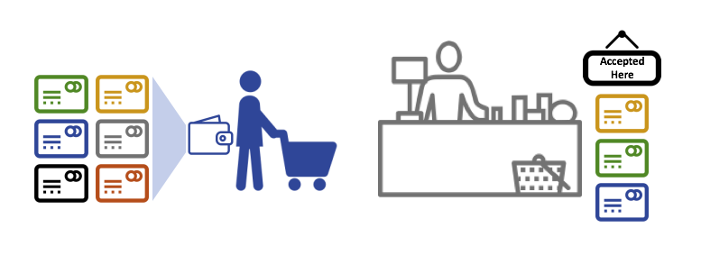
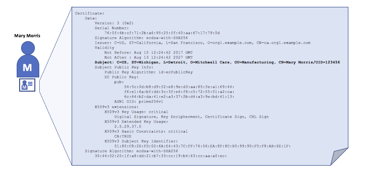
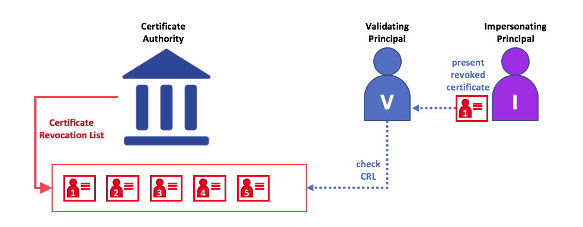

# Identity

## Что такое Identity?

Участниками блокчейн-сети являются пиры, ordering-службы, клиентские приложения,
администраторы и многие другие. Каждый участник --- активный элемент, способный 
потреблять услуги, находящийся внутри сети или за ее пределами  --- имеет цифровую 
identity, инкапсулированную в цифровом сертификате X.509. Identity имеет большое значение, 
поскольку она **определяет разрешения на ресурсы и доступ к информации, которыми владеют 
участники блокчейн-сети.**

Помимо этого цифровая identity имеет некоторые дополнительные атрибуты, которые Fabric
использует для определения разрешений. У совокупности identity и связанных с ней атрибутов
существует специальное имя --- **principal**. Principals похожи на userIDs или groupIDs, но
являются более гибкими, поскольку могут включать в себя широкий спектр свойств, определяющих
identity участника. Principals - наборы свойств, определяющие их права.

Чтобы identity была **проверяемой**, она должна исходить от **trusted** authority (доверенного
органа). [MSP](../membership/membership.html) (Membership service provider) является этим 
доверенным органом в Fabric. Говоря конкретнее, MSP - компонент, определяющий правила, которые
управляют валидными identities для этой организации. По умолчанию MSP реализация Fabric
использует сертификаты X.509  в качестве identities, придерживаясь традиционной Public Key
Infrastructure (PKI) иерархической модели (больше про PKI чуть позже).

## Простой сценарий, объясняющий использование Identity

Представьте, что вы зашли в супермаркет, чтобы купить некоторые товары. На кассе вы видите знак,
что принимаются только карты Visa, Mastercard и AMEX. Если вы хотите заплатить другой картой ---
назовем ее “ImagineCard” --- не важно реальна ли она и есть ли у вас на ней деньги. Ее не
примут.

*Иметь валидную кредитную карточку недостаточно --- ее должны принимать в магазине! PKI и MSP 
работают вместе таким же образом --- PKI предоставляет список identities, а MSP говорит, кто из 
них состоит в сети определенной организации, которая участвует в сети.*

PKI CA (certificate authorities --- сертифицированные органы) и MSP предоставляют похожий набор 
функций. PKI как поставщик карты --- он предоставляет множество видов проверяемых identities. С 
другой стороны, MSP как список поставщиков карт, принимаемых в магазине, определяющий, какие 
identities --- доверенные члены (участники) магазинной платежной сети. **MSP превращает 
проверяемых identities в членов блокчейн-сети**.

Давайте рассмотрим эти концепции более детально.

## Что такое PKI?

**Public key infrastructure (PKI) (инфраструктура публичного ключа) это набор интернет-
технологий, которые обеспечивают безопасные коммуникации в сети.**  Именно PKI ставит **S** в 
**HTTPS** --- и, если вы читаете эту документацию в веб-браузере, вы тоже скорее всего 
используете PKI, чтобы удостовериться, что она получена из проверенного источника. 

*Элементы Public Key Infrastructure (PKI). PKI состоит из Certificate
Authorities, которые выдают цифровые сертификаты сторонам (например, пользователям и поставщикам 
услуг), которые в свою очередь используют их, чтобы аутентифицировать себя в сообщениях, 
которыми они обмениваются в окружающей среде. Certificate Revocation List (CRL) (список отзыва 
сертификатов) CA --- справочник сертификатов, утративших валидность. Отзыв сертификата может 
произойти по ряду причин. Например, сертификат может быть аннулирован, если криптографические 
приватные материалы, привязанные к нему, просрочены.*

Хотя блокчейн-сеть это скорее сеть коммуникаций, она основана на стандарте PKI, для того чтобы 
обеспечить безопасную связь между различными участниками сети и надлежащую аутентификацию 
сообщений, размещенных в блокчейн-сети. Важно понимать азы PKI и почему MSP так важны.

У PKI четыре ключевых элемента:

 * **Цифровые сертификаты**
 * **Публичные и приватные ключи**
 * **Certificate Authorities**
 * **Certificate Revocation Lists**

Давайте немного поговорим об этих элементах PKI, а если вы хотите знать больше деталей, можно 
начать с [Wikipedia](https://en.wikipedia.org/wiki/Public_key_infrastructure).

## Цифровые сертификаты

Цифровой сертификат --- это документ, который содержит атрибуты владельца сертификата. Самый 
распространенный тип сертификата это соответствующий [X.509 standard]
(https://en.wikipedia.org/wiki/X.509), который позволяет кодировать идентификационные данные 
стороны в ее структуре.

К примеру, Мэри Моррис из Производственного подразделения Mitchell Cars в Детройте, Мичиган 
может иметь цифровой сертификат с атрибутом “SUBJECT”  `C=US`, `ST=Michigan`, `L=Detroit`, 
`O=Mitchell Cars`, `OU=Manufacturing`, `CN=Mary Morris /UID=123456`.
Сертификат Мэри похож на ее социальную карту --- он предоставляет информацию о Мэри, с помощью 
которой вы можете узнать ключевые факты о ней. Существует множество других атрибутов в 
сертификате X.509, но давайте пока сконцентрируемся на этих.

*Цифровой сертификат описывает сторону по имени Мэри Моррис. Мэри это `SUBJECT` (субъект) 
сертификата, и выделенный `SUBJECT` текст указывает ключевые факты о Мэри. Сертификат также 
содержит гораздо больше информации, как вы можете видеть. Очень важно то, что публичный ключ 
Мэри содержится в ее сертификате, а личный (signing) нет. Личный ключ должен оставаться 
приватным.*

Важно, что все атрибуты Мэри могут быть записаны с использованием криптографии (буквально, 
**секретная запись**) так, что подделка аннулирует сертификат. Криптография позволяет Мэри 
показывать свой сертификат остальным, чтобы подтверждать свою личность, пока другая сторона 
доверяет поставщику сертификата, также называемому  **Certificate Authority** (CA). Пока CA 
хранит некоторую криптографическую информацию безопасным образом (с помощью его собственного 
**private signing key** (приватный личный ключ)), читающие сертификат Мэри могут быть уверены, 
что информация не была подделана или изменена --- она всегда будет иметь конкретные атрибуты 
Мэри Моррис. Можно думать о ее сертификате X.509, как о цифровой идентификационной карточке, 
которую невозможно изменить.

## Аутентификация, приватные и публичные ключи.

Аутентификация и целостность сообщений - важные концепции в области безопасной коммуникации. 
Аутентификация требует, чтобы стороны, которые обмениваются сообщениями были уверены в identity, 
написавшей определенное сообщение. “Целостность” в контексте сообщения означает то, что оно не 
может быть изменено во время передачи. Например, вы можете захотеть убедиться, что вы 
коммуницируете с настоящей Мэри Моррис, а не с ее двойником. Или, если Мэри посылает вам 
сообщение вы можете захотеть убедиться, что оно не было никем подделано во время передачи.

Традиционные механизмы аутентификации основываются на **цифровых подписях**, которые, как можно 
догадаться, позволяют стороне по-цифровому **подписать**  сообщение. Цифровые подписи также 
предоставляют гарантию целостности подписанного сообщения.

Строго говоря, механизмы цифровой подписи требуют, чтобы каждая сторона имела два 
криптографически связанных ключа: публичный ключ, который всем доступен и 
является аутентификационной привязкой, и приватный ключ, который используется для того, чтобы 
ставить на сообщениях **цифровую подпись**. Получатели сообщений с цифровой подписью могут 
проверить автора сообщения и его целостность, проверив, что прилагаемая подпись валидна для 
публичного ключа ожидаемого отправителя.

**Уникальное отношение между приватным ключом и публичным --- магия криптографии, которая делает 
возможным безопасное соединение.** Уникальное математическое отношение между ключами работает 
так, что приватный ключ можно использовать для создания на сообщении цифровой подписи, причем 
такой, что только соответствующий публичный ключ совпасть, причем только на этом сообщении.

В примере, приведенном выше, Мэри использует приватный ключ для подписи сообщения. Подпись может 
быть подтверждена любым, кто видит подписанное сообщение, с использованием ее публичного ключа.

## Certificate Authorities

Как вы могли убедиться, участник или узел может участвовать в блокчейн сети с помощью **цифровой 
identity**, выданной ему органом, которому доверяет система. Обычно цифровые identities (или 
просто **identities**) имеют форму криптографически проверенных цифровых сертификатов, 
соответствующих стандарту X.509 и выданных 
Certificate Authority (CA).

CA - обычная часть протоколов интернет-безопасности, и вы наверняка слышали о самых популярных: 
Symantec (раньше Verisign), GeoTrust, DigiCert,
GoDaddy, Comodo и другие.

*Certificate Authority раздает сертификаты разным участникам. Эти сертификаты имеют цифровую 
подпись CA и связывают друг с другом участника и его публичный ключ (и при необходимости с 
перечнем собственности). В результате, если первый участник доверяет CA (и знает его публичный 
ключ), он может быть уверен, что второй участник привязан к публичному ключу, указанному в 
сертификате, и обладает теми атрибутами, что там указаны, если подтвердит подпись CA на 
сертификате второго участника.*

Сертификаты могут быть широко распространены, поскольку они не содержат приватного ключа ни 
участника, ни CA. Они могут использоваться как залог доверия аутентификации сообщений от разных 
участников.

CA тоже владеет широко доступным сертификатом. Это позволяет проверять данные identity, выданных 
определенным CA, проверяя, что этот сертификат мог быть сгенерирован владельцем соответствующего 
приватного ключа (CA). 

Каждый участник блокчейн-сети, желающий взаимодействовать с сетью, должен иметь identity. Можно 
сказать, что **один или больше CA** используются для **определения членов организации с цифровой 
точки зрения.** CA обеспечивает участников организации поддающейся проверке цифровой identity.

### Корневые CA (Root CA), промежуточные CA (Intermediate CA) и цепочки доверия

CA бывают **корневыми CA** и **промежуточными CA**. Поскольку корневые CA (Symantec, Geotrust и 
др) должны **безопасно раздавать** сотни миллионов сертификатов интернет-пользователям, они 
поручают этот процесс так называемым **промежуточным CA**. Эти промежуточные CA имеют 
сертификаты, выданные корневым CA или другим промежуточным доверенным органом, что устанавливает 
так называемые “цепочки доверия” для всех сертификатов, выдаваемых любым звеном цепи CA. 
Возможность отследить корневого CA не только позволяет масштабировать CA, все еще обеспечивая 
безопасность --- позволяя организациям доверять промежуточным CA --- но и ограничивает корневых 
CA в их действиях, поскольку, если они будут скомпрометированы, это поставит под угрозу всю 
цепочку доверия. Если же будет скомпрометирован лишь промежуточный CA, то последствия будут 
гораздо меньше.

*Цепочка доверия устанавливается между корневым CA и группой промежуточных CA, пока у каждого из 
этих CA есть сертификат от корневого CA, или от промежуточного CA, входящего в цепочку доверия.*

Промежуточные CA обеспечивают большую гибкость при выдаче сертификатов во многих организациях, 
что очень полезно для permissioned-сети блокчейн (такой как Fabric). Например, вы увидите, что 
разные организации могут использовать разные корневые CA или одинаковые корневые CA, но разные 
промежуточные CA --- это зависит от нужд сети.

### CA Fabric

Поскольку CA очень важны, Fabric предоставляет встроенный компонент CA, чтобы позволить вам 
создавать CA в блокчейн-сети, формируемой вами. Этот компонент --- так называемый **Fabric CA** 
является приватным корневым провайдером CA, способным управлять цифровыми identities участниками 
Fabric, имеющими сертификат X.509. Поскольку Fabric CA это особый CA рассчитанный на нужды 
корневых CA Fabric, он не способен предоставлять SSL сертификаты для общего/автоматического 
использования в браузере. Однако, поскольку **некоторые** CA нужны для управления identity (даже 
в тестовой среде), Fabric CA может предоставлять и управлять 
сертификатами. Также возможно использовать публичный/коммерческий корневой или промежуточный CA 
для идентификации.

Если вы заинтересовались, можете почитать больше о Fabric CA [в секции документации CA]
(http://hyperledger-fabric-ca.readthedocs.io/).

## Certificate Revocation Lists

A Certificate Revocation List (CRL) (список аннулированных сертификатов) как можно догадаться ---
это просто список ссылок на аннулированные по той или иной причине сертификаты. Если 
обратиться к сценарию про магазин, то CRL это список украденных кредитных карт.

Когда третья сторона хочет проверить личность другой стороны, она сначала проверяет CRL, чтобы 
убедиться, что сертификат не был аннулирован. Проверяющая сторона не обязана это делать, но 
тогда она рискует принимая скомпрометированную личность.

*Использование CRL для проверки действительности сертификата. Если подельник пытается передать 
поддельный цифровой сертификат проверяющей стороне, его можно сначала сверить с CRL выдающего 
CA, чтобы убедиться, что он не в списке невалидных сертификатов.*

Следует отметить, что аннулированный сертификат сильно отличается от сертификата с истекшим 
сроком действия. Срок действия аннулированных сертификатов не истек 
--- они, по всем другим параметрам, являются валидными сертификатами. Чтобы узнать больше о CRL, перейдите [по ссылке](https://hyperledger-fabric-ca.readthedocs.io/en/latest/users-guide.html#generating-a-crl-certificate-revocation-list).

Теперь, когда вы видели, как PKI обеспечивает проверяемость identities с помощью цепочки доверия, следующий шаг --- понять, как эти identities используются для репрезентации доверенных членов блокчейн-сети. Здесь в игру входит Membership Service Provider (MSP) --- **он предоставляет identity стороне, являющейся членом определенной организации в блокчейн-сети.** 

Чтобы узнать больше про membership (членство), ознакомьтесь c [MSPs](../membership/membership.html).

<!---
Licensed under Creative Commons Attribution 4.0 International License https://creativecommons.org/licenses/by/4.0/
-->
