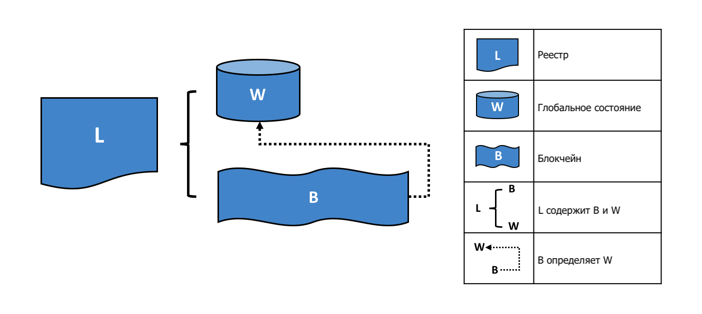
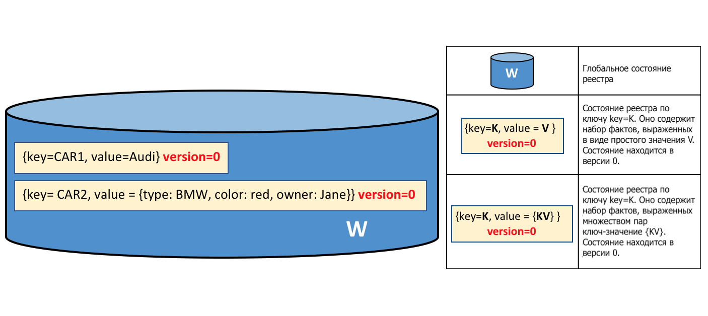
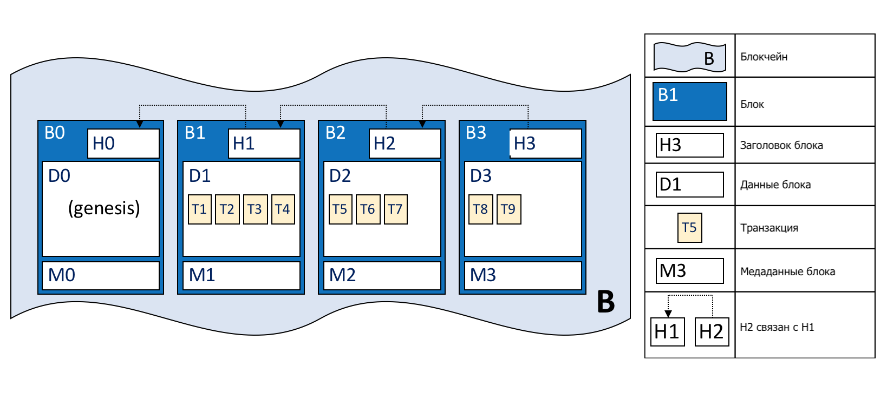
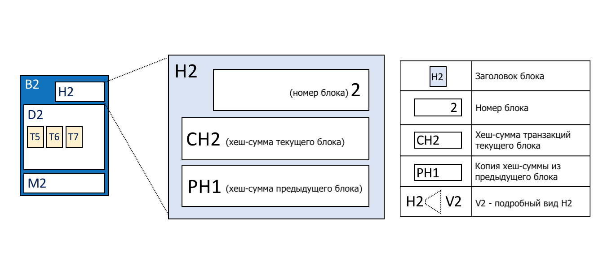
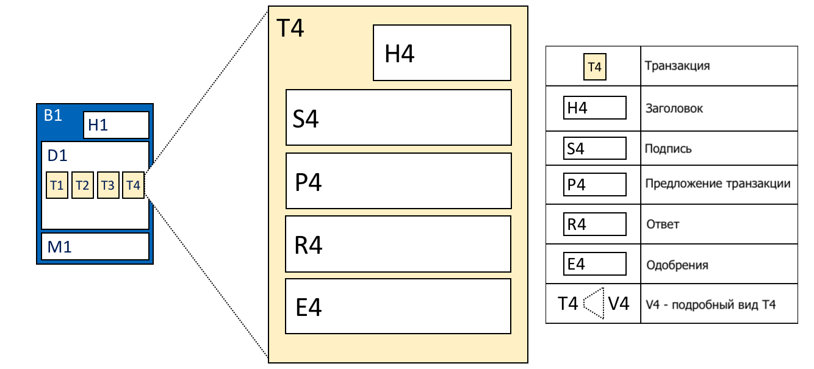

# Реестр

**Для кого это**: Архитекторы, разработчики приложений и смартконтрактов,
администраторы.

**Реестр** это ключевая концепция в Hyperledger Fabric; в нем хранится важная фактическая
информация про бизнес-объекты: как текущее состояние их атрибутов, так и история всех
транзакций, которые на них повлияли.

В этом разделе мы поговорим о:

* [Что такое реестр?](#what-is-a-ledger)
* [Хранение фактов о бизнес-объектах](#ledgers-facts-and-states)
* [Блокчейн-реестр](#the-ledger)
* [World state](#world-state)
* [Структура данных блокчейн](#blockchain)
* [Как хранятся блоки в блокчейне](#blocks)
* [Транзакции](#transactions)
* [Опции базы данных world state](#world-state-database-options)
* [Пример реестра **Fabcar**](#example-ledger-fabcar)
* [Реестры и пространства имен](#namespaces)
* [Реестры и каналы](#channels)

## Что такое Реестр?

Реестр содержит текущее состояние бизнеса в виде журнала транзакций. Первые Европейские и Китайские
реестры существуют уже 1000 лет, а шумеры имели [каменные реестры](http://www.sciencephoto.com/media/686227/view/accounting-ledger-sumerian-cuneiform)
более 4000 лет назад --- но давайте начнем с более современных примеров!

Вы, наверное, уже привыкли смотреть на свой банковский счет. Самым важным для вас, наверняка,
является баланс --- то, что вы можете потратить в данный момент времени. Если вы хотите
увидеть, откуда взялось это значение баланса, то вы можете просмотреть на предыдущие транзакции
кредитов и дебетов. Это пример реестра из реальной жизни --- состояние (текущий баланс) и
последовательность транзакций (кредиты и дебеты), которые поясняют его значение. Hyperledger
Fabric также руководствуется этими двумя соображениями --- представить текущее значение набора
состояний реестра, а также отобразить историю транзакций, которые привели к этим состояниям.

## Реестр, факты и состояния

Реестр не буквально хранит бизнес-объекты --- на самом деле, он хранит **факты** об этих
объектах. Когда мы говорим "мы храним бизнес-объект в реестре", мы имеем в виду лишь то, что
записываем факты о текущем состоянии объекта и факты об истории транзакций, предшествующих этому
состоянию. В развивающемся цифровом мире можно почувствовать, что мы действительно имеем дело с
объектом, а не с фактами о нем. В случае цифрового объекта, он скорее всего находится во внешнем
хранилище данных; факты, записываемые в реестр, позволяют нам идентифицировать его
местонахождение, а также дают ключевую информацию о нем.

В отличие от текущего состояния бизнес-объекта, которое может меняться со временем, история
фактов о нем **неизменна**, в нее можно добавить что-нибудь, но после добавления убрать это уже
нельзя. Сейчас мы увидим, что представлять блокчейн как неизменяемую историю фактов о бизнес-объектах --- это простой, но действенный ключ к его пониманию.

Давайте теперь присмотримся к структуре Hyperledger Fabric!

## Реестр

В Hyperledger Fabric реестр состоит из двух отдельных, но связанных частей --- world state и
блокчейн. Каждая из них представляет собой набор фактов о наборе бизнес-объектов.

Первая часть --- **world state** --- база данных, содержащая **текущие значения** набора
состояний реестра. World state предоставляет программе прямой доступ к текущему значению
состояния, позволяя не просчитывать его через весь журнал транзакций. Состояния реестра по
умолчанию хранятся в виде пар **ключ-значение**, и позже мы увидим, как Hyperledger Fabric
обеспечивает гибкость в этой области. World state может часто меняться, поскольку состояния
создаются, обновляются и удаляются.

Вторая часть --- **блокчейн** --- транзакционный журнал, записывающий все изменения, влияющие на
на текущий world state. Транзакции собраны в блоки, которые добавляются в блокчейн --- что
позволяет понять историю изменений, повлиявших на текущий world state. Структура данных блокчейн
сильно отличается от world state, поскольку после добавления нового блока, его уже нельзя
изменить или удалить; поэтому структуру блокчейн называют **неизменяемой**.

 *Журнал L содержит блокчейн B и
world state W, где блокчейн B определяет world state W. Можно сказать, что
world state W выводится из блокчейна B.*

Удобно представлять, что в сети Hyperledger Fabric существует **единственный логический** реестр.
Хотя на самом деле сеть поддерживает много копий реестра, которые согласуются между собой с
помощью процесса, называемого **консенсусом**. Термин **Distributed Ledger Technology**
(**DLT**) (Технология распределенного реестра) часто используется с таким типом реестра ---
единственного по смыслу, но хранящегося в множестве копий, распространенных по всей сети.

Давайте теперь рассмотрим структуры данных world state и блокчейн более подробно.

## World State

World state содержит текущее значение атрибутов бизнес-объектов в виде уникального состояния
реестра. Это полезно, поскольку для программ обычно требуется текущее состояния объекта; было бы
сложно каждый раз просматривать всю блокчейн-сеть, вычисляя текущее состояние объекта (например, его цену) --- вместо этого его можно напрямую получить из world state.

 *Реестр world state содержит
два состояния. Первое: key=CAR1 и value=Audi. Второе состояние имеет более сложную структуру:
key=CAR2
и value={model:BMW, color=red, owner=Jane}. Оба состояния версии 0.*

Состояние реестра содержит наборы фактов об определенных бизнес-объектах. Наш пример показывает
состояния реестра для двух машин, CAR1 и CAR2, каждое из которых имеет ключи и значения.
Приложение может вызвать смартконтракт, использующий простой API реестра, чтобы
**get**, **put** и **delete** (получить, добавить, удалить) состояния. Обратите внимание, что
значение состояния может быть простым (Audi...) или более сложным (type:BMW...). World state часто
используется, чтобы найти все объекты с определенными атрибутами, например, найти все красные
BMW.

World state представлен как база данных. В этом есть смысл, поскольку база данных предоставляет
большой набор операторов для эффективного хранения и извлечения состояний. Позже мы увидим, что
Hyperledger Fabric можно настроить так, чтобы он использовал разные базы данных world state,
отвечающие потребностям различных типов значений состояния и моделей доступа, таких как сложные
запросы.

Приложения подают транзакции, которые фиксируют изменения в world state, и эти транзакции
вносятся в реестр. Приложения изолированы от деталей механизма [консенсуса](../txflow.html) с помощью Hyperledger Fabric SDK; они просто вызывают смартконтракт и
понимают, когда транзакция была включена в блокчейн (неважно, валидная или нет). Ключевой момент
разработки заключается в том, что только транзакции, **подписанные** необходимыми **утвержающими
организациями** обновляют world state. Если транзакция не подписана утверждающими организациями,
она не сможет изменить world state. Можно почитать больше о том, как приложения используют
[смартконтракты](../smartcontract/smartcontract.html), и как их [разрабатывать](../developapps/developing_applications.html).

Вы можете заметить, что у состояния есть номер версии, например, на диаграмме, расположенной
выше, состояния CAR1 и CAR2 на начальной версии, то есть 0. Номер версии предназначен для
внутреннего пользования Hyperledger Fabric, и каждый раз, когда состояние изменяется, номер
увеличивается. Версия проверяется при обновлении состояния для того, чтобы убедиться, что
текущее состояние соответствует версии на момент одобрения. Таким образом, world state
изменяется ожидаемо, и не происходит параллельных обновлений.

Когда реестр только создан, world state пустует. Поскольку любая транзакция, отображающая
валидное изменение world change, записана в блокчейне, world state в любой момент можно
восстановить из блокчейна. Это может оказаться очень удобным --- например, world state
автоматически генерируется, когда создается пир. Более того, если пир некорректно завершает свою
работу, world state может быть восстановлен при перезагрузке пира, до того, как начнут приниматься
транзакции.

## Блокчейн

Если world state содержит набор
фактов, относящихся к текущему состоянию бизнес-объектов, то блокчейн --- это, в своем роде, летопись того, как эти
объекты пришли к их текущему состоянию. Блокчейн записывает каждую предыдущую версию каждого
состояния реестра и то, как он изменялся.

Блокчейн структурирован в виде журнала последовательных взаимосвязанных блоков, где каждый блок
состоит из последовательности транзакций, каждая из которых представляет собой запрос или
обновление world state. Про механизмы, упорядочивающие транзакции, можно узнать [здесь](../peers/peers.html#peers-and-orderers);
упорядочивание блоков, также как и упорядочивание
транзакций в блоках происходит, когда блоки создаются Hyperledger Fabric, компонентом под
названием **ordering-служба**.

Заголовок каждого блока включает в себя хэш транзакций этого блока, а также хэш заголовка
предыдущего блока. Таким образом, все транзакции в реестре упорядочены и криптографически
связаны между собой. Хэширование и связывание обеспечивают безопасность данных реестра. Даже
если один узел, поддерживающий реестр, был взломан, он не сможет убедить остальные узлы в том, что он
имеет корректный блокчейн, поскольку реестр распределен по сети независимых узлов.

Блокчейн, в отличие от world state, являющегося базой данной, всегда реализован в виде файла.
Это разумный выбор, поскольку структура данных блокчейн поддерживает только небольшой набор
простых операций. Добавление в конец блокчейна --- основная операция, а запрос, в настоящее время,
является редкоиспользуемой операцией.

Давайте более детально рассмотрим структуру блокчейн.

 *Блокчейн B содержит блоки
B0, B1, B2, B3. B0 --- первый блок, называемый genesis-блоком.*

Как можно видеть на диаграмме выше, **блок** B2 содержит **данные блока** D2, состоящие из
транзакций T5, T6, T7.

Что особенно важно, у B2 есть **заголовок блока** H2, который состоит из криптографического
**хэша** всех транзакций в D2, а также хэш H1. Таким образом, блоки неразрывно и неизменно
связаны друг с другом, что отражает суть термина **блокчейн** (цепь блоков).

И наконец, как можно видеть на диаграмме, первый блок в блокчейне называется **genesis-блоком**.
Genesis-блок --- точка отсчета реестра, хоть он и не содержит никаких пользовательских
транзакций. Вместо этого, он состоит из конфигурационной транзакции, содержащей начальное
состояние сетевого канала (не показано на диаграмме). Мы обсудим genesis-блок более подробно, когда будем
обсуждать блокчейн-сеть и [каналы](../channels.html) в документации.

## Блоки

Давайте присмотримся к структуре блока. Блок состоит из трех разделов.

* **Заголовок блока**

  Этот раздел состоит из трех полей, которые заполняются при создании блока.

  * **Номер блока**: Целое число, 0 у genesis-блока, у каждого следующего блока на 1 больше чем
  у предыдущего

  * **Хэш блока**: Хэш всех транзакций, содержащихся в данном блоке.

  * **Хэш предыдущего блока**: Хэш из заголовка предыдущего блока.
 
  Эти поля заполняются с помощью криптографического хэширования данных блока. Они обеспечивают
  неразрывную связь блоков, из-за чего реестр становится неизменным.

   *Детали заголовка блока. Заголовок H2
  блока B2 содержит номер блока (2), хэш CH2 данных блока
  D2, и хэш предыдущего заголовка блока H1.*

* **Данные блока**

  Этот раздел содержит список упорядоченных транзакций. Он записывается ordering-службой при
  создании блока. Эти транзакции имеют простую, но интересную структуру, которую мы обсудим
  [позже](#Transactions).

* **Метаданные блока**

  Этот раздел содержит сертификат и подпись создателя блока, которая используется для проверки
  блока сетевыми узлами. Создатель блока добавляет валидный/невалидный идентификатор для каждой
  транзакции в bitmap, который также находится в метаданных блока, также как и хэш совокупных
  обновлений состояния, произведенных до (включительно) данного блока, для того, чтобы
  обнаружить разветвления состояния.
  В отличие от данных блока и полей заголовка блока, этот раздел не учитываются при вычислении 
  хеша блока.

## Транзакции

Как мы уже поняли, транзакция отражает изменения в world state. Давайте более детально
рассмотрим структуру **данных блока** (blockdata), которая содержит транзакции блока.

 *Детали транзакций. Транзакция
T4 в данных блока D1 блока B1 состоит из заголовка транзакции, H4, подписи транзакции, S4,
proposal, P4, ответа на предложение о транзакции, R4, и списка подтверждений, E4.*

В примере, приведенном выше, можно видеть следующие поля:

* **Заголовок**

  Этот раздел, проиллюстрированный H4, содержит основные метаданные о транзакции --- например,
  имя соответствующей цепи и ее версию.

* **Подпись**

  Этот раздел, проиллюстрированный S4, содержит криптографическую подпись, созданную приложением
  клиента. Это поле подтверждает, что детали транзакции не были
  подделаны, поскольку для создания подписи требуется приватный ключ приложения.

* **Proposal**

  Этот раздел, проиллюстрированный P4, кодирует входные параметры смартконтракта,
  предоставленные приложением, который создает предложение обновить реестр.
  Когда выполняется смартконтракт, proposal дает ему набор входных
  параметров, которые, в сочетании с текущим world state, определяют новый world state.

* **Ответ**

  Этот раздел, проиллюстрированный R4, содержит значения world state до и после как
  **Read Write set** (RW-set). Это результат работы смартконтракта, и, если транзакция будет
  успешно подтверждена, она будет применена к реестру для обновления world state.

* **Подтверждения**

  Как показано в E4, это список подписанных ответов на proposal от всех требуемых для удовлетворения политики
  подтверждения организаций.

Мы разобрали основные поля транзакции --- существуют другие, однако это основные, которые
необходимо понять, чтобы иметь четкое представление о структуре данных реестра.

## Параметры базы данных World State

World state реализовано в виде базы данных, что обеспечивает простое и эффективное хранение и
поиск состояний реестра. Как мы уже знаем, состояния реестра могут иметь простое и более сложно
структурированное значение, и из-за этого реализация базы данных world state может
варьироваться. Реализация world state может основываться как на LevelDB, так и на CouchDB.

LevelDB, установленный по умолчанию, особенно удобен в случаях, когда состояние реестра это
простые пары ключ-значение. База данных расположена там же, где и узел пира --- она встроена в
тот же процесс операционной системы.

CouchDB --- правильный выбор, если состояния реестра структурированы в виде документов JSON,
поскольку CouchDB поддерживает сложные запросы и обновление сложных типов данных, которые часто
встречаются в транзакциях. Реализация CouchDB позволяет ему работать в отдельном процессе
операционной системы, но есть однозначное соответствие между пиром и экземпляром CouchDB. Смарт
контракты ничего этого не видят. Ознакомьтесь с [CouchDB в качестве State Database](../couchdb_as_state_database.html), если хотите узнать больше об использовании Couch DB.

В LevelDB и CouchDB мы видим важное качество Hyperledger Fabric --- **модульность**. База
данных world state может быть хранилищем данных, хранилищем графов или временной базой данных.
Это обеспечивает гибкость в выборе способа хранения состояний реестра, что позволяет Hyperledger
Fabric решать множество проблем самых разных типов.

## Пример реестра: fabcar

Под конец этой темы, давайте рассмотрим пример. Запустив [пример реестра fabcar](../write_first_app.html), вы создадите этот реестр.

Пример приложения fabcar создает набор из 10 уникальных машин; разного цвета, разного
производителя, разной модели и разного собственника. Вот так выглядит реестр после создания
первых четырех машин.

 *Реестр L состоит из world
state W и блокчейна B. W содержит четыре состояния с ключами CAR0, CAR1, CAR2
и CAR3. B содержит два блока, 0 и 1. Блок 1 содержит четыре транзакции:
T1, T2, T3, T4.*

World state содержит состояния, соответствующие CAR0, CAR1,
CAR2 и CAR3. Значение CAR0 дает понять, что это синяя Toyota Prius, в настоящее время
принадлежащая Tomoko. Такие же значения можно увидеть и у других машин. Более того, мы можем
видеть, что версия всех состояний машин --- 0, что показывает, что это их стартовый номер версии
--- их еще не обновляли после создания.

Мы также видим, что блокчейн содержит два блока. Блок 0 --- genesis-блок --- не содержит
транзакций, касающихся машин. Блок 1, однако, содержит транзакции T1, T2, T3, T4, которые
соответствуют транзакциям, создавшим начальные состояния в world state машинам CAR0, CAR1,
CAR2 и CAR3. Можно видеть, что блок 1 привязан к блоку 0.

Мы не показали оставшиеся поля блоков и транзакций, в частности заголовки и хэши. Если вас
интересуют детали, поищите в документации отдельную справочную страницу, в которой есть полностью
проработанный детальный пример целого блока и его транзакций --- ну, а пока вы достигли хорошего
понимания реестра Hyperledger Fabric.

## Пространства имен (namespaces)

Хотя мы и говорили, что у реестра есть единственный world state и единственный блокчейн, это
слегка упрощенное представление. На самом деле каждый чейнкод имеет собственный world state.
World states расположены в пространстве имен так, что лишь смартконтракты одного чейнкода имеют доступ к определенному пространству имен.

Блокчейн не разделен на пространства имен. Он содержит транзакции их разных пространств имен смартконтрактов. Больше про пространства
имен чейнкодов можно почитать [тут](../developapps/chaincodenamespace.html).

Давайте посмотрим, как концепция пространства имен применяется в каналах Hyperledger
Fabric.

## Каналы

В Hyperledger Fabric, каждый [канал](../channels.html) имеет полностью отдельный реестр,
что означает полностью отдельный блокчейн и полностью отдельный world state, включая пространство
имен. Приложения и смартконтракты могут общаться между каналами так, что информация реестров
передается между ними.

Про работу реестра и каналов можно почитать поподробнее
[здесь](../developapps/chaincodenamespace.html#channels).

## Больше информации

Ознакомьтесь с разделами [Транзакционный поток](../txflow.html),
[Семанитка Read-Write Set](../readwrite.html) and
[CouchDB в качестве State Database](../couchdb_as_state_database.html), чтобы узнать больше о
транзакционном потоке, контроле согласованности и базе данных world state.

<!--- Licensed under Creative Commons Attribution 4.0 International License
https://creativecommons.org/licenses/by/4.0/ -->
